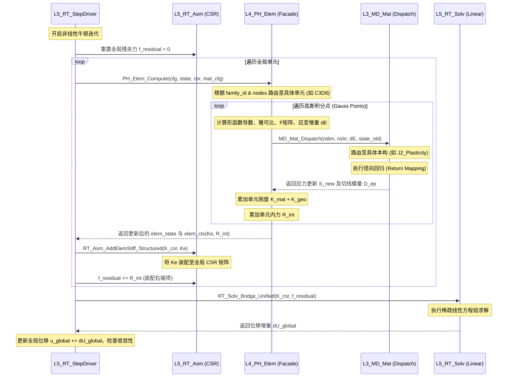

# UFC 新核物理计算闭环架构设计

## 1. 架构总览：打通“任督二脉”

UFC (Unified Finite-element Core) 新核的演进目标之一，是彻底摆脱旧核的“神级对象 (God Object)”和复杂的跨层依赖，实现清晰、解耦的现代化求解管线。

目前，我们已经成功实现了**核心计算链路的物理闭环**。该闭环贯穿了从宏观分析步控制到微观材料积分的全流程，包含以下四个核心节点：

1. **顶层分析步驱动 (L5_RT Step Driver)**：负责时间步进与牛顿-拉夫逊 (Newton-Raphson) 全局非线性迭代。
2. **单体结构化降维积分 (L4_PH Element)**：实现纯函数式的单元积分（如 C3D8, CPS4, CPE4），完成应变提列与形函数计算。
3. **弹塑性本构回归 (L3_MD Material)**：材料状态的径向回归更新（如 J2 等向强化），完成应力计算与切线模量推导。
4. **全局 CSR 组装与求解 (L5_RT Assembly & Solver)**：组装单元刚度至稀疏矩阵，并调用求解器闭合方程组。

---

## 2. 闭环数据流向 (Data Flow)

以下是闭环在单次牛顿迭代 (Newton Iteration) 中的详细执行流：

---

## 3. 核心模块详解

### 3.1 顶层驱动 (`L5_RT/StepDriver/RT_StepDriver_Brg.f90`)

- **定位**：运行时的“总司令”。
- **机制**：
  - 管理当前增量步 (`current_increment`) 和迭代步 (`current_iteration`)。
  - 统筹并行单元遍历（后续通过 OpenMP `!$omp parallel do` 加速）。
  - 维护和调度 `job_ctx` 临时运行时内存（如全局残余力、全局位移向量）。

### 3.2 结构化单元层 (`L4_PH/Element/Shared/PH_ElemRT_Brg.f90`)

- **定位**：单元算法门面（Facade）。
- **机制**：
  - **参数剥离**：抛弃包含数千个变量的旧结构体，严格限定入参仅为：`elem_cfg` (只读配置), `elem_state` (读写场变量), `elem_ctx` (当前步的工作上下文), `mat_cfg` (材料属性)。
  - **维度解耦**：通过 `mat_cfg%nshr` 等参数，在运行时自适应处理诸如平面应变 (`CPE4`) 与平面应力 (`CPS4`) 的路由。
  - **结构化分离**：剥离出 `PH_Elem_C3D8_NL_TL_Structured` 等方法，使得单体单元的实现代码缩减到极简状态，逻辑高度清晰。

### 3.3 本构评估器 (`L3_MD/Material/Bridge/MD_MatRT_Brg.f90`)

- **定位**：跨维度的材料库分发中心。
- **机制**：
  - **一键穿透**：`MD_Mat_Dispatch` 根据材料类型 ID 路由到具体的算法模块。
  - **真实物理回归**：原生集成了 `J2_Plasticity_Eval`，采用严格的 Von Mises 屈服准则和向后欧拉 (Backward Euler) 径向回归映射算法。
  - **自动维度适配**：通过 `ndim` 和 `nshr`，同一套 J2 代码可以兼容处理 3D (6分量) 或 2D (4分量并处理面外应力) 场景，无需维护两套独立的公式推导。

### 3.4 装配与求解网络 (`L5_RT/Asm` & `L5_RT/Solv`)

- **定位**：大规模稀疏方程组管理。
- **机制**：
  - 利用 `RT_Asm_AddElemStiff_Structured` 高效无锁或使用 Coloring 算法将局部刚度矩阵投影至 `RT_CSRMatrix`。
  - `RT_Solv_Bridge_Unified` 提供黑盒化的求解能力，支持调用 L2 层（MKL PARDISO, 迭代求解器等）。

---

## 4. 后续演进路线图 (Roadmap)

我们目前达成的MVP（Minimum Viable Product）只是起点。为了挑战极端的软化（Softening）和应变局部化（Strain Localization）等病态难题，我们将基于此闭环继续推进：

1. **引入高级控制策略**：
  - 将该标准的 Newton-Raphson 闭环与我们在旧核积累的 **弧长法 (ARC-CW)** 桥接。
  - 支持通过残余力与增量位移的正交性控制（Orthogonality Control）自适应调节载荷因子 $\Delta \lambda$。
2. **引擎热切换 (Engine Hot-Swap)**：
  - 在求解管线中，实现 **L-BFGS (拟牛顿法)** 和 **标准 NR (精确牛顿法)** 的智能切换。
  - 针对极不稳定的切线模量，当检测到刚度退化或负对角元时，无缝降级为 L-BFGS 以保障鲁棒性。
3. **收敛容差的松弛与自适应 (Adaptive Tolerances)**：
  - 在强软化阶段，避免使用过分严苛的固定位移/力容差，允许通过能量准则（Energy Criterion）动态平衡迭代精度。

**结论**：
该闭环设计的彻底落地，不仅极大减轻了系统的心智负担，同时也使模块具备了高度可测性（Testability）。任何新的单元和本构都可以像插件一样，瞬间对接至 UFC 主力计算流！