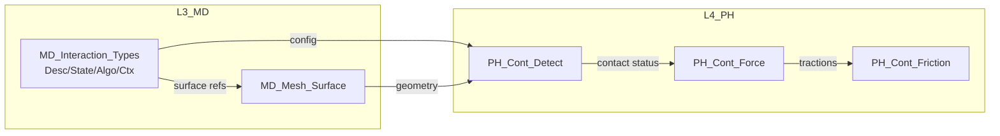

# UFC Interaction 域完整性补全技能

## 何时使用

| 场景 | 触发条件 |
|------|----------|
| Interaction域设计 | 用户说「Interaction域」「接触对」「Surface Interaction」 |
| 四类TYPE定义 | 用户说「定义Interaction的Desc/State/Algo/Ctx」 |
| Contact域补全 | 用户说「完善Contact域」「接触算法」 |
| 域间依赖分析 | 用户说「Interaction与Mesh的依赖」「表面引用」 |

---

## 第一步：域定位与层级归属

### 层级归属（来源：00-域级划分规范.md）

| 层级 | 域 | 职责 |
|------|-----|------|
| **L3_MD** | `Interaction` | 接触定义描述（Model层） |
| **L4_PH** | `Contact` | 接触算法实现（物理层） |

```
L3_MD/Interaction    ← 定义：contact pairs, surface interaction, friction model
        ↓ Bridge
L4_PH/Contact        ← 算法：接触检测, 约束施加, 摩擦更新
```

---

## 第二步：四类TYPE定义

### 2.1 MD_Interaction_Desc（描述符—冷数据）

```fortran
!===============================================================================
! Module: MD_Interaction_Types
! Layer: L3_MD - Model Data Layer
! Domain: Interaction
!
! 四类TYPE定义 — Interaction域
!===============================================================================
MODULE MD_Interaction_Types
  USE IF_Prec, ONLY: wp, i4
  USE IF_Err_Brg, ONLY: ErrorStatusType
  IMPLICIT NONE
  PRIVATE

  !-------------------------------------------------------
  ! Desc: 接触描述符（不变配置）
  !-------------------------------------------------------
  TYPE, PUBLIC :: MD_Interaction_Desc
    !-- 标识
    CHARACTER(64) :: interaction_name     ! 接触对名称
    INTEGER(i4)   :: interaction_id       ! 唯一ID

    !-- 表面定义
    CHARACTER(64) :: master_surface       ! 主表面名称
    CHARACTER(64) :: slave_surface        ! 从表面名称
    INTEGER(i4)   :: master_surface_id   ! 主表面Mesh引用ID
    INTEGER(i4)   :: slave_surface_id    ! 从表面Mesh引用ID

    !-- 接触算法类型
    INTEGER(i4)   :: contact_algo_type   ! 接触算法枚举
    INTEGER(i4)   :: contact_formulation ! 接触公式（罚/拉格朗日/增广拉格朗日）
    INTEGER(i4)   :: surface_behavior     ! 表面行为（硬接触/软接触）

    !-- 摩擦配置
    LOGICAL     :: has_friction           ! 是否含摩擦
    REAL(wp)    :: friction_coef          ! 摩擦系数（库伦）
    INTEGER(i4)  :: friction_model         ! 摩擦模型（库伦/剪切/粘性）

    !-- 几何参数
    REAL(wp)    :: normal_stiffness      ! 法向接触刚度
    REAL(wp)    :: tangent_stiffness      ! 切向接触刚度
    REAL(wp)    :: clearance_tol          ! 初始间隙容差

    !-- 状态标记
    LOGICAL     :: is_active = .TRUE.     ! 默认激活
  END TYPE MD_Interaction_Desc

  !-------------------------------------------------------
  ! State: 接触状态（运行时—热数据）
  !-------------------------------------------------------
  TYPE, PUBLIC :: MD_Interaction_State
    !-- 接触状态
    INTEGER(i4)  :: contact_status        ! 接触状态（OPEN/CLOSED/SLIP/STICK）
    REAL(wp)     :: penetration           ! 穿透量
    REAL(wp)     :: normal_gap            ! 法向间隙
    REAL(wp)     :: tangent_gap           ! 切向滑移

    !-- 力/应力
    REAL(wp)     :: contact_pressure      ! 接触压力
    REAL(wp)     :: frictional_stress      ! 摩擦应力
    REAL(wp)     :: traction_vector(3)     ! 牵引力向量

    !-- 迭代收敛
    LOGICAL      :: is_converged          ! 当前增量步收敛标志
    INTEGER(i4)   :: iteration_count       ! 当前迭代次数

    !-- 错误状态
    TYPE(ErrorStatusType) :: status
  END TYPE MD_Interaction_State

  !-------------------------------------------------------
  ! Algo: 接触算法参数（可调参数）
  !-------------------------------------------------------
  TYPE, PUBLIC :: MD_Interaction_Algo
    !-- 收敛控制
    REAL(wp)    :: tolerance_gap          ! 间隙收敛容差
    REAL(wp)    :: tolerance_force        ! 力收敛容差
    INTEGER(i4)  :: max_iterations         ! 最大迭代次数

    !-- 数值稳定
    REAL(wp)    :: stabilization_factor    ! 稳定化因子
    REAL(wp)    :: penetration_limit      ! 最大允许穿透

    !-- 约束控制
    INTEGER(i4)  :: constraint_method       ! 约束方法（PENALTY/LAGRANGE/AUG_LAGRANGE）
    LOGICAL      :: use_finite_sliding     ! 有限滑移标志
  END TYPE MD_Interaction_Algo

  !-------------------------------------------------------
  ! Ctx: 接触上下文（指针引用）
  !-------------------------------------------------------
  TYPE, PUBLIC :: MD_Interaction_Ctx
    !-- 表面几何引用
    TYPE(MD_Mesh_Surface), POINTER :: master_surface_ptr => NULL()
    TYPE(MD_Mesh_Surface), POINTER :: slave_surface_ptr  => NULL()

    !-- 接触状态数组（按节点/单元）
    REAL(wp), ALLOCATABLE :: gap_history(:)        ! 间隙历史
    REAL(wp), ALLOCATABLE :: pressure_history(:)    ! 压力历史

    !-- 工作数组
    REAL(wp), ALLOCATABLE :: contact_matrix(:,:)    ! 接触矩阵
    REAL(wp), ALLOCATABLE :: traction_vector_work(:) ! 牵引力工作数组
  END TYPE MD_Interaction_Ctx

END MODULE MD_Interaction_Types
```

---

## 第三步：四链贯通验证

### 3.1 理论链

```
ABAQUS手册 Contact Mechanics
    ↓
小变形接触理论（罚函数法、拉格朗日乘数法）
    ↓
UFC Contact算法实现
    ↓
MD_Interaction_* TYPE定义
```

### 3.2 逻辑链

```
MD_Interaction_Desc (表面定义)
    ↓ defines
MD_Interaction_State (运行时状态)
    ↓ updates
MD_Interaction_Algo (收敛控制)
    ↓ applied by
L4_PH/Contact/PH_Cont_Detect
    ↓ uses
MD_Mesh_Surface (Mesh表面引用)
    ↑ feedback
MD_Interaction_State (接触状态反馈)
```

### 3.3 计算链

```
接触检测 (PH_Cont_Detect)
    → 穿透计算 (Compute_Penetration)
    → 接触力计算 (Compute_Contact_Force)
    → 摩擦更新 (Update_Friction)
    → 约束施加 (Apply_Constraint)
```

### 3.4 数据链

```
MD_Interaction_Ctx%pairs ← [生命周期]
    Init: 分配工作数组
    Update: 更新间隙/压力历史
    Finalize: 释放内存
```

---

## 第四步：三级命名体系

| 实体 | UFC命名 | 说明 |
|------|---------|------|
| 模块 | `MD_Interaction_Types` | _Types后缀 |
| TYPE | `MD_Interaction_Desc/State/Algo/Ctx` | 层前缀+域前缀+类型后缀 |
| 过程 | `MD_Interaction_Init/Validate/Update` | 层前缀+域前缀+动词 |
| 常量 | `MD_CONTACT_OPEN/CLOSED/SLIP` | 全大写+下划线分隔 |
| 枚举 | `MD_CONTACT_ALGO_PENALTY/LAGRANGE` | 层前缀+域前缀+枚举名 |

---

## 第五步：关键接口规范

### 5.1 初始化接口

```fortran
SUBROUTINE MD_Interaction_Init(desc, state, algo, ctx, mesh_db, ierr)
  TYPE(MD_Interaction_Desc),  INTENT(INOUT) :: desc
  TYPE(MD_Interaction_State), INTENT(INOUT) :: state
  TYPE(MD_Interaction_Algo),  INTENT(IN)    :: algo
  TYPE(MD_Interaction_Ctx),    INTENT(INOUT) :: ctx
  TYPE(MD_Mesh_DB),          INTENT(IN)    :: mesh_db
  INTEGER(i4),               INTENT(OUT)   :: ierr
  !...
END SUBROUTINE
```

### 5.2 接触状态更新

```fortran
SUBROUTINE MD_Interaction_Update(desc, state, algo, ctx, step_ctx, ierr)
  TYPE(MD_Interaction_Desc),  INTENT(IN)    :: desc
  TYPE(MD_Interaction_State), INTENT(INOUT) :: state
  TYPE(MD_Interaction_Algo),  INTENT(IN)    :: algo
  TYPE(MD_Interaction_Ctx),   INTENT(INOUT) :: ctx
  TYPE(RT_Step_Context),      INTENT(IN)    :: step_ctx
  INTEGER(i4),               INTENT(OUT)   :: ierr
  !...
END SUBROUTINE
```

---

## 第六步：依赖图（Mermaid）



---

## 第七步：合规检查清单

- [ ] 四类TYPE(Desc/State/Algo/Ctx)完整定义
- [ ] Desc含contact pairs/surface interaction/friction配置
- [ ] 逻辑链：Interaction↔Mesh表面引用闭环
- [ ] 数据链：pairs生命周期管理
- [ ] 命名符合三级体系
- [ ] 接口签名含ErrorStatusType

---

**技能版本**: v1.0 | **日期**: 2026-04-04
**规范锚点**: `UFC/docs/六层架构拆分/00-总纲/00-域级划分规范.md`
