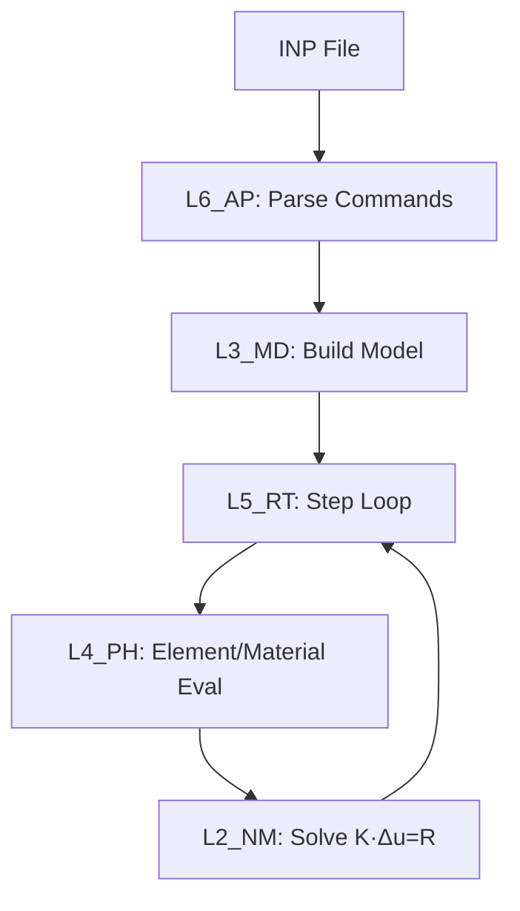

# UFC 流程图与注释规范（英文 Unicode）

> **文档位置**：`UFC/docs/UFC_流程图与注释规范_英文Unicode.md`
> **版本**：v1.0 | **日期**：2026-04-15
> **关联**：子程序内注释与计算链/逻辑链流程图规范。被 [UFC_命名与数据结构规范.md](UFC_命名与数据结构规范.md) 第1章引用。
> **参考来源**：UFC架构设计总纲 附录 H.9（流程图与注释规范 英文+Unicode）

---

## 一、概述

### 1.1 适用范围

本规范适用于 UFC 项目中所有 `.f90` 源文件的：
- 模块头注释（MODULE 级）
- 子程序/函数注释（SUBROUTINE / FUNCTION 级）
- 行内注释（`!` 前缀）
- 计算链/逻辑链流程图（嵌入注释块）

### 1.2 目的

- 统一注释语言为英文，确保国际可读性与工具链兼容性
- 规范 Unicode 数学符号在注释中的用法，提升公式可读性
- 标准化 Mermaid/ASCII 流程图格式，使逻辑链和计算链可视化
- 保证 IDE（VS Code/CLion/IntelliJ Fortran 插件）和文档生成工具（Doxygen/FORD）正确解析

---

## 二、注释语言规范

### 2.1 强制英文注释

| 规则编号 | 规定                                                          | 强制等级 |
| -------- | ------------------------------------------------------------- | -------- |
| L-01     | `.f90` 文件中所有注释（`!`前缀）**仅使用英文**               | 强制     |
| L-02     | 流程图节点标签使用英文或 Unicode 符号                         | 强制     |
| L-03     | 模块/子程序文档注释（`!>`）使用英文                           | 强制     |
| L-04     | 注释每行不超过 **72 字符**（Fortran 续行风格）                | 推荐     |
| L-05     | 中文说明仅允许出现在配套的 Markdown 文档或外部规范文件中      | 推荐     |

### 2.2 注释行长度控制

```fortran
! 正确：不超过 72 字符
! Compute Green-Lagrange strain E = 0.5*(F^T*F - I)

! 错误：超长注释（破坏 Fortran 格式兼容性）
! Compute the Green-Lagrange strain tensor for large deformation Total Lagrangian
```

---

## 三、Unicode 符号规范

### 3.1 Unicode 符号速查表

| 含义         | Unicode 符号 | 注释示例                       |
| ------------ | ------------ | ------------------------------ |
| 应变张量     | ε            | `ε = B · uₑ`               |
| 应力张量     | σ            | `σ(ε)`, `∂σ/∂ε`        |
| 单元刚度矩阵 | Kₑ           | `Kₑ = ∫ Bᵀ D B dV`        |
| 单元内力向量 | Fₑ           | `Fₑ = ∫ Bᵀ σ dV`          |
| 偏导符号     | ∂            | `∂N/∂ξ`, `∂σ/∂ε`      |
| 点积/矩阵乘  | ·            | `K · Δu = R`                 |
| 求和         | Σ            | `Σ Fₑ_int = F_ext`           |
| 上标 n+1     | ⁿ⁺¹         | `uⁿ⁺¹ = uⁿ + Δu`          |
| 等效应力     | σ_eq         | `σ_eq = √(3/2) · ‖s‖`   |
| 屈服应力     | σ_y          | `φ = σ_eq − σ_y`           |
| 变形梯度     | F            | `F = I + ∇₀u`              |
| 行列式       | det(·)       | `J = det(F)`                   |
| PK2 应力     | S            | `S = C : E (TL)`               |
| Green 应变   | E            | `E = ½(FᵀF − I)`           |
| Jacobian     | J            | `J = det(F)`                   |

### 3.2 Unicode 使用原则

- **允许**：在 `!>` Doxygen 块注释和行内注释 `!` 中使用 Unicode 数学符号
- **禁止**：在 Fortran 字符串字面量（`"..."` / `'...'`）中使用 Unicode 符号
- **禁止**：在变量名/模块名中使用 Unicode（Fortran 标识符仅限 ASCII）
- **文件编码**：`.f90` 文件保存为 **UTF-8**（无 BOM），见 `UFC/ufc_core/ENCODING.md`

---

## 四、代码注释规范

### 4.1 模块头注释格式

```fortran
!======================================================================
!> Module: PH_Elem_C3D8_Core
!> Layer:  L4_PH | Domain: Elem | Feature: C3D8Core
!>
!> Purpose:
!>   Compute element stiffness Kₑ and internal force Fₑ for C3D8
!>   8-node hexahedral element using full Gauss integration.
!>
!> Theory chain:
!>   Continuum mechanics → B-matrix → material constitutive → Kₑ/Fₑ
!>
!> Dependencies:
!>   USE IF_Prec,      ONLY: wp, i4
!>   USE MD_Mat_Core,  ONLY: MD_Mat_Desc
!>   USE PH_Mat_ElasticCore
!>
!> Version: 1.0 | Date: 2026-04-15
!======================================================================
MODULE PH_Elem_C3D8_Core
  IMPLICIT NONE
  PRIVATE
```

### 4.2 子程序/函数注释格式

**逻辑链模板**（用于 RT_* / AP_* 类控制流子程序）：

```fortran
!----------------------------------------------------------------------
!> Execute one analysis step.
!>
!> Logic chain:
!>   INP  →  L6_AP: parse & build commands
!>   L3_MD: build model descriptors (Desc)
!>   L5_RT: Step → Increment → Iteration loops
!>   L4_PH: element + material evaluation
!>   L2_NM: solve K · Δu = R
!>
!> Key equations (Unicode):
!>   - Global equilibrium:  Σ F_int(ε, σ) = F_ext
!>   - Linear system:       K · Δu = R
!>   - Newton update:       uⁿ⁺¹ = uⁿ + Δu
!----------------------------------------------------------------------
SUBROUTINE RT_Step_Execute(step_desc, step_state, algo, ctx, args)
```

**计算链模板**（用于 PH_Elem_* / PH_Mat_* 类数值计算子程序）：

```fortran
!----------------------------------------------------------------------
!> Compute element stiffness Kₑ and force Fₑ for one C3D8 element.
!>
!> Computation chain (per element):
!>   1. For each Gauss point:
!>      - Compute shape functions N(ξ) and gradients ∂N/∂ξ
!>      - Compute Jacobian J and determinant det(J)
!>      - Compute strain ε = B · uₑ
!>      - Call material routine: σ(ε) and tangent D = ∂σ/∂ε
!>      - Accumulate Kₑ and Fₑ contributions
!>   2. Return assembled Kₑ and Fₑ to Runtime layer.
!>
!> Key symbols (Unicode):
!>   - ε : strain vector (6×1)
!>   - σ : stress vector (6×1)
!>   - B : strain-displacement matrix (6×nₑDOF)
!>   - Kₑ: element stiffness matrix (nₑDOF × nₑDOF)
!>   - Fₑ: element internal force vector (nₑDOF × 1)
!----------------------------------------------------------------------
SUBROUTINE PH_Elem_C3D8_Eval(desc, state, algo, ctx, args)
```

### 4.3 行内注释规范

```fortran
! Correct: explains "why" not just "what"
sigma_eff = SQRT(1.5_wp) * norm_s   ! σ_eq = √(3/2)·‖s‖ (von Mises)

! Acceptable: brief technical description
J = det_F                             ! Jacobian = det(F)

! Discouraged: restates code without added value
x = x + 1.0_wp                       ! add 1 to x
```

---

## 五、流程图格式规范

### 5.1 Mermaid 流程图（Markdown 文档用）

适用于配套 Markdown 规范文档中嵌入的架构图或流程图：



### 5.2 ASCII 流程图（.f90 注释块内嵌）

当需要在 Fortran 源文件注释中嵌入流程说明时，使用简洁 ASCII 格式：

```fortran
!> Computation flow (Total Lagrangian):
!>
!>   x_ref (X₀)  ──►  F = I + ∇₀u  ──►  E = ½(FᵀF - I)
!>                                              │
!>                                     S = C : E  (constitutive)
!>                                              │
!>                         Kₑ ◄── Bᵀ D B dV ──►  Fₑ ◄── Bᵀ S dV
```

### 5.3 流程图覆盖策略

| 覆盖范围   | 要求                                       |
| ---------- | ------------------------------------------ |
| 功能子目录 | 每个功能子目录选 1～2 个核心子程序配置流程图 |
| 逻辑链图   | RT_* / AP_* 步/增量/迭代控制流程           |
| 计算链图   | PH_Elem_* Gauss 点积分计算流程             |

---

## 六、特殊字符处理规则

### 6.1 中文字符使用规则

| 场景                           | 是否允许中文 | 说明                                   |
| ------------------------------ | ------------ | -------------------------------------- |
| `.f90` 注释 (`!`)              | ❌ 禁止       | 仅英文 + Unicode 数学符号              |
| `.f90` 字符串字面量            | ❌ 禁止       | 仅 ASCII                               |
| Markdown 文档（.md）           | ✅ 允许       | 中文说明、中文节标题均可               |
| 外部规范/合同文件              | ✅ 允许       | 见 `UFC/ufc_core/contracts/`           |
| 错误消息字符串（写入日志/ODB） | 条件允许     | 推荐英文，避免平台编码问题             |

### 6.2 Unicode 数学符号编码

- 文件编码统一为 **UTF-8 without BOM**
- gfortran 编译器从 4.x 起支持 UTF-8 源文件注释
- 若工具链不支持 UTF-8，可回退为 ASCII 等价写法：`epsilon → eps`, `sigma → sig`

---

## 七、工具链推荐

### 7.1 文档生成工具

| 工具       | 用途                              | 注释格式     |
| ---------- | --------------------------------- | ------------ |
| **FORD**   | Fortran 项目 API 文档生成         | `!>` 块注释  |
| **Doxygen**| 通用注释文档生成（配置 Fortran）  | `!>` / `!!>` |

### 7.2 流程图工具

| 工具              | 用途                                | 集成方式           |
| ----------------- | ----------------------------------- | ------------------ |
| **Mermaid**       | Markdown 内嵌流程图（GitHub/VSCode 渲染）| ` ```mermaid ` 代码块 |
| **PlantUML**      | 序列图/类图（复杂交互）              | `.puml` 外部文件   |
| **ASCII 手绘**    | `.f90` 注释内嵌简易流程             | 纯文本 `!>` 块     |

### 7.3 CI 集成检查

```bash
# 检查 .f90 文件中是否混入中文字符
grep -P '[\x{4e00}-\x{9fa5}]' UFC/ufc_core/**/*.f90

# 推荐在 pre-commit 或 GitHub Actions 中集成
# 见 UFC/config/ 下的 pre-commit 配置
```

---

## 八、合规检查清单

| 检查项                               | 检查方式             |
| ------------------------------------ | -------------------- |
| `.f90` 注释无中文字符                | `grep` / pre-commit  |
| 模块头注释含 Purpose / Theory chain  | 人工 Review          |
| 核心子程序含计算链或逻辑链注释       | 人工 Review          |
| Unicode 符号仅在注释中使用           | 人工 Review          |
| 注释行长不超过 72 字符               | `grep -n ".\{73\}"`  |
| 文件编码为 UTF-8                     | `file --mime` 检查   |

---

*版本：1.0 | 来源：UFC架构设计总纲 附录 H.9 + 06-01-Fortran编码规范.md 合并整理*
*关联文档：[UFC_命名与数据结构规范.md](UFC_命名与数据结构规范.md)、[六层架构拆分/05-工程规范/06-01-Fortran编码规范.md](六层架构拆分/05-工程规范/06-01-Fortran编码规范.md)*
