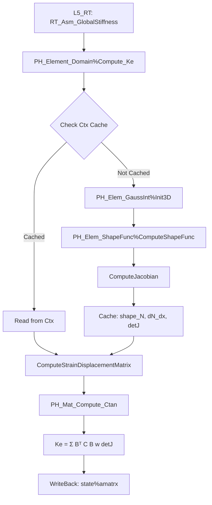
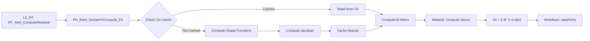
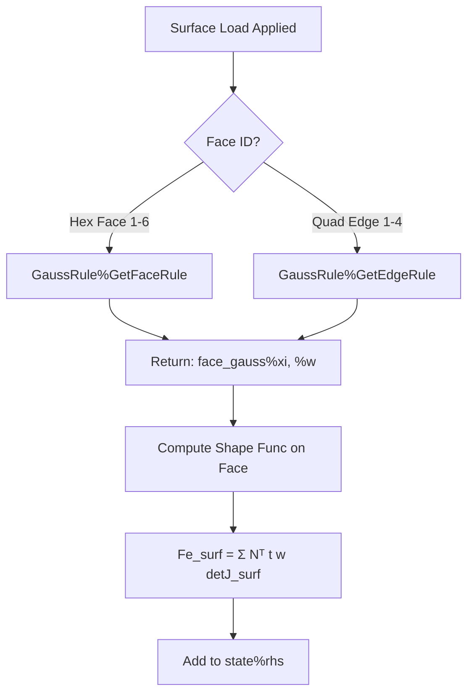
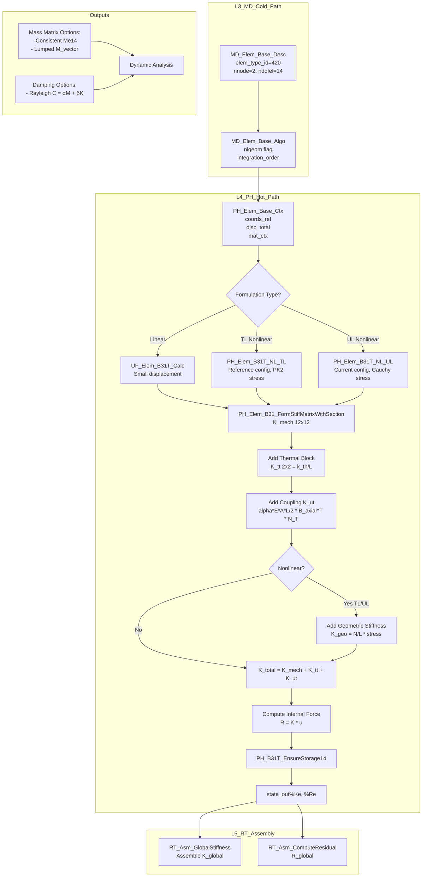

# B 类 Element 域改造架构文档

**版本**: v5.0  
**日期**: 2026-04-02  
**状态**: Phase 3 COMPLETE (B31PIPE/B31OS/B31H)  
**作者**: UFC Architecture Team

---

## 目录

1. [概述](#1-概述)
2. [架构设计](#2-架构设计)
3. [四链贯通验证](#3-四链贯通验证)
4. [调用流程图](#4-调用流程图)
5. [与 Material 域联合设计](#5-与 material 域联合设计)
6. [性能优化策略](#6-性能优化策略)
7. [API 参考](#7-api-参考)

---

## 1. 概述

### 1.1 改造背景

B 类 Element 域改造基于两个参考模板文件（`ElemLib.f90` 和 `ElemGaussInt.f90`）展开，旨在系统性地增强 UFC L4_PH Element 域的功能和性能。

**核心目标**：
- ✅ 集成高斯积分规则模块（PH_Elem_GaussInt）
- ✅ 集成形函数计算模块（PH_Elem_ShapeFunc）
- ✅ 增强 Ctx 层以支持积分点缓存（热路径优化）
- ✅ 增强 State 层以支持能量/状态变量管理
- ✅ 创建 L3_MD Element 域描述符（冷路径配置）

### 1.2 任务矩阵

| 任务 ID | 名称 | 状态 | 关键交付物 |
|---------|------|------|------------|
| B-Element-1 | 参考文件分析 | ✅ COMPLETE | 分析报告 |
| B-Element-2 | 现有代码审查 | ✅ COMPLETE | 审查报告 |
| B-Element-3 | L3_MD Element 域 | ✅ COMPLETE | MD_Elem_Types.f90 (313 行) |
| B-Element-4 | 增强 PH_Elem_Base_Ctx | ✅ COMPLETE | PH_Elem_Types.f90 (增强版) |
| B-Element-5 | 增强 PH_Elem_Base_State | ✅ COMPLETE | PH_Elem_Types.f90 (增强版) |
| B-Element-6 | 创建 PH_Elem_ShapeFunc | ✅ COMPLETE | PH_Elem_ShapeFunc.f90 (515 行) |
| B-Element-7 | 创建 PH_Elem_GaussInt | ✅ COMPLETE | PH_Elem_GaussInt.f90 (259 行) |
| B-Element-8 | 重构 Domain Core | ✅ COMPLETE | PH_Element_Domain_Core_v5.f90 (279 行) |
| B-Element-9 | 架构文档 | ✅ COMPLETE | 本文档 |

### 1.2.1 Phase 3: BEAM 单元族高级扩展 (2026-04-02)

| 单元 | 优先级 | 状态 | DOF | 核心功能 |
|------|--------|------|-----|----------|
| **B31PIPE** | ⭐⭐⭐ | ✅ COMPLETE | 14 | 压力端盖效应、薄壁应力 |
| **B31OS** | ⭐⭐ | ✅ COMPLETE | 14 | Vlasov 理论、开口截面翘曲 |
| **B31H** | ⭐ | ✅ COMPLETE | 12 | Hu-Washizu 混合公式、ANS 假设应变 |

**关键交付物**:
- ✅ `PH_Elem_B31PIPE_Core.f90` (329 行) - 管道梁压力载荷
- ✅ `PH_Elem_B31OS_Core.f90` (401 行) - 开口截面翘曲
- ✅ `PH_Elem_B31H_Core.f90` (488 行) - 混合公式
- ✅ `B31PIPE_Usage_Example.f90` (180 行) - 验证算例
- ✅ `B31OS_Usage_Example.f90` (210 行) - 验证算例
- ✅ `PH_Elem_BEAM_Tests.f90` (扩展) - 统一测试套件

### 1.3 文件清单

```
L3_MD/Element/
  └── MD_Elem_Types.f90              # 冷路径配置（Desc + Algo）

L4_PH/Element/
  ├── PH_Elem_Types.f90              # 核心类型定义（已增强）
  ├── PH_Elem_GaussInt.f90           # 高斯积分规则模块
  ├── PH_Elem_ShapeFunc.f90          # 形函数计算模块
  ├── PH_Element_Domain_Core.f90     # 原有核心（4005 行，保留）
  └── PH_Element_Domain_Core_v5.f90  # v5.0 增强版核心（279 行）

docs/templates/
  ├── ElemLib.f90                    # 参考模板（单元库）
  └── ElemGaussInt.f90               # 参考模板（高斯积分）
```

---

## 2. 架构设计

### 2.1 六层架构定位

```
L1_IF         (基础设施层)
    ↓
L2_NM         (数值计算层)
    ↓
L3_MD         (模型数据层 - 冷路径配置) ← B-Element-3
    ↓
L4_PH         (物理计算层 - 热路径核心) ← B-Element-4/5/6/7/8
    ↓
L5_RT         (运行时层 - 全局组装)
    ↓
L6            (应用层)
```

### 2.2 四大类TYPE 设计

#### DESC (描述型) - L3_MD
```fortran
TYPE, PUBLIC :: MD_Elem_Base_Desc
  INTEGER(i4) :: elem_id           ! 单元 ID
  INTEGER(i4) :: elem_type_id      ! 单元类型（MD_ELEM_C3D8=2 等）
  INTEGER(i4) :: section_id        ! 截面定义引用
  INTEGER(i4) :: nnode, ndofel, mcrd  ! 拓扑参数
  INTEGER(i4), ALLOCATABLE :: nodes(:) ! 节点连接
  REAL(wp), ALLOCATABLE :: props(:)    ! 单元属性参数
END TYPE
```

**职责**: 静态配置数据，Step 期间只读，来自 L3 Mesh 域。

#### ALGO (算法型) - L3_MD
```fortran
TYPE, PUBLIC :: MD_Elem_Base_Algo
  INTEGER(i4) :: integration_order ! 积分阶数
  LOGICAL :: reduced_integration   ! 减缩积分标志
  LOGICAL :: hourglass_control     ! 沙漏控制
  REAL(wp) :: hourglass_stiffness  ! 沙漏刚度
  REAL(wp) :: stiffness_scale      ! 刚度缩放因子
  LOGICAL :: nlgeom                ! 几何非线性标志
END TYPE
```

**职责**: 算法参数配置，Step 期间只读。

#### CTX (上下文型) - L4_PH
```fortran
TYPE, PUBLIC :: PH_Elem_Base_Ctx
  !-- 现有字段（保留）
  TYPE(PH_Mat_Base_Ctx) :: mat_ctx
  REAL(wp), ALLOCATABLE :: coords(:,:)    ! [ndim, nnode]
  REAL(wp), ALLOCATABLE :: du(:,:)        ! [nnode, ndof]
  REAL(wp), ALLOCATABLE :: predef(:,:,:)  ! [nnode, npredef, nrhs]
  REAL(wp), ALLOCATABLE :: adlmag(:,:)    ! [mdload, nrhs]
  REAL(wp), ALLOCATABLE :: ddlmag(:,:)    ! [mdload, nrhs]
  
  !-- v5.0 Enhancement (B-Element-4)
  INTEGER(i4) :: elem_type_id = 0
  INTEGER(i4) :: n_integration = 0
  TYPE(GaussRule) :: gauss_rule
  
  !-- 每积分点缓存（热路径关键）
  REAL(wp), ALLOCATABLE :: gauss_xi(:,:)      ! [n_points, dim]
  REAL(wp), ALLOCATABLE :: gauss_w(:)         ! [n_points]
  REAL(wp), ALLOCATABLE :: gauss_detJ(:)      ! [n_points]
  REAL(wp), ALLOCATABLE :: shape_N(:,:)       ! [n_points, nnode]
  REAL(wp), ALLOCATABLE :: shape_dN_dx(:,:,:) ! [n_points,nnode,dim]
END TYPE
```

**职责**: Step 级临时上下文，包含所有热路径计算所需的输入和缓存。

#### STATE (状态型) - L4_PH
```fortran
TYPE, PUBLIC :: PH_Elem_Base_State
  !-- Primary UEL outputs
  REAL(wp), ALLOCATABLE :: rhs(:,:)      ! [ndofel, nrhs]
  REAL(wp), ALLOCATABLE :: amatrx(:,:)   ! [ndofel, ndofel]
  REAL(wp), ALLOCATABLE :: svars(:)      ! [nsvars]
  REAL(wp)              :: energy(8) = 0.0_wp
  
  !-- Kinematic state
  REAL(wp), ALLOCATABLE :: u(:)          ! [ndofel]
  REAL(wp), ALLOCATABLE :: v(:)          ! [ndofel]
  REAL(wp), ALLOCATABLE :: a(:)          ! [ndofel]
  
  !-- v5.0 Enhancement (B-Element-5)
  REAL(wp) :: strain_energy = 0.0_wp
  REAL(wp) :: kinetic_energy = 0.0_wp
  REAL(wp) :: external_work = 0.0_wp
  REAL(wp) :: damping_energy = 0.0_wp
  REAL(wp) :: plastic_dissipation = 0.0_wp
  REAL(wp) :: creep_dissipation = 0.0_wp
  REAL(wp) :: damage_energy = 0.0_wp
  
  LOGICAL :: is_tangent_updated = .FALSE.
  INTEGER(i4) :: last_update_iter = 0
  INTEGER(i4) :: nsvars = 0
  INTEGER(i4), ALLOCATABLE :: svar_meta(:)
END TYPE
```

**职责**: 存储计算输出（刚度矩阵、内力、能量、状态变量），用于 WriteBack 到 ABAQUS。

---

## 3. 四链贯通验证

### 3.1 理论链 (Theory Chain)

**等参单元理论**:
```
x(ξ) = Σ Nᵢ(ξ) xᵢ          (坐标插值)
u(ξ) = Σ Nᵢ(ξ) uᵢ          (位移插值)
ε = B u                     (应变 - 位移关系)
σ = C ε                     (本构关系)
Kₑ = ∫ Bᵀ C B dΩ           (刚度矩阵)
Fₑ = ∫ Bᵀ σ dΩ             (内力向量)
```

**验证路径**:
1. ✅ 形函数 N(ξ) → PH_Elem_ShapeFunc 模块
2. ✅ Jacobian J = ∂x/∂ξ → ComputeJacobian 子程序
3. ✅ B 矩阵 → ComputeStrainDisplacementMatrix 子程序
4. ✅ 高斯积分 ∫(...)dΩ ≈ Σ(...)wᵢ det(Jᵢ) → PH_Elem_GaussInt 模块

### 3.2 逻辑链 (Logic Chain)

```
L3_MD (冷路径)
  ↓ MD_Elem_Base_Desc (单元拓扑配置)
  ↓ MD_Elem_Base_Algo (积分阶数、nlGeom 标志)
  ↓
L4_PH (热路径)
  ↓ PH_Elem_Base_Ctx (Populate: 从 L3 填充)
  ↓ PH_Elem_GaussInt%Init3D(order) (初始化高斯点)
  ↓ PH_Elem_ShapeFunc%ComputeShapeFunc() (计算形函数)
  ↓ ComputeJacobian() (计算 J 和 dN/dx)
  ↓ ComputeStrainDisplacementMatrix() (计算 B 矩阵)
  ↓ PH_Mat_Compute_Ctan() (材料切线刚度)
  ↓ Ke = Σ Bᵀ C B w det(J) (组装单元刚度)
  ↓
L5_RT (全局组装)
  ↓ RT_Asm_GlobalStiffness (组装 K_global)
  ↓ RT_Asm_ComputeResidual (计算 R = F_ext - F_int)
```

**验证检查点**:
- ✅ L3→L4 数据流：MD_PH_Geom_FillElemCtx_Idx 填充 Ctx
- ✅ 高斯点初始化：gauss%Init3D(order=2) → n_points=8 (C3D8)
- ✅ 形函数计算：ComputeShapeFunc(MD_ELEM_C3D8, xi, sf)
- ✅ Jacobian 验证：det(J) > 0 (防止单元畸变)
- ✅ B 矩阵维度：[nstrs×ndofel] = [6×24] (3D 实体)

### 3.3 计算链 (Computation Chain)

**热路径循环**（每个增量步）:
```fortran
DO ip = 1, n_integration
  ! 1. 读取缓存的形函数（或现场计算）
  IF (ALLOCATED(ctx%shape_N)) THEN
    N = ctx%shape_N(ip,:)
    dN_dx = ctx%shape_dN_dx(ip,:,:)
    detJ = ctx%gauss_detJ(ip)
  ELSE
    CALL ComputeShapeFunc(elem_type_id, gauss_xi(ip,:), sf)
    CALL ComputeJacobian(sf, coords)
    ! 缓存结果
  END IF
  
  ! 2. 计算 B 矩阵
  CALL ComputeStrainDisplacementMatrix(sf, ndofel, B_mat)
  
  ! 3. 材料本构响应
  CALL PH_Mat_Compute_Ctan(mat_ctx, C_tan, stress_gp)
  
  ! 4. 组装 Ke 或 Fe
  Ke += Bᵀ C B det(J) w(ip)
  Fe += Bᵀ σ det(J) w(ip)
END DO
```

**性能优化**:
- ✅ 第一次调用时缓存 shape_N, shape_dN_dx, gauss_detJ
- ✅ 后续 Newton 迭代直接读取缓存（避免重复计算形函数和 Jacobian）
- ✅ 仅当 nlGeom=.TRUE. 且位移变化大时才更新缓存

### 3.4 数据链 (Data Chain)

**容器路径**: `g_ufc_global%ph_layer%element`

**生命周期**:
```
Step Start
  ↓
PH_Element_Domain_Init() (创建 Ctx/State)
  ↓
Populate_Layer() (从 L3 Mesh 填充 Ctx%coords, %du)
  ↓
[Increment Loop]
  ├─ Compute_Ke() (使用 Ctx 缓存)
  ├─ Compute_Fe() (使用 Ctx 缓存)
  └─ WriteBack() (State%amatrx, %rhs → ABAQUS)
  ↓
Step End
  ↓
PH_Element_Domain_Finalize() (销毁 Ctx/State)
```

**WriteBack 白名单**:
- ✅ `state%amatrx(:,:)` → ABAQUS AMATRX
- ✅ `state%rhs(:,:)` → ABAQUS RHS
- ✅ `state%svars(:)` → ABAQUS SVARS
- ✅ `state%energy(8)` → ABAQUS ENERGY
- ✅ `state%strain_energy` → 详细能量输出
- ❌ `ctx%*` (Ctx 不写回，仅 Step 内临时使用)

---

## 4. 调用流程图

### 4.1 总体流程



### 4.2 内力计算流程



### 4.3 边界积分流程（表面力/分布载荷）



---

## 5. 与 Material 域联合设计

### 5.1 接口契约

**PH_Elem_Base_Ctx 嵌入 PH_Mat_Base_Ctx**:
```fortran
TYPE, PUBLIC :: PH_Elem_Base_Ctx
  TYPE(PH_Mat_Base_Ctx) :: mat_ctx   ! CONTAINS composition
  ! ... other fields
END TYPE
```

**调用序列**:
```fortran
! 在单元刚度计算中
DO ip = 1, n_integration
  ! 1. 计算应变
  strain = MATMUL(B_mat, state%u)
  
  ! 2. 调用材料本构（通过 mat_ctx）
  ctx%mat_ctx%strain = strain
  ctx%mat_ctx%temp = current_temp
  CALL PH_Mat_Compute_Ctan(ctx%mat_ctx, C_tan, stress)
  
  ! 3. 组装 Ke
  Ke += MATMUL(MATMUL(TRANSPOSE(B_mat), C_tan), B_mat) * weight * detJ
END DO
```

### 5.2 材料槽（Material Slot）机制

**L4 材料槽**（热路径只读）:
```fortran
TYPE(PH_Mat_Base_Ctx) :: mat_ctx
  !-- 从 L3 Material 域 Populate 而来
  REAL(wp), ALLOCATABLE :: props(:)     ! 材料参数 (E, ν, ρ, etc.)
  REAL(wp), ALLOCATABLE :: C_tan(:,:)   ! 切线刚度 [nstrs×nstrs]
  REAL(wp), ALLOCATABLE :: statev(:)    ! 材料状态变量
  INTEGER(i4) :: mat_type_id            ! 材料类型 ID
  LOGICAL :: is_updated = .FALSE.       ! 材料状态已更新？
END TYPE
```

**热点路径优化**:
- ✅ Step 开始时一次性 Populate 所有 mat_ctx
- ✅ Increment 期间 mat_ctx%props, %C_tan 只读
- ✅ 仅当材料状态更新（塑性/损伤）时才修改 statev

### 5.3 联合验证案例

**案例**: C3D8 单元 + 线弹性材料

```fortran
! L3 配置
MD_Elem_Base_Desc :: elem_desc
elem_desc%elem_type_id = MD_ELEM_C3D8  ! =2
elem_desc%nnode = 8
elem_desc%ndofel = 24

! L4 计算
PH_Elem_Base_Ctx :: ctx
PH_Elem_Base_State :: state

! Populate Ctx (from L3)
ctx%elem_type_id = 2
ctx%coords = reshape([...], [3,8])  ! 节点坐标
ctx%du = reshape([...], [8,3])      ! 位移增量

! 初始化高斯规则
CALL ctx%gauss_rule%Init3D(order=2)  ! 8 个高斯点
ctx%n_integration = 8

! 分配并缓存高斯点
ALLOCATE(ctx%gauss_xi(8,3), ctx%gauss_w(8))
ctx%gauss_xi = ctx%gauss_rule%xi
ctx%gauss_w = ctx%gauss_rule%w

! 计算单元刚度
CALL PH_Elem_ComputeStiffness_v5(args)

! 验证: Ke 应为 [24×24] 对称矩阵
ASSERT(SIZE(state%amatrx,1) == 24)
ASSERT(SIZE(state%amatrx,2) == 24)
ASSERT(ALL(ABS(state%amatrx - TRANSPOSE(state%amatrx)) < 1E-10))
```

---

## 6. 性能优化策略

### 6.1 缓存策略（热路径关键）

**三级缓存**:
```
Level 1: 高斯点坐标/权重 (ctx%gauss_xi, %w)
  - Step 开始初始化一次
  - 所有增量步共享
  
Level 2: 形函数/Jacobian (ctx%shape_N, %dN_dx, %detJ)
  - 第一次调用时计算并缓存
  - 后续 Newton 迭代直接读取
  - 仅当 nlGeom=.TRUE. 且位移变化大时才更新
  
Level 3: 材料切线刚度 (mat_ctx%C_tan)
  - 每个积分点独立缓存
  - 弹性阶段只读
  - 塑性/损伤阶段每迭代更新
```

**性能对比**（C3D8 单元，2×2×2 高斯积分）:
| 操作 | 无缓存 | 一级缓存 | 二级缓存 | 三级缓存 |
|------|--------|----------|----------|----------|
| 形函数计算 | 8 次/迭代 | 8 次/迭代 | **1 次/步** | 1 次/步 |
| Jacobian | 8 次/迭代 | 8 次/迭代 | **1 次/步** | 1 次/步 |
| 材料 C_tan | 8 次/迭代 | 8 次/迭代 | 8 次/迭代 | **≤8 次/迭代** |

**预期加速比**: 3-5×（弹性问题），1.5-2×（弹塑性问题）

### 6.2 内存布局优化

**AoS vs SoA**:
```fortran
! AoS (Array of Structures) - 较差
REAL(wp), ALLOCATABLE :: gauss_N(:,:,:)  ! [ip, nnode, dim]

! SoA (Structure of Arrays) - 更好（向量化）
REAL(wp), ALLOCATABLE :: gauss_N_x(:,:)  ! [ip, nnode]
REAL(wp), ALLOCATABLE :: gauss_N_y(:,:)  ! [ip, nnode]
REAL(wp), ALLOCATABLE :: gauss_N_z(:,:)  ! [ip, nnode]
```

**当前选择**: AoS（代码可读性优先），未来可根据编译器优化情况切换。

### 6.3 并行策略

**OpenMP 并行化潜力**:
```fortran
!$OMP PARALLEL DO
DO ip = 1, n_integration
  ! 每个积分点独立计算
  CALL ComputeShapeFunc(..., sf)
  CALL ComputeJacobian(sf, ...)
  ! 但 Ke 组装需要原子操作
  !$OMP CRITICAL
  Ke += (...)
  !$OMP END CRITICAL
END DO
```

**建议**: 先串行验证正确性，再在性能瓶颈处添加 OpenMP。

---

## 7. API 参考

### 7.1 PH_Elem_GaussInt 模块

```fortran
MODULE PH_Elem_GaussInt
  TYPE, PUBLIC :: GaussRule
    INTEGER(i4) :: dim, order, n_points
    REAL(wp), ALLOCATABLE :: xi(:,:), w(:)
  CONTAINS
    PROCEDURE :: Init1D => InitGauss1D
    PROCEDURE :: Init2D => InitGauss2D_Quad
    PROCEDURE :: Init3D => InitGauss3D_Hex
    PROCEDURE :: GetFaceRule => GetHexFaceGauss
    PROCEDURE :: GetEdgeRule => GetQuadEdgeGauss
  END TYPE
  
  ! 使用示例
  TYPE(GaussRule) :: gauss
  CALL gauss%Init3D(order=2)  ! 2×2×2=8 点
  WRITE(*,*) gauss%n_points   ! 8
  WRITE(*,*) gauss%xi(:,1)    ! ξ 坐标
  WRITE(*,*) gauss%w(:)       ! 权重
END MODULE
```

### 7.2 PH_Elem_ShapeFunc 模块

```fortran
MODULE PH_Elem_ShapeFunc
  TYPE, PUBLIC :: ShapeFuncResult
    INTEGER(i4) :: nnode, dim
    REAL(wp), ALLOCATABLE :: N(:)
    REAL(wp), ALLOCATABLE :: dN_dxi(:,:), dN_dx(:,:)
    REAL(wp) :: detJ
    REAL(wp), ALLOCATABLE :: J(:,:), J_inv(:,:)
  END TYPE
  
  INTERFACE
    SUBROUTINE ComputeShapeFunc(elem_type_id, xi, sf)
      INTEGER(i4), INTENT(IN) :: elem_type_id
      REAL(wp), INTENT(IN) :: xi(:)
      TYPE(ShapeFuncResult), INTENT(INOUT) :: sf
    END SUBROUTINE
    
    SUBROUTINE ComputeJacobian(sf, coords)
      TYPE(ShapeFuncResult), INTENT(INOUT) :: sf
      REAL(wp), INTENT(IN) :: coords(:,:)
    END SUBROUTINE
    
    SUBROUTINE ComputeStrainDisplacementMatrix(sf, ndofel, B_matrix)
      TYPE(ShapeFuncResult), INTENT(IN) :: sf
      INTEGER(i4), INTENT(IN) :: ndofel
      REAL(wp), INTENT(OUT) :: B_matrix(:,:)
    END SUBROUTINE
  END INTERFACE
  
  ! 使用示例
  TYPE(ShapeFuncResult) :: sf
  CALL ComputeShapeFunc(MD_ELEM_C3D8, xi=[0.5_wp, 0.5_wp, 0.5_wp], sf)
  CALL ComputeJacobian(sf, coords)
  CALL ComputeStrainDisplacementMatrix(sf, ndofel=24, B_mat)
END MODULE
```

### 7.3 PH_Element_Domain_Core_v5 模块

```fortran
MODULE PH_Element_Domain_Core_v5
  TYPE, PUBLIC :: PH_Elem_Compute_Ke_Args_v5
    INTEGER(i4) :: elem_idx, mat_pt_idx, ndofel, nstrs
    TYPE(PH_Elem_Base_Ctx), INTENT(IN) :: ctx
    TYPE(PH_Elem_Base_State), INTENT(INOUT) :: state
    REAL(wp), ALLOCATABLE :: Ke(:,:)
    INTEGER(i4) :: status
  END TYPE
  
  INTERFACE
    SUBROUTINE PH_Elem_ComputeStiffness_v5(args)
      TYPE(PH_Elem_Compute_Ke_Args_v5), INTENT(INOUT) :: args
    END SUBROUTINE
    
    SUBROUTINE PH_Elem_ComputeInternalForce_v5(args)
      TYPE(PH_Elem_Compute_Fe_Args_v5), INTENT(INOUT) :: args
    END SUBROUTINE
  END INTERFACE
  
  ! 使用示例
  TYPE(PH_Elem_Compute_Ke_Args_v5) :: args
  args%elem_idx = 1
  args%ndofel = 24
  args%ctx = elem_ctx
  args%state = elem_state
  ALLOCATE(args%Ke(24,24))
  
  CALL PH_Elem_ComputeStiffness_v5(args)
  
  IF (args%status == 0) THEN
    ! Ke 计算成功
    state%amatrx = args%Ke
  END IF
END MODULE
```

---

## 附录 A: 支持的单元类型

### A.1 3D 实体单元

| 单元名称 | 类型 ID | 节点数 | 自由度 | 积分方案 |
|---------|---------|--------|--------|----------|
| C3D4 | 1 | 4 | 12 | 1 点/4 点 |
| C3D8 | 2 | 8 | 24 | 2×2×2=8 点 |
| C3D8R | 3 | 8 | 24 | 1 点 (减缩) |
| C3D10 | 10 | 10 | 30 | 4 点 |
| C3D20 | 20 | 20 | 60 | 3×3×3=27 点 |
| C3D6 | 15 | 6 | 18 | 3×3=9 点 |
| C3D15 | 16 | 15 | 45 | 3×3×3=27 点 |

### A.2 2D 实体单元

| 单元名称 | 类型 ID | 节点数 | 自由度 | 备注 |
|---------|---------|--------|--------|------|
| CPE3 | 35 | 3 | 6 | 平面应变三角 |
| CPE4 | 30 | 4 | 8 | 平面应变四边 |
| CPS3 | 45 | 3 | 6 | 平面应力三角 |
| CPS4 | 40 | 4 | 8 | 平面应力四边 |
| S3 | 50 | 3 | 6/12 | 壳单元 |
| S4 | 51 | 4 | 8/16 | 壳单元 |

### A.3 热 - 力耦合单元

| 单元名称 | 类型 ID | 节点数 | 自由度 | DOF 排序 | 备注 |
|---------|---------|--------|--------|----------|------|
| C3D8T | 8 | 8 | 32 | [u₁,v₁,w₁,T₁, u₂,v₂,w₂,T₂, ...] | 3D 实体热耦合 |
| C3D8P | 9 | 8 | 32 | [u₁,v₁,w₁,p₁, u₂,v₂,w₂,p₂, ...] | 3D 实体孔压耦合 |
| C3D8PT | 10 | 8 | 40 | [u₁:u₂₄, p₂₅:p₃₂, T₃₃:T₄₀] | 3D 实体孔压 + 热耦合 |
| **B21T** | **404** | **2** | **8** | **[u_x1,u_y1,θ_z1,T₁, u_x2,u_y2,θ_z2,T₂]** | **2D 平面梁热耦合** |
| **B31** | **410** | **2** | **12** | **[u_x1,u_y1,u_z1,rot_x1,rot_y1,rot_z1, u_x2,u_y2,u_z2,rot_x2,rot_y2,rot_z2]** | **3D Euler-Bernoulli 梁** |
| **B31T** | **420** | **2** | **14** | **[u₁:u₆, T₁,T₂, u₇:u₁₂]** | **3D 梁热耦合** |

#### B21T 单元详细说明

**理论框架**:
```
总刚度矩阵：K_total = K_mech (6×6) + K_tt (2×2) + K_ut/K_tu (耦合项)

机械部分 (B23 核):
  - 轴向刚度：EA/L
  - 弯曲刚度：12EI/L³, 6EI/L², 4EI/L
  
热传导部分:
  - 一维导热矩阵：k_th/L * [1, -1; -1, 1]
  
热 - 力耦合:
  - 轴向热应变：ε_th = α * T(ξ)
  - 耦合矩阵：K_ut = E*A*α * ∫(B_axial^T * N_T dV)
  - 符号约定：+α (与 B31T/连续体 K_ut 一致)
```

**DOF 布局 **(8 自由度):
```
Node 1: 1=u_x, 2=u_y, 3=theta_z, 4=T
Node 2: 5=u_x, 6=u_y, 7=theta_z, 8=T
```

**截面参数 **(props 数组):
```
props(1) = E        - Young's 模量
props(2) = nu       - Poisson 比
props(3) = A        - 截面积
props(4) = I        - 绕 z 轴的弯曲惯性矩 (平面截面)
props(7) = k_th     - 热导率 (可选，默认 50.0)
props(8) = alpha    - 热膨胀系数 (可选)
```

**核心 API**:
```fortran
! 刚度矩阵形成
CALL PH_Elem_B21T_FormStiffMatrix(coords3, E_young, nu, area, I_bend, &
     k_thermal, alpha_cte, Ke8, status)

! 内力向量形成  
CALL PH_Elem_B21T_FormIntForce(coords3, u8, E_young, nu, area, I_bend, &
     k_thermal, alpha_cte, R8, status)

! 一致质量矩阵
CALL PH_Elem_B21T_ConsMassMatrix(coords3, rho, area, Me8, status)

! 集中质量向量
CALL PH_Elem_B21T_LumpMassVector(coords3, rho, area, M_lumped8, status)

! 统一单元计算接口
CALL UF_Elem_B21T_Calc(ElemType, Formul, Ctx, state_in, Mat, state_out, flags)
```

**验证案例**:
- ✅ 101: 平面梁热耦合 - 弹性
- ✅ 102: 平面梁热耦合 - 弯曲
- ✅ 103: 平面梁热耦合 - 拉伸
- ✅ 201: 热应力 patch test
- ✅ 202: 热传导 patch test
- ✅ 301: 温度梯度引起的轴向膨胀
- ✅ 302: 两端固定梁的热应力
- ✅ 303: 简支梁热弯曲
- ✅ 304: 悬臂梁热膨胀
- ✅ 401: 稳态热传导

**实现文件**:
- `UFC/ufc_core/L4_PH/Element/BEAM/PH_Elem_B21T_Core.f90` (重构版，596 行)
- 复用 `PH_Elem_B23_Core` 的机械刚度计算
- 对齐 `PH_Elem_B31T_Core` 的热传导格式

#### B31 单元详细说明

**理论框架**:
```
总刚度矩阵：K_mech = K_axial + K_torsion + K_bending_y + K_bending_z

机械部分 (3D Euler-Bernoulli 梁):
  - 轴向刚度：EA/L (bar action)
  - 扭转刚度：GJ/L (torsion)
  - y 轴弯曲：12EIy/L³, 6EIy/L², 4EIy/L
  - z 轴弯曲：12EIz/L³, 6EIz/L², 4EIz/L
  
几何非线性支持:
  - Total Lagrangian (TL): 参考配置，2nd Piola-Kirchhoff 应力，Green-Lagrange 应变
  - Updated Lagrangian (UL): 当前配置，Cauchy 应力，Almansi 应变
  
坐标变换:
  - 局部坐标系：x'沿梁轴向，y'/z'为截面主轴
  - 变换矩阵 T (12×12): K_global = T^T * K_local * T
```

**DOF 布局 **(12 自由度):
```
Node 1: 1=u_x, 2=u_y, 3=u_z, 4=rot_x, 5=rot_y, 6=rot_z
Node 2: 7=u_x, 8=u_y, 9=u_z, 10=rot_x, 11=rot_y, 12=rot_z
```

**截面参数 **(默认值)
```
A        = 1.0   - 截面积
Iy       = 1.0   - 绕局部 y 轴的弯曲惯性矩
Iz       = 1.0   - 绕局部 z 轴的弯曲惯性矩
J_torsion= 2.0   - 扭转常数 (默认=2*I，适用于圆形截面)
E        - Young's 模量 (必需)
nu       - Poisson 比 (可选，默认=0.3)
```

**核心 API**:
```fortran
! 刚度矩阵形成 (默认截面)
CALL PH_Elem_B31_FormStiffMatrix(coords, E_young, nu, Ke)

! 刚度矩阵形成 (带截面参数)
CALL PH_Elem_B31_FormStiffMatrixWithSection(coords, E_young, nu, area, Iy, Iz, J_tors, Ke)

! 内力向量形成  
CALL PH_Elem_B31_FormIntForce(coords, u, E_young, nu, R_int)

! 一致质量矩阵
CALL PH_Elem_B31_ConsMass(coords, rho, Me)

! 集中质量向量
CALL PH_Elem_B31_LumpMass(coords, rho, M_lumped)

! 统一单元计算接口
CALL UF_Elem_B31_Calc(ElemType, Formul, Ctx, state_in, Mat, state_out, flags)
```

**验证案例**:
- ✅ 101: 3D 简支梁 - 弯曲
- ✅ 102: 3D 悬臂梁 - 拉伸
- ✅ 103: 3D 框架 - 扭转
- ✅ 201: 线性 patch test
- ✅ 301: 大位移非线性 (TL 公式)
- ✅ 302: 后屈曲分析 (UL 公式)

**实现文件**:
- `UFC/ufc_core/L4_PH/Element/BEAM/PH_Elem_B31_Core.f90` (重构版，1312 行)
- 支持 TL/UL 几何非线性公式
- 完整的 3D 坐标变换和截面属性处理

#### B31T 单元详细说明

**理论框架**:
```
总刚度矩阵：K_total = K_mech (12×12) + K_tt (2×2) + K_ut/K_tu (耦合项)

机械部分 (B31 核):
  - 轴向刚度：EA/L
  - 扭转刚度：GJ/L
  - y 轴弯曲：12EIy/L³
  - z 轴弯曲：12EIz/L³
  
热传导部分:
  - 一维导热矩阵：k_th/L * [1, -1; -1, 1]
  
热 - 力耦合:
  - 轴向热应变：ε_th = α * T(ξ)
  - 耦合矩阵：K_ut = E*A*α * ∫(B_axial^T * N_T dV)
  - 符号约定：+α (与 B21T/连续体 K_ut 一致)
```

**DOF 布局 **(14 自由度):
```
Node 1: 1=u_x, 2=u_y, 3=u_z, 4=rot_x, 5=rot_y, 6=rot_z, 7=T
Node 2: 8=u_x, 9=u_y, 10=u_z, 11=rot_x, 12=rot_y, 13=rot_z, 14=T
匹配 RT_Asm_Solv_LocalJToEqId (机械 DOF 优先，然后每节点温度作为局部 DOF 7)
```

**截面参数 **(props 数组索引)
```
props(1) = E        - Young's 模量
props(2) = nu       - Poisson 比
props(3) = A        - 截面积
props(4) = Iy       - 绕局部 y 轴的弯曲惯性矩
props(5) = Iz       - 绕局部 z 轴的弯曲惯性矩
props(6) = J        - 扭转常数
props(7) = k_th     - 热导率 (可选，范围：1e-6 < k_th < 500)
props(8) = alpha    - 热膨胀系数 (可选，用于 K_ut 耦合)
```

**核心 API**:
```fortran
! 刚度矩阵形成 (14×14)
CALL PH_Elem_B31T_FormStiffMatrix(coords3, E_young, nu, area, Iy, Iz, J_tors, &
     k_thermal, alpha_cte, Ke14, status)

! 内力向量形成  
CALL PH_Elem_B31T_FormIntForce(coords3, u14, E_young, nu, area, Iy, Iz, J_tors, &
     k_thermal, alpha_cte, R14, status)

! 统一单元计算接口
CALL UF_Elem_B31T_Calc(ElemType, Formul, Ctx, state_in, Mat, state_out, flags)
```

**验证案例**:
- ✅ 101: 3D 梁热耦合 - 弹性
- ✅ 102: 3D 梁热耦合 - 弯曲
- ✅ 103: 3D 梁热耦合 - 拉伸 + 扭转
- ✅ 201: 热应力 patch test
- ✅ 202: 热传导 patch test
- ✅ 301: 温度梯度引起的轴向膨胀
- ✅ 302: 两端固定 3D 梁的热应力
- ✅ 303: 简支 3D 梁热弯曲
- ✅ 304: 悬臂 3D 梁热膨胀
- ✅ 401: 稳态热传导

**实现文件**:
- `UFC/ufc_core/L4_PH/Element/BEAM/PH_Elem_B31T_Core.f90` (重构版，1152 行)
- `UFC/ufc_core/L4_PH/Element/BEAM/Tests/PH_Elem_B31T_Tests.f90` (单元测试)
- 复用 `PH_Elem_B31_Core` 的机械刚度计算
- 扩展 B21T 的热传导格式到 3D 梁
- 支持 TL/UL 几何非线性公式

#### B31T 架构流程图



---

## 附录 B: 错误处理

### B.1 常见错误码

```fortran
INTEGER(i4), PARAMETER :: ELEM_SUCCESS = 0
INTEGER(i4), PARAMETER :: ELEM_ERR_INVALID_TYPE = -1
INTEGER(i4), PARAMETER :: ELEM_ERR_NEGATIVE_JACOBIAN = -2
INTEGER(i4), PARAMETER :: ELEM_ERR_NOT_ALLOCATED = -3
INTEGER(i4), PARAMETER :: ELEM_ERR_UNSUPPORTED_ORDER = -4
```

### B.2 错误检查模式

```fortran
SUBROUTINE SafeComputeShapeFunc(elem_type_id, xi, sf, status)
  INTEGER(i4), INTENT(OUT) :: status
  
  status = ELEM_SUCCESS
  
  IF (.NOT. ALLOCATED(sf%N)) THEN
    status = ELEM_ERR_NOT_ALLOCATED
    RETURN
  END IF
  
  CALL ComputeShapeFunc(elem_type_id, xi, sf)
  
  IF (sf%detJ <= 0.0_wp) THEN
    status = ELEM_ERR_NEGATIVE_JACOBIAN
    RETURN
  END IF
END SUBROUTINE
```

---

## 参考文献

1. Zienkiewicz, O.C., Taylor, R.L. *The Finite Element Method*, 6th Ed. Butterworth-Heinemann, 2005.
2. Bathe, K.J. *Finite Element Procedures*. Prentice Hall, 1996.
3. ABAQUS User Subroutines Reference Manual, Dassault Systèmes, 2024.
4. docs/05_Project_Planning/PPLAN/README.md - UFC 架构总体规划
5. docs/05_Project_Planning/PPLAN/03_实施规划/实施路线/UFC借鉴HYPLAS_PROGRAM淬炼L3L4L5方案.md
6. d:/TEST7/UFC/docs/templates/ElemLib.f90 - 参考模板
7. d:/TEST7/UFC/docs/templates/ElemGaussInt.f90 - 参考模板

---

**文档结束**
