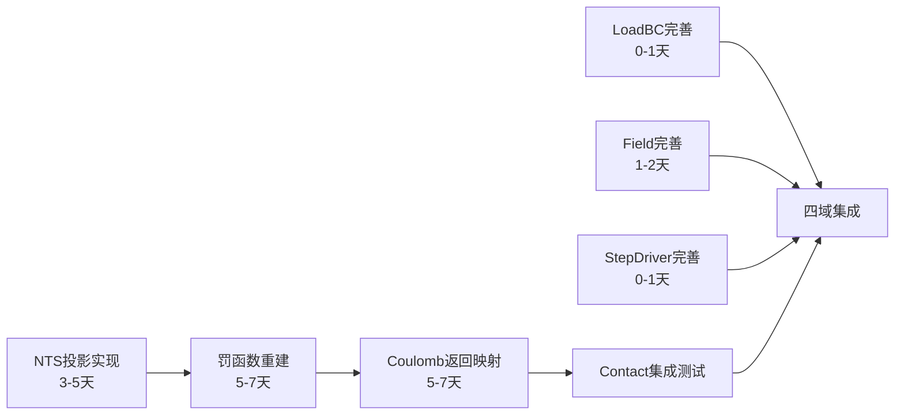

# 四域热路径算法复用评估报告

**版本**: v1.0 | **日期**: 2026-04-28  
**范围**: Contact / LoadBC / Field / StepDriver 四域  
**评估基线**: Phase A 代码审计结论  
**产出关联**: 各域 `DESIGN_*_HotPath.md` 设计文档

---

## 1. 评估总览

### 1.1 综合评估矩阵

| 域 | 层级 | 完整度 | 复用级别 | 补齐工作量 | 关键风险 |
|----|------|--------|---------|-----------|---------|
| **Contact** | L4_PH | **37%** (加权) | L2-L3 | **13天** | NTS投影核心缺失，罚函数/摩擦仅框架 |
| **LoadBC** | L4_PH | **95%** | L1直接复用 | **0-1天** | 随动压力切线可选完善 |
| **Field** | L4_PH | **94%** | L1直接复用 | **1-2天** | GP→Node外推精度可选完善 |
| **StepDriver** | L5_RT | **96%** | L1直接复用 | **0-1天** | 多级回退日志增强 |

### 1.2 复用级别定义

| 级别 | 含义 | 动作 |
|------|------|------|
| **L1** | 直接复用 | 代码无需修改, 仅文档对齐 |
| **L2** | 框架复用 | 数据结构/接口可用, 需补齐算法核心 |
| **L3** | 参考复用 | 设计思路可参考, 需重写实现 |
| **L4** | 重新实现 | 仅概念层面可参考 |

---

## 2. Contact域详细评估

### 2.1 NTS搜索 — 55% (L2-L3复用)

| 子模块 | 文件 | 完整度 | 可复用部分 | 需补齐 |
|--------|------|--------|-----------|--------|
| BVH构建 | `PH_Cont_BVHBuilder.f90` (385行) | 70% | AABB计算, 递归分裂框架 | SAH排序 (L162 TODO) |
| BVH遍历 | `PH_Cont_BVHQuery.f90` (432行) | 80% | 栈式遍历框架 (L46-150) | 精确距离计算 (L305 TODO) |
| 全局搜索 | `PH_Cont_Search.f90` (220行) | 40% | 暴力搜索可作fallback | BVH集成路径 (L92 placeholder) |
| 空间哈希 | `PH_Cont_Search.f90` (L142-160) | 20% | 接口定义 | 完整哈希表实现 (L153-155 placeholder) |
| NTS投影 | 无 | 0% | — | 局部NR投影 + 自然坐标求解 |
| CCD | `PH_Cont_CCD.f90` (384行) | 60% | TOI计算框架 | 保守步进精化 |

**工期估算**: 3-5天 (NTS投影2天 + BVH精化1天 + 集成2天)

### 2.2 罚函数 — 20% (L3复用)

| 子模块 | 文件 | 完整度 | 可复用部分 | 需补齐 |
|--------|------|--------|-----------|--------|
| 间隙函数 | `PH_Cont_Core.f90` L83-95 | 40% | 标量gap逻辑 | 面级投影后间隙 |
| 法向力 | `PH_Cont_Core.f90` L100-112 | 60% | 罚函数公式 | 等效节点力向量 |
| 接触刚度 | `PH_Cont_Core.f90` L149-168 | 30% | 3×3外积框架 | 完整(3n+3)×(3n+3)矩阵 |
| 罚参数 | `PH_Cont_Core.f90` L173-177 | 80% | E/h估算 | 自适应调整 |
| CSR装配 | `PH_Cont_CSR.f90` | 60% | CSR格式框架 | 对接新刚度格式 |

**工期估算**: 5-7天 (面级力计算2天 + 完整刚度矩阵2天 + CSR装配1天 + 调试2天)

### 2.3 Coulomb摩擦 — 15% (L3复用)

| 子模块 | 文件 | 完整度 | 可复用部分 | 需补齐 |
|--------|------|--------|-----------|--------|
| Coulomb基础 | `PH_Cont_Friction.f90` L75-124 | 50% | 速度方向摩擦力 | 增量返回映射 |
| 粘滑转换 | `PH_Cont_Friction.f90` L130-182 | 50% | 指数衰减公式 | 与返回映射集成 |
| 正则化 | `PH_Cont_Friction.f90` L187-229 | 70% | tanh正则化 | 无需大改 |
| 一致切线 | `PH_Cont_Friction.f90` L333-372 | 30% | 近似外积 | 粘结/滑动分支精确形式 |
| 切向刚度 | 无 | 0% | — | 与罚函数刚度合并 |

**工期估算**: 5-7天 (返回映射2天 + 一致切线2天 + 集成测试3天)

---

## 3. LoadBC域详细评估

### 3.1 完整子程序清单 — 95% (L1直接复用)

| 子程序 | 完整度 | 说明 |
|--------|--------|------|
| `PH_Load_AssembleCLoad` | 100% | 集中力组装 |
| `PH_Load_AssembleGravity` | 100% | 重力组装 |
| `PH_Load_ApplyBody_Gravity` | 100% | 重力体力 (Gauss积分) |
| `PH_Load_ApplyBody_Generic` | 100% | 通用体力 |
| `PH_Load_ApplyConcentrated_Single` | 100% | 单点集中力 |
| `PH_Load_ApplyConcentrated_Batch` | 100% | 批量集中力 |
| `PH_Load_ApplyDistributed_Surface` | 100% | 面分布力 (Gauss面积分) |
| `PH_Load_ApplyDistributed_Edge` | 100% | 边分布力 |
| `PH_Load_ApplyFollower_Pressure` | 90% | 随动压力 (大变形法向更新) |
| `PH_Load_ApplyPressure_Surface` | 100% | 面压力 |
| `PH_Load_ApplyThermal_Uniform` | 100% | 均匀热载 |
| `PH_Load_ApplyThermal_Gradient` | 100% | 梯度热载 |
| `PH_Load_ComputeEquivForce` | 100% | 等效节点力 |
| `PH_Load_ComputeFollowerTangent` | 90% | 随动切线刚度 |
| `PH_Load_ComputeSurfaceNormal` | 100% | 面法向计算 |

### 3.2 可选完善点

| 项目 | 当前 | 完善内容 | 优先级 | 工期 |
|------|------|---------|--------|------|
| 随动压力切线 | 基础实现 | 大变形高阶项 | 低 | 0.5天 |
| 幅值插值 | 线性 | Akima/PCHIP | 低 | 0.5天 |

**总工期**: 0-1天

---

## 4. Field域详细评估

### 4.1 三类场完整度 — 94% (L1直接复用)

| 场类型 | 文件 | 完整度 | 已实现 |
|--------|------|--------|--------|
| 温度 | `PH_Field_ComputeTemp.f90` (682行) | 95% | 显式/隐式求解, Laplacian组装, 质量矩阵, 热源, Dirichlet/Neumann/Robin BC |
| 孔压 | `PH_Field_ComputePore.f90` (253行) | 95% | 显式/隐式求解, 渗流矩阵, 源项, 三类BC |
| 浓度 | `PH_Field_ComputeConc.f90` (246行) | 92% | 显式/隐式求解, 扩散矩阵, 反应源, 三类BC |

### 4.2 耦合完整度

| 耦合类型 | 过程 | 完整度 | 公式 |
|---------|------|--------|------|
| 热膨胀 | `PH_Field_Cpl_ThermoMech` | 100% | ε_th = α·ΔT·I |
| Biot有效应力 | `PH_Field_Cpl_HydroMech` | 100% | σ' = σ - α_B·p·I |
| Fick扩散 | `PH_Field_Cpl_MassDiffusion` | 100% | J = -D·∇c |
| 声学刚度 | `PH_Acoustic_StiffnessContrib` | 100% | ∇N·∇N Laplacian |
| 电磁刚度 | `PH_ElectroMag_StiffnessContrib` | 100% | μ⁻¹·∇N·∇N |
| 压电耦合 | `PH_Piezo_CouplingContrib` | 100% | B^T·d·∇N |

### 4.3 可选完善点

| 项目 | 当前 | 完善内容 | 优先级 | 工期 |
|------|------|---------|--------|------|
| GP→Node外推 | 简单平均 | 超收敛点外推 | 中 | 1天 |
| 各向异性扩散 | 标量D | 张量D支持 | 低 | 1天 |

**总工期**: 1-2天

---

## 5. StepDriver域详细评估

### 5.1 核心算法完整度 — 96% (L1直接复用)

| 算法 | 完整度 | 已实现 |
|------|--------|--------|
| NR迭代 | 100% | `RT_NLSolver_NewtonRaph` 完整NR循环 |
| 线搜索 | 100% | `RT_NLSolver_LineSearch` Armijo回退 |
| 收敛三准则 | 98% | `MD_Conv_Check` 力/位移/能量 + AND/OR/WEIGHTED |
| 自动切步 | 95% | `MD_TimeIncrement_Calc` 成功增长/失败切步 |
| 多级回退 | 90% | `RT_StepDriver_Execute` 连续切步计数 |
| 显式Central Diff | 100% | `RT_DynExpl_Run` + CFL控制 |
| 隐式Newmark/HHT | 100% | `RT_DynImpl_Run` + Newton内循环 |
| CFL稳定性 | 100% | `RT_Dyn_CFL_dt_central_diff` + ω_max估计 |
| 三层状态机 | 100% | `StepStateMachine` Step/Inc/Iter |
| AI步长控制 | 框架 | `AI_StepCtr_Type` PLACEHOLDER |

### 5.2 可选完善点

| 项目 | 当前 | 完善内容 | 优先级 | 工期 |
|------|------|---------|--------|------|
| 多级回退日志 | 基础 | 详细回退原因记录 | 低 | 0.5天 |
| 弧长法 | 预留 | Riks增广 | 延后 | — |

**总工期**: 0-1天

---

## 6. 综合复用矩阵

### 6.1 按算法模块

```
                    ┌──────────────────────────────────────────────────┐
                    │           算法复用完整度热力图                    │
                    ├──────────────────────────────────────────────────┤
  Contact           │  NTS投影  BVH遍历  罚函数  摩擦映射  一致切线    │
                    │  ░░░░░░  ██████░  ███░░░  ██░░░░░  █░░░░░░     │
                    │   0%      80%      30%     40%      30%         │
                    ├──────────────────────────────────────────────────┤
  LoadBC            │  集中力  体力积分  面力积分  压力  随动压力      │
                    │  ████████ ████████ ████████ ████████ ███████░   │
                    │   100%     100%     100%     100%     90%       │
                    ├──────────────────────────────────────────────────┤
  Field             │  温度场  孔压场  浓度场  热膨胀  Biot  Fick     │
                    │  ███████░ ███████░ ██████░ ████████ ████████ ████│
                    │   95%      95%      92%     100%    100%   100% │
                    ├──────────────────────────────────────────────────┤
  StepDriver        │  NR迭代  收敛准则  自动切步  线搜索  动力学     │
                    │  ████████ ████████ ███████░ ████████ ████████   │
                    │   100%     98%      95%      100%     100%      │
                    └──────────────────────────────────────────────────┘
  
  图例: █ = 已实现 10%    ░ = 待补齐 10%
```

### 6.2 工期汇总

| 域 | 补齐工作量 | 优先级 | 前置依赖 |
|----|-----------|--------|---------|
| Contact NTS搜索 | 3-5天 | **P0** | 无 |
| Contact 罚函数重建 | 5-7天 | **P0** | NTS搜索 |
| Contact 摩擦返回映射 | 5-7天 | **P0** | 罚函数 |
| LoadBC 完善 | 0-1天 | P2 | 无 |
| Field 完善 | 1-2天 | P2 | 无 |
| StepDriver 完善 | 0-1天 | P2 | 无 |
| **总计** | **14-23天** | — | — |

### 6.3 关键路径



**关键路径**: Contact域 (13-19天), 其他三域可并行.

---

## 7. 风险与建议

### 7.1 风险

| 风险 | 级别 | 影响 | 缓解措施 |
|------|------|------|---------|
| Contact NTS投影精度 | 高 | 接触搜索不准确 | 先实现暴力搜索验证, 再切BVH |
| 罚参数敏感性 | 中 | 收敛困难 | 自适应罚参数策略 |
| 摩擦一致切线 | 中 | NR二次收敛性降低 | 先用近似切线, 后补精确形式 |

### 7.2 建议实施顺序

1. **Week 1-2**: Contact NTS投影 + BVH精化 + 罚函数面级扩展
2. **Week 2-3**: Coulomb返回映射 + 一致切线 + CSR装配
3. **Week 3**: Contact集成测试 + LoadBC/Field/StepDriver小幅完善
4. **Week 3-4**: 四域端到端集成验证

---

*本报告由 Phase A 评估结论驱动, 设计详情见各域 `DESIGN_*_HotPath.md`.*
