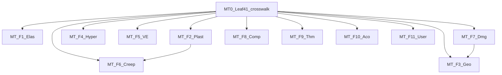

# Material 域改造 · 子任务 backlog（11 主族 × Leaf41 对齐）

**目的**：在 **[`Abaqus614_Material_Leaf41.md`](./Abaqus614_Material_Leaf41.md)** 固定 41 行与 **11 `mat_family`** 前提下，把 `L3_MD/Material`（及必要的 L4/L5 金线）改造为 **可验收、可并行** 的子任务。  
**原则**：每子任务 **≤20 过程优先、1–3 个 `.f90` 为主**；每 MR 末跑 `python UFC/tools/material_pillar_audit.py`；不增第 42 叶（见 Leaf41 修订流程）。  
**工单模板**：[`Material_Family_WorkOrder_Template.md`](./Material_Family_WorkOrder_Template.md)  
**顺序索引**：[`Material_11Families_Sequential_Rollout.md`](./Material_11Families_Sequential_Rollout.md)

---

## 依赖关系（简图）

- **MT-F2 与 MT-F6**：先对齐 `CONTRACT.md` 再并行改代码，避免蠕变/率相关双真源。  
- **MT-F7 与 MT-F3**：CDP 本构（行 17）与 CDP 损伤（行 33）子任务收尾时 **同一 MR 或连续 MR** 交接边界说明。

---

## MT-0（必须先做）— Leaf41 ↔ 代码真源对照

| ID | 子任务 | 产出 | 验收 |
|----|--------|------|------|
| **MT-0.1** | 建立 **Leaf41_ID → `mat_family` / 代表 `mat_model_id` 或 `MD_MAT_MODEL_*` / 主 `.f90` stem** 对照表 | **[`Leaf41_UFC_Crosswalk.csv`](./Leaf41_UFC_Crosswalk.csv)**（骨架已建；填 `ufc_mat_model_id` / `TODO_umap_to_code` 后验收） | 41 行均有对应行；无空 `leaf_id`；枚举列填满后关闭 |
| **MT-0.2** | 对照表与 **`MD_Ana_Comp.f90`** `GROUP_MAT_COMPAT` 冲突扫描 | [`UFC/REPORTS/MT0_Material_Leaf41_COMPAT_DRIFT.md`](../../../REPORTS/MT0_Material_Leaf41_COMPAT_DRIFT.md) §MT-0.2 | 无未解释冲突或已标「例外已批」 |
| **MT-0.3** | 标注 **超出 41 的现有叶模型**（若存在）为 `EXTENSION_QUARANTINE` 或映射到某 Leaf 行 | 同上报告 §MT-0.3 + CSV 列 `maps_to_leaf_id` / `quarantine_reason` | 与「严格 41」策略一致；禁止静默新增第 42 叶 |
| **MT-0.4** | **弹性 MAT_***：`MAT_ELAS_TRANSV_ISO=103`、`MAT_ELAS_ANISO=104`；**Hill→205** 与 DP@202 分离；`PH_Mat_Reg` / `MD_MatPLM_DescBase` / `MD_Mat_Brg` 同步 | `MD_Mat_Ids.f90`、`PH_Mat_Reg.f90`、`Plast/MD_Mat_Plast_Hill.f90`、`REPORTS/MT0_*.md` 更新 | 见 MT0 报告「partially cleared」 |
| **MT-F1.0b** | `MD_Mat_Ids` 头注释：**MAT_*** vs **Leaf41** vs **`MD_MAT_ID_*`** 真源说明；`MD_MAT_TOTAL_MODELS` 递增至 **65** | `Contract/MD_Mat_Ids.f90` | 与 `Abaqus614_Material_Leaf41.md` 交叉阅读 |
| **MT-F2.x** | **Chaboche=210**、**JC=206**、**Barlat 常量 211**；薄封装 **`MD_MatPLMChaboche` / `MD_MatPLMJohnsonCook` / `MD_MatPLMHill`**；`MD_Mat_Plast_Brg` 路由 CASE 更新 | `Plast/MD_MatPLM*.f90`、`Geo/MD_MatPLG_DruckerPrager.f90`（`MD_MAT_DRUCKERPRAGER_M`） | MR 末 `material_pillar_audit.py` |

---

## MT-F1 — Elastic（Leaf **1–6**，`mat_family=1`）

| ID | 子任务 | 建议触摸路径 | 备注 |
|----|--------|--------------|------|
| **MT-F1.1** | 行 **1** ISO：`props` / typed Desc 与 `*ELASTIC, TYPE=ISOTROPIC` 对齐 | `Elas/MD_Mat_Elas_Isotropic.f90`（或现网等价 stem）+ Populate 调用链 | 首个子 MR 首选 |
| **MT-F1.2** | 行 **2–3** ORTHO + TRANS：字段与手册表对齐 | `Elas/*Ortho*`、`*Trans*` 相关模块 | 可与 F1.1 并行若不同文件 |
| **MT-F1.3** | 行 **4–6** ANISO / HYPO / POROUS | `Elas/` 余下 + `Contract/MD_MatELA_CoupledDesc.f90` 仅当共用常量 | 控制单 MR 体积 |

---

## MT-F2 — Plastic（Leaf **7–13**，`mat_family=2`）

| ID | 子任务 | 建议触摸路径 |
|----|--------|--------------|
| **MT-F2.1** | 行 **7** J2/Mises | `Plast/MD_Mat_Plast_J2.f90` 等 |
| **MT-F2.2** | 行 **8–10** Chaboche / Hill / Barlat | `Plast/MD_Pls_*` / `MD_Mat_Plast_*` |
| **MT-F2.3** | 行 **11–13** JC / GTN / 率相关 | `Plast/...`；**与 MT-F6 边界**写在 MR 描述 |

---

## MT-F3 — Geo（Leaf **14–17**，`mat_family=3`）

| ID | 子任务 | 建议触摸路径 |
|----|--------|--------------|
| **MT-F3.1** | 行 **14–15** DP + MC | `Geo/` + `Contract/MD_MatPlgGeotech_Def.f90` 相关 TYPE |
| **MT-F3.2** | 行 **16–17** Cam-Clay + CDP | 同上；**MT-F7 行 33** 边界一并说明 |

---

## MT-F4 — Hyperelastic（Leaf **18–23**，`mat_family=4`）

| ID | 子任务 | 建议触摸路径 |
|----|--------|--------------|
| **MT-F4.1** | 行 **18–20** Neo / MR / Ogden | `Contract/MD_MatHYP_Def.f90` 分区 + `HyperElas/` |
| **MT-F4.2** | 行 **21–23** Yeoh / AB / Foam | 同上；Marlow 见 `Abaqus614` 文末规则 |

---

## MT-F5 — Viscoelastic（Leaf **24–27**，`mat_family=5`）

| ID | 子任务 | 建议触摸路径 |
|----|--------|--------------|
| **MT-F5.1** | 行 **24–25** Prony + KV | `Contract/MD_MatVSC_Def.f90` + `Viscoelas/` |
| **MT-F5.2** | 行 **26–27** 蠕变粘性 + VEVP | 同上 + **MT-F6** 文档对齐 |

---

## MT-F6 — Creep（Leaf **28–30**，`mat_family=6`）

| ID | 子任务 | 建议触摸路径 |
|----|--------|--------------|
| **MT-F6.1** | 行 **28–29** Power + Garofalo | `Creep/` |
| **MT-F6.2** | 行 **30** Gurson 蠕变 | `Creep/` + 与 **行 12 GTN** 对照段 |

---

## MT-F7 — Damage（Leaf **31–34**，`mat_family=7`）

| ID | 子任务 | 建议触摸路径 |
|----|--------|--------------|
| **MT-F7.1** | 行 **31–32** 延性 / 脆性 | `Contract/MD_MatDMG_Def.f90` + `Damage/` |
| **MT-F7.2** | 行 **33–34** CDP 损伤 / 疲劳 | 同上；**行 17** 几何 CDP 边界 |

---

## MT-F8 — Composite（Leaf **35–36**，`mat_family=8`）

| ID | 子任务 | 建议触摸路径 |
|----|--------|--------------|
| **MT-F8.1** | 行 **35** 层合/织物（合并叶） | `Composite/` |
| **MT-F8.2** | 行 **36** Hashin | `Composite/` |

---

## MT-F9 — Thermal（Leaf **37–39**，`mat_family=9`）

| ID | 子任务 | 建议触摸路径 |
|----|--------|--------------|
| **MT-F9.1** | 行 **37–39** 传导 / 膨胀 / 相变 | `Thermal/` + `MD_Ana_Comp` 第 9 列注释 |

---

## MT-F10 — Acoustic（Leaf **40**，`mat_family=10`）

| ID | 子任务 | 建议触摸路径 |
|----|--------|--------------|
| **MT-F10.1** | 行 **40** 声学合并叶（介质 + 吸声选项） | `Acoustic/` + L4 `PH_MAT_ACOUSTIC` |

---

## MT-F11 — User（Leaf **41**，`mat_family=11`）

| ID | 子任务 | 建议触摸路径 |
|----|--------|--------------|
| **MT-F11.1** | 行 **41** UMAT/VUMAT/UEL bundle：合同字段与冷路径注册 | `User/` + `Contract/MD_MatSPU_Def.f90` + `MD_MAT_UMAT_*` in `Contract/MD_Mat_Def.f90` |

---

## 建议并行批次（人力充足时）

| 批次 | 可并行子任务 |
|------|----------------|
| **B0** | MT-0.1–0.3 串行 |
| **B1** | MT-F1.*、MT-F9.*（与弹性热族交叉少） |
| **B2** | MT-F4.*、MT-F10.* |
| **B3** | MT-F2.*（需 F6 文档先行或并行文档 MR） |
| **B4** | MT-F3.*、MT-F7.*（CDP 协调） |
| **B5** | MT-F5.*、MT-F6.* |
| **B6** | MT-F8.*、MT-F11.* |

---

## 下一步（默认执行顺序）

1. **MT-0.5**：消解 **202** 上 **DP vs J2 表格硬化** 等剩余双绑（见 `MT0_Material_Leaf41_COMPAT_DRIFT.md`）。  
2. **MT-F1.2–F1.3**：Leaf **2–6** 弹性金线（`*ELASTIC` ORTHO/TRANS/ANISO/HYPO/POROUS）。  
3. 每 MR 更新 **Rollout 矩阵** 对应族行（[`Material_Family_Rollout_Matrix.md`](./Material_Family_Rollout_Matrix.md)）。
