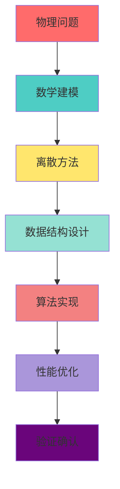

# UFC 架构设计总纲 — 深度整合版 v5.1

> **版本**: v5.1 (AI-ready 完整闭环补齐版)  
> **创建日期**: 2026-03-11  
> **最后更新**: 2026-03-28  
> **核心使命**: 构建世界级 Fortran 有限元计算内核，对标并超越 ABAQUS  
> **文档地位**: ⭐  UFC 项目架构设计唯一权威主线  
> **适用范围**: UFC 项目全生命周期架构设计与实施（ExternalLibs 除外）

---

## 📋 文档元数据


| 属性          | 值                                                                                                                                                                                                                                                                                                             |
| ----------- | ------------------------------------------------------------------------------------------------------------------------------------------------------------------------------------------------------------------------------------------------------------------------------------------------------------- |
| **规范简称**    | UFC_DesignOutline_6L4C4C3S3L2D1U_VHI                                                                                                                                                                                                                                                                          |
| **上位文档**    | 无（本文档为唯一主线）                                                                                                                                                                                                                                                                                                   |
| **分支文档**    | UFC_核心架构设计总纲_v4.0_融合版.md（入门导读） UFC_统一数据容器设计规范.md（容器设计） UFC_数据链生命周期管理规则.md（生命周期） [UFC_统一内存管理体系设计_v3.0.md](../../archive/PLAN_History/99_归档库/01_历史版本文档/内存管理/UFC_统一内存管理体系设计_v3.0.md)（内存管理归档正文；演进稿见 `99_归档库/01_历史版本文档/内存管理/`）                                                                                     |
| **核心公式**    | **六层+ 四类 + 四链 + 三步 + 三级+ 两图+ 一体+ 可验证性第一 + 热路径隔离 + AI-ready**                                                                                                                                                                                                                                                  |
| **版本演进**    | v2.3 → v5.0：深度整合所有分支文档，统一技术路径，消除矛盾表述                                                                                                                                                                                                                                                                          |
| **v5.1 变更** | §11 补齐完整 AI-ready 闭环定义（三代演进 + 可微分物理引擎 + 插槽⑦ AI_AdjointSolver）；**§11.2** 澄清 ORT 仅约束 NN 路径、SKU-A/B 分档；**§11.4** 梯度策略与集成规范 §1.2.2 对齐；**§11.4.1** R/θ 与四型落位及 RT/NM/PH 合同锚点；**对外宣讲一页** `05_实施指南/UFC_插槽⑦与层3分工_对外宣讲一页.md`；**§11.6 开展纲要**；**§12** 新增四组补强治理规则（`API-* / MEM-* / HOT-* / PAR-`*）；**§0.4 显式非目标**；分支文档引用更新 |


---

## 🎯 零、架构设计哲学与方法论

### 0.1 终极目标

**UFC 试图在有限元计算这个极端复杂的工程领域里，实现"可被机器证明的、单向依赖的、热路径可极致优化的、未来可被 AI 接管的、一体化闭环系统"**。

这不是简单的代码组织，而是对复杂系统的驯服之道。

### 0.2 三大核心洞察

#### 洞察 1: L3_MD 是唯一真相来源

```
┌─────────────────────────────────────────────────────────┐
│ 数据温度与存储位置                                       │
├─────────────────────────────────────────────────────────┤
│ 🔴 热数据 (Hot)                                          │
│   - 位置：L4_PH/L5_RT 本地临时结构（派生视图）            │
│   - 特点：Step/Increment 级生命周期，性能敏感             │
│   - 示例：单元刚度矩阵 Ke、内力向量 Re                    │
│   - 约束：不得独立作为真相来源，必须能从 L3 重建          │
├─────────────────────────────────────────────────────────┤
│ 🟡 温数据 (Warm)                                         │
│   - 位置：L3_MD 域级容器的 state 字段                     │
│   - 特点：可写回有限字段（currentValue/currentTime）      │
│   - 示例：当前位移、速度、加速度                          │
│   - 约束：禁止修改 desc/algo 字段                         │
├─────────────────────────────────────────────────────────┤
│ 🔵 冷数据 (Cold)                                         │
│   - 位置：L3_MD 域级容器的 desc/algo 字段                 │
│   - 特点：Write-Once，模型定义后冻结                     │
│   - 示例：材料参数、几何尺寸、单元类型                    │
│   - 约束：任何层禁止修改                                  │
└─────────────────────────────────────────────────────────┘
```

**核心原则**:

- ✅ L3_MD 是全局唯一真相来源（Single Source of Truth）
- ✅ L4_PH/L5_RT 的所有数据必须能从 L3_MD 单向派生
- ✅ 派生数据可随时丢弃并重建，不损失语义完整性

#### 洞察 2: 单向依赖是架构稳定的基石

```fortran
! ✅ 正确：单向依赖
L6_USES(L5)
L5_USES(L4, L3, L2, L1)
L4_USES(L3, L2, L1)
L3_USES(L2, L1)
L2_USES(L1)
L1_USES(无)

! ❌ 错误：反向依赖（编译失败）
L3_USES(L4)  ! 禁止！
L4_USES(L5)  ! 禁止！
```

**为什么重要**:

- 防止循环依赖导致的架构腐败
- 确保高层模块变化不影响低层模块
- 实现真正的关注点分离

#### 洞察 3: 数据结构决定算法效率

**传统做法**:

```fortran
TYPE :: Material
  REAL(wp) :: E, nu, rho  ! 散列参数
END TYPE
! 问题：添加新参数需修改所有调用点
```

**UFC 做法**:

```fortran
TYPE :: MD_Material_Desc
  REAL(wp) :: young_modulus = 0.0_wp
  REAL(wp) :: poisson_ratio = 0.0_wp
  REAL(wp) :: density = 0.0_wp
CONTAINS
  PROCEDURE :: RegLayout => Material_RegLayout
  PROCEDURE :: Ensure    => Material_Ensure
  PROCEDURE :: Init      => Material_Init
  PROCEDURE :: Clone     => Material_Clone
  PROCEDURE :: Finalize  => Material_Finalize
END TYPE
! 优势：封装性、可扩展性、面向对象
```

### 0.3 架构设计方法论




**关键步骤**:

1. **物理问题** - 理解实际工程问题（如悬臂梁弯曲）
2. **数学建模** - 建立控制方程（如 Navier 方程）
3. **离散方法** - 选择数值方法（如有限元）
4. **数据结构设计** - 设计四类 TYPE（Desc/State/Algo/Ctx）⭐ **最关键**
5. **算法实现** - 编写计算代码（B 矩阵、刚度矩阵等）
6. **性能优化** - 热路径隔离、SIMD 优化、缓存友好
7. **验证确认** - 单元测试、集成测试、基准测试

### 0.4 显式非目标：内核默认不假设深度学习训练环

为避免读者将「AI-ready」误解为「UFC 即通用机器学习框架」，下列边界**写死为架构非目标**（与 §11 智能化能力**正交补充**）：

1. **默认内核语义**：UFC 面向**确定性有限元前向求解**与工程 **V&V**；**不假设**在内核热路径内嵌 **PyTorch / TensorFlow 等深度学习训练环**，也不将「通用反向传播」作为 L3–L5 的缺省行为。
2. **可微分与伴随**：若产品需要连续灵敏度、离散伴随或与外部可微框架对接，须通过**显式扩展与合同**接入（例如：可选域模块、Bridge、注册式插件、合同字段与**版本位/能力标志**），不得在未修订合同的情况下把「整张计算图」硬绑进核心六层。
3. **「AI-ready」在本总纲中的含义**：指**契约化数据链、可观测、可自动化验证、可插拔智能化与外层编排对接**；**不等于**「UFC = ML 训练框架」。

---

## 🏗️ 一、六层架构（Layer Architecture）

### 1.1 层级定义与职责边界

```
┌─────────────────────────────────────────────────────────────┐
│ L6_AP: Application Layer（应用层）                           │
│ ├─ 职责：命令解析、脚本 API、图形界面、前后处理               │
│ ├─ 典型模块：AP_Command, AP_Script, AP_GUI, AP_PrePost     │
│ ├─ 依赖：L5_RT                                               │
│ └─ 禁止：直接访问 L1-L4 任何模块                               │
├─────────────────────────────────────────────────────────────┤
│ L5_RT: Runtime Layer（运行时状态层）                         │
│ ├─ 职责：求解器调度、作业管理、步骤控制、全局状态管理         │
│ ├─ 典型模块：RT_Solver, RT_Job, RT_Step, RT_State          │
│ ├─ 依赖：L4_PH, L3_MD, L2_NM, L1_IF                          │
│ └─ 核心：管理全局系统矩阵 K、F、U 和收敛控制                  │
├─────────────────────────────────────────────────────────────┤
│ L4_PH: Physics Layer（物理层）                               │
│ ├─ 职责：单元计算、材料本构、接触算法、载荷边界条件施加       │
│ ├─ 典型模块：PH_Elem, PH_Mat, PH_Contact, PH_Load, PH_BC   │
│ ├─ 依赖：L3_MD, L2_NM, L1_IF                                 │
│ └─ 核心：提供物理计算内核（单元刚度、材料应力应变）           │
├─────────────────────────────────────────────────────────────┤
│ L3_MD: Model Layer（模型数据层）⭐ 核心存储层                 │
│ ├─ 职责：材料定义、网格管理、部件装配、模型树构建            │
│ ├─ 典型模块：MD_Material, MD_Mesh, MD_Part, MD_Assembly    │
│ ├─ 依赖：L2_NM, L1_IF                                        │
│ └─ 核心：提供模型描述数据结构（Desc 类 TYPE，唯一真相来源）   │
├─────────────────────────────────────────────────────────────┤
│ L2_NM: Numerical Layer（数值计算层）                         │
│ ├─ 职责：线性求解器、时间积分、非线性迭代、矩阵运算工具       │
│ ├─ 典型模块：NM_LinearSolver, NM_TimeIntegration, NM_Matrix│
│ ├─ 依赖：L1_IF                                               │
│ └─ 核心：提供数学算法工具（LU 分解、GMRES、Newmark）          │
├─────────────────────────────────────────────────────────────┤
│ L1_IF: Infrastructure Layer（基础设施层）⭐ 内存管理体系      │
│ ├─ 职责：精度控制、内存管理、错误处理、日志系统、IO          │
│ ├─ 典型模块：IF_Precision, IF_Memory, IF_Error, IF_Log     │
│ ├─ 依赖：Fortran 内置模块                                     │
│ └─ 核心：提供基础工具和类型定义（WP, DP, ErrorCode）         │
└─────────────────────────────────────────────────────────────┘
```

### 1.2 依赖铁律（永不违反）

**验证工具**:

```bash
# 自动检查反向依赖
python scripts/verify_layer_deps.py
```

**违规示例**:

```fortran
! ❌ 编译失败（应报错）
MODULE L3_MD_Mesh
  USE L4_PH_Element  ! 错误！L3 不能使用 L4
END MODULE

! ✅ 编译通过
MODULE L4_PH_Element
  USE L3_MD_Mesh     ! 正确！L4 使用 L3（只读）
END MODULE
```

### 1.3 跨层调用协议

#### 协议 1: L5_RT → L3_MD（只读访问）

```fortran
! L5_RT 层读取 L3_MD 数据
mat_desc => g_ufc_global%md_layer%material%GetDesc(mat_id=1)
! 只读使用，禁止修改 mat_desc 的任何字段
young_mod = mat_desc%young_modulus
```

#### 协议 2: L5_RT → L3_MD（状态写回）

```fortran
! L5_RT 层写回状态到 L3_MD（仅限白名单字段）
CALL g_ufc_global%md_layer%material%WriteBackState( &
    mat_id=1, &
    new_state=mat_state)  ! 只能写 current_value, current_time
```

**白名单字段**:

- ✅ `state%current_value` - 当前值（如位移、应力）
- ✅ `state%current_time` - 当前时间戳
- ❌ `desc%`* - 禁止修改（材料参数等）
- ❌ `algo%*` - 禁止修改（算法参数等）

#### 协议 3: L4_PH → L3_MD（只读访问）

```fortran
! L4_PH 层通过 Domain 的 Get 接口访问 L3_MD
CALL domain%GetMaterial(mat_id, mat_desc)
! 只读使用，禁止修改
```

**禁止行为**:

```fortran
! ❌ 禁止直接访问 L3_MD 内部数组
mat_desc = g_materials(mat_id)  ! 错误！绕过 Domain 接口

! ❌ 禁止修改 L3_MD 数据
mat_desc%young_modulus = 210.0e9  ! 错误！Write-Once 数据
```

---

## 🧬 二、四类 TYPE 系统（Four-Category TYPE System）

### 2.1 四类 TYPE 定义与生命周期

```
┌──────────────────────────────────────────────────────────┐
│ Desc 类（Description）- 不可变配置·冷数据                 │
├──────────────────────────────────────────────────────────┤
│ 职责：材料参数、几何尺寸、单元类型等配置信息              │
│ 生命周期：模型定义阶段创建 → 求解过程只读 → 模型释放     │
│ 管理者：L3_MD 层域级容器                                   │
│ 示例：MAT_MaterialDesc, ELEM_DescType, STEP_DescType     │
│ 约束：Write-Once，禁止在求解过程修改                      │
└──────────────────────────────────────────────────────────┘
                    ↓ 只读引用
┌──────────────────────────────────────────────────────────┐
│ State 类（State）- 可变状态·温数据                        │
├──────────────────────────────────────────────────────────┤
│ 职责：位移、应力、应变、损伤等运行时状态变量              │
│ 生命周期：求解器初始化创建 → 动态更新 → 求解器释放       │
│ 管理者：L5_RT 层（L4_PH 通过参数访问）                     │
│ 示例：MAT_StateType, ELEM_StateType, RT_GlobalState      │
│ 约束：仅允许写回有限字段（currentValue/currentTime）      │
└──────────────────────────────────────────────────────────┘
                    ↓ 算法参数
┌──────────────────────────────────────────────────────────┐
│ Algo 类（Algorithm）- 算法逻辑·冷数据（Write-Once）       │
├──────────────────────────────────────────────────────────┤
│ 职责：本构积分算法、时间积分参数、收敛准则等              │
│ 生命周期：全局/域初始化创建 → 算法执行只读 → 全局释放    │
│ 管理者：全局单例或域级单例                                │
│ 示例：MAT_VonMisesAlgo, NM_NewmarkAlgo, RT_SolverAlgo    │
│ 约束：单次计算内禁止修改，可全局共享                      │
└──────────────────────────────────────────────────────────┘
                    ↓ 临时上下文
┌──────────────────────────────────────────────────────────┐
│ Ctx 类（Context）- 上下文环境·热数据（临时）              │
├──────────────────────────────────────────────────────────┤
│ 职责：临时工作数组、中间结果、执行上下文                  │
│ 生命周期：计算调用开始创建 → 计算结束立即释放             │
│ 管理者：调用者负责（单次计算调用内）                      │
│ 示例：MAT_EvalCtx, ELEM_WorkSpace, RT_IterationCtx       │
│ 约束：不得跨越多次计算调用，第一个被丢弃                  │
└──────────────────────────────────────────────────────────┘
```

### 2.2 标准化接口（必须实现）

```fortran
TYPE :: MD_Material_Desc
  ! === 数据字段 ===
  REAL(wp) :: young_modulus = 0.0_wp
  REAL(wp) :: poisson_ratio = 0.0_wp
  REAL(wp) :: density = 0.0_wp
  
CONTAINS
  ! === 标准 PROCEDURE（四类必须全部实现）===
  PROCEDURE :: RegLayout => Material_RegLayout  ! 注册内存布局
  PROCEDURE :: Ensure    => Material_Ensure    ! 确保存储充足
  PROCEDURE :: Init      => Material_Init      ! 初始化
  PROCEDURE :: Clone     => Material_Clone     ! 深拷贝
  PROCEDURE :: Finalize  => Material_Finalize  ! 释放资源
END TYPE
```

### 2.3 命名规范（强制）

```fortran
! ✅ 符合规范（下划线风格）
TYPE :: MD_Material_Desc      ! 域名_Type 类别
TYPE :: MD_Material_State
TYPE :: MD_Material_Algo
TYPE :: MD_Material_Ctx

! ❌ 禁止使用（驼峰式/混合式）
TYPE :: MD_MaterialDesc       ! 驼峰 ❌
TYPE :: MD_MaterialSTATE      ! 全大写 ❌
TYPE :: MaterialDescType      ! Type 后缀 ❌
```

---

## 💾 三、统一数据容器架构（Unified Data Container）

### 3.1 三级嵌套结构

```
Level 1: UFC_GlobalContainer (全局容器)
  ↓
Level 2: Layer Containers (6 层容器)
  ├── if_layer (L1_IF)
  ├── nm_layer (L2_NM)
  ├── md_layer (L3_MD)  ⭐ 核心
  ├── ph_layer (L4_PH)
  ├── rt_layer (L5_RT)
  └── ap_layer (L6_AP)
  ↓
Level 3: Domain Containers (域级容器)
  ├── MD_Material_Domain (材料域)
  ├── MD_Mesh_Domain (网格域)
  ├── MD_Model_Domain (模型域)
  ├── MD_Section_Domain (截面域)
  ├── MD_Step_Domain (分析步域)
  ├── MD_LoadBC_Domain (载荷边界域)
  ├── MD_Assembly_Domain (装配域)
  ├── MD_Instance_Domain (实例域)
  ├── MD_Output_Domain (输出域)
  ├── MD_Amplitude_Domain (幅值域)
  └── MD_Job_Domain (作业域)
```

### 3.2 域级容器标准结构

```fortran
TYPE :: MD_Material_Domain
  ! === 四类 TYPE 数组（核心数据）===
  TYPE(MAT_MaterialDesc),  ALLOCATABLE :: desc(:)   ! 冷数据
  TYPE(MAT_StateType),     ALLOCATABLE :: state(:)  ! 温数据
  TYPE(MAT_AlgoType),      ALLOCATABLE :: algo(:)   ! 冷数据
  
  ! === 注册表（统一管理）===
  TYPE(MaterialRegistry) :: registry
  
  ! === 内存池引用（可选，性能优化）===
  TYPE(IF_Mem_PoolMgr_Type), POINTER :: pool_mgr => NULL()
  
CONTAINS
  ! === 标准接口（A-Z 排序）===
  PROCEDURE :: GetAlgo   => Material_GetAlgo
  PROCEDURE :: GetDesc   => Material_GetDesc
  PROCEDURE :: GetState  => Material_GetState
  PROCEDURE :: Init      => Material_Domain_Init
  PROCEDURE :: Finalize  => Material_Domain_Finalize
  PROCEDURE :: Register  => Material_Register
  PROCEDURE :: WriteBack => Material_WriteBackState
END TYPE
```

### 3.3 全局根容器实现

``fortran
MODULE UF_GlobalContainer_Core
  USE IF_Prec, ONLY: wp, i4
  USE IF_Err_API, ONLY: ErrorStatusType, STATUS_OK

  IMPLICIT NONE
  PRIVATE

  PUBLIC :: UFC_GlobalContainer
  PUBLIC :: Init_Global_Container
  PUBLIC :: Finalize_Global_Container

  ! 层级容器前向声明
  TYPE :: L1_IF_Container
    ! 基础设施层容器
  END TYPE

  TYPE :: L2_NM_Container
    ! 数值计算层容器
  END TYPE

  TYPE :: L3_MD_Container
    ! 模型数据层容器（⭐ 核心）
    TYPE(MD_Material_Domain), ALLOCATABLE :: material
    TYPE(MD_Mesh_Domain), ALLOCATABLE :: mesh
    TYPE(MD_Part_Domain), ALLOCATABLE :: part
    ! ... 其他域
  END TYPE

  TYPE :: L4_PH_Container
    ! 物理层容器
  END TYPE

  TYPE :: L5_RT_Container
    ! 运行时层容器
  END TYPE

  TYPE :: L6_AP_Container
    ! 应用层容器
  END TYPE

  ! === 全局根容器 ===
  TYPE :: UFC_GlobalContainer
    TYPE(L1_IF_Container) :: if_layer
    TYPE(L2_NM_Container) :: nm_layer
    TYPE(L3_MD_Container) :: md_layer  ! ⭐ 核心存储层
    TYPE(L4_PH_Container) :: ph_layer
    TYPE(L5_RT_Container) :: rt_layer
    TYPE(L6_AP_Container) :: ap_layer

```
! === 内存池管理器（L1_IF）===
TYPE(IF_Mem_PoolMgr_Type), POINTER :: pool_mgr => NULL()
```

  CONTAINS
    PROCEDURE :: Initialize => UFC_GlobalContainer_Init
    PROCEDURE :: Finalize   => UFC_GlobalContainer_Finalize
  END TYPE

  ! === 全局单例 ===
  TYPE(UFC_GlobalContainer), TARGET :: g_ufc_global

CONTAINS
  SUBROUTINE Init_Global_Container(status)
    TYPE(ErrorStatusType), INTENT(INOUT) :: status

```
CALL g_ufc_global%Initialize(status)

! 获取内存池管理器引用
g_ufc_global%pool_mgr => g_ufc_global%if_layer%pool_mgr
```

  END SUBROUTINE

  SUBROUTINE Finalize_Global_Container(status)
    TYPE(ErrorStatusType), INTENT(INOUT) :: status

```
CALL g_ufc_global%Finalize(status)
```

  END SUBROUTINE

END MODULE

```

---

## 🔄 四、四链贯通（Four Chains Integration）

### 4.1 四链定义与映射

```

┌─────────────────────────────────────────────────────────┐
│ 理论链（Theory Chain）                                    │
│ 物理问题 → 数学公式 → 离散方法                           │
│ 示例：弹性力学 → 虚功原理 → 有限元 discretization        │
└─────────────────────────────────────────────────────────┘
              ↓ 映射到
┌─────────────────────────────────────────────────────────┐
│ 逻辑链（Logic Chain）                                     │
│ 模型构建 → 物理计算 → 求解器调度                         │
│ 示例：L3_MD 建模 → L4_PH 计算 → L5_RT 求解                 │
└─────────────────────────────────────────────────────────┘
              ↓ 调用
┌─────────────────────────────────────────────────────────┐
│ 计算链（Computation Chain）                               │
│ 全局组装 → 单元计算 → 材料本构                           │
│ 示例：K_global ← Σ(Ke) ← σ ← ε ← constitutive law       │
└─────────────────────────────────────────────────────────┘
              ↓ 持有
┌─────────────────────────────────────────────────────────┐
│ 数据链（Data Chain）                                      │
│ Desc 配置 → State 状态 → Algo 算法 → Ctx 临时              │
│ 示例：mat_desc → mat_state → mat_algo → eval_ctx         │
└─────────────────────────────────────────────────────────┘

```

### 4.2 实战示例：材料本构评估

``fortran
! ============================================================
! 理论链：J2 流动理论 + Von Mises 屈服准则
!   σ_eq = sqrt(3/2 * s:s)
!   f = σ_eq - σ_y(ε_p)
! ============================================================

! ============================================================
! 逻辑链：L3_MD → L4_PH → L5_RT
! ============================================================
! L3_MD: 材料描述（Desc）
mat_desc => g_ufc_global%md_layer%material%GetDesc(mat_id=1)

! L4_PH: 本构计算（Algo + Ctx）
CALL PH_Mat_Constit_Eval( &
    desc=mat_desc, &      ! Desc 类（只读）
    state=mat_state, &    ! State 类（可写）
    algo=mat_algo, &      ! Algo 类（只读）
    ctx=eval_ctx)         ! Ctx 类（临时）

! L5_RT: 求解器更新（State 写回）
CALL g_ufc_global%md_layer%material%WriteBackState( &
    mat_id=1, &
    new_state=mat_state)

! ============================================================
! 计算链：全局→ 单元→ 积分点
! ============================================================
! 全局：组装 K_global
CALL RT_Solver_Assemble(K_global)

! 单元：循环所有单元
DO elem_id = 1, nElems
  ! 单元刚度：Ke = ∫ B^T D B dV
  CALL PH_Elem_C3D8_Eval(elem_desc, elem_state, Ke, status)
  
  ! 组装到全局
  CALL RT_Solver_AssembleElem(K_global, elem_id, Ke)
END DO

! 积分点：应力更新
DO integ_pt = 1, nGauss
  ! ε = B * u
  strain = MATMUL(B_mat, disp_vec)
  
  ! σ = D : ε (弹性) 或 本构积分（弹塑性）
  CALL PH_Mat_Constit_Eval(desc, state, algo, ctx)
END DO

! ============================================================
! 数据链：四型传递
! ============================================================
SUBROUTINE PH_Mat_Constit_Eval(desc, state, algo, ctx)
  TYPE(MAT_MaterialDesc), INTENT(IN)    :: desc   ! 冷数据
  TYPE(MAT_StateType),    INTENT(INOUT) :: state  ! 温数据
  TYPE(MAT_VonMisesAlgo), INTENT(IN)    :: algo   ! 冷数据
  TYPE(MAT_EvalCtx),      INTENT(INOUT) :: ctx    ! 热数据
  
  ! 使用示例
  young_mod = desc%young_modulus        ! 只读
  stress = state%stress_vec             ! 读写
  tolerance = algo%tolerance            ! 只读
  temp_array = ctx%work_array           ! 临时
END SUBROUTINE
```

---

## ⚙️ 五、三步状态机（Three-Step State Machine）

### 5.1 Step → Increment → Iteration 嵌套执行

```
┌─────────────────────────────────────────────────────────┐
│ Step 级（分析步）                                         │
│ ┌─────────────────────────────────────────────────────┐ │
│ │ StepDriver%Run()                                    │ │
│ │  - 读取 Step 配置（只读）                             │ │
│ │  - 初始化 Inc 计数器                                 │ │
│ │  - DO WHILE (inc_counter <= max_incs)              │ │
│ │      CALL IncManager%Run()                          │ │
│ │    END DO                                           │ │
│ └─────────────────────────────────────────────────────┘ │
└─────────────────────────────────────────────────────────┘
              ↓
┌─────────────────────────────────────────────────────────┐
│ Increment 级（载荷增量步）                                 │
│ ┌─────────────────────────────────────────────────────┐ │
│ │ IncManager%Run()                                    │ │
│ │  - 施加载荷因子 λ = inc / total_incs               │ │
│ │  - 初始化 Iter 计数器                                │ │
│ │  - DO WHILE (iter_counter <= max_iters)            │ │
│ │      CALL IterManager%Run()                         │ │
│ │      IF (converged) EXIT                            │ │
│ │    END DO                                           │ │
│ │  - 更新增量步结束状态                               │ │
│ └─────────────────────────────────────────────────────┘ │
└─────────────────────────────────────────────────────────┘
              ↓
┌─────────────────────────────────────────────────────────┐
│ Iteration 级（平衡迭代步）                                 │
│ ┌─────────────────────────────────────────────────────┐ │
│ │ IterManager%Run()                                   │ │
│ │  - 组装 K_global = Σ(Ke)                            │ │
│ │  - 求解 KU = F (NM_Solver)                          │ │
│ │  - 收敛判断：||R|| < tolerance                      │ │
│ │    ├─ 收敛 → 退出迭代                              │ │
│ │    └─ 未收敛 → 继续迭代                            │ │
│ └─────────────────────────────────────────────────────┘ │
└─────────────────────────────────────────────────────────┘
```

### 5.2 关键节点

**收敛判断**:

```fortran
FUNCTION CheckConvergence(residual, tolerance) RESULT(converged)
  REAL(wp), INTENT(IN) :: residual(:)
  REAL(wp), INTENT(IN) :: tolerance
  LOGICAL :: converged
  
  REAL(wp) :: norm_R
  
  ! 计算残差范数
  norm_R = SQRT(SUM(residual**2))
  
  ! 收敛判断
  converged = (norm_R < tolerance)
  
END FUNCTION
```

**载荷应用**:

```fortran
SUBROUTINE ApplyLoadFactor(step_info, inc_info, load_vector)
  TYPE(StepInfo), INTENT(IN) :: step_info
  TYPE(IncInfo),  INTENT(IN) :: inc_info
  REAL(wp), INTENT(INOUT) :: load_vector(:)
  
  REAL(wp) :: load_factor
  
  ! 计算载荷因子
  load_factor = REAL(inc_info%current_inc, wp) / &
                REAL(inc_info%total_incs, wp)
  
  ! 施加载荷
  load_vector = load_factor * step_info%reference_load
  
END SUBROUTINE
```

**状态更新**:

```fortran
SUBROUTINE UpdateState(old_state, delta_u, new_state)
  TYPE(StateType), INTENT(IN)  :: old_state
  REAL(wp), INTENT(IN)    :: delta_u(:)
  TYPE(StateType), INTENT(OUT) :: new_state
  
  ! 更新位移
  new_state%displacement = old_state%displacement + delta_u
  
  ! 更新时间戳
  new_state%current_time= old_state%current_time + delta_t
  
  ! 写回 L3_MD（通过白名单 API）
  CALL WriteBackState(new_state)
  
END SUBROUTINE
```

---

## 📏 六、三级命名规范（Three-Level Naming）

### 6.1 层级 - 域级 - 功能集

```
格式：层级前缀_域名_功能集 [.f90]

示例：
  MD_Material_Core.f90          ! L3_MD 层 · 材料域 · 核心功能
  PH_Elem_C3D8_Definition.f90   ! L4_PH 层 · 单元域 · C3D8 定义
  RT_Solver_Nonlinear.f90       ! L5_RT 层 · 求解域 · 非线性求解
```

### 6.2 TYPE 命名

``fortran
格式：层级前缀_域名_Type 类别

示例：
  MD_Material_Desc              ! L3_MD · 材料 · 描述型
  MD_Material_State             ! L3_MD · 材料 · 状态型
  MD_Material_Algo              ! L3_MD · 材料 · 算法型
  MD_Material_Ctx               ! L3_MD · 材料 · 上下文型

```

### 6.3 变量命名

``fortran
格式：全小写 + 下划线

示例：
  ✅ young_modulus              ! 杨氏模量
  ✅ poisson_ratio              ! 泊松比
  ✅ nNodes                     ! 节点数
  ✅ element_stiffness          ! 单元刚度
  
  ❌ YoungModulus               ! 驼峰式 ❌
  ❌ YOUNG_MODULUS               ! 全大写 ❌
  ❌ materialDesc                ! 混合式 ❌
```

### 6.4 子程序命名

``fortran
格式：域名_功能集_操作

示例：
  Material_GetDesc              ! 材料域 · 获取描述
  Element_ComputeStiffness      ! 单元域 · 计算刚度
  Solver_Assemble               ! 求解域 · 组装

```

---

## 🎨 七、两图可视化（Two Diagrams）

### 7.1 层级架构图（Mermaid）

```

graph TB
    A[L6_AP 应用层  
Command/Script/GUI] --> B[L5_RT 运行时层  
Solver/Step/State]
    B --> C[L4_PH 物理层  
Element/Material/Contact]
    C --> D[L3_MD 模型层  
Mesh/Material/Part  
⭐ 唯一真相源]
   D --> E[L2_NM 数值层  
LinearSolver/Matrix]
    E --> F[L1_IF 基础设施层  
Memory/Error/Log]

```
style A fill:#ff6b6b
style B fill:#4ecdc4
style C fill:#ffe66d
style D fill:#95e1d3
style E fill:#f38181
style F fill:#aa96da
```

```

### 7.2 静力分析完整流程图

```

sequenceDiagram
    participant L6 as L6_AP
    participant L5 as L5_RT
    participant L4 as L4_PH
    participant L3 as L3_MD
    participant L2 as L2_NM

```
L6->>L5: 提交作业 (Job)
L5->>L3: 读取模型 (Model)

loop Step 循环
    L5->>L5: Step 初始化
    loop Increment 循环
        L5->>L5: 施加载荷因子
        loop Iteration 循环
            L5->>L4: 组装 K_global
            L4->>L3: 读取材料/网格
            L4->>L4: 计算 Ke (单元刚度)
            L4->>L2: 数值求解 (KU=F)
            L2->>L5: 返回位移增量
            L5->>L5: 收敛判断
            alt 收敛
                L5->>L5: 退出迭代
            else 未收敛
                L5->>L5: 继续迭代
            end
        end
        L5->>L3: 写回状态
    end
end

L5->>L6: 输出结果
```

```

---

## 🧩 八、一体数据结构（Integrated Structure）

### 8.1 总 - 分多级嵌套

```

UFC_GlobalData (总容器)
  ↓
DomainContainer (域级容器)
  ↓
FeatureSet (功能集)
  ↓
DataFields (数据字段)

```

### 8.2 结构体嵌套示例

```fortran
TYPE :: UFC_GlobalData
  TYPE(DomainContainer), ALLOCATABLE :: domains(:)
  TYPE(GlobalRegistry) :: registry
  TYPE(MemoryPoolMgr), POINTER :: pool_mgr
END TYPE

TYPE :: DomainContainer
  TYPE(FeatureSet), ALLOCATABLE :: features(:)
  TYPE(DomainRegistry) :: registry
END TYPE

TYPE :: FeatureSet
  TYPE(DataFields) :: fields
  TYPE(FeatureRegistry) :: registry
END TYPE

TYPE :: DataFields
  TYPE(DescType) :: desc      ! 冷数据
  TYPE(StateType) :: state    ! 温数据
  TYPE(AlgoType) :: algo      ! 冷数据
  TYPE(CtxType) :: ctx        ! 热数据
END TYPE
```

---

## ✅ 九、可验证性第一（Verifiability First）

### 9.1 核心原则

**系统中不存在任何一条可以绕过既定约束的路径**。

### 9.2 验证清单

**架构验证**:

- 六层依赖方向正确？（L6→L5→L4→L3→L2→L1）
- 无反向依赖？（L3 不使用 L4/L5）
- Bridge 使用正确？（跨层必须通过 Bridge）

**TYPE 验证**:

- 四类 TYPE 分类正确？（Desc/State/Algo/Ctx）
- TYPE 命名符合规范？（下划线风格）
- 接口传递完整结构体？（禁止暴露成员）

**四链验证**:

- 理论链有公式支撑？
- 逻辑链 L3→L4→L5 顺序正确？
- 计算链全局→单元→积分点正确？
- 数据链 Desc/State/Algo/Ctx 传递正确？

**内存验证**:

- 热路径无 allocate/deallocate？
- 内存池选择正确？（Hot/Warm/Cold/Temp/Ptr）
- 临时对象及时释放？

---

## 🔥 十、热路径隔离（Hot Path Isolation）

### 10.1 热路径定义

**Gauss 积分循环内，禁止任何 allocate/deallocate**。

### 10.2 热路径代码示例

``fortran
! ✅ 正确：热路径无内存分配
SUBROUTINE ComputeElementStiffness(elem, Ke)
  TYPE(Element), INTENT(IN) :: elem
  REAL(wp), INTENT(OUT) :: Ke(8,8)

  REAL(wp) :: B(6,8), D(6,6)
  REAL(wp) :: weight, detJ
  INTEGER :: i

  Ke = 0.0_wp

  DO i = 1, nGauss
    ! 计算 B 矩阵（使用预分配数组）
    CALL ComputeBMatrix(elem, B, i)

```
! 计算本构矩阵（只读访问）
```

   D = elem%material%constitutive_matrix

```
! Gauss 积分
weight = GetGaussWeight(i)
detJ = GetDeterminant(elem, i)

Ke = Ke + MATMUL(MATMUL(TRANSPOSE(B), D), B) * weight * detJ
```

  END DO

END SUBROUTINE

! ❌ 错误：热路径内存分配
SUBROUTINE ComputeElementStiffness_Bad(elem, Ke)
  TYPE(Element), INTENT(IN) :: elem
  REAL(wp), INTENT(OUT) :: Ke(8,8)

  REAL(wp), ALLOCATABLE :: B(:,:), D(:,:)  ! ❌ 错误！

  ALLOCATE(B(6,8), D(6,6))  ! ❌ 热路径分配！性能杀手！

  ! ... 计算 ...

  DEALLOCATE(B, D)  ! ❌ 热路径释放！

END SUBROUTINE

```

---

## 🤖 十一、AI-ready 完整闭环（AI-Ready Complete Loop）

> **v5.1 重写**：原 §11 仅覆盖推理侧插槽（v5.0），本版补齐训练侧闭环与可微分物理引擎的原则性架构定义。  
> **对外宣讲（一页，⑦ 与层 3 分工）**：`[UFC_插槽⑦与层3分工_对外宣讲一页.md](../05_实施指南/UFC_插槽⑦与层3分工_对外宣讲一页.md)`

### 11.1 完整 AI-ready 闭环的三层定义

UFC 的 AI-ready 能力由三层组成：**层 2+3 与层 1 齐备**方构成 **SKU-B 完整闭环**；**层 1 可独立交付**（SKU-A，见框内※）：

```

完整 AI-ready 闭环
  ┌──────────────────────────────────────────────────────┐
  │ 层 1：推理接入（Inference Integration）              │
  │   六插槽 ①-⑥：AI_StepCtr / AI_ConvPredict /        │
  │   AI_MatInteg / AI_ContactLaw /                    │
  │   AI_Preconditioner / AI_SparseSolver              │
  │   → FEM 调用已训练 AI 模型，单向推理路径            │
  │   ※ 小字：层 1 可独立交付（SKU-A），勿与层 2/3 绑同一里程碑 │
  ├──────────────────────────────────────────────────────┤
  │ 层 2：训练侧反传（Training Backprop）               │
  │   插槽⑦ AI_AdjointSolver（L2_NM）                  │
  │   → 离散伴随法：Kᵀ·λ = ∂J/∂u → ∂J/∂θ             │
  │   → 使 AI 模型能利用 FEM 梯度在线自适应更新        │
  │   → 仅在离线优化/训练场景按需激活，不进热路径       │
  ├──────────────────────────────────────────────────────┤
  │ 层 3：物理约束梯度（Physics-Constrained Gradient）  │
  │   可微分物理引擎 ∂R/∂θ（L4_PH/Element 接口）       │
  │   → 提供物理方程精确导数，非统计近似               │
  │   → 解锁拓扑优化、材料参数反演等工程场景           │
  └──────────────────────────────────────────────────────┘

```

**核心铁律**：层 1 是推理方向（FEM → AI），层 2/3 是梯度方向（AI ← FEM），两个方向正交互补，共同形成 Physics-Informed Neural Network 工程闭环。

> **口径澄清**：上表三层描述的是 **SKU-B「完整闭环」** 能力模型；**仅实现层 1** 仍可构成合规的 **SKU-A 阶段交付**（详见 §11.2、集成规范 §1.2.1）。

### 11.2 六插槽推理接入（层 1，原 v5.0 内容）

> 完整封装方案见分支文档：`[UFC_AI_Ready_架构集成规范.md](../05_实施指南/UFC_AI_Ready_架构集成规范.md)`（§1-§10，v1.2+）

| 插槽 | 归属层 | 功能 | 优先级 |
|------|--------|------|--------|
| ① AI_StepCtr | L5_RT | 动态步长控制 | AI P0-B |
| ② AI_ConvPredict | L5_RT | 收敛预测器 | AI P1-A |
| ③ AI_MatInteg | L4_PH | 神经网络本构代理 | AI P0-C |
| ④ AI_ContactLaw | L4_PH | 接触律代理 | AI P2-A |
| ⑤ AI_Preconditioner | L2_NM | 学习型预条件 | AI P1-B |
| ⑥ AI_SparseSolver | L2_NM | 稀疏求解加速 | AI P2-B |

**共用底层（澄清）**：

- **神经网络推理、以 ONNX 等模型文件为载体的插槽实现**（典型：③④；采用 NN 的 ⑤⑥ 等）**必须**通过 `IF_AI_Runtime`（L1_IF）调用 ONNX Runtime C API，**不得**在上层绕过 ORT 直接链接。
- **非 NN 策略**（典型：①② 的启发式/统计/规则实现）**不强制** ORT；仍须遵守 UFC **四类 TYPE**、合同与层依赖（见 `[UFC_AI_Ready_架构集成规范.md](../05_实施指南/UFC_AI_Ready_架构集成规范.md)` §1.2.1、§5）。
- **交付分档**：仅层 1 中已落地插槽可构成 **SKU-A 阶段交付**；层 2+3 齐备方为 **SKU-B「完整闭环」**（同集成规范 §1.2.1）。

### 11.3 伴随求解器插槽⑦（层 2，v5.1 新增）

> 完整 TYPE 定义与接口见分支文档：`[UFC_AI_Ready_架构集成规范.md](../05_实施指南/UFC_AI_Ready_架构集成规范.md)`（§11.4，v1.2+）

``fortran
! 伴随求解：核心公式（原则性表述）
! 正向分析（现有热路径）：K·u = F
! 伴随分析（仅离线场景）：Kᵀ·λ = ∂J/∂u
! 灵敏度提取：∂J/∂θ = -λᵀ·(∂R/∂θ)
!
! 关键优化：Kᵀ 复用正向分析的 LU 分解
! 额外代价：仅一次前代/回代（O(n) 而非 O(n²)）

! 插槽⑦ 归属与约束：
!   归属层：L2_NM（操作稀疏矩阵，无物理语义）
!   允许 USE：仅 L1_IF
!   启动时序：AI P3（AI P0/P1/P2 全部完成后正式启动）
!   提前试点：AI P1 完成后可启动有限差分验证（接口可行性）
!   铁律：不得在常规仿真主循环中启用
```

### 11.4 可微分物理引擎（层 3，v5.1 新增）

> 完整技术路线、四种梯度方案对比、实施档位决策见分支文档：`[UFC_AI_Ready_架构集成规范.md](../05_实施指南/UFC_AI_Ready_架构集成规范.md)`（**§1.2.3** AI 技术路线详表；§11.0-§11.8；**§3.2** R/θ 与四型落位；**§3.3–§3.5** θ 与用户子程序、**目标函数 J**（§3.5）；**§7.3**；v1.9.3+）

**原则性架构约束（总纲级铁律）**：


| 约束                 | 内容                                                                                                            |
| ------------------ | ------------------------------------------------------------------------------------------------------------- |
| **∂R/∂θ 归属层**      | **L4_PH/Element**（物理语义清晰；设计变量通过 Ctx 传入，不存储在 L4 内部）                                                            |
| **∂R/∂θ 禁止归属**     | L3_MD（L3 职责为模型描述，不承担物理计算）                                                                                     |
| **近期接口占位**         | 在 L4_PH/Element ABSTRACT INTERFACE 预留 `PH_Element_Compute_dR_dtheta` 接口签名（不实现），锁定层归属                          |
| **梯度实现策略**         | **推荐节奏**（非 P0/P1 默认硬门槛）：有限差分试点 → 手写关键路径切线/伴随 → **再**对选定路径引入 Tapenade 等解析/半解析 AD（详见集成规范 §1.2.2）                |
| **备用方案**（Fallback） | **三档渐进策略**（见§11.4.2）： • 档位 1: ABSTRACT INTERFACE 占位（✅ P1 完成） • 档位 2: 有限差分近似（P2 试点） • 档位 3: 解析梯度/伴随方法（P3-D 目标） |
| **单向依赖铁律**         | 可微分引擎相关模块（L2_NM/L4_PH）不得反向 USE L5_RT                                                                          |


#### 11.4.1 残差 R、设计变量 θ 与四型的落位（与现有合同/模板锚点）

与「AI 插槽四类封装」**不冲突**：灵敏度与优化只是在既有分层上增加 **θ、伴随模式、能力标志** 等合同字段；**R 的全局向量与单元向量载体不同**，不宜一律塞进 `Ctx`。


| 分层 / 典型入口          | **R（残差）推荐载体**                                                | **θ、伴随模式、设计变量索引等**                                                 | 实现/合同锚点（仓库内）                                                                                                                                              |
| ------------------ | ------------------------------------------------------------ | ------------------------------------------------------------------ | --------------------------------------------------------------------------------------------------------------------------------------------------------- |
| **L5_RT 步进/调度**    | 统一 `Arg` 内 **全局工作区指针**（如 `f_global`、`rhs`）                   | 步级开关可放 **Algo**；调用级标量特征放 **Ctx**（如 `feat_res_norm`，非整条 R）          | 模板 `UFC/docs/templates/RT_XXX_StepDriver_Proc.f90` → `RT_SD_Arg`                                                                                          |
| **L2_NM 线性/非线性求解** | **过程形参**或回调 `**R(:)`**、`b`/`x`；**不**把全局 R 向量塞进 `SolverStats` | 伴随 RHS、模式等：**形参** + 专用 **Desc/Algo/Ctx**（随 `NM_AI_Adjoint_*` 合同扩展） | `ufc_core/L2_NM/Solver/CONTRACT.md`（`SolverStats` 仅 **范数/迭代统计**）；`UF_NonlinSolv.f90` → `residual_interface`；`GMRES_Solve_Transpose.f90` → `rhs_lambda(:)` |
| **L4_PH 单元**       | 单元残差贡献 → `**State%rhs`**（与 `Algo%compute_rhs` 联动）            | **θ 当前值与索引**经 **Ctx**（及 **Desc** 维数约定）传入，**不**作为 L4 内部持久存储         | 模板 `UFC/docs/templates/PH_XXX_Elem_Compute.f90`                                                                                                           |


**分支文档**：字段级约定与 AI 插槽对齐见 `[UFC_AI_Ready_架构集成规范.md](../05_实施指南/UFC_AI_Ready_架构集成规范.md)` **§3.2**。  
**仓库契约卡（缩略版）**：`[UFC/ufc_core/L3_MD/contracts/CONTRACT_R_Theta_FourKind.md](../../../ufc_core/L3_MD/contracts/CONTRACT_R_Theta_FourKind.md)`

**层 3 解锁的工程场景**：

- 拓扑优化（灵敏度 ∂J/∂θ 驱动设计变量更新）
- 材料参数反演（UMAT 参数标定，由测量数据反推）
- Physics-Informed AI 训练（FEM 残差作为训练损失，端到端更新 AI 权重）

#### 11.4.2 ∂R/∂θ三档渐进策略（P1-Fallback-01 备用方案）

为平衡**工程交付压力**与**AI-ready 长远目标**，∂R/∂θ实现采用**三档渐进策略**，各档位独立验收、可回退、可并行。


| 档位       | 技术方案                           | 实施阶段     | 工作量        | 精度           | 性能                | 状态                                       |
| -------- | ------------------------------ | -------- | ---------- | ------------ | ----------------- | ---------------------------------------- |
| **档位 1** | ABSTRACT INTERFACE 占位 锁定层归属    | P1（架构占位） | ~20 行 声明代码 | N/A （无实现）    | N/A               | ✅ **已完成** `PH_Element_Compute_dR_dtheta` |
| **档位 2** | 有限差分近似 (Finite Difference)     | P2（试点验证） | 2-4h/ 关键单元 | ⭐⭐ 一阶精度 O(ε) | ⭐ O(n_θ) 次 前向求解   | 📋 **待启动** 适用于θ数量少场景                     |
| **档位 3** | 解析梯度/伴随方法 (Analytical/Adjoint) | P3-D（目标） | 4-8h/ 每单元族 | ⭐⭐⭐⭐⭐ 机器精度   | ⭐⭐⭐⭐⭐ O(1) 次 伴随方程 | 🔮 **长期目标** Tapenade AD 或手推              |


**档位选择决策树**：

```
是否θ数量 ≤ 10？
├─ YES → 档位 2 (有限差分)
│   └─ 优点：实现快、验证简单
│   └─ 缺点：计算成本高、一阶精度
│
└─ NO → 评估是否有伴随需求
    ├─ YES → 档位 3 (伴随方法)
    │   └─ 优点：O(1) 复杂度、高精度
    │   └─ 缺点：理论推导复杂、AD 工具依赖
    │
    └─ NO → 保持档位 1 (接口占位)
        └─ 等待未来需求明确再升级
```

**技术对比**（以 C3D8 单元为例，θ=材料参数 E, ν）：


| 指标       | 档位 1 (占位) | 档位 2 (FD)       | 档位 3 (AD/Tangent) |
| -------- | --------- | --------------- | ----------------- |
| **实现难度** | ⭐ (接口声明)  | ⭐⭐ (扰动循环)       | ⭐⭐⭐⭐⭐ (本构线性化)     |
| **计算成本** | N/A       | 2×前向求解/θ        | 1×伴随求解 (独立于θ)     |
| **精度等级** | N/A       | 1e-6~1e-8 (ε敏感) | 机器精度 (1e-15)      |
| **维护成本** | ⭐         | ⭐⭐              | ⭐⭐⭐⭐ (需同步更新)      |
| **适用场景** | 架构占位      | θ≤10 快速验证       | θ>>10 大规模优化       |


**P1-Fallback-01 验收标准**：

- ✅ 档位 1: ABSTRACT INTERFACE 已预留（`PH_Elem_Types.f90` 第 116-173 行）
- 📋 档位 2: 有限差分原型（P2 试点，待定）
- 🔮 档位 3: 解析梯度路线图（P3-D 规划）

**回退机制**：

- 若档位 3 技术难度过高 → 回退至档位 2（有限差分）
- 若档位 2 性能不可接受 → 暂停实现，维持档位 1（占位）
- 所有档位均**可选启用**，不影响默认前向求解路径

**外部工具链评估**（档位 3 备选）：


| 工具           | 语言      | Fortran 支持 | 伴随模式    | 商业许可 |
| ------------ | ------- | ---------- | ------- | ---- |
| **Tapenade** | F77/F90 | ✅ 成熟       | ✅ 正向/反向 | ❌ 开源 |
| **OpenAD/F** | F90     | ✅ 中等       | ✅ 反向    | ❌ 开源 |
| **ADFIC**    | F90     | ⚠️ 有限      | ⚠️ 正向   | ✅ 商业 |
| **手推切线**     | F90     | ✅ 完全       | ✅ 完全    | ✅ 自研 |


**推荐路线**：

1. **Phase 1 (P1)**: ✅ 完成档位 1（接口占位）
2. **Phase 2 (P2)**: 📋 选择 1-2 个简单单元（如 C3D8）试点档位 2（有限差分）
3. **Phase 3 (P3-D)**: 🔮 评估 Tapenade 对选定单元的伴随模式生成可行性
4. **Phase 4 (生产)**: 根据性能/精度需求，决定规模化实现策略

### 11.5 三层能力启动时序

```
工程 P0/P1/P2 完成 + G-1~G-5 质量门禁通过
         ↓
AI P0（6 个月内）：层 1 基础 ── IF_AI_Runtime + 插槽①③
AI P1（12 个月内）：层 1 扩展 ── 插槽②⑤
         + 层 2/3 接口试点 ── 有限差分版 NM_AI_Adjoint_FD_Sensitivity
AI P2（长期）：层 1 完整 ── 插槽④⑥
AI P3（AI P2 后）：层 2/3 正式实现 ── 解析梯度 + TransposeSolve
```

### 11.6 开展纲要（工程侧与智能化侧双轨落地）

> **目的**：把「AI-ready 使内核在工程与智能化两侧都可演进」落实为**可执行**的组织方式与检查项；与 **§0.4 显式非目标**、**11.1–11.5** 技术分层一致，避免智能化需求反向腐化热路径。

#### 11.6.1 共同护栏（两条轨道共用）


| 项           | 要求                                                                              |
| ----------- | ------------------------------------------------------------------------------- |
| **合同与版本**   | L3/L4/L5 跨层接口以 **CONTRACT + 版本/能力位** 为准；供外层/训练/灵敏度消费的新增字段必须写入合同，禁止「口头约定字段」。     |
| **§0.4 闸门** | 热路径默认：**确定性前向 + Newton 一致切线**；深度学习训练环、全场自动微分缺省语义、未评审的隐式梯度 **不得** 进入 L3–L5 默认行为。 |
| **可观测最小集**  | 错误传播（`ErrorStatusType` 链）、关键计时/计数（域级可开关）；智能化编排依赖**稳定、可解析**遥测，而非直接依赖未导出内部结构。     |


#### 11.6.2 工程侧轨道（内核「能长期改」）


| 阶段            | 动作                                                         | 验收                |
| ------------- | ---------------------------------------------------------- | ----------------- |
| **E1 数据链收束**  | 域内统一 Desc/State/Algo/Ctx 与容器路径；与合同、结构化 IO（Principle #14）对齐 | 域级 CONTRACT 与实现一致 |
| **E2 稳定接口带**  | `_Proc`/Bridge 暴露 **稳定形参**（四型 + `*_Arg` 等）；破坏性变更走版本与迁移说明   | 回归用例不因内部重构大面积改写   |
| **E3 V&V 门禁** | Patch/基准进 CI；本构、求解器、接触等高风险变更必带用例                           | CI 失败即阻断合并        |
| **E4 域推广矩阵**  | 按 Element/Contact/StepDriver/Output… 逐项达成「合同 + _Proc + 测试」 | 与全域推广表状态同步闭环      |


#### 11.6.3 智能化侧轨道（「可接」不绑架内核）


| 阶段              | 动作                                                        | 验收                        |
| --------------- | --------------------------------------------------------- | ------------------------- |
| **I1 只读快照**     | 定义增量/步结束可导出的**结构化只读快照**（网格摘要、场量句柄、标量指标）；**版本化**           | 外层脚本/服务可消费，内核不依赖特定 ML 运行时 |
| **I2 窄契约优化口**   | 参数入口锚定 **L3_MD**；目标函数与外层环留在 **L6_AP 或扩展编排**；内核保证前向与合同语义一致 | 接口表 ≤1 页纸，可单测             |
| **I3 层 2/3 能力** | 伴随、∂R/∂θ 等按 **§11.3–11.4** 与分支规范，以**扩展 + 能力标志**接入，不进默认主循环 | 与 §0.4、11.5 时序一致          |
| **I4 编排外置**     | 试验设计、代理模型、通用优化器、NN 训练循环 **不下沉 L4**                        | 内核替换智能化后端时不改物理合同          |


#### 11.6.4 组织与治理

- **双轨对口**：工程侧对口 **合同 + V&V + 域推广**；智能化侧对口 **数据出口 + 窄 API + 扩展插槽**；周会仅对齐「是否违反 §0.4 / 单向依赖」。  
- **按域里程碑**：每域关闭条件 = **合同更新 + 结构化 IO + ≥1 条回归 +（可选）只读快照字段设计**。  
- **RFC 小步**：任何「内核内新增 AI/可微默认行为」须先经 **一页 RFC**（触及层级、合同diff、测试计划、默认关闭策略）。

---

## 🧱 十二、四组补强治理规则（API / Memory / Hot Path / Parallel）

> 本节补齐四块此前仅被原则性提及、但尚未上升为“总纲级治理条文”的内容：**接口演化、内存所有权、热路径纪律、并行前瞻**。  
> 这些规则与前文的六层、四类、统一容器、热路径隔离、AI-ready 并不冲突，而是把“怎么长期演进而不腐化”写成可审查的工程约束。

### 12.1 接口演化与契约稳定性规则（API-*）

#### API-001：公开接口签名变更必须显式标记兼容级别

**级别**：P0  
**适用范围**：所有 `PUBLIC` 过程、Bridge 入口、`_Proc` 稳定接口、域级公开 API

**规则定义**  
任何公开接口的参数列表、返回语义、错误出站形式、默认行为发生变化时，必须显式标记其兼容级别：兼容增强、受限兼容、破坏性变更。禁止“改了但不说”。

**禁止事项**

- 直接修改公开过程签名而不留下兼容说明
- 把默认值变更伪装成“内部优化”
- 让下游通过编译报错才知道接口已变化

**允许事项**

- 在文档、合同或迁移说明中标记接口演化级别
- 为破坏性变更提供过渡入口或兼容包装层
- 在 Bridge / `_Proc` 稳定带保持旧形参与新实现共存一段窗口期

**检查建议**

- 公开过程签名 diff 必须进入评审项
- 破坏性变更需附迁移说明、影响范围和替代入口

#### API-002：Arg / Ctx / Desc / State 字段增删改必须同步合同

**级别**：P0  
**适用范围**：四类 TYPE、跨层契约对象、域级公开派生类型

**规则定义**  
凡是参与跨层传递的 `Arg`、`Ctx`、`Desc`、`State` 字段发生增删改，必须同步更新合同文档、字段语义和默认值说明，避免“源码偷偷变、调用方继续猜”。

**禁止事项**

- 修改字段定义但不更新合同
- 新增字段却不说明所有权、默认值和写权限
- 删除字段却不提供迁移说明

**允许事项**

- 为新增字段补充来源、用途、阶段、写权限说明
- 用版本位、能力位、可选字段管理渐进演化

**检查建议**

- 评审中逐项核对类型 diff 与 CONTRACT / 总纲说明是否一致
- 对关键对象保留字段语义表

#### API-003：默认值变更视为行为变更

**级别**：P1  
**适用范围**：公开配置、Desc/Algo 默认字段、域初始化逻辑

**规则定义**  
任何默认值变化都应视为行为变化，而不只是“参数调整”。默认值改变可能改变求解收敛、精度、性能与物理结果。

**禁止事项**

- 未说明就修改默认容差、默认积分点、默认算法分支
- 以“实现细节”名义改动影响行为的默认值

**允许事项**

- 在更新记录中显式标出默认值变化
- 为高风险默认值变更补回归测试和基准对比

#### API-004：弃用接口必须提供迁移窗口与替代入口

**级别**：P1  
**适用范围**：历史模块、旧过程、兼容桥接入口

**规则定义**  
接口弃用不是直接蒸发。凡弃用公开入口，必须提供替代入口、迁移窗口、历史锚点或最小兼容包装，避免大面积调用端突然断裂。

**禁止事项**

- 直接删除高频公开入口且无说明
- 只在 commit message 中说明弃用，不进正式文档
- 让调用方自行猜测替代路径

**允许事项**

- 保留过渡 wrapper / Bridge
- 通过文档、合同、历史锚点标记迁移路径

#### API-005：跨层入口禁止隐式扩参

**级别**：P1  
**适用范围**：Bridge、Populate、`_Proc` 稳定接口、域公开入口

**规则定义**  
跨层入口所需数据必须通过显式参数或受控契约对象传递，禁止“顺手从全局补一点”“靠 SAVE 变量记一点”“默认从模块变量拿一点”。

**禁止事项**

- 依赖隐式全局补齐缺失参数
- 通过模块级状态、SAVE 状态补足契约输入
- 让接口表面稳定、实则依赖隐藏上下文

**允许事项**

- 扩参通过显式参数、`Arg/Ctx` 字段、能力位版本化完成

### 12.2 内存所有权与生命周期规则（MEM-*）

#### MEM-001：对象必须有唯一所有者或显式共享协议

**级别**：P0  
**适用范围**：所有容器对象、缓存对象、跨层共享结构、运行态工作区

**规则定义**  
任何可变对象必须有唯一所有者；若确需共享，则必须有显式共享协议，说明谁创建、谁写、谁读、谁释放。

**禁止事项**

- 多个层同时默认自己“拥有”同一对象
- 共享可变对象却不定义写权限边界
- 通过指针别名让多个模块隐式共持

**允许事项**

- 明确 Owner / Borrower / Consumer 语义
- 只读借用、受控共享、阶段性托管

**检查建议**

- 在关键派生类型或接口注释中声明 ownership
- 评审中明确“谁释放”与“谁可写”

#### MEM-002：ALLOCATE / DEALLOCATE 必须阶段对称

**级别**：P0  
**适用范围**：所有 `ALLOCATABLE` / `POINTER` 生命周期管理路径

**规则定义**  
所有动态分配必须能在架构阶段图中找到对称释放/重置位置。禁止“能分就先分，释放以后再说”。

**禁止事项**

- 初始化时分配、但无清理阶段
- 局部过程临时分配后逃逸为长期对象
- 重复初始化覆盖旧对象但不释放

**允许事项**

- Init / Finalize、Enter / Leave、Create / Destroy 成对设计
- 用统一生命周期入口管理大对象

**检查建议**

- 对域对象建立 alloc/free 对照表
- 在 harness / review 中抽查重复初始化路径

#### MEM-003：优先使用 ALLOCATABLE，谨慎使用 POINTER

**级别**：P1  
**适用范围**：Fortran 派生类型字段、工作数组、共享缓存

**规则定义**  
除非需要别名、延迟绑定或特殊共享语义，否则优先使用 `ALLOCATABLE` 而不是 `POINTER`。`POINTER` 是架构级风险点，不应作为默认容器手段。

**禁止事项**

- 用 `POINTER` 代替普通拥有关系
- 大量使用裸指针制造生命周期不透明对象图
- 用指针共享规避明确的参数传递与所有权设计

**允许事项**

- 仅在确有别名/桥接需求时使用 `POINTER`
- 配套 `ASSOCIATED` 审查、NULL 初值与释放策略

#### MEM-004：Desc / State / Algo / Ctx 不得混装职责

**级别**：P0  
**适用范围**：四类 TYPE、域容器、运行态缓存

**规则定义**  
四类 TYPE 的内存职责必须稳定：`Desc` 承担定义态、`State` 承担运行态、`Algo` 承担算法参数、`Ctx` 承担临时工作区。禁止把运行缓冲偷塞进 `Desc`，或把长期状态挂进 `Ctx`。

**禁止事项**

- 在 `Desc` 中塞临时工作数组
- 在 `Ctx` 中长期驻留跨步状态
- 在 `State` 中混入算法配置常量

**允许事项**

- 通过四类 TYPE 分离冷热数据和职责边界
- 为特殊缓存单独建 `Work/Cache` 对象并说明归属

#### MEM-005：缓存必须定义失效、重建与销毁条件

**级别**：P1  
**适用范围**：矩阵缓存、接触搜索缓存、材料派生缓存、预处理缓存

**规则定义**  
任何缓存都必须明确：

1. 何时建立
2. 何时失效
3. 何时可重建
4. 何时销毁

否则缓存不是优化，而是隐藏状态炸弹。

**禁止事项**

- 缓存存在但没人知道何时过期
- 参数变化后继续复用旧缓存
- 缓存生命周期跨越不该跨越的 Step/Inc/Iter

**允许事项**

- 明确 cache key、失效触发器、生命周期阶段
- 在注释或合同中标注 cache policy

### 12.3 热路径纪律规则（HOT-*）

#### HOT-001：热路径禁止动态分配与隐式扩容

**级别**：P0  
**适用范围**：Gauss 积分、单元核、装配核、求解主循环、接触热点路径

**规则定义**  
热路径内不得执行 `ALLOCATE/DEALLOCATE`、隐式扩容、临时大对象构造。工作区必须在进入热点前准备好。

**禁止事项**

- Gauss 循环里动态申请矩阵/向量
- 在单元核里临时创建大缓存对象
- 依赖编译器隐式临时数组扩容承担核心计算

**允许事项**

- 预分配工作区
- 复用 `Ctx/Work` 缓冲
- 在冷路径准备热点所需内存

#### HOT-002：热路径禁止字符串解析、路径拼接和格式转换

**级别**：P1  
**适用范围**：单元计算、装配、求解、接触迭代、材料积分

**规则定义**  
热点路径只处理数值与紧凑上下文，不处理文本关键字、路径字符串、配置语义解释和复杂格式转换。

**禁止事项**

- 在热点循环中解析 keyword / command
- 在求解循环中做字符串分支决策
- 在单元核中执行文件路径或格式装配逻辑

**允许事项**

- 在上层预解析并传入标准化数值/枚举/句柄

#### HOT-003：热路径禁止日志 IO、调试输出与交互式副作用

**级别**：P0  
**适用范围**：所有高频数值核心

**规则定义**  
热路径内不得做标准输出、文件日志、调试打印、交互等待等副作用操作。调试与观测应通过外层开关、采样点或汇总指标完成。

**禁止事项**

- 在积分点/单元循环中 `WRITE(*,*)`
- 在热点内写文件日志
- 为调试方便保留长期输出语句

**允许事项**

- 在热点外部收集汇总指标
- 以受控采样方式做诊断输出

#### HOT-004：热路径必须与配置语义和编排控制隔离

**级别**：P1  
**适用范围**：L4_PH 核心、L5_RT 求解核、L2_NM 求解内核

**规则定义**  
配置解析、策略分发、模式切换、作业编排必须在进入热点前完成。热点内部只消费已经压缩好的执行计划、枚举和上下文。

**禁止事项**

- 在热点中直接判断高层业务语义
- 在热点中拉取应用层配置开关
- 在每次积分或装配时重复做策略编排

**允许事项**

- 在 Step/Inc 入口构建执行计划
- 将热点所需分支前移到冷路径完成

#### HOT-005：热点优化不得破坏层职责与契约边界

**级别**：P1  
**适用范围**：所有性能优化改造

**规则定义**  
性能优化不能成为绕过分层、绕过合同、绕过四类 TYPE 的借口。为了快而把 L3/L4/L5/L6 搅成一团，最终会让系统更慢、更难维护。

**禁止事项**

- 为追求性能在 L4/L5 直接回写 L3 定义态
- 为减少参数传递而用全局状态偷数据
- 用热路径优化为名掩盖架构违规

**允许事项**

- 在既有合同内优化数据布局、缓存与调用形态
- 用 profile 与基准测试证明优化有效

### 12.4 并行与 HPC 前瞻规则（PAR-*）

#### PAR-001：并行路径禁止无保护写共享全局状态

**级别**：P0  
**适用范围**：未来 OpenMP / MPI / task 并行路径、并行装配、并行接触搜索

**规则定义**  
任何并行执行路径中，禁止多个执行体无保护写入共享全局状态。串行时代“看起来没问题”的共享写，在并行场景下会立即变成不确定行为。

**禁止事项**

- 多线程直接写同一全局容器字段
- 未同步更新共享 residual / cache / registry
- 依赖“概率上不会撞”维持正确性

**允许事项**

- 线程局部副本、归约、受控同步、分区写入
- 明确的并行写协议

#### PAR-002：线程局部工作区必须显式建模

**级别**：P1  
**适用范围**：单元工作区、局部矩阵、接触搜索 scratch、求解器临时缓冲

**规则定义**  
并行时代的工作区不能默认为进程级全局或模块静态变量，必须显式声明为线程局部、任务局部或分块局部对象。

**禁止事项**

- 用模块级暂存数组承载并行工作区
- 多线程共享同一 `Ctx/Work` 临时数组
- 靠调用顺序偶然避免数据竞争

**允许事项**

- 为线程/任务创建独立 scratch / work buffer
- 在接口层体现 work ownership

#### PAR-003：并行安全性不得依赖调用顺序偶然成立

**级别**：P1  
**适用范围**：所有准备并行化的过程

**规则定义**  
如果一个过程只在“当前调用顺序恰好如此”时正确，那它不是并行安全过程。并行安全必须来自显式数据分离、同步和不变式，而不是时序侥幸。

**禁止事项**

- 默认上一个调用刚好把缓存清干净
- 假设线程按固定顺序进入
- 依赖单线程时序维持状态一致性

**允许事项**

- 用不变式、状态机和同步点保证正确性
- 将时序依赖改写为数据依赖或阶段依赖

#### PAR-004：共享缓存若用于并行场景，必须声明同步语义

**级别**：P1  
**适用范围**：材料缓存、接触邻域缓存、预条件缓存、装配缓存

**规则定义**  
共享缓存一旦进入并行场景，必须明确其同步语义：只读共享、分区写、锁保护、线程局部、复制后归约。没有同步语义的缓存默认禁止并行复用。

**禁止事项**

- 把串行缓存原样搬到多线程路径
- 不说明同步方式就并行复用缓存
- 既读又写但无协议

**允许事项**

- 对缓存标注并行可见性与同步策略
- 使用只读快照或线程私有缓存

#### PAR-005：并行优化不得改变单线程参考语义

**级别**：P1  
**适用范围**：并行求解、并行装配、并行接触、并行材料积分

**规则定义**  
并行实现首先是对单线程参考语义的加速，而不是改写物理定义与结果口径。允许数值舍入存在微差，但不允许语义漂移。

**禁止事项**

- 并行为名引入未声明的物理近似
- 让并行结果与参考语义脱钩却不说明
- 用“不稳定但更快”的策略替代正式算法

**允许事项**

- 对允许的数值差异设定容差
- 用回归基线验证单线程/并行路径一致性

### 12.5 第一批治理骨架规则并入（FLOW / GLB / POP / BRG）

> 本小节把原始版总纲中最关键、最适合作为“治理骨架”的四组规则正式并入当前主线。  
> 它们与前文的六层架构、四类 TYPE、统一数据容器、热路径纪律、AI-ready 并列，不替代已有章节，而是补齐“跨层数据、全局状态、Populate、Bridge”四条最容易腐化的主干约束。

#### 12.5.1 数据流规则（FLOW-*）

##### FLOW-001：跨层数据流必须遵循单向注入原则

**级别**：P0  
**适用范围**：`UFC/ufc_core/` 全域，尤其是 `L3_MD`、`L4_PH`、`L5_RT`、`L6_AP` 交界模块

**规则定义**  
跨层数据必须沿着“高层定义 → 中层映射 → 低层消费”的单向路径流动，不得出现低层反向驱动高层定义对象状态的情况。

**禁止事项**

- `L4/L5/L6` 直接修改 `L3_MD` 的模型定义对象
- 以运行时计算结果回写模型描述层结构字段
- 通过共享可变引用绕过合法注入通道
- 在 Bridge / Populate 中建立反向状态依赖

**允许事项**

- `L3` 提供只读描述对象
- `Populate` 负责把描述对象投影为上下文或运行态结构
- `L4/L5` 消费已经注入的数据执行物理施加、装配或求解

**检查建议**

- 对所有跨层模块执行 `USE` 和写操作审查
- 搜索 `g_ufc_global`、共享派生类型、指针别名写回点
- 对 `Populate` / `Bridge` 路径做状态写入抽查

**关联规则**

- 继承并强化 `DEP-001`
- 继承并强化 `GLB-001`

##### FLOW-002：跨层数据传递必须通过受控契约通道

**级别**：P0  
**适用范围**：所有跨层过程调用

**规则定义**  
跨层数据传递必须通过 `Arg`、`Ctx`、`Populate`、`Bridge`、受控注册表或显式返回值完成，禁止隐式共享、静态偷渡、全局临时变量传递。

**禁止事项**

- 通过模块全局变量隐式共享输入输出
- 在过程外部缓存状态并跨层复用
- 通过 `SAVE` 变量承载跨层业务状态
- 通过非契约字段进行“顺手传参”

**允许事项**

- 明确的输入参数、输出参数、上下文对象、上下游协议对象
- 使用项目既有 `Arg/Ctx` 类型包装
- 使用 `Populate` 或 `Bridge` 进行显式映射

**检查建议**

- 审查 `SAVE` 变量、模块级可变状态、隐式缓存
- 对跨层入口建立参数白名单
- 关键路径增加契约一致性测试

##### FLOW-003：运行态状态不得反向污染定义态对象

**级别**：P0  
**适用范围**：模型定义层、物理层、运行层交界区域

**规则定义**  
运行期状态、求解中间量、数值残差、局部缓存不得反向写入定义态对象，除非该对象的职责本身就是运行态容器。

**禁止事项**

- 将迭代残差、接触判定、组装中间态写回描述对象
- 以“复用字段”为名混入运行期状态
- 将运行态缓存挂载到本应只读的定义层对象上

**允许事项**

- 运行态数据进入专门的 `State` / `Ctx` / `Work` 容器
- 定义态对象仅提供结构和语义，不承载数值推进过程

**检查建议**

- 区分 `Desc`、`Ctx`、`State`、`Work` 类型职责
- 检查对象字段是否同时被定义阶段和求解阶段写入
- 对长期驻留对象做只读性审计

##### FLOW-004：单元核与求解核不得依赖高层配置语义进行运行时决策

**级别**：P1  
**适用范围**：`L4_PH` 单元核、`L5_RT` 求解装配核

**规则定义**  
单元核和求解核只能消费已编排完成的运行态数据，不能在核心热点逻辑中直接解析高层配置语义、输入关键字或 UI 级别概念。

**禁止事项**

- 核心循环中直接解析关键字文本
- 单元核内直接读取应用层配置分支
- 在求解核心里引入 UI、文件格式、作业调度概念

**允许事项**

- 在更高层完成解析、归一化和映射
- 核心模块仅接收已标准化的输入结构

**检查建议**

- 搜索核心模块中是否出现输入关键字解析、路径拼接、UI 概念
- 评估热点路径是否含有格式转换和语义分支

##### FLOW-005：跨层数据必须具备可追踪来源与唯一归属

**级别**：P1  
**适用范围**：所有跨层契约对象

**规则定义**  
任何跨层传递的数据对象都必须能够追溯其来源层、归属层、责任层和更新时间，避免来源不明、重复写入或状态漂移。

**禁止事项**

- 无来源说明的临时对象在多层复用
- 多个层级共同拥有同一可变对象且无明确写权限
- 运行时无法判断对象由谁创建、谁修改、谁销毁

**允许事项**

- 明确的 `Owner` / `Source` / `Consumer` 语义
- 通过注释、类型命名或字段标识表达数据归属

**检查建议**

- 在上下文对象中加入来源标记
- 对公共对象建立生命周期文档

#### 12.5.2 全局状态生命周期规则（GLB-*）

##### GLB-002：全局容器初始化必须集中受控

**级别**：P0  
**适用范围**：`UFC_GlobalContainer_Core` 及其衍生容器

**规则定义**  
全局容器仅允许由指定初始化入口统一构建与初始化，禁止任意模块私自创建、替换或延迟补建全局容器实例。

**禁止事项**

- 模块内部自行 `ALLOCATE` 全局容器
- 任意过程重建全局根对象
- 在业务流程中临时补初始化

**允许事项**

- 在系统初始化阶段统一构建全局容器
- 通过受控注册流程进行子容器挂接

**检查建议**

- 审查 `ALLOCATE`、`NULLIFY`、`MOVE_ALLOC` 在全局对象上的使用点
- 核查初始化入口是否唯一

**关联规则**

- 在 `GLB-001` 基础上补足“谁能建”的生命周期约束

##### GLB-003：全局状态写权限必须按阶段收敛

**级别**：P0  
**适用范围**：全局注册表、全局层容器、跨域共享缓存

**规则定义**  
全局状态的写入权限必须集中到少数明确阶段，禁止在任意计算热点、回调或桥接路径中自由写全局状态。

**禁止事项**

- 计算循环中直接写全局注册表
- 任意模块通过共享引用修改全局对象
- 在 Bridge / Populate 中做不可控写入

**允许事项**

- 初始化阶段写入
- 显式注册阶段写入
- 有明确事务边界的阶段写入

**检查建议**

- 统计全局对象写点数量
- 将写操作与生命周期阶段绑定

##### GLB-004：全局对象读取应优先只读化

**级别**：P1  
**适用范围**：所有全局共享对象

**规则定义**  
全局对象应优先以只读方式暴露，默认禁止无必要写权限下发，避免无意修改。

**禁止事项**

- 无差别向下层发放可变全局引用
- 核心模块通过全局对象任意修改共享状态

**允许事项**

- 提供只读访问接口
- 写操作通过集中入口执行

**检查建议**

- 审核公开接口是否可以改为 `ONLY` 语义
- 检查是否存在读写混用的公开对象 API

##### GLB-005：全局对象销毁与重置必须对称管理

**级别**：P1  
**适用范围**：全局容器、注册表、缓存、分配池

**规则定义**  
任何全局对象的生命周期都必须定义与初始化对称的销毁/重置机制，避免残留状态、悬挂引用和重复初始化污染。

**禁止事项**

- 只初始化不清理
- 局部重置导致全局状态不一致
- 非对称释放造成资源泄漏或悬挂指针

**允许事项**

- 在统一生命周期管理器中执行清理
- 对全局缓存和注册表做显式重置

##### GLB-006：全局对象不得替代模块契约

**级别**：P1  
**适用范围**：所有依赖全局容器的模块

**规则定义**  
全局对象是基础设施，不是模块间契约替代品。模块之间的显式接口、参数、上下文和返回值不得被“从全局拿一下”所替换。

**禁止事项**

- 为图省事用全局对象绕过参数传递
- 让模块接口变成隐式全局依赖
- 把业务契约沉到全局状态中

**允许事项**

- 全局对象仅用于必要基础信息、注册信息或受控共享资源
- 业务流仍通过显式接口承载

#### 12.5.3 Populate 职责规则（POP-*）

##### POP-001：Populate 只负责映射、注入与归一化

**级别**：P0  
**适用范围**：所有 `Populate` 模块及相关构造流程

**规则定义**  
Populate 的职责仅限于把上层描述、配置或外部输入映射为下层可消费的上下文、对象或状态，不得在其中嵌入算法推进、物理施加或求解逻辑。

**禁止事项**

- 在 Populate 中做迭代求解
- 在 Populate 中实施接触、约束、装配等物理行为
- 将 Populate 变成隐式 Solver 前置阶段

**允许事项**

- 字段映射
- 结构归一化
- 参数默认值填充
- 上下文对象构建

**检查建议**

- 搜索 Populate 路径是否出现求解循环、矩阵组装、数值更新
- 检查 Populate 是否只做数据搬运与结构化

##### POP-002：Populate 不得产生领域副作用

**级别**：P1  
**适用范围**：Populate 路径及其调用链

**规则定义**  
Populate 过程中禁止产生超出“数据准备”职责的领域副作用，例如修改业务状态、触发外部流程、登记求解结果。

**禁止事项**

- Populate 内部直接触发求解
- Populate 内写日志之外的领域动作
- Populate 改写不属于其职责的数据持有者

**允许事项**

- 记录初始化日志
- 准备输入对象
- 组装上下文引用

#### 12.5.4 Bridge 职责规则（BRG-*）

##### BRG-001：Bridge 只负责跨层适配与协议翻译

**级别**：P0  
**适用范围**：所有 Bridge 模块、桥接目录、桥接类过程

**规则定义**  
Bridge 的任务是连接两层之间的语义差异，完成协议适配、字段翻译、结构对接和调用转发，不承担领域决策、业务算法或状态推进。

**禁止事项**

- 在 Bridge 中加入复杂业务逻辑
- 把 Bridge 当作临时解决方案总线
- 在 Bridge 内实现核心算法或数值推进

**允许事项**

- 字段重命名与转换
- 维度对齐
- 结构包装
- API 适配

**检查建议**

- 审查 Bridge 是否出现业务分支过多、数值逻辑过重
- 对桥接模块做“薄层”检查

##### BRG-002：Bridge 不得成为旁路架构

**级别**：P1  
**适用范围**：所有桥接路径

**规则定义**  
Bridge 是受控桥梁，不是旁路捷径。任何桥接路径都必须在架构边界和职责约束内工作，不能以桥接之名绕开正常层间流程。

**禁止事项**

- 用 Bridge 绕过标准初始化、Populate 或注册流程
- 从 Bridge 直接访问深层内部状态并修改
- 把 Bridge 写成跨层万能适配器

**允许事项**

- 在明确的接口之间建立受控通道
- 对兼容性差异做局部修正

#### 12.5.5 错误契约规则（ERR-*）

##### ERR-001：跨层公开过程必须统一错误出站契约

**级别**：P0  
**适用范围**：所有公开接口、跨层调用入口、桥接入口

**规则定义**  
跨层公开过程必须使用统一错误出站形式，例如 `ErrorStatusType` 或等价受控结构，禁止不同过程各自采用互不兼容的错误风格。

**禁止事项**

- 同类入口混用返回码、异常式中断和静默失败
- 错误只写日志不返回状态
- 过程之间错误传播语义不一致

**允许事项**

- 统一使用项目标准错误类型
- 保留错误上下文、来源和阶段信息

##### ERR-002：深层模块不得直接终止上层流程

**级别**：P0  
**适用范围**：L3/L4/L5 深层过程

**规则定义**  
深层模块遇到错误时应返回错误状态或受控异常信息，不得在非致命初始化期直接终止整个上层作业流程。

**禁止事项**

- 任意深层过程直接 `STOP` / `ERROR STOP`
- 在局部错误下中断全局作业
- 以调试便利为由粗暴退出

**允许事项**

- 通过错误状态向上传播
- 在统一终止入口执行终止策略

##### ERR-003：错误信息必须保留原始上下文

**级别**：P1  
**适用范围**：所有错误包装、桥接、Populate、装配流程

**规则定义**  
错误在跨层传播时必须保留原始来源、阶段、对象和调用背景，禁止在中间层吞没上下文。

**禁止事项**

- 仅返回失败而无上下文
- 中间层重写错误导致来源丢失
- 桥接层吞掉底层错误详情

##### ERR-004：错误分类必须稳定且可追踪

**级别**：P1  
**适用范围**：错误类型定义、错误码、错误报告

**规则定义**  
错误应至少可区分为参数错误、状态错误、依赖错误、数值错误、未实现错误等基础类别，并保证长期稳定可追踪。

##### ERR-005：错误处理不得掩盖架构违规

**级别**：P1  
**适用范围**：所有异常处理逻辑

**规则定义**  
错误处理不能用来遮蔽架构违规，例如用宽松兜底把非法依赖、非法回写、非法全局访问跑过去。

#### 12.5.6 测试闸门规则（TST-*）

##### TST-001：核心域修改必须绑定最小验证集

**级别**：P0  
**适用范围**：`ufc_core` 核心域修改，尤其是 `L3_MD`、`L4_PH`、`L5_RT`

**规则定义**  
修改核心域时，必须至少执行对应的语法检查、架构守卫检查和最小域验证测试，不能仅凭编译通过判断正确。

**禁止事项**

- 只跑一次编译就认为验证完成
- 修改核心代码后不做任何域级回归
- 跳过 guardian / syntax / harness 关键闸门

**允许事项**

- 与修改范围对应的最小测试集合
- 对失败路径增加回归覆盖

##### TST-002：修复缺陷必须补回归测试

**级别**：P0  
**适用范围**：所有 bug 修复

**规则定义**  
任何已知缺陷在修复后都必须补回归测试，保证问题不会在相似路径再次复现。

##### TST-003：新增规则应附带正反样例

**级别**：P1  
**适用范围**：新增 guardian 规则、域规则、约束规则

**规则定义**  
每条新增规则至少应提供一个合规样例和一个违规样例，便于审查、测试与维护。

##### TST-004：桥接与 Populate 改动必须补联通测试

**级别**：P1  
**适用范围**：`Bridge`、`Populate`、跨层映射

**规则定义**  
当桥接或数据映射逻辑变化时，必须补充联通测试，验证上下层契约依然正确。

##### TST-005：测试必须覆盖关键负路径

**级别**：P1  
**适用范围**：核心流程、错误处理、约束施加、数据注入

**规则定义**  
测试不能只覆盖成功路径，还必须覆盖关键负路径、非法输入路径和状态破坏路径。

#### 12.5.7 文档闸门规则（DOC-*）

##### DOC-001：公开接口变更必须同步文档索引

**级别**：P1  
**适用范围**：公开过程、模块导出、核心入口、域能力清单

**规则定义**  
任何公开接口的增删改都必须同步更新总纲、域建模文档或索引类文档，避免文档与源码失配。

##### DOC-002：删除能力必须保留迁移说明或历史锚点

**级别**：P1  
**适用范围**：历史模块、弃用路径、重构迁移

**规则定义**  
若某能力被删除、替换或弃用，必须保留迁移说明、历史锚点或兼容性说明，防止文档断链。

##### DOC-003：源码枚举、默认值与文档表格必须一致

**级别**：P0  
**适用范围**：枚举、模式码、默认值、规则表、参数表

**规则定义**  
文档中的枚举值、默认值、模式编号和表格描述必须与源码保持一致，禁止文档写一套、源码跑一套。

**检查建议**

- 枚举表与源码常量逐项核对
- 默认值表与构造函数/初始化过程逐项核对

##### DOC-004：总纲变更必须同步架构脊索与实施指南

**级别**：P1  
**适用范围**：顶层架构规则、层职责定义、关键路径

**规则定义**  
当总纲级规则变化时，应同步更新脊索文档、实施指南及相关域级说明，确保总纲、策略和落地文档一致。

##### DOC-005：路径、模块名与公开入口必须可追溯

**级别**：P1  
**适用范围**：所有正式文档与规范文档

**规则定义**  
文档中出现的目录路径、模块名、公开入口必须在仓库中可实际追溯，禁止出现无法定位的抽象提法。

### 12.6 总纲治理收束层（图谱 / 例外 / 反模式 / 落地顺序）

> 本小节把原始版总纲中剩余但极关键的“治理收束层”并入主线。  
> 如果说 `12.1~12.5` 定义了**规则本体**，那么 `12.6` 负责回答另外四个问题：
>
> 1. 这些规则在整体图谱中的合法位置是什么？
> 2. 哪些例外可以被允许？
> 3. 哪些腐化模式最值得优先防御？
> 4. 落地时应按什么顺序推进？

#### 12.6.1 合法依赖图

合法依赖图描述“谁可以引用谁”，重点约束 `USE`、接口可见性、模块边界和桥接豁免。

- `L1_IF` 提供底层基础设施能力
- `L2_NM` 提供数值、数学与中间管理能力
- `L3_MD` 负责模型定义与描述
- `L4_PH` 负责物理施加与核心单元实现
- `L5_RT` 负责运行时装配、求解编排与执行
- `L6_AP` 负责应用入口、配置、作业组织与用户交互

依赖关系必须符合自上而下的职责拆分，非桥接路径不得反向依赖高层领域模块。  
所有例外必须显式标注为 Bridge 类路径或等价豁免路径，并接受单独审查。

**与现有规则的关系**

- `DEP-001` 是编译期反向依赖禁令
- 本图是总纲层的依赖合法性总图
- `BRG-`* 负责约束“例外依赖只能以受控桥接方式存在”

#### 12.6.2 合法数据流图

合法数据流图描述“数据如何流动”，重点约束对象生命周期、状态所有权与可写边界。

- 定义态数据从 `L3_MD` 产生
- 运行态上下文由 `Populate` 投影生成
- 物理施加与单元核消费运行态数据
- 求解结果回到运行态状态容器
- 定义态对象原则上不接受运行态回写

数据流图的核心目的是防止：

- 定义态与运行态混淆
- 全局状态漂移
- 桥接层变成隐式回写通道
- Populate 变成半算法层

依赖图与数据流图必须同时存在，且任一新模块引入时都应检查其在两图中的合法位置。

**与现有规则的关系**

- `FLOW-`* 是本图的规则化展开
- `GLB-* / POP-* / BRG-* / MEM-*` 共同约束数据在图中的所有权、写权限与投影路径

#### 12.6.3 例外机制

UFC 总纲允许有限例外，但例外必须是显式、可解释、可审计的。

##### 12.6.3.1 例外允许范围

例外只允许出现在以下场景：

- 桥接层适配兼容旧接口
- 历史迁移期保留临时兼容路径
- 编译期守卫明确豁免的特定目录或文件
- 为了打通已知断裂链路而设置的受控过渡层

##### 12.6.3.2 例外必须满足的条件

所有例外必须满足：

- 有明确路径范围
- 有明确责任人或维护边界
- 有明确过期条件或消解计划
- 有文档说明
- 有 guardian / 测试侧标记或豁免记录

##### 12.6.3.3 例外的限制

例外不允许演化为常规捷径：

- 不能将例外扩展为通用实现模式
- 不能以兼容为名永久保留违规依赖
- 不能让临时桥接替代正式契约

##### 12.6.3.4 例外的消解

所有例外都应当在迁移完成、契约稳定、路径替换后逐步消解。  
例外的存在是为了帮助系统演进，不是为了固化架构债务。

#### 12.6.4 架构腐化模式清单

##### 12.6.4.1 单元核污染

单元核中混入全局访问、UI 概念、配置解析、作业调度逻辑，导致核心语义被污染。

##### 12.6.4.2 Populate 膨胀

Populate 从“数据映射与注入”膨胀为“半个求解器”，承担了不属于它的算法、控制流和副作用。

##### 12.6.4.3 Bridge 旁路化

Bridge 从跨层适配退化为绕开正式路径的万能通道，逐步吞噬架构边界。

##### 12.6.4.4 全局容器万能化

全局容器从受控基础设施退化为任意模块存取状态的公共黑板，导致生命周期失控。

##### 12.6.4.5 文档失配

源码与文档长期不一致，规则与实现脱节，导致总纲失去指导价值。

##### 12.6.4.6 规则空转

规则存在于文档，但没有 guardian、测试或审查流程支撑，最终只剩口号。

##### 12.6.4.7 历史路径僵尸化

被替换或弃用的路径仍被引用、仍被依赖、仍被当作默认方案，形成难以清理的历史债务。

##### 12.6.4.8 错误吞噬

错误被中间层吞掉，最终表现为系统似乎还能跑，但结果不可信。

**治理要求**  
每一种腐化模式都应在评审、guardian 与测试中被主动识别和阻断。

#### 12.6.5 落地顺序

建议按以下顺序落地：

1. `FLOW-001` ~ `FLOW-005`
2. `GLB-002` ~ `GLB-006`
3. `POP-001` ~ `POP-002`
4. `BRG-001` ~ `BRG-002`
5. `ERR-001` ~ `ERR-005`
6. `TST-001` ~ `TST-005`
7. `DOC-001` ~ `DOC-005`

**第一批最优先规则建议为：**

- `FLOW-001`
- `FLOW-002`
- `POP-001`
- `BRG-001`
- `GLB-002`
- `ERR-001`
- `TST-001`
- `DOC-003`

### 12.7 总纲级审查矩阵 / 规则索引表

> 本表用于把当前总纲中的核心治理规则收束为“可查、可审、可执行”的索引层。  
> 目标不是替代正文，而是为后续 review、guardian 落地、测试补强和文档同步提供统一检索入口。


| 规则组      | 代表规则                          | 级别    | 主要约束对象                         | 建议执行方式                        | 验证层级                              |
| -------- | ----------------------------- | ----- | ------------------------------ | ----------------------------- | --------------------------------- |
| `DEP-`*  | `DEP-001`                     | P0    | 层间 `USE` 依赖、反向依赖、桥接豁免边界        | guardian + review             | Guardian / Review                 |
| `GLB-*`  | `GLB-001` `GLB-002` `GLB-003` | P0/P1 | 全局容器、全局状态写权限、生命周期管理            | guardian + review + harness   | Guardian / Harness / Review       |
| `FLOW-*` | `FLOW-001` ~ `FLOW-005`       | P0/P1 | 跨层数据流、定义态/运行态分离、契约通道           | guardian + review + harness   | Doc / Guardian / Harness / Review |
| `POP-*`  | `POP-001` `POP-002`           | P0/P1 | Populate 映射层、数据注入、职责边界         | review + harness              | Doc / Harness / Review            |
| `BRG-*`  | `BRG-001` `BRG-002`           | P0/P1 | Bridge 适配层、例外路径、跨层翻译           | guardian + review + harness   | Doc / Guardian / Harness / Review |
| `ERR-*`  | `ERR-001` ~ `ERR-005`         | P0/P1 | 错误出站、错误传播、错误分类                 | review + harness + doc        | Doc / Harness / Review            |
| `TST-*`  | `TST-001` ~ `TST-005`         | P0/P1 | 最小验证集、负路径、规则样例、联通回归            | harness + review              | Harness / Review                  |
| `DOC-*`  | `DOC-001` ~ `DOC-005`         | P0/P1 | 总纲、索引、枚举表、迁移说明、可追溯性            | doc + review                  | Doc / Review                      |
| `API-*`  | `API-001` ~ `API-005`         | P0/P1 | 公开接口、Arg/Ctx/Desc/State 演化、默认值 | review + harness + doc        | Doc / Harness / Review            |
| `MEM-*`  | `MEM-001` ~ `MEM-005`         | P0/P1 | 所有权、生命周期、缓存、四类 TYPE 职责         | review + harness              | Harness / Review                  |
| `HOT-*`  | `HOT-001` ~ `HOT-005`         | P0/P1 | 热路径、分配、日志、配置解析、性能优化边界          | guardian + review + benchmark | Guardian / Review / Benchmark     |
| `PAR-*`  | `PAR-001` ~ `PAR-005`         | P0/P1 | 并行共享状态、线程局部工作区、同步语义            | review + harness + benchmark  | Harness / Review / Benchmark      |


#### 12.7.1 四向追溯矩阵（首批）


| 规则号        | 代码入口                             | 守卫 / 测试入口                                                         | 文档锚点              | 当前状态        |
| ---------- | -------------------------------- | ----------------------------------------------------------------- | ----------------- | ----------- |
| `DEP-001`  | `UFC/scripts/arch_guardian.py`   | `python UFC/ufc_harness/run_harness.py guardian --rules DEP-001`  | §12.5.1 / §12.8.2 | Implemented |
| `GLB-001`  | `UFC/scripts/arch_guardian.py`   | `python UFC/ufc_harness/run_harness.py guardian --rules GLB-001`  | §12.5.2 / §12.8.2 | Implemented |
| `FLOW-002` | `UFC/scripts/arch_guardian.py`   | `python UFC/ufc_harness/run_harness.py guardian --rules FLOW-002` | §12.5.1 / §12.8.2 | Implemented |
| `FLOW-003` | `UFC/scripts/arch_guardian.py`   | `python UFC/ufc_harness/run_harness.py guardian --rules FLOW-003` | §12.5.1 / §12.8.2 | Implemented |
| `BRG-002`  | `UFC/scripts/arch_guardian.py`   | `python UFC/ufc_harness/run_harness.py guardian --rules BRG-002`  | §12.5.4 / §12.8.2 | Implemented |
| `TST-001`  | `UFC/ufc_harness/run_harness.py` | `python UFC/ufc_harness/run_harness.py tst --tst-id TST-001`      | §12.5.6 / §12.8.3 | Bound       |
| `TST-004`  | `UFC/ufc_harness/run_harness.py` | `python UFC/ufc_harness/run_harness.py tst --tst-id TST-004`      | §12.5.6 / §12.8.3 | Bound       |
| `TST-005`  | `UFC/ufc_harness/run_harness.py` | `python UFC/ufc_harness/run_harness.py tst --tst-id TST-005`      | §12.5.6 / §12.8.3 | Bound       |


**索引使用建议**

- 做代码评审时，以“规则组 → 代表规则 → 执行方式”快速定位检查项
- 做 guardian 扩展时，优先从 `P0` 规则组中挑选可静态化部分
- 做回归补强时，优先覆盖 `FLOW / GLB / BRG / ERR / TST`
- 做文档同步时，优先核对 `DOC / API / ERR`

### 12.8 与仓库现有规则源、守卫脚本和验证入口的显式映射

> 本小节用于把总纲主规则与仓库当前已存在的规则源、守卫脚本、验证入口和目录级约束显式扣合。  
> 它回答的问题不是“总纲想怎么管”，而是“现在仓库里已经有哪些规则在真实执行、哪些已具备入口、哪些仍主要依赖 review / 文档约束”。

#### 12.8.1 已存在规则源

当前仓库中，至少已有以下规则源与守卫/验证入口处于有效状态：

- 架构守卫：`UFC/scripts/arch_guardian.py`
- Harness 统一入口：`python UFC/ufc_harness/run_harness.py guardian ...`
- Harness 最小验证集入口：`python UFC/ufc_harness/run_harness.py tst ...`
- `.cursor/rules/ufc-arch-guardian.mdc`
- `.cursor/rules/ufc-fortran-syntax.mdc`
- `.cursor/rules/ufc-naming.mdc`
- `.cursor/rules/ufc-directory-layout.mdc`
- `.cursor/rules/ufc-constraint-domain.mdc`

#### 12.8.2 总纲主规则与现有规则源映射表


| 总纲规则/主题                 | 现有规则源 / 路径                                                             | 当前执行方式                 | 说明                                                                        |
| ----------------------- | ---------------------------------------------------------------------- | ---------------------- | ------------------------------------------------------------------------- |
| `DEP-001` 反向依赖禁令        | `UFC/scripts/arch_guardian.py` + `.cursor/rules/ufc-arch-guardian.mdc` | guardian               | 明确约束 `L3_MD` 不得反向 `USE` 高层模块；Bridge 路径受控豁免                                |
| `GLB-001` 单元核禁全局容器      | `UFC/scripts/arch_guardian.py` + `.cursor/rules/ufc-arch-guardian.mdc` | guardian               | 已对 `L4_PH/Element` 核心路径禁止 `USE UFC_GlobalContainer_Core` 与 `g_ufc_global` |
| `FLOW-002` / `FLOW-003` | `UFC/scripts/arch_guardian.py`                                         | guardian               | 已下沉“禁止 SAVE/模块级偷渡状态”“禁止运行态回写 Desc”两类高风险模式                                 |
| `BRG-002` Bridge 归位一致性  | `UFC/scripts/arch_guardian.py`                                         | guardian               | 已对 Bridge/Brg 语义但未归位到桥接路径/命名的文件建立轻量守卫                                     |
| `POP-`* Populate 职责边界   | 目前主要由总纲 + review + harness 主导                                          | review + harness       | 适合后续补“Populate 不得求解/装配”的轻量守卫                                              |
| `ERR-*` 统一错误出站          | 目前以工程约定与 review 为主                                                     | review + harness + doc | 后续可考虑对 `ErrorStatusType` 出站一致性做契约抽检                                       |
| `TST-*` 最小验证集 / 负路径     | `UFC/ufc_harness/run_harness.py`、语法检查脚本、guardian 入口                    | harness                | 当前已具备显式 `TST-001/TST-004/TST-005` 绑定入口                                    |
| `DOC-*` 文档同步 / 追溯       | 总纲 + 分支文档 + 仓库路径真实性                                                    | doc + review           | 当前偏流程约束，已补四向追溯矩阵雏形                                                        |
| Fortran 语法规范            | `.cursor/rules/ufc-fortran-syntax.mdc`                                 | syntax check + review  | 明确要求 `gfortran -std=f2003 -fsyntax-only` 等价检查                             |
| 命名规范                    | `.cursor/rules/ufc-naming.mdc`                                         | review                 | 已定义六层命名、公开过程、Bridge 命名压缩词根                                                |
| 目录规范                    | `.cursor/rules/ufc-directory-layout.mdc`                               | review                 | 明确 `ufc_core / tools / docs / REPORTS / build / ufc_harness` 桶位           |
| Constraint 域规则          | `.cursor/rules/ufc-constraint-domain.mdc`                              | review + domain guard  | 已约束 `L3_MD / L4_PH / L5_RT` 在 Constraint 域中的职责边界                          |


#### 12.8.3 TST-001 / TST-004 / TST-005 与 harness profile 显式绑定


| TST 规则号   | harness 入口                                                   | 绑定 profile / alias                                                | 默认步骤                                                                                                       | 通过条件                                 | 失败归因                  |
| --------- | ------------------------------------------------------------ | ----------------------------------------------------------------- | ---------------------------------------------------------------------------------------------------------- | ------------------------------------ | --------------------- |
| `TST-001` | `python UFC/ufc_harness/run_harness.py tst --tst-id TST-001` | `baseline` / `tst-001` / `tst-001-baseline`                       | `guardian` → `syntax` → `regression_min`                                                                   | guardian 无阻断项；语法检查通过；最小回归通过          | 核心域改动后的基础闭环未建立        |
| `TST-004` | `python UFC/ufc_harness/run_harness.py tst --tst-id TST-004` | `bridge-populate` / `tst-004` / `tst-004-bridge-populate`         | `guardian(FLOW-002,FLOW-003,DEP-001,GLB-001,BRG-002)` → `syntax` → `regression_min --case bridge-populate` | Bridge / Populate 联通路径守卫通过，且最小联通回归通过 | 桥接或注入路径出现违规 / 断链      |
| `TST-005` | `python UFC/ufc_harness/run_harness.py tst --tst-id TST-005` | `guardian-regression` / `tst-005` / `tst-005-guardian-regression` | `guardian` → `syntax` → `regression_min --case guardian-regression`                                        | 关键负路径与守卫回归基线保持稳定                     | 新增规则或错误处理改动引入守卫/负路径回归 |


#### 12.8.4 当前状态判断

从执行现实来看，当前仓库规则体系可分成四层：

1. **已静态守卫化 / 已有明确入口**
  - `DEP-001`
  - `GLB-001`
  - `FLOW-002`
  - `FLOW-003`
  - `BRG-002`
  - Fortran 语法基础检查
  - guardian CLI / harness `guardian` 子命令入口
2. **已绑定最小验证集**
  - `TST-001`
  - `TST-004`
  - `TST-005`
3. **已规则化但主要依赖 review / harness**
  - `POP-`*
  - `ERR-*`
  - `DOC-*`
  - `API-*`
  - `MEM-*`
  - `PAR-*`
4. **已在目录/命名/域约束层成文**
  - 命名规范
  - 目录规范
  - Constraint 域规则
  - 其他域级规则

### 12.9 治理规则的执行建议

为避免新增规则停留在文档层，建议后续把执行方式逐步挂到三条线上：

1. **Guardian 静态守卫**
  - 热路径禁分配、禁日志、禁字符串解析  
  - 指针/全局共享/跨层隐式扩参等高风险模式抽检
  - 对 `FLOW-* / GLB-* / POP-* / BRG-* / ERR-* / DOC-`* 中适合静态化的条目建立分批落地入口
  - 对例外路径建立显式豁免记录，禁止无注释“自然例外”
  - 首批优先静态化候选建议为：
    - `POP-001`：Populate 路径命中求解/装配循环或核心求解调用
    - `BRG-001`：Bridge 模块过重，出现明显算法推进/装配语义
    - `ERR-002`：深层模块直接 `STOP / ERROR STOP`
    - `ERR-003`：错误包装缺少来源/阶段/对象锚点
2. **Harness / 最小验证集与回归测试**
  - 负责编排最小验证集：`guardian`、syntax、最小回归 / 联通验证  
  - 接口变更回归  
  - 默认值变化回归  
  - 缓存失效与生命周期回归  
  - 单线程/并行语义一致性回归
  - 对 Populate / Bridge 改动补联通回归
  - 对 `TST-`* 形成最小验证集与负路径覆盖的执行基线
  - 对关键例外和历史迁移路径保留回归锚点
3. **Code Review 检查项**
  - 公开接口 diff 是否有兼容说明  
  - 新对象 ownership 是否清楚  
  - 热路径是否混入冷逻辑  
  - 并行路径是否声明共享/同步策略
  - 数据是否沿单向注入路径流动、全局状态是否越权写入、Populate/Bridge 是否职责膨胀
  - 错误是否统一出站、测试是否覆盖负路径、文档是否同步更新
  - 新模块是否在合法依赖图 / 合法数据流图中位置清楚
  - 例外是否具备责任边界、过期条件与消解计划

#### 12.9.1 规则落地状态表（Documented / Implemented / Bound / Tested）


| 规则 / 能力    | Documented | Implemented | Bound      | Tested                          |
| ---------- | ---------- | ----------- | ---------- | ------------------------------- |
| `DEP-001`  | ✅          | ✅           | ✅ guardian | ⚠️ 依赖调用侧执行                      |
| `GLB-001`  | ✅          | ✅           | ✅ guardian | ⚠️ 依赖调用侧执行                      |
| `FLOW-002` | ✅          | ✅           | ✅ guardian | ⚠️ 依赖调用侧执行                      |
| `FLOW-003` | ✅          | ✅           | ✅ guardian | ⚠️ 依赖调用侧执行                      |
| `BRG-002`  | ✅          | ✅           | ✅ guardian | ⚠️ 依赖调用侧执行                      |
| `TST-001`  | ✅          | ✅           | ✅ harness  | ✅ 可通过 `tst --tst-id TST-001` 触发 |
| `TST-004`  | ✅          | ✅           | ✅ harness  | ✅ 可通过 `tst --tst-id TST-004` 触发 |
| `TST-005`  | ✅          | ✅           | ✅ harness  | ✅ 可通过 `tst --tst-id TST-005` 触发 |


---

## 📊 十三、分层性能预算（Performance Budget）

### 13.1 量化性能目标


| 操作                | 目标性能        | 测量方法          | 验收门槛       |
| ----------------- | ----------- | ------------- | ---------- |
| Gauss 积分循环        | ≤ 10 ns/积分点 | 10000 积分点基准测试 | ≤ 15 ns    |
| 单元刚度矩阵（C3D8）      | ≤ 100 μs/单元 | 1000 单元基准测试   | ≤ 150 μs   |
| 材料本构积分（J2 塑性）     | ≤ 10 μs/积分点 | 10000 积分点基准测试 | ≤ 15 μs    |
| 全局矩阵求解（10000 DOF） | ≤ 1 s       | 线性静态分析基准测试    | ≤ 2 s      |
| 全局矩阵组装            | ≥ 10 GFLOPS | 峰值性能测试        | ≥ 8 GFLOPS |


### 13.2 性能测试脚本

```
#!/bin/bash
# 运行性能基准测试
./build/Release/ufc_benchmark \
  --test=element_stiffness \
  --n_elements=1000 \
  --output=results/element_perf.json

# 生成性能报告
python scripts/analyze_performance.py results/
```

---

## 🎓 十四、实施路线图（Implementation Roadmap）

### Phase A：过渡阶段（2026-Q2）

**目标**：容器与旧结构并存，逐步迁移

``fortran
! 旧结构（保留，逐步废弃）
TYPE(MD_Material), ALLOCATABLE :: materials(:)

! 新容器（并行，逐步接管）
TYPE(MD_Material_Domain) :: mat_domain

! 同步逻辑（关键）
CALL Sync_Old_to_New(materials, mat_domain%desc)

```

**关键任务**:
- [ ] 创建 11 个 MD 域级容器
- [ ] 实现旧结构→新容器同步
- [ ] 单元测试覆盖率 > 80%

### Phase B：视图化阶段（2026-Q3）

**目标**：旧结构退化为视图，新容器为唯一真相来源

``fortran
! 旧结构（视图化，不持有数据）
TYPE(MD_Material_View)
  INTEGER(i4) :: index  ! 索引到容器
END TYPE

! 新容器（唯一真相来源）
TYPE(MD_Material_Domain) :: mat_domain  ! 持有全部数据
```

**关键任务**:

- 旧结构视图化改造
- L4/L5 派生视图实现
- 性能基准测试

### Phase C：终局形态（2026-Q4）

**目标**：完全移除旧结构，新容器独尊

``fortran
! 最终形态
USE MD_Material_Domain, ONLY: g_ufc_global%md_layer%material

! 旧结构完全移除
! MD_Material.f90 → 删除或归档

```

**关键任务**:
- [ ] 旧结构彻底清理
- [ ] 文档全面更新
- [ ] 技能沉淀完成

---

## 📚 十五、文档体系（Documentation System）

### 15.1 主线与分支

**主线文档（权威）**:
- ⭐ `UFC_架构设计总纲_六层四类四链三步三级两图一体.md` - 唯一主线

**分支文档（补充）**:
- 📖 `UFC_核心架构设计总纲_v4.0_融合版.md` - 入门导读
- 💾 `UFC_统一数据容器设计规范.md` - 容器设计详细
- 🔄 `UFC_数据链生命周期管理规则.md` - 生命周期规则
- 💾 `[UFC_统一内存管理体系设计_v3.0.md](../../archive/PLAN_History/99_归档库/01_历史版本文档/内存管理/UFC_统一内存管理体系设计_v3.0.md)` - 内存管理详细（归档演进稿见 `99_归档库/01_历史版本文档/内存管理/`）
- 🛠️ `UFC_架构决策树系统_v1.md` - 场景导航中心

### 15.2 文档优先级

| 优先级 | 文档 | 用途 | 阅读频率 |
|--------|------|------|----------|
| **P0** | 总纲（本文档） | 架构设计唯一主线 | 每日必读 |
| **P0** | UFC_NAMING_STANDARD.md | 命名规范强制依据 | 每日查询 |
| **P1** | UFC_核心架构设计总纲_v4.0 | 入门导读 | 新成员必读 |
| **P1** | UFC_统一数据容器设计规范 | 容器设计详细 | 按需查询 |
| **P2** | [L2_L3_L4_三层架构整合设计](../03_实施规划/历史参考_分层设计/L2_L3_L4_三层架构整合设计.md) | 三层架构详细（历史参考） | 按需查询 |
| **P2** | 域改造清单/*.md | 域级实施指南 | 域开发时查询 |

---

## 🔄 十六、持续改进机制（Continuous Improvement）

### 16.1 定期审查

**频率**: 每月一次（每月最后一个周五）

**审查内容**:
- 新增文档是否符合规则
- 现有文档是否需要更新
- 过时文档是否需要标记
- 决策树是否需要调整

### 16.2 用户反馈

**反馈渠道**:
- GitHub Issues
- 团队会议
- 一对一交流
- 匿名问卷（每季度）

**反馈响应 SLA**:
- P0（阻塞性问题）：24 小时内响应
- P1（重要改进）：1 周内响应
- P2（一般建议）：2 周内响应
- P3（优化建议）：月度审查时讨论

---

## 🎉 十七、总结（Conclusion）

### 17.1 核心成果

**一二三四**:

- **一个决策树系统**: 场景 → 规则 → 技能
- **两个核心文档**: 总纲（本文档）+ 决策树系统
- **三个统一技术路径**: 唯一主线 + 三角关系 + 技能系统
- **四个持续改进机制**: 定期审查 + 用户反馈 + 自动化工具 + 量化指标

### 17.2 愿景

```

让每个成员都能快速找到所需信息，
让每条规则都清晰明确无冲突，
让每个技能都能精准应用出价值，
让 UFC 架构成为世界级有限元内核的典范。

```

---

**文档状态**: ✅ v5.1 深度整合版完成  
**审查日期**: 2026-03-18（一周后）  
**维护责任**: UFC 架构委员会  
**联系方式**: GitHub Issues / 团队会议  

*"复杂系统的驯服之道，在于建立清晰的决策树和持续的修剪机制。"*
```

