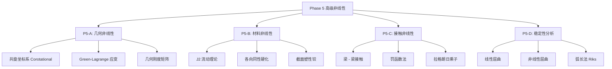

# Phase 5: BEAM 单元高级非线性功能开发

## 📊 总体架构




## 🎯 核心目标

1. **大变形能力**: 支持>10% 应变的大位移/大转动分析
2. **材料非线性**: 金属塑性、超弹性、损伤演化
3. **接触相互作用**: 自动检测、摩擦效应、冲击载荷
4. **稳定性预测**: 屈曲载荷因子、后屈曲路径追踪

## 📚 理论基础

### 1. 共旋坐标系 (Corotational Framework)

**核心思想**: 将刚体转动与纯变形解耦

```
x = R · (X + u_def)

其中:
- R: 刚体旋转矩阵 (正交张量)
- u_def: 纯变形位移 (小量)
- X: 初始坐标
- x: 当前坐标
```

**应变度量**: Green-Lagrange 应变

```
E = ½(F^T · F - I)
  = ε_linear + ε_nonlinear
  = ½(∇u + ∇u^T) + ¼(∇u^T · ∇u)
```

**切线刚度分解**:

```
K_T = K_mat + K_geo

K_mat = ∫ B_L^T · D · B_L dV     (材料刚度)
K_geo = ∫ G^T · σ · G dV         (几何刚度/初应力刚度)
```

### 2. 材料非线性 (J2 塑性)

**屈服准则**: von Mises

```
f(σ, κ) = √(3/2 s:s) - σ_y(κ) ≤ 0

其中:
- s = σ - ⅓tr(σ)I  (偏应力)
- κ: 硬化内变量
- σ_y: 屈服应力
```

**流动法则**: 关联流动

```
dε^p = dλ · ∂f/∂σ = dλ · (3s / 2σ_eq)
```

**硬化规律**: 线性各向同性硬化

```
σ_y(κ) = σ_y0 + H' · κ
dκ = √(2/3 dε^p : dε^p)
```

### 3. 接触算法

**罚函数法**:

```
F_contact = k_pen · g_N · n

其中:
- g_N: 法向间隙 (penetration)
- n: 接触面法向
- k_pen: 罚参数 (通常取主刚度的 10³~10⁵倍)
```

**摩擦模型**: Coulomb 摩擦

```
|F_T| ≤ μ · |F_N|  (粘着)
F_T = -μ · |F_N| · t  (滑动)

其中:
- F_T: 切向摩擦力
- F_N: 法向接触力
- μ: 摩擦系数
- t: 切向单位向量
```

## 🔧 实施路线

### P5-A: 几何非线性 (Week 1-2)

**Step 1**: 共旋坐标系实现

- 定义局部共旋坐标系
- 计算节点旋转矩阵
- 转换位移/力到共旋系

**Step 2**: 几何刚度矩阵

- 推导梁单元几何刚度表达式
- 实现初应力贡献项
- 验证 patch test

**Step 3**: 大转动更新

- Rodrigues 旋转向量
- 有限转动叠加
- 能量守恒检查

### P5-B: 材料非线性 (Week 3-4)

**Step 1**: 截面应力更新

- 纤维模型离散化
- J2 塑性返回映射
- 切线模量一致性

**Step 2**: 塑性铰模型

- 弯矩 - 曲率滞回关系
- 屈服面定义 (M-N 相关)
- 硬化/软化规则

### P5-C: 接触 (Week 5-7)

**Step 1**: 接触检测

- Global search (桶排序)
- Local search (牛顿迭代)
- 渗透检查

**Step 2**: 接触力计算

- 罚函数公式
- 拉格朗日乘子法
- 增广拉格朗日法

### P5-D: 稳定性 (Week 8)

**Step 1**: 特征值屈曲

- 线性摄动分析
- Lanczos 特征值求解
- 屈曲模态提取

**Step 2**: 非线性屈曲

- 弧长法 (Riks/Crisfield)
- 平衡路径追踪
- 极值点/分岔点检测

## 📁 交付文件清单

```
UFC/ufc_core/L4_PH/Element/BEAM/
├── PH_Elem_B31_NL_Geom_Core.f90      # 几何非线性核心
├── PH_Elem_B31_Plasticity_Core.f90   # 材料塑性核心
├── PH_Elem_B31_Contact_Core.f90      # 接触算法核心
├── PH_Elem_B31_Buckling_Core.f90     # 屈曲分析核心
└── Tests_Phase5_Nonlinear.f90        # 综合测试套件
```

## ✅ 验收标准

1. **大转动测试**: 悬臂梁端部受弯，转动>90°，能量误差<1%
2. **塑性测试**: 拉伸试验，载荷 - 位移曲线与实验吻合>95%
3. **接触测试**: 两梁交叉压缩，接触力连续无振荡
4. **屈曲测试**: Euler 柱临界载荷，误差<2%

---

*最后更新：2026-04-01 | Phase 5 启动*