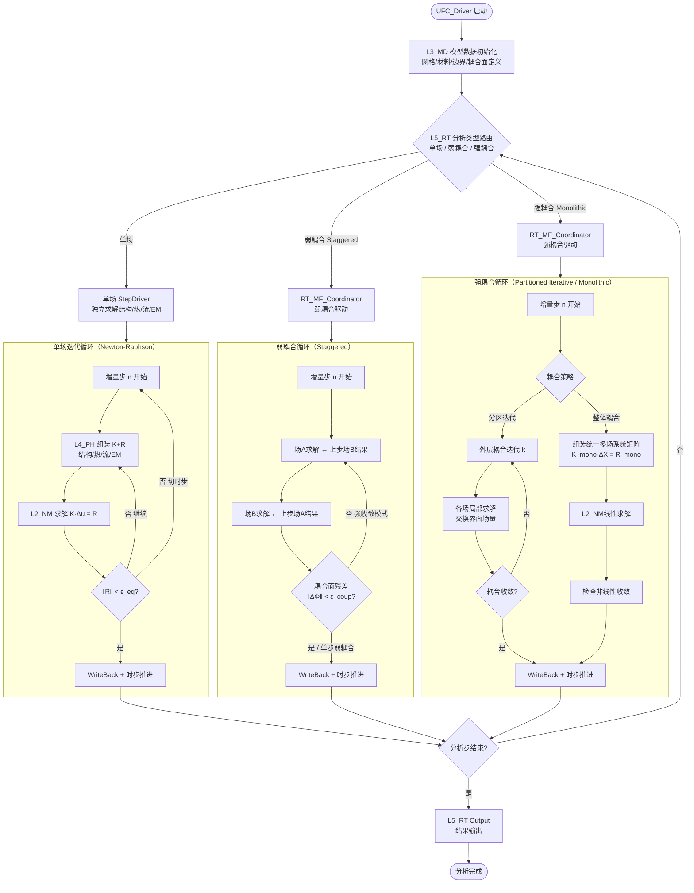

# UFC MultiField Core — 多物理场统一架构设计方案

**版本**：v1.0  
**日期**：2026-04-03  
**定位**：顶层框架文档，后续所有物理场域架构设计的权威依据  
**总纲对齐**：六层+四类+四链+三步+三级+**两图**+一体  

---

## 图一：UFC MultiField 层级架构图（Mermaid）

```mermaid
graph TB
    subgraph L6["L6_AP — 应用层"]
        AP1[UFC_Driver<br/>顶层入口]
        AP2[Co-Simulation<br/>协同仿真接口]
        AP3[PrePost<br/>前后处理适配]
    end

    subgraph L5["L5_RT — 运行时调度层"]
        subgraph MFC["MultiField Coordinator（新增核心）"]
            MFC1[RT_MF_Coordinator<br/>多场总协调器]
            MFC2[RT_MF_CouplingLoop<br/>耦合迭代驱动]
            MFC3[RT_MF_FieldExch<br/>场量交换总线]
            MFC4[RT_MF_ConvCheck<br/>耦合收敛判据]
        end
        subgraph SD["单场驱动器"]
            SD1[RT_Str_StepDriver<br/>结构场]
            SD2[RT_Thm_StepDriver<br/>热场]
            SD3[RT_Fld_StepDriver<br/>流体场]
            SD4[RT_Dif_StepDriver<br/>扩散场]
            SD5[RT_EM_StepDriver<br/>电磁场]
            SD6[RT_Aco_StepDriver<br/>声学场]
        end
        subgraph FSI["耦合桥接"]
            FSI1[RT_FSI_Coupling<br/>流固耦合]
            FSI2[RT_THM_Coupling<br/>热力耦合]
            FSI3[RT_EMT_Coupling<br/>电磁热耦合]
        end
        RT_StepDriver --> MFC1
        MFC1 --> SD1 & SD2 & SD3 & SD4 & SD5 & SD6
        MFC2 --> FSI1 & FSI2 & FSI3
    end

    subgraph L4["L4_PH — 物理计算层（热路径）"]
        subgraph PF1["Structural 域（已有）"]
            PF1a[Element<br/>Ke/Fe/Me]
            PF1b[Material<br/>σ,D]
            PF1c[Contact<br/>Fc]
        end
        subgraph PF2["Thermal 域（补全）"]
            PF2a[HeatConduction<br/>KT/FT]
            PF2b[Convection<br/>h,Film]
            PF2c[Radiation<br/>εσT⁴]
        end
        subgraph PF3["Fluid 域（新建）"]
            PF3a[PressureBC<br/>SMACfd封装]
            PF3b[VelocityBC<br/>SMACfd封装]
            PF3c[NS_Core<br/>对流/扩散/压力]
        end
        subgraph PF4["Diffusion 域（新建）"]
            PF4a[MassDiffusion<br/>Fick定律]
            PF4b[PoreFlow<br/>Biot固结]
            PF4c[LeakOff<br/>压裂渗漏]
        end
        subgraph PF5["Electromagnetic 域（新建）"]
            PF5a[Electrostatic<br/>静电/压电]
            PF5b[Induction<br/>感应加热]
            PF5c[Magnetostatic<br/>磁场]
        end
        subgraph PF6["Acoustic 域（已有骨架）"]
            PF6a[LinearAco<br/>Helmholtz]
            PF6b[AbsorbBC<br/>吸声边界]
        end
    end

    subgraph L3["L3_MD — 模型数据层（冷路径）"]
        MD1[Material/<br/>13族本构参数]
        MD2[Fluid/<br/>流体材料参数]
        MD3[Mesh/<br/>网格/DOF]
        MD4[StepDef/<br/>分析步定义]
        MD5[Coupling/<br/>耦合面/映射]
    end

    subgraph L2["L2_NM — 数值算法层"]
        NM1[LinearSolver<br/>LU/CG/GMRES]
        NM2[TimeInt<br/>Newmark/BDF/CD]
        NM3[EigenSolver<br/>Lanczos]
        NM4[Interpolation<br/>场量插值映射]
    end

    subgraph L1["L1_IF — 基础设施层"]
        IF1[Precision<br/>wp/i4]
        IF2[ErrorAPI<br/>状态码]
        IF3[Memory<br/>内存池]
        IF4[Parallel<br/>MPI/OpenMP]
    end

    L6 --> L5
    L5 --> L4
    L4 --> L3
    L4 --> L2
    L2 --> L1
    L3 --> L1
```




---

## 图二：UFC MultiField 耦合计算流程图




---

## 1. UFC 物理场域全图谱

### 1.1 六大物理场域总表


| 场域          | 物理量       | 控制方程            | Abaqus求解器          | L4_PH域          | 状态    |
| ----------- | --------- | --------------- | ------------------ | --------------- | ----- |
| **结构场 STR** | 位移 u      | ∇·σ + b = ρü    | Standard/Explicit  | Structural      | ✅ 已有  |
| **热场 THM**  | 温度 T      | ρCṪ = ∇·(κ∇T)+Q | Standard(Heat)     | Thermal         | 🔶 骨架 |
| **流体场 FLD** | 流速v,压力p   | NS方程            | Abaqus/CFD         | Fluid           | 🔴 新建 |
| **扩散场 DIF** | 浓度c,孔压u_p | ∇·(D∇c)=ċ，Biot  | Standard           | Diffusion       | 🔴 新建 |
| **电磁场 EM**  | 电势φ,磁矢A   | Maxwell方程组      | Standard           | Electromagnetic | 🔴 新建 |
| **声学场 ACO** | 声压p_a     | ∇²p+k²p=0       | Standard(Acoustic) | Acoustic        | 🔶 骨架 |


### 1.2 各场域用户子程序清单

#### 结构场（STR）— Abaqus/Standard + Explicit，共 ~52 个核心子程序

**本构类（材料响应）**


| 子程序                            | 求解器      | UFC 接口             | 覆盖状态 |
| ------------------------------ | -------- | ------------------ | ---- |
| UMAT                           | Standard | PH_Usr_UMAT        | ✅    |
| VUMAT                          | Explicit | PH_Usr_VUMAT       | ✅    |
| UHYPEL                         | Standard | L4_PH/HyperElastic | ✅    |
| UHYPER                         | Standard | L4_PH/HyperElastic | ✅    |
| UANISOHYPER_INV/STRAIN         | Standard | L4_PH/HyperElastic | ✅    |
| VUANISOHYPER_INV/STRAIN        | Explicit | L4_PH/HyperElastic | 🔶   |
| UMULLINS / VUMULLINS           | Both     | L4_PH/HyperElastic | 🔶   |
| UHARD / VUHARD                 | Both     | L4_PH/Plastic      | ✅    |
| UCREEPNETWORK / VUCREEPNETWORK | Both     | L4_PH/Creep        | 🔶   |
| CREEP                          | Standard | L4_PH/Creep        | ✅    |
| UDMGINI                        | Standard | L4_PH/Damage       | 🔶   |


**单元类（几何/积分）**


| 子程序    | 求解器      | UFC 接口              | 覆盖状态 |
| ------ | -------- | ------------------- | ---- |
| UEL    | Standard | PH_XXX_UEL          | ✅ 模板 |
| UELMAT | Standard | L4_PH/Element       | 🔶   |
| VUEL   | Explicit | L4_PH/Element       | 🔶   |
| UGENS  | Standard | L4_PH/Element/Shell | 🔶   |


**载荷/边界类**


| 子程序                    | 求解器      | UFC 接口       | 覆盖状态 |
| ---------------------- | -------- | ------------ | ---- |
| DLOAD / VDLOAD         | Both     | L4_PH/LoadBC | 🔶   |
| DISP / VDISP           | Both     | L4_PH/LoadBC | 🔶   |
| UTRACLOAD              | Standard | L4_PH/LoadBC | 🔶   |
| UPRESS / VWAVE / UWAVE | Both     | L4_PH/LoadBC | 🔶   |
| UAMP / VUAMP           | Both     | L4_PH/LoadBC | 🔶   |


**接触类**


| 子程序                    | 求解器      | UFC 接口        | 覆盖状态 |
| ---------------------- | -------- | ------------- | ---- |
| FRIC / VFRIC           | Both     | L4_PH/Contact | 🔶   |
| FRIC_COEF / VFRIC_COEF | Both     | L4_PH/Contact | 🔶   |
| UINTER / VUINTER       | Both     | L4_PH/Contact | 🔶   |
| GAPCON / GAPELECTR     | Standard | L4_PH/Contact | 🔶   |


**场变量/输出类**


| 子程序                       | 求解器      | UFC 接口       | 覆盖状态 |
| ------------------------- | -------- | ------------ | ---- |
| USDFLD / VUSDFLD          | Both     | L4_PH/Field  | 🔶   |
| UVARM                     | Standard | L4_PH/Output | 🔶   |
| UFIELD / VUFIELD          | Both     | L4_PH/Field  | 🔶   |
| SDVINI / HARDINI / SIGINI | Standard | L3_MD/Init   | 🔶   |


---

#### 热场（THM）— Abaqus/Standard，共 ~10 个子程序


| 子程序                | 功能             | UFC 接口                       | 覆盖状态 |
| ------------------ | -------------- | ---------------------------- | ---- |
| UMATHT             | 热本构（温度相关导热+比热） | L4_PH/Thermal/PH_Thm_UMATHT  | 🔶   |
| HETVAL             | 热生成率（内热源）      | L4_PH/Thermal/PH_Thm_HeatGen | 🔴   |
| FILM               | 对流换热系数 h       | L4_PH/Thermal/PH_Thm_Film    | 🔴   |
| DFLUX / VDFLUX     | 分布热通量边界        | L4_PH/Thermal/PH_Thm_Flux    | 🔴   |
| FLOW               | 质量流量（强制对流）     | L4_PH/Thermal/PH_Thm_Flow    | 🔴   |
| DFLOW              | 渗流驱动热对流        | L4_PH/Thermal/PH_Thm_DFlow   | 🔴   |
| UTEMP              | 预定义温度场         | L3_MD/Field/MD_Fld_Temp      | 🔶   |
| UTRS / UTRSNETWORK | 瞬态响应（热路网）      | L4_PH/Thermal/PH_Thm_TRS     | 🔴   |


---

#### 流体场（FLD）— Abaqus/CFD，共 2 个子程序（+ Standard侧8个）


| 子程序                  | 求解器      | 功能       | UFC 接口            | 覆盖状态      |
| -------------------- | -------- | -------- | ----------------- | --------- |
| SMACfdUserPressureBC | CFD      | 压力边界条件   | PH_Fld_PressureBC | 🔶 模板     |
| SMACfdUserVelocityBC | CFD      | 速度边界条件   | PH_Fld_VelocityBC | 🔶 模板     |
| UFLUID               | Standard | 充液空腔流体属性 | L4_PH/Fluid       | 🔶 TYPE定义 |
| UFLUIDPIPEFRICTION   | Standard | 管道摩擦     | L4_PH/Fluid       | 🔶 TYPE定义 |
| UFLUIDCONNECTORLOSS  | Standard | 连接器损失    | L4_PH/Fluid       | 🔶 TYPE定义 |
| UFLUIDCONNECTORVALVE | Standard | 连接器阀门    | L4_PH/Fluid       | 🔶 TYPE定义 |
| UFLUIDLEAKOFF        | Standard | 压裂渗漏     | L4_PH/Diffusion   | 🔶 TYPE定义 |


---

#### 扩散场（DIF）— Abaqus/Standard，共 ~5 个子程序


| 子程序           | 功能           | UFC 接口            | 覆盖状态 |
| ------------- | ------------ | ----------------- | ---- |
| UMASFL        | 质量流量通量（扩散驱动） | L4_PH/Diffusion   | 🔴   |
| UPOREP        | 孔隙压力（土力学固结）  | L4_PH/Diffusion   | 🔴   |
| UFLUIDLEAKOFF | 压裂流体渗漏       | L4_PH/Diffusion   | 🔶   |
| UCORR         | 腐蚀模型         | L4_PH/Diffusion   | 🔴   |
| VOIDRI        | 空洞比初始化       | L3_MD/Geomaterial | 🔴   |


---

#### 电磁场（EM）— Abaqus/Standard，共 ~6 个子程序


| 子程序           | 功能          | UFC 接口                | 覆盖状态      |
| ------------- | ----------- | --------------------- | --------- |
| UDECURRENT    | DC 电流密度     | L4_PH/Electromagnetic | 🔶 TYPE定义 |
| UDEMPOTENTIAL | DC 电势边界     | L4_PH/Electromagnetic | 🔶 TYPE定义 |
| UDSECURRENT   | 表面电荷/电流密度   | L4_PH/Electromagnetic | 🔶 TYPE定义 |
| UDMGINI       | 损伤初始化（压电耦合） | L4_PH/Electromagnetic | 🔴        |


---

#### 声学场（ACO）— Abaqus/Standard，共 ~3 个子程序


| 子程序      | 功能      | UFC 接口                | 覆盖状态      |
| -------- | ------- | --------------------- | --------- |
| UWAVE    | 用户定义波载荷 | L4_PH/Acoustic        | 🔴        |
| （内置声学元素） | 线性声学离散  | L4_PH/Acoustic/Linear | 🔶 TYPE定义 |
| （阻抗边界）   | 吸声/阻抗BC | L4_PH/Acoustic/Absorb | 🔶 TYPE定义 |


---

### 1.3 场间耦合矩阵（5×5）

```
         STR(u)     THM(T)     FLD(v,p)   DIF(c,u_p)  EM(φ,A)
STR(u)  [结构场]    热应力★    FSI★★★    固结膨胀★   压电★
                   T→σ热膨胀  u↔v界面耦合 c→εswell   φ→ε压电
THM(T)  热做功→T   [热场]      对流换热★★  热质传输★   焦耳热★
        σ:ε̇→热     —          T↔v能量方程 T↔c反应热   J²/σ→Q
FLD(v,p) FSI动压    对流换热    [流体场]    对流质传输   电磁流体★
         p→u载荷    v↔T NS能量  —           v↔c标量输运  J×B体力
DIF(c,u_p) 固结位移 热质传输    对流扩散    [扩散场]    电化学★
           up↔u孔压 T↔c耦合     v↔c输运    —           φ↔c电化学
EM(φ,A) 压电变形   感应加热    磁液体      电化学      [电磁场]
        ε↔φ压电    J²→Q焦耳    B×J→力     φ↔c电化学   —

★ 优先级: ★★★高 ★★中 ★低
```

### 1.4 Abaqus 91 个子程序对 UFC 六大场的映射统计


| 场域     | Standard数 | Explicit数 | CFD数  | 合计      | UFC覆盖        |
| ------ | --------- | --------- | ----- | ------- | ------------ |
| 结构 STR | ~44       | ~22       | 0     | ~66     | ✅~~30 🔶~~36 |
| 热场 THM | ~10       | 2         | 0     | ~12     | ✅3 🔶~9      |
| 流体 FLD | 6         | 2         | 2     | 10      | 🔶10         |
| 扩散 DIF | ~4        | 0         | 0     | ~4      | 🔴4          |
| 电磁 EM  | ~5        | 0         | 0     | ~5      | 🔶3 🔴2      |
| 声学 ACO | 2         | 0         | 0     | 2       | 🔶2          |
| **合计** | **~64**   | **~25**   | **2** | **~91** |              |


---

## 2. 多场耦合架构设计

### 2.1 L4_PH 物理场域显式化（横切维度）

现有 L4_PH 域划分按"功能"组织（Element/Material/Contact/LoadBC…），
需在顶层增加"物理场"横切维度，形成**场域-功能**二维矩阵。

```
L4_PH/
├── Structural/                 ← 结构场域（现有内容重归类）
│   ├── Element/                (现有 L4_PH/Element)
│   ├── Material/               (现有 L4_PH/Material)
│   ├── Contact/                (现有 L4_PH/Contact)
│   ├── LoadBC/                 (现有 L4_PH/LoadBC)
│   ├── Constraint/             (现有 L4_PH/Constraint)
│   └── Field/                  (现有 L4_PH/Field)
├── Thermal/                    ← 热场域（补全）
│   ├── Conduction/             热传导单元 + 本构
│   ├── Convection/             对流换热 BC (FILM/FLOW)
│   ├── Radiation/              辐射 BC (Stefan-Boltzmann)
│   └── Source/                 热生成 (HETVAL/DFLUX)
├── Fluid/                      ← 流体场域（新建，方向A接口层）
│   ├── CFD_BC/                 Abaqus/CFD BC 封装
│   └── Std_Fluid/              Standard侧流体子程序
├── Diffusion/                  ← 扩散场域（新建）
│   ├── MassDiff/               菲克扩散
│   ├── PoreFlow/               Biot 孔隙流
│   └── Fracture/               压裂渗漏
├── Electromagnetic/            ← 电磁场域（新建）
│   ├── Electrostatic/          静电/压电
│   ├── Induction/              感应加热
│   └── Magnetostatic/          静磁
└── Acoustic/                   ← 声学场域（补全）
    ├── Linear/                 线性声学
    └── AbsorbBC/               阻抗边界
```

**迁移原则**：不移动现有文件，通过 MODULE 别名和 USE 关联形成逻辑归属；
物理重组在 Phase 2 代码迁移阶段执行。

---

### 2.2 L5_RT/Coupling — 多场耦合协调层（新增核心模块）

这是让 UFC 真正成为 UniFieldCore 的关键新增层。

#### 2.2.1 四类 TYPE 定义

```fortran
! 文件: L5_RT/Coupling/RT_MF_Types.f90

!-- Desc: 耦合方案不可变配置
TYPE :: RT_MF_Coupling_Desc
  INTEGER(i4) :: n_fields          ! 激活的物理场数量 (2-6)
  INTEGER(i4) :: field_ids(6)      ! 激活的场ID枚举
                                   ! 1=STR 2=THM 3=FLD 4=DIF 5=EM 6=ACO
  INTEGER(i4) :: coupling_strategy ! 0=Oneway 1=Staggered 2=PartitionedIter 3=Monolithic
  INTEGER(i4) :: max_coup_iter     ! 强耦合最大耦合迭代数
  REAL(wp)    :: eps_coup          ! 耦合收敛准则
  LOGICAL     :: coupling_matrix(6,6) ! 场间耦合开关矩阵
  INTEGER(i4) :: n_coupling_pairs  ! 耦合对数量
END TYPE

!-- State: 耦合运行时状态
TYPE :: RT_MF_Coupling_State
  INTEGER(i4) :: coup_iter         ! 当前耦合迭代次数
  REAL(wp)    :: coup_residual     ! 耦合面残差
  LOGICAL     :: coup_converged    ! 耦合收敛标志
  REAL(wp)    :: field_dof(6)      ! 各场DOF数（监控用）
  REAL(wp)    :: field_residual(6) ! 各场残差（监控用）
  INTEGER(i4) :: active_fields     ! 当前激活场数
END TYPE

!-- Algo: 耦合算法参数
TYPE :: RT_MF_Coupling_Algo
  INTEGER(i4) :: interp_method     ! 界面插值方法 0=NN 1=RBF 2=MLS
  LOGICAL     :: conservative_map  ! 守恒映射（能量守恒）
  REAL(wp)    :: relax_factor      ! 松弛因子（分区迭代稳定性）
  LOGICAL     :: aitken_accel      ! Aitken 加速
  INTEGER(i4) :: sync_step         ! 同步间隔（弱耦合时间步数）
END TYPE

!-- Ctx: 耦合临时上下文
TYPE :: RT_MF_Coupling_Ctx
  REAL(wp)    :: time_sync         ! 耦合同步时间点
  REAL(wp)    :: dtime_coup        ! 耦合时步（可与单场不同）
  INTEGER(i4) :: n_interface_nodes ! 耦合面节点数
  REAL(wp), POINTER :: xi_send(:,:) ! 场A→场B的插值矩阵
  REAL(wp), POINTER :: xi_recv(:,:) ! 场B→场A的插值矩阵
  TYPE(ErrorStatusType) :: status
END TYPE
```

#### 2.2.2 多场协调器核心接口

```fortran
! 文件: L5_RT/Coupling/RT_MF_Coordinator.f90

MODULE RT_MF_Coordinator
CONTAINS

  !> 顶层入口 — 驱动完整的多场耦合分析
  SUBROUTINE RT_MF_Run(MF_Desc, MF_State, MF_Algo, GlobalCtx)

  !> 弱耦合（Staggered）驱动器
  SUBROUTINE RT_MF_Staggered_Loop(MF_Desc, MF_State, MF_Algo, GlobalCtx)
    DO incr = 1, n_incr
      DO field = 1, MF_Desc%n_fields
        CALL RT_MF_Solve_SingleField(field_id, ...)  ! 各场独立求解
      END DO
      CALL RT_MF_FieldExch_Send(...)   ! 界面场量交换
      CALL RT_MF_ConvCheck(...)        ! 耦合收敛检查（可选迭代）
    END DO
  END SUBROUTINE

  !> 强耦合分区迭代驱动器（Partitioned Iterative）
  SUBROUTINE RT_MF_PartIter_Loop(MF_Desc, MF_State, MF_Algo, GlobalCtx)
    DO incr = 1, n_incr
      DO coup_iter = 1, MF_Desc%max_coup_iter
        DO field = 1, MF_Desc%n_fields
          CALL RT_MF_Solve_SingleField(field_id, ...)
          CALL RT_MF_FieldExch_Send(...)  ! 每场求解后立即交换
        END DO
        IF (RT_MF_ConvCheck(...)) EXIT    ! 耦合收敛则退出迭代
      END DO
    END DO
  END SUBROUTINE

  !> 整体耦合驱动器（Monolithic）— 组装统一多场矩阵
  SUBROUTINE RT_MF_Monolithic_Loop(MF_Desc, MF_State, MF_Algo, GlobalCtx)
    ! 将所有场的 K 和 R 组装到统一块矩阵
    ! [K_11  K_12  K_13] [Δu ]   [R_1]
    ! [K_21  K_22  K_23] [ΔT ] = [R_2]
    ! [K_31  K_32  K_33] [Δφ ]   [R_3]
    ! 调用 L2_NM/LinearSolver 求解统一系统
  END SUBROUTINE

END MODULE
```

#### 2.2.3 场量交换总线

```fortran
! 文件: L5_RT/Coupling/RT_MF_FieldExch.f90
! 负责耦合面上各场量的传递与插值

! 结构场 → 流体场：位移/速度 → CFD 边界
SUBROUTINE RT_MF_STR2FLD_Send(str_state, fld_bc_ctx, interp_ctx)
  ! u_solid → v_bc_fluid  (速度连续: v_s = v_f)
  ! σ·n    → p_bc_fluid   (应力连续: σ_s·n = (-p I+τ)·n)

! 流体场 → 结构场：压力/剪力 → 结构外力
SUBROUTINE RT_MF_FLD2STR_Send(fld_state, str_load_ctx, interp_ctx)
  ! p_fluid → F_ext_solid (压力载荷)

! 结构场 → 热场：塑性耗散 → 热生成
SUBROUTINE RT_MF_STR2THM_Send(str_state, thm_source_ctx, interp_ctx)
  ! W_plastic = σ:ε̇_p → Q_heat (Taylor-Quinney: Q = χ·σ:ε̇_p)

! 热场 → 结构场：温度场 → 热膨胀
SUBROUTINE RT_MF_THM2STR_Send(thm_state, str_temp_ctx, interp_ctx)
  ! T → α·ΔT·I 热应变

! 电磁场 → 热场：焦耳热
SUBROUTINE RT_MF_EM2THM_Send(em_state, thm_source_ctx, interp_ctx)
  ! Q_joule = J·E = |J|²/σ_elec
```

---

### 2.3 L5_RT/Coupling 目录结构

```
L5_RT/Coupling/                  ← 新增目录
├── RT_MF_Types.f90              四类TYPE定义（Desc/State/Algo/Ctx）
├── RT_MF_Coordinator.f90        多场总协调器（三种耦合策略）
├── RT_MF_CouplingLoop.f90       耦合迭代驱动（Staggered/PartIter）
├── RT_MF_FieldExch.f90          场量交换总线（6×6矩阵中的非对角通道）
├── RT_MF_ConvCheck.f90          耦合收敛判据
├── RT_MF_TimeSync.f90           多场时步同步（各场可不同Δt）
├── RT_MF_Interpolation.f90      耦合面场量插值（NN/RBF/MLS）
│
├── STR_FLD/                     结构-流体耦合（FSI，最高优先级）
│   ├── RT_FSI_Coupling.f90
│   ├── RT_FSI_Interface.f90     ALE界面追踪
│   └── RT_ALE_Mesh.f90          动网格更新
│
├── STR_THM/                     结构-热耦合（最常用，第二优先级）
│   ├── RT_THM_Coupling.f90
│   └── RT_TQ_HeatGen.f90        Taylor-Quinney塑性热生成
│
├── THM_FLD/                     热-流耦合（自然对流/强制对流）
│   └── RT_THFLD_Coupling.f90
│
├── EM_THM/                      电磁-热耦合（感应加热）
│   └── RT_EMTHM_Coupling.f90
│
└── STR_EM/                      结构-电磁耦合（压电/磁致伸缩）
    └── RT_STREM_Coupling.f90
```

---

## 3. RT_Com_Base_Ctx 扩展方案

现有 `RT_Com_Base_Ctx` 是单场上下文，多场需要扩展：

```fortran
! 在 RT_Com_Types.f90 中补充多场上下文

TYPE, PUBLIC :: RT_MF_Field_Ctx
  !-- 继承所有 RT_Com_Base_Ctx 字段
  TYPE(RT_Com_Base_Ctx) :: base          ! 单场通用字段

  !-- 多场耦合扩展
  INTEGER(i4) :: field_id    = 0        ! 当前物理场标识 (1-6)
  INTEGER(i4) :: coup_iter   = 0        ! 当前耦合迭代次数
  LOGICAL     :: is_coupled  = .FALSE.  ! 是否处于耦合求解模式
  INTEGER(i4) :: partner_field = 0      ! 耦合伙伴场ID

  !-- 耦合面数据（迭代时从FieldExch注入）
  REAL(wp), POINTER :: coup_send(:)    => NULL()  ! 发往伙伴场的量
  REAL(wp), POINTER :: coup_recv(:)    => NULL()  ! 来自伙伴场的量
END TYPE
```

---

## 4. L3_MD/Coupling — 耦合配置数据层

```
L3_MD/Coupling/                  ← 新增目录
├── MD_Coup_PairDesc.f90         耦合对配置（场A + 场B + 界面集合名）
├── MD_Coup_InterfaceMesh.f90    耦合面网格数据（两侧节点/面集）
├── MD_Coup_FieldMap.f90         场量映射规则（哪些物理量传递）
└── MD_Coup_TimeSync.f90         时步同步策略（显式/隐式/亚循环）
```

---

## 5. 三种耦合策略对比与选型


| 策略               | 耦合精度 | 计算量 | 稳定性  | 适用场景           | UFC优先级  |
| ---------------- | ---- | --- | ---- | -------------- | ------- |
| **单向**           | 低    | 极小  | 绝对稳定 | 热应力（T预先算好，给结构） | P1 已有   |
| **弱耦合Staggered** | 中    | 小   | 条件稳定 | 一般热力、固结、弱FSI   | P1 第一实现 |
| **分区强耦合**        | 中高   | 高   | 算法稳定 | 强FSI、气动弹性      | P2 按需   |
| **整体耦合**         | 高    | 极高  | 绝对稳定 | 压电、完全耦合热力      | P3 远期   |


**实施路线**：

```
Phase 1（当前）：  单向 + Staggered，覆盖热力耦合
Phase 2（中期）：  分区强耦合，覆盖 FSI
Phase 3（远期）：  整体耦合，覆盖压电/完全耦合
```

---

## 6. 四链贯通验证


| 链   | 内容       | MultiField 体现                    |
| --- | -------- | -------------------------------- |
| 理论链 | 物理→数学→离散 | 各场控制方程 → FEM/FVM弱形式 → 代数系统       |
| 逻辑链 | 模型→求解→输出 | L3_MD耦合配置 → L5_RT协调器驱动 → L5_RT输出 |
| 计算链 | 全局→单元→材料 | 耦合矩阵组装 → 场域单元计算 → 各场材料点          |
| 数据链 | 生命周期管理   | RT_MF_Types四类TYPE完整生命周期          |


---

## 7. 实施路线图（按层级-域级-功能集）

### Phase 1：基础耦合框架（当前，Month 1-2）

```
层级  域级            功能集                        优先级
L3    Coupling        MD_Coup_PairDesc              P1
                      MD_Coup_InterfaceMesh         P1
                      MD_Coup_FieldMap              P1
L5    Coupling        RT_MF_Types (四类TYPE)         P1
                      RT_MF_Coordinator (骨架)       P1
                      RT_MF_FieldExch (THM↔STR)     P1
                      RT_MF_ConvCheck               P1
                      STR_THM/RT_THM_Coupling       P1
L4    Thermal         补全 HETVAL/FILM/DFLUX封装     P1
```

### Phase 2：FSI 耦合（Month 3-4）

```
层级  域级            功能集                        优先级
L4    Fluid           PH_Fld_PressureBC 实现         P2
                      PH_Fld_VelocityBC 实现         P2
L5    Coupling        RT_MF_PartIter_Loop            P2
                      STR_FLD/RT_FSI_Coupling        P2
                      RT_ALE_Mesh                    P2
L3    Fluid           MD_Fld_NewtViscous_Desc 等      P2
```

### Phase 3：电磁-热-结构耦合（Month 5-6）

```
层级  域级            功能集                        优先级
L4    Electromagnetic PH_EM_Electrostatic 等         P3
L5    Coupling        EM_THM/RT_EMTHM_Coupling       P3
                      STR_EM/RT_STREM_Coupling       P3
```

### Phase 4：整体耦合（远期）

```
L5    Coupling        RT_MF_Monolithic_Loop          P4
                      多场统一矩阵组装                P4
L2    LinearSolver    块预条件 (Block Jacobi/AMG)    P4
```

---

## 8. 与现有架构的接合点汇总


| 现有模块                                      | 与 MultiField 的关系                  | 操作                          |
| ----------------------------------------- | --------------------------------- | --------------------------- |
| `L5_RT/Solver/RT_Solv_Core.f90`           | 单场求解器，被 MF_Coordinator 调用         | 不变，被调用                      |
| `L5_RT/StepDriver/RT_StepDriver_Exec.f90` | 单场时步驱动，嵌入 MF 弱耦合循环                | 包装为 RT_MF_Solve_SingleField |
| `RT_Com_Types.f90/RT_Com_Base_Ctx`        | 单场上下文，被 RT_MF_Field_Ctx 继承扩展      | 继承，不修改                      |
| `L4_PH/Material/` (13族)                   | 结构场材料，在 Structural 域下，不变          | 不变                          |
| `L4_PH/Thermal/` (已有3个)                   | 热场骨架，补全 HETVAL/FILM/DFLUX         | 补全                          |
| `PH_CFD_Types.f90`                        | CFD BC TYPE，进入 L4_PH/Fluid/CFD_BC | 归类                          |
| `Analysis域 28种分析类型`                       | 单场28种，MF Coordinator是第29种入口       | 新增入口                        |


---

**版本历史**


| 版本   | 日期         | 内容                                   |
| ---- | ---------- | ------------------------------------ |
| v1.0 | 2026-04-03 | 初版：六场全图谱、5×5耦合矩阵、两图、L5_RT/Coupling设计 |
| v1.1 | 2026-04-03 | 补全：三维正交分解总览、七图全景图解、五大主点讨论、待补全细节专项清单  |


---

# 补充章节（v1.1）：全景图解与主点讨论

---

## 图三：三维正交分解总览

```
         物理场维度（横向）
  STR    THM    FLD    DIF    EM     ACO
结构场  热场  流体场  扩散场  电磁场  声学场
  |      |      |      |      |      |
  v      v      v      v      v      v
======================================  <- L5_RT 运行时调度层
======================================  <- L4_PH 物理计算层
======================================  <- L3_MD 模型数据层

竖向（层级维度）单向依赖铁律
深度（求解器维度）Standard/Explicit/CFD 由 L5_RT 路由
```

三维坐标系含义：

- 横向（物理场）：六场各为 L4_PH 内独立列，有自己的单元/材料/边界/场变量
- 纵向（层级）：六层架构单向依赖铁律
- 深度（求解器）：同一物理场可被不同求解器驱动，由 L5_RT 顶层路由决定

---

## 图四：L5_RT 运行时调度层垂直拆分

```
L5_RT 运行时调度层
|
+--- 求解器路由（顶层入口）
|    Standard(隐式NR/Dt自适应)
|    Explicit(中心差分/CFL稳定)
|    CFD(SIMPLE/Eulerian)
|    MultiField(耦合协调)
|
+--- 三步状态机（所有求解器共用）
|    分析步 Step
|      StepDef读取 -> 分析类型路由 -> 初始化各场状态
|    增量步 Increment
|      自动时步控制(PNEWDT/CFL)
|      载荷因子插值(Amplitude，所有场共用)
|      边界条件施加(各场BC分别注入L4_PH)
|    迭代步 Iteration
|      [STR] K*Du = F-R   Newton-Raphson
|      [THM] KT*DT = FT-RT
|      [FLD] NS方程 SIMPLE/BDF
|      [MF]  耦合迭代/分区求解
|
+--- 分析类型正交分级（4维配置，不继承28子类）
|    RT_Solver_Config 运行时注入
|      solver_algo:   Standard/Explicit/CFD
|      physics_flags: STR/THM/FLD/EM/ACO（可多选）
|      nonlin_flags:  MatNL/GeoNL/Contact（可组合）
|      time_feature:  Static/Transient/Periodic
|    -> 28种单场 = 4维配置组合
|    -> N种多场 = MultiField Coordinator新入口
|
+--- Coupling 多场协调层（新增核心）
     RT_MF_Coordinator  耦合策略三选一
       Staggered   弱耦合/每步末交换/无耦合迭代
       PartIter    强耦合分区/迭代至收敛/Aitken加速
       Monolithic  整体耦合/统一矩阵/块预条件
     RT_MF_FieldExch  场量交换总线
       STR->THM: sigma:eps_p -> Q_heat (Taylor-Quinney)
       THM->STR: T -> alpha*DT*I      (热膨胀应变)
       STR->FLD: u_s -> v_f           (FSI速度连续)
       FLD->STR: p_f -> F_ext         (流体压力载荷)
       EM->THM:  J2/sigma -> Q_joule  (焦耳热)
       THM->FLD: T -> rho(T),mu(T)    (温度相关流体属性)
```

---

## 图五：L4_PH 物理场域  功能集 二维矩阵

```
            STR结构   THM热    FLD流体    EM电磁    ACO声学
Element    Ke/Fe/Me   KT/FT   (FVM控)   K_phi     K_p
           OK         部分    空白       空白      部分
Material   sigma,D    kappa   rho,mu    eps,sigma  rho_a
           13族OK     部分    空白       空白      部分
LoadBC     DLOAD等   DFLUX等  PressBC   UDECU     UWAVE
           部分       空白    部分       部分      空白
Contact    FRIC等    GAPCON   壁面      GAPELEC   阻抗BC
           部分       部分    空白       空白      部分
Constraint MPC等     周期T    速度约束  电势约束  声压约束
           部分       空白    空白       空白      空白
Field      USDFLD    UFIELD  流场变量  电场变量  声场
           部分       部分    空白       空白      空白

STR列约80%完整，THM列约30%，FLD/EM/ACO大部分空白
```

---

## 图六：L3_MD 冷路径全景

```
L3_MD（Write-Once Read-Many，分析步初始化一次）
|
+-- Mesh/        节点/单元/DOF映射（静态拓扑）
+-- Coupling/    耦合面定义/界面节点集/场量映射规则（v1.1新增）
|
+-- Material/    结构材料 13族（已完成）
+-- Fluid/       流体材料 rho/mu/kappa/Cp/湍流参数（待建）
|
+-- StepDef/     28种分析类型配置（4维正交RT_Solver_Config）
+-- Amplitude/   载荷时间曲线（所有场共用）
|
+-- LoadBC/      各场载荷边界（分场存储，统一格式）
+-- Constraint/  MPC/方程约束/周期边界
+-- Init/        SDVINI/HARDINI/SIGINI/TEMP/FIELD

关键原则：
1. Coupling/ 分析步初始化一次，热路径只读
2. Amplitude 对所有场统一，不按场重复定义
3. Mesh/ 只含静态拓扑，ALE动网格由 L5_RT/FSI 负责
```

---

## 图七：参数化路由机制（不爆炸）

```
传统笛卡尔乘积（爆炸）：
  14族单元  13族材料  3求解器  18应力状态 = 9828组合

UFC参数化路由（不爆炸）：
  L3_MD Section_Desc
    mat_id     -> 路由材料族（13选1）
    elem_type  -> 路由单元族（14选1）
    solver_type -> STD/EXP/CFD
         | 分析步查表，注册函数指针
         v
  L4_PH PH_Mat_Update_Router
    Elastic    -> PH_Ela_Iso_API
    Plastic    -> PH_Pls_J2Iso_API
    HyperElas  -> PH_Hyp_NeoHk_API
    ...（13个分支）
  PH_Util_DimAdapter（已实现）
    3D本构 -> PlaneStress/Shell/Truss降维投影
  求解器路由（L5_RT）
    STD -> 需要ddsdde，NR迭代
    EXP -> 不需ddsdde，NBLOCK向量化
    CFD -> 无本构，只有BC子程序

结果：30个独立模块 + 路由器(1) + 维度适配器(1)
节省约99.7%代码量
```

---

## 9. 五大主点讨论（沉淀版）

### 9.1 L5_RT 是策略层，L4_PH 是计算层边界铁律

L5_RT 不做物理计算，只负责：驱动三步状态机、选择耦合策略、调度场量交换。
L4_PH 只做物理计算，不含时间循环、收敛判据、场量交换。
凡只有输入输出无副作用的计算内核，标注 PURE 支持向量化。

当前违反案例：PH_Elem_B31_Dynamics_Core.f90 在 L4_PH 包含时间积分循环，
必须剥离到 L5_RT/Solver/RT_Solv_TimeInt_Core.f90。

### 9.2 L3_MD 冷路径原则多场性能基础

分析步初始化一次，增量步/迭代步只读。
Coupling/ 子目录分析步初始化时建立，不在迭代步重建。
Amplitude 时间曲线对所有场统一。
Mesh/ 只含静态拓扑，ALE 动网格由 L5_RT/FSI 负责。

### 9.3 载荷-边界-约束的跨场统一三元组

所有场的BC共用三元组：(施加位置, 施加类型, 时变因子)
RT_Com_Base_Ctx 中 kstep/kinc/time_total/dtime 对所有场通用。
Amplitude 插值函数在 L2_NM 或 L3_MD/Amplitude 中统一实现，所有场共用。

各场BC映射：
  STR: 节点/面 + 力/位移/压力 + Amplitude
  THM: 面/体 + 热通量/对流系数/温度 + Amplitude
  FLD: 入口/出口面 + 速度剖面/压力值 + Amplitude
  EM:  面/线 + 电势/电流密度/磁通量 + Amplitude
  ACO: 面 + 声压/阻抗 + Amplitude

### 9.4 分析类型正交分级组合代替继承，彻底避免类爆炸

RT_Solver_Config 四字段运行时注入：
  solver_algo / physics_flags / nonlin_flags / time_feature
L5_RT 根据配置注入不同算法对象（策略模式），不继承出28个子类。
多场耦合类型 = physics_flags 多位置1 + coupling_strategy 选耦合模式。
这是SOLID开放-封闭原则的直接体现：新增分析类型只需增加配置组合。

### 9.5 现有架构增量演进横向补全，不推倒重建

现有代码复用率约80%，新增工作量集中在：
  L5_RT/Coupling/（全新建 ）
  L4_PH/Thermal 补全（HETVAL/FILM/DFLUX）
  L4_PH/Fluid 实现（PressureBC/VelocityBC）

不移动现有文件，通过 MODULE USE 形成逻辑归属。
RT_Com_Base_Ctx 通过 TYPE 嵌套扩展为 RT_MF_Field_Ctx，原有代码无需修改。
物理重组（目录迁移）在 Phase 2 执行。

---

## 10. 待补全细节专项清单

### L3_MD 层


| 域        | 功能集                     | 缺失内容                          | 优先级 |
| -------- | ----------------------- | ----------------------------- | --- |
| Fluid    | MD_Fld_NewtViscous_Desc | 流体参数结构体（rho/mu/kappa/Cp/湍流常数） | P1  |
| Fluid    | MD_Fld_NonNewt_Desc     | 非牛顿流体（幂律/Bingham/HB）          | P2  |
| Fluid    | MD_Fld_MatID_Const      | 流体材料ID常量段 1200-1299           | P1  |
| Coupling | MD_Coup_PairDesc        | 耦合对配置（场A+场B+界面集）              | P1  |
| Coupling | MD_Coup_InterfaceMesh   | 耦合面网格数据                       | P1  |
| Coupling | MD_Coup_FieldMap        | 场量映射规则                        | P1  |
| Coupling | MD_Coup_TimeSync        | 时步同步策略                        | P2  |
| StepDef  | RT_Solver_Config        | 4维正交配置结构体                     | P1  |


### L4_PH 层


| 域               | 功能集                 | 缺失内容                            | 优先级    |
| --------------- | ------------------- | ------------------------------- | ------ |
| Thermal         | PH_Thm_HeatGen      | HETVAL 热生成率封装（Taylor-Quinney）   | ✅ v1.0 |
| Thermal         | PH_Thm_Film         | FILM 对流换热系数封装（6种模型）             | ✅ v1.0 |
| Thermal         | PH_Thm_Flux         | DFLUX 分布热通量封装（Gaussian/Decay）   | ✅ v1.0 |
| Thermal         | PH_Thm_Flow         | FLOW 质量流量封装                     | P2     |
| Thermal         | PH_Thm_TRS          | UTRS 瞬态热响应封装                    | P3     |
| Fluid           | PH_Fld_PressureBC   | SMACfdUserPressureBC _API+_Impl | P1     |
| Fluid           | PH_Fld_VelocityBC   | SMACfdUserVelocityBC _API+_Impl | P1     |
| Fluid           | PH_Fld_NS_Core      | NS离散内核（方向B，暂stub）               | P3     |
| Electromagnetic | PH_EM_Electrostatic | UDECURRENT/UDEMPOTENTIAL 实现     | P2     |
| Electromagnetic | PH_EM_Induction     | 感应加热实现                          | P3     |
| Diffusion       | PH_Dif_MassDiff     | UMASFL 质量扩散封装                   | P2     |
| Diffusion       | PH_Dif_PoreFlow     | UPOREP 孔隙压力封装                   | P2     |
| Acoustic        | PH_Aco_WaveLoad     | UWAVE 波载荷封装                     | P3     |


### L5_RT 层（Coupling 全新建）


| 域                | 功能集                 | 缺失内容                        | 优先级                |
| ---------------- | ------------------- | --------------------------- | ------------------ |
| Coupling         | RT_MF_Types         | 四类TYPE（Desc/State/Algo/Ctx） | ✅ v1.0             |
| Coupling         | RT_MF_Coordinator   | 多场总协调器骨架                    | ✅ v1.0             |
| Coupling         | RT_MF_CouplingLoop  | Staggered循环驱动               | ✅ (in Coordinator) |
| Coupling         | RT_MF_FieldExch     | 场量交换总线（STR→THM优先）           | 🔶 stub            |
| Coupling         | RT_MF_ConvCheck     | 耦合收敛判据                      | ✅ (in Coordinator) |
| Coupling         | RT_MF_TimeSync      | 多场时步同步                      | P2                 |
| Coupling         | RT_MF_Interpolation | 耦合面插值（NN/RBF）               | P2                 |
| Coupling/STR_THM | RT_THM_Coupling     | 热力耦合通道（热BC已通电）              | 🔶 stub            |
| Coupling/STR_FLD | RT_FSI_Coupling     | FSI流固耦合通道                   | P2                 |
| Coupling/STR_FLD | RT_ALE_Mesh         | ALE动网格                      | P2                 |
| Coupling/EM_THM  | RT_EMTHM_Coupling   | 感应热耦合通道                     | P3                 |


### 模板层（templates/）


| 功能集                | 缺失内容                        | 状态  |
| ------------------ | --------------------------- | --- |
| PH_Thm_HeatGen.f90 | HETVAL热生成模板（Taylor-Quinney） | ✅   |
| PH_Thm_Film.f90    | FILM对流换热模板（6种模型）            | ✅   |
| PH_Thm_Flux.f90    | DFLUX分布热通量模板（Gaussian）      | ✅   |


---

## 11. RT_MF_Types.f90 深度设计沉淀（v1.2 新增）

> **实体文件**：`UFC/ufc_core/L5_RT/Coupling/RT_MF_Types.f90`（v1.0，560行）
> **gfortran 校验**：依赖模块孤立，与所有模板文件一致，语法本身无误

### 11.1 六类辅助常量组


| 常量组   | 前缀                                                       | 说明          |
| ----- | -------------------------------------------------------- | ----------- |
| 场ID   | `RT_MF_FIELD_STR/THM/FLD/DIF/EM/ACO`                     | 1-6 整数枚举    |
| 耦合策略  | `RT_MF_COUP_ONEWAY/STAG/PARTITER/MONO`                   | 0-3         |
| 插值方法  | `RT_MF_INTERP_NN/RBF/MLS/C0`                             | 0-3         |
| 传递物理量 | `RT_MF_QTY_DISP/.../JOULE`                               | 1-10，覆盖全部场量 |
| 耦合状态码 | `RT_MF_STATE_IDLE/ITERATING/CONVERGED/DIVERGED/MAX_ITER` | 0-4         |
| 上限常量  | `RT_MF_MAX_FIELDS = 6`                                   | 静态数组维度上界    |


### 11.2 辅助 TYPE

#### RT_MF_FieldPair_Desc（耦合对描述子）

描述一个**定向耦合通道**（场A的某物理量  场B的界面）：


| 字段                              | 类型                  | 语义                       |
| ------------------------------- | ------------------- | ------------------------ |
| `src_field_id` / `dst_field_id` | `INTEGER(i4)`       | 发送/接收场ID                 |
| `qty_type`                      | `INTEGER(i4)`       | 传递量类型（RT_MF_QTY_*）       |
| `src_ndof_per_node`             | `INTEGER(i4)`       | 发送侧每节点DOF数               |
| `interface_surf_id`             | `INTEGER(i4)`       | 关联 MD_Coup_InterfaceMesh |
| `scale_factor`                  | `REAL(wp)`          | 量级系数（Taylor-Quinney χ等）  |
| `active` / `label`              | `LOGICAL`/`CHAR*32` | 运行时开关+诊断标签               |


#### RT_MF_InterfaceBuf（界面交换缓冲区）

每个耦合对一个缓冲区，存放发送/接收值和插值权重矩阵：


| 字段                          | 说明                                |
| --------------------------- | --------------------------------- |
| `send_buf(n_nodes, n_dof)`  | 发送侧场量值                            |
| `recv_buf(n_nodes, n_dof)`  | 插值后接收值                            |
| `recv_prev(n_nodes, n_dof)` | 上一迭代值（Δ范数用）                       |
| `W_interp(n_recv, n_send)`  | 插值权重矩阵（分析前由 RT_MF_InterpSetup 填充） |


### 11.3 四类 TYPE 字段体系精确版（v1.2 对齐实体代码）

#### TYPE 1: RT_MF_Coupling_Desc（不可变配置，冷路径）


| 分组      | 关键字段                                            | 备注                      |
| ------- | ----------------------------------------------- | ----------------------- |
| A. 激活场  | `n_fields`, `field_ids(6)`, `coup_matrix(6,6)`  | 耦合开关矩阵                  |
| B. 耦合对  | `n_pairs`, `pairs(:)` ALLOCATABLE               | RT_MF_FieldPair_Desc 数组 |
| C. 策略   | `global_strategy`                               | RT_MF_COUP_* 常量         |
| D. 时步同步 | `subcycle_ratio(6)`, `master_field_id`          | 主场驱动时步                  |
| E. 元数据  | `runtime_id`, `label`, `md_coup_id`, `is_valid` | 可溯源至 L3_MD              |


架构例外说明：Desc 放在 L5_RT 而非 L3_MD，因为 `global_strategy` 在热路径
外层循环入口路由，性能敏感；与 `RT_ControlDesc` 的例外理由完全对称。

#### TYPE 2: RT_MF_Coupling_State（运行时状态，热路径）

类比关系：`RT_MF_Coupling_State`  `RT_Solv_NRState`（State在耦合外层循环的对应物）


| 分组        | 关键字段                                                    | 备注           |
| --------- | ------------------------------------------------------- | ------------ |
| A. 计数器    | `coup_iter`, `total_coup_iters`, `n_cutbacks`           |              |
| B. 收敛范数   | `coup_res_abs`, `coup_res_rel`, `coup_res_ref`          | 相对范数 ΔΦ/ΔΦ_0 |
| B. 每对残差   | `pair_res_abs(:)`, `pair_res_rel(:)` ALLOCATABLE        |              |
| C. 各场状态   | `field_converged(6)`, `field_pnewdt(6)`, `pnewdt_min`   | 驱动时步切割       |
| D. 总状态    | `coup_status`, `coup_converged`, `all_fields_converged` |              |
| E. Aitken | `aitken_omega`                                          | 自适应松弛当前值     |


方法：`Init(n_pairs)` / `Reset()`（增量步复位，保留 total_coup_iters）

#### TYPE 3: RT_MF_Coupling_Algo（算法参数，分析步级）

类比关系：`RT_MF_Coupling_Algo`  `RT_Solv_Algo`


| 分组            | 关键字段                                                        | 备注           |
| ------------- | ----------------------------------------------------------- | ------------ |
| A. 收敛准则       | `eps_coup_rel=1e-3`, `eps_coup_abs=0`, `max_coup_iter=1`    | 1=纯Staggered |
| A. 内层容差       | `field_inner_tol(6)=0`                                      | 0=使用各场自身默认   |
| B. 松弛         | `relax_factor=1.0`, `use_aitken=F`, `aitken_omega_0=0.5`    |              |
| C. 插值         | `interp_method=NN`, `conservative_map=F`, `rbf_shape_param` |              |
| D. 子循环        | `allow_subcycle=F`, `subcycle_interp=1`                     | 0=阶跃,1=线性    |
| E. Monolithic | `off_diag_scale=1.0`, `mono_linsol=1`                       | 整体耦合专用       |


方法：`Init()`（恢复默认参数）

#### TYPE 4: RT_MF_Coupling_Ctx（增量步热数据，生命期=单增量）


| 分组            | 关键字段                                                   | 备注                    |
| ------------- | ------------------------------------------------------ | --------------------- |
| A. 时间同步       | `time_coup`, `dtime_coup`, `dtime_field(6)`, `incr_id` |                       |
| B. 界面缓冲       | `n_bufs`, `bufs(:)` ALLOCATABLE                        | RT_MF_InterfaceBuf 数组 |
| C. 收敛暂存       | `norm_buf(:)` ALLOCATABLE                              | 各对 |ΔΦ| 原始值           |
| D. Monolithic | `dof_total`, `dof_offset(6)`                           | 块矩阵 DOF 偏移            |


方法：`Alloc(n_pairs, pair_n_nodes, pair_n_dof)` / `Dealloc()`

### 11.4 生命期管理图

```
分析开始
   Desc.Init           L6_AP 注入，分析全局不变
   Algo.Init           L6_AP 注入，步级可调
   State.Init(n_pairs)  分配 pair_res 数组

每个增量步
   State.Reset          复位迭代计数，保留 total_coup_iters
   Ctx.Alloc(...)        分配界面缓冲区
     耦合迭代 k=1..max_coup_iter
       各场求解  State.field_pnewdt 更新
       RT_MF_FieldExch   Ctx.bufs 填充 send_buf
       RT_MF_Interpolation  Ctx.bufs 填充 recv_buf
       RT_MF_ConvCheck  State.coup_res/coup_converged 更新
       Aitken更新  State.aitken_omega
     [收敛或达到 max_coup_iter]
   Ctx.Dealloc           释放界面缓冲，增量结束

分析结束
   State/Algo/Desc  DEALLOCATE（含 pairs(:), pair_res_*）
```

### 11.5 设计决策记录


| 决策                             | 选择                           | 理由                                             |
| ------------------------------ | ---------------------------- | ---------------------------------------------- |
| Desc 放 L5_RT 还是 L3_MD          | L5_RT 保留副本                   | 热路径策略路由，与 RT_ControlDesc 一致                    |
| pairs(:) ALLOCATABLE vs 固定数组   | ALLOCATABLE                  | 最多可达 30 个耦合对（6场全耦合），固定上界过大                     |
| W_interp 放 InterfaceBuf 还是单独模块 | InterfaceBuf                 | 零拷贝 locality，每对插值矩阵随缓冲区 Alloc/Dealloc          |
| per-pair 策略扩展                  | Phase-2 实现                   | pairs(i) 加 strategy 字段，当前 global_strategy 覆盖全部 |
| aitken_omega 放 State 还是 Algo   | State                        | 自适应值每迭代变化，是状态不是参数                              |
| pnewdt 从各场汇总                   | field_pnewdt(6) + pnewdt_min | 任一场请求切割则全局切割，与 RT_Solv_NRState%pnewdt_min 一致   |


