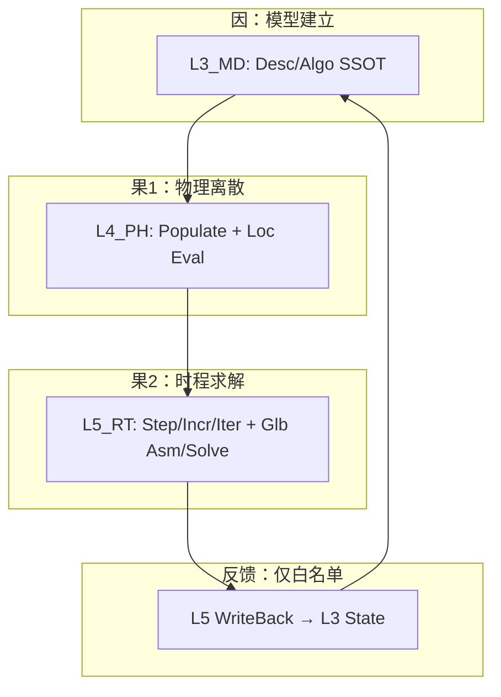

# UFC L3/L4/L5 域柱改造固化工作流（v1.0）

> **路径**：`UFC/docs/05_Project_Planning/PPLAN/03_实施规划/实施路线/UFC_L3L4L5_域柱改造固化工作流_v1.0.md`  
> **版本**：v1.0 · **状态**：ACTIVE · **更新**：2026-05-19  
> **角色**：把「二元结构 = 四型+Args + 过程三维」落成 **可重复、可验收、可防偏离** 的域柱垂直切片工作流（规范叙事真源）。  
> **运行编排真源**：[`UFC/plan/workflows/L3L4L5_MASTER_PLAN.md`](../../../../../plan/workflows/L3L4L5_MASTER_PLAN.md)  
> **Agent 技能**：[`UFC/skills/ufc-layer-workflow/SKILL.md`](../../../../../skills/ufc-layer-workflow/SKILL.md)

---

## 0. 文档安置与读者路径

| 你需要 | 打开 |
|--------|------|
| **为什么这样改、方法论如何映射** | 本文 §1–§3 |
| **七步工序与层内分工** | 本文 §4–§5 |
| **验收标准与上下文挂钩** | 本文 §6 |
| **防偏离与控制点** | 本文 §7 |
| **波次/任务分解/交接清单** | [`plan/workflows/L3L4L5_MASTER_PLAN.md`](../../../../../plan/workflows/L3L4L5_MASTER_PLAN.md) |
| **开任务时复制** | [`plan/workflows/templates/TASK_RUN_L3L4L5.md`](../../../../../plan/workflows/templates/TASK_RUN_L3L4L5.md) |
| **开变更包时复制** | [`plan/workflows/templates/CHANGE_DESIGN_METHODOLOGY.md`](../../../../../plan/workflows/templates/CHANGE_DESIGN_METHODOLOGY.md) |
| **逐步交接** | [`plan/workflows/templates/HANDOFF_MATRIX.md`](../../../../../plan/workflows/templates/HANDOFF_MATRIX.md) |

**与既有真源关系（不替代，只串联）**：

| 真源 | 职责 |
|------|------|
| [`UFC_L3L4L5_二元重构蓝图规范_v1.0.md`](../../../../REPORTS/archive/UFC_L3L4L5_二元重构蓝图规范_v1.0.md) | 四型+Args、三维后缀、P1–P6 域柱条文 |
| [`L3_L4_L5_二元结构主轴与波次路线图.md`](L3_L4_L5_二元结构主轴与波次路线图.md) | 波次 0–2、PR 主轴声明 |
| [`L3_L4_L5_语义改造_导航真源.md`](L3_L4_L5_语义改造_导航真源.md) | W0–W8 唯一顺序 |
| [`UFC_L345_形式对齐域级检查表_P1-P6.md`](../../../../02_Developer_Guide/UFC_L345_形式对齐域级检查表_P1-P6.md) | G1–G6 静态自检 |
| [`07_L3L4L5_二元结构合同完备里程碑.md`](../../11_闭环落地专项/07_L3L4L5_二元结构合同完备里程碑.md) | A4 + A7–A11 逐域 ☑ |
| 各域 `ufc_core/**/CONTRACT.md` | 单域 SSOT |

---

## 1. 前因：为什么要固化工作流

### 1.1 症状（后果若不管）

| 症状 | 典型后果 |
|------|----------|
| 按 **层** 横向改（先整层 L3 再 L4） | Bridge/Populate 多点失稳；合同与实现长期漂移 |
| 主 TYPE 扁平、过程签名扩散 | 热路径难优化；IP/NR 循环耦合巨型上下文 |
| 无统一 **Args/SIO** | `inp/out` 对偶泛滥；Harness 无法机械检查 |
| 合同写了但无 **Registry 快照** | 「设计领先源码」与「源码领先设计」无法对账 |
| PR 无 **层/域/合同/Bridge/SIO** 声明 | Code Review 无法判断范围；易夹带无关域 |

### 1.2 根因（方法论要解决的）

UFC 将功能模块定义为 **二元结构**：

```
功能模块 = 数据结构(主/辅四型 Desc·State·Algo·Ctx + Args) + 过程算法(空间×时间×动作)
```

若不把该公式固化为 **域柱垂直切片上的工序 + 验收 + 门禁**，改造会退化为「改文件名」或「局部补丁」，无法与 Phase4 闭环链、Guardian、合同里程碑对齐。

### 1.3 目标（固化后期望状态）

1. **每个贯通域柱 P1–P6** 具备一条 **L3→L4→L5 金线**，可独立 PR/MR 闭合。  
2. **每个域** 的 `CONTRACT.md` 可核对四型裁剪、三轴过程表、SIO、A4/A+。  
3. **人类编排** 在 `plan/tasks/<id>/TASK_RUN.md`；**机器证据** 在 `REPORTS/` + Harness 退出码。  
4. **Agent/新人** 按同一七步工序推进，换会话不丢上下文。

---

## 2. 方法论 → UFC 映射（normative）

| 方法论项 | UFC 实现 | 主要落点 |
|----------|----------|----------|
| 四型 Desc/State/Algo/Ctx | `TYPE, PUBLIC :: {L}_{Dom}_{Feat}_{Desc\|State\|Algo\|Ctx}` | `*_Def.f90`、域 `CONTRACT` 四型表 |
| Args | `*_Arg` / `*_Args` + `[IN]`/`[OUT]` 注释 | 层间边界、L5 `*_Proc` |
| 辅 TYPE（嵌套） | `{Phase}{Verb}_{DataKind}` 嵌套入主四型 | `*_Aux_Def.f90` 或 `*_Def` 内组件 |
| 并列 | 同域子目录（Elas/Plast/…） | `L3_MD/Material/Plast/` 等 |
| 主从 | Dispatch/Reg = master；`*_Core` = slave | L4 `Dispatch/`、`PH_MatEval` |
| 空间维 | `_Loc` / `_Glb` / `_Asm` | L4 Loc 本构/单元；L5 Glb 装配/求解 |
| 时间维 | `_Init` / `_Step` / `_Incr` / `_Iter` | L3 冷路径；L5 StepDriver |
| 动作维 | `_Populate` / `_Eval` / `_Dispatch` / `_WriteBack` | Populate 金线；WriteBack 白名单 |

**层职责（因果链）**：



---

## 3. 工作流单位：贯通域柱，不是单层

| 类型 | 编号 | 改造单位 | 三层路径示例 |
|------|------|----------|--------------|
| 贯通域柱 | P1–P6 | Material, Element, Contact, LoadBC, Output, WriteBack | `L3_MD/Material` ↔ `L4_PH/Material` ↔ `L5_RT/Material` |
| 半贯通 | H1–H2 | Analysis/Step, Section | L3 Analysis + L5 StepDriver |
| 层专属 | S1–S8 | Bridge, Mesh, KeyWord… | 随柱嵌入，不单开全库 PR |

**硬约束**：禁止在无独立 PR 叙事下 **并行改 >1 条贯通柱**（见形式对齐检查表「域柱垂直切片」）。

---

## 4. 七步固化工序（每域柱每波次重复）

| Step | 名称 | 输入上下文 | 产出 | 不负责 |
|------|------|------------|------|--------|
| **S1** | 设计锚定 | 蓝图 §对应柱、域 `CONTRACT`、PPLAN 子总纲 | 更新/确认 `CONTRACT` 四型裁剪 + 三轴登记表；可选 `DomainProcedureRegistry/design/*/INTENT.md` | 不写大规模 `.f90` |
| **S2** | 现状快照 | `ufc_core` 该柱三层目录 | `generated/` 镜像清单；差距表草稿 | 不改源码 |
| **S3** | 差距与计划 | S1+S2 | `plan/changes/<change_id>/` 四制品；`plan/tasks/<task_id>/TASK_RUN.md` | 不跳过 S1 合同 |
| **S4** | L3 数据面 | S3 任务表 | `*_Def`/Reg/Mgr/Brg；G2/G3/G5 证据 | 不做 L4 本构积分 |
| **S5** | L4 计算面 | L3 Populate 叙事 | `PH_L4_Populate`、`*_Core`/Eval、Dispatch | 不编排 Newton 循环 |
| **S6** | L5 编排面 | L4 热路径接口 | `*_Proc`、Dispatcher、六参/书签 | 不写材料本构公式 |
| **S7** | 验收闭环 |  touched 路径 | G1–G6 表；Harness；`07` 对应行 ☑；归档 TASK_RUN | 不以「全库绿」代替本柱 DoD |

**柱内顺序**：S4 → S5 → S6 不可倒；S1–S3 可与人机协作交错但 **合同先于代码**。

**与 pilot 四步对齐**（主辅 TYPE 铺开时）：

| pilot Step | 本工作流 |
|------------|----------|
| Step1 纯 TYPE | S4（L3 Def）+ S5 Def 部分 |
| Step2 Init/Populate | S4 Brg + S5 Populate |
| Step3 热路径 | S5 Core + S6 |
| Step4 去遗留+合同+回归 | S7 |

---

## 5. 分层工序要点（L3 / L4 / L5）

### 5.1 L3_MD checklist

- [ ] 四型 **Desc/Algo** 为 SSOT；State 写入点仅在 WriteBack 合同列出  
- [ ] 无 `USE L4_PH` / `USE L5_RT`（`Bridge` 单向出口除外）  
- [ ] 注册单路径写在 `CONTRACT`（避免 Reg/Lib 双真源）  
- [ ] 过程三轴表：冷路径 Register/Populate 查询已登记  

### 5.2 L4_PH checklist

- [ ] `PH_L4_Populate` / slot 为 L3→L4 主路径；LEGACY Bridge 标清  
- [ ] **Ctx 热路径零 ALLOCATE**（合同 + 代码审查）  
- [ ] Dispatch 主从关系明确；Eval 入口 Args 与 SIO 技能一致  
- [ ] `DESIGN_*_FourTypes.md` 与 `CONTRACT` 一致  

### 5.3 L5_RT checklist

- [ ] 编排集中在 `*_Proc`；四型 **DELEGATED** 在合同写清  
- [ ] `RT_Com_Base_Ctx` 与域 `_Ctx` 正交（A9）  
- [ ] WriteBack 仅写 L3 白名单字段  
- [ ] Guardian **HOT/DEP** 与合同 A8 一致  

---

## 6. 验收标准（上下文挂钩）

### 6.1 三级验收（不得混淆）

| 级别 | 含义 | 真源 | 通过标志 |
|------|------|------|----------|
| **L-形式** | 四型+命名+三轴 | G1–G6 | PR 附件勾选表 |
| **L-合同** | A4 四链+因果 + A7–A11 | `06` 验收表 + 域 `CONTRACT` | `07` 对应域行 ☑ |
| **L-物理** | 本构/单元/步进正确 | 单测/集成/patch | C1–C4 / 材料柱 audit |

**声明**：L-合同齐 **≠** L-物理绿；波次「打通」须三者分开勾选（见主轴路线图 §4 并行线）。

### 6.2 上下文引用链（PR 必填）

每条 PR / 每个 `TASK_RUN.md` 的 **References** 须至少包含：

1. **域柱编号**（P1–P6 / H1）  
2. **三层 `CONTRACT.md` 路径**（改则链 diff；不改则写理由）  
3. **`change_id`**（若有规格变更）  
4. **波次**（W0/W1/波次0/1/2）  
5. **G1–G6 结果表**（复制自形式对齐检查表对应节）  
6. **Harness 命令 + 退出码**（贴 `TASK_RUN` Log 或 `REPORTS/` 路径）

### 6.3 Step 完成判据（DoD 摘要）

| Step | DoD（全部满足才算完成） |
|------|-------------------------|
| S1 | CONTRACT 含四型表+三轴表+十件套 v2.0 映射；与蓝图该柱无冲突 |
| S2 | `domain_procedure_registry_scan.py` 已跑；差距表已链到文件 stem |
| S3 | `change-package validate` 通过；TASK_RUN 含 Next action + 子任务表 |
| S4 | L3 touched 文件 discipline/guardian/naming 绿；G2/G5 有证据行 |
| S5 | L4 同上；Populate 叙事与 L3 合同一致 |
| S6 | L5 同上；SIO 与 A9 一致或 N/A 已声明 |
| S7 | G1–G6 全绿；`07` 行可勾；TASK_RUN 标 `done` 并归档指引 |

---

## 7. 防偏离机制

### 7.1 范围偏离

| 风险 | 控制 |
|------|------|
| PR 夹带多域柱 | PR 模板强制五元声明（层/域/合同/Bridge/SIO）；Review 拒收 |
| 横向扫层 | 导航真源 W 顺序；TASK_RUN 只允许一个 `pillar_id` |
| 改 `docs/` 规范无授权 | AGENTS 红区；仅 `plan/` + `ufc_core` + 域 CONTRACT |

### 7.2 架构偏离

| 风险 | 控制 |
|------|------|
| 热路径 `USE` 巨型 L3 | Guardian DEP/GLB；pilot 垂直流禁令 |
| 双 Bridge / 双注册 | `BRIDGE_INDEX` + 合同「单路径」表 |
| Ctx 堆分配 | 合同热路径节 + Code Review L4 清单 |

### 7.3 文档偏离

| 风险 | 控制 |
|------|------|
| REPORTS 叙事改合同 | Registry README 对账优先级：CONTRACT > INTENT > 源码 > archive 叙事 |
| 手改 `generated/` | 禁止；只跑扫描脚本 |

### 7.4 执行偏离（人机协作）

| 手段 | 说明 |
|------|------|
| **TASK_RUN 单写处** | 对话只当 UI；续作先 `agent-task status` |
| **Next action 一步** | 未完成 S7 不开启下一柱 |
| **change_id 边界** | 扩范围必须新 `change_id`（见 material pilot design） |
| **分级自治** | 绿：只读扫描；黄：批量后 closure；红：合 main / 改规范 |

### 7.5 门禁命令（touched 路径）

```text
python ufc_harness/run_harness.py discipline verify --touch-path <path>
python ufc_harness/run_harness.py guardian ufc_core/<Layer>/<Domain> --fail-on-p0
python ufc_harness/run_harness.py naming ufc_core/<Layer>/<Domain>
python ufc_harness/run_harness.py change-package validate --change-id <id> [--strict]
```

可选 Args 静态检查：`python UFC/skills/ufc-layer-workflow/scripts/validate_args.py <file.f90>`

---

## 8. 维护

- 工序或 DoD 变更：先改本文 + `plan/workflows/L3L4L5_MASTER_PLAN.md`，再改技能。  
- 与 W0–W8 冲突：**以** [`UFC_L3_L4_L5_主辅TYPE嵌套_全域铺开执行计划.md`](UFC_L3_L4_L5_主辅TYPE嵌套_全域铺开执行计划.md) **为裁决**。  
- 蓝图条文变更：改 `REPORTS/archive/UFC_L3L4L5_二元重构蓝图规范_v1.0.md` 并留痕 `DOC_MAINTENANCE_GUIDE`。

*创建：2026-05-19*
