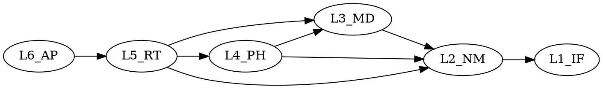

# UFC 工具链使用手册

> **版本**: v1.0  
> **创建日期**: 2026-03-06  
> **最后更新**: 2026-03-06  
> **适用范围**: UFC 项目工具链使用指南  
> **上级参考**: UFC_架构设计总纲_六层四类四链三步三级两图一体.md（v2.0）

---

## 📋 文档说明

本文档提供 UFC 项目所有工具的使用说明，包括：

- 每个工具的使用说明
- 参数说明
- 输出格式说明
- 常见问题
- 扩展开发指南

---

## 目录

1. [代码质量检查工具](#1-代码质量检查工具)
2. [数值验证工具](#2-数值验证工具)
3. [性能分析工具](#3-性能分析工具)
4. [文档生成工具](#4-文档生成工具)
5. [工具扩展开发](#5-工具扩展开发)

---

## 1. 代码质量检查工具

### 1.1 check_naming_standard.py

**用途**: 检查命名规范合规性

**位置**: `UFC/ufc_core/tools/check_naming_standard.py`

**使用方法**:

```bash
python tools/check_naming_standard.py [options]
```

**参数**:

- `--path PATH`: 检查路径（默认: `ufc_core/`）
- `--layer LAYER`: 检查特定层（可选: L1_IF, L2_NM, L3_MD, L4_PH, L5_RT, L6_AP）
- `--fix`: 自动修复（实验性）
- `--verbose`: 详细输出

**输出格式**:

```
Checking naming standard...
[ERROR] L3_MD/Material/MD_Material_Old.f90:10: Invalid naming: MD_Material_Old
  Expected: MD_Material_*
[WARNING] L4_PH/Elem/PH_Elem.f90:5: Missing suffix
  Expected: PH_Elem_Core or PH_Elem_API

Summary:
  Total files: 500
  Errors: 5
  Warnings: 12
  Passed: 483
```

**退出码**:

- `0`: 检查通过
- `1`: 发现错误
- `2`: 发现警告（使用 `--strict` 时）

---

### 1.2 verify_layer_dependency.py

**用途**: 验证层级依赖规则

**位置**: `UFC/ufc_core/tools/verify_layer_dependency.py`

**使用方法**:

```bash
python tools/verify_layer_dependency.py [options]
```

**参数**:

- `--path PATH`: 检查路径
- `--strict`: 严格模式（禁止所有反向依赖）
- `--graph`: 生成依赖图（Graphviz）

**输出格式**:

```
Verifying layer dependencies...
[ERROR] L4_PH/Elem/PH_Elem.f90:15: USE L3_MD_Material
  Violation: L4 cannot USE L3 directly (should use Bridge)

Dependency violations:
  L4 → L3: 3 violations
  L5 → L3: 1 violation

Summary:
  Total violations: 4
```

**依赖图输出**（使用 `--graph`）:

```dot
digraph dependencies {
  L6_AP -> L5_RT
  L5_RT -> L4_PH
  L4_PH -> L3_MD [style=dashed, color=red]  # Violation
  ...
}
```

---

### 1.3 verify_type_categories.py

**用途**: 检查 TYPE 四类分类（Desc/State/Algo/Ctx）

**位置**: `UFC/ufc_core/tools/verify_type_categories.py`

**使用方法**:

```bash
python tools/verify_type_categories.py [options]
```

**参数**:

- `--path PATH`: 检查路径
- `--fix`: 自动修复分类（实验性）
- `--report`: 生成分类报告

**输出格式**:

```
Verifying TYPE categories...
[ERROR] L3_MD/Material/MD_Material.f90:20: TYPE MD_Material_Type
  Missing suffix: Should be MD_Material_Desc_Type or MD_Material_State_Type

[WARNING] L4_PH/Elem/PH_Elem.f90:15: TYPE PH_Elem_Ctx_Type
  Ctx type should be in Ctx domain, not Elem domain

Category summary:
  Desc: 45 types
  State: 32 types
  Algo: 18 types
  Ctx: 12 types
  Unclassified: 3 types
```

---

### 1.4 check_comments.py

**用途**: 检查注释质量（禁止中文）

**位置**: `UFC/ufc_core/tools/check_comments.py`

**使用方法**:

```bash
python tools/check_comments.py [options]
```

**参数**:

- `--path PATH`: 检查路径
- `--allow-chinese`: 允许中文注释（不推荐）
- `--min-length LENGTH`: 最小注释长度（默认: 10）

**输出格式**:

```
Checking comments...
[ERROR] L3_MD/Material/MD_Material.f90:25: Chinese comment detected
  Line: ! 这是材料定义
  Expected: English only

[WARNING] L4_PH/Elem/PH_Elem.f90:30: Comment too short
  Line: ! Compute
  Expected: More descriptive comment

Summary:
  Chinese comments: 5
  Too short comments: 12
  Missing comments: 8
```

---

### 1.5 verify_init_order.py

**用途**: 验证初始化顺序（容器生命周期）

**位置**: `UFC/ufc_core/tools/verify_init_order.py`

**使用方法**:

```bash
python tools/verify_init_order.py [options]
```

**参数**:

- `--path PATH`: 检查路径
- `--strict`: 严格模式

**输出格式**:

```
Verifying initialization order...
[ERROR] L5_RT/Solver/RT_Solver.f90:50: Init called before dependency
  Dependency: L3_MD_LayerContainer%Init
  Current: RT_Solver%Init
  Order: L3_MD should be initialized before L5_RT

Summary:
  Order violations: 2
```

---

## 2. 数值验证工具

### 2.1 test_element_accuracy.py

**用途**: 单元精度验证（对比 ABAQUS）

**位置**: `UFC/ufc_core/tests/test_element_accuracy.py`

**使用方法**:

```bash
python tests/test_element_accuracy.py [options]
```

**参数**:

- `--element ELEMENT`: 测试特定单元类型（C3D8, C3D20, S4等）
- `--tolerance TOL`: 容差（默认: 0.01）
- `--compare-abaqus`: 与 ABAQUS 结果对比

**输出格式**:

```
Testing element accuracy...
Testing C3D8...
  Patch Test: PASS (error = 1.2e-12)
  Cantilever Beam: PASS (error = 0.5%)
  Cook's Membrane: PASS (error = 0.8%)

Summary:
  Total tests: 10
  Passed: 10
  Failed: 0
  Average error: 0.6%
```

---

### 2.2 test_material_accuracy.py

**用途**: 材料本构精度验证

**位置**: `UFC/ufc_core/tests/test_material_accuracy.py`

**使用方法**:

```bash
python tests/test_material_accuracy.py [options]
```

**参数**:

- `--material MATERIAL`: 测试特定材料类型
- `--tolerance TOL`: 容差

**输出格式**:

```
Testing material accuracy...
Testing Elastic...
  Uniaxial tension: PASS (error = 0.1%)
  Pure shear: PASS (error = 0.2%)

Testing Plastic (J2)...
  Yield stress: PASS (error = 0.3%)
  Hardening: PASS (error = 0.5%)

Summary:
  Total tests: 15
  Passed: 15
  Failed: 0
```

---

### 2.3 run_regression_tests.py

**用途**: 运行回归测试套件

**位置**: `UFC/ufc_core/tests/run_regression_tests.py`

**使用方法**:

```bash
python tests/run_regression_tests.py [options]
```

**参数**:

- `--baseline BASELINE`: 基准结果目录
- `--compare`: 对比历史结果
- `--output OUTPUT`: 输出目录

**输出格式**:

```
Running regression tests...
Test 1/50: patch_test... PASS
Test 2/50: cantilever_beam... PASS
Test 3/50: cooks_membrane... FAIL
  Error: Displacement mismatch
  Expected: 23.964 mm
  Got: 24.012 mm
  Difference: 0.2%

Summary:
  Total: 50
  Passed: 49
  Failed: 1
  Regression: 1 test failed
```

---

## 3. 性能分析工具

### 3.1 profile_performance.py

**用途**: 性能剖析（识别热点函数）

**位置**: `UFC/ufc_core/tools/profile_performance.py`

**使用方法**:

```bash
python tools/profile_performance.py [options] <program> <args>
```

**参数**:

- `--output OUTPUT`: 输出文件
- `--format FORMAT`: 输出格式（text, html, json）
- `--threshold THRESHOLD`: 阈值（默认: 1%）

**输出格式**:

```
Performance profile:
Function                          Time (s)    %    Calls
----------------------------------------------------------
PH_Elem_ComputeStiffness         45.2        35.1  1000000
NM_LinearSolver_Solve            32.1        24.9  1000
PH_Mat_Evaluate                  18.5        14.4  5000000
RT_Solver_Assemble               12.3        9.6   1000
...

Total time: 128.7 s
Hot functions (>1%): 8
```

---

### 3.2 benchmark_parallel.py

**用途**: 并行效率测试

**位置**: `UFC/ufc_core/tools/benchmark_parallel.py`

**使用方法**:

```bash
python tools/benchmark_parallel.py [options]
```

**参数**:

- `--max-threads MAX`: 最大线程数（默认: 8）
- `--iterations ITER`: 迭代次数

**输出格式**:

```
Parallel efficiency benchmark:
Threads  Time (s)  Speedup  Efficiency
----------------------------------------
1        100.0     1.00     100.0%
2        52.5      1.90     95.0%
4        27.8      3.60     90.0%
8        15.2      6.58     82.3%

Summary:
  Best efficiency: 95.0% (2 threads)
  Target efficiency: >70%
  Status: PASS
```

---

## 4. 文档生成工具

### 4.1 generate_api_docs.py

**用途**: 自动生成 API 文档

**位置**: `UFC/ufc_core/tools/generate_api_docs.py`

**使用方法**:

```bash
python tools/generate_api_docs.py [options]
```

**参数**:

- `--output OUTPUT`: 输出目录（默认: `docs/api/`）
- `--format FORMAT`: 输出格式（markdown, html, pdf）

**输出**:

- `docs/api/L1_IF_API.md`
- `docs/api/L2_NM_API.md`
- ...

---

### 4.2 generate_dependency_graph.py

**用途**: 生成依赖关系图

**位置**: `UFC/ufc_core/tools/generate_dependency_graph.py`

**使用方法**:

```bash
python tools/generate_dependency_graph.py [options]
```

**参数**:

- `--output OUTPUT`: 输出文件（默认: `dependency_graph.dot`）
- `--format FORMAT`: 输出格式（dot, png, svg）
- `--layer LAYER`: 特定层的依赖图

**输出示例**:



---

## 5. 工具扩展开发

### 5.1 工具开发模板

**模板**: `tools/template_tool.py`

```python
#!/usr/bin/env python3
"""
Tool: <Tool Name>
Purpose: <Tool purpose>
"""

import argparse
import sys
from pathlib import Path

def main():
    parser = argparse.ArgumentParser(description='<Tool description>')
    parser.add_argument('--path', type=str, default='ufc_core/',
                       help='Path to check')
    parser.add_argument('--verbose', action='store_true',
                       help='Verbose output')
    
    args = parser.parse_args()
    
    # Tool logic
    errors = []
    warnings = []
    
    # ... implementation ...
    
    # Report results
    if errors:
        print(f"Errors: {len(errors)}")
        for error in errors:
            print(f"  [ERROR] {error}")
        return 1
    
    if warnings:
        print(f"Warnings: {len(warnings)}")
        for warning in warnings:
            print(f"  [WARNING] {warning}")
    
    print("PASS: All checks passed")
    return 0

if __name__ == '__main__':
    sys.exit(main())
```

### 5.2 工具集成到 CI/CD

**GitHub Actions**:

```yaml
- name: Run custom tool
  run: |
    python tools/my_custom_tool.py --path ufc_core/
    if [ $? -ne 0 ]; then
      echo "Tool check failed"
      exit 1
    fi
```

---

## 附录

### A.1 工具列表速查


| 工具                             | 用途        | 状态      |
| ------------------------------ | --------- | ------- |
| `check_naming_standard.py`     | 命名规范检查    | ✅ 已实现   |
| `verify_layer_dependency.py`   | 层级依赖检查    | ✅ 已实现   |
| `verify_type_categories.py`    | TYPE 分类检查 | ✅ 已实现   |
| `check_comments.py`            | 注释质量检查    | ✅ 已实现   |
| `verify_init_order.py`         | 初始化顺序检查   | 🟡 部分实现 |
| `generate_dependency_graph.py` | 依赖图生成     | 🟡 待实现  |
| `test_element_accuracy.py`     | 单元精度测试    | ✅ 已实现   |
| `test_material_accuracy.py`    | 材料精度测试    | ✅ 已实现   |
| `profile_performance.py`       | 性能剖析      | ✅ 已实现   |
| `benchmark_parallel.py`        | 并行效率测试    | ✅ 已实现   |


### A.2 相关文档

- `UFC_CI_CD_PIPELINE.md` - CI/CD 流程文档
- `UFC_DEVELOPER_GUIDE.md` - 开发者指南
- `UFC_TEST_STRATEGY.md` - 测试策略

---

**文档状态**: Draft v1.0  
**最后更新**: 2026-03-06  
**维护者**: UFC 开发团队