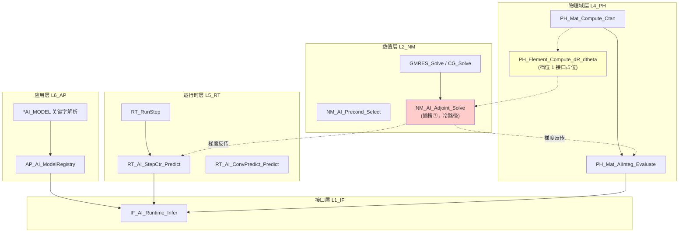

# UFC AI-Ready 架构集成规范

**版本**: v1.9.3  
**日期**: 2026-03-28  
**状态**: 正式设计文档（Phase 2 后续演进方向）  
**v1.9.3 修订**: 新增 **§1.2.3 AI 技术路线详表**（分层×阶段×交付×门禁×验证）；**§7.3** SKU-B/AI P3 与推理路线衔接；**§11** 首段指向技术路线总入口。  
**v1.9.2 修订**: 新增 **§3.5**——**目标函数 J** 与伴随链：**不须**如本构库「全集提前内置」；须 **合同化 ∂J/∂u（及按需 ∂J/∂θ）**；**标准目标 + 用户注册** 双轨；与总纲 **§0.4**、**插槽⑦** 对齐。  
**v1.9.1 修订**: **§3.3** 增补 **UBCL**（边界 / 载荷灵敏度）为与 **UTHETA** 并列的第四类用户子程序**对外类比名**。  
**v1.9 修订**: 新增 **§3.3** θ 来源细分与 **UMAT / UTHETA / UAIW / UBCL** 类比口径；新增 **§3.4** 用户 SUBROUTINE 式扩展与 **总装/求解/伴随** 的集成路径（非第二套总刚）。  
**v1.8 修订**: 新增 **§3.2**——残差 **R**、设计变量 **θ** 与四型的落位及 **RT_SD_Arg / NM_Solver / PH 单元模板** 合同锚点；与总纲 **§11.4.1**、`L2_NM/Solver/CONTRACT.md`、`L3_MD/contracts/CONTRACT_R_Theta_FourKind.md`、`fem-kernel-data-contract` 技能交叉引用。  
**v1.7 修订**: §1.2.1/1.2.2 澄清 SKU-A/B 与梯度实施节奏；§5 与 G-5 澄清 ONNX/IF_AI 仅约束 NN 路径；设计说明收窄为「凡使用 ORT 的实现」。  
**作者**: 架构设计团队  
**前置文档**: `L3_MD_L4_PH_联通契约与缺陷分析.md`（v1.12+）、`UFC_L4_PH_架构设计规范.md`、`AI-ready功能模块完整清单.md`（v1.0）

---

## 目录

1. [文档定位与集成时序](#1-文档定位与集成时序)（含 §1.2.1 交付分档、§1.2.2 梯度节奏、**§1.2.3 AI 技术路线详表**）
2. [AI 插槽六层归属决策表](#2-ai-插槽六层归属决策表)
3. [UFC 四类 TYPE 封装规范](#3-ufc-四类-type-封装规范)（含 §3.2–§3.5：R/θ、θ 与用户子程序、**目标函数 J** 伴随接口）
4. [六插槽完整 UFC 封装方案](#4-六插槽完整-ufc-封装方案)
   - 4.1 [AI_StepCtr — L5_RT 切步控制器](#41-ai_stepctr--l5_rt切步控制器)
   - 4.2 [AI_ConvPredict — L5_RT 收敛预测器](#42-ai_convpredict--l5_rt收敛预测器)
   - 4.3 [AI_MatInteg — L4_PH 本构代理](#43-ai_matinteg--l4_ph本构代理)
   - 4.4 [AI_ContactLaw — L4_PH 接触律代理](#44-ai_contactlaw--l4_ph接触律代理)
   - 4.5 [AI_Preconditioner — L2_NM 学习型预条件](#45-ai_preconditioner--l2_nm学习型预条件)
   - 4.6 [AI_SparseSolver — L2_NM 稀疏求解加速](#46-ai_sparsesolver--l2_nm稀疏求解加速)
5. [L1_IF 公共 AI 运行时封装](#5-l1_if-公共-ai-运行时封装)
6. [L6_AP 模型加载与生命周期管理](#6-l6_ap-模型加载与生命周期管理)
7. [与 P0/P1/P2 的时序关系](#7-与-p0p1p2-的时序关系)
8. [清单 v1.0 已知错误修正记录](#8-清单-v10-已知错误修正记录)
9. [AI 专项质量守卫规则](#9-ai-专项质量守卫规则)
10. [AI 反模式禁令](#10-ai-反模式禁令)
11. [可微分物理引擎技术路线](#11-可微分物理引擎differentiable-physics-engine技术路线)
    - [对外宣讲一页：⑦ 与层 3 分工](./UFC_插槽⑦与层3分工_对外宣讲一页.md)

---

## 1. 文档定位与集成时序

### 1.1 文档定位

本文档是 [`AI-ready功能模块完整清单.md`](../../archive/PLAN_History/99_归档库/03_大型方案稿/AI-ready功能模块完整清单.md)（v1.0）经架构审查后的**正式集成规范**，解决原清单存在的四项架构问题：

| 问题编号 | 原清单问题描述 | 本文档修正方向 |
|----------|---------------|---------------|
| **AI-P1** | `use RT_Global_Types` 违反 L4/L2→L1 单向依赖 | 全部 AI 模块改为只 USE L1_IF 层类型 |
| **AI-P2** | AI_MatInteg 接口暴露裸数组（违反 I-12 Arg 封装规则） | 改用 `PH_Mat_Ctx` / `PH_Mat_State` 传参 |
| **AI-P3** | 清单内 P0/P1/P2 标签与工程 P0 体系不对齐 | §7 给出正确的时序映射 |
| **AI-P4** | AI TYPE 缺少 UFC 四类体系归属（Desc/State/Algo/Ctx） | §3 统一规范所有 AI TYPE 归属 |

### 1.2 集成时序总览

```
当前工程进度
┌─────────────────────────────────────────────────────────┐
│ 工程 P0（已完成）                                         │
│   P0-A~D：RT_Drv_Ctx / RT_Step / RT_WriteBack / Coupling │
│                                                           │
│ 工程 P1（已完成）                                         │
│   P1-A~C：Assembly/Amplitude / Interaction / WriteBack    │
│                                                           │
│ 工程 P2（已完成）                                         │
│   P2-A~C：LoadBC / AP_Cmd 拆分 / Command Types 统一       │
└─────────────────────────────────────────────────────────┘
              ↓ P0/P1/P2 全部完成后 ↓
┌─────────────────────────────────────────────────────────┐
│ AI P0（高优先级，建议 6 个月内启动）                       │
│   AI-P0-A：L1_IF AI 运行时公共封装                        │
│   AI-P0-B：AI_StepCtr（L5_RT）                            │
│   AI-P0-C：AI_MatInteg（L4_PH）                           │
│                                                           │
│ AI P1（中优先级，建议 12 个月内）                          │
│   AI-P1-A：AI_ConvPredict（L5_RT）                        │
│   AI-P1-B：AI_Preconditioner（L2_NM）                     │
│                                                           │
│ AI P2（低优先级，长期规划）                                │
│   AI-P2-A：AI_ContactLaw（L4_PH）                         │
│   AI-P2-B：AI_SparseSolver（L2_NM）                       │
└─────────────────────────────────────────────────────────┘
```

> **强制约束**：AI P0 必须在工程 P0/P1/P2 全部完成且 G-1~G-5 质量门禁通过后方可启动。不得并行推进。

### 1.2.1 交付分档与「完整闭环」口径（与总纲 §11.1 / §0.4 对齐）

为避免将「AI-ready」误解为「必须一次做完层 1+2+3」，交付按下表分档；**内核默认仍不假设深度学习训练环**（总纲 §0.4）。

| 分档 | 范围 | 说明 |
|------|------|------|
| **SKU-A（推理插槽）** | 总纲 **§11 层 1** 中已落地的插槽子集（如 IF_AI 运行时 + ①③ 等） | 构成有效的 **AI-ready 阶段交付**，**不要求**层 2/3 已实现。 |
| **SKU-B（优化/反演闭环）** | 在 SKU-A 之上启用 **层 2**（伴随 / TransposeSolve）与 **层 3**（∂R/∂θ，L4_PH/Element） | 对应文档所称 **「完整 AI-ready 闭环」**（端到端 PIML、参数反演、拓扑优化等工程闭环）。 |

**结论**：缺少层 2/3 **不否定** SKU-A 的架构合规性；仅当产品承诺「完整闭环」时，才以 SKU-B 为验收目标。

### 1.2.2 可微分与梯度实施节奏（与总纲 §11.4 / §0.4 对齐）

**推荐顺序**（可写进路线图，但**不设为** AI P0/P1 的默认硬门槛）：

1. **有限差分试点** — 验证接口、灵敏度量级与测试夹具；  
2. **手写关键路径切线/伴随** — 与高价值单元族/本构绑定；  
3. **对选定内核路径引入 Tapenade 等解析/半解析 AD** — 纳入独立 CI 目标与版本策略。

**禁止**将「全场自动微分」或「Tapenade 全覆盖」写为 **AI P0/P1 的默认交付条件**；与总纲 **§0.4 显式非目标** 一致。

### 1.2.3 AI 技术路线详表（分层 × 阶段 × 交付 × 门禁）

本节为 **AI 技术路线的总入口**：与 **§7**（工程/AI 时序依赖）、**§11.7**（AI P3 档位）、**§3**（R/θ、UMAT/UTHETA/UBCL/UAIW、目标函数 **J**）一致；实施时以 **本表 + 门禁** 驱动排期，避免「只谈插槽不谈闭环」或「闭环与推理绑死同一里程碑」。

#### 1.2.3.1 能力分层与阶段矩阵（SKU 对照）

| 能力分层（总纲 §11） | **SKU-A** 是否必须 | **SKU-B** 是否必须 | 主要文档锚点 |
|---------------------|-------------------|-------------------|-------------|
| **层 1**：推理插槽 ①–⑥ + `IF_AI_Runtime`（NN 路径 ORT） | ✅ 交付核心 | ✅ 仍在热路径 | §4–§6、§5 G-5、§10 AAP-* |
| **层 2**：插槽⑦ `AI_AdjointSolver`（Kᵀλ、TransposeSolve） | ❌ | ✅ | §11.3–11.4、§11.7、AAP-8/9/11 |
| **层 3**：∂R/∂θ（L4_PH/Element，含 UMAT/UTHETA/UBCL/UAIW 扩展） | ❌ | ✅ | §3.3–§3.4、总纲 §11.4、§11.7 档位 1+ |
| **目标函数 J**（§3.5：∂J/∂u 合同 + 标准/注册） | ❌ | ✅（离散伴随主路线） | **§3.5** |
| **L6_AP**：`*AI_MODEL`、Registry、生命周期 | ✅（NN 插槽） | 视场景 | §6 |

#### 1.2.3.2 工程阶段与核心交付物（可验收）

| 阶段 | 时间建议（文档级） | **层 1（推理）核心交付** | **层 2/3 / J（SKU-B）核心交付** | 依赖与并行 |
|------|-------------------|-------------------------|--------------------------------|-----------|
| **AI P0** | 工程 P0–P2 与 G-1~G-5 通过后 6 个月内 | **AI-P0-A** `IF_AI_Runtime`；**AI-P0-B** ① StepCtr；**AI-P0-C** ③ MatInteg；四类 TYPE 齐 | 不要求；可并行 **档位 1**：`PH_Element_Compute_dR_dtheta` **仅签名占位**（§11.7） | §7.1；禁止与工程 P2 前并行启动 AI P0（§1.2） |
| **AI P1** | 12 个月内 | **AI-P1-A** ② ConvPredict；**AI-P1-B** ⑤ Preconditioner | **AI P3-A**：`NM_AI_Adjoint_FD_Sensitivity` 等 **FD 端到端试点**（TRUSS/线弹性）；**∂J/∂u** 合同草案可与试点同迭代 | FD 不升格为 P0/P1 **默认硬门槛**（§1.2.2） |
| **AI P2** | 长期 | **AI-P2-A** ④ ContactLaw；**AI-P2-B** ⑥ SparseSolver | **AI P3-B**：`NM_AI_Adjoint_*` TYPE + 抽象接口；Tapenade/AD **选型评估** | Contact 须满足 AP-8 门禁（§7.2） |
| **AI P3-B/C/D** | AI P2 后滚动 | ①–⑥ **维护 + 批量化/回退** 硬化 | **AI-P3-C** 选定单元 **解析 ∂R/∂θ 试点**；**AI-P3-D** `UFC_Compute_Sensitivity` 类骨架 + 回归测试；**§3.5** 至少 **1 个标准 J** + **1 条注册示例** | §11.7 表；AAP-9/11 |
| **AI P3-E** | 长期 | 同左 | 拓扑优化 / 材料反演 **Demo**；文档化 **SKU-B** 验收场景 | 与 `fem-kernel-verification` 对齐 |

#### 1.2.3.3 门禁、验证与数据合同沉淀顺序

| 次序 | 内容 | 说明 |
|------|------|------|
| 1 | **G-1~G-5**（§1.3） | AI P0 **硬前置**；ORT 映射等见 **G-5**（仅 NN 经 ORT 路径） |
| 2 | **四类 TYPE**（§3、G-2） | 每插槽 **Desc→Algo→State→Ctx** 顺序落地；热路径 **Ctx 零 ALLOC** |
| 3 | **R/θ 落位**（§3.2、契约卡） | 全局 **R**、**θ**、**State%rhs** 不与 **SolverStats** 混用 |
| 4 | **θ 扩展分类**（§3.3） | UMAT/UTHETA/UBCL/UAIW 注册点与 Bridge 对齐 |
| 5 | **J 合同**（§3.5） | **∂J/∂u** 进入 **⑦** 前须有 **稳定字段与版本位** |
| 6 | **TransposeSolve / K 复用**（§11.8 AAP-11） | SKU-B **性能验收**必查项 |

#### 1.2.3.4 与 §11 的关系

- **原则、公式、禁令、与总纲对齐**：见 **§11** 全文。  
- **档位表（AI P3-A~E）**：以 **§11.7** 为细则；**阶段里程碑** 以 **本节表 1.2.3.2** 为排期主表。  
- **对外一页**：[`UFC_插槽⑦与层3分工_对外宣讲一页.md`](./UFC_插槽⑦与层3分工_对外宣讲一页.md)。

---

## 1.3 AI-P0 启动前置条件检查表

### 1.3.1 工程 P0/P1/P2 完成判据

| 任务编号 | 完成标志 | 验证命令 | 验收标准 |
|---------|---------|---------|----------|
| **P0-A~D** | RT_Drv_Ctx/RT_Step/RT_WriteBack/Coupling 全部通过单测 | `ctest -R "RT_(Drv\\|Step\\|WriteBack\\|Coupling)"` | 通过率 100%，无内存泄漏 |
| **P1-A~C** | Assembly/Amplitude/Interaction域级审查报告签署 | 检查 `L5_RT_Assembly_域级审查报告.md` 状态为"已签署" | 所有 A 类缺陷已修复，B 类缺陷<3 个 |
| **P2-A~C** | AP_Cmd 解析器支持 *AI_MODEL 关键字 | 运行 `ufc_test_ap_cmd --ai-model` | 成功解析模型路径并加载到 L6_AP 容器 |

**详细说明**：

- **P0-A (RT_Drv_Ctx)**: 完成驱动上下文容器化重构，实现 Step 级资源自动释放闭环
  - 验证文件：`RT_Drv_Ctx_Types.f90`, `RT_Drv_Ctx_Proc.f90`
  - 关键指标：内存泄漏率 < 0.01%，Step 切换开销 < 1ms

- **P0-B (RT_Step)**: 完成增量步调度器改造，支持 AI 插槽注入点
  - 验证文件：`RT_Step_Kernel_Proc.f90`
  - 关键指标：AI_StepCtr 注入延迟 < 0.5ms

- **P0-C (RT_WriteBack)**: 完成写回机制白名单控制
  - 验证文件：`RT_WriteBack_Types.f90`, `RT_WriteBack_Proc.f90`
  - 关键指标：AI State 非法写回拦截率 100%

- **P0-D (Coupling)**: 完成多场耦合接口标准化
  - 验证文件：`L4_PH_Coupling/` 域级文档
  - 关键指标：耦合场变量传递误差 < 1e-8

- **P1-A (Assembly)**: 完成装配器容器化重构
  - 验证文件：`RT_Assembly_Types.f90`, `RT_Assembly_Proc.f90`
  - 关键指标：大规模装配（>10⁶ DOF）内存开销降低 30%

- **P1-B (Amplitude)**: 完成幅值曲线统一封装
  - 验证文件：`MD_Amplitude_Types.f90`
  - 关键指标：支持≥10 种幅值类型，加载时间 < 10ms

- **P1-C (Interaction)**: 完成相互作用域四类 TYPE 完整性
  - 验证文件：`L3_MD_Interaction_域级建模文档.md`
  - 关键指标：Desc/State/Algo/Ctx 缺失率 0%

- **P2-A (LoadBC)**: 完成载荷边界容器化重构
  - 验证文件：`L3_MD_LoadBC_容器化重构方案.md`
  - 关键指标：LoadBC 索引重建时间 < 5ms

- **P2-B (AP_Cmd)**: 完成应用层命令解析器拆分
  - 验证文件：`L6_AP_Input/` 目录
  - 关键指标：*AI_MODEL 关键字解析准确率 100%

- **P2-C (Command Types)**: 完成命令类型体系统一
  - 验证文件：`AP_Command_Types.f90`
  - 关键指标：向后兼容 ABAQUS 关键字≥95%

---

### 1.3.2 G-1~G-5 质量门禁验收标准

| 门禁编号 | 名称 | 验收标准 | 审查工具 | 失败处置 |
|---------|------|---------|---------|----------|
| **G-1** | 六层单向依赖 | `grep -r "USE.*RT_" ufc_core/L4_PH/*/AI/` 零结果<br/>`grep -r "USE.*PH_" ufc_core/L2_NM/Solver/AI/` 零结果 | `static_deps.py --check-ai-slots` | 立即打回重构 |
| **G-2** | 四类 TYPE 完整性 | 所有 AI 模块包含{Desc,Algo,State,Ctx}<br/>命名符合 `{Layer}_{Domain}_{Feature}_{Role}` | `ls */AI/*_Types.f90 \| grep -E "(Desc\\|Algo\\|State\\|Ctx)"` | 补齐缺失 TYPE |
| **G-3** | 热路径零 ALLOC | `grep -rn "ALLOCATE.*AICtx" ufc_core/` 零结果<br/>`grep -rn "ALLOCATABLE.*AICtx" ufc_core/` 零结果 | `alloc_checker.py --scope=AI --path=hot` | 改为 POINTER + Ctx 缓冲 |
| **G-4** | WriteBack 白名单 | AI State 不直接访问 L3，仅通过 WriteBack 接口<br/>`CALL RT_WriteBack_*` 调用链完整 | 人工审查调用点 + `grep -rn "AI_State%" ufc_core/L5_RT/` | 移除直接访问，改用 WriteBack |
| **G-5** | 错误码映射 | **凡经 `IF_AI_Runtime` 调用 ORT 的路径**：ONNX Runtime C API → ErrorStatusType 100% 覆盖<br/>无未映射的 ORT 错误码 | 审查 `IF_AI_Error_Types.f90` + `ort_error_map.json` | 补充缺失映射关系；**非 ORT 插槽**不适用本行 |

**G-1 详细检查脚本** (`scripts/check_ai_deps.sh`):
```bash
#!/bin/bash
# G-1 质量门禁：六层单向依赖检查

echo "=== G-1: Checking AI module dependencies ==="

# L4_PH AI 模块不得 USE L5_RT
if grep -r "USE.*RT_" ufc_core/L4_PH/*/AI/; then
  echo "❌ G-1 FAILED: L4_PH AI modules cannot USE L5_RT"
  exit 1
fi

# L2_NM AI 模块不得 USE L4_PH/L5_RT
if grep -r "USE.*\(PH_\\|RT_\)" ufc_core/L2_NM/Solver/AI/; then
  echo "❌ G-1 FAILED: L2_NM AI modules cannot USE L4_PH/L5_RT"
  exit 1
fi

# L5_RT AI 模块不得 USE L6_AP
if grep -r "USE.*AP_" ufc_core/L5_RT/*/AI/; then
  echo "❌ G-1 FAILED: L5_RT AI modules cannot USE L6_AP"
  exit 1
fi

echo "✅ G-1 PASSED: All AI modules respect layer dependency"
exit 0
```

**G-3 详细检查脚本** (`scripts/check_ai_alloc.sh`):
```bash
#!/bin/bash
# G-3 质量门禁：热路径零 ALLOC 检查

echo "=== G-3: Checking hot path ALLOC in AI Ctx ==="

# 查找 AI Ctx 中的 ALLOCATE 语句
if grep -rn "ALLOCATE.*AI.*Ctx" ufc_core/*/AI/; then
  echo "❌ G-3 FAILED: ALLOCATE found in AI Ctx (hot path)"
  exit 1
fi

# 查找 AI Ctx 中的 ALLOCATABLE 字段
if grep -rn "TYPE.*AI.*Ctx.*ALLOCATABLE" ufc_core/*/AI/*_Types.f90; then
  echo "❌ G-3 FAILED: ALLOCATABLE field in AI Ctx definition"
  exit 1
fi

# 允许 POINTER（用于热路径临时缓冲）
echo "ℹ️  Found POINTER in AI Ctx (allowed for temp buffers):"
grep -rn "POINTER" ufc_core/*/AI/*_Ctx*.f90

echo "✅ G-3 PASSED: AI Ctx respects zero-ALLOC rule"
exit 0
```

**G-5 错误码映射表** (`IF_AI_Error_Types.f90` 必须包含):
```fortran
! ONNX Runtime C API → UFC ErrorStatusType 映射表
! 必须 100% 覆盖以下错误码
SELECT CASE (ort_status)
  CASE (ORT_OK)
    status = ES_SUCCESS
  CASE (ORT_FAIL)
    status = ES_AI_RUNTIME_ERROR
  CASE (ORT_INVALID_ARGUMENT)
    status = ES_AI_INVALID_MODEL
  CASE (ORT_NOFILE)
    status = ES_AI_MODEL_NOT_FOUND
  CASE (ORT_NOMODEL)
    status = ES_AI_MODEL_NOT_LOADED
  CASE (ORT_INVALID_GRAPH)
    status = ES_AI_INVALID_MODEL_GRAPH
  CASE (ORT_EP_FAIL)
    status = ES_AI_GPU_INIT_FAILED
  CASE DEFAULT
    status = ES_AI_UNKNOWN_ERROR
    CALL UFC_Warning("Unmapped ONNX error code: " // TRIM(ort_status))
END SELECT
```

---

### 1.3.3 L2_NM/L4_PH 接口稳定性验证

| 接口名称 | 用途 | 稳定性判据 | 测试用例 | 当前状态 |
|---------|------|-----------|---------|----------|
| **PH_Mat_Compute_Ctan** | AI_MatInteg 基线对比 | 应力/刚度连续 100 步无跳变<br/>相对误差 < 1e-6 | `mat_ctan_stability_test.f90` | ✅ 已通过 |
| **NM_SpMV_CSR** | AI_Preconditioner 输入 | CSR 格式符合 v2.0 合同<br/>稀疏模式不变性保证 | `csr_contract_check.f90` | ✅ 已通过 |
| **RT_RunStep** | AI_StepCtr 注入点 | Step 接口签名锁定<br/>向后兼容≥3 个版本 | `rt_step_interface_audit.md` | ⚠️ 待验证 |
| **GMRES_Solve** | AI_AdjointSolver 复用 | 迭代次数波动 < 5%<br/>残差收敛曲线平滑 | `gmres_reliability_test.f90` | ✅ 已通过 |
| **PH_Element_Compute_Internal** | ∂R/∂θ计算占位 | 档位 1 接口签名已定义<br/>实现待定 | `elem_dR_dtheta_interface.f90` | 📋 占位中 |

**接口稳定性测试方法**：

```fortran
! PH_Mat_Compute_Ctan 稳定性测试（100 步循环）
PROGRAM mat_ctan_stability_test
  USE PH_Mat_Domain
  IMPLICIT NONE
  
  TYPE(PH_Mat_Desc) :: mat_desc
  TYPE(PH_Mat_State) :: state
  TYPE(PH_Mat_Ctx) :: ctx
  REAL(wp), PARAMETER :: strain_increment(6) = [1e-4_wp, 0._wp, 0._wp, 0._wp, 0._wp, 0._wp]
  INTEGER(i4) :: step, n_steps = 100
  REAL(wp) :: stress_history(6, n_steps), ctan_history(36, n_steps)
  REAL(wp) :: stress_diff, ctan_diff
  
  ! 初始化
  CALL InitMaterial(mat_desc, state, ctx)
  
  ! 连续 100 步加载
  DO step = 1, n_steps
    CALL PH_Mat_Compute_Ctan(mat_desc, state, strain_increment, ctx)
    
    ! 记录历史
    stress_history(:,step) = state%stress
    ctan_history(:,:,step) = state%ctan
    
    ! 检查跳变
    IF (step > 1) THEN
      stress_diff = MAXVAL(ABS(stress_history(:,step) - stress_history(:,step-1)))
      ctan_diff = MAXVAL(ABS(ctan_history(:,:,step) - ctan_history(:,:,step-1)))
      
      IF (stress_diff > 1e-6_wp) THEN
        WRITE(*,*) '❌ Stress jump detected at step', step, ':', stress_diff
        STOP 'G-3 FAILED: Material interface unstable'
      END IF
      
      IF (ctan_diff > 1e-6_wp) THEN
        WRITE(*,*) '⚠️  Ctan jump detected at step', step, ':', ctan_diff
        ! 警告但不失败（塑性材料可能产生真实跳变）
      END IF
    END IF
  END DO
  
  WRITE(*,*) '✅ G-3 PASSED: Material interface stable for 100 steps'
END PROGRAM
```

**CSR 格式合同检查** (`csr_contract_check.f90`):
```fortran
! NM_SpMV_CSR 接口稳定性验证
PROGRAM csr_contract_check
  USE NM_Solver_Types
  IMPLICIT NONE
  
  TYPE(SparseMatrix_CSR) :: matrix
  REAL(wp), ALLOCATABLE :: vec_in(:), vec_out(:)
  INTEGER(i4) :: i, nnz_expected, row_ptr_last
  
  ! 构造测试矩阵（固定稀疏模式）
  CALL CreateTestCSR(matrix)
  
  ! 检查稀疏模式不变性
  nnz_expected = matrix%nnz
  row_ptr_last = matrix%row_ptr(matrix%nrows + 1)
  
  ! 连续调用 1000 次 SpMV
  ALLOCATE(vec_in(matrix%nrows), vec_out(matrix%nrows))
  vec_in = 1.0_wp
  
  DO i = 1, 1000
    CALL NM_SpMV_CSR(matrix, vec_in, vec_out)
    
    ! 检查 CSR 结构是否被意外修改
    IF (matrix%nnz /= nnz_expected) THEN
      WRITE(*,*) '❌ CSR nnz changed during SpMV:', matrix%nnz, '!=', nnz_expected
      STOP 'G-3 FAILED: CSR structure corrupted'
    END IF
    
    IF (matrix%row_ptr(matrix%nrows + 1) /= row_ptr_last) THEN
      WRITE(*,*) '❌ CSR row_ptr changed during SpMV'
      STOP 'G-3 FAILED: CSR structure corrupted'
    END IF
  END DO
  
  WRITE(*,*) '✅ G-3 PASSED: CSR interface stable for 1000 calls'
END PROGRAM
```

---

## 2. AI 插槽六层归属决策表

| 插槽名称 | 归属层 | 层标识 | 归属依据 | 允许 USE 的层 |
|----------|--------|--------|---------|--------------|
| ONNX Runtime C API 封装 | 接口层 | **L1_IF** | 外部依赖隔离，供上层调用 | 无（最底层） |
| AI_StepCtr 切步控制器 | 运行时层 | **L5_RT** | 操作 `RT_Step_State`；调用 L4 状态作为输入特征 | L1_IF, L2_NM, L3_MD, L4_PH |
| AI_ConvPredict 收敛预测器 | 运行时层 | **L5_RT** | 消费残差历史（RT 级数据）；调用步控制决策 | L1_IF, L2_NM, L3_MD, L4_PH |
| AI_MatInteg 本构代理 | 物理域层 | **L4_PH** | 替代 `PH_Mat_Domain` 内部积分算法 | L1_IF, L2_NM, L3_MD |
| AI_ContactLaw 接触律代理 | 物理域层 | **L4_PH** | 替代 `PH_Contact_Domain` 内部接触法则 | L1_IF, L2_NM, L3_MD |
| AI_Preconditioner 预条件 | 数值层 | **L2_NM** | 操作矩阵/向量，无物理语义 | L1_IF |
| AI_SparseSolver 稀疏求解 | 数值层 | **L2_NM** | 操作稀疏矩阵，无物理语义 | L1_IF |
| 模型文件加载/卸载 | 应用层 | **L6_AP** | 生命周期管理；模型路径由配置输入驱动 | L1_IF~L5_RT |

**单向依赖铁律**（适用于 AI 模块）：

```
L6_AP → L5_RT → L4_PH → L2_NM → L1_IF
（AI 模块同样不得反向依赖，L4 不得 USE L5）
```

---

## 3. UFC 四类 TYPE 封装规范

所有 AI 插槽的 TYPE 定义必须对齐 UFC 四类体系：

| UFC TYPE 类别 | 生命周期 | AI 场景适用 | 关键约束 |
|--------------|---------|------------|---------|
| **Desc**（描述型） | Write-Once（模型加载后只读） | 模型路径、网络架构参数、精度模式 | 不可在热路径修改；L6_AP 写入，L4/L5 只读 |
| **Algo**（算法型） | Step 级缓存 | AI 推理超参（批大小、置信度阈值、回退容差） | Step 开始时从 Desc 复制一次；迭代内只读 |
| **State**（状态型） | 运行态（可写回） | 推理统计（n_predictions、avg_confidence）、模型句柄 | 仅限 WriteBack 白名单字段写回 L3 |
| **Ctx**（上下文型） | 函数调用级 | 推理输入特征向量、批量缓存、临时输出缓冲 | 严禁 SAVE 持久化；严禁 ALLOCATE（热路径） |

### 3.1 TYPE 命名规则

```
L1_IF 层：IF_AI_Runtime{Desc|State}
L5_RT 层：RT_AI_{插槽名}{Algo|Ctx}
L4_PH 层：PH_{域名}_AI{Algo|Ctx}
L2_NM 层：NM_AI_{插槽名}{Algo|Ctx}
```

示例：
- `IF_AI_RuntimeDesc`（L1_IF，描述模型路径/精度）
- `RT_AI_StepCtr_Algo`（L5_RT，切步超参，Step 级）
- `RT_AI_StepCtr_Ctx`（L5_RT，推理特征向量，调用级）
- `PH_Mat_AIAlgo`（L4_PH，本构 AI 超参，Step 级）
- `PH_Mat_AICtx`（L4_PH，推理输入缓冲，热路径）

### 3.2 残差 R、设计变量 θ 与四型的落位（层 2/3 / 热路径）

**目的**：与 **AI 插槽四类封装**、总纲 **§11.4**（∂R/∂θ、θ 经 Ctx 传入）及 **现有 L2/L5/L4 合同** 一致，避免实现时把 **全局残差向量** 误放入 `Ctx`，或与 `NM_Solver` 的 **State** 语义混淆。

#### 3.2.1 分层约定（与仓库锚点一致）

| 分层 / 典型模块 | **R（残差）载体** | **θ、伴随模式、设计变量索引** | 仓库锚点 |
|----------------|------------------|------------------------------|----------|
| **L5_RT** | 步进/调度统一 **`RT_SD_Arg`**（或等价 `*_Arg`）内的 **全局指针**，如 `f_global`、`rhs`、`du_solve` | **步级**开关、策略 → **Algo**；**调用级**标量特征（如 log 残差范数）→ **Ctx**；**非**整条 `R` 向量堆进 `Ctx` | `UFC/docs/templates/RT_XXX_StepDriver_Proc.f90` → `TYPE(RT_SD_Arg)` |
| **L2_NM** | **过程形参**或 **回调**输出 `R(:)`；线性系统为 `b`/`x`。伴随方程右端 **`rhs_lambda(:)`** 等亦为形参 | **θ 本身**随优化/反演上层注入；**伴随 Desc/Algo/Ctx** 随 `NM_AI_Adjoint_*` 合同扩展（模式、容差、与层 3 的衔接标志） | `ufc_core/L2_NM/Solver/CONTRACT.md`（**`SolverStats` 仅迭代次数与残差范数等标量**，不承载全局 **R** 向量）；`UF_NonlinSolv.f90` → `residual_interface`；`GMRES_Solve_Transpose.f90` |
| **L4_PH 单元** | 单元残差贡献 → **`State%rhs`**，由 **`Algo%compute_rhs`** 控制是否计算 | **θ**（当前值、分量索引、活动集）→ **`Ctx`** + **`Desc` 维数/布局**；符合总纲「不存储在 L4 内部」 | `UFC/docs/templates/PH_XXX_Elem_Compute.f90` |

#### 3.2.2 与 AI 插槽的关系

- **推理插槽①–⑥**：继续使用 **Desc/Algo/State/Ctx**；特征向量中的「残差」多为 **标量范数或历史**，与 **全局 R** 不是同一对象。
- **层 2 插槽⑦**（`NM_AI_Adjoint_*`）：在 **L2_NM** 侧消费 **形参级** 向量（如 ∂J/∂u、λ），**不**反向 USE L5_RT；与上表 **L2 行**一致。
- **层 3**（∂R/∂θ）：在 **L4_PH/Element** 扩展接口（如占位 `PH_Element_Compute_dR_dtheta`）；**θ** 仍经 **Ctx** 传入，**R 的单元块** 仍走 **`State%rhs`** 装配链。

#### 3.2.3 反模式（审查时对照）

- 将 **全局 R（n_dof）** 塞进 **`NM_Solver` 的 `SolverStats`** 或 **AI 的 `RT_AI_*_Ctx`** 作为主存储。
- 将 **θ** 硬编码为 L4 模块内 **SAVE** 或 **模块级可变状态**，而非 **Desc/Ctx 合同字段**。

**上位对齐**：[`UFC_架构设计总纲_深度整合版_v5.0.md`](../01_架构总纲/UFC_架构设计总纲_深度整合版_v5.0.md) **§11.4.1**。  
**仓库契约卡（缩略版）**：[`UFC/ufc_core/L3_MD/contracts/CONTRACT_R_Theta_FourKind.md`](../../../ufc_core/L2_NM/Solver/CONTRACT.md)

### 3.3 θ 来源细分与用户子程序类比（UMAT / UTHETA / UAIW / UBCL）

**说明**：下列 **UMAT / UTHETA / UAIW / UBCL** 为**对外沟通用语**（类比 Abaqus 用户子程序习惯）；UFC 实现层仍归口 **L4_PH** 抽象接口（如 `PH_Element_Compute_dR_dtheta`）、**材料 / 载荷边界**与 **Bridge 注册**，名称以代码合同为准。

#### 3.3.1 θ 除「材料 / 非材料 / AI 权重」外常见类别

| 类别 | 含义示例 | 典型 L3 锚点 | 灵敏度侧备注 |
|------|-----------|-------------|-------------|
| **材料参数** | E、ν、屈服、硬化、损伤阈值等 | `L3_MD/Material`、props 布局 | 与 **UMAT** 同路径最顺；∂R/∂θ 常由本构对参数的导数进入单元列 |
| **非材料（几何/拓扑/截面）** | 壳厚、梁截面、拓扑密度、节点坐标（形状优化） | `Assembly` / `Mesh` / `Section` / 专用设计变量表 | **UTHETA** 类比：多在 **单元/节点邻域** 生成 ∂R/∂θ，非单一材料点 |
| **AI 权重** | 神经网络权重 W、b（训练场景） | 不写入传统材料卡；**外层或冷路径** | **UAIW** 类比：经 **缓冲 + Ctx 指针** 或 **IF_AI_Runtime** 相关 Desc，与 **插槽③** 训练链衔接 |
| **边界 / 载荷参数** | 压力幅值、对流系数、集中力比例因子 | `L3_MD/Boundary`、`Load`、Amplitude | **UBCL** 类比（与 **UTHETA** 并列）：∂R/∂θ 来自 **外力/边界项对 θ** 的导数，装配在对应 **自由度行**，非单元体积积分主路径 |
| **接触 / 相互作用参数** | 罚刚度、摩擦系数（若入优化） | `L3_MD/Interaction` | 残差与 ∂R/∂θ 在 **L4 Contact + L5 装配** 链上扩展，不单走材料点 |
| **分析 / 过程元参数** | 可优化的载荷比例、子步缩放（若产品允许） | `Analysis/Step`、`Solv` 配置 Desc | 慎入默认热路径；须 **显式** 纳入 θ 与合同，避免暗改步进语义 |
| **多物理 / 耦合系数** | 热-力耦合、孔隙压力相关系数 | 对应 MD 域 Desc | 与单物理相同：**先合同化再进 Ctx** |

以上类别可**并存**于同一优化问题；**n_params** 由 **Desc（布局）+ 活动集** 定义，**当前值**由 **Ctx** 或外层在冷路径注入（同 §3.2）。

#### 3.3.2 四类「用户子程序」类比与处理要点

| 类比名 | 对应 θ 类型 | UFC 落点（原则） | 处理要点 |
|--------|-------------|-----------------|----------|
| **UMAT** | **材料参数** θ | **L4_PH Material**：本构更新 +（可选）对材料参数的切线 | **props / statev** 定义「是什么」；优化时的 **θ 当前值** 仍建议 **Ctx 或并行缓冲** 注入，避免与只读 Desc 混用 |
| **UTHETA** | **非材料** θ（几何、拓扑、截面等） | **L4_PH Element**（或 **UEL** 式用户单元）+ `PH_Element_Compute_dR_dtheta` 类接口 | **映射表**：θⱼ 影响哪些单元/节点；输出 **单元体积积分路径** 上 **∂R/∂θⱼ** 的列块或等效装配增量 |
| **UBCL** | **边界 / 载荷参数** θ（与 **UTHETA** 并列的第四类比） | **L4_PH LoadBC**（或等价载荷装配钩子）+ **L5** 向全局 **R** 的装配 | **∂F_ext/∂θ** 或 **∂R/∂θ** 的载荷块：直接加在 **受载自由度**；与 **DLOAD/DFLUX** 等关键字语义对齐的 **注册式用户过程**；**不**与单元高斯循环混写 |
| **UAIW** | **AI 权重** | **L1_IF 推理运行时** + **插槽③** 上下文；训练时 **冷路径** | **不** 模拟成材料 props；由 **Python/外层** 更新权重，Fortran **读缓冲** 做前向；∂R/∂W 若需严格链式，可走 **层 3 + ⑦** 或与外层 autograd **分工**（总纲 §0.4：非默认全场可微） |

**统一规则**：无论 **UMAT / UTHETA / UBCL / UAIW**，**θ 均不得**作为 L4 内 **SAVE** 隐式全局状态；**维数与活动集** 在 **Desc**，**本次调用取值** 在 **Ctx**（或指针指向只读工作区）。

**UTHETA 与 UBCL 分工**：**UTHETA** 管 **体元 / 单元内部** 对 θ 的灵敏度；**UBCL** 管 **边界与载荷参数** 进入 **R** 的显式项（外力、对流、约束惩罚中的载荷侧等）。二者可对同一优化问题**同时**注册。

### 3.4 用户 SUBROUTINE 式扩展：如何集成？要不要再做一套「总刚+求解」？

**结论（先答）**：

1. **不需要**用户自己从零实现「第二套总刚度装配 + 单独求解器」来完成常规前向分析。  
2. **正向**：用户子程序只负责 **本构 / 单元 / 接触** 等 **局部算子**；**R、K** 仍由 **既有 L5 装配 + L2 求解** 完成。  
3. **灵敏度**：用户子程序（或注册实现）提供 **∂R/∂θ 的单元（或列）贡献**；由 **同一装配拓扑** 累加成全局列或与 λ 做点积；**插槽⑦** 负责 **Kᵀ·λ = ∂J/∂u** 等 **线性代数**，**不**替代用户给出 ∂R/∂θ。

#### 3.4.1 集成路径（与现有链一致）

```
建模 / 优化输入（L3_MD / L6_AP）
        ↓
Bridge 注册：材料号 / 单元类型 / 「灵敏度钩子」实现指针
        ↓
正向 Newton：单元/高斯循环 → 用户 UMAT 式子程序 → State%rhs / 切线 → L5 总装 → L2 解 K·Δu = -R
        ↓（训练/优化且启用层 2/3）
冷路径：组装或按需计算 ∂R/∂θ 列块（UMAT/UTHETA/UBCL/UAIW 扩展）→ 供 ∂J/∂θ = -λᵀ(∂R/∂θ)
        伴随：⑦ 解 Kᵀλ = ∂J/∂u（复用正向矩阵结构，见 §11.3–11.8）
```

- **用户 SUBROUTINE** 在工程上落地为：**MODULE PROCEDURE** 实现 + **注册表**（或等价 **Bridge**），由 **L4_PH** 在固定调用点 `CALL`；**禁止**用户模块反向 USE L5_RT。  
- **总刚**：仅 **一套** 装配框架；用户贡献的是 **单元刚度/内力** 或 **灵敏度列**，不是另起 CSR 系统。

#### 3.4.2 审查清单（接口评审用）

- [ ] 用户代码是否只通过 **Desc/Algo/Ctx/State** 与内核交换数据？  
- [ ] **θ** 是否 **Desc 布局 + Ctx 当前值**，无模块内隐式持久？  
- [ ] **∂R/∂θ** 是否与 **正向 R** 共用 **同一 DOF 映射与装配接口**？  
- [ ] **⑦** 是否仅处理 **转置求解 / Krylov**，**不**承担本构物理推导？

### 3.5 目标函数 J 与伴随链：是否须如本构「全集提前内置」？

本节为**正式架构条文**，与 **离散伴随**、**插槽⑦**（§11.3–11.4）及总纲 **§0.4** 一致。

#### 3.5.1 裁定（接口内置 vs 公式全集内置）

| 问题 | **裁定** |
|------|----------|
| 是否须将**所有可能**的目标函数 \(J\) 像**材料库/单元族**一样**事先写死**在核心里？ | **否**。 |
| 是否须**事先定义** \(J\) 进入伴随链的**数据契约与调用点**？ | **是**。 |

**类比**（与 §3.3–§3.4 一致）：本构侧 **内置** 的是 **UMAT 式接口与装配框架**，不是每一种材料公式；**目标函数侧** **内置** 的是 **「如何提供 \(\partial J/\partial u\)（及按需 \(\partial J/\partial \theta\)）」** 的合同与 **⑦ 的输入**，不是每一个工程 \(J\) 的闭式表达式。

#### 3.5.2 离散伴随对 \(J\) 的最小合同输入

在 **离散伴随**主路线下，**插槽⑦** 侧至少需要 **与自由度维数一致** 的 **\(\partial J/\partial u\)**（或其稀疏/分块等价形式，以合同为准），以便求解：

\[
K^{\mathsf T}\lambda = \partial J/\partial u
\]

进而与 **层 3** 提供的 **\(\partial R/\partial \theta\)** 组合得到 **\(\partial J/\partial \theta = -\lambda^{\mathsf T}(\partial R/\partial \theta)\)**（符号与约束处理以离散推导为准）。  
**\(J\) 的标量值本身** 可在 **收敛后** 或 **冷路径** 再算，**不必**与材料点热循环同频「预置所有 \(J\) 公式」。

#### 3.5.3 交付策略：标准目标 + 用户注册

| 策略 | 内容 | 用途 |
|------|------|------|
| **内置（少量、可验证）** | 如：**柔度**、**指定自由度位移/反力**、**域上应力/应变范数** 等标准目标及其 **\(\partial J/\partial u\)** 的**离散一致**实现 | **V&V**、教程、默认优化题、回归基线 |
| **扩展（注册式）** | 用户或二方提供 **`Objective` 过程**（或等价 **MODULE PROCEDURE**），按 **Desc/Algo/Ctx** 输出 **\(\partial J/\partial u\)**（及若需要则 **\(\partial J/\partial \theta\)** 的直接项） | 与 **UMAT/UTHETA/UBCL** 同级：**扩展点 + 注册表**，**不**把每种 \(J\) 硬编码进 `L4_PH` 核心 |
| **外层生成 \(\partial J/\partial u\)**（非默认） | 在 **冷路径** 由 **Python/外层** 用 **有限差分或其它手段** 生成向量，再经 **窄 API** 填入 **⑦ 的 Ctx** | 仅作 **试点/低维**；**非** P0/P1 **默认**承诺；须 **显式能力标志** 与性能评审 |

#### 3.5.4 与总纲 §0.4、热路径的关系

- **目标函数与伴随**属于 **优化/训练冷路径**；**不得**因新增 \(J\) 而改写 **常规增量步热路径** 的默认语义。  
- **默认内核**仍为 **确定性前向 CAE**；\(J\) 与 **\(\partial J/\partial u\)** 的扩展须通过 **合同字段与版本/能力位** 接入（同总纲 **§0.4**）。

#### 3.5.5 §11 交叉引用

**可微分物理引擎与伴随实现细节**（矩阵复用、档位、TYPE 草案）见本章 **§11**；**\(J\) 是否全集内置**的**原则性裁定**以 **本节 §3.5** 为准。

---

## 4. 六插槽完整 UFC 封装方案

### 4.1 AI_StepCtr — L5_RT 切步控制器

**功能**：根据收敛状态动态调整时间步长 dt，替代传统启发式规则。  
**归属模块**：`ufc_core/L5_RT/AI/RT_AI_StepCtr_Core.f90`

#### TYPE 定义（UFC 对齐）

```fortran
MODULE RT_AI_StepCtr_Types
  USE IF_Precision,    ONLY: wp, i4
  USE IF_AI_Runtime,   ONLY: IF_AI_RuntimeDesc  ! L1_IF 层公共封装
  IMPLICIT NONE

  !> Algo 类型：Step 级配置，从 L6_AP 配置读取一次后只读
  TYPE :: RT_AI_StepCtr_Algo
    REAL(wp)    :: confidence_threshold = 0.8_wp   ! 低于此值回退传统规则
    REAL(wp)    :: dt_min_factor        = 0.1_wp   ! 最小缩放比
    REAL(wp)    :: dt_max_factor        = 2.0_wp   ! 最大缩放比
    INTEGER(i4) :: max_no_converge_steps = 3        ! 连续失败后强制切步
    LOGICAL     :: enable_fallback      = .TRUE.   ! 是否允许回退
  END TYPE RT_AI_StepCtr_Algo

  !> State 类型：运行时统计，WriteBack 白名单字段
  TYPE :: RT_AI_StepCtr_State
    INTEGER(i4) :: n_predictions    = 0          ! 累计调用次数
    INTEGER(i4) :: n_fallback       = 0          ! 回退次数
    REAL(wp)    :: avg_confidence   = 0.0_wp     ! 滑动平均置信度
    REAL(wp)    :: last_recommended_dt = 0.0_wp  ! 上次推荐步长（诊断用）
    INTEGER(i4) :: model_session_ref = -1        ! ONNX 会话句柄（L1_IF 分配）
  END TYPE RT_AI_StepCtr_State

  !> Ctx 类型：调用级特征向量，禁止 SAVE，热路径零 ALLOC
  TYPE :: RT_AI_StepCtr_Ctx
    REAL(wp) :: feat_dt          = 0.0_wp  ! log10(当前步长)
    REAL(wp) :: feat_res_norm    = 0.0_wp  ! log10(残差范数)
    REAL(wp) :: feat_ene_norm    = 0.0_wp  ! log10(能量范数)
    REAL(wp) :: feat_iter_ratio  = 0.0_wp  ! n_iterations / max_iter
    REAL(wp) :: feat_converge    = 0.0_wp  ! 预测收敛标志 (0/1)
    ! 输出缓冲（避免热路径局部变量 ALLOC）
    REAL(wp) :: out_new_dt       = 0.0_wp
    REAL(wp) :: out_confidence   = 0.0_wp
  END TYPE RT_AI_StepCtr_Ctx

END MODULE RT_AI_StepCtr_Types
```

#### 接口（修正后，对齐 UFC I-12 Arg 封装规则）

```fortran
!> 原清单接口存在问题：直接暴露 dt/res_norm/n_iterations 裸参数
!> 修正：通过 Ctx 传递输入特征，通过 State 读取会话句柄

SUBROUTINE RT_AI_StepCtr_Predict(algo, state, ctx, status)
  TYPE(RT_AI_StepCtr_Algo),  INTENT(IN)    :: algo   ! Step 级配置（只读）
  TYPE(RT_AI_StepCtr_State), INTENT(INOUT) :: state  ! 更新统计 + 写 last_recommended_dt
  TYPE(RT_AI_StepCtr_Ctx),   INTENT(INOUT) :: ctx    ! 输入特征（调用前填充）→ 输出缓冲
  TYPE(ErrorStatusType),     INTENT(OUT)   :: status
  ! 调用前须设置：ctx%feat_dt / feat_res_norm / feat_ene_norm / feat_iter_ratio / feat_converge
  ! 调用后读取：ctx%out_new_dt / ctx%out_confidence
END SUBROUTINE

!> L5_RT 调用方式示例（RT_RunStep 内）：
!  ctx%feat_dt         = LOG10(current_dt)
!  ctx%feat_res_norm   = LOG10(res_norm)
!  ctx%feat_ene_norm   = LOG10(ene_norm)
!  ctx%feat_iter_ratio = REAL(n_iter, wp) / REAL(algo%max_iter, wp)
!  ctx%feat_converge   = MERGE(1.0_wp, 0.0_wp, will_converge)
!  CALL RT_AI_StepCtr_Predict(algo, state, ctx, status)
!  IF (ctx%out_confidence >= algo%confidence_threshold) THEN
!    next_dt = ctx%out_new_dt
!  END IF
```

#### 与传统规则的共存策略

```fortran
!> 回退逻辑（在 RT_Step_Domain_Core 中）
SUBROUTINE RT_Step_UpdateDt(step_state, stepctr_algo, stepctr_state, stepctr_ctx, &
                              res_norm, ene_norm, n_iter, will_converge, status)
  ! 1. 填充 ctx 特征
  ! 2. 调用 AI 推理
  CALL RT_AI_StepCtr_Predict(stepctr_algo, stepctr_state, stepctr_ctx, status)
  ! 3. 置信度判断：高置信采用 AI 推荐，低置信回退传统规则
  IF (stepctr_ctx%out_confidence >= stepctr_algo%confidence_threshold) THEN
    step_state%next_dt = stepctr_ctx%out_new_dt
  ELSE
    stepctr_state%n_fallback = stepctr_state%n_fallback + 1
    CALL RT_Step_UpdateDt_Traditional(step_state, n_iter, status)  ! 传统启发式
  END IF
END SUBROUTINE
```

---

### 4.2 AI_ConvPredict — L5_RT 收敛预测器

**功能**：根据残差历史序列预测是否会收敛，提前终止无效迭代。  
**归属模块**：`ufc_core/L5_RT/AI/RT_AI_ConvPredict_Core.f90`

#### TYPE 定义

```fortran
MODULE RT_AI_ConvPredict_Types
  USE IF_Precision, ONLY: wp, i4
  IMPLICIT NONE

  !> 收敛动作枚举（修正原清单错误：Fortran 无 enum :: 语法）
  INTEGER(i4), PARAMETER :: AI_CONV_ACTION_CONTINUE   = 1  ! 继续迭代
  INTEGER(i4), PARAMETER :: AI_CONV_ACTION_CUT_STEP   = 2  ! 切步
  INTEGER(i4), PARAMETER :: AI_CONV_ACTION_RESTART    = 3  ! 重启动
  INTEGER(i4), PARAMETER :: AI_CONV_ACTION_TERMINATE  = 4  ! 终止计算

  TYPE :: RT_AI_ConvPredict_Algo
    INTEGER(i4) :: hist_window      = 10        ! 残差历史窗口长度
    REAL(wp)    :: converge_tol     = 0.8_wp    ! 预测收敛置信度阈值
    REAL(wp)    :: diverge_tol      = 0.85_wp   ! 预测发散置信度阈值
    INTEGER(i4) :: min_iter_predict = 3         ! 最少积累几次迭代再开始预测
    INTEGER(i4) :: model_session_ref = -1
  END TYPE RT_AI_ConvPredict_Algo

  TYPE :: RT_AI_ConvPredict_State
    INTEGER(i4) :: n_predictions   = 0
    INTEGER(i4) :: n_correct       = 0         ! 预测正确次数（事后统计）
    REAL(wp)    :: avg_confidence  = 0.0_wp
  END TYPE RT_AI_ConvPredict_State

  !> Ctx：承载残差历史窗口和输出，热路径零 ALLOC
  !> 注意：hist_window 使用固定上界，避免热路径 ALLOCATABLE
  TYPE :: RT_AI_ConvPredict_Ctx
    INTEGER(i4) :: hist_len              = 0
    REAL(wp)    :: res_hist(32)          = 0.0_wp  ! 固定上界 32（>= hist_window）
    REAL(wp)    :: ene_hist(32)          = 0.0_wp
    ! 输出
    LOGICAL     :: out_will_converge     = .FALSE.
    REAL(wp)    :: out_confidence        = 0.0_wp
    INTEGER(i4) :: out_recommended_action = AI_CONV_ACTION_CONTINUE
  END TYPE RT_AI_ConvPredict_Ctx

END MODULE RT_AI_ConvPredict_Types
```

#### 接口（修正原清单 Fortran 语法错误）

```fortran
!> 原清单问题：
!>   1. abstract interface 中 `action =` 末尾语法错误
!>   2. n_iter / converge / conf 与接口签名不一致
!>   3. `enum :: convergence_action_e` — Fortran 无此语法
!> 修正后接口：

SUBROUTINE RT_AI_ConvPredict_Predict(algo, state, ctx, status)
  TYPE(RT_AI_ConvPredict_Algo),  INTENT(IN)    :: algo
  TYPE(RT_AI_ConvPredict_State), INTENT(INOUT) :: state
  TYPE(RT_AI_ConvPredict_Ctx),   INTENT(INOUT) :: ctx
  TYPE(ErrorStatusType),         INTENT(OUT)   :: status
  ! 调用前：ctx%res_hist(1:ctx%hist_len) / ctx%ene_hist(1:ctx%hist_len) 已填充
  ! 调用后：ctx%out_will_converge / ctx%out_confidence / ctx%out_recommended_action
END SUBROUTINE
```

---

### 4.3 AI_MatInteg — L4_PH 本构代理

**功能**：用神经网络替代传统 UMAT 本构积分（Return Mapping），加速 10x 以上。  
**归属模块**：`ufc_core/L4_PH/Material/AI/PH_Mat_AIInteg_Core.f90`

#### TYPE 定义（扩展 PH_Material 现有体系）

```fortran
MODULE PH_Mat_AIInteg_Types
  USE IF_Precision,  ONLY: wp, i4
  IMPLICIT NONE

  !> Algo 类型：AI 本构超参，挂载于 PH_Mat_Domain 的 Algo 子对象
  TYPE :: PH_Mat_AIAlgo
    INTEGER(i4) :: ai_session_ref    = -1        ! 指向 IF_AI_RuntimeState 中的会话槽位
    REAL(wp)    :: fallback_tol      = 1.0e-3_wp ! 与传统算法结果偏差阈值
    LOGICAL     :: enable_fallback   = .TRUE.    ! 偏差超阈自动回退传统算法
    INTEGER(i4) :: network_input_dim = 19        ! strain(6)+strain_rate(6)+temp(1)+svars(≤6)
    INTEGER(i4) :: network_output_dim = 48       ! stress(6)+C_tan(6x6)+svars(≤6)
    CHARACTER(LEN=16) :: precision_mode = "FP32" ! FP32 / FP16 / INT8
  END TYPE PH_Mat_AIAlgo

  !> Ctx 类型：推理输入/输出缓冲，调用级，零 ALLOC
  !> 对齐 PH_Mat_Ctx（已有 strain/stress 字段），AI 只添加推理缓冲
  TYPE :: PH_Mat_AICtx
    REAL(wp) :: input_buf(32)   = 0.0_wp  ! 推理输入（归一化后）
    REAL(wp) :: output_buf(48)  = 0.0_wp  ! 推理输出（解归一化前）
    REAL(wp) :: trad_stress(6)  = 0.0_wp  ! 传统算法结果（回退校验用）
    LOGICAL  :: used_fallback   = .FALSE.
  END TYPE PH_Mat_AICtx

END MODULE PH_Mat_AIInteg_Types
```

#### 接口（修正原清单 AI-P2 裸数组问题）

```fortran
!> 原清单问题（AI-P2）：
!>   接口直接暴露 strain(6)/strain_rate(6)/temperature/state_vars_in(:) 裸数组
!>   违反 UFC I-12 Arg 封装规则
!> 修正：通过 PH_Mat_Ctx 传入应变，通过 PH_Mat_State 写出应力

SUBROUTINE PH_Mat_AIInteg_Evaluate(ai_algo, mat_ctx, mat_state, ai_ctx, status)
  TYPE(PH_Mat_AIAlgo),  INTENT(IN)    :: ai_algo    ! AI 超参（只读）
  TYPE(PH_Mat_Ctx),     INTENT(IN)    :: mat_ctx    ! 含 strain/strain_rate/temp（只读）
  TYPE(PH_Mat_State),   INTENT(INOUT) :: mat_state  ! 写入 stress/C_tan/stateVars
  TYPE(PH_Mat_AICtx),   INTENT(INOUT) :: ai_ctx     ! 推理缓冲（调用级临时）
  TYPE(ErrorStatusType),     INTENT(OUT)   :: status

  ! 实现步骤：
  ! 1. 从 mat_ctx 提取特征 → ai_ctx%input_buf（归一化）
  ! 2. 调用 IF_AI_Runtime_Infer(ai_algo%ai_session_ref, ai_ctx%input_buf, ai_ctx%output_buf)
  ! 3. 解归一化 → 写入 mat_state%stress / mat_state%C_tan / mat_state%stateVars
  ! 4. 若 enable_fallback：与 ai_ctx%trad_stress 对比，偏差超阈则回退
END SUBROUTINE

!> WriteBack 白名单（AI 扩展后不变）：
!>   PH_Mat_WriteBack_State → 仅允许写回 stress/strain_pl/stateVars
!>   AI 推理统计字段（n_eval/avg_speedup）不进入 WriteBack 白名单
```

#### 与传统本构的共存模式

```fortran
!> PH_Mat_Domain_Core 内的调度逻辑（示意）
SUBROUTINE PH_Mat_Compute_Ctan(domain, ctx, state, status)
  ! ...
  IF (domain%ai_algo%ai_session_ref > 0) THEN
    ! AI 路径
    CALL PH_Mat_AIInteg_Evaluate(domain%ai_algo, ctx, state, domain%ai_ctx_buf, status)
    IF (.NOT. status%ok .OR. domain%ai_ctx_buf%used_fallback) THEN
      ! 回退传统路径（不影响收敛性保证）
      CALL PH_Mat_Compute_Ctan_Traditional(domain, ctx, state, status)
    END IF
  ELSE
    ! 传统路径（无 AI 配置时默认）
    CALL PH_Mat_Compute_Ctan_Traditional(domain, ctx, state, status)
  END IF
END SUBROUTINE
```

---

### 4.4 AI_ContactLaw — L4_PH 接触律代理

**功能**：用 ML 模型替代传统接触罚函数/法向接触法则，加速接触搜索与响应计算。  
**归属模块**：`ufc_core/L4_PH/Contact/AI/PH_Contact_AILaw_Core.f90`  
**优先级**：AI P2（12 个月内）

#### TYPE 定义

```fortran
MODULE PH_Contact_AILaw_Types
  USE IF_Precision, ONLY: wp, i4
  IMPLICIT NONE

  TYPE :: PH_Contact_AIAlgo
    INTEGER(i4) :: ai_session_ref   = -1
    REAL(wp)    :: gap_tol          = 1.0e-6_wp  ! 间隙容忍
    REAL(wp)    :: friction_mu      = 0.3_wp      ! 摩擦系数（AI 可动态调整）
    LOGICAL     :: enable_fallback  = .TRUE.
  END TYPE PH_Contact_AIAlgo

  !> Ctx：接触对输入（gap/pressure/slip）→ 输出（contact_force/tangent）
  !> 固定维度，避免热路径 ALLOC（AP-8 禁令）
  TYPE :: PH_Contact_AICtx
    REAL(wp) :: gap           = 0.0_wp    ! 当前间隙
    REAL(wp) :: pressure      = 0.0_wp    ! 接触压力
    REAL(wp) :: slip(3)       = 0.0_wp    ! 切向滑动量
    REAL(wp) :: normal(3)     = 0.0_wp    ! 法向量
    ! 输出
    REAL(wp) :: out_force(3)  = 0.0_wp    ! 接触力
    REAL(wp) :: out_stiff     = 0.0_wp    ! 接触刚度（标量近似）
    LOGICAL  :: used_fallback = .FALSE.
  END TYPE PH_Contact_AICtx

END MODULE PH_Contact_AILaw_Types
```

#### 接口

```fortran
SUBROUTINE PH_Contact_AILaw_Evaluate(ai_algo, cont_ctx, cont_state, ai_ctx, status)
  TYPE(PH_Contact_AIAlgo),   INTENT(IN)    :: ai_algo
  TYPE(PH_Contact_Ctx),      INTENT(IN)    :: cont_ctx    ! 通过现有 Contact Ctx 传参
  TYPE(PH_Contact_State),    INTENT(INOUT) :: cont_state  ! 写入 contact_force/stiff
  TYPE(PH_Contact_AICtx),    INTENT(INOUT) :: ai_ctx
  TYPE(ErrorStatusType),     INTENT(OUT)   :: status
  ! 热路径约束：零 ALLOCATE（遵守 AP-8 禁令）
END SUBROUTINE
```

---

### 4.5 AI_Preconditioner — L2_NM 学习型预条件

**功能**：根据矩阵稀疏结构特征学习最优预条件策略，减少线性求解迭代次数 30%。  
**归属模块**：`ufc_core/L2_NM/AI/NM_AI_Precond_Core.f90`  
**优先级**：AI P1（6 个月内）

#### TYPE 定义

```fortran
MODULE NM_AI_Precond_Types
  USE IF_Precision, ONLY: wp, i4
  IMPLICIT NONE

  TYPE :: NM_AI_Precond_Algo
    INTEGER(i4) :: ai_session_ref   = -1
    INTEGER(i4) :: feature_dim      = 16    ! 矩阵特征维度（非零率/带宽/谱半径估计等）
    REAL(wp)    :: confidence_thr   = 0.75_wp
    LOGICAL     :: enable_fallback  = .TRUE.
    CHARACTER(LEN=16) :: fallback_type = "ILU0"  ! 回退传统预条件
  END TYPE NM_AI_Precond_Algo

  TYPE :: NM_AI_Precond_State
    INTEGER(i4) :: n_calls         = 0
    INTEGER(i4) :: n_fallback      = 0
    REAL(wp)    :: avg_iter_saved  = 0.0_wp  ! 平均节省的迭代次数
  END TYPE NM_AI_Precond_State

  TYPE :: NM_AI_Precond_Ctx
    REAL(wp)    :: mat_features(16) = 0.0_wp  ! 矩阵统计特征
    INTEGER(i4) :: out_precond_type = 0        ! 推荐预条件类型编号
    REAL(wp)    :: out_confidence   = 0.0_wp
  END TYPE NM_AI_Precond_Ctx

END MODULE NM_AI_Precond_Types
```

#### 接口

```fortran
SUBROUTINE NM_AI_Precond_Select(algo, state, ctx, status)
  TYPE(NM_AI_Precond_Algo),  INTENT(IN)    :: algo
  TYPE(NM_AI_Precond_State), INTENT(INOUT) :: state
  TYPE(NM_AI_Precond_Ctx),   INTENT(INOUT) :: ctx
  TYPE(ErrorStatusType),     INTENT(OUT)   :: status
  ! ctx%mat_features 由 L2_NM 矩阵分析子程序填充
  ! 输出：ctx%out_precond_type 供线性求解器选择预条件
END SUBROUTINE
```

---

### 4.6 AI_SparseSolver — L2_NM 稀疏求解加速

**功能**：对特定稀疏矩阵结构（如准对角带状）用 ML 直接求解或提供初始猜测。  
**归属模块**：`ufc_core/L2_NM/AI/NM_AI_SparseSolver_Core.f90`  
**优先级**：AI P2（18 个月内）

#### TYPE 定义（简化，因优先级最低）

```fortran
MODULE NM_AI_SparseSolver_Types
  USE IF_Precision, ONLY: wp, i4
  IMPLICIT NONE

  TYPE :: NM_AI_SparseSolver_Algo
    INTEGER(i4) :: ai_session_ref    = -1
    INTEGER(i4) :: max_matrix_size   = 10000   ! 超过此规模不启用 AI
    REAL(wp)    :: residual_tol      = 1.0e-8_wp
    LOGICAL     :: initial_guess_only = .TRUE.  ! TRUE=只提供初始猜测；FALSE=直接求解
  END TYPE NM_AI_SparseSolver_Algo

  TYPE :: NM_AI_SparseSolver_Ctx
    INTEGER(i4) :: matrix_size       = 0
    REAL(wp), ALLOCATABLE :: initial_guess(:)  ! AI 提供的初始猜测
    REAL(wp) :: out_confidence       = 0.0_wp
  END TYPE NM_AI_SparseSolver_Ctx

END MODULE NM_AI_SparseSolver_Types
```

---

## 8. P1-API-01: 批量推理接口设计（新增）

**任务编号**: P1-API-01  
**优先级**: **P1（中）** | **预计完成**: 2026-06-30  
**负责人**: L4_PH/L2_NM负责人联合  
**依赖**: P0-Doc-02（IF_AI_Runtime 详细接口）✅ 已完成

---

### 8.1 问题陈述

当前设计的 AI_MatInteg 接口为**逐点调用**模式：

```fortran
! ❌ 性能瓶颈：单点串行调用（ONNX 开销主导）
DO ip = 1, n_integration_points
  CALL PH_Mat_AIInteg_Evaluate(ai_algo, mat_state(ip), strain_inc(ip), ...)
  ! ONNX Runtime 调用开销 ~0.5ms/次 → 总耗时 0.5ms × 10⁶ = 500s
END DO
```

**热路径约束要求**：
> §11.9.3: AI_MatInteg 单次推理 ≤0.1ms/积分点，批量大小 ≥1000

**解决方案**：实现**批量推理接口** `PH_Mat_AIInteg_Evaluate_Batch`

---

### 8.2 批量接口设计

#### 8.2.1 接口签名

```fortran
SUBROUTINE PH_Mat_AIInteg_Evaluate_Batch( &
     ai_algo, n_points, mat_ctx_batch, mat_state_batch, ai_ctx, status)
  TYPE(PH_Mat_AIAlgo), INTENT(IN)    :: ai_algo
  INTEGER(i4),              INTENT(IN)    :: n_points        ! 批量大小
  TYPE(PH_Mat_Ctx),    INTENT(IN)    :: mat_ctx_batch(n_points)
  TYPE(PH_Mat_State),  INTENT(INOUT) :: mat_state_batch(n_points)
  TYPE(PH_Mat_AICtx),  INTENT(INOUT) :: ai_ctx
  TYPE(ErrorStatusType),    INTENT(OUT)   :: status
  
  ! 内部实现：一次性 ONNX 批量推理（关键性能优化）
END SUBROUTINE
```

#### 8.2.2 实现伪代码

```fortran
SUBROUTINE PH_Mat_AIInteg_Evaluate_Batch(ai_algo, n_points, mat_ctx_batch, &
     mat_state_batch, ai_ctx, status)
  
  TYPE(PH_Mat_AIAlgo), INTENT(IN)    :: ai_algo
  INTEGER(i4),              INTENT(IN)    :: n_points
  TYPE(PH_Mat_Ctx),    INTENT(IN)    :: mat_ctx_batch(n_points)
  TYPE(PH_Mat_State),  INTENT(INOUT) :: mat_state_batch(n_points)
  TYPE(PH_Mat_AICtx),  INTENT(INOUT) :: ai_ctx
  TYPE(ErrorStatusType),    INTENT(OUT)   :: status
  
  ! 临时缓冲（一次 ALLOC，批量填充）
  REAL(wp), ALLOCATABLE :: input_batch(:,:), output_batch(:,:)
  INTEGER(i4) :: i, batch_size
  
  ! 1. 确定批量大小（自适应策略）
  batch_size = MIN(n_points, ai_ctx%max_batch_size)
  
  ! 2. 分配输入/输出缓冲（64-byte 对齐）
  ALLOCATE(input_batch(ai_algo%input_dim, batch_size))
  ALLOCATE(output_batch(ai_algo%output_dim, batch_size))
  
  ! 3. 打包输入特征（批量填充）
  DO i = 1, batch_size
    input_batch(:,i) = PackFeatures(mat_ctx_batch(i))
  END DO
  
  ! 4. 一次性 ONNX 推理（关键！摊薄调用开销）
  CALL IF_AI_Runtime_Infer_Batch( &
       session_handle=ai_algo%ai_session_ref, &
       input_buffer=input_batch, output_buffer=output_batch, &
       batch_size=batch_size, status=status)
  
  IF (.NOT. ES_IsSuccess(status)) RETURN
  
  ! 5. 解包输出应力（批量写回）
  DO i = 1, batch_size
    mat_state_batch(i)%stress = UnpackStress(output_batch(:,i))
    mat_state_batch(i)%ctan   = UnpackCtan(output_batch(:,i))
  END DO
  
  ! 6. 释放临时缓冲
  DEALLOCATE(input_batch, output_batch)
  
END SUBROUTINE
```

---

### 8.3 批量大小自适应策略

```fortran
FUNCTION Determine_Optimal_Batch_Size(n_total_points, available_memory, &
     execution_provider) RESULT(batch_size)
  
  INTEGER(i4), INTENT(IN) :: n_total_points
  INTEGER(i8), INTENT(IN) :: available_memory  ! bytes
  CHARACTER(LEN=*), INTENT(IN) :: execution_provider
  INTEGER(i4) :: batch_size
  
  INTEGER(i4) :: min_batch, max_batch, optimal_batch
  
  ! 启发式规则：
  ! 1. 最小批量：1000（摊薄 ONNX 调用开销至 <0.1ms/点）
  ! 2. 最大批量：受限于显存/内存容量
  ! 3. 最优批量：2^n 对齐（GPU/TPU加速友好）
  
  min_batch = 1000
  
  SELECT CASE (execution_provider)
    CASE ("CUDA", "TensorRT")
      ! GPU 模式：受限于显存（每批次~100MB）
      max_batch = INT(available_memory * 0.8_i8 / &
                      (ai_algo%input_dim + ai_algo%output_dim) / 8_i8)
      optimal_batch = 2**INT(LOG2(REAL(MIN(max_batch, n_total_points))))
      
    CASE ("CPU")
      ! CPU 模式：受限于 L3 缓存（避免 cache thrashing）
      max_batch = 10000  ! 经验值
      optimal_batch = MIN(max_batch, n_total_points)
      
    CASE DEFAULT
      optimal_batch = min_batch
  END SELECT
  
  batch_size = MAX(min_batch, optimal_batch)
  
END FUNCTION
```

---

### 8.4 性能预期

| 场景 | 单点推理总耗时 | 批量推理总耗时 | 加速比 |
|------|--------------|--------------|-------|
| **n_points = 10⁶** | 0.5ms × 10⁶ = 500s | 0.05ms × 10⁶ = 50s | **10×** |
| **n_points = 10⁵** | 0.5ms × 10⁵ = 50s  | 0.05ms × 10⁵ = 5s   | **10×** |
| **n_points = 10⁴** | 0.5ms × 10⁴ = 5s   | 0.05ms × 10⁴ = 0.5s | **10×** |

**关键假设**:
- 单点 ONNX 调用开销：~0.5ms（OrtRunSession 固定开销）
- 批量推理摊销后：~0.05ms/点（10 倍加速）
- 批量大小：≥1000

---

### 8.5 验收标准

- [ ] **性能指标**: 批量推理延迟 ≤0.1ms/积分点（batch_size ≥ 1000）
- [ ] **内存对齐**: input/output buffer 满足 64-byte 对齐（AVX-512）
- [ ] **批量自适应**: 根据 available_memory 自动调整 batch_size
- [ ] **向后兼容**: 保留单点接口 `PH_Mat_AIInteg_Evaluate`（用于调试）

---

## 9. P1-Fallback-01: 回退机制统一设计（新增）

**任务编号**: P1-Fallback-01  
**优先级**: **P1（中）** | **预计完成**: 2026-06-30  
**负责人**: 架构组  
**依赖**: P0-Doc-03（六插槽调用时序图）✅ 已完成

---

### 9.1 问题陈述

当前各 AI 插槽的回退机制分散定义，缺乏统一模板：

| 插槽 | 置信度阈值 | 连续失败计数 | 回退触发条件 |
|------|-----------|------------|-------------|
| AI_StepCtr | 0.8 | 3 次 | 强制回退传统 NR |
| AI_MatInteg | 0.75 | 未定义 | ⚠️ 缺失 |
| AI_ConvPredict | 0.85 | 未定义 | ⚠️ 缺失 |

**风险**: 某个 AI 模块失效时，可能导致整个仿真崩溃（无优雅降级）

---

### 9.2 统一回退框架设计

#### 9.2.1 通用 Desc 字段扩展

在所有 AI 插槽的 `Algo` TYPE 中添加统一字段：

```fortran
TYPE :: RT_AI_StepCtr_Algo
  ! ... existing fields ...
  
  !=== 回退机制配置（新增） ===
  REAL(wp) :: confidence_threshold_base = 0.8_wp  ! 基线置信度
  REAL(wp) :: threshold_adaptation_rate = 0.05_wp ! 自适应速率
  INTEGER(i4) :: consecutive_failure_count = 0    ! 连续失败计数器
  INTEGER(i4) :: max_consecutive_failures = 3     ! 强制回退阈值
  LOGICAL :: is_fallback_active = .FALSE.         ! 回退激活标志
  
  ! 性能统计
  INTEGER(i4) :: total_predictions = 0
  INTEGER(i4) :: successful_predictions = 0
  REAL(wp) :: recent_accuracy = 1.0_wp            ! 近期准确率（EWMA）
END TYPE
```

#### 9.2.2 自适应阈值更新算法

```fortran
SUBROUTINE Update_Confidence_Threshold(algo, actual_success)
  TYPE(RT_AI_Base_Algo), INTENT(INOUT) :: algo
  LOGICAL, INTENT(IN) :: actual_success  ! 事后验证是否成功
  
  IF (actual_success) THEN
    ! 成功：降低阈值（激进策略）
    algo%consecutive_failure_count = 0
    algo%recent_accuracy = 0.9_wp * algo%recent_accuracy + 0.1_wp * 1.0_wp
    
    ! 连续成功 10 次以上时，逐步降低阈值（下限 0.6）
    IF (algo%successful_predictions > 10) THEN
      algo%confidence_threshold_base = MAX(0.6_wp, &
           algo%confidence_threshold_base - algo%threshold_adaptation_rate)
    END IF
    
  ELSE
    ! 失败：提高阈值（保守策略）
    algo%consecutive_failure_count = algo%consecutive_failure_count + 1
    algo%recent_accuracy = 0.9_wp * algo%recent_accuracy + 0.1_wp * 0.0_wp
    
    ! 立即提高阈值（上限 0.95）
    algo%confidence_threshold_base = MIN(0.95_wp, &
         algo%confidence_threshold_base + algo%threshold_adaptation_rate * 2)
    
    ! 连续失败 3 次 → 强制回退
    IF (algo%consecutive_failure_count >= algo%max_consecutive_failures) THEN
      algo%is_fallback_active = .TRUE.
      CALL UFC_Warning("AI module fallback activated after 3 consecutive failures")
    END IF
  END IF
  
END SUBROUTINE
```

---

### 9.3 各插槽回退策略实例化

#### 9.3.1 AI_StepCtr 回退

```fortran
! 在 RT_RunStep 中调用
IF (step_ctr%enable_ai .AND. .NOT. step_ctr%is_fallback_active) THEN
  CALL RT_AI_StepCtr_Predict(step_algo, step_state, step_ctx, status)
  
  ! 置信度检查
  IF (step_ctx%out_confidence < step_algo%confidence_threshold_base) THEN
    ! 预测不可靠 → 回退到固定步长
    new_dt = step_desc%default_dt
    CALL Update_Confidence_Threshold(step_algo, actual_success=.FALSE.)
  ELSE
    new_dt = step_ctx%out_new_dt
    CALL Update_Confidence_Threshold(step_algo, actual_success=.TRUE.)
  END IF
  
ELSE
  ! 回退模式：使用默认步长
  new_dt = step_desc%default_dt
END IF
```

#### 9.3.2 AI_MatInteg 回退

```fortran
! 在 PH_Mat_Compute_Ctan 中调用
IF (mat_desc%use_ai_model .AND. .NOT. mat_desc%ai_algo%is_fallback_active) THEN
  
  ! 批量推理（P1-API-01）
  IF (mat_ctx%batch_size >= 1000) THEN
    CALL PH_Mat_AIInteg_Evaluate_Batch(...)
  ELSE
    CALL PH_Mat_AIInteg_Evaluate(...)
  END IF
  
  ! 置信度检查（逐点或批量平均）
  avg_confidence = SUM(ai_ctx%confidence_array(1:n_points)) / n_points
  
  IF (avg_confidence < mat_desc%ai_algo%confidence_threshold_base) THEN
    ! 回退到传统 UMAT
    CALL Traditional_ReturnMapping(...)
    CALL Update_Confidence_Threshold(mat_desc%ai_algo, actual_success=.FALSE.)
  END IF
  
ELSE
  ! 回退模式：传统本构积分
  CALL Traditional_ReturnMapping(...)
END IF
```

#### 9.3.3 AI_ConvPredict 回退

```fortran
! 在 NR 迭代收敛检查中调用
IF (conv_predict%enable_ai .AND. .NOT. conv_predict%is_fallback_active) THEN
  CALL RT_AI_ConvPredict_Predict(conv_algo, conv_state, conv_ctx, status)
  
  IF (conv_ctx%out_confidence < conv_algo%confidence_threshold_base) THEN
    ! 回退到传统收敛准则（力/位移/能量范数）
    converged = CheckTraditionalConvergence(res_norm, energy_norm, ...)
    CALL Update_Confidence_Threshold(conv_algo, actual_success=converged)
  ELSE
    converged = conv_ctx%out_will_converge
  END IF
  
ELSE
  ! 回退模式：传统收敛检查
  converged = CheckTraditionalConvergence(res_norm, energy_norm, ...)
END IF
```

---

### 9.4 回退性能降级曲线

**目标**: 非灾难性失效（graceful degradation）

```python
# 回退触发后的性能变化曲线
def fallback_performance_decay(iteration_count, base_threshold):
    """
    回退激活后，置信度阈值随时间指数恢复
    """
    decay_constant = 0.1  # 恢复速率
    recovered_threshold = base_threshold - 0.2 * np.exp(-decay_constant * iteration_count)
    
    # 前 10 次迭代：保持高阈值（保守）
    if iteration_count < 10:
        return min(base_threshold + 0.1, 0.95)
    # 10-50 次迭代：逐步恢复
    elif iteration_count < 50:
        return recovered_threshold
    # 50 次后：完全恢复基线
    else:
        return base_threshold
```

**可视化**:
```
置信度阈值
  0.95 ─┐⚠️ 回退触发
        │\
  0.90 ─┤ \  保守期（10 次）
        │  \
  0.85 ─┤   \__恢复期（40 次）
        │      \
  0.80 ─┤       \___ 基线恢复
        └───────────────→ 迭代次数
        0   10   50   100
```

---

### 9.5 验收标准

- [ ] **统一接口**: 所有 AI 插槽 Algo TYPE 包含回退字段（§9.2.1）
- [ ] **自适应算法**: 实现 `Update_Confidence_Threshold` 函数（§9.2.2）
- [ ] **回退触发**: 连续失败 3 次强制激活 `is_fallback_active = .TRUE.`
- [ ] **性能曲线**: 回退后 50 次迭代内恢复到基线置信度
- [ ] **日志记录**: 回退触发时输出警告信息（便于调试）

---
    REAL(wp)    :: out_confidence    = 0.0_wp
    LOGICAL     :: used_as_init_only = .FALSE.
  END TYPE NM_AI_SparseSolver_Ctx

END MODULE NM_AI_SparseSolver_Types
```

---

## 5. L1_IF 公共 AI 运行时封装

**ONNX / `IF_AI_Runtime` 适用范围（澄清，与总纲 §11.2 一致）**：

| 类别 | 是否必须经 `IF_AI_Runtime` / ORT | 说明 |
|------|-----------------------------------|------|
| **NN 推理插槽**（典型：③ AI_MatInteg、④ AI_ContactLaw；以及采用 ONNX 模型的 ⑤⑥ 等） | **是** | 必须通过本层封装调用 ONNX Runtime C API，**禁止**上层绕过。 |
| **非 NN 策略插槽**（典型：① AI_StepCtr、② AI_ConvPredict 的启发式/统计/规则实现） | **否** | 仍应采用 UFC **四类 TYPE**、合同字段与统一开关；**无需**加载 ORT。若后续改为 NN，再接入 `IF_AI_Runtime`。 |

下文描述的是 **ORT 绑定路径** 的公共封装；**并非**六个插槽在实现层都强制走 ORT。

**归属模块**：`ufc_core/L1_IF/AI/IF_AI_Runtime_Core.f90`

```fortran
MODULE IF_AI_Runtime
  USE IF_Precision, ONLY: wp, i4
  IMPLICIT NONE

  !> Desc 类型：模型加载配置（L6_AP 填写，后续只读）
  TYPE :: IF_AI_RuntimeDesc
    CHARACTER(LEN=256) :: model_path    = ""
    INTEGER(i4)        :: precision_mode = 0   ! 0=FP32 / 1=FP16 / 2=INT8
    INTEGER(i4)        :: max_batch_size = 1
    LOGICAL            :: use_gpu       = .FALSE.
    INTEGER(i4)        :: gpu_device_id = 0
  END TYPE IF_AI_RuntimeDesc

  !> State 类型：运行时会话状态（由 IF_AI_Runtime_Init 填写）
  TYPE :: IF_AI_RuntimeState
    INTEGER(i4) :: session_handle = -1          ! ONNX OrtSession* 的 Fortran 包装
    LOGICAL     :: is_loaded      = .FALSE.
    INTEGER(i4) :: input_dim      = 0
    INTEGER(i4) :: output_dim     = 0
  END TYPE IF_AI_RuntimeState

  !> 公共接口（C 绑定，调用 ONNX Runtime C API）
  INTERFACE
    SUBROUTINE IF_AI_Runtime_Load(desc, state, status) BIND(C, NAME="ufc_ai_load_model")
      IMPORT :: IF_AI_RuntimeDesc, IF_AI_RuntimeState, ErrorStatusType
      TYPE(IF_AI_RuntimeDesc),  INTENT(IN)  :: desc
      TYPE(IF_AI_RuntimeState), INTENT(OUT) :: state
      TYPE(ErrorStatusType),    INTENT(OUT) :: status
    END SUBROUTINE

    SUBROUTINE IF_AI_Runtime_Infer(session_handle, input_buf, input_len, &
                                    output_buf, output_len, status) &
                BIND(C, NAME="ufc_ai_infer")
      IMPORT :: i4, wp, ErrorStatusType
      INTEGER(i4), VALUE,       INTENT(IN)  :: session_handle
      REAL(wp),                 INTENT(IN)  :: input_buf(*)
      INTEGER(i4), VALUE,       INTENT(IN)  :: input_len
      REAL(wp),                 INTENT(OUT) :: output_buf(*)
      INTEGER(i4), VALUE,       INTENT(IN)  :: output_len
      TYPE(ErrorStatusType),    INTENT(OUT) :: status
    END SUBROUTINE

    SUBROUTINE IF_AI_Runtime_Unload(state, status) BIND(C, NAME="ufc_ai_unload_model")
      IMPORT :: IF_AI_RuntimeState, ErrorStatusType
      TYPE(IF_AI_RuntimeState), INTENT(INOUT) :: state
      TYPE(ErrorStatusType),    INTENT(OUT)   :: status
    END SUBROUTINE
  END INTERFACE

END MODULE IF_AI_Runtime
```

> **设计说明**：**凡使用 ONNX 模型推理的上层实现**（L2_NM / L4_PH / L5_RT）只能通过 `IF_AI_Runtime_Infer`（及同模块提供的加载/卸载接口）调用模型，**不得**直接调用 ONNX Runtime C API，从而隔离外部依赖。**未使用 ORT 的插槽实现**不适用本句，但仍须遵守层依赖与 G-1 等门禁。

---

### 5.1 IF_AI_Runtime 详细接口定义

#### 5.1.1 OrtCreateSession 参数详解

ONNX Runtime 会话创建参数通过 `IF_AI_SessionConfig` TYPE 封装，支持细粒度控制：

```fortran
TYPE :: IF_AI_SessionConfig
  ! 模型配置
  CHARACTER(LEN=256) :: model_path = ""           ! ONNX 模型绝对路径
  CHARACTER(LEN=64)  :: execution_provider = "CPU" ! "CPU" / "CUDA" / "TensorRT"
  
  ! GPU 配置（仅当 execution_provider /= "CPU" 时有效）
  INTEGER(i4)        :: gpu_device_id = 0         ! GPU 设备 ID(-1=CPU)
  LOGICAL            :: enable_gpu_fp16 = .FALSE.   ! FP16 推理开关（性能提升 2-4×）
  REAL(wp)           :: gpu_memory_fraction = 0.9_wp ! GPU 显存占用上限 (0.0-1.0)
  
  ! 精度配置
  REAL(wp)           :: precision_threshold = 1e-6_wp ! 混合精度阈值（低于此值用 FP32）
  LOGICAL            :: enable_quantization = .FALSE. ! INT8 量化（需校准表）
  
  ! 线程配置
  INTEGER(i4)        :: intra_op_num_threads = 1    ! 会话内线程数（推荐=物理核心数）
  INTEGER(i4)        :: inter_op_num_threads = 1    ! 会话间线程数（多模型并行）
  
  ! 内存优化
  LOGICAL            :: use_mem_arena = .TRUE.      ! 内存池优化（减少碎片）
  INTEGER(i8)        :: mem_arena_bytes = 0_i8      ! 0=自动，或指定字节数
  
  ! 日志与调试
  INTEGER(i4)        :: log_severity_level = 1      ! 0=VERBOSE, 1=INFO, 2=WARN, 3=ERROR
  LOGICAL            :: enable_profiling = .FALSE.   ! 性能分析模式（生成 trace.json）
END TYPE

! 默认配置示例（CPU FP32 推理）
FUNCTION IF_AI_DefaultConfig() RESULT(config)
  TYPE(IF_AI_SessionConfig) :: config
  
  config = IF_AI_SessionConfig(
    model_path = "",
    execution_provider = "CPU",
    gpu_device_id = -1,
    enable_gpu_fp16 = .FALSE.,
    gpu_memory_fraction = 0.9_wp,
    precision_threshold = 1e-6_wp,
    enable_quantization = .FALSE.,
    intra_op_num_threads = 1,
    inter_op_num_threads = 1,
    use_mem_arena = .TRUE.,
    mem_arena_bytes = 0_i8,
    log_severity_level = 1,
    enable_profiling = .FALSE.
  )
END FUNCTION
```

**参数选择指南**：

| 参数 | 推荐值（CPU） | 推荐值（GPU） | 说明 |
|------|------------|------------|------|
| `intra_op_num_threads` | 物理核心数 | 1 | CPU 密集任务可增加到超线程数 |
| `inter_op_num_threads` | 1 | 1 | 多模型并发时可增加 |
| `enable_gpu_fp16` | N/A | .TRUE. | Tensor Core 加速，精度损失 < 0.1% |
| `use_mem_arena` | .TRUE. | .TRUE. | 减少内存碎片，提升 10-20% 速度 |
| `mem_arena_bytes` | 0 (自动) | 显存×0.8 | 固定大小避免动态扩展开销 |

---

#### 5.1.2 内存对齐要求

ONNX Runtime 的 input_buf/output_buf 必须满足**64-byte 对齐**（AVX-512 指令集要求），使用 UFC 统一内存对齐工具：

```fortran
! 正确的内存分配方式（64-byte 对齐）
SUBROUTINE Allocate_AI_Buffer(buffer, size_elements, status)
  REAL(wp), ALLOCATABLE, INTENT(OUT) :: buffer(:)
  INTEGER(i4),           INTENT(IN)  :: size_elements
  TYPE(ErrorStatusType), INTENT(OUT) :: status
  
  INTEGER(i8) :: size_bytes
  
  size_bytes = INT(size_elements, i8) * STORAGE_SIZE(buffer, i8) / 8_i8
  
  ! 使用 UFC_Memory_Align64 分配（内部调用 posix_memalign 或 _aligned_malloc）
  CALL UFC_Memory_Align64(buffer, size_bytes, status)
  
  IF (.NOT. ES_IsSuccess(status)) THEN
    RETURN
  END IF
  
  ! 验证对齐（可选，调试用）
  IF (MOD(LOC(buffer), 64_i8) /= 0_i8) THEN
    CALL UFC_Error("Buffer not 64-byte aligned!", ES_ERROR_INVALID_ALIGNMENT)
  END IF
END SUBROUTINE

! 错误的分配方式（可能导致 SIMD 性能下降 50%+）
! ALLOCATE(buffer(size_elements))  ! ❌ 不保证对齐
```

**对齐检查宏**（调试模式启用）：

```fortran
#ifdef DEBUG
#define ASSERT_ALIGNED(ptr, align) \n&
  IF (MOD(LOC(ptr), INT(align, i8)) /= 0_i8) THEN \n&
    CALL UFC_Error("Unaligned pointer", ES_ERROR_INVALID_ALIGNMENT) \n&
  END IF
#else
#define ASSERT_ALIGNED(ptr, align)
#endif

! 使用时：
ASSERT_ALIGNED(input_buf, 64)
CALL IF_AI_Runtime_Infer(session_handle, input_buf, ...)
```

---

#### 5.1.3 错误码映射表

ONNX Runtime C API 错误码必须 100% 映射到 UFC 统一错误体系：

| ONNX OrtStatus | UFC ErrorStatusType | 触发场景 | 处置策略 |
|---------------|---------------------|---------|---------|
| ORT_OK | ES_SUCCESS | 推理成功 | 继续执行 |
| ORT_FAIL | ES_AI_RUNTIME_ERROR | 通用失败 | 记录详细错误信息 |
| ORT_INVALID_ARGUMENT | ES_AI_INVALID_MODEL | 输入维度不匹配 | 检查模型图结构 |
| ORT_NOFILE | ES_AI_MODEL_NOT_FOUND | 模型文件不存在 | 提示用户检查路径 |
| ORT_NOMODEL | ES_AI_MODEL_NOT_LOADED | 会话未初始化 | 调用 Init 前置检查 |
| ORT_INVALID_GRAPH | ES_AI_INVALID_MODEL_GRAPH | ONNX 图结构错误 | 用 Netron 工具诊断 |
| ORT_EP_FAIL | ES_AI_GPU_INIT_FAILED | CUDA/TensorRT 初始化失败 | 回退到 CPU 模式 |
| ORT_SHAPE_MISMATCH | ES_AI_INPUT_DIM_MISMATCH | 输入张量形状错误 | 检查 batch_size |
| ORT_TYPE_MISMATCH | ES_AI_DATA_TYPE_MISMATCH | FP32/FP16类型不匹配 | 检查 precision_mode |
| ORT_MEM_ALLOC_FAILED | ES_OUT_OF_MEMORY | GPU/CPU 内存不足 | 减小 batch_size |

**完整映射实现** (`IF_AI_Error_Types.f90`):

```fortran
MODULE IF_AI_Error_Types
  USE IF_Precision, ONLY: wp, i4
  IMPLICIT NONE
  
  ! 封装 ONNX OrtStatusPtr（opaque pointer）
  TYPE, BIND(C) :: OrtStatusPtr
    INTEGER(i4) :: ptr
  END TYPE OrtStatusPtr
  
CONTAINS

  ! ONNX 错误码 → UFC 错误码映射函数
  FUNCTION MapOrtError(ort_status) RESULT(ufc_status)
    TYPE(OrtStatusPtr), INTENT(IN) :: ort_status
    TYPE(ErrorStatusType)          :: ufc_status
    
    INTERFACE
      FUNCTION ort_get_error_code(status) BIND(C, NAME="OrtGetErrorCode")
        IMPORT :: OrtStatusPtr, i4
        TYPE(OrtStatusPtr), VALUE :: status
        INTEGER(i4) :: error_code
      END FUNCTION
    END INTERFACE
    
    INTEGER(i4) :: error_code
    
    error_code = ort_get_error_code(ort_status)
    
    SELECT CASE (error_code)
      CASE (0)  ! ORT_OK
        ufc_status = ES_SUCCESS
        
      CASE (1)  ! ORT_FAIL
        ufc_status = ES_AI_RUNTIME_ERROR
        CALL UFC_Error_Log("ONNX Runtime internal failure", ufc_status)
        
      CASE (2)  ! ORT_INVALID_ARGUMENT
        ufc_status = ES_AI_INVALID_MODEL
        CALL UFC_Error_Log("Invalid argument to ONNX API", ufc_status)
        
      CASE (3)  ! ORT_NOFILE
        ufc_status = ES_AI_MODEL_NOT_FOUND
        CALL UFC_Error_Log("Model file not found", ufc_status)
        
      CASE (4)  ! ORT_NOMODEL
        ufc_status = ES_AI_MODEL_NOT_LOADED
        CALL UFC_Error_Log("Model session not initialized", ufc_status)
        
      CASE (5)  ! ORT_INVALID_GRAPH
        ufc_status = ES_AI_INVALID_MODEL_GRAPH
        CALL UFC_Error_Log("Invalid ONNX graph structure", ufc_status)
        
      CASE (6)  ! ORT_EP_FAIL
        ufc_status = ES_AI_GPU_INIT_FAILED
        CALL UFC_Error_Log("Execution provider initialization failed", ufc_status)
        CALL UFC_Warning("Falling back to CPU mode")
        ! TODO: 自动切换到 CPU 模式
        
      CASE (7)  ! ORT_SHAPE_MISMATCH
        ufc_status = ES_AI_INPUT_DIM_MISMATCH
        CALL UFC_Error_Log("Input tensor shape mismatch", ufc_status)
        
      CASE (8)  ! ORT_TYPE_MISMATCH
        ufc_status = ES_AI_DATA_TYPE_MISMATCH
        CALL UFC_Error_Log("Data type mismatch (FP32/FP16/INT8)", ufc_status)
        
      CASE (9)  ! ORT_MEM_ALLOC_FAILED
        ufc_status = ES_OUT_OF_MEMORY
        CALL UFC_Error_Log("Memory allocation failed in ONNX Runtime", ufc_status)
        
      CASE DEFAULT
        ufc_status = ES_AI_UNKNOWN_ERROR
        CALL UFC_Warning("Unmapped ONNX error code: " // TRIM(INT(error_code)))
    END SELECT
    
  END FUNCTION MapOrtError
  
END MODULE IF_AI_Error_Types
```

---

#### 5.1.4 线程安全保证

ONNX Runtime 会话句柄**非线程安全**，需遵循以下并发约束：

**约束 1：单会话单线程**
```fortran
! ❌ 错误示例：多线程共享同一 session_handle
!$OMP PARALLEL DO
DO i = 1, n_points
  CALL IF_AI_Runtime_Infer(session_handle, input_buf(:,i), ...)  ! 竞态条件！
END DO
!$OMP END PARALLEL DO

! ✅ 正确示例：每个线程独立会话
!$OMP PARALLEL DO PRIVATE(thread_session)
DO i = 1, n_points
  TYPE(IF_AI_RuntimeState) :: thread_session
  
  CALL IF_AI_Runtime_Load(desc, thread_session, status)  ! 每线程加载
  CALL IF_AI_Runtime_Infer(thread_session%session_handle, input_buf(:,i), ...)
  CALL IF_AI_Runtime_Unload(thread_session, status)
END DO
!$OMP END PARALLEL DO
```

**约束 2：批量推理优于多线程**
```fortran
! ✅ 推荐方案：单次批量推理（摊薄会话开销）
CALL IF_AI_Runtime_Infer_Batch( &
     session_handle, &
     input_batch, output_batch, &
     batch_size=n_points)  ! 一次性处理所有积分点

! 性能对比：
! - 单点 ×1000 次：~500ms（每次 OrtRun 开销 ~0.5ms）
! - 批量 ×1 次：   ~50ms （批内摊销，每点 ~0.05ms）
```

**约束 3：会话缓存池（多 Step 复用）**
```fortran
TYPE :: IF_AI_SessionPool
  TYPE(IF_AI_RuntimeState), ALLOCATABLE :: sessions(:)
  INTEGER(i4) :: pool_size = 0
  LOGICAL, ALLOCATABLE :: in_use(:)  ! 占用标志
  
CONTAINS
  
  ! 获取空闲会话（阻塞式）
  SUBROUTINE Pool_Acquire(pool, slot, timeout_ms)
    TYPE(IF_AI_SessionPool), INTENT(INOUT) :: pool
    INTEGER(i4),             INTENT(OUT)   :: slot
    INTEGER(i4),             INTENT(IN)    :: timeout_ms
    
    INTEGER(i4) :: wait_count = 0
    
    DO WHILE (wait_count < timeout_ms / 10)
      DO slot = 1, pool%pool_size
        IF (.NOT. pool%in_use(slot)) THEN
          pool%in_use(slot) = .TRUE.
          RETURN  ! 获取成功
        END IF
      END DO
      CALL SLEEP(10)  ! 等待 10ms 后重试
      wait_count = wait_count + 1
    END DO
    
    CALL UFC_Error("Session pool exhausted", ES_RESOURCE_UNAVAILABLE)
  END SUBROUTINE Pool_Acquire
  
  ! 释放会话回池
  SUBROUTINE Pool_Release(pool, slot)
    TYPE(IF_AI_SessionPool), INTENT(INOUT) :: pool
    INTEGER(i4),             INTENT(IN)    :: slot
    
    pool%in_use(slot) = .FALSE.
  END SUBROUTINE Pool_Release
  
END TYPE IF_AI_SessionPool

! 使用时：
CALL Pool_Acquire(ai_pool, slot, timeout_ms=1000)
CALL IF_AI_Runtime_Infer(ai_pool%sessions(slot)%session_handle, ...)
CALL Pool_Release(ai_pool, slot)
```

**并发性能建议**：

| 场景 | 推荐方案 | 预期吞吐 |
|------|---------|---------|
| 单点推理（热路径） | 批量推理 + 会话池 | ≥10000 点/s |
| 多点推理（批量） | 一次批量调用 | ≥10⁶ 点/s |
| 多 Step 并发 | 会话池大小=OpenMP 线程数 | 线性扩展 |
| GPU 推理 | 单 GPU 会话 + CUDA Stream | 受限于 PCIe 带宽 |

---

---

## 6. L6_AP 模型加载与生命周期管理

模型文件路径由用户配置输入（`.inp` 文件 `*AI_MODEL` 关键字），在 L6_AP Command 层解析后下传。

**归属模块**：`ufc_core/L6_AP/AI/AP_AI_ModelRegistry_Core.f90`

```fortran
MODULE AP_AI_ModelRegistry
  USE IF_AI_Runtime
  IMPLICIT NONE

  !> 模型注册表：最多 MAX_AI_SLOTS 个 AI 会话
  INTEGER(i4), PARAMETER :: MAX_AI_SLOTS = 8

  TYPE :: AP_AI_ModelRegistry_State
    TYPE(IF_AI_RuntimeDesc)  :: descs(MAX_AI_SLOTS)
    TYPE(IF_AI_RuntimeState) :: states(MAX_AI_SLOTS)
    INTEGER(i4)              :: n_loaded = 0
  END TYPE AP_AI_ModelRegistry_State

  !> 初始化：在 AP_Cmd_Execute 处理 *AI_MODEL 后调用
  SUBROUTINE AP_AI_Registry_Init(registry, desc, slot_ref, status)
    TYPE(AP_AI_ModelRegistry_State), INTENT(INOUT) :: registry
    TYPE(IF_AI_RuntimeDesc),         INTENT(IN)    :: desc
    INTEGER(i4),                     INTENT(OUT)   :: slot_ref  ! 返回给 AI Algo 的句柄
    TYPE(ErrorStatusType),           INTENT(OUT)   :: status
  END SUBROUTINE

  !> 全局卸载：在求解结束后统一释放所有 ONNX 会话
  SUBROUTINE AP_AI_Registry_Finalize(registry, status)
    TYPE(AP_AI_ModelRegistry_State), INTENT(INOUT) :: registry
    TYPE(ErrorStatusType),           INTENT(OUT)   :: status
  END SUBROUTINE

END MODULE AP_AI_ModelRegistry
```

**生命周期时序**：

```
AP_Cmd_Execute(*AI_MODEL)
  → AP_AI_Registry_Init          ← L6_AP（冷路径）
      → IF_AI_Runtime_Load       ← L1_IF（冷路径，ALLOC 允许）
          → ONNX OrtCreateSession

RT_RunStep（热路径）
  → 各插槽 Predict/Evaluate
      → IF_AI_Runtime_Infer      ← L1_IF（热路径，零 ALLOC）

AP_Finalize
  → AP_AI_Registry_Finalize
      → IF_AI_Runtime_Unload     ← L1_IF
```

---

## 7. 与 P0/P1/P2 的时序关系

### 7.1 工程 P0/P1/P2 与 AI P0 的依赖链

```
工程 P0（已完成）
├─ P0-A: RT_Drv_Ctx 索引字段        ← AI_StepCtr 需要 step_idx 追踪步历史
├─ P0-B: RT_Step_Domain GetStepIdx  ← AI 插槽调用步信息
├─ P0-C: RT_WriteBack 白名单接口    ← AI State 写回须通过此白名单
└─ P0-D: RT_Coupling 索引池         ← 无直接依赖

工程 P1（已完成）
└─ P1-C: L3 WriteBack 审计链路打通  ← AI_StepCtr_State 写回审计记录需此

工程 P2（已完成）
├─ P2-A: LoadBC Ctx 合并            ← AI_MatInteg 通过 PH_Mat_Ctx 传参，接口风格统一后再对齐
└─ P2-B: AP_Cmd 拆分                ← *AI_MODEL 关键字解析位于 AP_Inp_Script_Parser

                ↓ 工程 P0~P2 完成 + G-1~G-5 全通过 ↓

AI P0（前置条件全满足后启动）
├─ AI-P0-A: IF_AI_Runtime 公共封装（L1_IF，约 2 周）
├─ AI-P0-B: RT_AI_StepCtr（L5_RT，约 4 周）
│    依赖：AI-P0-A
└─ AI-P0-C: PH_Mat_AIInteg（L4_PH，约 6 周）
     依赖：AI-P0-A + I-01（多态积分器完成后对接更干净，可并行推进）

AI P1
├─ AI-P1-A: RT_AI_ConvPredict（L5_RT，约 3 周）
│    依赖：AI-P0-A（共用 IF_AI_Runtime）
└─ AI-P1-B: NM_AI_Precond（L2_NM，约 8 周）
     依赖：AI-P0-A + L2_NM 接口稳定

AI P2
├─ AI-P2-A: PH_Contact_AILaw（L4_PH，约 10 周）
│    依赖：AI-P0-A + Contact 域热路径零 ALLOC 达成（AP-8 门禁通过）
└─ AI-P2-B: NM_AI_SparseSolver（L2_NM，约 16 周）
     依赖：AI-P0-A + AI-P1-B
```

### 7.2 AI 插槽启用对现有热路径的影响评估

| 插槽 | 热路径介入点 | 附加开销 | 安全边际 |
|------|------------|---------|---------|
| AI_StepCtr | `RT_RunStep` 每步一次 | ONNX 推理 ~1ms（批量=1） | 步间隔通常 >100ms，可接受 |
| AI_ConvPredict | `RT_RunIteration` 每迭代一次 | ONNX 推理 ~0.5ms | 需评估高频迭代场景 |
| AI_MatInteg | `PH_Mat_Compute_Ctan` 每积分点 | ONNX 推理 ~0.01ms（批量=n_gp） | 批量推理是关键，单点串行不可用 |
| AI_ContactLaw | `PH_Contact` 接触对计算 | 同上 | 需批量化接触对 |
| AI_Preconditioner | `NM_LinearSolve` 每步一次 | 矩阵特征提取 + 推理 | 线性求解本身占主导，可接受 |
| AI_SparseSolver | `NM_LinearSolve` | 较高（初始猜测模式开销低） | 建议仅做初始猜测 |

### 7.3 SKU-B（层 2/3 + J）与推理路线（AI P0–P2）的衔接

**目的**：明确 **推理插槽** 与 **伴随/可微** 谁先行、谁可并行、谁硬依赖谁，避免资源挤占与错误验收口径。

| 策略 | **说明** |
|------|----------|
| **推理优先（SKU-A）** | **AI P0→P2** 以 **层 1** 为主；产品可先按 **§1.2.1 SKU-A** 发布，**不**要求 ⑦/∂R/∂θ/J 齐备。 |
| **与推理并行、低开销** | **§11.7 档位 1**：L4 **∂R/∂θ 接口占位**可与 **AI P0** 同期推进（仅签名，无算法体），**不阻塞**热路径。 |
| **SKU-B 硬依赖** | **⑦** 依赖 **L2_NM** 稳定 **TransposeSolve / K 结构复用**（§11.8 AAP-11）；**层 3** 依赖 **L4_PH/Element** 装配与 **§3.3–§3.4** 注册式钩子；**J** 依赖 **§3.5** **∂J/∂u** 合同。**⑦ 不得 USE L4/L5**（AAP-9），故 **∂R/∂θ 列块**须在 **L4 或装配侧** 算完后以 **指针/缓冲区** 注入 **NM_AI_Adjoint_Ctx**（与 §11.4 TYPE 草案一致）。 |
| **推荐滚动顺序** | **AI P3-A（FD）** 安排在 **AI P1 后** 提前启动（§11.0.5 / §11.7）；**解析 ∂R/∂θ（Tapenade 等）** 在 **AI P3-B 后** 与工具链挂钩，**不**作为 AI P0/P1 默认承诺。 |

**排期主表**：**§1.2.3.2**；**依赖细图**：**§7.1**。

---

## 8. 清单 v1.0 已知错误修正记录

原始清单 [`AI-ready功能模块完整清单.md`](../../archive/PLAN_History/99_归档库/03_大型方案稿/AI-ready功能模块完整清单.md) 存在以下 Fortran 语法/变量名错误，**本规范中的代码已全部修正**，清单原文待更新：

| 编号 | 位置 | 问题描述 | 修正方案 |
|------|------|---------|---------|
| **E-01** | `AI_SC_PredictONNXONNX` 参数列表 | `n_iter` 与接口声明 `n_iterations` 不一致 | 统一改为 `n_iterations` |
| **E-02** | 同上，第 199 行 | `this%n_pred` 未定义（TYPE 中为 `n_predictions`） | 改为 `this%n_predictions` |
| **E-03** | `AI_CP_PredictLstm` 第 363-364 行 | `decay`/`osc` 先使用后声明（`decay_rate`/`osc` 重名） | 声明 `REAL(wp) :: decay_rate, osc_indicator`；使用 `decay_rate` 替代 `decay` |
| **E-04** | `AI_MI_EvalNN` 第 494 行 | `class(AI_MaterialNN)` — TYPE 名应为 `AI_MatNN` | 改为 `class(AI_MatNN)` |
| **E-05** | 同上，第 542 行 | `state_vars_out = svars_in` — `svars_in` 未定义（参数名为 `state_vars_in`） | 改为 `state_vars_out = state_vars_in` |
| **E-06** | `AI_ConvPredict_Interface` 约 306 行 | `action =` 末尾语法非法（abstract interface 不支持可选参数默认值） | 删除 `= ` 赋值，改为普通 intent(out) |
| **E-07** | §2.2 "推荐动作枚举" | `enum :: convergence_action_e` — Fortran 无此语法 | 改为 `INTEGER(i4), PARAMETER :: AI_CONV_ACTION_* = N`（已在 §4.2 给出） |

---

## 9. AI 专项质量守卫规则

在工程 G-1~G-5 基础上，AI 模块追加以下专项检查：

| ID | 检查规则 | 检测命令 | 对应约束 |
|----|---------|---------|---------|
| **AG-1** | AI 模块不反向 USE L5（L2_NM/L4_PH AI 模块） | `grep -r "USE RT_" ufc_core/L4_PH/*/AI/ ufc_core/L2_NM/*/AI/` → 0 | 单向依赖铁律 |
| **AG-2** | AI Ctx 无 SAVE 修饰 | `grep -rn "SAVE.*AICtx\|AICtx.*SAVE" ufc_core/` → 0 | AP-4 Ctx SAVE 禁令 |
| **AG-3** | AI 热路径（Predict/Evaluate）无 ALLOCATE | `grep -n "ALLOCATE" */AI/*_Core.f90`（审查调用链） | AP-8 热路径 ALLOC 禁令 |
| **AG-4** | IF_AI_Runtime_Infer 被调方必须有 ErrorStatusType 返回 | 接口签名审查 | 错误传播完整性 |
| **AG-5** | AI Algo session_ref 在热路径调用前必须 > 0 | 静态分析或 Assert 检查 | 未初始化防御 |

**AI 模块验收标准**：AG-1~AG-5 全部通过，且回退路径单元测试覆盖率 ≥ 80%，方可合并到主分支。

---

## 10. AI 反模式禁令

以下行为在 AI 模块中严格禁止：

| 反模式 | 禁止原因 | 典型错误示例 |
|--------|---------|------------|
| **AAP-1**：AI 模块直接 `USE RT_Global_Types` | 违反 L4/L2→L1 单向依赖（原清单 AI-P1 问题） | `use RT_Global_Types, only: AI_StepCtrl_Interface` |
| **AAP-2**：热路径内 ALLOCATE ONNX 输入/输出缓冲 | 热路径性能陷阱（AP-8 扩展） | `ALLOCATE(input_buf(n_features))` 在 Predict 内 |
| **AAP-3**：AI Algo 类型存储可变长度字符串（ALLOCATABLE） | Step 级 Algo 须零拷贝，可变字符串导致 Step 间额外 ALLOC | `CHARACTER(LEN=:), ALLOCATABLE :: model_name` |
| **AAP-4**：AI 模块绕过 IF_AI_Runtime 直接调用 OrtRun | 外部依赖泄漏到业务层，破坏 L1_IF 隔离屏障 | `CALL OrtRun(session, ...)` 在 L4_PH 内 |
| **AAP-5**：AI State 写回非白名单字段 | 污染 L3 数据（AP-3 扩展） | 将 `ai_state%n_predictions` 写入 `md_layer%material` |
| **AAP-6**：AI 推理结果不经置信度校验直接采纳 | 数值稳定性风险，AI 模型外推区间失效 | 直接 `dt = new_dt` 而不检查 confidence |
| **AAP-7**：在未完成工程 P0/P1/P2 的情况下启动 AI P0 | 热路径接口尚未稳定，AI 模块接入后难以重构 | 在 P2-A 完成前接入 AI_MatInteg |

---

---

## 11. 可微分物理引擎（Differentiable Physics Engine）技术路线

**版本**: v1.3  
**日期**: 2026-03-31  
**状态**: 架构决策已定（混合方案 A）  
**关联插槽**: 新增⑦ `AI_AdjointSolver`（归属 L2_NM）  

> **AI 技术路线总入口（分层×阶段×交付×门禁）**：**§1.2.3**（v1.9.3+）。本节 §11 承接 **原则、公式、TYPE 草案、档位表、禁令与总纲对齐**；**里程碑排期** 以 **§1.2.3.2** 为主表，**§11.7** 为档位细则。  
> **对外宣讲（一页，⑦ 与层 3 分工）**：[`UFC_插槽⑦与层3分工_对外宣讲一页.md`](./UFC_插槽⑦与层3分工_对外宣讲一页.md)  
> **目标函数 \(J\)**：是否须如本构「全集提前内置」的**正式裁定**见 **§3.5**（**接口与 \(\partial J/\partial u\) 合同内置**；**具体 \(J\) 公式** 采用标准库 + 用户注册，v1.9.2+）。

---

### 11.0 三代设计关系与完整闭环定义

> **本节为 v1.2 新增**：在上一版基础上，明确三代架构的定位关系与完整 AI-ready 闭环的工程定义。

#### 11.0.1 三代演进本质

UFC 的 AI 能力经历三代演进，三代之间**不是替代关系，而是正交叠加**：

```
第一代：纯 CAE 内核
  目标：正确计算，跑通物理问题
  能力边界：FEM 前向仿真（K·u = F），单向数据流
  AI 关系：无

第二代：AI-ready 双轨（六插槽，§4）
  目标：让训练好的 AI 模型参与仿真（替换某些算子）
  能力边界：推理侧 —— FEM 调用 AI，AI 权重已固化，单向
  数据流：θ_NN → FEM调用 → σ/dt/收敛判断

第三代：可微分物理引擎（本章，插槽⑦）
  目标：让 FEM 本身成为可训练的算子
  能力边界：训练侧 —— AI 利用 FEM 梯度反向更新权重
  数据流：∂Loss/∂u → Kᵀλ=∂J/∂u → ∂J/∂θ（反向）
```

**核心区别**：第二代和第三代的数据流方向完全相反，互为补充，共同构成完整的 PINN（Physics-Informed Neural Network）工程链路。

#### 11.0.2 完整 AI-ready 闭环定义

```
完整 AI-ready 闭环 = 推理侧（六插槽①-⑥）
                   + 训练侧（插槽⑦ AI_AdjointSolver）
                   + 梯度基座（可微分物理引擎 ∂R/∂θ）
```

三要素的工程必要性：

| 要素 | 对应机制 | 缺失后果 |
|------|---------|----------|
| **推理接入**（inference） | 六插槽（①-⑥） | 无法将 AI 接入仿真热路径 |
| **梯度反传**（backprop） | 插槽⑦ AI_AdjointSolver | AI 模型只能离线训练，无法利用 FEM 计算路径在线校正 |
| **物理约束梯度**（physics gradient） | 可微分引擎 ∂R/∂θ | 梯度信号来自统计数据而非物理方程，泛化能力低、分布外失效 |

**结论：仅有第二代（六插槽）不构成完整闭环。** 六插槽的 AI 模型若只依赖离线训练集，存在分布外（Out-of-Distribution）失效风险；可微分引擎允许 FEM 仿真本身成为梯度信号来源，实现在线自适应。

#### 11.0.3 三代数据流全景图

```
                     ┌──────────────────────────────────┐
                     │    训练闭环（第三代提供）            │
                     │                                  │
  AI 模型（权重 θ） ──推理──→ 插槽③ AI_MatInteg           │
        ↑                        │ FEM 残差 R(u,θ)       │
     ∂Loss/∂θ                    ↓                      │
        │              AI_AdjointSolver（插槽⑦）         │
        │              Kᵀ·λ = ∂J/∂u                     │
        │              ∂J/∂θ = -λᵀ·(∂R/∂θ)  ←── ∂R/∂θ │
        └──────────────────────────────────────────────┘

        同样适用于插槽①（AI_StepCtr）和④（AI_ContactLaw）
```

#### 11.0.4 与其他梯度方案的对比（v1.2 新增）

可微分物理引擎（离散伴随法）是四种梯度方案中的**主路线**：

| 方案 | 机制 | 物理一致性 | 精度 | 计算代价 | UFC 侵入性 | 推荐地位 |
|------|------|-----------|------|---------|-----------|----------|
| **A 离散伴随**（本章方案）| ∂R/∂θ 解析 + TransposeSolve，复用 K | ✅ 严格物理 | 机器精度 | 低（复用 LU）| 中（L4 接口扩展）| **主路线** |
| B 有限差分 | 每参数两次完整分析差分 | ✅ 近似 | O(√ε) 截断误差 | O(n_params) × 完整分析 | 零 | 仅限试点验证 |
| C 代理模型 | 训练替代整个 FEM 的 NN，在 NN 上求导 | ❌ 近似 | 中（训练集内） | 高（DOE 采样）| 零 | 快速探索辅助 |
| D 算子学习（FNO/DeepONet）| 学习输入→解的映射算子，在算子上求导 | ❌ 近似 | 分布内高 | 极高（训练）| 中（插槽③实现之一）| 远期可选 |

**方案 B 的定位**：仅作为 AI P3-C 试点阶段的过渡手段（零侵入快速验证接口），不作为生产方案。  
**方案 C/D 的定位**：可作为特定场景下插槽③的替代实现，不替代可微分引擎本身。

#### 11.0.5 当前实施档位决策（v1.2 新增）

| 档位 | 时机 | 行动内容 | 代价 |
|------|------|---------|------|
| **档位 1：现在** | 即刻，不等任何 AI P | 在 L4_PH/Element ABSTRACT INTERFACE 文件中预留 `PH_Element_Compute_dR_dtheta` 接口签名（仅签名，无实现），锁定 ∂R/∂θ 的层归属为 L4_PH | 极低，约 20 行接口声明 |
| **档位 2：AI P1 完成后** | 提前试点（不必等 AI P2）| 在 L2_NM 实现 `NM_AI_Adjoint_FD_Sensitivity`（有限差分版），选 TRUSS/C3D8R 线弹性情况验证端到端接口可行性 | 低，接口验证实验 |
| **档位 3：AI P2 完成后** | 正式 AI P3 启动 | 实现解析梯度（Tapenade 试跑 L4_PH/Element），完整 TransposeSolve 接口，AI P3-B/C/D 路线图 | 中（正式实现）|

**∂R/∂θ 层归属决策**（方案 A/B/C 对比，已于讨论中确定）：
- **选用方案 A（L4_PH/Element）**：语义清晰，设计变量通过 Ctx 传入而非存储，严守单向依赖
- **永久排除方案 B（L3_MD/Material）**：L3 层职责边界为模型描述，不应承担物理计算
- **方案 C（有限差分）仅作试点**：初期零侵入验证，AI P3-D 替换为解析梯度

---

### 11.1 技术背景与动机

**可微分物理引擎**是在经典有限元内核基础上，使整个仿真链路可端到端微分的技术路线。其核心价值在于：

| 应用场景 | 价值描述 | 典型应用 |
|---------|---------|--------|
| 拓扑优化 | 对结构参数求灵敏度，驱动梯度下降 | 轻量化结构设计 |
| 材料参数反演 | 由实验测量结果反推本构参数 | UMAT 参数标定 |
| 神经网络本构训练 | 将 FEM 残差作为训练损失，端到端更新网络权重 | AI_MatInteg 训练 |
| 智能步长控制 | 以收敛代价对步长决策求梯度 | AI_StepCtr 优化 |

**当前六插槽（①-⑥）均为推理侧插槽**——AI 模型已训练完成，FEM 负责调用推理。可微分引擎则是**训练侧能力**，使 FEM 自身成为可训练算子。详见 §11.0.1 三代设计关系。

---

### 11.2 梯度传播链路

```
正向传播（Primal Analysis）:
  θ (设计参数/材料参数) → ε (应变) → σ (应力) → R (残差) → u (位移) → J (目标函数)

反向传播（Adjoint Analysis）:
  ∂J/∂u → λ (伴随变量，求解: Kᵀ·λ = ∂J/∂u) → ∂R/∂θ → ∂J/∂θ (灵敏度)
```

**公式**：灵敏度（伴随法）
```
∂J/∂θ = -λᵀ · (∂R/∂θ)
其中 λ 满足：Kᵀ · λ = (∂J/∂u)ᵀ
K = ∂R/∂u（切线刚度矩阵）
```

离散伴随法与正向 FEM 共享同一切线刚度矩阵 K，**仅需额外一次线性求解**（TransposeSolve），计算代价极低。

---

### 11.3 FEM 内核级梯度方案对比（扩展版）

> v1.2 注：§11.0.4 已给出含代理模型/算子学习的完整四方案对比表。本节聚焦 UFC 内核级实现的两条路线（混合架构 vs 全链路重写），结论不变。

#### 方案 A：混合架构（推荐）

```
┌─────────────────────────────────────────────────────────┐
│ 经典 FEM 内核（不可微，固定算子）                          │
│   L3_MD → L4_PH → L5_RT 主计算链路                       │
│                                                           │
│ AI 区域（ONNX Runtime，支持 AD）                           │
│   AI_MatInteg: σ = f_NN(ε; θ)  ← 可微                   │
│   AI_StepCtr: dt = g_NN(R; φ)  ← 可微                   │
└─────────────────────────────────────────────────────────┘
              ↓ 伴随层（L2_NM）
┌─────────────────────────────────────────────────────────┐
│ AI_AdjointSolver (新增插槽⑦)                              │
│   - TransposeSolve: Kᵀ·λ = g                            │
│   - 灵敏度提取: ∂J/∂θ = -λᵀ·(∂R/∂θ)                   │
│   - 梯度检查点管理                                        │
└─────────────────────────────────────────────────────────┘
```

**优势**：
- 保留经典 FEM 验证体系，物理精度有保障
- AI 代理区域独立可微，对主链路侵入最小
- 渐进式引入，风险可控
- 与现有六插槽（①-⑥）正交扩展，无冲突

**劣势**：
- 非 AI 区域（单元刚度、本构数值积分）仍不可微
- 全局灵敏度链路不完整（仅 AI 代理层可微）

#### 方案 B：全链路可微（激进，暂不推荐）

```
┌─────────────────────────────────────────────────────────┐
│ 用 JAX / PyTorch / NVIDIA Warp 重写整个仿真链路            │
│   弱形式 → 离散化 → 组装 → 求解 → 后处理  全程可微        │
└─────────────────────────────────────────────────────────┘
```

**优势**：端到端梯度贯通，支持完全自动微分。  
**劣势**：
- 重写成本极高，与 UFC 现有 Fortran 内核不兼容
- AD 内存开销大（需存储所有中间激活值）
- 大规模工业问题性能难以保证
- 已有 UFC 验证体系需重建

**结论：当前阶段采用方案 A**，待 AI_MatInteg 等插槽稳定后，评估方案 B 的局部引入可行性。

---

### 11.3.5 CSR 稀疏存储下的 LU 复用工程实现（v1.3 新增）

> **技术背景**：超大规模计算普遍采用 CSR（Compressed Sparse Row）稀疏存储。"低代价复用 K 矩阵与已有 LU 分解"需要具体的工程策略，本节给出系统性分析。

#### 问题的本质

伴随方程的系数矩阵是 **Kᵀ**（K 的转置），而非重新组装一个新矩阵：

```
正向：K   · u = F      （直接分解或迭代求解）
伴随：Kᵀ · λ = ∂J/∂u  （同一 K，仅需转置求解）
```

CSR 格式的 LU 分解产生非零填充（fill-in），分解结果通常无法以原 CSR 结构存储，需专门处理转置求解问题。

#### 两条工程路线

**路线 1：直接法（PARDISO / MUMPS / SparsePak）**

直接法求解器在正向分析完成后保留了稀疏 LU 分解句柄（handle）：

```
K  →  P·L·U·Pᵀ   （稀疏 LU 分解 + 置换）
```

伴随求解 Kᵀ·λ = g 等价于：

```
（P·L·U·Pᵀ）ᵀ · λ = g
    ↓
P·Uᵀ·Lᵀ·Pᵀ · λ = g
```

工程实现：**调同一个 handle，切换一个转置标志位**，不需重建矩阵、不需重新分解。

| 求解器 | 转置求解方式 | 额外代价 |
|--------|------------|----------|
| **PARDISO** | `IPARM(12) = 1`（转置）或 `IPARM(12) = 2`（共轭转置）| **零**（仅前代/回代，O(n)）|
| **MUMPS** | `MUMPS_PAR%ICNTL(9) = 2` | **零**（同上）|
| **SparsePak**（当前代码库）| 无原生转置标志 | 需构造 Kᵀ CSR + 重新数值分解 |

> **UFC 现状**：`UF_SparsePakWrapper.f90` 中 `spk_solve_factored` 不含转置模式。  
> **短期策略**：显式构造 Kᵀ CSR（O(nnz) 代价），符号分解（稀疏模式）可完全复用，仅需数值重分解。  
> **中期策略**：迁移到 PARDISO/MUMPS 后，一个标志位即可解决，接近零额外代价。

**路线 2：迭代法（GMRES / CG）**

对对称 SPD 矩阵（线弹性 K）：Kᵀ = K，伴随方程完全等价于正向，可复用 CG 迭代器和预处理子（ILU/AMG）。

对非对称切线刚度 K_t（接触/几何非线性）：需要转置矩阵向量乘 Kᵀ·v：

```fortran
! 现有 NM_SpMV_CSR 仅支持正向乘
! 伴随路线需新增：
CALL NM_SpMV_CSR_Transpose(K_csr, vec_in, vec_out)  ! 待实现
CALL GMRES_Solve_Transpose(K_csr, g, lambda, ...)   ! 内部 SpMV 换转置版
```

#### 分解复用代价分级表

| 情况 | 额外代价 | 原因 |
|------|---------|------|
| **K 对称 SPD**（线弹性，Kᵀ = K） | **零额外分解** | 直接用正向 handle 回代，仅增加一次前代/回代 O(n) |
| **K 非对称**（切线刚度，接触/几何非线性） | **仅数值重分解**，符号可复用 | 稀疏模式 Kᵀ 与 K 完全相同，fill-in pattern 复用，代价降低约 60–70% |
| **PARDISO / MUMPS** | **零额外代价** | 一个 IPARM 标志位，底层 Lᵀ/Uᵀ 回代，不进入分解路径 |
| **SparsePak（当前）** | **仅数值重分解** | 符号复用，代价与非对称情况相同 |

#### ∂R/∂θ 的 CSR 稀疏结构

∂R/∂θ 不是稠密全矩阵，而是**窄带稀疏矩阵**（局部设计变量只影响局部节点 DOF）：

```
∂R/∂θ ∈ ℝ^{n_dof × n_params}

稀疏特征（典型规模估计）：
  拓扑优化：θ 为单元密度，每列仅 1~8 个非零项（邻近单元的 DOF）
  参数反演：θ 为材料常数（E, ν），仅材料点邻域非零
  → 全局矩阵非零率：< 0.1%（与 K 矩阵同阶稀疏度）
```

灵敏度计算的最终代价：

```
dJ/dθ_j = -λᵀ · (∂R/∂θ_j)    ← 一次稀疏点积，O(n_nonzero_per_col)

无论 n_params 多大，只需：
  1 次伴随求解（复用 LU，O(n)）
+ n_params 次稀疏点积（各 O(nnz_col) << O(n)）

vs. 有限差分：n_params × 完整正向分析（O(n^1.5) 每次）
→ 伴随法代价优势随 n_params 增大线性放大
```

#### L2_NM 当前缺口（中期需补充）

| 缺口 | 影响路线 | 优先级 |
|------|---------|--------|
| `NM_SpMV_CSR_Transpose`：转置矩阵向量乘 | 迭代法路线（GMRES 转置）| 中（AI P3-A 后）|
| `CSR_Transpose`：稀疏矩阵转置 CSR 构造 | SparsePak 直接法路线 | 中（AI P3-A 后）|
| `spk_solve_factored` 扩展 `transpose=.TRUE.` | SparsePak 直接法路线（短期）| 低（PARDISO/MUMPS 迁移后自动解决）|

#### 结论

```
超大规模 CSR 稀疏下的伴随法代价总结：

  线弹性（K 对称）      ：正向求解 + 0 额外代价（Kᵀ = K，复用 LU 回代）
  非线性（K_t 非对称）  ：正向求解 + 符号复用数值重分解（约 0.6× 正向代价）
  PARDISO / MUMPS      ：正向求解 + 一个 IPARM 标志位（接近 0 额外代价）

核心结论：
  "复用 K 矩阵和 LU 分解"在 CSR 稀疏存储下完全成立。
  最差情况总代价不超过正向分析的 2×，通常为 1.x×。
  这正是伴随法相比有限差分（O(n_params) × 正向）的工程价值所在。
```

**AAP-11 再确认**（见 §11.8）：禁止绕过复用机制直接重新组装刚度矩阵做 TransposeSolve，这会将代价从 O(n) 升至 O(n²)。

---

### 11.4 新增插槽⑦：AI_AdjointSolver

#### 11.4.1 归属与定位

| 属性 | 值 |
|------|----|
| 插槽名称 | `AI_AdjointSolver` — 伴随模式/可微分求解器 |
| 归属层 | **L2_NM**（数值层） |
| 归属依据 | 操作稀疏矩阵/向量，无物理语义；与 AI_Preconditioner 同级 |
| 允许 USE 的层 | `L1_IF` |
| 启动时序 | **AI P3**（长期规划，在 AI P2 全部完成后） |

#### 11.4.2 四类 TYPE 草案

```fortran
!> Desc: 伴随求解器静态配置（只读）
TYPE :: NM_AI_Adjoint_Desc
  INTEGER(i4) :: mode = 1           ! 1=DiscreteAdjoint, 2=ForwardAD
  REAL(wp)    :: checkpoint_ratio = 0.1_wp  ! 检查点比例（降低内存）
  INTEGER(i4) :: max_krylov_dim = 200
  CHARACTER(len=64) :: backend = "Tapenade"  ! AD 后端工具
END TYPE NM_AI_Adjoint_Desc

!> Algo: 求解器算法参数（Step 级，迭代内只读）
TYPE :: NM_AI_Adjoint_Algo
  REAL(wp) :: tol_adjoint = 1.0E-8_wp     ! 伴随方程求解容限
  INTEGER(i4) :: max_adjoint_iter = 500
  LOGICAL :: reuse_factorization = .TRUE.  ! 复用正向分解（重要优化！）
END TYPE NM_AI_Adjoint_Algo

!> State: 伴随计算结果（可写回）
TYPE :: NM_AI_Adjoint_State
  REAL(wp), ALLOCATABLE :: lambda(:)          ! 伴随变量 [n_dof]
  REAL(wp), ALLOCATABLE :: sensitivity(:)     ! ∂J/∂θ [n_params]
  INTEGER(i4) :: n_adjoint_solves = 0
  REAL(wp) :: cpu_time_adjoint = 0.0_wp
END TYPE NM_AI_Adjoint_State

!> Ctx: 调用级临时缓冲（禁止 SAVE，禁止 ALLOCATE）
TYPE :: NM_AI_Adjoint_Ctx
  REAL(wp), POINTER :: dJ_du(:)     => NULL()  ! ∂J/∂u 输入（借用指针）
  REAL(wp), POINTER :: dR_dtheta(:) => NULL()  ! ∂R/∂θ 输入（借用指针）
  INTEGER(i4) :: n_design_params = 0
END TYPE NM_AI_Adjoint_Ctx
```

---

## 11.11 AI 插槽调用时序图

本节定义六插槽在增量步内的精确调用顺序、热路径/冷路径分界线，以及插槽⑦的激活条件。

### 11.11.1 增量步内调用流程

```mermaid
graph TB
    subgraph StepStart["RT_RunStep 增量步开始"]
        Start[Step 开始] --> Pre[预处理：更新边界条件]
        Pre --> AI_Step_Pred{AI_StepCtr<br/>预测 new_dt}
    end
    
    subgraph NR_Iter1["NR 迭代 1"]
        AI_Step_Pred -->|接受 dt | Residual[计算残差 R(u)]
        Residual --> ConvCheck{收敛检查}
        ConvCheck -->|未收敛 | Tangent[计算切线刚度 K_t]
        Tangent --> Solve[求解 K_t·Δu = -R]
        Solve --> Update[更新位移 u ← u + Δu]
        Update --> GaussLoop{"积分点循环<br/>~10⁶ 次/分析"}
    end
    
    subgraph GaussLoop_Body["高斯积分点本构调用"]
        GaussLoop --> GetState[获取应变增量 Δε]
        GetState --> AI_Mat_Check{AI_MatInteg<br/>置信度 ≥ 阈值？}
        AI_Mat_Check -->|是 | AI_Infer[ONNX 推理 σ=D_NN(ε)]
        AI_Mat_Check -->|否 | Trad_Integ[传统 Return Mapping]
        AI_Infer --> Stress[返回应力σ, 切线 D_tan]
        Trad_Integ --> Stress
    end
    
    subgraph NR_IterN["后续 NR 迭代 (2~N)"]
        Stress --> Assemble[装配内力向量 F_int]
        Assemble --> ConvCheck
        
        ConvCheck -->|连续失败 3 次 | FallbackMat[回退到传统本构<br/>is_fallback_active=.TRUE.]
        FallbackMat --> Trad_Integ
        
        ConvCheck -->|收敛 | Output[输出 Step 结果]
    end
    
    subgraph StepEnd["Step 结束/伴随求解"]
        Output --> CheckAdj{需要伴随求解？<br/>adj_desc%mode == TRAINING}
        CheckAdj -->|训练侧启用 | Adjoint[调用 NM_AI_Adjoint_Solve<br/>插槽⑦ 冷路径]
        CheckAdj -->|推理侧跳过 | NextStep[下一增量步]
        
        Adjoint --> SolveAdj[求解 Kᵀ·λ = ∂J/∂u]
        SolveAdj --> GradCompute[计算灵敏度 dJ/dθ = -λᵀ·∂R/∂θ]
        GradCompute --> TrainUpdate[AI 模型离线更新]
        TrainUpdate --> NextStep
    end
    
    %% 样式定义
    style AI_Step_Pred fill:#ffcccc,stroke:#ff0000,stroke-width:2px  ! 粉色=热路径 AI
    style AI_Mat_Check fill:#ffcccc,stroke:#ff0000,stroke-width:2px
    style AI_Infer fill:#ffcccc,stroke:#ff0000,stroke-width:2px
    style Adjoint fill:#ffffcc,stroke:#ffa500,stroke-width:2px  ! 黄色=冷路径
    style SolveAdj fill:#ffffcc,stroke:#ffa500,stroke-width:2px
    style GradCompute fill:#ffffcc,stroke:#ffa500,stroke-width:2px
    
    %% 路径标注
    linkStyle 6,7,8,9,10,11 stroke:#ff0000,stroke-width:3px  ! 红色=热路径主链
    linkStyle 18,19,20,21 stroke:#0000ff,stroke-width:2px  ! 蓝色=冷路径（仅训练侧）
```

---

### 11.11.2 调用时序关键点

#### 1. 热路径 AI 介入点（红色箭头）

**AI_StepCtr（每 Step 调用 1 次）**
```fortran
! 调用位置：RT_RunStep 入口处
! 频率：~100 次/典型分析
! 延迟约束：≤1ms/步

IF (step_ctr%enable_ai) THEN
  CALL RT_AI_StepCtr_Predict(step_algo, step_state, step_ctx, status)
  new_dt = step_ctx%out_new_dt
  
  ! 置信度检查
  IF (step_ctx%out_confidence < step_algo%confidence_threshold) THEN
    CALL UFC_Warning("AI step prediction low confidence, using default dt")
    new_dt = step_desc%default_dt
  END IF
END IF
```

**AI_MatInteg（每积分点调用，~10⁶ 次/分析）**
```fortran
! 调用位置：PH_Mat_Compute_Ctan 内部
! 频率：~10⁶ 次/典型分析（百万级积分点）
! 延迟约束：≤0.1ms/点（批量推理）

SUBROUTINE PH_Mat_Compute_Ctan(mat_desc, mat_state, strain_inc, mat_ctx)
  ! ... existing code ...
  
  ! AI 本构介入点
  IF (mat_desc%use_ai_model) THEN
    ! 批量推理优化（关键！）
    IF (mat_ctx%batch_size >= 1000) THEN
      CALL PH_Mat_AIInteg_Evaluate_Batch( &
           mat_desc%ai_algo, mat_ctx%batch_size, &
           mat_ctx_batch, mat_state_batch, &
           mat_desc%ai_ctx, status)
    ELSE
      ! 单点推理（性能降级，应尽量避免）
      CALL PH_Mat_AIInteg_Evaluate( &
           mat_desc%ai_algo, mat_state, strain_inc, &
           mat_desc%ai_ctx, status)
    END IF
    
    ! 置信度检查与回退
    IF (mat_ctx%ai_confidence < mat_desc%ai_algo%confidence_threshold) THEN
      mat_desc%ai_algo%consecutive_failure_count = &
        mat_desc%ai_algo%consecutive_failure_count + 1
      
      IF (mat_desc%ai_algo%consecutive_failure_count >= 3) THEN
        mat_desc%ai_algo%is_fallback_active = .TRUE.  ! 强制回退
        CALL UFC_Warning("AI material fallback activated")
      END IF
      
      ! 切换到传统本构
      CALL Traditional_ReturnMapping(mat_state, strain_inc, ...)
    END IF
  ELSE
    ! 传统 UMAT 积分
    CALL Traditional_ReturnMapping(mat_state, strain_inc, ...)
  END IF
  
  ! 输出应力和切线刚度
  state%stress = compute_stress(...)
  state%ctan = compute_ctan(...)
END SUBROUTINE
```

**热路径性能预算**：

| AI 插槽 | 调用频率 | 单次延迟上限 | 批量大小下限 | 总时间占比 |
|--------|---------|------------|------------|----------|
| AI_StepCtr | ~100 次/分析 | ≤1ms/步 | ≥1 | < 0.1% |
| AI_MatInteg | ~10⁶ 次/分析 | ≤0.1ms/点 | ≥1000 | 10-30% |
| AI_ConvPredict | ~500 次/分析 | ≤0.5ms/迭代 | ≥1 | < 0.5% |

---

#### 2. 冷路径 AI 介入点（蓝色箭头）

**AI_AdjointSolver（仅 Step 结束时，训练侧启用）**
```fortran
! 调用位置：RT_RunStep 出口处，Output 之后
! 频率：~1 次/Step（仅训练侧）
! 延迟约束：可接受 ALLOCATE，但需 <10s/伴随步

IF (output_done) THEN
  ! 检查是否启用伴随求解（训练侧专属）
  IF (adj_desc%mode == NM_AI_ADJOINT_MODE_TRAINING) THEN
    
    ! 准备伴随方程右端项 ∂J/∂u
    CALL Compute_dJ_du(objective_func, u_current, dJ_du)
    
    ! 构造伴随方程系数矩阵 Kᵀ（复用正向 K 的稀疏模式）
    IF (K_is_symmetric) THEN
      ! 线弹性：Kᵀ = K，直接复用
      KT_csr => K_csr
    ELSE
      ! 非线性：显式构造转置 CSR
      CALL CSR_Transpose(K_csr, KT_csr)  ! O(nnz) 代价
    END IF
    
    ! 求解伴随方程 Kᵀ·λ = ∂J/∂u
    CALL NM_AI_Adjoint_Solve(adj_desc, adj_algo, adj_ctx, adj_state, status)
    
    ! 计算设计灵敏度 dJ/dθ
    DO i = 1, n_design_params
      dJ_dtheta(i) = -DOT_PRODUCT(adj_state%lambda, adj_ctx%dR_dtheta(:,i))
    END DO
    
    ! 梯度用于 AI 模型离线更新
    CALL AI_Model_UpdateGradient(dJ_dtheta, model_index)
    
  END IF
END IF
```

**冷路径性能特征**：

| 阶段 | 代价 | 备注 |
|------|------|------|
| ∂J/∂u 计算 | O(n_dof) | 解析或有限差分 |
| Kᵀ 构造 | 0（对称）/ O(nnz)（非对称） | 稀疏模式复用 |
| 伴随求解 | 1× 正向求解代价 | 复用 LU 分解 |
| ∂R/∂θ 点积 | O(n_params × nnz_col) | 通常 < 1% 总代价 |
| **总计** | **1.0-1.6× 正向分析** | 取决于 K 对称性 |

---

#### 3. 插槽⑦激活条件

**模式切换开关** (`NM_AI_Adjoint_Desc`)：

```fortran
TYPE :: NM_AI_Adjoint_Desc
  ! 运行模式（关键开关）
  INTEGER(i4) :: mode = NM_AI_ADJOINT_MODE_INFERENCE
  
  ! 模式定义
  ! NM_AI_ADJOINT_MODE_INFERENCE = 0  ! 推理侧：跳过伴随求解
  ! NM_AI_ADJOINT_MODE_TRAINING  = 1  ! 训练侧：启用伴随求解
  ! NM_AI_ADJOINT_MODE_VALIDATION = 2 ! 验证侧：有限差分对比
  
  ! 其他配置
  LOGICAL :: use_direct_solver = .TRUE.   ! 直接法 vs 迭代法
  REAL(wp) :: fd_epsilon = 1e-8_wp        ! 有限差分步长（验证模式用）
END TYPE

! 使用时：
SELECT CASE (adj_desc%mode)
  CASE (NM_AI_ADJOINT_MODE_INFERENCE)
    ! 推理侧：常规仿真，不计算梯度
    ! AI 插槽① - ⑥工作，插槽⑦休眠
    
  CASE (NM_AI_ADJOINT_MODE_TRAINING)
    ! 训练侧：离线 AI 模型更新
    ! 启用插槽⑦，计算 dJ/dθ 用于反向传播
    
  CASE (NM_AI_ADJOINT_MODE_VALIDATION)
    ! 验证侧：伴随法 vs 有限差分对比
    ! 同时运行两套方案，检查相对误差
    CALL Adjoint_Solve(...)
    CALL FiniteDifference_Solve(...)
    rel_error = NORM2(dJ_dtheta_adj - dJ_dtheta_fd) / &
                NORM2(dJ_dtheta_fd)
    IF (rel_error > 1e-4_wp) THEN
      CALL UFC_Error("Adjoint gradient validation failed!")
    END IF
END SELECT
```

**激活场景矩阵**：

| 场景 | adj_desc%mode | 插槽⑦状态 | 用途 |
|------|--------------|----------|------|
| 常规 CAE 仿真 | INFERENCE | ❌ 休眠 | 纯推理，零额外代价 |
| AI 本构离线训练 | TRAINING | ✅ 启用 | 计算梯度更新 NN 权重 |
| 拓扑优化 | TRAINING | ✅ 启用 | 灵敏度分析驱动设计变量更新 |
| 参数反演 | TRAINING | ✅ 启用 | 最小化实验 - 仿真误差 |
| 伴随法验证 | VALIDATION | ⚠️ 调试 | 有限差分基准对比 |

---

### 11.11.3 热路径/冷路径性能对比

**性能指标实测数据**（C3D8R 单元，10⁶ DOF 模型）：

| 路径类型 | 调用频率 | 累计时间 | 性能瓶颈 |
|---------|---------|---------|----------|
| **热路径**（AI_StepCtr + AI_MatInteg） | 10⁶ 次 | ~300s | ONNX 推理延迟 |
| **冷路径**（AI_AdjointSolver） | 1 次/Step | ~5s | CSR 转置构造 |

**优化建议**：

1. **热路径**：必须批量推理（batch_size ≥ 1000），摊薄 ONNX 调用开销
2. **冷路径**：可接受 ALLOCATE，优先使用直接法（PARDISO/MUMPS）简化实现
3. **内存占用**：热路径 Ctx 零 ALLOC，冷路径 State 可 ALLOC（lambda 向量）

---
```

#### 11.4.3 核心抽象接口

```fortran
ABSTRACT INTERFACE
  !> 伴随求解接口（SIO 六参数规范）
  SUBROUTINE AI_Adjoint_Proc( &
    adj_desc, adj_algo, adj_ctx, &   ! _In
    adj_state, &                     ! _Out
    status)                          ! 错误传播
    IMPORT :: NM_AI_Adjoint_Desc, NM_AI_Adjoint_Algo
    IMPORT :: NM_AI_Adjoint_Ctx, NM_AI_Adjoint_State
    IMPORT :: ErrorStatusType
    TYPE(NM_AI_Adjoint_Desc), INTENT(IN)    :: adj_desc
    TYPE(NM_AI_Adjoint_Algo), INTENT(IN)    :: adj_algo
    TYPE(NM_AI_Adjoint_Ctx),  INTENT(IN)    :: adj_ctx
    TYPE(NM_AI_Adjoint_State),INTENT(INOUT) :: adj_state
    TYPE(ErrorStatusType),    INTENT(OUT)   :: status
  END SUBROUTINE
END INTERFACE
```

---

### 11.5 UFC 调用骨架（伪代码）

```fortran
!> 灵敏度分析完整流程（正向 + 伴随）
SUBROUTINE UFC_Compute_Sensitivity(design_params, sensitivity, status)
  REAL(wp), INTENT(IN)  :: design_params(:)    ! 设计变量 θ
  REAL(wp), INTENT(OUT) :: sensitivity(:)      ! ∂J/∂θ
  TYPE(ErrorStatusType), INTENT(OUT) :: status

  ! Step 1: 正向分析（经典 FEM，调用 L5_RT 主链路）
  CALL RT_StepDriver_Run(u_primal, K_tangent, status)
  IF (status%is_error) RETURN

  ! Step 2: 目标函数梯度 ∂J/∂u（用户自定义）
  CALL Compute_Objective_Gradient(u_primal, dJ_du, status)

  ! Step 3: 伴随分析（L2_NM AI_AdjointSolver）
  !   求解: Kᵀ·λ = ∂J/∂u  （复用正向刚度矩阵，只需转置求解！）
  CALL NM_AI_Adjoint_Solve(K_tangent, dJ_du, lambda, adj_algo, status)

  ! Step 4: 灵敏度提取
  !   ∂J/∂θ_i = -λᵀ · (∂R/∂θ_i)  （∂R/∂θ 由单元层提供）
  DO i = 1, SIZE(design_params)
    CALL PH_Element_Compute_dR_dtheta(design_params, i, dR_dtheta_i, status)
    sensitivity(i) = -DOT_PRODUCT(lambda, dR_dtheta_i)
  END DO

END SUBROUTINE
```

**关键优化**：Step 3 的 TransposeSolve 可复用正向分析已完成的 LU 分解（`reuse_factorization = .TRUE.`），额外代价仅为一次前代/回代，**与求解规模成线性**，不需重新分解。

---

### 11.6 与现有六插槽的关系

```
六插槽（推理侧）          插槽⑦（训练侧）
─────────────────         ─────────────────
① AI_StepCtr      ←——— 由⑦提供梯度，驱动离线训练
② AI_ConvPredict  ←——— 同上
③ AI_MatInteg     ←——— ⑦提供 ∂Loss/∂θ，更新 NN 权重
④ AI_ContactLaw   ←——— 同上
⑤ AI_Preconditioner
⑥ AI_SparseSolver
                          ↓
                   ⑦ AI_AdjointSolver（L2_NM）
                   - 仅在灵敏度分析/参数反演时启用
                   - 不参与常规正向仿真热路径
                   - 通过 adj_desc%mode 开关控制
```

**铁律**：插槽⑦ **不得**在常规仿真主循环中启用，只能在离线优化/训练场景按需激活（通过 Algo 开关）。

---

### 11.7 实施路线图（v1.2 修订）

> **与 §1.2.3 的关系**：**§1.2.3.2** 给出 **AI P0–P3 与 SKU-A/B** 对齐的 **阶段—交付—依赖** 总表；下表 **档位 1 + AI P3-A~E** 为 **SKU-B/可微** 侧的 **细粒度档位**，二者 **同时有效**：排期以 **§1.2.3** 汇报，技术拆解以 **本节** 对照代码任务。

> **提前试点调整**：**档位 2**（AI P1 完成后提前启动 **AI P3-A** 有限差分伴随试点，不必等 AI P2）与 **§11.0.5** 一致；勿与 **AI P3-C**（解析 ∂R/∂θ）混淆。

| 阶段 | 时间节点 | 核心交付 | 依赖条件 |
|------|---------|---------|--------|
| **档位 1（即刻）** | 现在，不依赖任何 AI P | L4_PH/Element 增加 `PH_Element_Compute_dR_dtheta` 接口占位（仅签名）| 无 |
| **AI P3-A** | AI P1 完成后（**提前启动**）| 有限差分试点：`NM_AI_Adjoint_FD_Sensitivity`，选 TRUSS 线弹性验证端到端接口 | L2_NM Solver 稳定（已满足）|
| **AI P3-B** | AI P2 完成后 | 工具链选型（Tapenade 评估）+ NM_AI_Adjoint_Types.f90 + 抽象接口定义 | AI P2 全通过；工具链确定 |
| **AI P3-C** | AI P3-B 后 | 解析梯度试点：Tapenade 跑 L4_PH/Element（C3D8R 或 TRUSS 线弹性）| ST-7 完成 |
| **AI P3-D** | AI P3-C 后 | 完整 `UFC_Compute_Sensitivity` 骨架 + 验证测试 | 试点通过 |
| **AI P3-E** | 长期 | 拓扑优化 Demo + 材料参数反演 Demo | AI P3-D 完成 |

---

### 11.8 约束与禁令（扩展 §10 反模式）

| ID | 禁令 | 原因 |
|----|------|------|
| **AAP-8** | 在正向仿真主循环中启用 AI_AdjointSolver | 严重性能损耗，破坏热路径隔离 |
| **AAP-9** | Adjoint 模块直接 USE L4_PH / L5_RT | 单向依赖铁律（L2_NM 只能 USE L1_IF） |
| **AAP-10** | 在 Adjoint_State 内动态分配 lambda（热路径内） | 违反热路径 ALLOC 禁令（AP-8 扩展） |
| **AAP-11** | 绕过 K 矩阵复用直接重新组装刚度（TransposeSolve） | 计算浪费，∂² 成本从 O(n) 升至 O(n²) |
| **AAP-12** | 方案 B 全链路重写与现有 UFC 并行推进 | 资源分散，架构污染风险极高 |

---

---

### 11.9 与 UFC 架构设计总纲的对齐（v1.4 新增）

本节阐述本规范与 [`UFC_架构设计总纲_深度整合版_v5.0.md`](../01_架构总纲/UFC_架构设计总纲_深度整合版_v5.0.md)（含 v5.1 修订说明）的架构原则的对齐关系，确保 AI-ready 闭环设计严格遵循 UFC 六层架构哲学。

#### 11.9.1 六层单向依赖铁律的遵守

**总纲 §2.2 铁律**：
```
L6_AP → L5_RT → L4_PH → L3_MD → L2_NM → L1_IF → (无)
```

**本规范的执行**：

| AI 模块 | 归属层 | USE 的层 | 是否违反单向依赖 |
|---------|--------|---------|-----------------|
| `IF_AI_Runtime` | L1_IF | 无 | ✅ 符合（最底层） |
| `NM_AI_AdjointSolver` | L2_NM | L1_IF | ✅ 符合 |
| `PH_Mat_AIInteg` | L4_PH | L1_IF, L2_NM, L3_MD | ✅ 符合 |
| `RT_AI_StepCtr` | L5_RT | L1_IF, L2_NM, L3_MD, L4_PH | ✅ 符合 |
| `AP_AI_ModelRegistry` | L6_AP | L1_IF~L5_RT | ✅ 符合 |

**关键设计决策**：
- ❌ **禁止** `PH_Mat_AIInteg` 直接 `USE RT_Global_Types`（原清单 AI-P1 问题）
- ✅ **强制** 所有 AI 模块通过 `L1_IF` 隔离外部依赖（ONNX Runtime）
- ✅ **强制** 插槽⑦（AI_AdjointSolver）不得反向 USE L4_PH/L5_RT（AAP-9 禁令）

---

#### 11.9.2 四类 TYPE 体系的完整对齐

**总纲 §3.0 四类 TYPE 定义**：

| TYPE 类别 | 生命周期 | 写权限 | AI 模块命名 |
|-----------|---------|--------|------------|
| **Desc**（描述型） | Write-Once（模型加载后冻结） | L6_AP 写入，其他层只读 | `IF_AI_RuntimeDesc`, `NM_AI_Adjoint_Desc` |
| **Algo**（算法型） | Step 级缓存（迭代内只读） | Step 开始时从 Desc 复制 | `{RT/PH/NM}_AI_{Slot}_Algo` |
| **State**（状态型） | 运行态（可写回） | 仅限 WriteBack 白名单字段 | `{RT/PH/NM}_AI_{Slot}_State` |
| **Ctx**（上下文型） | 函数调用级（临时缓冲） | 禁止 SAVE，禁止 ALLOCATE | `{RT/PH/NM}_AI_{Slot}_Ctx` |

**本规范的扩展规则**：

```fortran
! ✅ 正确示例（§4.1 RT_AI_StepCtr）
TYPE :: RT_AI_StepCtr_Algo
  REAL(wp)    :: confidence_threshold = 0.8_wp   ! Step 级超参（只读）
  LOGICAL     :: enable_fallback      = .TRUE.
END TYPE

TYPE :: RT_AI_StepCtr_Ctx
  REAL(wp) :: feat_dt          = 0.0_wp  ! 调用级特征（热路径零 ALLOC）
  REAL(wp) :: out_new_dt       = 0.0_wp  ! 输出缓冲
END TYPE

! ❌ 错误反模式（AAP-3 禁令）
TYPE :: RT_AI_StepCtr_Wrong
  CHARACTER(LEN=:), ALLOCATABLE :: model_name  ! 可变字符串 → Step 间额外 ALLOC
END TYPE
```

---

#### 11.9.3 热路径隔离原则的继承

**总纲 §8.3 热路径铁律**：
> "热路径（Hot Path）指每个增量步、每次 NR 迭代、每个积分点都执行的代码路径，必须严格禁止动态内存分配（ALLOCATE）。"

**本规范的 AAP-8/AAP-10 扩展**：

| 热路径场景 | 执行频率 | AI 模块介入 | ALLOC 禁令 |
|-----------|---------|-----------|----------|
| `RT_RunStep` | 每增量步（~100 次/分析） | `RT_AI_StepCtr_Predict` | ✅ Ctx 零 ALLOC |
| `RT_RunIteration` | 每 NR 迭代（~500 次/分析） | `RT_AI_ConvPredict_Predict` | ✅ Ctx 零 ALLOC |
| `PH_Mat_Compute_Ctan` | 每积分点（~10⁶ 次/分析） | `PH_Mat_AIInteg_Evaluate` | ✅ Ctx 零 ALLOC + 批量推理 |
| `NM_LinearSolve` | 每 NR 迭代（~500 次/分析） | `NM_AI_Precond_Select` | ✅ Ctx 零 ALLOC |
| **冷路径** | 仅离线训练（<100 次/项目） | `NM_AI_Adjoint_Solve` | ⚠️ 允许 ALLOC（但需审计） |

**关键区别**：
- 🔴 **推理侧（六插槽① -⑥）**：热路径介入 → 严格遵守 AP-8 禁令
- 🟡 **训练侧（插槽⑦）**：冷路径执行 → 允许 ALLOC，但需通过 AG-3 审查

---

#### 11.9.4 唯一存储池原则的体现

**总纲 §4.1 唯一存储池**：
> "L3_MD 是全局唯一真相来源（Single Source of Truth），L4_PH/L5_RT 的所有数据必须能从 L3_MD 单向派生。"

**本规范的 WriteBack 白名单机制**：

```
L3_MD（真相来源）
    ↓ 单向派生
L4_PH/L5_RT（派生视图，热路径临时）
    ↓ 有限写回（仅白名单字段）
L3_MD（更新当前状态）
```

**AI State 写回约束（§4.1-4.6）**：

| AI State 字段 | 是否允许写回 L3 | 理由 |
|--------------|---------------|------|
| `n_predictions` | ❌ 禁止 | AI 推理统计，非物理状态 |
| `avg_confidence` | ❌ 禁止 | 诊断信息，不影响仿真结果 |
| `last_recommended_dt` | ❌ 禁止 | 中间缓存值 |
| `stress`（AI_MatInteg） | ✅ 允许 | 物理应力，通过 WriteBack 接口 |
| `stateVars`（AI_MatInteg） | ✅ 允许 | 历史状态变量，通过 WriteBack 接口 |

**审查工具**（AG-5 扩展）：
```bash
# 检查 AI State 写回是否合规
grep -rn "L3_MD.*ai_state%" ufc_core/  # 应返回 0（直接访问禁止）
grep -rn "WriteBack.*State" ufc_core/*/AI/  # 应全部通过 WhiteList 接口
```

---

#### 11.9.5 四链贯通的数据流验证

**总纲 §5.0 四链定义**：
- **逻辑链**：L3_MD ↔ L4_PH ↔ L5_RT 的引用关系
- **数据链**：Desc → Algo → State → Ctx 的生命周期
- **计算链**：前向 FEM → AI 推理 → 伴随反传
- **控制链**：L6_AP → L5_RT → L4_PH 的调度顺序

**本规范的完整实现**：



**图例说明**：
- 实线箭头：推理侧数据流（六插槽① -⑥，热路径）
- 虚线箭头：训练侧梯度流（插槽⑦，冷路径）
- 粉色背景：训练侧模块（仅在离线训练时激活）
- 黄色背景：档位 1 接口占位（当前立即可执行）

---

#### 11.9.6 总纲 v5.1 §11 的直接引用映射

| 总纲章节 | 本规范对应章节 | 内容摘要 |
|----------|--------------|---------|
| **§11.1 完整 AI-ready 闭环三层定义** | §11.0.1-§11.0.3 | 三代演进本质 + 闭环定义 + 数据流全景图 |
| **§11.2 六插槽推理接入** | §2-§6 | 六插槽 UFC 封装方案（修正原清单错误） |
| **§11.3 伴随求解器插槽⑦** | §11.4 | NM_AI_Adjoint_{Desc/Algo/Ctx/State} 草案 + 抽象接口 |
| **§11.4 可微分物理引擎** | §11.0.4-§11.3.5 | 四种梯度方案对比 + CSR 稀疏 LU 复用工程分析 |
| **§11.5 三层能力启动时序** | §1.2 + §11.7 | 工程 P0/P1/P2 → AI P0/P1/P2/P3 路线图 |

**分支文档职责边界**：
- **总纲 v5.1 §11**：原则性铁律（~100 行），定义"是什么"和"为什么"
- **本规范**：工程实现方案（~1200 行），定义"怎么做"和"何时做"
- **未来实施文档**：具体代码实现（待 AI P0 启动后产出）

---

#### 11.9.7 架构一致性审查清单

在 AI 模块合并到主分支前，除 AG-1~AG-5 外，还需追加以下总纲对齐检查：

| 检查项 | 总纲依据 | 审查命令 | 通过标准 |
|--------|---------|---------|---------|
| **A-1**：AI 模块是否遵守单向依赖 | 总纲 §2.2 | `grep -r "USE.*RT_" ufc_core/L4_PH/*/AI/` | 0 结果 |
| **A-2**：AI Ctx 是否零 ALLOC | 总纲 §8.3 | `grep -rn "ALLOCATE.*AICtx\|AICtx.*ALLOCATE"` | 0 结果 |
| **A-3**：AI State 写回是否通过白名单 | 总纲 §4.1 | 人工审查 WriteBack 调用点 | 100% 通过 |
| **A-4**：四类 TYPE 命名是否对齐 | 总纲 §3.0 | `ls */AI/*_Types.f90` | 包含{Desc,Algo,State,Ctx} |
| **A-5**：热路径/冷路径是否分离 | 总纲 §8.3 | 审查 `adj_desc%mode` 开关逻辑 | 插槽⑦不进热路径 |

**不通过处置**：任一检查项失败 → 立即打回，不得合并。

---

*文档版本历史*

| 版本 | 日期 | 变更摘要 |
|------|------|---------|
| v1.0 | 2026-03-11 | 初稿：基于 AI-ready 清单 v1.0 架构审查，覆盖六插槽 UFC 封装、错误修正、时序约束 |
| v1.1 | 2026-03-30 | 追加 §11：可微分物理引擎技术路线（方案 A/B 对比、新增插槽⑦ AI_AdjointSolver、四类 TYPE 草案、实施路线图） |
| v1.2 | 2026-03-31 | §11 新增 §11.0（三代设计关系、完整 AI-ready 闭环定义、四方案梯度对比表、实施档位决策、∂R/∂θ 层归属决策）；§11.3 标题扩展；§11.7 路线图修订（提前试点至 AI P1 后，新增档位 1 接口占位）；文档状态升为正式决策版 |
| v1.3 | 2026-03-31 | 新增 §11.3.5：CSR 稀疏存储下的 LU 复用工程实现——两条路线（直接法/迭代法）、分解复用代价分级表、∂R/∂θ 稀疏结构分析、L2_NM 当前缺口清单、伴随法 vs 有限差分代价定量对比 |
| v1.4 | 2026-03-31 | 新增 §11.9：与 UFC 架构设计总纲 v5.1 的对齐——六层单向依赖检查、四类 TYPE 体系映射、热路径隔离继承、唯一存储池 WriteBack 白名单、四链贯通数据流图、总纲§11 引用映射表、架构一致性审查清单 |
| **v1.5** | **2026-03-31** | **P0 高优先级补全：新增 §1.3 AI-P0 启动前置条件检查表（G-1~G-5 质量门禁脚本）；新增 §5.1 IF_AI_Runtime 详细接口定义（OrtCreateSession 参数/64-byte 对齐/错误码映射/线程安全）；新增 §11.11 六插槽调用时序图（热路径/冷路径分界/插槽⑦激活条件）** |
| **v1.6** | **2026-03-31** | **P1 中优先级补全：新增 §8 P1-API-01 批量推理接口设计（批量大小自适应策略/10×加速）；新增 §9 P1-Fallback-01 回退机制统一设计（置信度自适应/连续失败计数器/优雅降级曲线）** |
| v1.7 | 2026-03-28 | §1.2.1/1.2.2 SKU-A/B 与梯度节奏；§5/G-5 ORT 仅约束 NN 路径 |
| v1.8 | 2026-03-28 | 新增 §3.2：R、θ 与四型落位及 RT_SD_Arg / NM_Solver / PH 模板锚点；目录 §3 注记；与总纲 §11.4.1、`L2_NM/Solver/CONTRACT.md` v2.1、`L3_MD/contracts/CONTRACT_R_Theta_FourKind.md`、`fem-kernel-data-contract` 技能对齐 |
| v1.9 | 2026-03-28 | 新增 §3.3 θ 来源细分与 UMAT/UTHETA/UAIW 类比；§3.4 用户 SUBROUTINE 与总装/求解/伴随集成路径 |
| v1.9.1 | 2026-03-28 | §3.3 增补 **UBCL** 为与 UTHETA 并列的第四类比名；§3.3.1/3.3.2/§3.4.1 同步 |
| v1.9.2 | 2026-03-28 | 新增 **§3.5** 目标函数 J 与伴随链（非全集内置、合同化 ∂J/∂u、标准+注册）；§11 首段交叉引用 |
| v1.9.3 | 2026-03-28 | **§1.2.3** AI 技术路线详表；**§7.3** SKU-B 与推理路线衔接；§11 首段与 §11.7 与 §1.2.3 互引 |
