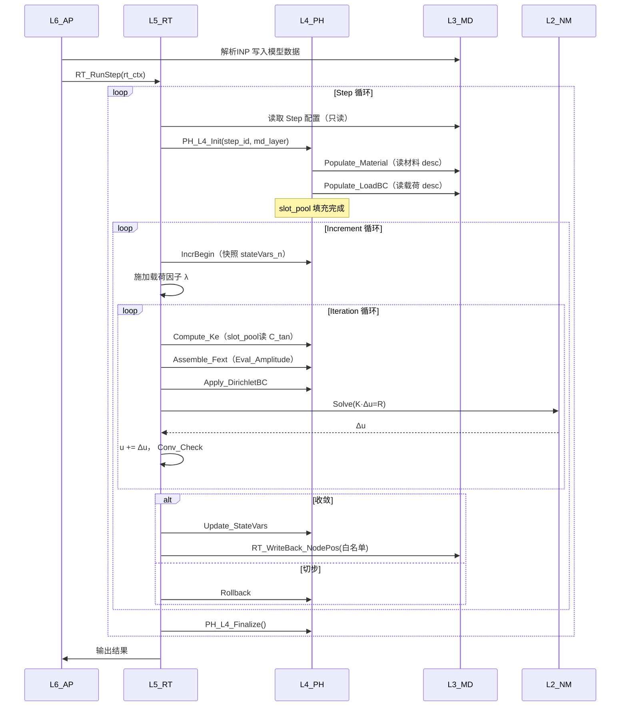

# UFC L3_MD / L4_PH / L5_RT 全链路算法拆解

> **文档位置**：`PLAN/06_实施指南/UFC_L3L4L5_全链路算法拆解_v1.0.md`
> **版本**：v1.1
> **创建日期**：2026-03-11
> **依据**：
> - `UFC_架构设计总纲_深度整合版_v5.0.md`（架构原则）
> - `04_实施路线与任务规划/历史参考_分层设计/L5_RT_运行时层详细设计.md`（三步状态机）
> - `L3_MD_L4_PH_联通契约与缺陷分析.md`（联通契约 v1.1）
> - `L4_PH_流程算法设计规则.md`（L4 规则 v1.2）
> **状态**：v1.0 完整版

---

## 目录

1. [整体架构图：三层温度模型](#一整体架构图三层温度模型)
2. [逻辑链：L6→L5→L4→L3 调用拓扑](#二逻辑链-l6l5l4l3-调用拓扑)
3. [数据链：四类 TYPE 与生命周期](#三数据链四类-type-与生命周期)
4. [计算链：全局→单元→积分点三级下钻](#四计算链全局单元积分点三级下钻)
5. [L3_MD：存储/解析/注册/管理详解](#五-l3_md存储解析注册管理详解)
6. [L4_PH：物理层计算算法详解](#六-l4_ph物理层计算算法详解)
7. [L5_RT：运行时三步状态机详解](#七-l5_rt运行时三步状态机详解)
8. [全链路时序图：从 Job 到 Gauss 积分点](#八全链路时序图从-job-到-gauss-积分点)
9. [数据流转图：Desc→Ctx→State→WriteBack](#九数据流转图descctstatewriteback)
10. [热路径保护算法](#十热路径保护算法)（三级隔离 / Ctx三段式 / ThreadSlab / WriteBack / AI专项 / 检查清单）
11. [当前实现缺陷与修复路径](#十一当前实现缺陷与修复路径)
12. [算法细节补全：各域关键公式](#十二算法细节补全各域关键公式)

---

## 一、整体架构图：三层温度模型

### 1.1 六层温度分级

```
┌─────────────────────────────────────────────────────────────────┐
│  层级     │ 温度 │ 生命周期        │ 写入约束              │
├─────────────────────────────────────────────────────────────────┤
│  L6_AP    │ 冷   │ Job 级          │ 配置命令，只写 L5 入口│
│  L5_RT    │ 热   │ Incr/Iter 级    │ WriteBack 白名单写 L3 │
│  L4_PH    │ 温   │ Step 级         │ 只写 L4 自身 State    │
│  L3_MD ⭐ │ 冷   │ Analysis 级     │ Write-Once（永驻）    │
│  L2_NM    │ 中   │ 调用级          │ 无状态，纯输入→输出   │
│  L1_IF    │ 零   │ Process 级      │ 常量，永不改变        │
└─────────────────────────────────────────────────────────────────┘
```

### 1.2 三层核心架构图（L3/L4/L5）

```
╔═══════════════════════════════════════════════════════════════════╗
║  L5_RT（热层）：运行时驱动，三步状态机                             ║
║                                                                   ║
║   RT_StepDriver ──→ RT_Assembler ──→ RT_Solver ──→ RT_WriteBack  ║
║        │                  │               │              │        ║
║        │           (组装 K/F)      (Newton-Raphson)  (白名单)     ║
║        ↓                  ↓               ↓              ↓        ║
║   Step/Incr/Iter      L4_PH调用        L2_NM求解      L3写回      ║
╠═══════════════════════════════════════════════════════════════════╣
║  L4_PH（温层）：物理算法，Step 级缓存                              ║
║                                                                   ║
║   PH_Material ──→ Compute_Ctan   (弹性/塑性/本构切线)             ║
║   PH_Element  ──→ Compute_Ke     (单元刚度 = ∫B^T·C·B dΩ)        ║
║   PH_LoadBC   ──→ Assemble_Fext  (外力组装)                       ║
║   PH_Constraint→ Assemble_Kaux  (约束增广)                        ║
║                                                                   ║
║   ← Step-Init Populate 从 L3 读配置（一次性冷路径）               ║
║   ← 热路径：slot_pool 缓存，零 L3 访问，零 ALLOCATE               ║
╠═══════════════════════════════════════════════════════════════════╣
║  L3_MD（冷层）：模型数据仓库，唯一真相来源                          ║
║                                                                   ║
║   MD_Material_Domain  desc_array(:)  → 材料参数（E,ν,ρ...）      ║
║   MD_Mesh_Domain      node/elem/...  → 几何拓扑                   ║
║   MD_Step_Domain      desc_array(:)  → 分析步配置                 ║
║   MD_LoadBC_Domain    desc_array(:)  → 载荷/边界定义              ║
║   MD_Constraint_Domain desc_array(:) → 约束方程                   ║
║   MD_Amplitude_Domain  desc_array(:) → 幅值时间函数               ║
╚═══════════════════════════════════════════════════════════════════╝

    单向依赖铁律：L5 读 L4/L3（只读） │ L4 读 L3（只读）
    唯一写回路径：L5_RT::RT_WriteBack_NodePos / RT_WriteBack_CurrentTime
```

### 1.3 全局容器层级

```
g_ufc_global (UFC_GlobalContainer 单例)
  ├── if_layer  (L1_IF)  ← 内存池管理器
  ├── nm_layer  (L2_NM)  ← 数值算法工具
  ├── md_layer  (L3_MD)⭐← 唯一真相来源
  │     ├── material%desc_array(1..n_mat)
  │     ├── mesh%node_coords / elem_conn
  │     ├── step%desc_array(1..n_step)
  │     ├── loadbc%desc_array(1..n_load)
  │     ├── constraint%desc_array(1..n_cons)
  │     └── amplitude%desc_array(1..n_amp)
  ├── ph_layer  (L4_PH)  ← Step 级物理缓存
  │     ├── material%slot_pool(1..1024)
  │     ├── element%ctx
  │     ├── loadbc%ctx
  │     └── constraint%ctx
  ├── rt_layer  (L5_RT)  ← 运行时状态
  │     ├── global_stiffness (CSR)
  │     ├── global_force(:)
  │     ├── displacement(:,:)
  │     └── convergence_state
  └── ap_layer  (L6_AP)  ← 作业配置
```

---

## 二、逻辑链：L6→L5→L4→L3 调用拓扑

### 2.1 顶层调用链

```
L6_AP::AP_RunJob(job_desc)
  │
  ├─ 解析 INP 文件 → 填充 g_ufc_global%md_layer（L3 建模阶段）
  │       AP_Inp_ParseFile
  │         ├─ MD_Material_Domain::Register(mat_desc)
  │         ├─ MD_Mesh_Domain::RegisterNodes/Elems
  │         ├─ MD_Step_Domain::Register(step_desc)
  │         ├─ MD_LoadBC_Domain::Register(load_desc)
  │         ├─ MD_Constraint_Domain::Register(cons_desc)
  │         └─ MD_Amplitude_Domain::Register(amp_desc)
  │
  └─ 启动求解 → L5_RT::RT_RunStep(rt_ctx)
        │
        ├─[Step 循环] step_id = 1 .. n_steps
        │     ├─ RT_Step_Init(step_id)
        │     │     └─ PH_L4_Init(step_id, md_layer)  ← L4 Populate
        │     │
        │     ├─[Increment 循环] 时间推进
        │     │     ├─ RT_Inc_Init(dt)
        │     │     │     └─ PH_Mat_IncrBegin()  ← 快照状态变量
        │     │     │
        │     │     ├─[Iteration 循环] Newton-Raphson
        │     │     │     ├─ RT_Asm_GlobalStiffness() → L4_Elem/Mat
        │     │     │     ├─ RT_Asm_GlobalForce()    → L4_LoadBC
        │     │     │     ├─ RT_ApplyBC()            → L4_Constraint
        │     │     │     ├─ L2_NM::Solve(K,F,Δu)
        │     │     │     └─ RT_Conv_Check()
        │     │     │
        │     │     └─ RT_Inc_End(converged)
        │     │           ├─(收敛) PH_Mat_Update_StateVars
        │     │           └─(切步) PH_Mat_Rollback
        │     │
        │     └─ RT_Step_End()
        │           └─ PH_L4_Finalize()
        │
        └─ RT_Output → 写结果文件
```

### 2.2 L4_PH 内部调用链（热路径）

```
RT_Asm_GlobalStiffness()
  │
  └─ loop elem_id = 1 .. n_elem        ← 单元循环（热路径）
       │
       ├─ 1. 几何准备（读 L3，但仅坐标只读）
       │     MD_PH_Geom_FillElemCtx_Idx(elem_id, geom_ctx)
       │       → 填 coords(8,3), dN_dxi(8,3), J(3,3), detJ
       │
       ├─ 2. B 矩阵计算（纯计算，零 ALLOCATE）
       │     ph_layer%element%Compute_BMatrix(bmat_arg)
       │       → PH_Elem_C3D8_BMatrix(xi, eta, zeta, coords, B)
       │         B(6×24) ← 应变-位移矩阵
       │
       ├─ 3. 本构切线模量（从 slot_pool 读，无 L3 访问）【目标态】
       │     mat_pt_idx = elem_to_mat_map(elem_id)
       │     ph_layer%material%Compute_Ctan(ctan_arg)
       │       → slot_pool(mat_pt_idx)%ctx%props(E, ν)
       │         C_tan(6×6) ← 弹性刚度矩阵 C = f(E,ν)
       │
       ├─ 4. 单元刚度（Gauss 积分，零 ALLOCATE）
       │     ph_layer%element%Compute_Ke(ke_arg)
       │       → Ke = Σ_gp [ B^T · C_tan · B · w_gp · detJ_gp ]
       │         Ke(24×24) for C3D8
       │
       └─ 5. 组装到全局（CSR 直接累加）
             RT_CSRMatrix_Add(K_global, dof_map(elem_id), Ke)
```

### 2.3 L3_MD 内部注册/查询链

```
【注册阶段（L6_AP 调用，INP 解析时）】
AP_Inp_ParseMaterial
  └─ MD_Material_Domain::Register(mat_idx, desc)
       ├─ desc_array(mat_idx) = mat_desc    ← Write-Once
       └─ registry%name_to_idx(name) = mat_idx

【查询阶段（L4_PH Populate 时，冷路径）】
PH_L4_Populate_Material(md_layer, step_idx)
  └─ loop i in step%material_ids(:)
       └─ MD_Mat_GetDesc_Idx(i, arg)        ← 读 L3
            └─ arg%desc = md_layer%material%desc_array(i)
```

---

## 三、数据链：四类 TYPE 与生命周期

### 3.1 四类 TYPE 在三层的分布

```
┌────────────────────────────────────────────────────────────────┐
│ TYPE 类别  │ 所在层  │ 生命周期    │ 读写约束            │
├────────────────────────────────────────────────────────────────┤
│ Desc 类    │ L3_MD  │ Analysis 级 │ Write-Once，全局只读 │
│ State 类   │ L3_MD  │ Analysis 级 │ 白名单字段可写回     │
│            │ L4_PH  │ Step 级     │ L4 可写（slot_pool） │
│            │ L5_RT  │ Incr 级     │ 每增量重置/更新      │
│ Algo 类    │ L3_MD  │ Analysis 级 │ Write-Once           │
│            │ L4_PH  │ Step 级     │ Init 时读 L3 设定    │
│ Ctx 类     │ L4_PH  │ Iter 级     │ 临时，GP 覆写        │
│            │ L5_RT  │ Iter 级     │ 热数据，ThreadSlab   │
└────────────────────────────────────────────────────────────────┘
```

### 3.2 材料域四类 TYPE 完整定义（示例）

```fortran
!─────────────────────────────────────────────────────
! L3_MD 侧：冷数据（Write-Once）
!─────────────────────────────────────────────────────
TYPE :: MD_Material_Desc
  CHARACTER(len=64) :: name = ""
  CHARACTER(len=32) :: materialType = "ELASTIC"  ! 字符串类型标识
  INTEGER(i4)       :: mat_idx = 0_i4
  REAL(wp)          :: young_modulus = 0.0_wp    ! E
  REAL(wp)          :: poisson_ratio = 0.0_wp    ! ν
  REAL(wp)          :: density       = 0.0_wp    ! ρ
  REAL(wp)          :: yield_stress  = 0.0_wp    ! σ_y（塑性）
  REAL(wp)          :: hardening_mod = 0.0_wp    ! H（线性硬化）
  INTEGER(i4)       :: n_props = 0_i4
  REAL(wp), ALLOCATABLE :: props(:)              ! 通用参数数组
END TYPE

!─────────────────────────────────────────────────────
! L4_PH 侧：温数据（Step 级 slot）
!─────────────────────────────────────────────────────
TYPE :: PH_Mat_Ctx            ! 槽位上下文（Populate 填充）
  INTEGER(i4) :: matId      = 0_i4          ! ← L3 材料索引
  INTEGER(i4) :: matModel   = PH_MAT_ELASTIC
  INTEGER(i4) :: nStressComp = 6_i4
  INTEGER(i4) :: nStateVars  = 0_i4
  REAL(wp)    :: temperature  = 0.0_wp
  REAL(wp)    :: tempIncrement= 0.0_wp
  REAL(wp), ALLOCATABLE :: strain(:)         ! 应变
  REAL(wp), ALLOCATABLE :: dStrain(:)        ! 应变增量
  REAL(wp), ALLOCATABLE :: strain_th(:)      ! 热应变
  REAL(wp), ALLOCATABLE :: props(:)          ! ← P0 修复后新增：E,ν等
END TYPE

TYPE :: PH_Mat_State          ! 槽位状态（迭代更新）
  REAL(wp), ALLOCATABLE :: stress(:)         ! Cauchy 应力 σ
  REAL(wp), ALLOCATABLE :: C_tan(:,:)        ! 切线模量矩阵 C
  REAL(wp), ALLOCATABLE :: stateVars(:)      ! 内变量（如 ε^p, κ）
  REAL(wp), ALLOCATABLE :: stateVars_n(:)    ! 上一增量收敛值（快照）
END TYPE

TYPE :: PH_Mat_Slot           ! 槽位（slot_pool 元素）
  TYPE(PH_Mat_Ctx)   :: ctx
  TYPE(PH_Mat_State) :: state
END TYPE

!─────────────────────────────────────────────────────
! L5_RT 侧：热数据（Iter 级全局解）
!─────────────────────────────────────────────────────
TYPE :: RT_GlobalState
  REAL(wp), ALLOCATABLE :: displacement(:,:)  ! u [nDof × nNode]
  REAL(wp), ALLOCATABLE :: velocity(:,:)      ! v
  REAL(wp), ALLOCATABLE :: acceleration(:,:)  ! a
  REAL(wp), ALLOCATABLE :: residual_force(:)  ! R = F_ext - F_int
  REAL(wp) :: residual_norm = 0.0_wp
  LOGICAL  :: converged     = .FALSE.
END TYPE
```

### 3.3 数据流向（按 TYPE 类别）

```
【Desc 流向】
INP 解析 → MD_Material_Desc 写入 L3
  ↓（Step-Init Populate，冷路径）
MD_Mat_GetDesc_Idx(mat_idx) → 填充 PH_Mat_Ctx%props
  ↓（热路径，slot_pool 读，零 L3 访问）
Compute_Ctan 读 sl%ctx%props → 计算 C_tan

【State 流向】
L4_PH::PH_Mat_Update_StateVars
  → stateVars_n = stateVars（IncrBegin 快照）
  → stateVars 在迭代内更新（本构积分）
  → L5_RT::RT_WriteBack_NodePos 写回 L3 节点坐标（唯一白名单）

【Ctx 流向（临时，迭代内覆写）】
RT_Iter_Loop 内：
  → MD_PH_Geom_FillElemCtx_Idx → 几何 ctx（按单元覆写）
  → PH_Element_Compute_BMatrix → B 矩阵 ctx
  → 迭代结束后 ctx 数组即弃
```

---

## 四、计算链：全局→单元→积分点三级下钻

### 4.1 三级下钻结构

```
全局级（L5_RT）
  K_global(nDof × nDof) = Σ_{e} A_e^T · Ke · A_e
  F_global(nDof)        = Σ_{e} A_e^T · fe
  R = F_ext - F_int   （残差向量）
        │
        ↓ 单元循环（L4_PH 响应）
单元级（L4_PH Element 域）
  Ke(nDof_e × nDof_e) = Σ_{gp} B^T · C_tan · B · w_gp · detJ_gp
  fe(nDof_e)          = Σ_{gp} B^T · σ · w_gp · detJ_gp
        │
        ↓ Gauss 积分循环（L4_PH Material 域）
积分点级（L4_PH Material 域）
  ε  = B(gp) · u_e               （应变计算）
  Δε = B(gp) · Δu_e              （应变增量）
  C_tan, σ = Constitutive(ε, Δε, stateVars)  （本构积分）
```

### 4.2 矩阵维度说明（C3D8 单元）

```
C3D8 单元参数：
  节点数 nNodes = 8
  每节点自由度 nDofPer = 3（ux, uy, uz）
  单元总自由度 nDof_e = 24
  Gauss 积分点数 nGauss = 8（2×2×2）
  应力分量数 nStress = 6（σxx, σyy, σzz, σxy, σyz, σxz）

矩阵维度：
  B 矩阵：6 × 24   （应变-位移矩阵）
  C_tan：  6 × 6    （本构切线矩阵）
  Ke：     24 × 24  （单元刚度矩阵）
  fe：     24       （单元内力向量）
  σ：      6        （Cauchy 应力向量）

公式：
  Ke = Σ_{gp=1}^{8} B(gp)^T · C_tan · B(gp) · w(gp) · |J(gp)|
  fe = Σ_{gp=1}^{8} B(gp)^T · σ(gp) · w(gp) · |J(gp)|
```

### 4.3 B 矩阵算法（C3D8，等参元）

```fortran
! B 矩阵：将节点位移映射为积分点应变
! ε = B · u_e，其中 B(6×24)
!
! 对第 I 个节点（局部坐标 ξ,η,ζ）：
!   B 的第 I 列块（6×3）= 
!   [ ∂N_I/∂x     0          0      ]
!   [    0      ∂N_I/∂y      0      ]
!   [    0         0      ∂N_I/∂z   ]
!   [ ∂N_I/∂y  ∂N_I/∂x      0      ]
!   [    0      ∂N_I/∂z   ∂N_I/∂y  ]
!   [ ∂N_I/∂z     0       ∂N_I/∂x  ]
!
! 其中 ∂N_I/∂x 通过 Jacobian 反变换：
!   [∂N_I/∂x]          [∂N_I/∂ξ ]
!   [∂N_I/∂y] = J^{-1}·[∂N_I/∂η ]
!   [∂N_I/∂z]          [∂N_I/∂ζ ]
!
! Jacobian 矩阵 J(3×3)：
!   J = Σ_I [∂N_I/∂ξ  ∂N_I/∂η  ∂N_I/∂ζ]^T · x_I^T
!   detJ = det(J)  （体积比，必须 > 0）
SUBROUTINE PH_Elem_C3D8_BMatrix(xi, eta, zeta, coords, B, detJ)
  REAL(wp), INTENT(IN)  :: xi, eta, zeta       ! 积分点局部坐标
  REAL(wp), INTENT(IN)  :: coords(8,3)         ! 节点全局坐标
  REAL(wp), INTENT(OUT) :: B(6,24)             ! 应变-位移矩阵
  REAL(wp), INTENT(OUT) :: detJ                ! Jacobian 行列式
  ! ... 形函数求导 → J → J^{-1} → B 矩阵填充
END SUBROUTINE
```

### 4.4 弹性本构切线模量算法（各向同性）

```fortran
! 各向同性线弹性本构矩阵 C（Voigt 记法，6×6）
! 理论链：广义胡克定律 σ = C : ε
!
! Lame 参数：
!   λ = E·ν / ((1+ν)(1-2ν))
!   μ = E / (2(1+ν))  （剪切模量）
!
! C 矩阵（上三角对称）：
!   C(1,1)=C(2,2)=C(3,3) = λ + 2μ
!   C(1,2)=C(1,3)=C(2,3) = λ
!   C(4,4)=C(5,5)=C(6,6) = μ
!   其余 = 0
SUBROUTINE PH_Elem_C3D8_ConstMatrix(E_young, nu, C)
  REAL(wp), INTENT(IN)  :: E_young, nu
  REAL(wp), INTENT(OUT) :: C(6,6)
  REAL(wp) :: lam, mu
  lam = E_young * nu / ((1.0_wp + nu) * (1.0_wp - 2.0_wp * nu))
  mu  = E_young / (2.0_wp * (1.0_wp + nu))
  C = 0.0_wp
  C(1,1)=lam+2*mu; C(2,2)=lam+2*mu; C(3,3)=lam+2*mu
  C(1,2)=lam; C(1,3)=lam; C(2,3)=lam
  C(2,1)=lam; C(3,1)=lam; C(3,2)=lam
  C(4,4)=mu;  C(5,5)=mu;  C(6,6)=mu
END SUBROUTINE
```

---

## 五、L3_MD：存储/解析/注册/管理详解

### 5.1 L3_MD 的职责定位

```
L3_MD = 有限元模型的「数据仓库」

  职责 1：存储（Storage）
    - 保存 INP 解析后的所有模型定义数据
    - 域级容器：Material/Mesh/Step/LoadBC/Constraint/Amplitude...
    - 数据不可变（Write-Once）

  职责 2：解析（Parsing）
    - 通过 AP_Inp_* 解析器将 INP 文本转为结构化数据
    - 注册到对应域的 desc_array

  职责 3：注册（Registration）
    - 每个域维护 registry（name→idx 映射表）
    - 支持按名字或索引查询

  职责 4：管理（Management）
    - 通过 GetDesc_Idx 提供只读访问接口
    - 通过 WriteBack 白名单提供有限写回接口
```

### 5.2 域级容器标准结构

```fortran
! L3_MD 标准域级容器（以 Material 为例）
TYPE :: MD_Material_Domain
  !── 四类 TYPE 数组（核心数据）──
  TYPE(MD_Material_Desc),  ALLOCATABLE :: desc_array(:)  ! 冷数据，Write-Once
  TYPE(MD_Material_State), ALLOCATABLE :: state_array(:) ! 温数据，有限可写
  TYPE(MD_Material_Algo),  ALLOCATABLE :: algo_array(:)  ! 算法参数，Write-Once

  !── 注册表 ──
  INTEGER(i4) :: count = 0_i4
  INTEGER(i4), ALLOCATABLE :: name_to_idx(:)             ! 快速查找

  !── 标准接口 ──
CONTAINS
  PROCEDURE :: Register     => Material_Register        ! 注册新材料
  PROCEDURE :: GetDesc      => Material_GetDesc         ! 按索引只读
  PROCEDURE :: GetDesc_Idx  => Material_GetDesc_Idx     ! （同上，_Idx 风格）
  PROCEDURE :: FindByName   => Material_FindByName      ! 按名字查索引
  PROCEDURE :: WriteBack    => Material_WriteBackState  ! 白名单写回
  PROCEDURE :: Init         => Material_Domain_Init
  PROCEDURE :: Finalize     => Material_Domain_Finalize
END TYPE
```

### 5.3 INP 解析→注册完整流程

```
【INPUT FILE 格式（ABAQUS 兼容）】
*MATERIAL, NAME=Steel
*ELASTIC
  210000.0, 0.3
*DENSITY
  7.85e-6

【解析→注册流程】
AP_Inp_ParseMaterial(line, md_layer, status)
  │
  ├─ 1. 解析材料类型标识（ELASTIC / PLASTIC / HYPERELASTIC...）
  │     ap_mat_type = AP_Parse_MaterialType(keyword)
  │
  ├─ 2. 填充 MD_Material_Desc
  │     desc%name         = "Steel"
  │     desc%materialType = "ELASTIC"
  │     desc%young_modulus = 210000.0_wp
  │     desc%poisson_ratio = 0.3_wp
  │     desc%density       = 7.85e-6_wp
  │     ALLOCATE(desc%props(2))
  │     desc%props(1) = 210000.0_wp   ! E
  │     desc%props(2) = 0.3_wp        ! ν
  │
  └─ 3. 注册到 L3
        mat_idx = md_layer%material%count + 1
        md_layer%material%desc_array(mat_idx) = desc   ! Write-Once
        md_layer%material%count = mat_idx
        md_layer%material%registry%name_to_idx("Steel") = mat_idx
```

### 5.4 L3 只读访问接口规范

```fortran
! 标准只读查询接口（L4_PH Populate 时调用）
SUBROUTINE MD_Mat_GetDesc_Idx(mat_idx, arg, status)
  INTEGER(i4),             INTENT(IN)  :: mat_idx      ! 索引（传索引，非结构体）
  TYPE(MD_Mat_GetDesc_Arg),INTENT(OUT) :: arg           ! Arg 封装
  TYPE(ErrorStatusType),   INTENT(OUT) :: status

  ! 边界检查
  IF (mat_idx < 1 .OR. mat_idx > md_layer%material%count) THEN
    status = ERR_INDEX_OUT_OF_RANGE; RETURN
  END IF

  ! 返回只读引用（ASSOCIATE 语义）
  ASSOCIATE(d => g_ufc_global%md_layer%material%desc_array(mat_idx))
    arg%desc = d   ! 只读拷贝
  END ASSOCIATE
END SUBROUTINE

! Arg 类型定义
TYPE :: MD_Mat_GetDesc_Arg
  TYPE(MD_Material_Desc) :: desc   ! 返回的描述数据（只读拷贝）
END TYPE
```

### 5.5 WriteBack 白名单机制

```fortran
! L3_MD 仅允许极少量字段通过白名单写回
! 白名单字段：
!   ✅ mesh%node_coords（节点坐标，大变形时更新）
!   ✅ step%current_time（当前时间戳）
!   ❌ material%desc%young_modulus（禁止修改）
!   ❌ mesh%elem_state%Ke（禁止，Ke 是 L4/L5 临时数据）

SUBROUTINE RT_WriteBack_NodePos(node_idx, new_coord, status)
  ! 仅 L5_RT 层可调用
  ! 1. 白名单检查
  IF (.NOT. IsWhitelisted("node_coordinate")) RETURN
  ! 2. 审计日志（记录 old→new）
  CALL LogAudit("NODE_POS", node_idx, old_coord, new_coord)
  ! 3. 执行写回
  g_ufc_global%md_layer%mesh%node_coords(node_idx,:) = new_coord
END SUBROUTINE
```

### 5.6 各域注册接口一览表

| 域 | 注册接口 | 查询接口 | desc 关键字段 |
|----|---------|---------|-------------|
| **Material** | `MD_Material_Register` | `MD_Mat_GetDesc_Idx` | E, ν, ρ, props(:) |
| **Mesh** | `MD_Mesh_AddNode` / `AddElem` | `MD_Mesh_GetNodeCoord` | coords, connectivity |
| **Step** | `MD_Step_Register` | `MD_Step_GetDesc_Idx` | step_type, time, dt, load_ids |
| **LoadBC** | `MD_LoadBC_Register` | `MD_LoadBC_GetDesc_Idx` | load_type, magnitude, amp_ref |
| **Constraint** | `MD_Constraint_Register` | `MD_Constraint_GetDesc_Idx` | mpc_type, dof_pairs, coeffs |
| **Amplitude** | `MD_Amplitude_Register` | `MD_Amplitude_GetDesc_Idx` | time_vals(:), amp_vals(:) |

---

## 六、L4_PH：物理层计算算法详解

### 6.1 L4_PH 的职责定位

```
L4_PH = 有限元计算的「物理内核」

  职责 1：Step-Init Populate（冷路径）
    - 从 L3 读取本分析步所需的材料/载荷/约束配置
    - 填充 slot_pool（step 级缓存，热路径直读）

  职责 2：单元刚度计算（热路径）
    - PH_Element_Domain: Compute_BMatrix / Compute_Ke / Compute_Fe
    - 从 slot_pool 读 C_tan，零 L3 访问

  职责 3：本构积分（热路径）
    - PH_Mat_Domain: Compute_Ctan / Update_StateVars
    - 弹性：C = C(E,ν)；塑性：Return-Mapping 算法

  职责 4：载荷/边界施加（热路径）
    - PH_LoadBC_Domain: Assemble_Fext / Apply_DirichletBC
    - PH_Constraint_Domain: Assemble_KauxFaux
```

### 6.2 Init 顺序（依赖关系图）

```
PH_L4_Init(stepId, md_layer, status)
  │
  │ 依赖关系：① → ② → ③ → ④ → ⑤ → ⑥ → ⑦
  │
  ├─ ① Material%Init   → Populate_Material
  │       MD_Mat_GetDesc_Idx × n_mat
  │       slot_pool(k)%ctx%matId    = L3 mat_idx
  │       slot_pool(k)%ctx%matModel = PH_MapL3MatTypeToL4(type_str)
  │       slot_pool(k)%ctx%props(:) = desc%props(:)   ← 复制 E,ν等
  │       ALLOCATE slot_pool(k)%state%C_tan(6,6)      ← 冷路径 ALLOCATE
  │       预算 C_tan（弹性 step）
  │
  ├─ ② Element%Init    → Populate_Element
  │       注册 elem_to_mat_map(elem_id) = mat_idx
  │       （坐标在迭代时按需读 L3，非全量预加载）
  │
  ├─ ③ LoadBC%Init     → Populate_LoadBC
  │       loop i in step%load_ids
  │         MD_LoadBC_GetDesc_Idx(i) → ctx%activeLoadIds(k) = i
  │
  ├─ ④ Constraint%Init → Populate_Constraint
  │       loop i in step%constraint_ids
  │         MD_Constraint_GetDesc_Idx(i) → ctx%nActiveMPC++
  │
  ├─ ⑤ Contact%Init
  ├─ ⑥ Coupling%Init
  └─ ⑦ Bridge%Init

Finalize 严格逆序：⑦→⑥→⑤→④→③→②→①
```

### 6.3 热路径材料本构算法（弹性）

```fortran
! 弹性本构（已 Populate，热路径零 L3 访问）
SUBROUTINE PH_Mat_Compute_Ctan(this, arg)
  CLASS(PH_Mat_Domain), INTENT(INOUT) :: this
  TYPE(PH_Mat_Compute_Ctan_Arg), INTENT(INOUT) :: arg

  ASSOCIATE(sl => this%slot_pool(arg%mat_pt_idx))
    SELECT CASE(sl%ctx%matModel)

    CASE(PH_MAT_ELASTIC)   ! 线弹性
      !─────────────────────────────────────────────────
      ! 理论链：广义胡克定律 σ = C : ε
      ! 数据链：从 sl%ctx%props 读 E,ν（热路径零 L3 访问）
      ! 计算链：Lame 参数 → 组装 C(6×6)
      !─────────────────────────────────────────────────
      E_young = sl%ctx%props(1)    ! 无 L3 访问！
      nu      = sl%ctx%props(2)

      lam = E_young * nu / ((1.0_wp+nu)*(1.0_wp-2.0_wp*nu))
      mu  = E_young / (2.0_wp * (1.0_wp + nu))

      ! 填充 C_tan（热路径，sl%state%C_tan 已在 Populate 时 ALLOCATE）
      sl%state%C_tan = 0.0_wp
      sl%state%C_tan(1,1) = lam + 2.0_wp*mu
      sl%state%C_tan(2,2) = lam + 2.0_wp*mu
      sl%state%C_tan(3,3) = lam + 2.0_wp*mu
      sl%state%C_tan(1,2) = lam; sl%state%C_tan(2,1) = lam
      sl%state%C_tan(1,3) = lam; sl%state%C_tan(3,1) = lam
      sl%state%C_tan(2,3) = lam; sl%state%C_tan(3,2) = lam
      sl%state%C_tan(4,4) = mu
      sl%state%C_tan(5,5) = mu
      sl%state%C_tan(6,6) = mu

    CASE(PH_MAT_ELASTO_PLASTIC)   ! J2 弹塑性
      ! 1. 弹性预测（Trial Stress）
      !    σ_tr = σ_n + C : Δε
      ! 2. 屈服判断
      !    f(σ_tr) = σ_eq(σ_tr) - σ_y(ε^p_n)
      !    若 f ≤ 0: 弹性步，C_tan = C_elastic
      !    若 f > 0: 塑性步，Return-Mapping
      ! 3. Return-Mapping（径向返回）
      !    Δγ 由一致性条件：σ_eq(σ_tr) - 3μΔγ - σ_y(ε^p_n + Δγ) = 0
      !    Newton 法求解 Δγ
      ! 4. 更新应力：σ = σ_tr - 2μΔγ·n（n = 偏应力方向）
      ! 5. 更新内变量：ε^p += Δγ
      ! 6. 一致切线模量（Consistent Tangent）
      !    C_ep = C - (2μ)² / (H+3μ) · (n⊗n)
      CALL PH_Mat_ReturnMapping_J2(sl, arg, status)

    CASE DEFAULT
      ! 其他本构：Hyperelastic / Viscoelastic / UMAT...
    END SELECT
  END ASSOCIATE
END SUBROUTINE
```

### 6.4 J2 塑性 Return-Mapping 算法细节

```fortran
! J2 各向同性强化弹塑性 Return-Mapping
! 理论链：Von Mises 屈服准则 + 线性等向强化
!   f = σ_eq - σ_y(ε^p) = 0
!   σ_eq = √(3/2 · s:s)，s = σ - 1/3·tr(σ)·I（偏应力）
!   σ_y(ε^p) = σ_y0 + H·ε^p
SUBROUTINE PH_Mat_ReturnMapping_J2(sl, arg, status)
  ! 1. 弹性预测：试应力
  sigma_tr = sl%state%stress + MATMUL(C_elastic, arg%dStrain)
  s_tr     = Deviatoric(sigma_tr)         ! 偏应力
  sigma_eq_tr = EffStress(s_tr)           ! 等效应力

  ! 2. 屈服函数
  ep_n     = sl%state%stateVars(IDX_PEEQ) ! 上一步等效塑性应变
  sigma_y  = sigma_y0 + H * ep_n

  IF (sigma_eq_tr <= sigma_y) THEN
    ! 弹性步：维持试应力，C_tan = C_elastic
    sl%state%stress = sigma_tr
    C_tan = C_elastic
  ELSE
    ! 塑性步：Newton 求解 Δγ
    !   phi(Δγ) = σ_eq_tr - 3μΔγ - σ_y0 - H(ep_n + Δγ) = 0
    dGamma = 0.0_wp
    DO iter = 1, max_newton
      phi    = sigma_eq_tr - 3.0_wp*mu*dGamma - sigma_y0 - H*(ep_n+dGamma)
      dphi   = -3.0_wp*mu - H
      dGamma = dGamma - phi/dphi
      IF (ABS(phi) < tol) EXIT
    END DO

    ! 更新应力
    n_dir = s_tr / (sigma_eq_tr * SQRT(2.0_wp/3.0_wp))  ! 偏应力方向
    sl%state%stress = sigma_tr - 2.0_wp*mu*dGamma * n_dir

    ! 更新内变量
    sl%state%stateVars(IDX_PEEQ) = ep_n + dGamma

    ! 一致切线模量（Consistent Tangent）
    !   C_ep = C_e - (2μ)^2/(H+3μ) · beta · n⊗n
    !          - (2μ)^2·(1-beta)/sigma_eq_tr · IIdev
    !   beta = 1 - 3μΔγ/sigma_eq_tr
    beta  = 1.0_wp - 3.0_wp*mu*dGamma / sigma_eq_tr
    theta = 1.0_wp / (1.0_wp + H/(3.0_wp*mu))
    C_tan = C_elastic &
          - (2.0_wp*mu)**2 * (theta/sigma_eq_tr - beta*(1.0_wp-theta)/(3.0_wp*mu)) &
            * OuterProduct(n_dir, n_dir) &
          - 2.0_wp*mu*beta * IIdev
  END IF
END SUBROUTINE
```

### 6.5 LoadBC Assemble_Fext 算法

```fortran
! 外力向量组装
! 理论链：等效节点力 = ∫_Γ N^T · t dΓ（面力）
!                     + Σ_node N_i · F_i（集中力）
SUBROUTINE PH_LoadBC_Assemble_Fext(this, arg)
  ASSOCIATE(ctx => this%ctx)
    DO k = 1, ctx%nActiveLoads
      load_idx = ctx%activeLoadIds(k)
      load_type = ctx%loadTypes(k)

      ! 从幅值函数获取时间因子
      CALL this%Eval_Amplitude(amp_arg)   ! ampFactor = f(current_time)

      SELECT CASE(load_type)
      CASE(LOAD_TYPE_CONCENTRATED)   ! 集中力
        ! F_ext(dof) += magnitude * ampFactor
        arg%F_ext(ctx%loadDOF(k)) = arg%F_ext(ctx%loadDOF(k)) &
                                   + ctx%loadMagnitude(k) * amp_arg%amp_factor

      CASE(LOAD_TYPE_PRESSURE)       ! 面压力
        ! 面积分：f_e = -p * ∫_Γ N^T dΓ（法向内压为负）
        CALL PH_LoadBC_PressureIntegral(load_idx, p=ctx%loadMagnitude(k), &
                                        factor=amp_arg%amp_factor, &
                                        f_face=face_force)
        ! 组装到全局
        CALL RT_CSRVector_Scatter(arg%F_ext, face_dof_map, face_force)

      CASE(LOAD_TYPE_GRAVITY)        ! 体力（重力）
        ! f_e = ρg * ∫ N^T dΩ（质量矩阵×加速度）
        CALL PH_LoadBC_BodyForceIntegral(elem_id, g_vec, factor, f_body)
        CALL RT_CSRVector_Scatter(arg%F_ext, elem_dof_map(elem_id), f_body)
      END SELECT
    END DO
  END ASSOCIATE
END SUBROUTINE

! 幅值函数插值
SUBROUTINE PH_LoadBC_Eval_Amplitude(this, arg)
  ! 时间插值（分段线性）
  !   t ∈ [t_k, t_{k+1}]: amp = amp_k + (t-t_k)/(t_{k+1}-t_k) * (amp_{k+1}-amp_k)
  IF (ctx%ampRef <= 0) THEN
    arg%amp_factor = 1.0_wp   ! 无幅值函数：因子=1
  ELSE
    CALL MD_Amplitude_Eval_Idx(ctx%ampRef, arg%current_time, arg%amp_factor, status)
    ! MD_Amplitude_Eval_Idx 从 L3 desc_array 读插值点（仅 Populate 时缓存，热路径按需）
  END IF
END SUBROUTINE
```

### 6.6 Constraint Assemble_KauxFaux 算法

```fortran
! 约束增广（MPC：多点约束）
! 理论链：拉格朗日乘子法 + 罚函数法
!   min f(u) s.t. C·u = d
!   → [K  C^T] [u]   [F]
!      [C  0 ] [λ] = [d]
!
! UFC 优先：自由度消除法（Free-DOF Elimination）
SUBROUTINE PH_Constraint_Assemble_KauxFaux(this, arg)
  ASSOCIATE(ctx => this%ctx)
    DO k = 1, ctx%nActiveMPC
      SELECT CASE(ctx%mpcType(k))

      CASE(MPC_TYPE_EQUATION)   ! 线性 MPC：Σ a_i·u_i = b
        ! 选主 DOF（系数绝对值最大者）消元
        lead_dof  = FindLeadDOF(ctx%mpcCoeffs(k,:))
        depend_dofs = GetDependDOFs(k, lead_dof)
        ! 在 CSR 上执行消元（修改 K 和 F）
        CALL PH_Constraint_Eliminate_MPC(arg%K_csr, arg%F_vec, &
                                          lead_dof, depend_dofs, &
                                          ctx%mpcCoeffs(k,:), &
                                          ctx%mpcRHS(k))

      CASE(MPC_TYPE_RIGID_BODY)  ! 刚体约束
        ! 6 DOF（3平移+3转动）消元，写入运动方程
        CALL PH_Constraint_RigidBody_CSR(arg, ctx%rigidBodyDef(k))

      CASE(MPC_TYPE_TIE)         ! Tie 接触（节点耦合）
        CALL PH_Constraint_Tie_CSR(arg, ctx%tiePairs(k,:))
      END SELECT
    END DO
  END ASSOCIATE
END SUBROUTINE
```

### 6.7 State 推进三阶段协议（IncrBegin / Update / Rollback）

```fortran
!──────────────────────────────────────────────────────
! 阶段 1: IncrBegin（增量开始，快照）
!──────────────────────────────────────────────────────
SUBROUTINE PH_Mat_IncrBegin(this, arg)
  DO k = 1, this%pool_count
    ASSOCIATE(sl => this%slot_pool(k))
      ! 保存已收敛的内变量（快照，不重分配）
      sl%state%stateVars_n = sl%state%stateVars  ! ← 仅赋值，禁止 ALLOCATE
    END ASSOCIATE
  END DO
END SUBROUTINE

!──────────────────────────────────────────────────────
! 阶段 2: Update_StateVars（每次迭代收敛后提交）
!──────────────────────────────────────────────────────
SUBROUTINE PH_Mat_Update_StateVars(this, arg)
  ! stateVars 已在 Compute_Ctan 内更新（试算值）
  ! 收敛后：保持 stateVars（不需要额外操作）
  ! 也可在此做后处理：PEEQ = max_GP_PEEQ(elem)
END SUBROUTINE

!──────────────────────────────────────────────────────
! 阶段 3: Rollback（切步/不收敛，恢复）
!──────────────────────────────────────────────────────
SUBROUTINE PH_Mat_Rollback(this, arg)
  DO k = 1, this%pool_count
    ASSOCIATE(sl => this%slot_pool(k))
      ! 恢复到 IncrBegin 快照（不重分配）
      sl%state%stateVars = sl%state%stateVars_n  ! ← 仅赋值
    END ASSOCIATE
  END DO
END SUBROUTINE
```

---

## 七、L5_RT：运行时三步状态机详解

### 7.1 三步嵌套循环全貌

```
┌──────────────────────────────────────────────────────────────┐
│  STEP 级（RT_StepDriver）                                     │
│    RT_Step_Init(step_id)                                     │
│      ├─ 从 L3 读取 Step 配置（step_type, time, dt, BC...）   │
│      └─ PH_L4_Init(step_id, md_layer)  ← L4 Populate        │
│                                                              │
│  ┌──────────────────────────────────────────────────────┐   │
│  │  INCREMENT 级（RT_IncManager）                        │   │
│  │    RT_Inc_Init(dt)                                    │   │
│  │      ├─ PH_Mat_IncrBegin()  ← 快照 stateVars_n  │   │
│  │      └─ ApplyLoadFactor(λ = t/T) ← 当前载荷增量       │   │
│  │                                                      │   │
│  │  ┌──────────────────────────────────────────────┐   │   │
│  │  │  ITERATION 级（RT_IterSolver）Newton-Raphson  │   │   │
│  │  │    1. RT_Asm_GlobalStiffness() → K_global    │   │   │
│  │  │    2. RT_Asm_GlobalForce()     → F_ext       │   │   │
│  │  │    3. RT_ApplyBC()  ← 约束消除（CSR）        │   │   │
│  │  │    4. L2::Solve(K, R, Δu)  R=F_ext-F_int    │   │   │
│  │  │    5. u += Δu               更新位移场       │   │   │
│  │  │    6. Conv_Check(‖R‖,‖Δu‖)  收敛判断        │   │   │
│  │  └──────────────────────────────────────────────┘   │   │
│  │                                                      │   │
│  │    RT_Inc_End(converged)                             │   │
│  │      ├─(收敛) PH_Mat_Update_StateVars          │   │
│  │      │        RT_WriteBack_NodePos（大变形时）       │   │
│  │      │        自动切步：dt_new = dt * factor(nIter) │   │
│  │      └─(切步) PH_Mat_Rollback                  │   │
│  │               dt_new = dt * 0.5                     │   │
│  └──────────────────────────────────────────────────────┘   │
│                                                              │
│    RT_Step_End()                                             │
│      └─ PH_L4_Finalize() + 输出结果                          │
└──────────────────────────────────────────────────────────────┘
```

### 7.2 收敛判断三准则

```fortran
! 收敛判断（三准则，任一不满足则继续迭代）
FUNCTION RT_CheckConvergence(state, ctrl) RESULT(converged)
  ! 准则 1：力残差（主准则）
  !   ‖R‖ / ‖F_ref‖ < ε_R
  !   F_ref = max(‖F_ext‖, ‖F_int‖)（防止零外力时分母为零）
  F_ref = MAX(NORM2(F_ext), NORM2(F_int), F_floor)
  res_norm = NORM2(state%residual_force) / F_ref

  ! 准则 2：位移增量范数
  !   ‖Δu‖ / ‖u_ref‖ < ε_D
  u_ref = MAX(NORM2(state%displacement), u_floor)
  disp_norm = NORM2(delta_u) / u_ref

  ! 准则 3：能量误差（最严格）
  !   |ΔW| = |Δu^T · R| / (Δu_1^T · R_1) < ε_E
  energy_err = ABS(DOT_PRODUCT(delta_u, state%residual_force)) / energy_ref

  converged = (res_norm  < ctrl%tolerance_force)      .AND. &
              (disp_norm < ctrl%tolerance_displacement) .AND. &
              (energy_err< ctrl%tolerance_energy)
END FUNCTION
```

### 7.3 自动时间步长控制算法

```fortran
! ATS（Automatic Time Stepping）算法
! 基于上一增量的迭代次数估计最优步长
SUBROUTINE RT_AdjustTimeStep(n_iter, dt_current, dt_new, ctrl)
  ! 策略：
  !   n_iter ≤ 4  → 增大步长 (dt × 1.5，不超过 dt_max)
  !   n_iter ≤ 8  → 保持步长
  !   n_iter ≤ 16 → 减小步长 (dt × 0.75)
  !   不收敛      → 切步 (dt × 0.5，不低于 dt_min)
  SELECT CASE(n_iter)
  CASE(:4)
    dt_new = MIN(dt_current * 1.5_wp, ctrl%max_dt)
  CASE(5:8)
    dt_new = dt_current
  CASE(9:16)
    dt_new = MAX(dt_current * 0.75_wp, ctrl%min_dt)
  CASE DEFAULT
    dt_new = MAX(dt_current * 0.5_wp, ctrl%min_dt)
  END SELECT
END SUBROUTINE
```

### 7.4 全局刚度矩阵组装（CSR 格式）

```fortran
! 全局刚度矩阵组装（CSR，热路径）
SUBROUTINE RT_Asm_GlobalStiffness(rt_ctx, status)
  ! Step 1: 清零全局矩阵（仅 values 数组归零，不重分配结构）
  rt_ctx%global_stiffness%values = 0.0_wp   ! ← 零 ALLOCATE

  ! Step 2: 单元循环
  DO elem_id = 1, n_elem
    ! 调用 L4: 获取单元刚度 Ke(24×24)
    ke_arg%elem_idx    = elem_id
    ke_arg%mat_pt_idx  = elem_to_mat_map(elem_id)
    ke_arg%l3_elem_idx = elem_id
    CALL ph_layer%element%Compute_Ke(ke_arg)
    Ke = ke_arg%Ke   ! 24×24

    ! DOF 映射：elem 节点 → 全局方程编号
    CALL GetElemDOFMap(elem_id, dof_map)   ! dof_map(24)

    ! CSR 直接累加（无锁，顺序访问）
    DO i = 1, 24
      DO j = 1, 24
        IF (Ke(i,j) /= 0.0_wp) THEN
          CALL rt_ctx%global_stiffness%Add(dof_map(i), dof_map(j), Ke(i,j))
        END IF
      END DO
    END DO
  END DO
END SUBROUTINE

! CSR 矩阵结构（Compressed Sparse Row）
TYPE :: RT_CSRMatrix
  INTEGER(i4), ALLOCATABLE :: row_ptr(:)   ! 行指针 (nRow+1)
  INTEGER(i4), ALLOCATABLE :: col_ind(:)   ! 列索引 (nnz)
  REAL(wp),    ALLOCATABLE :: values(:)    ! 非零值 (nnz)
  INTEGER(i4) :: n_rows = 0_i4
  INTEGER(i4) :: n_cols = 0_i4
  INTEGER(i4) :: nnz    = 0_i4
CONTAINS
  PROCEDURE :: Add       => CSR_AddValue   ! 热路径：直接累加
  PROCEDURE :: Zero      => CSR_ZeroValues ! 热路径：仅归零 values
  PROCEDURE :: BuildSparsity => CSR_Build  ! 冷路径：建立稀疏结构
END TYPE
```

### 7.5 WriteBack 白名单完整规范

```fortran
! WriteBack 合法目标枚举（完整白名单）
INTEGER(i4), PARAMETER ::
  WB_NODE_COORD  = 1_i4,  & ! 节点坐标（大变形更新）
  WB_STEP_TIME   = 2_i4,  & ! 步时间戳
  WB_STEP_INC    = 3_i4,  & ! 增量步计数
  WB_GP_STRESS   = 4_i4,  & ! 积分点应力（仅 Output 时读，非实时写）
  WB_GP_STRAIN   = 5_i4     ! 积分点应变

! 严格禁止的 WriteBack 目标
!   ❌ material%desc（材料参数）
!   ❌ mesh%elem_state%Ke（单元刚度，L4 临时数据）
!   ❌ step%load_ids（载荷配置）
!   ❌ 任何 L4_PH 内部 slot_pool 成员

! 白名单检查 + 审计日志
SUBROUTINE RT_WriteBack_NodePos(node_idx, new_coord, status)
  IF (.NOT. wb_ctx%IsAllowed(WB_NODE_COORD, "node_coordinate")) THEN
    status = STATUS_WRITEBACK_DENIED; RETURN
  END IF
  old_coord = g_ufc_global%md_layer%mesh%GetNodeCoord(node_idx)
  CALL wb_ctx%LogAudit("NODE_POS", node_idx, old_coord, new_coord)  ! JSONL
  CALL g_ufc_global%md_layer%mesh%UpdateNodeCoord(node_idx, new_coord, status)
  wb_ctx%global_version = wb_ctx%global_version + 1_i4
END SUBROUTINE
```

---

## 八、全链路时序图：从 Job 到 Gauss 积分点

### 8.1 顶层序列图（静力隐式分析）

```
时序第一层：Job 级
┌──────────────────────────────────────────────────────────────┐
│  L6_AP       L5_RT            L4_PH            L3_MD   L2_NM │
│    |            |                |                |        |   │
│  RunJob        |                |                |        |   │
│    ├──INP解析────────────────────→写 L3           |        |   │
│    |            |                |                |        |   │
│    └─RT_RunStep→|                |                |        |   │
└──────────────────────────────────────────────────────────────┘

时序第二层：Step 级
    |            |
    |     Step_Init(step_id)
    |            ├──读 L3 Step 配置──────────────→ desc
    |            └──L4_Init(──────────────────────>—─────────
    |                         |  Populate_Material──→ 读材料 desc
    |                         |  Populate_LoadBC───→ 读载荷 desc
    |                         |  Populate_Constraint→ 读约束 desc
    |                         |  (冷路径 ALLOCATE ✓)
    |                         |

时序第三层：Increment 级
    |            |
    |       Inc_Init(dt)
    |            ├──────────────────────>───────────────
    |            |  ApplyLoadFactor    |  IncrBegin()
    |            |                    |  stateVars_n = stateVars
    |            |
    |     [Iteration Loop]
    |            |
时序第四层：Iteration 级（热路径）
    |            |
    |     Asm_K_global
    |            ├──────────────────────>单元循环
    |            |                    |  Compute_BMatrix
    |            |                    |  Compute_Ctan(slot_pool)
    |            |                    |  Compute_Ke = ∫B^T·C·B dV
    |            |
    |     Asm_F_global
    |            ├──────────────────────>载荷循环
    |            |                    |  Assemble_Fext
    |            |                    |  Eval_Amplitude
    |            |
    |     ApplyBC
    |            ├──────────────────────>约束施加
    |            |                    |  Assemble_KauxFaux
    |            |                    |  Apply_DirichletBC
    |            |
    |     L2::Solve(K,R)────────────────────────────>求解 KΔu=R
    |            |                                         |
    |     Δu ←───────────────────────────────────────────────
    |            |
    |     Conv_Check
    |            ├─(收敛)───────────────────>提交 stateVars
    |            |                    |  RT_WriteBack_NodePos→写 L3
    |            └─(切步)───────────────────>Rollback stateVars
```

### 8.2 Mermaid 序列图



---

## 九、数据流转图：Desc→Ctx→State→WriteBack

### 9.1 材料参数完整流转链

```
流转阶段 1：INP 解析 → L3 Desc
┌──────────────────────────────────────────────────────┐
│ INP: *MATERIAL, NAME=Steel                         │
│      *ELASTIC                                      │
│       210000.0, 0.3                                │
│            ↓                                       │
│ AP_Inp_ParseMaterial()                             │
│            ↓                                       │
│ MD_Material_Desc{                                  │
│   name="Steel", materialType="ELASTIC"             │
│   young_modulus=210000.0, poisson_ratio=0.3        │
│   props=[210000.0, 0.3]                            │
│ } → desc_array(1) [写入 L3, Write-Once]          │
└──────────────────────────────────────────────────────┘
                    ↓
流转阶段 2：Step-Init Populate → L4 Ctx
┌──────────────────────────────────────────────────────┐
│ PH_L4_Populate_Material(md_layer, step_idx)       │
│   ↳ MD_Mat_GetDesc_Idx(1, arg)    ← 读 L3(冷路径)  │
│   ↳ PH_MapL3MatTypeToL4("ELASTIC") = PH_MAT_ELASTIC │
│                                                    │
│ slot_pool(1)%ctx{                                  │
│   matId=1, matModel=PH_MAT_ELASTIC(=1)             │
│   props=[210000.0, 0.3]   ← 复制自 L3 Desc        │
│ }                                                  │
│ ALLOCATE(slot_pool(1)%state%C_tan(6,6))            │
│ slot_pool(1)%state%C_tan = C(210000,0.3)  ← 预算   │
└──────────────────────────────────────────────────────┘
                    ↓
流转阶段 3：热路径计算 → L4 State
┌──────────────────────────────────────────────────────┐
│ Compute_Ke(ke_arg)  ← 热路径，零 L3 访问          │
│   ke_arg%mat_pt_idx = 1（单元材料映射）              │
│   Compute_Ctan(ctan_arg)                          │
│     C_tan ← slot_pool(1)%state%C_tan  ← 无 L3访问 │
│   B ← Compute_BMatrix(xi, eta, zeta, coords)       │
│   Ke = Σ_gp B^T · C_tan · B · w · |J|           │
│                                                    │
│ Update_StateVars(塏塑性果)：                        │
│   slot_pool(1)%state%stateVars[等效塑性应变] ↑ │
└──────────────────────────────────────────────────────┘
                    ↓
流转阶段 4：收敛 → WriteBack 白名单 → L3 State
┌──────────────────────────────────────────────────────┐
│ RT_WriteBack_NodePos(node_idx, new_coord)          │
│   ↳ 白名单检查 ✓                                   │
│   ↳ JSONL 审计日志（old → new）                      │
│   ↳ L3%mesh%node_coords(node_idx) = new_coord      │
│   (这是唯一合法的 L3 写入通道！)                  │
└──────────────────────────────────────────────────────┘
```

### 9.2 过程间所有权矩阵

```
过程             读 L3 Desc  写 L3 State  读 L4 ctx  写 L4 state  写 L5 state
────────────────────────────────────────────────────────────────────────────────
INP 解析         -           ✕消除        -           -            -
Populate        ✓           -            -           ✓(冷)        -
Compute_Ctan    -           -            ✓           ✓(热)        -
Compute_Ke      ⚠当前有缺  -            ✓           ✓(热)        -
Assemble_Fext   -           -            ✓           -            ✓
Solve           -           -            -           -            ✓
WriteBack       -           ✓(白名单)     -           -            ✓
────────────────────────────────────────────────────────────────────────────────
✓ = 合法 | ❌ = 违规 | ⚠ = 当前有缺降（待修复）
```

---

## 十、热路径保护算法

> **规范来源**：本节与 `L3_MD_L4_PH_联通契约与缺陷分析.md §15` 保持同步（v1.14），适用于 L2_NM / L4_PH / L5_RT 所有热路径实现。

### 10.1 三级热路径隔离定义

热路径必须严格区分三个温度带，**禁止跨带操作**：

```
冷路径（Step 开始时，每 Step 一次）
  允许：ALLOCATE / L3 访问 / DataPlatform 调用 / 日志输出
  典型：PH_xxx_Domain_StepBegin、PH_L4_Populate_*、AP_AI_Registry_Init

暖路径（每 Increment 一次）
  允许：ALLOCATE 仅限首次（条件判断后执行）
  禁止：无条件 ALLOCATE、L3 写入、DataPlatform 热路径 API
  典型：IncrBegin / RT_WriteBack_CurrentTime

热路径（每迭代 × 每单元 × 每积分点）
  禁止：ALLOCATE / L3 读取 / DataPlatform / PRINT * / 任何 I/O
  典型：PH_Mat_Domain_Integrate、PH_Element_Compute_Ke、AI Predict/Evaluate
```

**快查表**

| 分级 | 触发时机 | ALLOCATE 权限 | L3 访问权限 | DataPlatform |
|------|---------|---------------|------------|-------------|
| 冷路径 | Step-Init Populate | ✅ 允许 | ✅ 允许 | ✅ 允许 |
| 暖路径 | Increment Init/End | ⚠ 首次一次 | ⚠ 仅幅值查询 | ⚠ 非热路径 API |
| 热路径 | Iteration 内（GP 循环） | ❌ 禁止 | ❌ 禁止 | ❌ 禁止 |

**当前已知缺口**（2026-03-11 扫描结果）：

| 门禁 | 状态 | 说明 |
|------|------|------|
| G-3：PRINT * | ✅ 已修复 | PH_L4_Mgr 58 处 PRINT* 已替换为 IF_Log |
| G-1：USE RT_ | ✅ 豁免通过 | PH_Elem_RT_Brg 等 4 个桥接文件纳入 G1_EXEMPT |
| AP-8：Contact 热路径 ALLOC | ⚠️ 待审查 | Contact 域 4 个文件含 ALLOCATE，需人工审查热路径分支 |

---

### 10.2 Ctx 三段式生命周期规范

热路径零分配的**核心机制**，适用于所有域的 Ctx 类型：

```fortran
! ① 冷路径（Step 开始）：按最大规模一次性预分配
CALL ph%element_ctx%Init(maxNNodes=8, maxNGP=8, maxNDof=24, status)
!    └─ 所有 ALLOCATABLE 字段在此完成 ALLOCATE
!    └─ 对应：PH_Element_Ctx_Init（规范 §17.1.1）

! ② 热路径（每积分点）：只归零，零 ALLOC，≤ 10 ns
CALL ph%element_ctx%Reset()
!    └─ 仅 array = 0.0_wp，严禁 DEALLOCATE/ALLOCATE
!    └─ 对应：PH_Element_Ctx_Reset（规范 §17.1.1）

! ③ 冷路径（Step 结束）：统一释放
CALL ph%element_ctx%Finalize()
!    └─ DEALLOCATE 所有 ALLOCATABLE 字段
```

**各域实施状态**：

| 域 | Init | Reset | Finalize | 热路径隐患 |
|----|------|-------|----------|----------|
| Element Ctx | ✅ 已实现 | ✅ 已实现 | ✅ 已实现 | 无 |
| Material Ctx（props） | ✅ 已实现（Populate） | ⬜ 未显式 Reset | ✅ 已实现 | props 首次 ALLOC 在 Populate（冷路径）✅ |
| Contact Ctx | ⬜ 待审查 | ⬜ 待审查 | ⬜ 待审查 | AP-8：4 个文件含 ALLOC ⚠️ |
| AI Ctx（StepCtr/MatInteg） | 固定维度结构体（无 ALLOC） | 字段赋零 | 无需 | 设计已符合规范 |

---

### 10.3 OpenMP 并行热路径：ThreadSlab 规范

并行单元循环中，**线程私有缓冲区必须在 Step 开始时预分配（ThreadSlab）**，严禁在并行区内 ALLOCATE：

```fortran
! ❌ 错误：并行区内 ALLOCATE（内存竞争 + 性能陷阱）
!$OMP PARALLEL DO
DO elemId = 1, nElems
  ALLOCATE(Ke(nDof, nDof))  ! 每次迭代 ALLOC → 性能崩溃
  ...
  DEALLOCATE(Ke)
END DO

! ✅ 正确：Step 开始预分配 ThreadSlab，并行区仅获取指针
DO tid = 1, nThreads
  CALL threadSlabs(tid)%Init(maxNNodes=8, ...)  ! 冷路径：一次 ALLOC
END DO
!$OMP PARALLEL DO PRIVATE(tid, Ke, Fe)
DO elemId = 1, nElems
  tid = OMP_GET_THREAD_NUM() + 1
  CALL threadSlabs(tid)%GetKeBuffer(Ke)  ! 零 ALLOC，仅返回指针
  ...
END DO
```

**栈上分配备选**（固定维度单元）：

```fortran
! 策略 1：栈上分配（固定大小矩阵，C3D8=24DOF）
REAL(wp) :: B(6,24), C(6,6), Ke(24,24)   ! 栈分配，无 ALLOC 开销

! 策略 2：Populate 时一次性 ALLOC slot
! Populate: ALLOCATE(sl%state%C_tan(6,6))
! 热路径: sl%state%C_tan 直接覆写，不重分配
```

> **待确认**：`IF_Mem_ThreadSlab_Type%GetKeBuffer` 内部实现需验证无隐式 ALLOC。

---

### 10.4 热路径防护模式（标准写法）

```fortran
! ✅ 正确：热路径零 ALLOCATE（Ke 使用 Populate 预分配数组）
SUBROUTINE PH_Element_Compute_Ke(this, arg)
  ASSOCIATE(sl => this%slot_pool(arg%mat_pt_idx))
    DO gp = 1, nGauss
      CALL PH_Elem_C3D8_BMatrix(xi(gp), eta(gp), zeta(gp), &
                                 arg%coords, B_local, detJ)
      C_tan = sl%state%C_tan    ! 读预填充（Populate 已完成，零 L3）
      arg%Ke = arg%Ke + MATMUL(MATMUL(TRANSPOSE(B_local), C_tan), B_local) &
               * w_gp(gp) * detJ
    END DO
  END ASSOCIATE
  ! ← 全过程零 ALLOCATE，零 L3 访问
END SUBROUTINE

! ❌ 错误：热路径 ALLOCATE——严禁
SUBROUTINE PH_Element_Compute_Ke_BAD(this, arg)
  REAL(wp), ALLOCATABLE :: B_local(:,:)   ! ← 每次调用分配/释放，性能崩溃
END SUBROUTINE
```

---

### 10.5 多态调用 vs SELECT CASE：热路径分支策略

热路径内**慎用多态 CLASS + PROCEDURE**，虚函数间接跳转约 5~10 ns/次，积分点级别不可忽视：

```fortran
! ⚠️ 有性能风险（每积分点一次虚函数调用）
CALL this%integrator%Integrate(ctx, state, status)  ! 间接跳转

! ✅ 规范推荐：SELECT CASE 直接分支（CPU 分支预测友好）
SELECT CASE (this%ctx%matType)
CASE (PH_MAT_ELASTIC)
  CALL PH_Mat_Elastic_Integrate(this%ctx%props, ...)
CASE (PH_MAT_J2_PLASTIC)
  CALL PH_Mat_J2_Integrate(this%ctx%props, ...)
END SELECT
```

> 多态积分器（I-01）为后续升级方向，热路径仍建议通过 SELECT CASE 分发，多态层留给冷路径配置与 Populate。

---

### 10.6 WriteBack 是热路径收尾的唯一写出口

热路径计算结果**只能通过白名单 WriteBack 接口写出**，任何绕过均视为违规：

```
✅ 合法写出路径（P0-C 已实现）
  RT_WriteBack_NodePos      → L3 节点坐标（大变形）
  RT_WriteBack_CurrentTime  → L3 当前时间
  PH_Mat_WriteBack_State → L4 Gauss 点状态（stress/strain_pl/stateVars）

❌ 禁止
  md_layer%mesh%elem_state%Ke = ...    ! D5 违规（已修复）
  TARGET_L3_MATERIAL_PARAM 写回        ! 命名违规，等价于写 L3 Desc
  AI 推理统计字段直接写 md_layer       ! AAP-5 禁令（见 UFC_AI_Ready_架构集成规范.md）
```

**INTENT(IN) 编译器防护**：所有热路径子程序接收 `md_layer` 时须声明 `INTENT(IN)`，编译器自动拒绝写入尝试。

---

### 10.7 热路径日志规范

热路径内的诊断输出**必须用开关保护**，这是 G-3 门禁（PH_L4_Mgr 58 处 PRINT*）的根因与修复准则：

```fortran
! ❌ 已修复前问题（PH_L4_Mgr.f90）
PRINT *, "Compute_Ke called for elem:", elemId  ! 热路径直接 I/O

! ✅ 方案 A：编译期宏（零运行时开销，推荐）
#ifdef DEBUG_HOT
  CALL IF_Log_Core_Debug("Compute_Ke: elemId=" // i2s(elemId))
#endif

! ✅ 方案 B：运行期开关（分支预测命中率极高）
IF (g_debug_level >= DBG_HOT) THEN
  CALL IF_Log_Core_Info(...)
END IF

! ✅ 当前已实施（G-3 修复）
!   PRINT * → IF_Log_IO_Compat::IF_Log_Core_Info / IF_Log_Core_Warning
```

---

### 10.8 AI 插槽热路径专项规范

AI 模块介入热路径时，在 §10.1~10.7 通用规范基础上追加以下约束（详见 `UFC_AI_Ready_架构集成规范.md §9~§10`）：

| 约束 | 规则 | 违规示例 |
|------|------|----------|
| **批量推理** | AI_MatInteg 必须批量化（n_gp 个积分点一次推理），禁止单点串行 | 每积分点单独调用 `OrtRun` |
| **固定维度 Ctx** | AI Ctx 所有缓冲用固定上界数组，禁止 ALLOCATABLE | `REAL(wp), ALLOCATABLE :: input_buf(:)` 在 Ctx 内 |
| **置信度校验** | 推理结果必须经置信度阈值校验后才能采纳，低置信回退传统算法 | `dt = new_dt`（未检查 confidence）|
| **IF_AI_Runtime 隔离** | 所有推理通过 `IF_AI_Runtime_Infer` 调用，禁止在 L4/L2 直接调用 OrtRun | `CALL OrtRun(session, ...)` 在 L4_PH 内 |

---

### 10.9 热路径设计检查清单

**每次实现新热路径时必查（10 项）**：

```
[ ] Ctx 已在冷路径 Init 完成全量 ALLOC，热路径内只调用 Reset？
[ ] 无 ALLOCATE 语句（含隐式：避免整体赋值可变长数组）？
[ ] 无 L3 读取（md_layer%... 访问在 Populate 已完成预填充）？
[ ] 无 DataPlatform 热路径 API（dp_get_struct_element_ptr 等）？
[ ] 无 PRINT * / WRITE(*,*) / 文件 I/O？
[ ] md_layer 参数声明 INTENT(IN)？
[ ] 多态调用（CLASS PROCEDURE）已确认性能可接受，或改为 SELECT CASE？
[ ] OpenMP 并行区使用 ThreadSlab 而非临时 ALLOCATE？
[ ] WriteBack 通过白名单接口，未绕过？
[ ] 新增 AI 插槽：已批量化 + 固定维度 Ctx + 置信度校验 + IF_AI_Runtime 隔离？
```

---

## 十一、当前实现缺陷与修复路径

### 11.1 P0 缺陷一览（阻塞正确运行）

| ID | 缺陷 | 根因文件（精确行号） | 修复操作 |
|----|------|--------------------|----------|
| **D5** | L4 直接写 L3 + 热路径 ALLOCATE | `UF_Brg_L4_TO_L3_MD.f90:138-160` | 删除整块违规写回 |
| **D4+** | `PH_Mat_Ctx` 无 `props(:)` 字段 | `PH_Mat_Domain_Core.f90:71-81` | 新增 `props(:)` 字段 |
| **D4** | `PH_L4_Init` 无 Populate 阶段 | `PH_L4_LayerContainer_Core.f90:84-112` | 增 md_layer 参数+Populate 调用 |
| **D2c** | `slot%matId` 从未填充 | `PH_Mat_Domain_Core.f90:462` | Populate 填充 matId |
| **D2b** | Compute_Ctan 热路径 ALLOCATE | `PH_Mat_Domain_Core.f90:467` | 改读 sl%ctx%props |
| **D2a** | Compute_Ke 热路径读 L3 | `PH_Element_Domain_Core.f90:337` | 读 slot_pool C_tan |

### 11.2 P0 修复依赖拓扑（必须按此顺序）

```
P0-Step1: 删除 D5 违规写回块
   文件: UF_Brg_L4_TO_L3_MD.f90:138-160
   操作: 删除整块
   前置: 无（可立即执行）

P0-Step2: 添加 D4+ props 字段
   文件: PH_Mat_Domain_Core.f90:71-81
   操作: PH_Mat_Ctx 内新增 REAL(wp), ALLOCATABLE :: props(:)
   前置: 无（可与 Step1 并行）

P0-Step3: 修复 D4 Init 签名
   文件: PH_L4_LayerContainer_Core.f90:84
   操作: PH_L4_Init 增加 md_layer 参数
   前置: P0-Step2 完成

P0-Step4: 新建 PH_L4_Populate_Core.f90
   实现: Populate_Material/LoadBC/Constraint
   前置: P0-Step2/P0-Step3

P0-Step5: 修复 D2b/D2c Compute_Ctan
   操作: ELASTIC 分支读 sl%ctx%props，删除 Brg 调用
   前置: P0-Step4

P0-Step6: 修复 D2a Compute_Ke
   操作: 读 slot_pool(mat_pt_idx)%state%C_tan
   前置: P0-Step5
```

---

## 十二、算法细节补全：各域关键公式

### 12.1 单元域关键公式汇总

```
公式 1：单元刚度矩阵（虚功原理）
  Ke = ∫_V B^T · C · B dV
       ≈ Σ_{gp=1}^{nG} B(gp)^T · C · B(gp) · w(gp) · |J(gp)|

公式 2：单元内力向量
  fe = ∫_V B^T · σ dV
       ≈ Σ_{gp} B(gp)^T · σ(gp) · w(gp) · |J(gp)|

公式 3：平衡方程（每次迭代）
  K(u_n) · Δu = F_ext(λ) - F_int(u_n)
  u_{n+1} = u_n + Δu

公式 4：应变-位移关系
  ε = B · u_e（小变形）
  Δε = B · Δu_e

公式 5：C3D8 形函数（等参元）
  N_I(ξ,η,ζ) = 1/8 (1+ξ_Iξ)(1+η_Iη)(1+ζ_Iζ)
  ξ_I, η_I, ζ_I ∈ {-1, +1}（九个角节点的局坐标）
```

### 12.2 材料域关键公式汇总

```
广义胡克：σ = C:ε
各向同性各向同性：
  σ_11       λ+2μ   λ     λ      0    0    0    ε_11
  σ_22       λ      λ+2μ  λ      0    0    0    ε_22
  σ_33    =  λ      λ     λ+2μ   0    0    0    ε_33
  σ_12       0      0     0      μ   0    0    2ε_12
  σ_23       0      0     0      0    μ   0    2ε_23
  σ_13       0      0     0      0    0    μ   2ε_13

Von Mises 屈服准则：
  σ_eq = √(3/2 · s:s)，s = σ - (trσ/3)·I
  f = σ_eq - σ_y(ε^p) ≤ 0

一致切线模量（塑性步）：
  C_ep = C - (2μ)^2/(H+3μ) · (n⊗n)  [简化形式]
  n = s_tr / (|σ_eq_tr|)（试应力方向）
  H = 硬化模量

超弹性（Neo-Hookean）：
  Ψ = μ/2·(I_1-3) - μ·ln(J) + λ/2·(ln J)^2
  σ = 1/J · (μ(b-I) + λ·ln(J)·I)  [Cauchy 应力]
  b = F·F^T（左 Cauchy-Green 张量）
  J = det(F)（体积比）

线弹性弹性：
  C_tan = ∂σ/∂ε  [弹性 = C_elastic = 常数]
```

### 12.3 载荷域关键公式汇总

```
面力载荷：
  F_node = ∫_Γ_e N^T · t dΓ   [t = 面力向量]
  ≈ Σ_{face_gp} N^T(gp) · t · w(gp) · |J_face(gp)|

集中载荷：
  F(dof) += P · f(t)   [P=大小, f(t)=幅值因子]

体力（重力）：
  F_body = ∫_V N^T · ρg dV
  ≈ Σ_{gp} N^T(gp) · ρg · w(gp) · |J(gp)|

幅值时间插值（分段线性）：
  f(t) = f_k + (t-t_k)/(t_{k+1}-t_k) · (f_{k+1}-f_k)
  其中 t_k ≤ t < t_{k+1}，f_k = amp_vals(k)
```

### 12.4 数值求解层（L2_NM）接口规范

```fortran
! L5_RT 调用 L2_NM 求解 K·Δu = R
SUBROUTINE NM_SolveLinearSystem(K_csr, R, delta_u, method, status)
  TYPE(RT_CSRMatrix),    INTENT(IN)    :: K_csr     ! 全局刚度（CSR）
  REAL(wp),              INTENT(IN)    :: R(:)       ! 残差向量
  REAL(wp),              INTENT(OUT)   :: delta_u(:) ! 位移增量
  INTEGER(i4),           INTENT(IN)    :: method     ! DIRECT/ITERATIVE
  TYPE(ErrorStatusType), INTENT(OUT)   :: status

  SELECT CASE(method)
  CASE(NM_DIRECT_LU)    ! LU 分解（小问题直接求解）
    CALL NM_LU_Solve(K_csr, R, delta_u, status)
  CASE(NM_ITERATIVE_GMRES)  ! GMRES（大规模希疏矩阵）
    CALL NM_GMRES_Solve(K_csr, R, delta_u, max_iter=1000, tol=1e-10_wp, status=status)
  CASE(NM_ITERATIVE_CG)     ! 共轭梯度（对称正定矩阵）
    CALL NM_CG_Solve(K_csr, R, delta_u, max_iter=1000, tol=1e-10_wp, status=status)
  END SELECT
END SUBROUTINE
```

---

## 附录：快速寻找表

### A. 按问题定位代码

| 问题 | 定位文件 | 关键行号 |
|------|---------|----------|
| 单元刚度算法 | `PH_Element_Domain_Core.f90` | 314-369 |
| 弹性本构矩阵 | `PH_Mat_Domain_Core.f90` | 437-518 |
| Init Populate 逻辑 | `PH_L4_LayerContainer_Core.f90` | 84-112 |
| L3 材料写回违规 | `UF_Brg_L4_TO_L3_MD.f90` | 138-160 |
| 材料枚举定义 | `PH_Mat_Domain_Core.f90` | 52-59 |
| L3 材料枚举定义 | `MD_MatLib_PH_Brg.f90` | 85-88 |
| 冷路径读 L3 材料 | `MD_MatLib_PH_Brg.f90` | 237-280 |
| 幅值插值函数 | `MD_Amplitude_Domain_Core.f90` | 按需查阅 |
| 三步状态机入口 | `RT_StepDriver_Core.f90` | RT_RunStep |
| 白名单写回 | `RT_WriteBack_Domain_Core.f90` | RT_WriteBack_NodePos |

### C. 实施状态（2026-03-11 对齐）

| 修复项 | 状态 | 文件 |
|--------|------|------|
| Populate 冷路径预分配 C_tan | ✅ | PH_L4_Populate_Core.f90 |
| Populate 弹性预计算 C | ✅ | PH_L4_Populate_PrecomputeElasticC |
| Compute_Ctan 热路径禁止 ALLOCATE | ✅ | PH_Mat_Domain_Core.f90 |
| Compute_Ke 直接读 slot%C_tan（弹性） | ✅ | PH_Element_Domain_Core.f90 |
| elem_to_mat_map + Populate_Element | ✅ | PH_L4_Populate_Core, PH_Element_Domain_Core |
| Compute_Ke 自动解析 mat_pt_idx | ✅ | PH_Element_Compute_Ke |

### B. 数据温度快查

| 模块 | 数据温度 | 禁止行为 |
|------|---------|----------|
| `MD_Material_Desc.young_modulus` | 冷 | 任何修改 |
| `MD_Mesh_Domain.node_coords` | 冷 | L4 直接写 |
| `PH_Mat_Ctx.props` | 暖 | 热路径修改 |
| `PH_Mat_State.C_tan` | 暖 | 热路径 ALLOCATE |
| `RT_GlobalState.displacement` | 热 | 内核外直接修改 |

---

**文档版本**：v1.1  
**创建日期**：2026-03-11  
**最后更新**：2026-03-11（v1.1 热路径规范全面升级）  
**状态**：完整版（L3/L4/L5 全链路算法详解 + 热路径设计规范 v1.1）  
**上位文档**：  
- [联通契约](L3_MD_L4_PH_联通契约与缺陷分析.md)（v1.1）  
- [L4 算法规则](../07_设计文档/Element_Domain_Complete_Design.md)（v1.2）  
- [L5 运行时设计](../03_实施规划/历史参考_分层设计/L5_RT_运行时层详细设计.md)  
- [UFC 总纲 v5.0](../01_架构总纲/UFC_架构设计总纲_深度整合版_v5.0.md)
