# Domain_Interface_Graph — 域间接口契约索引
<!-- v1.0 | 2026-04-13 | UFC 六层架构核心文档 -->
<!-- 归属：UFC/docs/05_Project_Planning/PPLAN/06_核心架构/ -->
<!-- 配套文档：DOMAIN_CARD_Template.md · Section_ElemMat_Compat_Matrix.md · 8×*_TriLayer_Card.md -->

**版本**：v1.0  
**日期**：2026-04-13  
**状态**：已定稿（初版）

---

## 一、设计目标

本文档是 UFC 8 大共有域之间**跨域调用**的显式索引与接口契约总图。

**填补的空白**：8 个三层联通卡（`*_TriLayer_Card.md`）各自描述了该域内部的 L3→L4→L5 数据流，
但没有显式说明**域 A 如何调用域 B**。本文件建立跨域有向图，明确每一对域间调用的：

- **调用者 / 被调用者**
- **传递的数据结构**（TYPE 名 + 关键字段）
- **调用时机**（冷路径 Populate / 每增量步 / 每 Newton 迭代）
- **合法性约束**（编译期矩阵检查 / 运行时断言）

---

## 二、8 大域角色定位速查

| 域 | L3 模型域 | L4 计算域 | L5 运行时 | 物理本质 |
|----|---------|---------|---------|---------|
| **Material** | `MD_Material_Domain` | `PH_Mat_Domain` | `RT_Material_Ctx` | 本构σ=C:ε |
| **Element** | `MD_Mesh_Domain` | `PH_Element_Domain` | `RT_Element_Ctx` | Ke/Fe/Me组装 |
| **LoadBC** | `MD_LoadBC_Domain` | `PH_Load_Domain` + `PH_BC_Domain` | `RT_Load_Ctx` + `RT_BC_Ctx` | 外力/约束施加 |
| **Contact** | `MD_Interaction_Domain` | `PH_Contact_Domain` | `RT_Contact_Ctx` | 接触约束检测 |
| **Constraint** | `MD_Constraint_Domain` | `PH_Constraint_Domain` | `RT_Constraint_Ctx` | MPC/刚体约束 |
| **Field** | `MD_Field_Domain` | `PH_Field_Domain` | `RT_Field_Ctx` | 场变量初始化/更新 |
| **Analysis** | `MD_Amplitude_Domain` + `MD_Step_Domain` | `PH_Amp_Domain` | `RT_Analysis_Ctx` | 幅值插值/步调度 |
| **Output** | `MD_Output_Domain` | **无**（直接到L5）| `RT_Output_Ctx` | 结果采集/ODB写入 |

> 注：Output 域在 L4 无独立计算域，属于跨层直通设计。

---

## 三、跨域接口矩阵（完整版）

### 3.1 接口一览表

| # | 调用者（L3/L4/L5）| 被调用者 | 传递 TYPE | 方向 | 时机 | 约束 |
|---|-----------------|---------|---------|------|------|------|
| I-01 | **Element** → **Section** | Section 域 | `desc%section_id` → `sect_desc` | IN | 冷（Populate）| elem_id 查到 section_id |
| I-02 | **Section** → **Material** | Material 域 | `sect_desc%mat_desc` 指针 | IN | 冷（Populate）| ELEM_MAT_COMPAT 合法性矩阵 |
| I-03 | **Material** → **Field** | Field 域 | `ctx%predef(:)` 场变量数组 | IN | 热（每增量步，UMAT 前）| USDFLD 先调用 |
| I-04 | **Field** → **Material** | Material 域 | `ctx%predef(:)` 已填充场变量 | IN | 热（UMAT 内）| 场变量先更新再入 UMAT |
| I-05 | **Field** → **Material**（初始化）| Material 域 | `state%statev(:)` 初始SDV | IN | 冷（分析开始）| SDVINI 先调用 |
| I-06 | **Field** → **Material**（应力）| Material 域 | `state%stress(:)` 初始应力 | IN | 冷（分析开始）| SIGINI 先调用 |
| I-07 | **Output** → **Material** | Material 域 | 读取 `state%stress/strain/statev` | IN | 热（增量步末）| 无写入，只读 |
| I-08 | **Output** → **Element** | Element 域 | 读取 `state%rhs/statev/energy` | IN | 热（增量步末）| 无写入，只读 |
| I-09 | **Output** → **Contact** | Contact 域 | 读取 `state%contact_stress/statev` | IN | 热（增量步末）| 无写入，只读 |
| I-10 | **Output** → **Constraint** | Constraint 域 | 读取 `state%constraint_A/lagrange` | IN | 热（增量步末）| 无写入，只读 |
| I-11 | **LoadBC**（Load） → **Amplitude** | Analysis 域 | `desc%amplitude_id` | IN | 冷（Populate）| amplitude_id → MD_Amp 注册表 |
| I-12 | **LoadBC**（BC） → **Amplitude** | Analysis 域 | `desc%amplitude_id` | IN | 冷（Populate）| amplitude_id → MD_Amp 注册表 |
| I-13 | **LoadBC**（Load） → **Analysis** | Analysis 域 | `amp_factor` = `PH_Amp_Interp_Proc` | IN | 热（每增量步）| Load值 = magnitude × amp_factor |
| I-14 | **Contact** → **Element** | Element 域 | 接触节点 DOF 约束 | OUT | 热（每迭代）| 接触力组装入 RHS |
| I-15 | **Constraint** → **Element** | Element 域 | `state%constraint_A` 矩阵 | OUT | 热（每迭代）| MPC 约束残差入 RHS |
| I-16 | **Analysis**（Step） → **Element** | Element 域 | `ctx%lflags(:)` 求解标志 | IN | 热（每增量步）| LFLAGS决定AMATRX含义 |
| I-17 | **Analysis**（Step） → **Material** | Material 域 | `ctx%nlgeom` 大变形标志 | IN | 热（每增量步）| 影响 dfgrd1/dfgrd0 使用 |
| I-18 | **Analysis**（Step） → **Contact** | Contact 域 | `ctx%step_type` 步类型 | IN | 热（每增量步）| 静力/显式/耦合步 |
| I-19 | **Analysis**（Step） → **LoadBC** | LoadBC 域 | `ctx%step_time/dtime` | IN | 热（每增量步）| 幅值曲线时间参数 |
| I-20 | **RT_Solver** → **Element** | Element 域 | `ctx%equation_numbers` DOF映射 | IN | 热（组装前）| 全局方程号分配 |
| I-21 | **RT_Solver** → **Constraint** | Constraint 域 | 约束方程号 | IN | 热（组装前）| 拉格朗日乘子编号 |
| I-22 | **RT_Solver** → **Contact** | Contact 域 | 接触方程号 | IN | 热（组装前）| 接触自由度编号 |

### 3.2 调用时机分类

| 时机分类 | 说明 | 对应接口 |
|---------|------|---------|
| **冷（Populate）** | 模型解析阶段，一次性执行 | I-01, I-02, I-11, I-12 |
| **冷（分析开始）** | 分析初始化，仅在第一个增量步之前 | I-05, I-06 |
| **热（每增量步）** | 每增量步执行一次 | I-03, I-07-I-10, I-13, I-16-I-19 |
| **热（每 Newton 迭代）** | 每次平衡迭代执行（最频繁）| I-04, I-14, I-15, I-20-I-22 |
| **热（UMAT 内）** | 在 UMAT 热路径内部调用（USDFLD后）| I-04 |

---

## 四、核心跨域连接详解（Mermaid 有向图）

### 4.1 全局有向图

```mermaid
flowchart TB
    subgraph L3_MD["L3_MD（模型数据层）"]
        M3["MD_Material_Domain"]
        E3["MD_Mesh_Domain<br/>(Element)"]
        S3["MD_Section_Domain"]
        L3["MD_LoadBC_Domain"]
        C3["MD_Interaction_Domain<br/>(Contact)"]
        X3["MD_Constraint_Domain"]
        F3["MD_Field_Domain"]
        A3["MD_Amplitude_Domain"]
        O3["MD_Output_Domain"]
        ST3["MD_Step_Domain"]
    end

    subgraph L4_PH["L4_PH（物理计算层）"]
        M4["PH_Mat_Domain"]
        E4["PH_Element_Domain"]
        L4["PH_Load_Domain<br/>PH_BC_Domain"]
        C4["PH_Contact_Domain"]
        X4["PH_Constraint_Domain"]
        F4["PH_Field_Domain"]
        A4["PH_Amp_Domain"]
    end

    subgraph L5_RT["L5_RT（运行时协调层）"]
        RT["RT_Solver_Domain"]
        RC["RT_Contact_Ctx"]
        RX["RT_Constraint_Ctx"]
        RO["RT_Output_Ctx"]
        RA["RT_Analysis_Ctx"]
    end

    %% ========== Section 中心化路由（最核心）==========
    E3 -->|"I-01<br/>elem_id→section_id"| S3
    S3 -->|"I-02<br/>mat_desc指针<br/>ELEM_MAT_COMPAT"| M3

    %% ========== Amplitude 共享引用（Load+BC）==========
    L3 -->|"I-11 amplitude_id"| A3
    A3 -->|"amp_factor"| L4
    L4 -->|"I-13<br/>load_value=magnitude×factor"| E4

    %% ========== Field→Material 耦合（热路径）==========
    F4 -.->|"I-03 predef(:)<br/>UMAT前"| M4
    F4 -.->|"I-05 SDV初始化"| M4
    F4 -.->|"I-06 初始应力"| M4
    M4 -.->|"I-04 predef已填充<br/>UMAT内部"| F4

    %% ========== Output 直接采集 L4 State（跨层直通）==========
    M4 -.->|"I-07 state%stress等<br/>增量步末"| RO
    E4 -.->|"I-08 state%rhs等"| RO
    C4 -.->|"I-09 state%contact_stress"| RO
    X4 -.->|"I-10 state%constraint_A"| RO

    %% ========== Contact/Constraint→Element（RHS组装）==========
    C4 -.->|"I-14<br/>接触节点DOF"| E4
    X4 -.->|"I-15<br/>constraint_A"| E4

    %% ========== Analysis 调度链路 ==========
    ST3 -->|"nlgeom/lflags"| E4
    ST3 -->|"step_type"| C4
    ST3 -->|"step_time/dtime"| L4
    A4 -->|"amp_factor"| L4

    %% ========== RT Solver 方程号分配 ==========
    RT -->|"I-20 equation_numbers"| E4
    RT -->|"I-21 约束方程号"| X4
    RT -->|"I-22 接触方程号"| C4

    style S3 fill:#cde8ff,stroke:#1a5fb4,stroke-width:2px
    style M3 fill:#d4edda,stroke:#2e7d32
    style A3 fill:#fff3cd,stroke:#f9a825
    style RO fill:#fce4ec,stroke:#c2185b
```



### 4.2 图例说明

| 符号 | 含义 |
|------|------|
| `───` 实线 | **冷路径**（Populate / 分析初始化），单向数据流 |
| `-.->` 虚线 | **热路径**（每增量步或每迭代），双向数据流 |
| `█` 蓝色背景 | **Section 域**（核心路由枢纽）|
| `█` 绿色背景 | **Material 域**（被 Section 绑定，被 Field 注入）|
| `█` 黄色背景 | **Amplitude 域**（LoadBC 共享引用）|
| `█` 粉色背景 | **Output 域**（L4 State 直接采集，无 L4 Output 计算）|

---

## 五、Section 中心化路由（核心域间接口）

### 5.1 为什么 Section 是唯一枢纽

```
❌ 禁止：Element ←→ Material 直接耦合
  Element 直接持有 Material 指针 → 14×11 组合爆炸

✅ 正确：Element ──▶ Section ──▶ Material
  Element 只知道 section_id
  Section 持有 mat_desc 指针（含 ELEM_MAT_COMPAT 检查）
  Material 对 Element 完全透明
```

### 5.2 Section 域的跨域接口卡片

| 接口 ID | 方向 | 跨域 TYPE 传递 | 合法性约束 |
|--------|------|-------------|---------|
| **I-01** | Element → Section | `desc%section_id`（i4标量）| elem_id 必须有对应 section_id |
| **I-02** | Section → Material | `sect_desc%mat_desc`（TYPE指针）| ELEM_MAT_COMPAT(ef, mf) = .TRUE. |

```fortran
! Element 侧（冷路径）
sect_desc => MD_Sect_Registry_GetByElemId(elem_id)  ! I-01
mat_desc  => sect_desc%mat_desc                     ! I-02（零拷贝指针）

! Section 侧（Populate，冷路径检查）
CALL MD_Sect_Check_Compat_Proc(sect_desc, error_code)  ! I-02 约束
IF (error_code /= 0) CALL UFC_Runtime_Error_Handler(...)
```

### 5.3 Section 域的接口参与者

| 参与者 | 角色 | 在 Section 路由中做什么 |
|-------|------|---------------------|
| **Element** | 上游调用者 | 通过 section_id 查到截面，间接获得材料 |
| **Material** | 下游被调用者 | 被 Section 持有，Element 不可见 |
| **Mesh** | 同级协作 | 提供 elem_id → section_id 映射 |
| **MD_Sect_Registry** | 注册表 | 全局 Section 唯一真相源，O(1) 查表 |

---

## 六、Amplitude 共享引用（LoadBC 两域共用）

### 6.1 为什么 Amplitude 需要特殊建模

Amplitude 是唯一一个**被多个域（Load + BC）共享引用**的域，
在 ABAQUS 中它属于 Analysis 子功能，但在 UFC 中被**提升为独立域**。

### 6.2 Amplitude 跨域接口卡片

| 接口 ID | 方向 | 跨域 TYPE 传递 | 说明 |
|--------|------|-------------|------|
| **I-11** | Load → Amplitude | `desc%amplitude_id`（i4）| 冷路径，Populate 时查注册表 |
| **I-12** | BC → Amplitude | `desc%amplitude_id`（i4）| 同上 |
| **I-13** | Amplitude → Load | `amp_factor` = `PH_Amp_Interp_Proc(table, time)` | 热路径，每增量步 |

```fortran
! Load 域 Populate（冷路径）
CALL MD_Amp_Registry_GetById(desc%amplitude_id, amp_desc)  ! I-11

! 热路径（每增量步）
amp_factor = PH_Amp_Interp_Proc(amp_desc%table, ctx%step_time, algo)
load_value = desc%magnitude * amp_factor                    ! I-13
```

### 6.3 Amplitude 共享引用的时序

```
分析开始（Populate）：
  MD_Amplitude_Domain → 注册 amplitude_id
  MD_LoadBC_Domain    → 注册 amplitude_id 引用（Load + BC 各持有一份）

每增量步开始：
  PH_Amp_Domain → 计算 amp_factor(STEP_TIME)
  ↓
  PH_Load_Domain → load_value = magnitude × amp_factor
  PH_BC_Domain   → bc_value  = prescribed  × amp_factor（如有时间依赖BC）
```

---

## 七、Field → Material 注入链路（特殊热路径）

### 7.1 为什么这是特殊链路

Field 域与 Material 域之间的耦合是**双向**且**热路径内**的，
与 Section 的冷路径枢纽性质完全不同：
- Section 是"静态绑定"（Populate 时确定）
- Field 是"动态注入"（每增量步，UMAT 调用前）

### 7.2 调用时序（ABAQUS 标准顺序）

```
分析开始（分析初始化阶段）：
  ① SDVINI → 初始化 state%statev(:)（所有材料点）       ← I-05
  ② SIGINI → 初始化 state%stress(:)（所有积分点）       ← I-06

每增量步开始：
  ③ UFIELD → 提供预定义场 predef(:)
  ④ USDFLD → 更新 field(:)（在 UMAT 之前调用）           ← I-03
  ⑤ UMAT   → 调用，ctx%predef(:) 已由 USDFLD 填充        ← I-04

每增量步末：
  ⑥ UVARM  → 收集结果（通过 RT_Output_Ctx）
```

### 7.3 Field 跨域接口卡片

| 接口 ID | 方向 | 跨域 TYPE 传递 | 约束 |
|--------|------|-------------|------|
| I-03 | Field → Material | `ctx%predef(1:nfield)` 场变量数组 | USDFLD 先于 UMAT 调用 |
| I-04 | Material → Field | `ctx%predef(:)` 已填充（UMAT 内读）| 只读，Material 不修改 predef |
| I-05 | Field → Material | `state%statev(:)` SDV 初始值 | SDVINI 先于所有 UMAT 调用 |
| I-06 | Field → Material | `state%stress(:)` 初始应力 | SIGINI 先于第一个增量步 |

---

## 八、Output 直接采集 L4 State（跨层直通）

### 8.1 为什么 Output 是特例

Output 域是 UFC 中**唯一跨过 L4_PH 直接采集 L5** 的设计：

```
典型路径：L3_MD → L4_PH → L5_RT ✓（Material/Element/Contact 通用）
Output路径：L3_MD ──────────────────→ L5_RT ✗（跳过 L4）
```

**原因**：Output 是"结果采集"，不是"物理计算"，无需 L4 处理。

### 8.2 Output 跨域接口卡片

| 接口 ID | 方向 | 读取的 TYPE 字段 | 约束 |
|--------|------|---------------|------|
| I-07 | Output → Material | `state%stress(1:ntens)`, `state%ddsdde`, `state%statev(1:nstatv)` | 只读，Material 热路径在写 |
| I-08 | Output → Element | `state%rhs(1:ndofel)`, `state%amatrx`, `state%energy(1:8)` | 只读 |
| I-09 | Output → Contact | `state%contact_stress(1:2)`, `state%statev(1:nstatv)` | 只读 |
| I-10 | Output → Constraint | `state%constraint_A`, `lagrange_multipliers(:)` | 只读 |

### 8.3 只读保证机制

由于 Output 在增量步末采集（`I-07~I-10`），而 L4 计算在增量步内已完成，
因此读写不冲突。但需注意：

- **时序**：Output 采集必须在 L4 State 写完之后、下一增量步开始之前
- **只读**：Output 过程不得修改任何 L4 State 字段
- **并发**：显式分析时，Output 在单元级并行计算全部完成后串行采集

---

## 九、Contact / Constraint → Element（RHS 组装）

### 9.1 为什么是 Element 被调用

Contact 和 Constraint 在数学上都体现为**对单元 DOF 的额外约束**，
最终都通过修改 RHS（残差向量）和 AMATRX（切线矩阵）影响平衡方程求解：

- Contact：在接触面施加法向/切向约束力 → 修改 RHS
- Constraint：通过 MPC 方程施加运动约束 → 修改 RHS + AMATRX

### 9.2 Contact 跨域接口卡片

| 接口 ID | 方向 | 跨域数据 | 约束 |
|--------|------|---------|------|
| I-14 | Contact → Element | `contact_force(:)` → RHS（组装）| 每 Newton 迭代调用 |
| I-22 | RT_Solver → Contact | `equation_numbers`（接触自由度）| 组装前先分配方程号 |

```fortran
! RT_Contact_Ctx（每 Newton 迭代）
DO concurrent(pair : active_contact_pairs)
  CALL PH_Cont_Core_Proc(desc, state, ctx, args)  ! 计算接触应力
  CALL RT_Elem_Assemble_RHS(pair%nodes, state%contact_force)  ! I-14
END DO
```

### 9.3 Constraint 跨域接口卡片

| 接口 ID | 方向 | 跨域数据 | 约束 |
|--------|------|---------|------|
| I-15 | Constraint → Element | `state%constraint_A` → AMATRX + RHS | 每 Newton 迭代 |
| I-21 | RT_Solver → Constraint | `equation_numbers`（拉格朗日乘子）| 组装前先分配 |

---

## 十、Analysis 调度链路（RT_Solver 驱动）

### 10.1 RT_Solver 是全局调度者

RT_Solver 协调所有域的时序，决定哪个域在何时被调用：

| 被调度域 | 调度 TYPE | 说明 |
|---------|----------|------|
| **Element**（I-16）| `ctx%lflags(:)` | `LFLAGS(1)=1` 形成刚度；`=2` 质量；`=4` 阻尼 |
| **Material**（I-17）| `ctx%nlgeom` | 大变形标志，影响 dfgrd1/dfgrd0 路径选择 |
| **Contact**（I-18）| `ctx%step_type` | 静力/显式/热-力耦合步类型 |
| **LoadBC**（I-19）| `ctx%step_time`, `ctx%dtime` | 幅值曲线时间参数 |

```fortran
! RT_Solver 调度序列（伪代码）
DO kstep = 1, nsteps
  CALL RT_Analysis_StepBegin_Ctx_Build(RA, kstep)   ! 建立步上下文
  DO kinc = 1, nincrements
    CALL RT_Analysis_IncBegin_Proc(RA, kinc)         ! 增量步开始

    ! --- 热路径调度 ---
    CALL RT_LoadBC_Apply_Proc(L3, L4, RA, kinc)      ! I-19 + I-13
    CALL RT_Cont_Detect_Proc(RC, E3)                  ! 接触对搜索（冷）
    DO iter = 1, max_iter
      CALL RT_Elem_Call_Proc(E3, E4, ctx%lflags)       ! I-16 → RHS/AMATRX
      CALL RT_Cont_Call_Proc(C4, E4, RC)               ! I-14 → RHS
      CALL RT_Cons_Call_Proc(X4, E4, RX)               ! I-15 → RHS+AMATRX
      CALL RT_Mat_Call_Proc(M3, M4, ctx%nlgeom)        ! I-17 → σ/C_tan
    END DO

    ! --- 结果采集（Output 跨域）---
    CALL RT_Output_Collect_Proc(RO, M4, E4, C4, X4)   ! I-07~I-10
  END DO
  CALL RT_Analysis_StepEnd_Proc(RA)                    ! 步结束钩子
END DO
```

---

## 十一、接口约束速查

### 11.1 冷路径约束（Populate / 分析初始化）

| 接口 | 约束 | 错误码 |
|------|------|--------|
| I-01 | elem_id 必须有对应 section_id | 1001 |
| I-02 | ELEM_MAT_COMPAT(elem_family, mat_family) = .TRUE. | 2001 |
| I-05 | SDVINI 必须先于所有 UMAT 调用 | 3001 |
| I-06 | SIGINI 必须先于第一个增量步 UMAT | 3002 |
| I-11/12 | amplitude_id 必须在 Amplitude 注册表中 | 4001 |

### 11.2 热路径约束（每增量步 / 每迭代）

| 接口 | 约束 | 错误码 |
|------|------|--------|
| I-03/04 | USDFLD 必须在 UMAT 之前调用 | 5001 |
| I-13 | amp_factor 必须在 Load 调用前计算 | 5002 |
| I-07~10 | Output 采集必须在 L4 State 写完之后 | 5003 |
| I-14/15 | Contact/Constraint 组装必须在 Element 之后 | 5004 |

---

## 十二、与合同卡模板（§11）的对应关系

| 跨域连接 | 对应 CONTRACT 文件 | 状态 |
|---------|-----------------|------|
| Material ↔ Section | `Material_Section_CONTRACT.md` | 待创建 |
| Element ↔ Section | `Element_Section_CONTRACT.md` | 待创建 |
| Field ↔ Material | `Field_Material_CONTRACT.md` | 待创建 |
| LoadBC ↔ Amplitude | `LoadBC_Amplitude_CONTRACT.md` | 待创建 |
| Output ↔ Material/Element/Contact/Constraint | `Output_L4State_CONTRACT.md` | 待创建 |
| RT_Solver ↔ 所有域 | `Solver_Dispatch_CONTRACT.md` | 待创建 |

> **实施说明**：本索引文档是跨域接口的**全局总图**，具体每一对域间调用的
> 详细字段定义、版本约束、废弃策略应写入对应的 `CONTRACT.md`。
> 合同卡模板（`DOMAIN_CARD_Template.md` §11）要求每个域级合同卡引用其
> 所有跨域 CONTRACT.md，实现**单向依赖的显式化**。

---

## 十三、Mermaid 静态依赖图（简化版，用于文档插入）

```mermaid
graph LR
    Section["Section\n(枢纽)"] --> Material["Material"]
    Element --> Section
    Load -.-> Amplitude["Amplitude"]
    BC -.-> Amplitude
    Amplitude --> Load
    Field -->|predef(:)| Material
    Material -->|state%stress| Output["Output\n(直通L5)"]
    Element -->|state%rhs| Output
    Contact -->|contact_force| Element
    Constraint -->|constraint_A| Element
    Analysis -->|lflags| Element
    Analysis -->|step_type| Contact
    Analysis -->|step_time| Load
    RT_Solver -->|eq_no| Element
    RT_Solver -->|eq_no| Contact
    RT_Solver -->|eq_no| Constraint
```

---

<!-- 版本历史 -->
<!-- v1.0 (2026-04-13) 初始版本，基于8个*_TriLayer_Card.md 和 Section_ElemMat_Compat_Matrix.md -->
<!-- 包含：22条跨域接口、5类时机分类、3个详解章节、Mermaid有向图 -->
