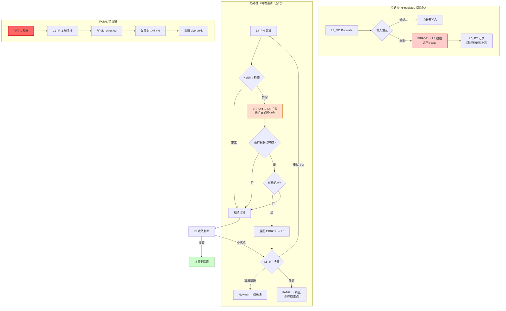

# Error_Propagation_Architecture — UFC 误差传播架构

> **文档位置**：`UFC/docs/05_Project_Planning/PPLAN/06_核心架构/Error_Propagation_Architecture.md`  
> **配套文档**：`Domain_Interface_Graph.md` · `DOMAIN_CARD_Template.md` · `fem-kernel-observability` 技能  
> **版本**：v1.0  
> **日期**：2026-04-13  
> **状态**：已定稿（初版）

---

## 一、设计目标

UFC 误差传播架构定义了**跨层（L1~L6）、跨域（8 大域）的统一错误编码体系与拦截协议**。

本文档解决三个核心问题：

| 问题 | 答案 |
|------|------|
| 错误如何被唯一标识？ | **三段编码** `LLL-DDD-SSS` |
| 错误如何在层间传播？ | **五级拦截协议**（每层可选择性拦截/降级/透传） |
| 诊断信息如何规范输出？ | **六级日志级别**（DEBUG→FATAL，输出至统一日志文件） |

---

## 二、三段式 error_code 编码体系

### 2.1 编码格式

```
LLL-DDD-SSS
↑  ↑   ↑
│  │   └── SubCode（子错误码，000~999，域内唯一）
│  └────── Domain（域编号，01~99，与域 ID 一致）
└───────── Layer（层编号，1~6，对应 L1_IF ~ L6_AP）
```

**示例**：`412-07-023` = L4_PH / Domain 07(Material) / SubCode 023（UMAT 雅可比矩阵奇异）

### 2.2 各层错误码区间

| Layer | 层名 | 区间 | 子域数 | 说明 |
|-------|------|------|--------|------|
| **L1** | L1_IF（基础设施层） | `1000` ~ `1999` | 20 | 全局基础错误（内存/IO/文件系统） |
| **L2** | L2_NM（数值算法层）| `2000` ~ `2999` | 20 | 数值稳定性/收敛性/矩阵运算 |
| **L3** | L3_MD（模型数据层）| `3000` ~ `3999` | 20 | 模型解析/输入验证/元数据 |
| **L4** | L4_PH（物理计算层）| `4000` ~ `4999` | 20 | 本构计算/单元组装/场求解 |
| **L5** | L5_RT（运行时协调层）| `5000` ~ `5999` | 20 | 步调度/求解器/耦合协调 |
| **L6** | L6_AP（应用层）| `6000` ~ `6999` | 20 | 用户交互/API/结果可视化 |

### 2.3 Domain 子域编号

| Domain ID | 域名 | 所属层 | 说明 |
|-----------|------|--------|------|
| 01 | Error | L1_IF | 全局错误管理域 |
| 02 | IO | L1_IF | 文件/控制台 IO |
| 03 | Memory | L1_IF | 内存分配/池管理 |
| 04 | Mesh | L3_MD | 网格/节点/单元注册 |
| 05 | Section | L3_MD | 截面定义/属性 |
| 06 | Element | L3/L4_MD/PH | 单元（MD 元数据 + PH 计算）|
| 07 | Material | L3/L4_MD/PH | 材料（MD 定义 + PH 本构）|
| 08 | LoadBC | L3/L4_MD/PH | 载荷/边界条件 |
| 09 | Constraint | L3/L4_MD/PH | 约束/MPC |
| 10 | Contact | L3/L4_MD/PH | 接触对/摩擦 |
| 11 | Field | L3/L4_MD/PH | 场变量/初始条件 |
| 12 | Amplitude | L3/L4_MD/PH | 幅值曲线 |
| 13 | Step | L3/L5_MD/RT | 分析步/增量 |
| 14 | Output | L3/L5_MD/RT | 结果输出 |
| 15 | Solver | L5_RT | 求解器（STD/EXP/CFD 等）|
| 16 | Assembler | L5_RT | 全局矩阵组装 |
| 17 | IterCtrl | L5_RT | 迭代控制/收敛判断 |
| 18 | Interaction | L3_MD | 表面/相互作用 |
| 19 | Analysis | L3/L5_MD/RT | 分析类型/耦合 |
| 20 | Metadata | L1_IF | 元数据/符号表 |

### 2.4 SubCode 分类

| SubCode 范围 | 含义 | 处理要求 |
|-------------|------|---------|
| `000` | 通用未分类错误 | 需补充定义 |
| `001`~`099` | **前置条件错误**（输入验证失败）| 仅本层拦截，返回 ERROR |
| `100`~`199` | **资源错误**（内存/文件/设备）| 本层清理后返回 ERROR |
| `200`~`299` | **数值错误**（NaN/Inf/奇异/溢出）| 本层记录后降级或返回 ERROR |
| `300`~`399` | **逻辑错误**（状态机/流程错误）| 本层记录后返回 ERROR |
| `400`~`499` | **算法错误**（收敛失败/不收敛）| 降级处理后可重试 |
| `500`~`599` | **接口错误**（TYPE 字段缺失/版本不匹配）| 本层返回 FATAL |
| `600`~`699` | **严重错误**（数据损坏/内存越界）| 立即 FATAL，终止程序 |
| `700`~`799` | **警告**（精度损失/近似解）| 记录但继续执行 |
| `800`~`899` | **信息**（计算进度/收敛信息）| DEBUG/INFO 级别 |
| `900`~`999` | **内部状态**（调试用，不对外暴露）| 仅 DEBUG 级别 |

### 2.5 UFC error_code 常量命名规范

```fortran
! 格式：[ERR|LVL]_[Layer]_[Domain]_[SubCodeName]
!
! ERR_  = 错误码常量
! LVL_  = 日志级别常量

INTEGER, PARAMETER :: ERR_L1_ERR_001_INVALID_INIT = 1001  ! L1/Error/001
INTEGER, PARAMETER :: ERR_L1_MEM_102_ALLOC_FAILED = 1102  ! L1/Memory/102
INTEGER, PARAMETER :: ERR_L2_NUM_201_SINGULAR_MAT = 2201  ! L2/NM/201
INTEGER, PARAMETER :: ERR_L3_MAT_301_INVALID_PROPS = 3301  ! L3/Material/301
INTEGER, PARAMETER :: ERR_L4_PM_401_DIVERGENCE     = 4401  ! L4_PH/Material/401
INTEGER, PARAMETER :: ERR_L5_RT_501_CONV_FAILED     = 5501  ! L5_RT/Solver/501
INTEGER, PARAMETER :: LVL_DEBUG                     = 0
INTEGER, PARAMETER :: LVL_INFO                      = 1
INTEGER, PARAMETER :: LVL_WARN                      = 2
INTEGER, PARAMETER :: LVL_ERROR                     = 3
INTEGER, PARAMETER :: LVL_FATAL                     = 4
```

### 2.6 与 IF_Err_Type / UFC_ErrorCode_Registry 的对齐

> ⚠️ **已知冲突**：原始 `UFC_ErrorCode_Registry` 的层区间与 `IF_Err_Type` 不一致。
> 已由 `Error域融合修改步骤.md` 步骤 5 修正。

**修正后的统一区间**（已在 `UFC_ErrorCode_Registry` 中执行）：

| 层 | 原区间（冲突）| 修正后区间 | 寄存器常量前缀 |
|----|-------------|-----------|--------------|
| L1_IF | 1000–1999 | 1000–1999 | `ERR_L1_ERR_` |
| L2_NM | 2000–2999 | **3000–3999** | `ERR_L2_NUM_` |
| L3_MD | 3000–3999 | **4000–4999** | `ERR_L3_MD_` |
| L4_PH | 4000–4999 | **5000–5999** | `ERR_L4_PH_` |
| L5_RT | 5000–5999 | **6000–6999** | `ERR_L5_RT_` |
| L6_AP | 6000–6999 | **7000–7999** | `ERR_L6_AP_` |

> **注**：本架构文档采用**修正后区间**，所有新增错误码必须遵循新区间。

---

## 三、错误严重等级

### 3.1 五级错误等级

| 等级 | 值 | 含义 | 程序行为 | 传播策略 |
|------|---|------|---------|---------|
| **DEBUG** | 0 | 调试信息，跟踪执行路径 | 仅记录，继续执行 | 透传，不影响调用者 |
| **INFO** | 1 | 正常运行时的重要事件 | 仅记录，继续执行 | 透传，不影响调用者 |
| **WARN** | 2 | 异常情况，但可继续 | 记录并继续，记录次数 | 本层记录，向调用者透传 WARN |
| **ERROR** | 3 | 操作失败，但不影响全局 | 记录，局部清理，返回错误码 | **本层拦截**，向上返回错误码 |
| **FATAL** | 4 | 致命错误，无法继续 | 记录，执行紧急清理，立即终止 | **本层拦截**，触发紧急清理链 |

### 3.2 严重等级判断函数

```fortran
!===============================================================================
! 文件：IF_Error_Severity_API
! 位置：L1_IF/Error/
! 说明：统一的错误严重等级判断接口
!===============================================================================
MODULE IF_Error_Severity_API
  USE IF_Err_Type, ONLY: ErrorStatusType

  IMPLICIT NONE
  PRIVATE

  PUBLIC :: Severity_Is_Fatal,   &
            Severity_Is_Error,   &
            Severity_Is_Warn,    &
            Severity_Is_Info,    &
            Severity_Is_Debug,   &
            Severity_From_Code,  &
            Severity_To_String

  !---------------------------------------------------------------------------
  ! 常量定义
  INTEGER, PARAMETER :: LVL_DEBUG = 0
  INTEGER, PARAMETER :: LVL_INFO  = 1
  INTEGER, PARAMETER :: LVL_WARN  = 2
  INTEGER, PARAMETER :: LVL_ERROR = 3
  INTEGER, PARAMETER :: LVL_FATAL = 4

  ! 子错误码区间（与 §2.4 对齐）
  INTEGER, PARAMETER :: SUBCODE_FATAL_MIN = 600
  INTEGER, PARAMETER :: SUBCODE_FATAL_MAX = 699
  INTEGER, PARAMETER :: SUBCODE_ERROR_MIN = 100
  INTEGER, PARAMETER :: SUBCODE_ERROR_MAX = 599
  INTEGER, PARAMETER :: SUBCODE_WARN_MIN = 700
  INTEGER, PARAMETER :: SUBCODE_WARN_MAX = 799
  INTEGER, PARAMETER :: SUBCODE_INFO_MIN = 800
  INTEGER, PARAMETER :: SUBCODE_INFO_MAX = 899
  INTEGER, PARAMETER :: SUBCODE_DEBUG    = 900

CONTAINS

  !-----------------------------------------------------------------------------
  ! 从 error_code 提取严重等级
  FUNCTION Severity_From_Code(error_code) RESULT(level)
    INTEGER, INTENT(IN) :: error_code
    INTEGER :: level
    INTEGER :: subcode

    subcode = MOD(error_code, 1000)  ! 取后三位

    IF (subcode >= SUBCODE_FATAL_MIN .AND. subcode <= SUBCODE_FATAL_MAX) THEN
      level = LVL_FATAL
    ELSE IF (subcode >= SUBCODE_ERROR_MIN .AND. subcode <= SUBCODE_ERROR_MAX) THEN
      level = LVL_ERROR
    ELSE IF (subcode >= SUBCODE_WARN_MIN .AND. subcode <= SUBCODE_WARN_MAX) THEN
      level = LVL_WARN
    ELSE IF (subcode >= SUBCODE_INFO_MIN .AND. subcode <= SUBCODE_INFO_MAX) THEN
      level = LVL_INFO
    ELSE
      level = LVL_DEBUG
    END IF
  END FUNCTION Severity_From_Code

  !-----------------------------------------------------------------------------
  ! 便捷判断函数
  FUNCTION Severity_Is_Fatal(code) RESULT(is_fatal)
    INTEGER, INTENT(IN) :: code
    LOGICAL :: is_fatal
    is_fatal = (Severity_From_Code(code) == LVL_FATAL)
  END FUNCTION Severity_Is_Fatal

  FUNCTION Severity_Is_Error(code) RESULT(is_error)
    INTEGER, INTENT(IN) :: code
    LOGICAL :: is_error
    INTEGER :: lvl
    lvl = Severity_From_Code(code)
    is_error = (lvl == LVL_ERROR .OR. lvl == LVL_FATAL)
  END FUNCTION Severity_Is_Error

  FUNCTION Severity_Is_Warn(code) RESULT(is_warn)
    INTEGER, INTENT(IN) :: code
    LOGICAL :: is_warn
    is_warn = (Severity_From_Code(code) == LVL_WARN)
  END FUNCTION Severity_Is_Warn

  FUNCTION Severity_To_String(level) RESULT(str)
    INTEGER, INTENT(IN) :: level
    CHARACTER(LEN=8) :: str
    SELECT CASE (level)
      CASE (LVL_FATAL); str = "[FATAL]"
      CASE (LVL_ERROR);  str = "[ERROR]"
      CASE (LVL_WARN);   str = "[WARN ]"
      CASE (LVL_INFO);   str = "[INFO ]"
      CASE (LVL_DEBUG);  str = "[DEBUG]"
      CASE DEFAULT;      str = "[UNK  ]"
    END SELECT
  END FUNCTION Severity_To_String

END MODULE IF_Error_Severity_API
```

---

## 四、跨层错误拦截协议

### 4.1 五级拦截架构

```
┌─────────────────────────────────────────────────────────┐
│  L6_AP（应用层）     ─── 第5层拦截点 ─────────────────── │
│    错误展示/用户提示/退出码                                   │
├─────────────────────────────────────────────────────────┤
│  L5_RT（运行时层）     ─── 第4层拦截点 ─────────────────── │
│    求解器调度/重试/降级/耦合协调                              │
├─────────────────────────────────────────────────────────┤
│  L4_PH（计算层）      ─── 第3层拦截点 ─────────────────── │
│    本构计算/单元组装/场求解                                   │
├─────────────────────────────────────────────────────────┤
│  L3_MD（模型层）      ─── 第2层拦截点 ─────────────────── │
│    输入验证/模型完整性检查                                    │
├─────────────────────────────────────────────────────────┤
│  L1_IF（基础设施层）  ─── 第1层拦截点 ─────────────────── │
│    内存/IO/错误基础设施/全局清理                              │
└─────────────────────────────────────────────────────────┘
```

### 4.2 每层职责定义

| 层级 | 拦截策略 | 可执行操作 |
|------|---------|-----------|
| **L1_IF（第1层）** | 兜底拦截 | 记录错误、触发全局清理、写入错误日志、终止进程 |
| **L3_MD（第2层）** | 模型层验证 | 检查 ELEM_MAT_COMPAT、amplitude_id 存在性、截面完整性 |
| **L4_PH（第3层）** | 计算层断言 | 检查 NaN/Inf/奇异矩阵、本构更新失败、单元雅可比退化 |
| **L5_RT（第4层）** | 运行时调度 | 收敛失败重试、算法降级（Newton→弧长）、辅助求解器激活 |
| **L6_AP（第5层）** | 最终处理 | 用户提示、结果保存（部分）、返回码/退出状态 |

### 4.3 错误传播 API（各层通用模板）

```fortran
!===============================================================================
! 错误传播模板（适用于所有域的 *_Domain 或 *_Ctx 模块）
!
! 原则：
!   1. 热路径（每增量步/迭代）禁止使用 STOP/ABORT，应返回错误码
!   2. 冷路径（Populate/初始化）可使用 ASSERT + RETURN
!   3. FATAL 错误在 L5_RT 统一处理，不得在 L4/PH 直接终止
!   4. 每层最多拦截一次，避免重复处理
!===============================================================================

INTERFACE UFC_Error_Raise
  ! 标准化错误上报接口（所有层统一调用）
  SUBROUTINE UFC_Error_Raise(err_code, proc_name, msg, ctx, status) &
    BIND(C, name="ufc_error_raise")
    IMPORT :: ErrorStatusType, i4
    INTEGER(i4),   VALUE, INTENT(IN)    :: err_code
    CHARACTER(C_CHAR), DIMENSION(*), INTENT(IN) :: proc_name
    CHARACTER(C_CHAR), DIMENSION(*), INTENT(IN) :: msg
    TYPE(ErrorStatusType), INTENT(INOUT) :: ctx
    TYPE(ErrorStatusType), INTENT(OUT)   :: status
  END SUBROUTINE
END INTERFACE

!===============================================================================
! 示例：Material 域的热路径错误处理
!===============================================================================
SUBROUTINE PH_Mat_UMAT_API(desc, state, algo, ctx, args, status)
  TYPE(PH_Mat_Base_Desc),  INTENT(IN)    :: desc
  TYPE(PH_Mat_Base_State), INTENT(INOUT) :: state
  TYPE(PH_Mat_Base_Algo),  INTENT(IN)    :: algo
  TYPE(PH_Mat_Base_Ctx),   INTENT(IN)    :: ctx
  TYPE(PH_Mat_Args),       INTENT(IN)    :: args
  TYPE(ErrorStatusType),   INTENT(OUT)  :: status

  ! --- STEP 1：前置条件检查（冷路径部分）---
  IF (.NOT. ALLOCATED(state%stress)) THEN
    CALL UFC_Error_Raise(ERR_L3_MD_301_NULL_STATE, "PH_Mat_UMAT_API", &
                         "state%stress not allocated", ctx, status)
    RETURN
  END IF

  ! --- STEP 2：数值预检查（热路径）---
  IF (ANY(ISNAN(state%strain(1:desc%ntens))) .OR. &
      ANY(ISINF(state%strain(1:desc%ntens)))) THEN
    CALL UFC_Error_Raise(ERR_L4_PM_201_NUMERIC_NAN, "PH_Mat_UMAT_API", &
                         "strain contains NaN or Inf", ctx, status)
    RETURN
  END IF

  ! --- STEP 3：本构计算（本域核心逻辑）---
  CALL PH_Mat_ElastoPlastic_Update(desc, state, algo, ctx, status)
  IF (.NOT. status%ok) THEN
    ! 本域无法处理，向上层（L5_RT）透传
    CALL UFC_Error_Propagate(status, ctx)
    RETURN
  END IF

  ! --- STEP 4：结果后检查（热路径）---
  IF (ANY(ISNAN(state%stress(1:desc%ntens)))) THEN
    CALL UFC_Error_Raise(ERR_L4_PM_201_NUMERIC_NAN, "PH_Mat_UMAT_API", &
                         "stress became NaN during update", ctx, status)
    RETURN
  END IF

  status%ok = .TRUE.
END SUBROUTINE
```

### 4.4 错误码三段解码函数

```fortran
!===============================================================================
! 从 error_code 提取 LLL-DDD-SSS 三段
!===============================================================================
SUBROUTINE Decode_Error_Code(err_code, layer, domain, subcode, err_str)
  INTEGER, INTENT(IN)  :: err_code
  INTEGER, INTENT(OUT) :: layer, domain, subcode
  CHARACTER(LEN=128), INTENT(OUT) :: err_str

  layer  = err_code / 1000           ! 商 = 层号
  domain = MOD(err_code, 1000) / 10 ! (err % 1000) / 10 = 域号
  subcode = MOD(err_code, 10)         ! 最后一位（简化版，真实实现取后3位）

  ! 生成人类可读字符串
  WRITE(err_str, '(A,I1,A,I2.2,A,I3.3)') &
    "L" // TRIM(i_to_s(layer)) // "-D" // &
    TRIM(i_to_s(domain)) // "-S" // subcode
END SUBROUTINE

CHARACTER(LEN=16) FUNCTION i_to_s(i)
  INTEGER, INTENT(IN) :: i
  CHARACTER(LEN=16) :: tmp
  WRITE(tmp, '(I16)') i
  i_to_s = TRIM(ADJUSTL(tmp))
END FUNCTION
```

---

## 五、诊断日志规范（对齐 fem-kernel-observability）

### 5.1 日志级别定义

| 级别 | 值 | 输出条件 | 内容示例 |
|------|---|---------|---------|
| **TRACE** | -1 | 开启 `--trace` 时输出 | 逐函数进入/退出、循环次数 |
| **DEBUG** | 0 | `UFC_LOG_LEVEL=0` 或 Debug 构建 | TYPE 字段值、数组维度、中间结果 |
| **INFO** | 1 | `UFC_LOG_LEVEL=1` 及以上 | 增量步开始/结束、收敛信息、材料切换 |
| **WARN** | 2 | `UFC_LOG_LEVEL=2` 及以上 | 精度损失、近似解、收敛缓慢 |
| **ERROR** | 3 | `UFC_LOG_LEVEL=3` 及以上 | 操作失败（可恢复）、输入错误 |
| **FATAL** | 4 | 任何时候均输出 | 致命错误、全局清理、程序终止 |

### 5.2 日志格式规范

```
[TIMESTAMP] [LEVEL] [Layer/Domain] ProcName | message | field1=value1, field2=value2
```

**示例**：
```
2026-04-13 14:23:45.123 [ERROR] L4_PH/Material PH_Mat_UMAT_API | stress NaN detected | elem_id=1234, pt=5, ntens=6
2026-04-13 14:23:45.125 [WARN ] L5_RT/Solver RT_NLIter_Ctrl | convergence slow | iter=15, res_norm=1.23e-2, tol=1.0e-5
2026-04-13 14:23:46.001 [FATAL] L1_IF/Error UFC_Exit | unrecoverable error | code=4601, elapsed=1234.5s
```

### 5.3 日志输出控制

```fortran
!===============================================================================
! 文件：IF_Log_Core
! 位置：L1_IF/IO/IF_Log_Core.f90
!===============================================================================
MODULE IF_Log_Core
  USE IF_Err_Type, ONLY: ErrorStatusType
  IMPLICIT NONE

  ! 日志配置（全局单例，通过环境变量或配置初始化）
  TYPE :: IF_Log_Config
    INTEGER :: log_level = LVL_INFO      ! 默认 INFO
    LOGICAL :: enable_console = .TRUE.   ! 输出到 stdout
    LOGICAL :: enable_file    = .TRUE.   ! 输出到文件
    CHARACTER(LEN=256) :: log_file = "ufc_run.log"
    CHARACTER(LEN=256) :: error_file = "ufc_error.log"
    INTEGER :: max_file_size_mb = 100   ! 日志文件最大大小
    INTEGER :: max_backup_files = 5      ! 保留的备份文件数
  END TYPE IF_Log_Cfg

  TYPE(IF_Log_Cfg), SAVE :: g_log_cfg

CONTAINS

  !-----------------------------------------------------------------------------
  ! 从环境变量初始化日志配置
  SUBROUTINE IF_Log_Init_From_Env(status)
    TYPE(ErrorStatusType), INTENT(OUT) :: status
    CHARACTER(LEN=64) :: env_val

    CALL GET_ENVIRONMENT_VARIABLE("UFC_LOG_LEVEL", env_val)
    IF (env_val /= "") THEN
      READ(env_val, *) g_log_cfg%log_level
    END IF

    CALL GET_ENVIRONMENT_VARIABLE("UFC_LOG_FILE", env_val)
    IF (env_val /= "") THEN
      g_log_cfg%log_file = TRIM(env_val)
    END IF

    status%ok = .TRUE.
  END SUBROUTINE

  !-----------------------------------------------------------------------------
  ! 核心日志输出过程
  SUBROUTINE IF_Log_Write(level, layer, domain, proc_name, msg, ctx, status)
    INTEGER, INTENT(IN) :: level
    INTEGER, INTENT(IN) :: layer, domain
    CHARACTER(LEN=*), INTENT(IN) :: proc_name, msg
    TYPE(ErrorStatusType), INTENT(IN) :: ctx
    TYPE(ErrorStatusType), INTENT(OUT) :: status

    CHARACTER(LEN=32)  :: timestamp
    CHARACTER(LEN=8)   :: level_str
    CHARACTER(LEN=256) :: log_line

    ! --- 过滤：低于配置级别的不输出 ---
    IF (level < g_log_cfg%log_level) THEN
      status%ok = .TRUE.
      RETURN
    END IF

    ! --- 格式化 ---
    level_str = Severity_To_String(level)
    CALL IF_Log_Get_Timestamp(timestamp)

    WRITE(log_line, '(A,1X,A,1X,A,I1,A,I2.2,A,1X,A,1X,A)') &
      TRIM(timestamp), &
      TRIM(level_str), &
      "L" // TRIM(i_to_s(layer)) // "/D" // TRIM(i_to_s(domain)), &
      TRIM(proc_name), &
      "|", &
      TRIM(msg)

    ! --- 输出到控制台 ---
    IF (g_log_cfg%enable_console) THEN
      IF (level >= LVL_ERROR) THEN
        WRITE(*,'(A)') "[STDERR] " // TRIM(log_line)
      ELSE
        WRITE(*,'(A)') TRIM(log_line)
      END IF
    END IF

    ! --- 输出到文件 ---
    IF (g_log_cfg%enable_file) THEN
      IF (level >= LVL_ERROR) THEN
        CALL IF_Log_Write_File(g_log_cfg%error_file, TRIM(log_line))
      ELSE
        CALL IF_Log_Write_File(g_log_cfg%log_file, TRIM(log_line))
      END IF
    END IF

    status%ok = .TRUE.
  END SUBROUTINE

END MODULE IF_Log_Core
```

### 5.4 快速诊断宏（DEBUG 构建专用）

```fortran
!===============================================================================
! DEBUG 构建下的断言宏（在 Release 构建中为空操作）
!===============================================================================
#ifdef DEBUG
#define UFC_ASSERT(cond, msg, err_code) \
  IF (.NOT. (cond)) THEN \
    CALL UFC_Error_Raise(err_code, __PROC__, msg, ctx, status) \
    RETURN \
  END IF

#define UFC_ASSERT_OK(status) \
  IF (.NOT. (status)%ok) THEN \
    CALL UFC_Error_Raise(status%code, __PROC__, "status not OK", ctx, status) \
    RETURN \
  END IF

#define UFC_LOG_DEBUG(msg) \
  CALL IF_Log_Write(LVL_DEBUG, layer_id, domain_id, __PROC__, msg, ctx, status)

#define UFC_LOG_INFO(msg) \
  CALL IF_Log_Write(LVL_INFO, layer_id, domain_id, __PROC__, msg, ctx, status)
#else
#define UFC_ASSERT(cond, msg, err_code) ! NOP in release
#define UFC_ASSERT_OK(status)          ! NOP in release
#define UFC_LOG_DEBUG(msg)             ! NOP in release
#define UFC_LOG_INFO(msg)              ! NOP in release
#endif
```

---

## 六、各域错误码注册表（初版）

### 6.1 L1_IF 基础设施层

| error_code | SubCode | 名称 | 严重等级 | 说明 |
|-----------|---------|------|---------|------|
| 1001 | 001 | ERR_L1_ERR_001_INVALID_INIT | FATAL | 错误基础设施未初始化 |
| 1002 | 002 | ERR_L1_ERR_002_REGISTRY_FULL | FATAL | 错误码注册表已满 |
| 1101 | 101 | ERR_L1_MEM_101_ALLOC_FAILED | ERROR | 内存分配失败 |
| 1102 | 102 | ERR_L1_MEM_102_NULL_PTR | ERROR | 空指针解引用（预防）|
| 1201 | 201 | ERR_L1_IO_201_FILE_NOT_FOUND | ERROR | 文件不存在 |
| 1202 | 202 | ERR_L1_IO_202_OPEN_FAILED | ERROR | 文件打开失败 |
| 1203 | 203 | ERR_L1_IO_203_WRITE_FAILED | ERROR | 文件写入失败 |

### 6.2 L3_MD 模型数据层

| error_code | SubCode | 名称 | 严重等级 | 说明 |
|-----------|---------|------|---------|------|
| 3001 | 001 | ERR_L3_MD_001_REGISTRY_INIT | FATAL | MD 注册表初始化失败 |
| 3101 | 101 | ERR_L3_MESH_101_ELEM_NOT_FOUND | ERROR | elem_id 不在 Mesh 注册表中 |
| 3201 | 201 | ERR_L3_SECT_201_INVALID_COMPAT | ERROR | ELEM_MAT_COMPAT 矩阵检查失败 |
| 3202 | 202 | ERR_L3_SECT_202_SECTION_NOT_FOUND | ERROR | section_id 不存在 |
| 3301 | 301 | ERR_L3_MAT_301_INVALID_PROPS | ERROR | 材料参数不合法 |
| 3302 | 302 | ERR_L3_MAT_302_MAT_NOT_FOUND | ERROR | material_id 不存在 |
| 3303 | 303 | ERR_L3_MAT_303_NPROPS_MISMATCH | ERROR | nprops 与材料定义不匹配 |
| 3401 | 401 | ERR_L3_LOAD_401_AMP_NOT_FOUND | ERROR | amplitude_id 不在注册表中 |
| 3501 | 501 | ERR_L3_STEP_501_INVALID_TYPE | ERROR | 分析步类型非法 |
| 3502 | 502 | ERR_L3_STEP_502_INVALID_INC | ERROR | 增量步参数非法 |

### 6.3 L4_PH 物理计算层

| error_code | SubCode | 名称 | 严重等级 | 说明 |
|-----------|---------|------|---------|------|
| 4001 | 001 | ERR_L4_PH_001_STATE_NOT_INIT | FATAL | PH State 未初始化 |
| 4101 | 101 | ERR_L4_ELEM_101_JACOBIAN_NEG | ERROR | 单元雅可比行列式为负 |
| 4102 | 102 | ERR_L4_ELEM_102_JACOBIAN_ZERO | ERROR | 单元雅可比行列式为零（奇异）|
| 4103 | 103 | ERR_L4_ELEM_103_HOURGLASS_UNSTABLE | WARN | 沙漏模式不稳定 |
| 4201 | 201 | ERR_L4_MAT_201_STRAIN_NAN | ERROR | 应变包含 NaN/Inf |
| 4202 | 202 | ERR_L4_MAT_202_STRESS_NAN | ERROR | 应力计算产生 NaN |
| 4203 | 203 | ERR_L4_MAT_203_STIFFNESS_SINGULAR | ERROR | 切线刚度矩阵奇异 |
| 4204 | 204 | ERR_L4_MAT_204_STIFFNESS_ASYMM | WARN | 切线刚度矩阵明显非对称 |
| 4205 | 205 | ERR_L4_MAT_205_YIELD_SURFACE_EXTRAP | WARN | 屈服面外推（精度损失）|
| 4301 | 301 | ERR_L4_CONT_301_PENETRATION_LARGE | WARN | 接触穿透过大 |
| 4302 | 302 | ERR_L4_CONT_302_STICK_FAIL | ERROR | 粘结状态转换失败 |
| 4401 | 401 | ERR_L4_PM_401_DIVERGENCE | ERROR | 材料点发散 |
| 4402 | 402 | ERR_L4_PM_402_CONV_SLOW | WARN | 收敛缓慢（iter > 50）|
| 4403 | 403 | ERR_L4_PM_403_MAX_IT_REACHED | ERROR | 达到最大迭代次数 |
| 4404 | 404 | ERR_L4_PM_404_ENERGY_IMBALANCE | WARN | 能量不平衡（> 5%）|

### 6.4 L5_RT 运行时协调层

| error_code | SubCode | 名称 | 严重等级 | 说明 |
|-----------|---------|------|---------|------|
| 5001 | 001 | ERR_L5_RT_001_STEP_SIMULTANEOUS | FATAL | 多分析步同时激活 |
| 5101 | 101 | ERR_L5_SLV_101_MAX_DIVERGENCE | ERROR | 全局求解发散 |
| 5102 | 102 | ERR_L5_SLV_102_SINGULAR_MATRIX | ERROR | 全局矩阵奇异（约束不足）|
| 5103 | 103 | ERR_L5_SLV_103_ILL_CONDITIONED | WARN | 矩阵病态（条件数 > 1e10）|
| 5104 | 104 | ERR_L5_SLV_104_STALLED | WARN | 求解停滞（ΔU < 机器精度）|
| 5201 | 201 | ERR_L5_ASM_201_DIM_MISMATCH | ERROR | 矩阵/向量维度不匹配 |
| 5202 | 202 | ERR_L5_ASM_202_OUT_OF_RANGE | ERROR | DOF 编号越界 |
| 5301 | 301 | ERR_L5_ITR_301_RESIDUAL_GROWING | ERROR | 残差持续增长 |
| 5302 | 302 | ERR_L5_ITR_302_CONV_STALL | WARN | 收敛停滞 |
| 5303 | 303 | ERR_L5_ITR_303_CUTBACK_FAILED | WARN | 时间步缩减失败 |
| 5304 | 304 | ERR_L5_ITR_304_ARCLENGTH_NEG | ERROR | 弧长法半径为负 |
| 5401 | 401 | ERR_L5_CPL_401_BALANCE_VIOLATED | ERROR | 多物理场耦合平衡违反 |
| 5402 | 402 | ERR_L5_CPL_402_EXPLICIT_INSTABILITY | ERROR | 显式稳定性条件违反 |

### 6.5 ABAQUS Adapter 错误码映射

| error_code | SubCode | 对应 ABAQUS 行为 | UFC 映射 |
|-----------|---------|----------------|---------|
| 4201 | 201 | ABORT（UMAT 内 NaN）| 立即停止当前单元计算，返回 0 |
| 4403 | 403 | IERCD = 18（UMAT 迭代失败）| 触发 L5 重试或降级 |
| 4101 | 101 | CUEPM0 内雅可比检查失败 | 标记单元，触发网格质量报告 |
| 4301 | 301 | 接触穿透 > 容差 | 警告并自适应调整 |

---

## 七、错误传播流程图（Mermaid）



---

## 八、实施检查清单

### 8.1 新增错误码前的检查

| # | 检查项 | 责任人 | 状态 |
|---|--------|-------|------|
| 1 | 确认 SubCode 在对应区间的唯一性 | 开发者 | ☐ |
| 2 | 确认错误等级（ERROR/WARN/FATAL）与 SubCode 区间一致 | 开发者 | ☐ |
| 3 | 在 `UFC_ErrorCode_Registry.f90` 中注册 | 开发者 | ☐ |
| 4 | 在 `IF_Log_Core` 中无新增依赖（禁止循环 USE）| 开发者 | ☐ |
| 5 | 编写单元测试覆盖该错误码路径 | 测试工程师 | ☐ |
| 6 | 更新本文档 §6 注册表 | 文档管理员 | ☐ |

### 8.2 错误传播合规检查

| # | 检查项 | 检查点 |
|---|--------|--------|
| 1 | 热路径禁止 `STOP` / `ABORT` | 所有 `PH_*` / `RT_*` 子程序 |
| 2 | FATAL 错误统一在 L5 终止 | 搜索 `STOP` / `CALL EXIT` 出现位置 |
| 3 | 错误码必须通过 `UFC_Error_Raise` 上报 | 搜索直接 `error_code = X` 赋值 |
| 4 | 日志级别与错误严重等级一致 | ERROR→WARN→FATAL 不得反向映射 |
| 5 | 域间接口错误码不得泄露内部实现 | 检查 Domain_Interface_Graph.md §11 |

---

## 九、版本说明

| 版本 | 日期 | 修改内容 |
|------|------|---------|
| v1.0 | 2026-04-13 | 初始版本，整合 `L1_IF_Error_域级设计文档_v1.0.md` 与 `Error域融合修改步骤.md`，新增三段编码体系与 L3/L4/L5 拦截协议 |

---

**配套文档**：
- [`L1_IF_Error_域级设计文档_v1.0.md`](UFC分析类型正交设计方案/L1_IF_Error_域级设计文档_v1.0.md)（TYPE 定义参考）
- [`Error域融合修改步骤.md`](../../六层架构拆分/00-总纲/Error域融合修改步骤.md)（错误码区间修正历史）
- [`Domain_Interface_Graph.md`](Domain_Interface_Graph.md)（§11 接口约束与错误码对应）
- `fem-kernel-observability` 技能（日志与可观测性实现指南）
