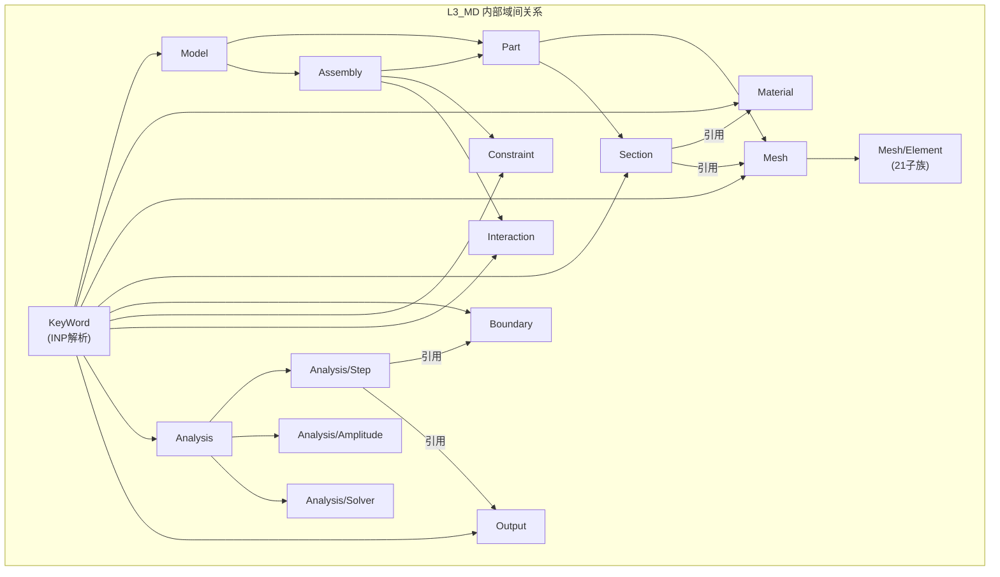
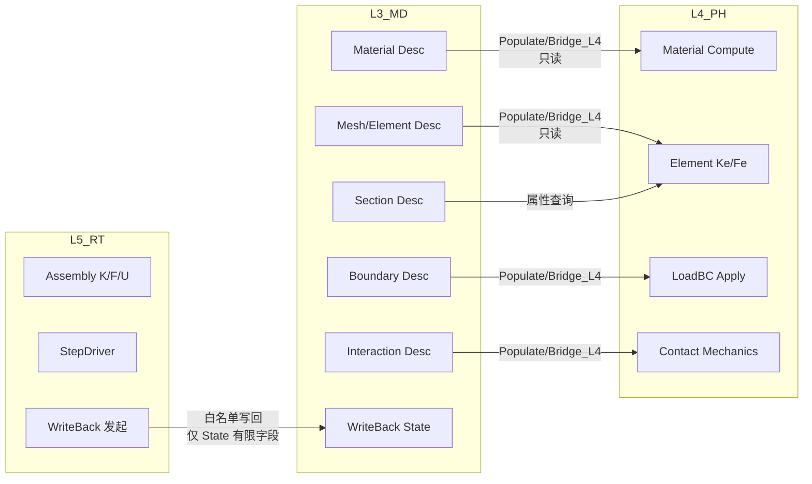

# L3_MD 层级子总纲 — 模型数据层

> **版本**: v1.0 | **日期**: 2026-04-25
> **关联**: [全层全域矩阵](UFC_全层全域权威清单矩阵.md) · [架构总纲 v5.1](../01_架构总纲/UFC_架构设计总纲_深度整合版_v5.0.md) · [十件套 v2.0](../11_闭环落地专项/05_中间架构层新版总纲_全景套件v3.0.md)

---

## 一、层级定位

| 属性 | 值 |
|------|-----|
| **层级** | L3_MD (Model Data Layer) |
| **命名前缀** | `MD_` |
| **核心职责** | 模型定义的唯一真相源 (SSOT)，存储从 INP 解析来的所有模型数据 |
| **四型特征** | 以 **Desc** 为主体（冷数据，Write-Once）；部分域有 State（温数据，白名单写回） |
| **依赖方向** | L3_MD → L2_NM → L1_IF（仅下行）；L4_PH/L5_RT 只读消费 L3（经 Bridge/Populate） |
| **域总数** | 15（含 Bridge），370+ f90 文件 |

---

## 二、域清单与职责

| # | 域 | 缩写 | 职责 | 四型 | 子域 |
|---|-----|------|------|------|------|
| 1 | **Analysis** | — | 分析类型/步定义/幅值/求解配置 | Desc, Algo | Amplitude, Solver, Step |
| 2 | **Assembly** | Assem | 总体装配：实例、全局编号 | Desc | — |
| 3 | **Boundary** | — | 边界条件定义（固定/对称/周期） | Desc | — |
| 4 | **Constraint** | Const | 约束条件（MPC/RBE/TIE） | Desc | — |
| 5 | **Field** | — | 场变量定义与插值 | Desc | — |
| 6 | **Interaction** | Cont | 接触与相互作用定义 | Desc | — |
| 7 | **KeyWord** | KW | INP 关键字解析→Desc 填充 | — | — |
| 8 | **Material** | Mat | 材料库：11 族 50+种本构参数 | Desc, State, Algo | 20 子族 |
| 9 | **Mesh** | — | 网格管理：节点/连接矩阵/DOF | Desc | Element (21子族) |
| 10 | **Model** | — | 模型树根容器与全局元信息 | Desc, Ctx | — |
| 11 | **Output** | Out | 输出请求定义（Field/History） | Desc | — |
| 12 | **Part** | — | 部件/集合/几何类型 | Desc | — |
| 13 | **Section** | Sect | 截面属性：截面→材料/单元映射 | Desc | — |
| 14 | **WriteBack** | — | L5→L3 白名单写回受体 | State | — |
| 15 | **Bridge** | Brg | 跨层防腐适配 | — | Bridge_L4, Bridge_L5 |

---

## 三、域间关系图（DAG）

### 3.1 L3 内部域间关系

### 3.2 L3 对外关系（跨层）

---

## 四、域间关系类型

| 关系 | 类型 | 说明 |
|------|------|------|
| KeyWord → 各数据域 | **填充** (Populate) | KW 解析 INP 后填充各域 Desc |
| Section → Material | **引用** (Reference) | Section Desc 持有 mat_id |
| Section → Mesh/Element | **引用** (Reference) | Section Desc 持有 elem_type |
| Assembly → Part | **聚合** (Aggregation) | Assembly 包含多个 Part 实例 |
| Assembly → Constraint/Interaction | **聚合** | Assembly 包含全局约束/接触 |
| Part → Mesh, Part → Section | **组合** (Composition) | Part 拥有网格和截面 |
| Analysis/Step → Boundary/Output | **引用** | Step 定义引用边界和输出请求 |
| L3 → L4 (经 Bridge_L4) | **消费** (Bridge) | L4 只读消费 L3 Desc |
| L5 → L3 (经 WriteBack) | **写回** (WhiteList) | 仅 State 的 current_value/current_time |

---

## 五、四链实例（L3 视角）

| 链 | L3_MD 的角色 |
|----|-------------|
| **理论链** | 将物理概念（材料参数、几何定义）映射为 Fortran TYPE 结构体 |
| **逻辑链** | INP → KeyWord Parse → L3 Desc 填充 → Bridge → L4 消费 |
| **计算链** | L3 不直接参与计算（SSOT 存储层），仅被 L4/L5 引用 |
| **数据链** | Desc (冷/SSOT) → State (温/写回) → 无 Algo/Ctx（L3 不计算） |

---

## 六、约束摘要

### 硬约束

1. **SSOT 铁律**: L3 数据在求解阶段不可被 L4/L5 直接修改（经 WriteBack 白名单除外）
2. **单向依赖**: L3 不得 USE L4/L5 任何模块
3. **Desc 冻结**: Desc 类型在模型建立完成后 Write-Once，热路径中禁止修改
4. **跨层经 Bridge**: L4/L5 访问 L3 必须经 `MD_Bridge_L4`/`MD_Bridge_L5`，禁止直接 USE 域内模块
5. **WriteBack 白名单**: 仅 `state%current_value`, `state%current_time` 等有限字段

### 软约束

1. 各域 CONTRACT.md 中的十件套映射表宜补齐 Active/Deferred 标注
2. KeyWord 域的关键字覆盖率宜追踪
3. Material 20 子族的 CONTRACT 粒度可后续细化

---

*最后更新: 2026-04-25*