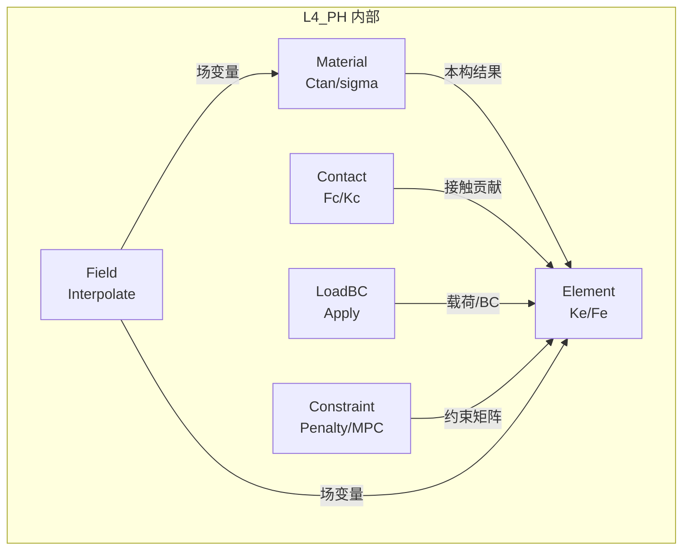
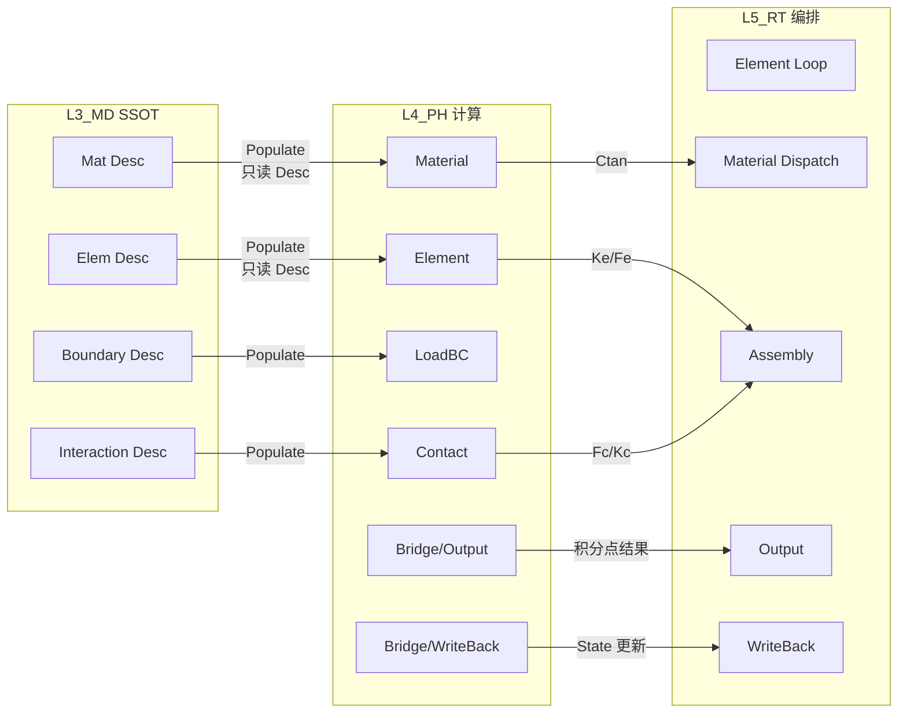

# L4_PH 层级子总纲 — 物理层

> **版本**: v1.0 | **日期**: 2026-04-25
> **关联**: [全层全域矩阵](UFC_全层全域权威清单矩阵.md) · [架构总纲 v5.1](../01_架构总纲/UFC_架构设计总纲_深度整合版_v5.0.md)

---

## 一、层级定位

| 属性 | 值 |
|------|-----|
| **层级** | L4_PH (Physics Layer) |
| **命名前缀** | `PH_` |
| **核心职责** | 单元公式（Ke/Fe）、材料本构（Ctan/sigma）、接触力学、载荷施加 |
| **四型特征** | 以 **Ctx**（热数据）为核心驱动；**State** 存储积分点状态；**Desc** 由 L3 Populate 注入 |
| **依赖方向** | L4_PH → L3_MD → L2_NM → L1_IF |
| **域总数** | 7（含 Bridge），285+ f90 文件 |

**热路径核心层**：Gauss 积分环内禁止 ALLOCATE/DEALLOCATE，禁止直接访问 L3 大对象。

---

## 二、域清单与职责

| # | 域 | 缩写 | 职责 | 四型 | 子域 |
|---|-----|------|------|------|------|
| 1 | **Element** | Elem | 单元刚度/力向量计算 (Ke/Fe)、形函数、积分 | Desc, State, Ctx | 22 子族 |
| 2 | **Material** | Mat | 本构关系计算 (Ctan/sigma)、UMAT 接口 | Desc, State, Algo, Ctx | 18 子族 |
| 3 | **Contact** | Cont | 接触力学：间隙/穿透检测、接触力/刚度 | Desc, State, Ctx | 10 子域 |
| 4 | **Constraint** | Constr | 约束施加：罚函数、MPC、Lagrange | Desc, State | — |
| 5 | **LoadBC** | LoadBC | 载荷/边界条件施加到单元/节点 | Desc, Ctx | — |
| 6 | **Field** | — | 场变量插值与映射 | Desc, State | — |
| 7 | **Bridge** | Brg | 跨层适配（含 Output/WriteBack 子域） | — | Output, WriteBack |

---

## 三、域间关系图（DAG）

### 3.1 L4 内部域间关系

**核心计算链**: `Material.Compute_Ctan → Element.Compute_Ke → (经 Bridge) → L5_RT.Assembly`

### 3.2 L4 对外关系

---

## 四、域间关系类型

| 关系 | 类型 | 说明 |
|------|------|------|
| Material → Element | **嵌入调用** | Element 在 Gauss 点循环内调用 Material.Compute |
| Contact → Element | **贡献** | 接触力/刚度贡献到全局 K/F |
| LoadBC → Element | **施加** | 外载荷施加到单元/节点力向量 |
| Constraint → Element | **修正** | 约束矩阵修正全局方程 |
| Field → Material/Element | **提供** | 场变量（温度等）注入上下文 |
| L3 → L4 (经 Populate) | **注入** | L3 Desc 只读注入 L4 |
| L4 → L5 (经 Bridge) | **输出** | L4 计算结果输出给 L5 组装 |

---

## 五、四链实例（L4 视角）

| 链 | L4_PH 的角色 |
|----|-------------|
| **理论链** | 连续介质力学 → 弱形式 → 单元公式（B^T D B 等）、本构关系（sigma = f(epsilon)） |
| **逻辑链** | 接收 L3 Desc(Populate) → 执行计算 → 输出 Ke/Fe/Ctan → Bridge → L5 |
| **计算链** | `Material.Compute_Ctan(dstran,state) → Element.Compute_Ke(mat_ctan,shape) → Ke,Fe` |
| **数据链** | Desc(L3注入,冷) → State(积分点,温) → Algo(算法开关,冷) → Ctx(Gauss点驱动量,热) |

---

## 六、约束摘要

### 硬约束

1. **零 L3 访问**: 热路径中禁止直接 USE L3_MD 模块；经 Populate/Bridge 提前注入
2. **零堆分配**: Gauss 积分环内禁止 ALLOCATE/DEALLOCATE；Ctx 须栈分配或预分配复用
3. **State 只更新**: L4 只更新自身 State（积分点应力/应变/STATEV），不改 L3 Desc
4. **UMAT/UEL 契约**: 用户子程序通过标准接口注入，不绕过注册机制
5. **单向依赖**: L4 不得 USE L5_RT

### 软约束

1. Element 22 子族的算法覆盖率按里程碑推进（优先 Solid3D/Solid2D/Shell/Beam）
2. Material 18 子族优先 Elas/Plast/HyperElas，其余按需
3. Contact 子域的 Explicit/Thermal/Wear 为后期扩展

---

*最后更新: 2026-04-25*