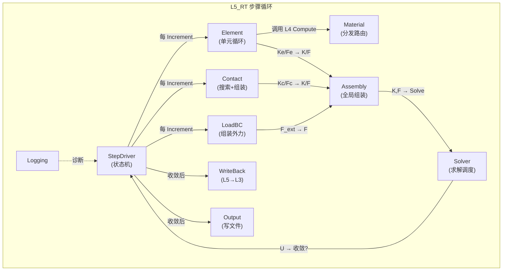
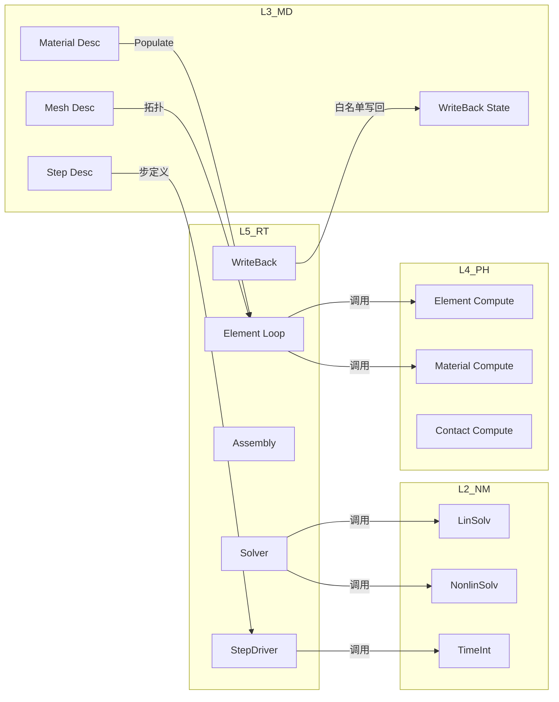

# L5_RT 层级子总纲 — 运行时层

> **版本**: v1.0 | **日期**: 2026-04-25
> **关联**: [全层全域矩阵](UFC_全层全域权威清单矩阵.md) · [架构总纲 v5.1](../01_架构总纲/UFC_架构设计总纲_深度整合版_v5.0.md)

---

## 一、层级定位

| 属性 | 值 |
|------|-----|
| **层级** | L5_RT (Runtime Layer) |
| **命名前缀** | `RT_` |
| **核心职责** | 步骤控制状态机、全局组装 (K/F/U)、求解器调度、收敛检查、写回与输出 |
| **四型特征** | 以 **Ctx**（编排上下文）和 **State**（全局状态）为主；Desc 多从 L3 引用 |
| **依赖方向** | L5_RT → L4_PH → L3_MD → L2_NM → L1_IF |
| **域总数** | 11（含 Bridge），82+ f90 文件 |

**编排核心层**：协调 L4 计算、L2 求解、L3 数据，管理 Step→Increment→Iteration 三级循环。

---

## 二、域清单与职责

| # | 域 | 缩写 | 职责 | 四型 | 子域 |
|---|-----|------|------|------|------|
| 1 | **StepDriver** | — | 步骤状态机：Step→Increment→Iteration 循环控制 | State, Ctx | — |
| 2 | **Solver** | — | 求解器调度：线性/非线性/耦合求解 | Algo, Ctx | Coupling |
| 3 | **Assembly** | Assem | 全局刚度矩阵/力向量组装 (K/F/U) | State, Ctx | — |
| 4 | **Element** | Elem | 单元循环编排：遍历并调用 L4 计算 | Ctx | Mesh |
| 5 | **Contact** | Cont | 接触搜索+接触力组装到全局 | State, Ctx | — |
| 6 | **LoadBC** | LoadBC | 载荷/边界条件组装到全局方程 | Ctx | — |
| 7 | **Material** | Mat | 材料分发（路由到 L4 计算） | — | — |
| 8 | **Output** | Out | 结果输出：ODB/VTK/CSV 写入 | Ctx | — |
| 9 | **WriteBack** | WB | 从 L5 State 写回 L3 State（白名单） | — | — |
| 10 | **Logging** | Log | 运行时日志与诊断 | — | — |
| 11 | **Bridge** | Brg | 跨层适配 | — | Shared |

---

## 三、域间关系图（DAG）

### 3.1 L5 内部域间关系（步骤循环视角）

### 3.2 L5 对外关系

---

## 四、域间关系类型

| 关系 | 类型 | 说明 |
|------|------|------|
| StepDriver → Element/Contact/LoadBC | **编排** (Orchestrate) | 步骤循环中按序调用 |
| Element → Assembly | **贡献** (Contribute) | Ke/Fe 组装到全局 K/F |
| Contact → Assembly | **贡献** | Kc/Fc 组装到全局 K/F |
| LoadBC → Assembly | **贡献** | 外力 F_ext 组装到全局 F |
| Assembly → Solver | **提供** (Provide) | 全局方程 K*U=F |
| Solver → StepDriver | **反馈** (Feedback) | 位移增量 dU + 收敛状态 |
| StepDriver → WriteBack | **触发** (Trigger) | 收敛后写回 L3 |
| StepDriver → Output | **触发** | 收敛后输出结果 |
| L5 → L4 | **调用** (Invoke) | 调用 L4 的 Compute 接口 |
| L5 → L2 | **调用** | 调用 L2 的线性/非线性求解器 |
| L5 → L3 | **读取+写回** | 读取 Desc（经 Bridge），写回 State（白名单） |

---

## 五、四链实例（L5 视角）

| 链 | L5_RT 的角色 |
|----|-------------|
| **理论链** | Newton-Raphson 迭代、Newmark 时间积分、载荷步推进 |
| **逻辑链** | Step(L3) → StepDriver(L5) → Element/Contact(L5→L4) → Assembly(L5) → Solver(L5→L2) → WriteBack(L5→L3) |
| **计算链** | `R = F_ext - F_int → K*dU = R → U += dU → 收敛? → 下一迭代/增量/步` |
| **数据链** | Desc(L3注入) → State(全局K/F/U,温) → Algo(求解策略,冷) → Ctx(当前增量驱动,热) |

---

## 六、约束摘要

### 硬约束

1. **零 L3 热路径访问**: 步内循环中不直接读 L3 大对象树；数据已 Populate 到本地
2. **SIO 五参/六参边界**: `_Proc.f90` 入口遵循统一 `*_Arg` 签名（五参: Desc,State,Algo,Ctx,Args 或六参含 RT_Com_Base_Ctx）
3. **求解器状态机不可跳步**: Step→Increment→Iteration 严格按状态机推进
4. **WriteBack 白名单**: 仅写回 L3 State 的 `current_value`/`current_time` 等有限字段
5. **单向依赖**: L5 不得被 L4/L3 反向 USE

### 软约束

1. Material 域当前 0 f90，需决定独立实现还是合并到 Element 域
2. Solver/Coupling 为后期多物理场耦合预留
3. Logging 可扩展为结构化诊断输出

---

*最后更新: 2026-04-25*