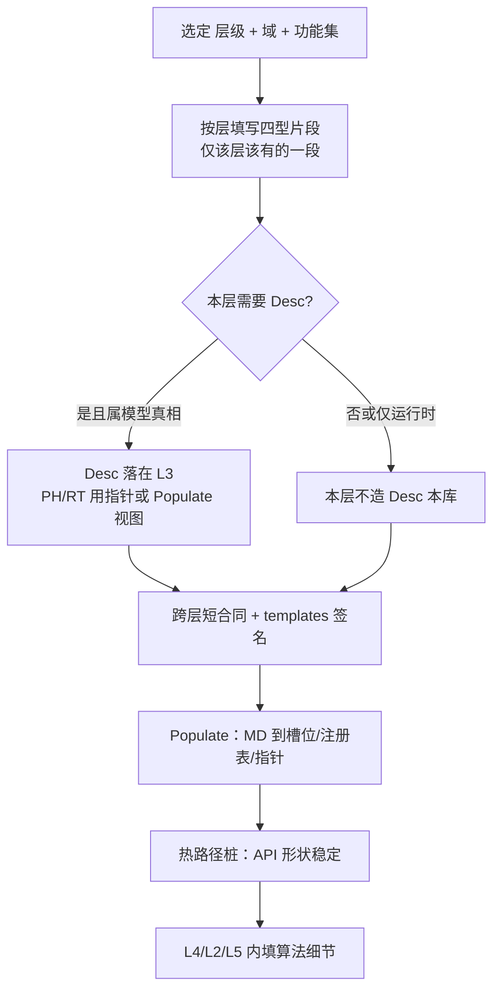

# UFC 单元 / 材料扩展：设计原则与完善方向

> **文档角色**：沉淀 **PH_XXX_UEL / PH_XXX_UMAT** 及同类内核扩展的**治理原则**与**目标设计**。  
> **数据流与 8-TYPE 对照**：见 [UFC_DataFlow_UEL_UMAT.md](../09_数据流转/UFC_DataFlow_UEL_UMAT.md)。  
> **合同（已定稿）**：见 `L4_PH/contracts/CONTRACT_UEL_UMAT_Element_Material.md`。  
> **状态**：**§1.1–§1.3、§5 已收敛**（2026-03-28）；模板 v4.1 与 `MD_Mat_Base_Algo` / `MD_Elem_Base_Desc` 代码字段已对齐。

---

## 1. 定位：在 UFC 整体中的角色

- **L3_MD**：持久 **Desc**（`MD_Elem_*_Desc`、`MD_Mat_*_Desc`）、**Section**、`MD_Sect_Registry`、分析前 **Algo**（`MD_Mat_Base_Algo` 等）。
- **L4_PH**：**热路径计算**——`PH_*_UEL_API`（单元）、`PH_*_UMAT_API`（材料点）；**Ctx** 每增量注入；**State** 在步内演化；材料 **专有 State** 在 PH 扩展 `MD_Mat_Base_State`。
- **L5_RT**：步进、装配顺序、收敛与 **pnewdt** 策略；向 L4 注入 `RT_Com_Base_Ctx` 与裸标量 `pnewdt`。
- **Adapter（ABI 层）**：ABAQUS UEL/UMAT 等 **扁数组** 仅在此处 pack/unpack；**不得**进入 `PH_*_UEL_API` / `PH_*_UMAT_API` 本体。

模板 `docs/templates/PH_XXX_UEL.f90`、`PH_XXX_UMAT.f90` 是上述 **L4 扩展剖面** 的规范骨架，与 **插件 / 二次开发**（扩展点）叙事一致。

### 1.1 实施口诀（L3 / L4 / L5 全范围）

> **先合同与四型边界，再 Populate，再算法。**

- **合同与四型边界**：先按层划定 **Desc / State / Algo / Ctx**（及 **8-TYPE 下限**：如 L5 以 `RT_Com_Base_Ctx` 与裸量为主，不在每层机械凑齐四件套）与 **跨层短合同**，模板与 `contracts/` 固定 **API 形状与只读/可写**；避免「先写热路径再补边界」导致暗道。  
- **Populate**：冷路径将 **MD 真相源** 写入注册表、槽位与指针；热路径 **只消费** Populate 结果，**零 L3**（见各域 `CONTRACT.md`）。  
- **算法**：在 **L4_PH**（本构/单元）、**L2_NM**（数值核）、**L5_RT**（步进与 Asm）中迭代实现；**类型骨架与签名宜稳定，实现可演进**。  

与三层联通、域边界与数据链对齐见：[UFC_系统化整治方案_域边界与链路打通.md](../03_实施规划/域分级重构/UFC_系统化整治方案_域边界与链路打通.md)（原「三层联通总规范」未随仓库迁移）。

### 1.2 两条限定（与 8-TYPE 下限、分层合同一致）

若不遵守以下两条，容易把「四大类」误解成「每层四个框必须先画满」，从而与当前 **8-TYPE 下限** 与各层 `CONTRACT.md` 冲突。

**限定一：「四大类」≠ 每一层都长齐四件套**

| 层 | 四型在当层的**更精确**落点（片段，非全集） |
|----|---------------------------------------------|
| **L3_MD** | 以 **Desc**（及必要的分析前 **Algo**，如 `MD_Mat_Base_Algo`）为主，描述「模型长什么样、分析前怎么配」。**Ctx / State 的步内热态**一般**不**作为 L3 的「每增量主载体」；步级元数据可在 Step 域 **Desc** 等中表达。 |
| **L4_PH** | 热路径以 **Ctx + State**（及 **PH_Algo** 迭代控制）为主；**Desc 仍在 MD**，经 **指针 / Populate 结果** 进入 PH，**不在 PH 再复制一套「材料 Desc 本库」**。 |
| **L5_RT** | 在 **8-TYPE 下限** 里主要是 **`RT_Com_Base_Ctx` + 裸量**（如 `pnewdt`），**不是**在 RT 里凑齐四套完整 TYPE 才开工。 |

结论：**骨架按「层职责 + 四型里该层该有的一段」来搭**，**不是**「L3 / L4 / L5 每层都先画满 Desc / State / Algo / Ctx 四个框再填」。

**限定二：「先骨架后算法」的工程顺序**（与 §1.1 口诀同向，更可操作）

1. **合同 / 模板**：先固定 **跨层边界**（谁只读、谁 `INOUT`、热路径禁 L3 等）——与 ABAQUS 四角色在 **语义** 上可对齐，但落地形态是 **typed + 分层**；**扁数组仅在 Adapter**。  
2. **Populate（冷路径）**：MD → 运行时槽位 / 指针 / 注册表，把 **Desc** 与 **步内只读配置** 准备好。  
3. **算法往里面长**：在 **L4_PH**（本构 / 单元核）、**L2_NM**（线代 / 求解器算子）、**L5_RT**（步进与 Asm 顺序）里迭代细节；**类型字段与 API 签名**尽量稳定，**实现**可持续替换。

**与「ABAQUS + 四大类」的关系（一句话）**  
ABAQUS 的 role（材料参数 / 历史量 / 步进控制 / 本步驱动）可映射到 UFC 的 Desc / State / Algo / Ctx，但 **「哪一段落在哪一层」由 UFC 合同切分**，**不是** 1:1 四个 TYPE 每层一份。

**模板的作用**：把 **分层后的最小公共形状** 固定下来，避免后面算法长出来时从扁数组或暗道绕回去。

### 1.3 按「层级 × 域 × 功能」搭骨架：清单、步骤、流程图

**问：能否逐层级、逐域级、逐功能，再对照 Desc / State / Algo / Ctx 列清单？**  
**答：可以。** 但必须套用 **§1.2 限定一**：每层只登记 **该层该承担的片段**，允许某格为 **空**、**仅指针**、或 **「本层不出现」**；禁止为了「表格好看」在 PH/RT 再造一套与 MD 重复的 Desc 本库。

**建议清单表头（每一行 = 一条骨架线）**

| 列 | 内容 |
|----|------|
| **层级** | L3_MD / L4_PH / L5_RT（涉及数值核时并列 **L2_NM**） |
| **域** | 如 Material、Element、StepDriver、Solver、Contact … |
| **功能集** | 如 UEL 装配、UMAT 点积、步进收敛、线代算子 |
| **四型片段** | 本层出现的 **Desc / State / Algo / Ctx** 的**一段**（注明只读 / `INOUT`、是否指针） |
| **合同 / 模板** | 对应 `L*_*/contracts/CONTRACT*.md` 或 `docs/templates/PH_XXX_*.f90` |
| **Populate** | 谁写槽位 / 注册表、热路径谁只读 |
| **热路径禁忌** | 如 **零 L3**、禁止扁数组进 `PH_*_API` |

**推荐步骤**

1. **选域 + 功能集**，在 PLAN / 域 README 里对齐 **调用方向**（谁调谁、步频）。  
2. **按层填「四型片段」列**（对照 §1.2 表，先 L3 再 L4 再 L5，缺格留空并写明理由）。  
3. **写或引用短合同**：字段所有者、生命周期、失败语义、`pnewdt`、维数来源。  
4. **定 Populate 契约**：MD 哪些字段写入哪类槽位；热路径只消费 Populate 结果。  
5. **落模板**：Fortran `MODULE` / `TYPE` / `SUBROUTINE` 签名与合同一致；**先空实现或桩，再填算法**。  
6. **再实现算法**：L4 本构与单元、L2 算子、L5 步进与 Asm；签名尽量不动，替换体内实现。

**流程图（搭骨架顺序）**

---

## 2. 核心原则（必须遵守）

### 2.1 合同优先（Contract-first）

对每一条跨模块热路径建立**短合同**（可放在 `contracts/` 或本文引用专篇），至少约定：

- 字段**所有者**（谁分配/释放）、**生命周期**（步前 / 步内 / 步后）；
- **失败语义**：谁写 `ErrorStatusType`、何时写 `pnewdt`、是否与 `PH_Mat_Algo%auto_cut` 联动；
- **维数约定**：`ndi` / `nshr` / `ntens` 的来源与只读传递路径。

### 2.2 Desc 只读，State 可写，Ctx 注入

- **Desc**：调用 `PH_*_API` 期间视为只读（多线程下尤甚）。
- **State**：本构与单元输出、历史量；可 `INOUT`。
- **Ctx**：由 L5 或 Adapter 在每次调用前填满；禁止在文档中把「隐式全局」当作长期方案。

### 2.3 内核与 ABI 分离

- 内核接口只认 **UFC 结构体**；
- 外部 ABI 只在 **Adapter** 出现；Adapter 与内核的字段映射表可单独成文或附于合同。

### 2.4 派发与特例解耦

- **拓扑特例**（如 C3D8、S4R）→ 独立 UEL 模块或共享拓扑内核。
- **本构特例**（如 J2、Neo-Hooke）→ 独立 UMAT 模块。
- **组合**通过 **Section → `CLASS(MD_Mat_Base_Desc)` + 统一材料派发** 完成，避免「N 材料 × M 单元」手写爆炸。

参考：[Material/PH_Mat_Phase4_Dispatch.md](../10_材料专项/PH_Mat_Phase4_Dispatch.md)。

---

## 3. 专项设计目标（与模板/实现应对齐）

### 3.1 叙事对齐（文档与类型）

- **统一表述**：`MD_Mat_Base_State` 在 L3 合同定义**共性材料状态**；**模型专有状态**用 `PH_Mat_<Model>_State` 在 L4 **扩展**，经同一 UMAT API 使用。
- **动作**：`PH_Mat_Types` 模块头注释与模板头注释应与此一致，避免「State 只属于 MD」的歧义。

### 3.2 维数与 NTENS

- **禁止**在 UMAT 内硬编码 `ntens = 6` 作为长期方案。
- **推荐**：由 **`MD_Mat_Base_Algo`** 或 **`PH_Mat_Base_Ctx`** 携带只读 `ndi` / `nshr` / `ntens`（在分析初始化时由单元族 + 分析类型写入）；UMAT 内对 `stress`、`dstran`、`ddsdde` 的切片**统一使用 `1:ntens`**。
- 与 `MD_Mat_Base_State` 中「平面应力 NTENS=4」等注释保持一致。

### 3.3 Section / 材料解析合同

**推荐解析链（默认路径，写进合同）**：

1. UEL 从 **`MD_Elem_Base_Desc`** 取得 **section 句柄**（约定如 `jprops(1)=section_id`，或与输入规范一致的唯一槽位）。
2. `MD_Sect_Registry%GetSectIdx(section_id)` → `sections(i)`。
3. 使用 **`sections(i)%mat_desc`**（`CLASS(MD_Mat_Base_Desc), POINTER`）进入 **SELECT TYPE** 或材料派发，**不依赖**未文档化的魔法下标。

备选：若 deck 以 **mat_id** 为主，可使用 `FindByMaterial` 等已有 API（与 [MD_Sect_Types](../../../ufc_core/L3_MD/Section/MD_Sect_Types.f90) 一致）。

参考：[ABAQUS_Section_Architecture.md](./ABAQUS_Section_Architecture.md)。

### 3.4 Desc：拷贝 vs 指针

- **默认**：热路径上传入 **`CLASS(MD_Mat_Base_Desc), POINTER`** 或指向 registry 内对象的指针语义；**避免**对含 **ALLOCATABLE/POINTER** 成员的大 Desc 做值拷贝。
- **例外**：仅当某 `MD_Mat_*_Desc` 为**纯标量、无指针**时，允许栈拷贝；在合同中标明 **白名单**。

模板中 `MD_Mat_Desc = mptr` 式赋值应改为 **指针关联** 或与合同一致的拷贝策略说明。

### 3.5 多材料派发

- UEL 侧：`SELECT TYPE (mat_desc)` 或调用与 `UF_Mat_*_Dispatch` 一致的**统一入口**。
- UMAT 侧：保持各 `PH_<Model>_UMAT_API`；派发层负责选型。
- 模板宜区分附录：**单材料绑定示例** vs **多材料派发示例**。

### 3.6 svars 布局

- 合同表建议包含：`ISV` 名、偏移、`每 IP 宽度`、与 `PH_Mat_*_State` 字段映射、与 `MD_Elem_Base_Desc%nsvars` 关系。
- UEL 模板中建议以 **`Pack_Svars_*` / `Unpack_Svars_*`** 子程序封装，避免在 IP 循环内散落魔法数。

参考：[UFC_UMAT_Props_Statev_Layout.md](./UFC_UMAT_Props_Statev_Layout.md)。

### 3.7 错误出口

- **目标**：仅靠 `pnewdt` 不足以表达全部失败原因。
- **已定案（与 §5 一致）**：**方案 A** — `PH_*_UEL_API` 增加 **`TYPE(ErrorStatusType), INTENT(OUT) :: uel_status`**。细则见 `CONTRACT_UEL_UMAT_Element_Material.md`。
- **历史备选（非默认）**：  
  - **B**：在 **`PH_Elem_Base_State`**（若扩展）中携带 `status`；  
  - **C**：受限场景下仅 `pnewdt` + 日志（须在合同中**显式**标注适用范围）。

`pnewdt` 仍表示时间步建议；与 `status` 的组合规则（如失败 + `auto_cut`）写在合同里。

### 3.8 UEL 形参与硬编码（如 `nip = 8`）

- **签名**：使用 **`CLASS(MD_Elem_Base_Desc)`** 多态 + **`Elem_GetNip(desc)`** 类辅助，或 **具体** `TYPE(Elem_C3D8_Desc)` 模板变体。
- **禁止**在生产模板中保留与拓扑矛盾的硬编码积分点数。

---

## 4. 载荷 / 边界 / 接触等后续模板（同一套路）

在 **不重复发明分层** 的前提下，按域增加模板：

| 域 | L3（Desc / 注册） | L4（Ctx / State / API） | L5 | Adapter |
|----|-------------------|-------------------------|-----|---------|
| 载荷 | `MD_Load_*_Desc`、幅值/曲线句柄 | `PH_Load_*_Ctx`、单元 RHS 贡献例程 | Driver、组装顺序 | 外部 DLOAD 等 |
| 边界 | `MD_BC_*_Desc` | `PH_BC_*` 约束残差/刚度修正 | 同上 | 外部 MPC 等 |
| 接触 | `MD_Cont_*_Desc`、接触对 | `PH_Cont_*_Ctx/State`、面元/罚函数核心 | 搜索、步进 | 外部 API |

**与 UEL 的边界**：体单元 UEL 聚焦 **B 阵 / 积分 / 本构**；**分布载荷** 宜在 **载荷装配** 或专用例程中使用 `PH_Elem_Base_Ctx` 中已有映射字段（如 `adlmag`/`ddlmag`）或专用 Load-Elem Ctx；**接触** 宜 **独立接触面元或装配层**，避免塞进单一 C3D8 UEL 文件。

参考：[LoadBC_FourCategories_Complete_Design.md](../07_设计文档/LoadBC_FourCategories_Complete_Design.md)、[UFC_Contact_Field_Contract.md](../07_设计文档/UFC_Contact_Field_Contract.md)、[UFC_Ldbc_Layer_Map.md](../07_设计文档/UFC_Ldbc_Layer_Map.md)。

---

## 5. 已收敛全局策略（§5 定案）

| # | 议题 | **唯一全局策略** | 落地 |
|---|------|------------------|------|
| 1 | **NTENS** | **`MD_Mat_Base_Algo`**：`ndi` / `nshr` / `ntens`（默认 `3,3,6`）；UMAT 用 `1:ntens` 切片，合法范围 `1..6`（与 `MD_Mat_Base_State` 存储一致）。 | `L3_MD/Material/MD_Mat_Types.f90`；`PH_XXX_UMAT` v4.1 |
| 2 | **Section 主键** | **`MD_Elem_Desc%jprops(1) = section_id`**；调用前 `jprops` 已分配且 `SIZE≥1`。 | `CONTRACT_…`；`PH_XXX_UEL` v4.1 |
| 3 | **UEL 错误** | **方案 A**：`PH_*_UEL_API` 增加 **`TYPE(ErrorStatusType), INTENT(OUT) :: uel_status`**。 | `PH_XXX_UEL` v4.1 |
| 4 | **材料 Desc** | **`CLASS(MD_Mat_Base_Desc), POINTER`** 取自 section；**禁止**对多态 Desc 做值拷贝；`SELECT TYPE` → `PH_*_UMAT_API`。 | `PH_XXX_UEL` v4.1 |
| 5 | **多材料** | **模板 A**：单材料文件 + `SELECT TYPE`。**模板 B**：props 路径走 **`UF_Mat_Eval_Dispatch`**（另设模块，不与本 UEL 骨架混写）。 | `CONTRACT_…` §1 表 |
| 6 | **`sect_registry`** | **显式参数**：`TYPE(MD_Sect_Registry), INTENT(IN), TARGET`，**第一实参**；删除模板内模块级 registry。 | `PH_XXX_UEL` v4.1 |
| 7 | **积分点数** | **`MD_Elem_Base_Desc%integ_npts`**，**>0** 必填（`0` 表示未设置，UEL 报错）。 | `L3_MD/Mesh/MD_Elem_Types.f90`；`PH_XXX_UEL` v4.1 |

细则与调用方义务见 **合同**：`L4_PH/contracts/CONTRACT_UEL_UMAT_Element_Material.md`。

---

## 6. 相关文档索引

| 文档 | 说明 |
|------|------|
| [UFC_DataFlow_UEL_UMAT.md](../09_数据流转/UFC_DataFlow_UEL_UMAT.md) | UEL→UMAT 数据流、8-TYPE、接口签名 |
| [ABAQUS_Section_Architecture.md](./ABAQUS_Section_Architecture.md) | Section 与材料桥 |
| [UFC_UMAT_Props_Statev_Layout.md](./UFC_UMAT_Props_Statev_Layout.md) | props/statev 布局 |
| [Material/PH_Mat_Phase4_Dispatch.md](../10_材料专项/PH_Mat_Phase4_Dispatch.md) | 材料派发 |
| [LoadBC_FourCategories_Complete_Design.md](../07_设计文档/LoadBC_FourCategories_Complete_Design.md) | 载荷/边界四类设计 |
| [UFC_Contact_Field_Contract.md](../07_设计文档/UFC_Contact_Field_Contract.md) | 接触字段合同 |
| [templates/PH_XXX_UEL.f90](../../templates/PH_XXX_UEL.f90)、[templates/PH_XXX_UMAT.f90](../../templates/PH_XXX_UMAT.f90) | 模板 **v4.1**（UEL 七参数 + `uel_status`；UMAT `ntens`） |

---

*修订时请更新文首「状态」行并递增本文档版本说明（可在 Git 提交信息中说明变更要点）。*
