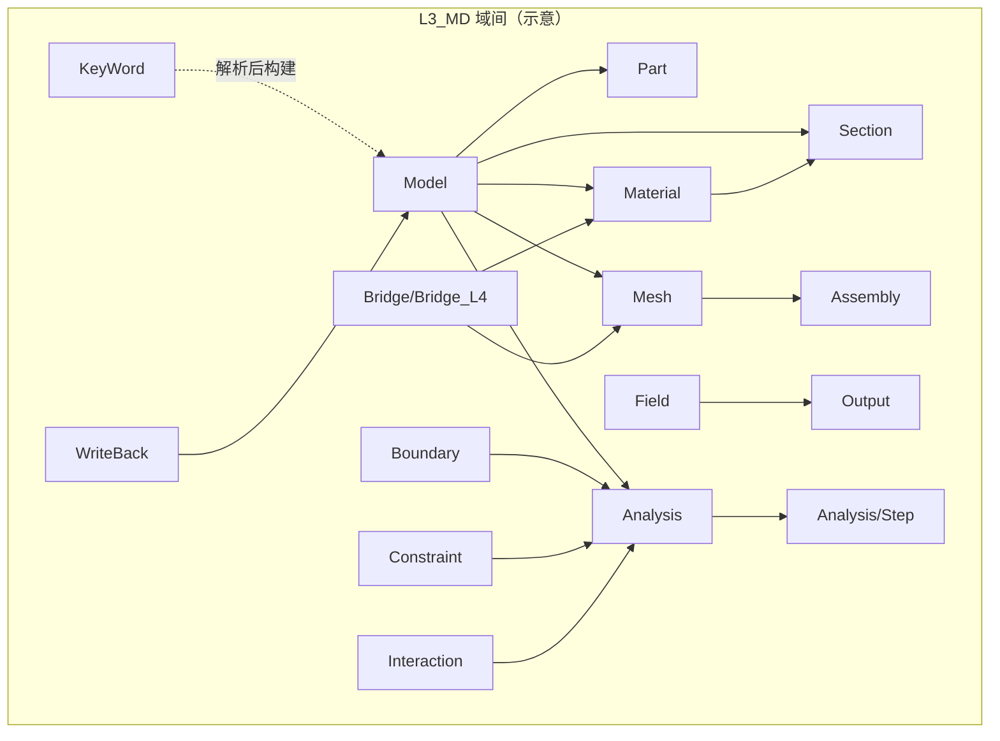
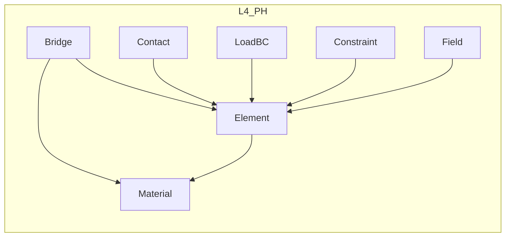
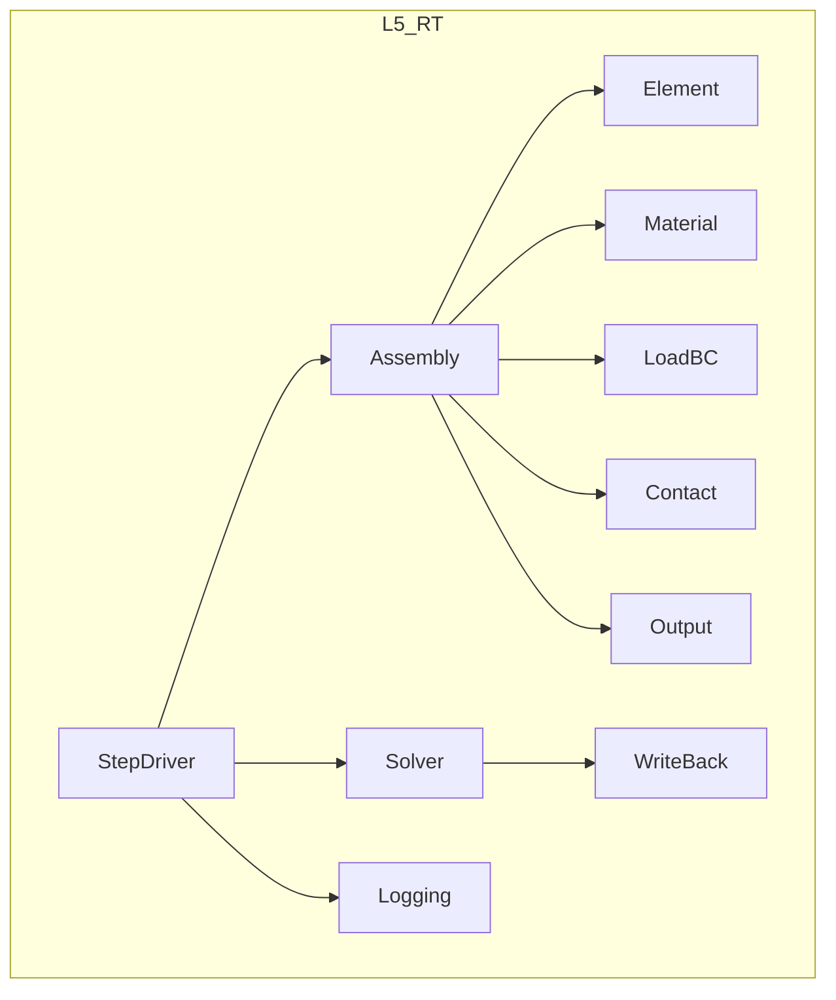
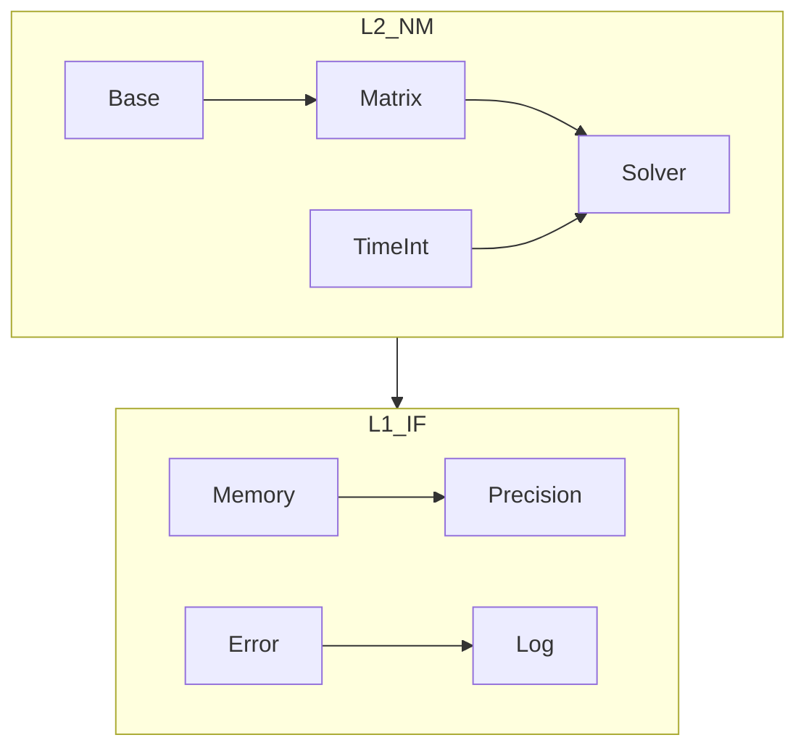
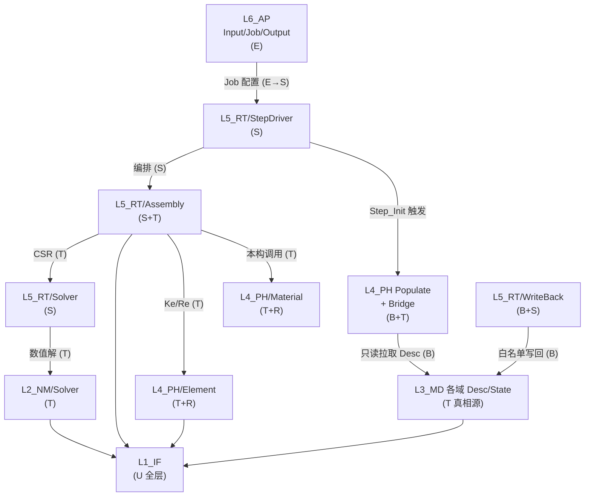

# UFC 全局域依赖图（55+ 域有向图）

> **文档版本**: v1.0  
> **创建日期**: 2026-04-25  
> **状态**: ACTIVE（与 `ufc_core` 目录基线同步；`USE` 细节以扫描为准）  
> **数据来源**: [`UFC_ufc_core_目录权威分类.md`](UFC_ufc_core_目录权威分类.md)（域桶真源）+ 架构单向依赖规则（L6→L5→L4→L3→L2→L1）  
> **关联**: [`UFC_端到端计算流主链.md`](UFC_端到端计算流主链.md) · [`UFC_三级存储策略.md`](../04_技术标准/UFC_三级存储策略.md)

---

## 0. 契约类型闭集（边标注）

| 代号 | 含义 | 典型载体 |
|------|------|----------|
| **T** | 合同 TYPE（Desc/State/Algo/Ctx 或其切片） | 跨层只读 Desc、Populate 输出 Ctx |
| **B** | Bridge（`*_Brg`、门面、切片） | `MD_*_PH_Brg`、`PH_BrgL3` |
| **S** | SIO（`*_Arg` + 五参/六参 `*_Proc`） | L5/Harness 编排边界 |
| **R** | Registry / 路由 | `PH_Elem_Reg_*`、`PH_Mat_Reg_*` |
| **U** | 模块 `USE` 直链（同层或已审跨层） | 层内域间 `USE` |
| **X** | 扩展点 | UEL/UMAT、用户子程序注册 |
| **E** | 外部边界 | L6 文件/Job、序列化 |

**跨层绘图规则（降噪）**：本图 **不** 画全量 `USE` 直链；层间仅标 **B / S / T** 类「合同边」。层内子图可含 **U / R**。

**验收口径（与推进计划一致）**：图中 **无** 跨层裸 **U** 类巨型上下文直链（已登记例外除外）；**无** 有向环（`L3→L4→L5→L3` 等）。

---

## 1. 域桶清单（≈55+，与目录基线对齐）

> **计数规则**：`ufc_core/<Layer>/<域桶>/` 为第一级域；`contracts` 等元目录不计入业务域数。

### L1_IF（9）

| # | 域桶 | 角色 |
|---|------|------|
| 1 | Base | 基础设施基类、并行/符号 |
| 2 | Error | 错误传播 |
| 3 | IO | I/O、Checkpoint |
| 4 | Log | 日志 |
| 5 | Memory | 内存池、Struct/Unstruct Pool |
| 6 | Monitor | 监控 |
| 7 | Precision | `IF_Prec`（wp/i4） |
| 8 | Registry | IF 侧注册表骨架 |

### L2_NM（6）

| # | 域桶 | 角色 |
|---|------|------|
| 9 | Base | BVH 等数值基元 |
| 10 | Bridge | L2 桥 |
| 11 | ExternalLibs | 外部库封装 |
| 12 | Matrix | 稀疏矩阵、CSR |
| 13 | Solver | 线性/非线性/耦合/并行求解 |
| 14 | TimeInt | 时间积分 |

### L3_MD（16）

| # | 域桶 | 角色 |
|---|------|------|
| 15 | Analysis | Step / Solver 配置 / Amplitude |
| 16 | Assembly | 模型级装配描述（非 L5 热装配） |
| 17 | Boundary | 边界条件 Desc |
| 18 | Bridge | L3→L4 / L3→L5 官方桥（**B**） |
| 19 | Constraint | 约束 Desc |
| 20 | Field | 场变量定义 |
| 21 | Interaction | 接触对、Surface Interaction |
| 22 | KeyWord | 关键字树（与 L6 解析衔接 **E**） |
| 23 | Material | 材料库、本构参数 **真相源** |
| 24 | Mesh | 网格、单元类型目录 **真相源** |
| 25 | Model | 模型容器 |
| 26 | Output | 输出请求 Desc |
| 27 | Part | Part 树 |
| 28 | Section | 截面 |
| 29 | WriteBack | 白名单字段定义（与 L5 成对 **B+T**） |
| — | contracts | 元合同，不计域桶 |

### L4_PH（7 + Bridge 子树）

| # | 域桶 | 角色 |
|---|------|------|
| 30 | Bridge | L4↔L3 查询、Populate 协同（**B**，禁止热路径写 L3） |
| 31 | Constraint | MPC 等 PH 侧 |
| 32 | Contact | 接触搜索/摩擦/显式核 |
| 33 | Element | 单元数值核（**T+R**） |
| 34 | Field | PH 场 |
| 35 | LoadBC | 载荷 PH 表示 |
| 36 | Material | 本构积分、slot_pool（**T+R**） |

### L5_RT（11）

| # | 域桶 | 角色 |
|---|------|------|
| 37 | Assembly | 全局 K/R 装配（**S+T**） |
| 38 | Bridge | RT 桥 |
| 39 | Contact | RT 接触编排 |
| 40 | Element | RT 单元驱动薄层 |
| 41 | LoadBC | RT 载荷施加 |
| 42 | Logging | 运行日志 |
| 43 | Material | RT 材料调度薄层 |
| 44 | Output | 场/历史输出 |
| 45 | Solver | RT↔L2 求解适配（**S**） |
| 46 | StepDriver | Step/Inc/Iter 状态机（**S**） |
| 47 | WriteBack | **唯一** L3 State 白名单写回（**B+S**） |

### L6_AP（8）

| # | 域桶 | 角色 |
|---|------|------|
| 48 | Bridge | AP 桥 |
| 49 | Config | Job 配置 |
| 50 | Input | 解析器、脚本（**E**） |
| 51 | Job | Job 生命周期 |
| 52 | Output | 文件/ODB 写出（**E**） |
| 53 | Registry | AP 注册 |
| 54 | Solver | AP 侧求解入口 |
| 55 | UI | 用户界面 |

**合计**：上表枚举 **≥55** 个域桶（L1 8+L2 6+L3 15+L4 7+L5 11+L6 8 = 55；若将 L3 `contracts` 与 L4 Bridge 子目录拆算可继续扩展行，以目录真源为准）。

---

## 2. 分层子图（Mermaid · 层内域关系概览）

### 2.1 L3_MD（模型真相源 · 域间逻辑）

**边类型（层内）**：多为 **T**（Desc 引用）+ **U**（实现 `USE`）；`Bridge_L4` 对外为 **B**。

### 2.2 L4_PH（物理计算 · 域间逻辑）

### 2.3 L5_RT（运行时编排）

### 2.4 L2_NM · L1_IF（工具与基础）

---

## 3. 跨层连接图（仅 B / S / T · 降噪）

**说明**：
- **L3→L4** 金线：**L4 Populate** 经 **B** 读 L3；**废弃** L3 主动 `MD_PH_RouteToConstitutive_Idx` 热路径（见 `MD_MatLibPH_Brg.f90` 头注释 · Phase 4）。
- **L4→L3 写**：仅允许经 **L5_RT/WriteBack**（**B+S**），禁止 L4 直写 Mesh/Material State。

---

## 4. 隐式风险登记（与 Phase 4 对齐）

| 风险 | 说明 | 处置 |
|------|------|------|
| 双桥接 | L3 `MD_MatLibPH_Brg` 与 L4 `PH_BrgL3` 职责重叠 | 热路径收敛 L4 Populate；L3 桥 **LEGACY** 标注 |
| G4 遗留 | `PH_Brg_ElementStiffAssembly` 曾越权计算 | 已改为 **DEPRECATED** 返回 `IF_STATUS_INVALID` |
| 收敛检查落层 | `MD_Conv_Check` 位于 L3 | 见主链文档 **歧义点 B**；参数 Desc 在 L3，执行建议 L5 |

---

## 5. 工具与维护

- **初稿生成**：可辅以 `UFC/tools/` 下脚本扫描 `USE`（待接入 CI 时与本文 §1 表对账）。  
- **更新触发**：`ufc_core` 域桶增删、`BRIDGE_INDEX` 变更、Phase 4 桥接收敛里程碑。

---

*本文档为 Phase 2 产出；跨层详细 `USE` 矩阵见各域 `CONTRACT.md` 域关系子表（A6）。*
