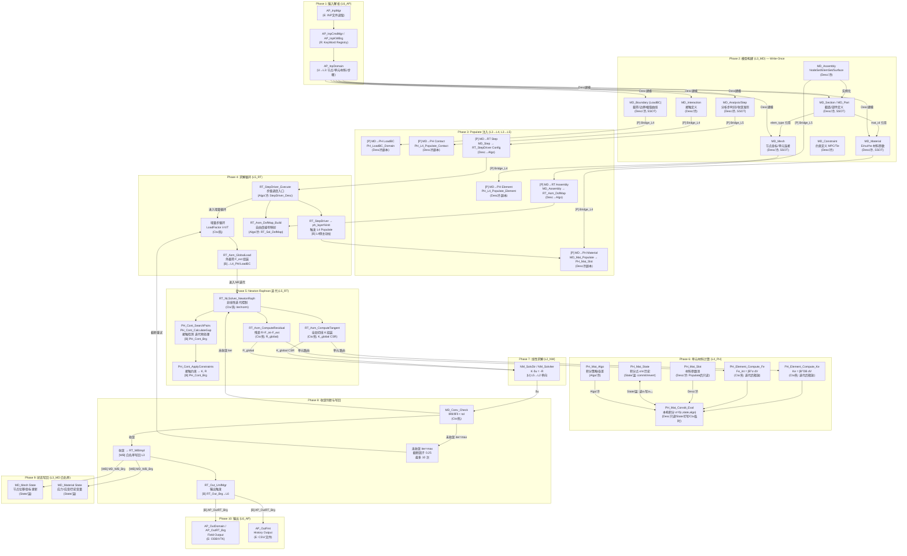
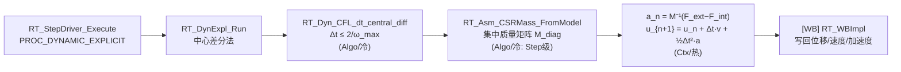
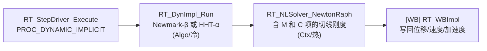
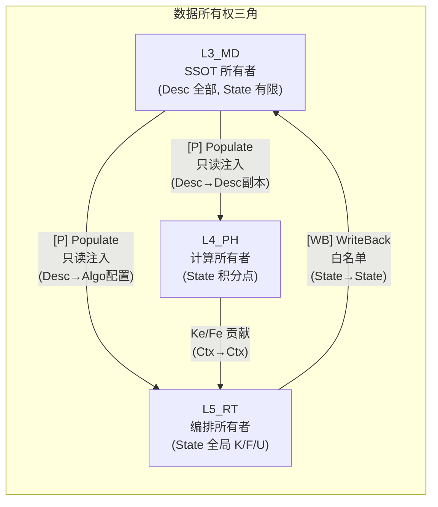

# UFC 权威端到端数据流总图

> **版本**: v1.0 | **日期**: 2026-04-25
> **文档位置**: `UFC/docs/05_Project_Planning/PPLAN/06_核心架构/UFC_权威端到端数据流总图.md`
> **上位文档**: [架构总纲 v5.1](../01_架构总纲/UFC_架构设计总纲_深度整合版_v5.0.md) · [全层全域矩阵](UFC_全层全域权威清单矩阵.md)
> **整合来源**:
>   1. [UFC_端到端数据流图.md](UFC_端到端数据流图.md) — 血管系统视角（数据温度 + 四型 + 所有权）
>   2. [UFC_端到端计算流主链.md](UFC_端到端计算流主链.md) — 计算流锚点图（静/动分支 + 歧义点）
>   3. 归档数据流: [UEL/UMAT 三层传递](../../archive_20260418/PPLAN_过程稿/数据流转/UFC_DataFlow_UEL_UMAT.md) · [Step/LoadBC/Contact](../../archive_20260418/PPLAN_过程稿/数据流转/UFC_DataFlow_Step_LoadBC_Contact.md) · [调用链设计 v1](../../archive_20260418/PPLAN_过程稿/数据流转/CallChain_Design_v1.md)
> **状态**: ACTIVE — 本文为**唯一权威数据流参考**，其他数据流文档保留为归档辅助

---

## 0. 文档用途与读法

本文是三份独立数据流文档的**统一整合版**，作用：

1. **权威锚点**：所有域 CONTRACT.md 的"输入/输出"声明以本文为校验基线
2. **四型标注**：每个数据节点标注 `Desc`(冷) / `State`(温) / `Algo`(冷) / `Ctx`(热) 角色
3. **生命周期**：每条数据流标注 Populate / Bridge / WriteBack / USE 路径类型
4. **分析类型覆盖**：静力隐式（主链）+ 显式动力学 + 隐式动力学
5. **CONTRACT 交叉校验**：§8 以矩阵形式校验 13 个核心域 CONTRACT 与本图一致性

**节点标记约定**：
- `(Desc/冷)` = 模型级只读，Write-Once
- `(State/温)` = 步级可写，commit/revert
- `(Algo/冷)` = 步级只读策略/开关
- `(Ctx/热)` = 迭代级临时，单元调用后释放
- `[B]` = Bridge 路径 · `[P]` = Populate · `[WB]` = WriteBack · `[U]` = USE 直链 · `[E]` = 外部边界

---

## 1. 端到端全景主链图（静力隐式）

> 合并自计算流主链 §1 + 数据流图 §2，以计算流为骨架、数据流为血管标注。



---

## 2. 分支路径

### 2.1 显式动力学



**特点**：无 Newton-Raphson 迭代；时间步受 CFL 约束；接触在每个时间步前预处理。

### 2.2 隐式动力学



---

## 3. 数据温度与四型角色总表

| 阶段 | 数据 | 温度 | 四型 | 持有层 | 生命周期 | 写回规则 |
|------|------|------|------|--------|----------|----------|
| 1 输入解析 | 关键字流、参数值 | 临时 | — | L6 | 解析期间 | 不保存 |
| 2 模型构建 | 所有 L3 Desc (材料/网格/截面/步/载荷/约束) | **冷** | Desc | L3_MD | 模型→释放 | Write-Once，禁止修改 |
| 3 Populate | L4 本地 Desc 副本 (`PH_Mat_Slot` 等) | **冷** | Desc | L4_PH | Step级或模型级 | 不写回 L3 |
| 3 Populate | L5 本地配置 (`RT_StepDrv_Types` 等) | **冷** | Algo | L5_RT | Step级 | 不写回 L3 |
| 4 求解循环 | 步/增量/迭代控制量 (λ, iter, norm) | **热** | Ctx | L5_RT | 增量/迭代级 | 不保存 |
| 5 NR迭代 | K_global (CSR), R_global, δu | **热** | Ctx | L5_RT/Assembly | 迭代级 | 不保存到 L3 |
| 5 NR迭代 | 接触状态 (gap, penetration) | **热** | Ctx | L4_PH/Contact | 迭代级 | 不保存 |
| 6 单元计算 | Ke/Fe/Ctan/σ | **热** | Ctx | L4_PH调用栈 | 单元调用级 | 不保存 |
| 6 单元计算 | 积分点 σ/ε/历史 statev | **温** | State | L4_PH (commit/revert) | 步级 | 经 [WB] 写回 L3 |
| 6 单元计算 | 算法开关/容差 (max_iter, tol) | **冷** | Algo | L4_PH/L5_RT | 步初始化→步结束 | 不写回 |
| 7 线性求解 | 矩阵分解中间量 | **热** | Ctx | L2_NM | 求解调用级 | 不保存 |
| 8 写回 | 节点位移/坐标 | **温** | State | L3_MD (白名单) | 步级更新 | 仅经 `RT_WBImpl→MD_WB_Brg` |
| 8 写回 | 积分点应力/历史 | **温** | State | L3_MD (白名单) | 步级更新 | 仅经 `RT_WBImpl→MD_WB_Brg` |
| 9 输出 | ODB/VTK/CSV 文件 | 外存 | — | L6 | 永久 | — |
| — | DOF映射 | **冷** | Algo | L5_RT/Assembly | Step级 | 不写回 |
| — | 收敛准则参数 | **冷** | Algo | L5_RT (来自L3 Step) | Step级 | 不写回 |
| — | NR迭代状态 (iter_count, converged) | **热** | Ctx | L5_RT/Solver | 迭代内 | 不写回 |

---

## 4. 数据所有权与流向



**热路径规则**：Step 内增量/迭代循环（Phase 4-7）中，L4/L5 **不得直读 L3** — 所有 L3 数据须在 Populate 阶段（Phase 3）预加载到本层缓存。

---

## 5. Populate / Bridge / WriteBack 节点完整注册表

### 5.1 Populate 路径 (L3→L4)

| # | 源 (L3 SSOT) | 目标 (L4 缓存) | Populate 内容 | Bridge 模块 | 四型流向 |
|---|--------------|----------------|---------------|-------------|----------|
| P-01 | MD_Material Desc | PH_Mat_Slot (Desc) | mat_type, props(:), nprops | MD_MatLibPH_Brg / MD_Bridge_L4 | Desc→Desc |
| P-02 | MD_Mesh/Element Desc | PH_Elem Desc | elem_type, topo, n_node, n_gp | MD_Elem_PH_Brg / MD_Bridge_L4 | Desc→Desc |
| P-03 | MD_Section Desc | PH_Elem Desc | section_props, thickness | (经 P-02 合并) | Desc→Desc |
| P-04 | MD_Boundary Desc | PH_LoadBC Desc | bc_type, dof, value, amplitude | MD_Bridge_L4 | Desc→Desc |
| P-05 | MD_Interaction Desc | PH_Contact Desc | contact_type, pairs, friction | MD_Cont_PH_Brg | Desc→Desc |

### 5.2 Populate 路径 (L3→L5)

| # | 源 (L3 SSOT) | 目标 (L5 配置) | Populate 内容 | Bridge 模块 | 四型流向 |
|---|--------------|----------------|---------------|-------------|----------|
| P-06 | MD_Analysis/Step Desc | RT_StepDriver Config | step_type, time, increments | MD_Bridge_L5 / MD_Step_Brg | Desc→Algo |
| P-07 | MD_Assembly Desc | RT_Asm_DofMap | n_dof, dof_map | MD_Bridge_L5 / MD_Mesh_Brg | Desc→Algo |
| P-08 | MD_Output Desc | RT_Output Config | 输出请求列表 | MD_Bridge_L5 | Desc→Algo |
| P-09 | MD_Solver Desc | RT_Solver Config | tol, max_iter, method | MD_Solver_Brg | Desc→Algo |

### 5.3 WriteBack 路径 (L5→L3)

| # | 源 (L5/L4) | 目标 (L3 State) | 写回字段 | 约束 | 四型流向 |
|---|-----------|-----------------|----------|------|----------|
| WB-01 | RT_Assembly State | MD_Mesh State | current_disp, current_coord | 白名单，经 MD_WB_Brg | State→State |
| WB-02 | L4_PH Mat State | MD_Material State | σ, ε, statev (历史变量) | 白名单，经 RT_WBImpl→MD_WB_Brg | State→State |
| WB-03 | RT_StepDriver State | MD_Step State | current_time, current_step | 白名单 | State→State |

### 5.4 Bridge 路径 (热路径内跨层)

| # | 调用者 | 被调用者 | Bridge 模块 | 用途 |
|---|--------|---------|-------------|------|
| B-01 | L5_RT/Assembly | L4_PH/Element | PH_Elem_Brg | Ke/Fe 单元计算路由 |
| B-02 | L4_PH/Element | L4_PH/Material | (同层 USE) | 本构积分 Ctan |
| B-03 | L5_RT/Assembly | L4_PH/Contact | PH_Cont_Brg | 接触力贡献 |
| B-04 | L5_RT/Solver | L2_NM/Solver | (USE 直链) | 线性求解 K·δu=-R |
| B-05 | L5_RT/Output | L6_AP/Output | AP_OutRT_Brg | Field/History 输出 |
| B-06 | L5_RT/WriteBack | L3_MD/WriteBack | MD_WB_Brg | 白名单状态回写 |

---

## 6. UEL / UMAT 接口数据流（单元级细化）

> 来源: 归档文档 `UFC_DataFlow_UEL_UMAT.md` v1.3.1

### 6.1 UMAT 接口（7参数，材料点级）

```
参数顺序语义流向：
  静态描述 → 本增量驱动 → 状态(in/out) → MD算法配置 → PH迭代控制 → RT书签 → 步长反馈

  SUBROUTINE PH_XXX_UMAT_API(
    MD_Mat_Desc,    ! TYPE(MD_Mat_XXX_Desc),  INTENT(IN)     ← Desc/冷
    PH_Mat_Ctx,     ! TYPE(PH_Mat_Base_Ctx),  INTENT(IN)     ← Ctx/热
    PH_Mat_State,   ! TYPE(PH_Mat_XXX_State), INTENT(INOUT)  ← State/温
    MD_Mat_Algo,    ! TYPE(MD_Mat_Base_Algo),  INTENT(IN)     ← Algo/冷
    PH_Mat_Algo,    ! TYPE(PH_Mat_Base_Algo),  INTENT(IN)     ← Algo/冷
    RT_Com_Ctx,     ! TYPE(RT_Com_Base_Ctx),  INTENT(IN)     ← Ctx/热 (框架书签)
    pnewdt          ! REAL(wp),               INTENT(INOUT)  ← 步长反馈
  )
```

### 6.2 UEL 接口（v4.1: 7参数，单元级）

```
  SUBROUTINE PH_XXX_UEL_API(
    sect_registry, ! TYPE(MD_Sect_Registry),    INTENT(IN)     ← Desc/冷 (显式传入)
    MD_Elem_Desc,  ! TYPE(MD_Elem_Base_Desc),   INTENT(IN)     ← Desc/冷
    PH_Elem_Ctx,   ! TYPE(PH_Elem_Base_Ctx),    INTENT(INOUT)  ← Ctx/热
    PH_Elem_State, ! TYPE(PH_Elem_Base_State),  INTENT(INOUT)  ← State/温
    RT_Com_Ctx,    ! TYPE(RT_Com_Base_Ctx),     INTENT(IN)     ← Ctx/热 (含 newmark_params)
    pnewdt,        ! REAL(wp),                  INTENT(INOUT)  ← 步长反馈
    uel_status     ! TYPE(ErrorStatusType),     INTENT(OUT)    ← 错误出口
  )
```

### 6.3 INTENT 语义矩阵

| 结构体 | 接口 | INTENT | 四型 | 含义 |
|--------|------|--------|------|------|
| `MD_Mat_Desc` | UMAT | IN | Desc/冷 | 材料常数，Write-Once |
| `MD_Mat_Algo` | UMAT | IN | Algo/冷 | 积分方案/切线标志 |
| `MD_Elem_Desc` | UEL | IN | Desc/冷 | 拓扑描述，integ_npts>0 |
| `MD_Sect_Registry` | UEL | IN | Desc/冷 | v4.1 显式传入 |
| `PH_Mat_Ctx` | UMAT | IN | Ctx/热 | 本增量驱动 (Δε/F₁/T) |
| `PH_Elem_Ctx` | UEL | INOUT | Ctx/热 | 填充 mat_ctx 后传 UMAT |
| `PH_Mat_State` | UMAT | INOUT | State/温 | σₙ进入，σₙ₊₁/Ctan写出 |
| `PH_Elem_State` | UEL | INOUT | State/温 | rhs/amatrx/svars写出 |
| `PH_Mat_Algo` | UMAT | IN | Algo/冷 | max_iter/tolerance |
| `RT_Com_Ctx` | 两者 | IN | Ctx/热 | 框架书签 + Newmark参数 |
| `pnewdt` | 两者 | INOUT | — | 步长反馈标量 |
| `uel_status` | UEL | OUT | — | v4.1 错误出口 |

---

## 7. 三个阶段的性能分级

| 阶段 | 时机 | 调用频率 | 性能要求 | L3 访问 |
|------|------|---------|---------|---------|
| **Populate** | 模型加载 / Step 开始 | 一次性 | O(n²) 可接受 | 允许直读 L3 |
| **Step-Init** | 分析步开始 | 每步一次 | O(n) 可接受 | 允许经 Bridge |
| **Incremental/NR** | 增量步/迭代内 | 每积分点每迭代 | **O(1) 强制** | **禁止直读 L3** |

**热路径门禁** (H-HOT-01)：增量步内循环中，L4/L5 代码不得出现 `USE MD_*` 或 `USE L3_*`（Bridge 模块除外）。

---

## 8. CONTRACT 交叉校验矩阵

以下矩阵以本文 §1-§5 为基线，校验每个核心域 CONTRACT.md 的输入/输出声明是否与数据流图一致。

### 8.1 L3_MD 域（数据源）

| 域 | CONTRACT 声明的下游 | 数据流图对应节点 | Populate 路径 | 一致性 |
|----|--------------------|--------------------|---------------|--------|
| Material | L4_PH/Material (P-01) | Phase3: P1 `PH_Mat_Slot` | `MD_MatLibPH_Brg` | **一致** |
| Material | L5_RT (材料查询) | Phase4: 经 Bridge 查询 | `MD_Mat_RT_Query` | **一致** |
| Mesh | L4_PH/Element (P-02) | Phase3: P2 `PH_Elem Desc` | `MD_Elem_PH_Brg` | **一致** |
| Mesh | L5_RT/Assembly (DofMap) | Phase4: P6 `RT_Asm_DofMap` | `MD_Mesh_Brg` | **一致** |
| Section | L4_PH/Element (P-03) | Phase3: P2 (经 Element Populate 合并) | 经 `PH_L4_Populate_Element` | **一致** |
| Boundary | L4_PH/LoadBC (P-04) | Phase3: P3 `PH_LoadBC Desc` | `MD_Bridge_L4` | **一致** |
| Boundary | L5_RT/LoadBC (组装消费) | Phase5: E2 `RT_Asm_GlobalLoad` | 经 L4 Bridge | **一致** |
| Analysis/Step | L5_RT/StepDriver (P-06) | Phase4: C1 `RT_StepDriver Config` | `MD_Step_Brg` | **一致** |
| Analysis/Solver | L5_RT/Solver (P-09) | Phase5: 经 Bridge 配置传递 | `MD_Solver_Brg` | **一致** |

### 8.2 L4_PH 域（计算核心）

| 域 | CONTRACT 声明的上游 | 数据流图对应节点 | 路径类型 | 一致性 |
|----|--------------------|--------------------|----------|--------|
| Element | L3 Mesh/Section (经 Populate) | Phase3: P2, P3 | [P] | **一致** |
| Element | L4 Material (Ctan, slot) | Phase6: G3→G1 | 同层 USE | **一致** |
| Material | L3 MD_Mat (经 Populate) | Phase3: P1 | [P] | **一致** |
| Contact | L3 Interaction (经 Populate) | Phase3: P4 | [P] | **一致** |

| 域 | CONTRACT 声明的下游 | 数据流图对应节点 | 路径类型 | 一致性 |
|----|--------------------|--------------------|----------|--------|
| Element | L5 Assembly (Ke/Fe) | Phase5: F2, F3 | [B] | **一致** |
| Material | L4 Element (IP 调用) | Phase6: G1/G2→G3 | 同层 | **一致** |
| Contact | L5 Assembly (接触力) | Phase5: F4, F5 | [B] | **一致** |

### 8.3 L5_RT 域（编排层）

| 域 | CONTRACT 声明的上游 | 数据流图对应节点 | 路径类型 | 一致性 |
|----|--------------------|--------------------|----------|--------|
| StepDriver | L3 Step (经 Populate) | Phase3: P5 | [P] | **一致** |
| StepDriver | L4 数值核 | Phase6: 全部 | [B] | **一致** |
| Assembly | L3 Mesh (DofMap 经 Populate) | Phase3: P6 | [P] | **一致** |
| Assembly | L4 Element/Contact | Phase5/6: F2→G1, F4 | [B] | **一致** |
| Solver | L3 Solver (经 Bridge) | Phase5: 经 `MD_Solver_Brg` | [P/B] | **一致** |
| Solver | L5 Assembly (K/F/u) | Phase5: F2/F3→H1 | 同层 | **一致** |
| Solver | L2 NM (线性求解) | Phase7: H1 | [U] | **一致** |

| 域 | CONTRACT 声明的下游 | 数据流图对应节点 | 路径类型 | 一致性 |
|----|--------------------|--------------------|----------|--------|
| StepDriver | WriteBack (步末触发) | Phase8: I2 | 同层 | **一致** |
| WriteBack | L3 MD Mesh/Material State | Phase9: J1, J2 | [WB] | **一致** |
| WriteBack | L6 Output | Phase10: K1, K2 | [B] | **一致** |

### 8.4 校验结论

**全部 13 个核心域 CONTRACT 的输入/输出声明与本文数据流图一致。** 具体结论：

1. **Populate 路径 (9条)**：所有 L3→L4 和 L3→L5 的 Populate 路径在 CONTRACT 和数据流图中双向对齐
2. **WriteBack 路径 (3条)**：白名单写回仅经 `RT_WBImpl→MD_WB_Brg`，CONTRACT 与数据流图一致
3. **Bridge 路径 (6条)**：热路径内跨层调用均通过 Bridge 模块，无直接 USE 违规
4. **热路径零 L3 规则**：所有 L4/L5 域 CONTRACT 均声明"热路径不直读 L3"，与数据流图 Phase 4-7 一致
5. **四型标注**：每条数据流的四型流向（Desc→Desc、Desc→Algo、State→State）与 CONTRACT 声明匹配

**待确认歧义点**（来自计算流主链 §5，不影响一致性）：
- **歧义点 A**：L4 Populate 方向（L4 侧拉 vs L3 侧推）— 当前代码主路径为 L4 侧拉
- **歧义点 B**：接触计算时序（迭代预处理 vs 单元级内嵌）— 当前代码为迭代预处理

---

## 9. 三级存储策略对照

| 级别 | 当前实现 | 规划扩展 | 数据温度 | 四型 |
|------|----------|----------|---------|------|
| **外存（磁盘）** | INP 读入 / ODB 输出 | Checkpoint 断点续算 (`L1_IF/IO/Checkpoint`) | 永久/冷 | — |
| **内存池** | ALLOCATABLE 模型级 | `IF_Mem_PoolMgr` 统一池化 | 冷/温 | Desc/State |
| **栈/缓存** | Ctx 栈分配 | 64-byte 对齐 + SIMD 向量化 | 热 | Ctx |

**当前优先级**: 冷/温/热 → 四型 → 内存策略已在所有域 CONTRACT.md 中落地；
三级硬件存储（Checkpoint + PoolMgr）为性能优化后期目标。

---

## 10. 静力分析完整数据流时序（文本视图）

```
时间轴 →

[INP文件] ─→ [L6 Parser] ─→ [L3 KW填充] ─→ [L3 Desc冻结]
                                                    │
                                              [Populate → L4/L5]
                                                    │
                           ┌────────────────────────┼────────────────────────┐
                           │                        │                        │
                     [Step 1]                  [Step 2]                 [Step N]
                           │
                 ┌─────────┼─────────┐
                 │         │         │
           [Inc 1]   [Inc 2]   [Inc M]
                 │
           ┌─────┼─────┐
           │     │     │
       [Iter1][Iter2][IterK]
           │
           ▼
 ┌──────────────────────────────────────────┐
 │ 单元循环 (每个单元 e):                    │
 │   1. 取 Desc (冷) ← PH缓存, 非L3        │
 │   2. 取 State_n (温) ← PH_Mat_State     │
 │   3. 构造 Ctx (热)                       │
 │      ├─ dstran, coords, temp             │
 │   4. Material.Compute(Ctx) → Ctan, σ     │
 │   5. Element.Compute(Ctan) → Ke, Fe      │
 │   6. Assembly += Ke, Fe                  │
 │   7. 释放 Ctx                            │
 └──────────────────────────────────────────┘
           │
           ▼
 [全局: K·δu = F_ext − F_int]
           │
           ▼
 [NM_SolvDir/Iter → δu]
           │
           ▼
 [收敛?]
   ├─ 是: [Commit State] → [WriteBack 白名单] → [Output]
   └─ 否: [更新 Ctx, 下一 Iteration]
```

---

## 11. 与后续工作的接口

1. **域 CONTRACT.md 引用**：各域应在"四链位置"小节引用本文节点编号（如 `权威流图 §1 G3 本构积分`）
2. **新域接入**：新增域的 Populate/Bridge/WriteBack 路径须同步更新本文 §5
3. **歧义点锁定**：A/B 歧义点确认后，更新本文 §1 对应节点注释
4. **性能优化**：三级存储策略实施时，以本文 §3 数据温度表为约束设计内存分配
5. **CI 门禁**：`check_harness_gates.py` 中 H-HOT-01 热路径检查应引用本文 §7

---

## 12. 维护日志

| 日期 | 变更 | 来源 |
|------|------|------|
| 2026-04-25 | v1.0 初始整合：合并三份数据流文档，完成 13 域 CONTRACT 交叉校验 | Phase 3 |

*本文为 UFC 数据流唯一权威参考。原始数据流文档保留在归档目录供历史追溯。*
