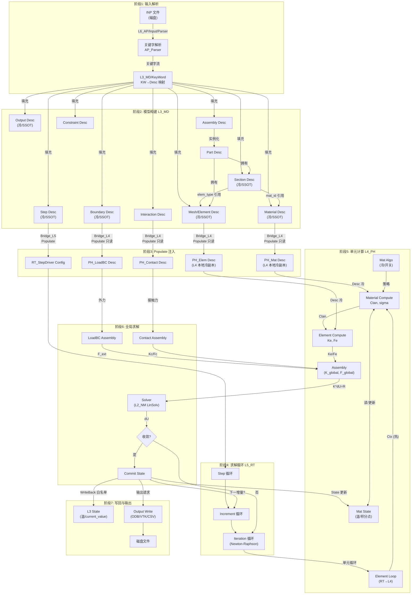
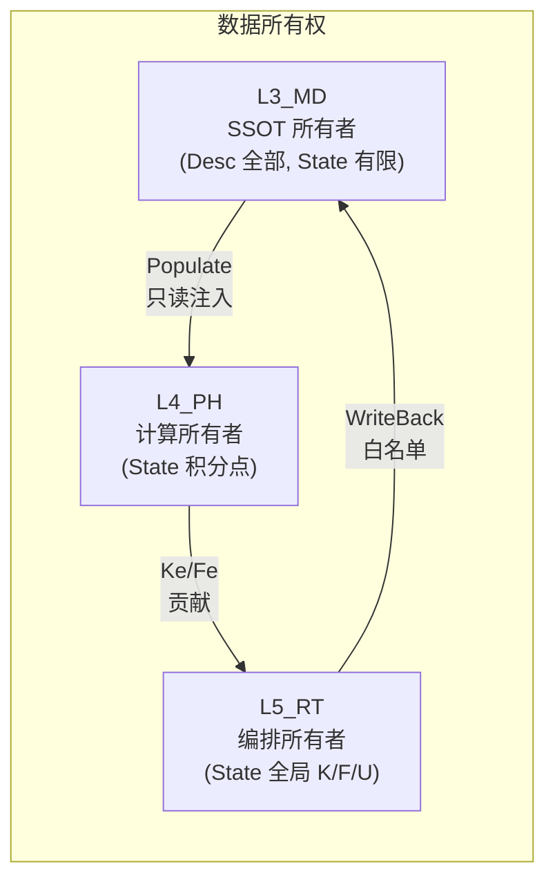

# UFC 端到端数据流图

> **版本**: v1.0 | **日期**: 2026-04-25
> **关联**: [架构总纲 v5.1](../01_架构总纲/UFC_架构设计总纲_深度整合版_v5.0.md) · [全层全域矩阵](UFC_全层全域权威清单矩阵.md) · [数据结构规范](../../UFC_数据结构与结构体规范.md)
>
> **⚠ 本文已整合至 → [UFC_权威端到端数据流总图.md](UFC_权威端到端数据流总图.md)**（唯一权威数据流参考）。本文保留作为独立视角的辅助参考。

---

## 一、总览：血管系统视角

UFC 的数据从外部输入（INP 文件）到最终输出（ODB/VTK），经历完整的六层流转。
本文以 **数据温度（冷/温/热）+ 四型（Desc/State/Algo/Ctx）** 为标注维度，
追踪每一步数据的产生、消费、变换与归宿。

---

## 二、端到端主流程图



---

## 三、数据温度与四型标注

### 3.1 按阶段的数据温度

| 阶段 | 产生的数据 | 温度 | 四型 | 生命周期 |
|------|-----------|------|------|----------|
| 1 输入解析 | 关键字流、参数值 | 临时 | — | 解析期间 |
| 2 模型构建 | 所有 L3 Desc | **冷** | Desc | 模型→释放 |
| 3 Populate | L4 本地 Desc 副本 | **冷** | Desc | Step 级或模型级 |
| 4 求解循环 | 步/增量/迭代控制量 | **热** | Ctx | 增量/迭代级 |
| 5 单元计算 | Ke/Fe/Ctan/sigma | **热** | Ctx | 单元调用级 |
| 5 单元计算 | 积分点 stress/statev | **温** | State | 步级(commit/revert) |
| 5 单元计算 | 算法开关/容差 | **冷** | Algo | 步初始化→步结束 |
| 6 全局求解 | K_global/F_global/dU | **热** | Ctx | 迭代级 |
| 7 写回 | L3 State 有限字段 | **温** | State | 步级更新 |
| 7 输出 | ODB/VTK 文件 | 外存 | — | 永久 |

### 3.2 数据流向与所有权



---

## 四、Populate / Bridge / WriteBack 节点详解

### 4.1 Populate 路径（L3→L4）

| 源 (L3) | 目标 (L4) | Populate 内容 | Bridge 模块 |
|----------|-----------|---------------|-------------|
| MD_Material Desc | PH_Mat Desc | mat_type, props(:), nprops | MD_Bridge_L4 |
| MD_Mesh/Element Desc | PH_Elem Desc | elem_type, topo, n_node, n_gp | MD_Bridge_L4 |
| MD_Boundary Desc | PH_LoadBC Desc | bc_type, dof, value, amplitude | MD_Bridge_L4 |
| MD_Interaction Desc | PH_Contact Desc | contact_type, pairs, friction | MD_Bridge_L4 |
| MD_Section Desc | PH_Elem Desc | section_props, thickness | MD_Bridge_L4 |

### 4.2 Populate 路径（L3→L5）

| 源 (L3) | 目标 (L5) | Populate 内容 | Bridge 模块 |
|----------|-----------|---------------|-------------|
| MD_Analysis/Step Desc | RT_StepDriver Config | step_type, time, increments | MD_Bridge_L5 |
| MD_Assembly Desc | RT_Assembly Config | n_dof, dof_map | MD_Bridge_L5 |
| MD_Output Desc | RT_Output Config | 输出请求列表 | MD_Bridge_L5 |

### 4.3 WriteBack 路径（L5→L3）

| 源 (L5) | 目标 (L3) | 写回字段 | 约束 |
|----------|-----------|----------|------|
| RT_StepDriver State | MD_Analysis/Step State | current_time, current_step | 白名单 |
| RT_Assembly State | MD_WriteBack State | current_value (位移/反力) | 白名单 |

---

## 五、静力分析完整数据流时序

```
时间轴 →

[INP文件] ─→ [L6 Parser] ─→ [L3 KW填充] ─→ [L3 Desc冻结]
                                                    │
                                                    ▼
                                             [Populate → L4/L5]
                                                    │
                              ┌─────────────────────┼─────────────────────┐
                              │                     │                     │
                        [Step 1]               [Step 2]              [Step N]
                              │
                    ┌─────────┼─────────┐
                    │         │         │
              [Inc 1]   [Inc 2]   [Inc M]
                    │
              ┌─────┼─────┐
              │     │     │
          [Iter1][Iter2][IterK]
              │
              ▼
    ┌──────────────────────────────────────┐
    │ 单元循环 (每个单元 e):               │
    │   1. 取 Desc (冷)                    │
    │   2. 取 State_n (温)                 │
    │   3. 构造 Ctx (热)                   │
    │      ├─ dstran, coords, temp         │
    │   4. Material.Compute(Ctx) → Ctan    │
    │   5. Element.Compute(Ctan) → Ke,Fe   │
    │   6. Assembly += Ke, Fe              │
    │   7. 释放 Ctx                        │
    └──────────────────────────────────────┘
              │
              ▼
    [全局: K*dU = F_ext - F_int]
              │
              ▼
    [NM_LinSolv.Solve → dU]
              │
              ▼
    [收敛? → 是: Commit State, WriteBack, Output]
            [→ 否: 更新 Ctx, 下一 Iteration]
```

---

## 六、三级存储策略对照（当前 + 规划）

| 级别 | 当前实现 | 规划扩展 | 数据温度对应 |
|------|----------|----------|-------------|
| **外存（磁盘）** | INP 读入 / ODB 输出 | Checkpoint 断点续算 (`L1_IF/IO/Checkpoint`) | 永久/冷 |
| **内存池** | ALLOCATABLE 模型级 | `IF_Mem_PoolMgr` 统一池化 | 冷/温 |
| **栈/缓存** | Ctx 栈分配 | 64-byte 对齐 + SIMD 向量化 | 热 |

**当前优先级**: 先确保冷/温/热→四型→内存策略在所有域 CONTRACT.md 中落地；
三级硬件存储（Checkpoint + PoolMgr）为 Phase C 性能优化目标。

---

## 七、维护

- 新增域的 Populate/Bridge/WriteBack 路径须同步更新本文 §4
- 数据流变更须与相关 CONTRACT.md 保持一致
- 可用 `mermaid-cli` 导出为 PNG/SVG 供评审

*最后更新: 2026-04-25*