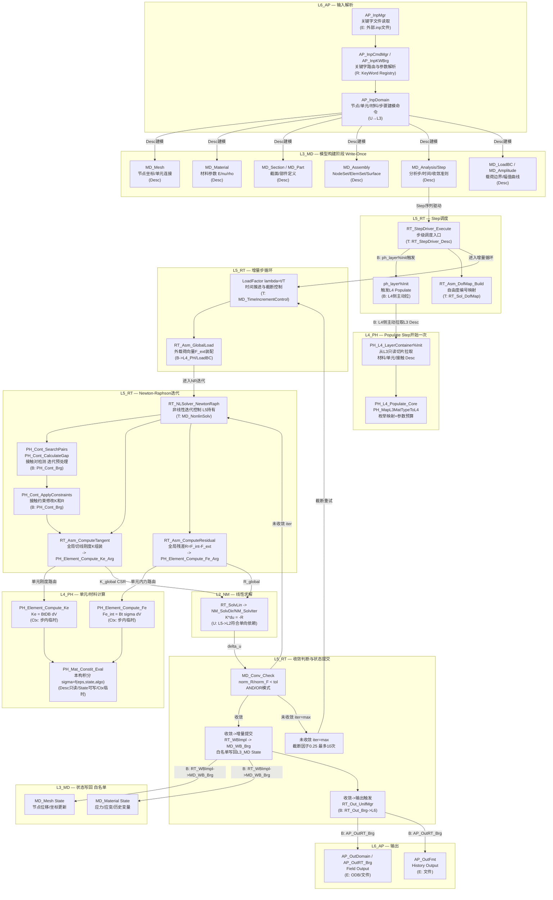
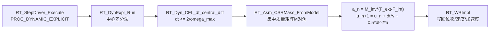
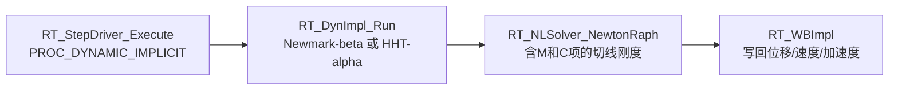

# UFC 端到端计算流主链

> **文档位置**：`UFC/docs/05_Project_Planning/PPLAN/06_核心架构/UFC_端到端计算流主链.md`
> **上位文档**：[UFC_架构设计总纲_深度整合版_v5.0.md](../01_架构总纲/UFC_架构设计总纲_深度整合版_v5.0.md)
> **版本**：v1.0
> **创建日期**：2026-04-25
> **状态**：ACTIVE — 经源码核查草拟，待用户评审确认歧义点 A/B 后作为后续所有域 CONTRACT.md 的锚点依据
> **⚠ 本文已整合至 → [UFC_权威端到端数据流总图.md](UFC_权威端到端数据流总图.md)**（唯一权威数据流参考）。本文保留作为计算流细节的辅助参考。
> **核查文件**：`RT_StepExec.f90`、`RT_AsmSolv.f90`、`RT_StepImpl.f90`、`RT_WBImpl.f90`、`AP_InpMgr.f90`、`AP_OutDomain.f90`

---

## 0. 文档用途

本文档是**驱动所有域边界划分和 CONTRACT.md 输入/输出合同的锚点图**。每个节点标注：

- **层/域归属**
- **数据角色**（`Desc`=只读冷数据 / `State`=可写温数据 / `Ctx`=步内临时热数据）
- **契约类型**（`T`=合同TYPE切片 / `B`=Bridge / `S`=SIO / `R`=Registry / `U`=USE直链 / `E`=外部边界）

---

## 1. 主链全图（静力隐式路径）

> 静力隐式（Static Implicit / Newton-Raphson）是核心主链，显式动力学和隐式动力学作为分支在 §2/§3 补充。



---

## 2. 分支路径：显式动力学



**特点**：无 Newton-Raphson 迭代；时间步受 CFL 条件约束；接触在每个时间步前处理。

---

## 3. 分支路径：隐式动力学



---

## 4. 数据角色与生命周期总表

| 数据 | TYPE角色 | 持有层 | 生命周期 | 写回规则 |
|------|----------|--------|----------|----------|
| 材料参数（E, nu, rho等） | `Desc`（冷） | L3_MD/Material | 模型级，全程驻留 | Write-Once，禁止修改 |
| 网格节点坐标（初始） | `Desc`（冷） | L3_MD/Mesh | 模型级 | Write-Once |
| 分析步定义 | `Desc`（冷） | L3_MD/Analysis/Step | 模型级 | Write-Once |
| 当前节点位移/坐标 | `State`（温） | L3_MD（白名单写回） | 增量步级 | 仅经 `RT_WBImpl->MD_WB_Brg` |
| 积分点应力/应变/历史 | `State`（温） | L3_MD（白名单写回） | 增量步级 | 仅经 `RT_WBImpl->MD_WB_Brg` |
| PH层材料/单元派生视图 | L4内部State | L4_PH（Populate） | Step级 | 不写回L3，由L5/WriteBack负责 |
| 单元刚度矩阵 Ke | `Ctx`（热） | L4_PH调用栈 | 迭代内，计算后丢弃 | 不保存 |
| 全局刚度矩阵 K_global | `Ctx`（热） | L5_RT/Assembly（CSR） | 迭代内 | 不保存到L3 |
| 残差向量 R | `Ctx`（热） | L5_RT/Assembly | 迭代内 | 不保存 |
| DOF映射 | `Algo`（冷） | L5_RT/Assembly | Step级 | 不写回 |
| 收敛准则参数 | `Algo`（冷） | L5_RT（来自L3 Step） | Step级 | 不写回 |
| NR迭代状态 | `Ctx`（热） | L5_RT/Solver（MD_SolverState） | 迭代内 | 不写回 |
| 时间步控制 | `Algo`+`State` | L5_RT | 增量步级 | 不写回 |

---

## 5. 三个歧义点的当前代码状态

### 歧义点 A：L4 Populate 方向（待确认）

**当前状态**（源码实证）：

- **主路径（L4侧拉，ACTIVE）**：`RT_StepExec.f90` line 372 中 `g_ufc_global%ph_layer%Init(step_number, ...)` 由 L5_RT 触发，L4 主动拉取 L3 Desc
- **遗留路径（L3侧推，待清理）**：`MD_MatLib_PH_Brg.f90`、`MD_Elem_PH_Brg.f90` 仍存在 L3 侧主动推函数
- **违规点**：`PH_Brg_ElementStiffAssembly`（旧版）直接写 L3 Mesh State（越权，联通契约文档已标注为 D-defect）

**待确认**：L4侧主动拉是否为最终目标形态？L3侧推路径是否在 Phase 4 完全删除？

### 歧义点 B：接触计算时序（待确认）

**当前状态**（源码实证）：

`RT_AsmSolv.f90` 中调用顺序：`PH_Cont_SearchPairs_API` -> `PH_Cont_DetectPenetration_API` -> `PH_Cont_CalculateGap_API` -> `PH_Cont_ApplyConstraints_API`。

这些调用在**组装残差/切线刚度之前**作为迭代预处理步，而非嵌入单元循环内。

**待确认**：迭代前预处理是否为设计意图？还是期望按单元级别内嵌组装循环？

### 歧义点 C：非线性迭代控制权（已清晰，无需确认）

**结论**：
- **增量步外层循环**：`RT_StepDriver_Execute`（L5_RT/StepDriver）持有
- **Newton 迭代内层循环**：`RT_NLSolver_NewtonRaph`（L5_RT/Solver）持有
- **Assembly**：无状态计算引擎，被 NLSolver 调用，不持有迭代控制权

此点可直接写入相关域 CONTRACT.md，无需等待确认。

---

## 6. 调用链层级依赖关系（静力隐式）

```
L6_AP/Input  --(E)--> L3_MD（建模，Write-Once）
L5_RT/StepDriver --(B)--> L4_PH%Init（Populate，L4侧主动拉）
L5_RT/StepDriver --(U)--> L5_RT/Solver（NLSolver，同层）
L5_RT/Solver --(U)--> L5_RT/Assembly（ComputeTangent/Residual，同层）
L5_RT/Assembly --(B)--> L4_PH/Element（Compute_Ke/Fe）
L4_PH/Element --(U)--> L4_PH/Material（Constit_Eval，同层）
L5_RT/Solver --(U)--> L2_NM/Solver（线性求解 KΔu=-R）
L5_RT/WriteBack --(B)--> L3_MD（白名单State写回，via MD_WB_Brg）
L5_RT/Output --(B)--> L6_AP/Output（Field/History）
```

**待清理警告**：`RT_AsmSolv.f90` 中存在旧版直接 USE L3_MD 模块（`MD_ModelLib`、`MD_FieldState` 等），应在 Phase 4 桥接修复时替换为 Bridge 调用。

---

## 7. 与后续工作的接口

1. **各域 CONTRACT.md 的「四链位置」小节** 引用本图节点（如"计算链：主链图 §1 G3 节点本构积分"）
2. **歧义点 A 确认后**：锁入 L3_MD/Bridge 和 L4_PH/Bridge 的 CONTRACT.md 依赖方向
3. **歧义点 B 确认后**：锁入 L4_PH/Contact 和 L5_RT/Assembly 的 CONTRACT.md 接触时序说明
4. **Phase 1 三级存储策略**：与本图 §4 数据角色表对齐，Ctx 列是约束设计热路径分配策略的依据
5. **Phase 2 全局域依赖图**：以本图 §6 调用链为边的来源，添加 55+ 域的完整覆盖

---

*文档创建：2026-04-25 | 核查依据：RT_StepExec.f90(line372) RT_AsmSolv.f90(line76-118) RT_WBImpl.f90 RT_StepImpl.f90*
