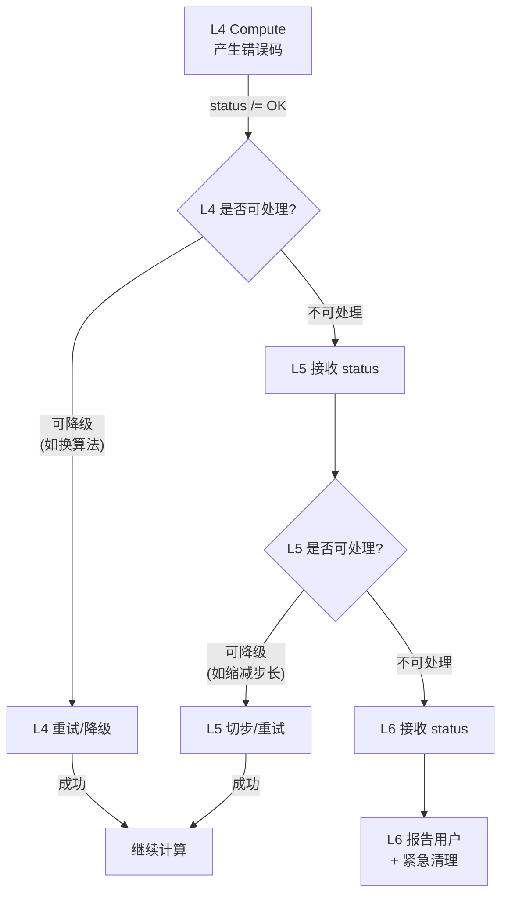
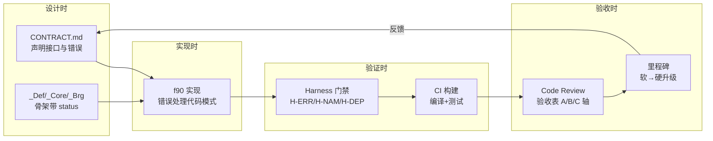

# UFC 跨层错误传播协议与 Harness 门禁

> **版本**: v1.0 | **日期**: 2026-04-25
> **基于**: [Error_Propagation_Architecture.md](Error_Propagation_Architecture.md)（三段编码、五级等级、拦截协议）
> **关联**: [域级落地验收表](../11_闭环落地专项/06_域级落地验收表_CodeReview与里程碑.md) · [全层全域矩阵](UFC_全层全域权威清单矩阵.md)

---

## 一、本文定位

[Error_Propagation_Architecture.md](Error_Propagation_Architecture.md) 定义了完整的错误编码体系（三段编码 `LLL-DDD-SSS`）、五级等级、五级拦截协议。本文在其基础上聚焦两个补充议题：

1. **跨层错误传播的实操协议**（每层如何处理、上报、拦截）
2. **Harness 门禁与错误的关系**（CI/验收中的错误相关检查点）

---

## 二、跨层错误传播协议

### 2.1 统一错误返回机制

所有跨层调用的子程序**必须**通过 `status` 参数返回错误状态：

```fortran
SUBROUTINE Domain_Feature_Compute(desc, state, ctx, status)
  ...
  INTEGER(i4), INTENT(OUT) :: status
  status = IF_STATUS_OK    ! 成功
  ! 或
  status = ERR_L4_PH_XXX   ! 错误码（三段编码整数）
END SUBROUTINE
```

**禁止**：
- 在非 FATAL 场景使用 `STOP` 或 `ERROR STOP`
- 用 `PRINT` 替代结构化错误返回
- 忽略下层返回的 `status`（静默吞错）

### 2.2 逐层传播规则



### 2.3 每层错误处理职责

| 层 | 产生的典型错误 | 处理策略 | 向上传播 |
|----|---------------|----------|----------|
| **L1_IF** | 内存不足、IO 失败、精度溢出 | 记录 + 返回错误码 | 透传给调用者 |
| **L2_NM** | 矩阵奇异、收敛失败、外部库不可用 | 记录 + 返回错误码 | 透传给 L5 |
| **L3_MD** | INP 解析错误、无效参数、引用不存在 | 记录 + 返回错误码 | 阻断模型构建 |
| **L4_PH** | 本构发散、NaN、负雅可比 | 尝试降级（换算法）+ 返回 | 透传给 L5 |
| **L5_RT** | 迭代不收敛、步长过小 | 缩减步长/切割/重试 | 超限后透传给 L6 |
| **L6_AP** | 用户中断、命令错误 | 报告用户 + 清理 | 终止运行 |

### 2.4 错误处理代码模式

```fortran
! 调用方模式：检查 + 传播
CALL Material_Compute_Ctan(desc, state, ctx, status)
IF (status /= IF_STATUS_OK) THEN
  ! 选项 1: 透传（不可处理）
  RETURN

  ! 选项 2: 降级（可处理）
  ! CALL Material_Fallback(desc, state, ctx, status)
  ! IF (status /= IF_STATUS_OK) RETURN
END IF
```

---

## 三、Harness 门禁定义

### 3.1 Harness 门禁是什么

Harness 门禁是**自动化检查点**，在 CI/PR/里程碑验收时执行，确保代码满足架构约束。
与错误传播的关系：**每个跨层接口必须正确处理错误传播**，Harness 验证这一点。

### 3.2 门禁清单

| 门禁 ID | 名称 | 检查内容 | 级别 | 工具/方法 |
|---------|------|----------|------|-----------|
| **H-ERR-01** | 错误返回完整性 | 所有跨层 SUBROUTINE 有 `status` OUT 参数 | 硬 | 静态扫描 |
| **H-ERR-02** | 错误不吞没 | 调用下层后检查 `status`，非 OK 时处理或返回 | 硬 | 静态扫描 |
| **H-ERR-03** | 禁止裸 STOP | 非 FATAL 路径不使用 `STOP`/`ERROR STOP` | 硬 | grep 扫描 |
| **H-ERR-04** | 错误码区间合规 | 新增错误码在本层修正后区间内 | 硬 | 枚举注册检查 |
| **H-NAM-01** | 命名三段式 | MODULE/TYPE/SUBROUTINE 名符合 `Layer_Domain_Feature` | 硬 | naming_checker.py |
| **H-NAM-02** | 四型后缀限制 | `_Desc/_State/_Algo/_Ctx` 仅用于 TYPE 名 | 硬 | naming_checker.py |
| **H-NAM-03** | 禁止新 _Algo 模块 | 新文件不以 `_Algo.f90` 命名（历史遗留除外） | 硬 | 文件名扫描 |
| **H-DEP-01** | 单向依赖 | USE 图无反向/循环依赖 | 硬 | 依赖图扫描 |
| **H-DEP-02** | 跨层经 Bridge | 跨层 USE 仅出现在 `_Brg.f90` 中 | 硬 | USE 分析 |
| **H-DEP-03** | 精度声明 | `USE IF_Prec, ONLY: wp, i4`，禁止 ISO_FORTRAN_ENV | 硬 | grep 扫描 |
| **H-CON-01** | 合同卡存在 | 每个域有 `CONTRACT.md` | 软→硬（里程碑） | 文件存在检查 |
| **H-CON-02** | 合同与代码一致 | CONTRACT 中声明的 PUBLIC 接口在代码中存在 | 软 | 交叉校验脚本 |
| **H-HOT-01** | 热路径零分配 | Compute_*/Eval 内无 ALLOCATE/DEALLOCATE | 硬 | 静态扫描 |
| **H-SIO-01** | SIO 签名合规 | `_Proc.f90` 遵循五参/六参签名 | 硬 | 签名解析 |
| **H-TST-01** | 编译通过 | `gfortran -std=f2003 -fsyntax-only` 全量 | 硬 | CI 构建 |
| **H-TST-02** | 测试存在 | 域至少有 smoke/单测之一 | 软 | 测试扫描 |

### 3.3 硬/软约束执行策略

| 类型 | CI 中的行为 | PR 合并条件 | 里程碑验收 |
|------|-----------|------------|-----------|
| **硬约束** | 失败 → 构建红灯 | 必须通过 | 必须全部通过 |
| **软约束** | 失败 → 警告（黄灯） | 可合并但须登记技术债 | 里程碑声明后升级为硬 |

### 3.4 与 CONTRACT.md 的集成

每个域的 `CONTRACT.md` 应包含以下固定小节：

```markdown
## Harness 门禁

| 门禁 | 本域状态 | 备注 |
|------|---------|------|
| H-ERR-01 | PASS | 所有公开子程序有 status |
| H-ERR-02 | PASS | 下层调用后均检查 status |
| H-NAM-01 | PASS | 命名合规 |
| H-DEP-01 | PASS | 无反向依赖 |
| H-HOT-01 | N/A | 本域非热路径 |
| H-TST-01 | PASS | 编译通过 |
| H-TST-02 | DEFERRED | 单测待补 |
```

---

## 四、错误传播与 Harness 的闭环



---

*最后更新: 2026-04-25*