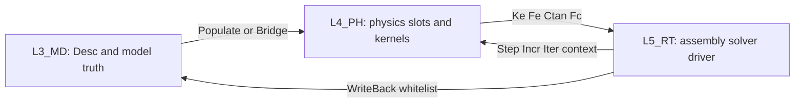

# L3/L4/L5 全域同步设计方案

> 版本: v1.0  
> 日期: 2026-04-27  
> 范围: `L3_MD` / `L4_PH` / `L5_RT` 的域柱盘点、合同模板、样板域与实施路径。  
> 依据: `DomainProcedureRegistry/CONVENTIONS.md`、`UFC_命名与数据结构规范.md`、`UFC_数据四型×过程四型_主责正交矩阵.md`。

---

## 1. 总体认识

三层同步设计不是把 L3/L4/L5 做成同名目录的机械镜像，而是让每个域明确自己的层级角色、数据所有权、物理计算位置和运行时消费点。

| 层 | 定位 | 生命周期 | 禁止事项 | 典型载体 |
|----|------|----------|----------|----------|
| `L3_MD` | 数据模型层，唯一真源 | Model 级，建模期写入，求解期只读 | 不做本构、单元、约束方程等数值计算 | `*_Def`, `*_Mgr`, `*_Map`, `*_Sync`, `*_Brg` |
| `L4_PH` | 物理计算层 | Step 级，Populate 后持有计算槽位 | 热路径不得反复回读 L3 真源，不写 L3 | `*_Def`, `*_Domain`, `*_Ops`, `*_Reg`, `*_Dsp`, `*_Pop` |
| `L5_RT` | 运行调度层 | Incr/Iter 级，驱动装配、求解和写回 | 不复制 L3 真源，不实现 L4 局部物理核 | `*_Def`, `*_Proc`, `*_Solv`, `*_Asm`, `*_Drv`, `*_Wb` |

---

## 2. 全域柱盘点

### 2.1 域柱分类规则

| 分类 | 判定 | 推进方式 |
|------|------|----------|
| 全柱域 | L3/L4/L5 均有明确同族责任 | 三层合同一起推导，优先打通热路径 |
| 半柱域 | 只有 L3+L4 或 L3+L5 明确成链 | 写清缺层理由，消费点落入邻域 |
| 单层域 | 主要属于某一层 | 不强行补镜像层，只补跨层关系 |
| 桥接域 | 职责是跨层适配 | 以 `Brg/Pop/Wb/API` 角色约束依赖方向 |

### 2.2 现状盘点表

| 域柱 | L3_MD 真源 | L4_PH 物理/中间层 | L5_RT 调度/消费 | 分类 | 主要消费点 |
|------|------------|-------------------|-----------------|------|------------|
| Material | `L3_MD/Material` | `L4_PH/Material` | `L5_RT/Material`, `L5_RT/Solver`, `L5_RT/Assembly` | 全柱 | Material Desc -> PH slot -> Element/Assembly/Solver |
| Element / Mesh | `L3_MD/Mesh`, `L3_MD/Mesh/Element` | `L4_PH/Element` | `L5_RT/Element`, `L5_RT/Assembly` | 全柱 | Mesh/Elem Desc -> PH elem cache -> Ke/Fe -> RT Assembly |
| Assembly | `L3_MD/Assembly` | L4 通过 Element/LoadBC/Contact/Constraint 提供贡献 | `L5_RT/Assembly` | 半柱 L3+L5 | L5 组装全局 K/F/约束/接触 |
| Constraint | `L3_MD/Constraint` | `L4_PH/Constraint` | 融入 `L5_RT/Assembly` | 半柱 L3+L4+L5 消费点 | `MD_ConstraintUnion` -> PH register -> RT penalty/constraint apply |
| LoadBC | `L3_MD/Boundary` | `L4_PH/LoadBC` | `L5_RT/LoadBC`, `L5_RT/Assembly` | 全柱 | LoadBC Desc -> PH load representation -> RT apply |
| Contact / Interaction | `L3_MD/Interaction`, `L3_MD/Constraint` | `L4_PH/Contact` | `L5_RT/Contact`, `L5_RT/Assembly` | 全柱 | Pair/Surface/Property -> contact detection/force -> assembly |
| Output / WriteBack | `L3_MD/Output`, `L3_MD/WriteBack` | `L4_PH/Bridge/Output`, `L4_PH/Bridge/WriteBack` | `L5_RT/Output`, `L5_RT/WriteBack` | 全柱 | runtime fields -> whitelist writeback / ODB-like output |
| Step / Solver | `L3_MD/Analysis/Step`, `L3_MD/Analysis/Solver` | 无独立 L4 Solver | `L5_RT/StepDriver`, `L5_RT/Solver` | 半柱 L3+L5 | Step/Solver Desc -> RT execution and nonlinear/linear solve |
| Field | `L3_MD/Field` | `L4_PH/Field` | 被 Assembly/Output 间接消费 | 半柱 L3+L4 | field definitions / quadrature values |
| Model / Part / Section | `L3_MD/Model`, `Part`, `Section` | Section/Element/Material 经 Populate 消费 | Assembly/Output 间接消费 | L3 主导半柱 | model tree, part instances, section-material binding |
| KeyWord / Input | `L3_MD/KeyWord` | N/A | N/A | L3 单层输入映射 | parser -> domain Desc |
| Bridge | `L3_MD/Bridge` | `L4_PH/Bridge` | `L5_RT/Bridge` | 桥接域 | explicit cross-layer adapters |

---

## 3. 域级合同模板

每个域合同卡必须能回答六个问题。

| 问题 | 合同小节 | 最低要求 |
|------|----------|----------|
| 本域管什么，不管什么 | 职责边界 | 明确 L3/L4/L5 分层职责和禁止事项 |
| 数据放在哪里 | 四型配置 | Desc/Ctx/State/Algo 的归属层、生命周期、热/冷路径 |
| 功能模块有哪些 | 核心模块 | 文件、MODULE、后缀、是否 AUTHORITY |
| 过程如何推导 | 过程清单 | 每个过程绑定到 Init/Query/Mutate/Validate/Populate/Compute/Wb 等时相动作 |
| 如何跨层 | 桥接契约 | Populate/Brg/Wb/API 的方向、输入、输出、禁写规则 |
| 如何验收 | 约束分级 | 硬约束、软约束、registry、lint、语法检查 |

模板文件: `UFC/docs/templates/L3L4L5_DOMAIN_SYNC_CARD_Template.md`。

---

## 4. 样板域选择

| 样板 | 选择理由 | 验收重点 |
|------|----------|----------|
| Constraint | 已完成 L3 域重构，且是 L3+L4 半柱、L5 Assembly 消费的典型 | `MD_ConstraintUnion` 是否完整贯通到 L4 Populate 和 L5 penalty apply |
| Material | L3/L4/L5 全柱，且最能体现 L3 Desc 真源、L4 Ctan/State、L5 调度 | 热路径零 L3、slot_pool、UMAT/VUMAT 路由 |
| Element / Assembly | Element 是 L4 局部核，Assembly 是 L5 全局归约，二者构成主计算链 | `Compute_Ke/Fe -> Triplet/CSR -> Solver` 的过程步骤闭合 |

---

## 5. 样板域目标模块集合

### 5.1 Constraint 域柱

| 层 | 功能模块 | 后缀 | 目标职责 |
|----|----------|------|----------|
| L3 | `MD_Constr_Def` | `Def` | Tie/MPC/Coupling/Rigid Desc 与 Union 真源 |
| L3 | `MD_Constr_Mgr` | `Mgr` | 域容器、Add/Get/Validate、操作期 Algo/Ctx |
| L3 | `MD_Constr_Brg` | `Brg` | 表面/elset 名称解析到节点列表 |
| L3 | `MD_Constr_Prop` | `Prop` | 接触属性数据库 |
| L3 | `MD_Constr_Sync` | `Sync` | Legacy / UF 约束同步 |
| L4 | `PH_Constr_Def` / `PH_Constr_Domain` | `Def/Domain` | 约束施加类型与 Register |
| L5 | `RT_Asm_Solv` | `Solv` | `RT_Asm_ApplyL3Constraints` 消费约束贡献 |

### 5.2 Material 域柱

| 层 | 功能模块 | 后缀 | 目标职责 |
|----|----------|------|----------|
| L3 | `MD_Mat_Def`, `MD_Mat_Brg`, `MD_MatReg_Algo` | `Def/Brg/Reg` | 材料 Desc、PH/UMAT 桥、材料注册 |
| L4 | `PH_Mat_Domain_Core`, `PH_Mat_Reg_*`, `PH_Mat_*_Core` | `Domain/Reg/Core` | slot_pool、Compute_Ctan、Update_StateVars、族内核 |
| L5 | `RT_Mat_*`, `RT_Asm_Solv`, `RT_Solv_*` | `Def/Proc/Solv` | 调度材料点、装配消费、求解器协同 |

### 5.3 Element / Assembly 主链

| 层 | 功能模块 | 后缀 | 目标职责 |
|----|----------|------|----------|
| L3 | `MD_Mesh_Def`, `MD_Mesh_API`, `MD_Mesh_Domain`, `MD_Elem_*` | `Def/API/Domain/Reg` | Mesh/Element Desc、拓扑、查询 API |
| L4 | `PH_ElemDomain_Ops`, `PH_ElemContm_Ops`, `PH_Elem_Reg`, family kernels | `Ops/Reg/Defn` | Compute_Ke/Fe、元素注册、族内局部核 |
| L5 | `RT_Asm_Solv`, `RT_Asm_DofMap`, `RT_Asm_Proc`, `RT_Asm_Def` | `Solv/Proc/Def` | DofMap、单元循环、Triplet/CSR、约束/接触/载荷汇入 |

---

## 6. INTENT / manifest 对齐要求

| 目录 | 本次要求 |
|------|----------|
| `docs/03_Domain_Pillars/DomainProcedureRegistry/design/L3_MD/Constraint` | 保持 Constraint 样板，补跨层域柱说明 |
| `docs/03_Domain_Pillars/DomainProcedureRegistry/design/L3_MD/Material` | 补 L3/L4/L5 Material 域柱说明 |
| `docs/03_Domain_Pillars/DomainProcedureRegistry/design/L4_PH/Element` | 补 Element/Assembly 主链说明 |
| `docs/03_Domain_Pillars/DomainProcedureRegistry/design/L5_RT/Assembly` | 补 L5 组装消费链说明 |

`manifest.json` 必须只描述目标域桶内实际源码，不承担跨层设计说明；跨层说明写入 `INTENT.md` 和域 `CONTRACT.md`。

---

## 7. 逐域实施流程

1. **读合同**: 读取域 `CONTRACT.md`、`INTENT.md`、`generated` 快照。
2. **定域柱**: 标注全柱/半柱/单层域，写清缺层理由。
3. **定模块集合**: 按后缀闭集判断保留、合并、改名、删除。
4. **定四型**: 明确 Desc/Ctx/State/Algo 的归属层和生命周期。
5. **定过程步骤**: 以 Step 1..n 绑定 `SUBROUTINE` / TBP。
6. **定跨层契约**: `Populate/Brg/Wb/API` 的输入输出和依赖方向。
7. **实施代码**: 先骨架、后算法；旧 `_Core` 只作为蓝图。
8. **验证**: `domain_procedure_registry_scan.py`、`domain_procedure_registry_align.py`、`ReadLints`、可用 Fortran 语法检查。

---

## 8. 验收矩阵

| 项 | Gate | 验收方式 |
|----|------|----------|
| L3 真源不含 L4/L5 热路径计算 | 硬 | Code review + `USE` 扫描 |
| L4 热路径零 L3 回读 | 硬 | 合同检查 + `USE MD_*` 审计 |
| L5 不复制 L3 Desc 真源 | 硬 | 运行时结构审查 |
| 每个模块对应功能后缀闭集 | 硬 | naming checker / registry |
| TYPE 四型不与 MODULE 后缀混淆 | 硬 | 命名扫描 |
| `*_Arg` 不做 status-only 薄封装 | 硬 | SIO 审查 |
| `generated/` 与 `design/manifest` 对账 | 软到硬 | 每批 scan -> align |
| 可用语法检查 | 硬 | `gfortran -std=f2003 -ffree-line-length-none -fsyntax-only`，缺 `.mod` 单独记录 |

---

## 9. 首批实施顺序

1. **Constraint**: 以现有 L3 重构为样板，只补 design/INTENT 与跨层验收语义。
2. **Material**: 梳理 L3 Desc、L4 slot/Compute_Ctan、L5 调度消费。
3. **Element/Assembly**: 固化 L4 Compute_Ke/Fe 与 L5 Triplet/CSR 组装链。
4. **LoadBC / Contact / Output**: 按同一模板推广。
5. **Step/Solver / Field / Model-Part-Section**: 补半柱/单层域说明，避免强行镜像。

