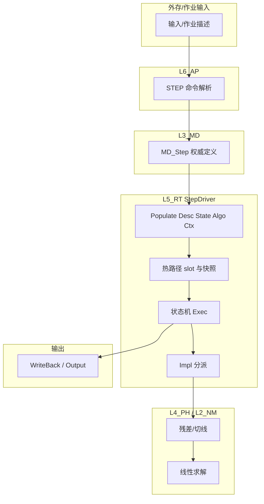

# L5_RT / StepDriver 标准域卡（样板）

> **存放说明**：**唯一真源为本路径**（`PPLAN/` 根下便于搜索）；专项目录内不再保留副本。

**域路径**：`UFC/ufc_core/L5_RT/StepDriver/`  
**角色**：运行调度层中「分析步 / 增量 / 迭代」编排与控制的样板域，用于 UFC 域级治理（十件套 + 合同 + 数据生命周期 + Harness）的首个闭环示范。  
**文档日期**：2026-04-25  

---

## 0. 源文件与权威入口核对（本 worktree 状态）

| 项 | 说明 |
|----|------|
| 本仓库切片 | 当前 Cursor worktree 可能**仅含** `.qoder/repowiki` 等镜像，**不含** `UFC/ufc_core`。本文中 Fortran 与 `CONTRACT.md` 路径以完整 UFC 仓库为准。 |
| 合并到完整树后必做 | 在含 `UFC/` 的克隆中确认下列文件存在且与本文一致：`CONTRACT.md`、`DESIGN_Step_FourTypes.md`、`RT_StepDriver_*.f90`。 |
| 交叉文档 | 步骤控制 API 说明见仓库内 Wiki 镜像等价物：`.qoder/repowiki/zh/content/API参考/运行时层API/步骤控制API.md`（完整树中应对齐 `UFC/docs` 下正式 API 文档，若有）。 |

**待核对文件清单（完整 `UFC` 树）**

- `UFC/ufc_core/L5_RT/StepDriver/CONTRACT.md`
- `UFC/ufc_core/L5_RT/StepDriver/DESIGN_Step_FourTypes.md`
- `UFC/ufc_core/L5_RT/StepDriver/RT_StepDriver_Types.f90`
- `UFC/ufc_core/L5_RT/StepDriver/RT_StepDriver_Ctx.f90`
- `UFC/ufc_core/L5_RT/StepDriver/RT_StepDriver_Exec.f90`
- `UFC/ufc_core/L5_RT/StepDriver/RT_StepDriver_Impl.f90`

**PPLAN 关联（完整树）**

- 闭环与十件套口径：`UFC/docs/05_Project_Planning/PPLAN/11_闭环落地专项/` 下既有总纲类文档（以实际目录为准）。
- CI / Harness：`UFC/docs/05_Project_Planning/PPLAN/04_技术标准/UFC_CI_CD_PIPELINE.md`（若存在）。
- 错误传播：`UFC/docs/05_Project_Planning/PPLAN/06_核心架构/Error_Propagation_Architecture.md`（若存在）。

---

## 1. 域职责十件套

| # | 项 | StepDriver 落地要点 |
|---|----|---------------------|
| 1 | **域定位** | `L5_RT` 子域 `StepDriver`：连接 L3 分析步定义与 L4 物理核、L2 数值求解，对外暴露「步级」执行语义。 |
| 2 | **职责边界** | **负责**：步/增量/迭代状态机、时间步策略入口、收敛与切步（cutback）编排、Populate 后 slot 上的热路径消费、与输出写回衔接。**不负责**：材料本构细节（L4）、稀疏矩阵格式细节（L2）、INP 解析（L6）。 |
| 3 | **功能模块** | 见第 4 节 `.f90` 清单；设计文档 `DESIGN_Step_FourTypes.md` 对齐四型。 |
| 4 | **四型 TYPE** | **Desc**：步类型、时间配置、求解器配置 ID 等。**State**：当前步/增量/迭代、时间、荷载因子、收敛标志。**Algo**：容差、最大迭代、线搜索等。**Ctx**：工作向量、内存池槽位、临时标量等。 |
| 5 | **公开接口** | 以 `CONTRACT.md` 与 `RT_StepDriver_Exec` 对外稳定入口为准；L6 经作业/命令层提交配置，避免域外直接篡改 State 不变量。 |
| 6 | **数据所有权** | L3 持有**权威模型步定义**；Populate 后 L5 持有**运行期四型与快照**；步内热路径**不反向直读 L3**，仅消费已填充 slot。 |
| 7 | **依赖规则** | 允许：经合同指向 L4 `PH_*_Domain`、L2 `NM_*`、L1 错误/内存/日志。禁止：在步内热路径中 `USE` 深层 L3 模型容器直接遍历。 |
| 8 | **合同卡** | 域内 `CONTRACT.md` 为权威；模板见附录 A。 |
| 9 | **Harness 验收** | 见第 7 节与附录 B。 |
| 10 | **扩展点** | 新分析类型 / 新时间积分器：通过 `Impl` 分派扩展；合同版本号递增；保持 Exec 状态机语义稳定。 |

---

## 2. 域级合同卡模板（本域实例化字段）

> 以下为「域卡级」摘要；完整条款以 `UFC/ufc_core/L5_RT/StepDriver/CONTRACT.md` 为准。

| 区块 | 内容 |
|------|------|
| **Stable API** | 初始化配置域、绑定 L3 引用（Populate 前）、`RunStep` / 等价主入口、收敛与完成回调语义。 |
| **Inputs** | L3 `MD_Step_*` 经 Populate 得到的 Desc；L6 下发的作业级参数；Algo 容差与步长策略配置。 |
| **Outputs** | 更新 State（步/增量/迭代索引、时间、荷载因子、收敛标志）；触发 L4/L2 调用链；衔接 Output/WriteBack。 |
| **State machine** | 阶段常量示例：`INIT`、`INCREMENT`、`CONVERGED`、`CUTBACK`、`COMPLETED`、`FAILED`（与源码枚举对齐为准）。 |
| **Invariants** | 热路径内禁止直读 L3；State 转移单调性与可回滚点由 CONTRACT 定义。 |
| **Errors** | 与 `Error_Propagation_Architecture` 对齐：错误码、可恢复 vs 终止、日志级别。 |
| **Version** | 合同与公开 `INTERFACE` 变更需记版本；破坏性变更同步 Harness 与最小回归集。 |

---

## 3. 域间关系表（四类关系）

| 关系类型 | 从 | 到 | 机制 |
|----------|----|----|------|
| **包含** | `L5_RT` | `StepDriver/` | 目录与模块前缀 `RT_StepDriver_*`。 |
| **接口** | `L6_AP` | `StepDriver` | 命令/作业提交分析步配置（如 STEP 语义）。 |
| **数据** | `L3_MD` | `StepDriver` | Populate：Desc/State/Algo/Ctx 与快照 slot。 |
| **执行** | `StepDriver` | `L4_PH` | 残差/切线等物理核调用。 |
| **执行** | `StepDriver` | `L2_NM` | 线性/非线性求解调用。 |
| **执行** | `StepDriver` | `L5_RT` Output 等 | 结果写回与步完成语义。 |

---

## 4. `.f90` 功能模块清单（最小样板组）

| 文件 | 职责摘要 |
|------|-----------|
| `RT_StepDriver_Types.f90` | 四型类型定义、步类别与时间配置、阶段常量等与 Desc/State/Algo/Ctx 对齐。 |
| `RT_StepDriver_Ctx.f90` | 上下文构建与销毁、MeshSnapshot / LoadBC 等快照、与 L3 绑定的初始化流程。 |
| `RT_StepDriver_Exec.f90` | 执行驱动与状态机：步循环、增量循环、迭代调度、切步入口。 |
| `RT_StepDriver_Impl.f90` | 静态 / 显式 / 隐式动力学等算法分派与实现细节。 |

**说明**：L6 侧命令模块（如 `AP_Cmd_Step`）与历史路径 `UF_Cmd_Step` 仅作入口引用，**不属于** `StepDriver` 域内文件，但应在域间关系与 Harness 中标注依赖方向。

---

## 5. 数据生命周期图



**文字要点**

1. **创建**：作业创建后 L3 写入步定义；Populate 创建 L5 四型与 Ctx。  
2. **使用**：增量内仅读 slot 与快照，不写回 L3 权威定义。  
3. **销毁 / 写回**：步完成或失败后按合同释放 Ctx、写回输出与可持久化状态；失败路径保留诊断字段。  

---

## 6. Harness 验收项（域级摘要）

| 类别 | 验收项 |
|------|--------|
| **命名** | `RT_StepDriver_*` 前缀与层域一致；`check_naming_l3l4l5l6.py`（完整树）对 L5 规则通过。 |
| **依赖 / 架构** | `arch_guardian.py` / `valid_arch.py`：禁止步内热路径违规 `USE` L3；Bridge 与层间边符合仓库规则。 |
| **合同** | `CONTRACT.md` 存在且与公开过程签名一致；破坏性变更有版本记录。 |
| **状态机** | 单测或回归：INIT→INCREMENT→CONVERGED/CUTBACK/FAILED 覆盖；切步后状态可恢复。 |
| **路径** | 至少一条静态隐式、一条显式动力学最小用例通过 `regression_min` 或等价 TST。 |
| **错误** | 故意失败用例返回约定错误码并记录日志级别。 |

**工具入口（完整 `UFC/` 树）**

- `UFC/ufc_harness/run_harness.py`
- `UFC/ufc_harness/config/harness_config.json`
- `UFC/tools/arch_guardian.py`、`UFC/tools/valid_arch.py`
- `UFC/scripts/ci_guardian.sh`

---

## 附录 A：通用域级合同卡模板（从 StepDriver 抽象）

复制到新域 `UFC/ufc_core/<Layer>/<Domain>/CONTRACT.md` 使用时替换占位符。

```markdown
# CONTRACT — <Layer>/<Domain>

## 元数据
- DomainId: <Lx_yy_DomainName>
- Version: <semver or int>
- Owner: <team>
- LastReview: <date>

## 1. 职责与反职责
- 负责: ...
- 不负责: ...

## 2. 稳定公开接口
- 过程/模块: ...
- 前置条件 / 后置条件: ...

## 3. 输入 / 输出数据
| 名称 | 方向 | 类型 | 所有者 | 生命周期 |
|------|------|------|--------|----------|

## 4. 依赖与禁止
- 允许 USE: ...
- 禁止 USE: ...
- Bridge 入口: ...

## 5. 状态机（若适用）
- 状态、转移、不变量: ...

## 6. 错误与恢复
- 错误码表: ...
- 可恢复 / 终止: ...

## 7. 性能与热路径
- 热路径约束: ...

## 8. 版本与兼容性
- 破坏性变更记录: ...
```

---

## 附录 B：Harness 可执行检查清单（StepDriver 勾选版）

- [ ] 仓库中存在 `UFC/ufc_core/L5_RT/StepDriver/CONTRACT.md`  
- [ ] `grep`/静态规则：StepDriver 热路径文件无违规 `USE` L3 深层模块（以 `arch_guardian` 配置为准）  
- [ ] `python UFC/tools/check_naming_l3l4l5l6.py`（或 CI 等价）通过  
- [ ] `run_harness.py`：`guardian` + 至少 `syntax` 或 `regression_min` 通过  
- [ ] 文档：`DESIGN_Step_FourTypes.md` 与 Types 模块字段一致（人工或脚本 diff）  

---

## 附录 C：推广到其他域的骨架（复制域卡章节标题）

下一域（如 `L3_MD/Material`、`L4_PH/Element`）复制本文结构 **§0～§6**，替换：

1. 域路径与模块前缀。  
2. 十件套表中「不负责」一行。  
3. 域间关系表行。  
4. `.f90` 清单（按子域拆分小节）。  
5. 数据生命周期图节点（材料侧重 Desc/State 与本构状态；单元侧重 Gauss 与单元状态）。  
6. Harness 项（材料合同、单元族矩阵、装配耦合等增量条目）。  

**完成标准**：新域具备 `CONTRACT.md` + 域卡 Markdown + Harness 最小勾选集，三者在一次 PR 内同时更新。
