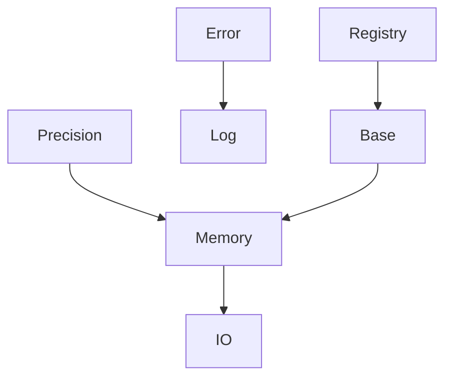

# L1_IF 子总纲（方案 B · 基础设施层）

> **层级**: L1_IF（Infrastructure）  
> **版本**: v1.0 · **日期**: 2026-04-25  
> **对齐**: 总纲 v5.0 · Fortran 精度规则（`IF_Prec`）

---

## 1. 层级定位

- **职责**：精度、内存池、错误类型、日志、I/O 基元、注册表骨架、监控。  
- **非职责**：有限元物理、代数求解业务。  
- **依赖**：**无上层**；全层可 `USE L1_IF`。

---

## 2. 层内域清单与分级

| 域桶 | 分级 | 说明 |
|------|------|------|
| Precision | **核心** | `IF_Prec`：`wp`/`i4` 唯一精度入口 |
| Memory | **核心** | 池、Slab、Struct/Unstruct |
| Error | **核心** | `ErrorStatusType`、错误桥 |
| Log | **核心** | 日志门面 |
| IO | **核心** | Checkpoint 等 |
| Registry | **辅助** | IF 级注册骨架 |
| Monitor | **辅助** | 遥测钩子 |
| Base | **辅助** | AI/Parallel/Symbol 等横切 |

---

## 3. 层内域间关系图（Mermaid）

---

## 4. 层内调用协议

| 规则 | 内容 |
|------|------|
| **精度唯一** | 禁止 `ISO_FORTRAN_ENV` 与自定义 KIND（见 `.cursor/rules/ufc-fortran-syntax.mdc`） |
| **池接口稳定** | `IF_Mem_*` 变更须版本说明；与三级存储策略对齐 |
| **错误类型稳定** | `ErrorStatusType` 字段演进须向后兼容策略 |

---

## 5. 各域 CONTRACT 骨架（种子）

| 域 | 职责两句 |
|----|----------|
| **Precision** | 工作精度与整型宽度统一出口。 |
| **Memory** | 分配/释放策略与池统计；不知有限元语义。 |
| **Error** | 状态码与消息链；不含业务判断。 |
| **Log** | 分级日志与 sink 抽象。 |
| **IO** | 字节流与 Checkpoint 原语。 |
| **Registry** | 通用注册表模式（与 L3/L4 业务注册表区分）。 |
| **Monitor** | 计时器与计数器钩子。 |
| **Base** | 并行与符号等横切基类。 |

---

## 6. L1 层级硬约束

| ID | 约束 |
|----|------|
| L1-H01 | 禁止 `USE L2` 及以上任何层 |
| L1-H02 | 所有 `ufc_core` 实体的实数默认 `REAL(wp)` |
| L1-H03 | 公开 TYPE 变更走版本兼容策略（见 Version_Compatibility_Policy） |

---

*全栈地基：任何层违反 L1 约束即硬失败。*
