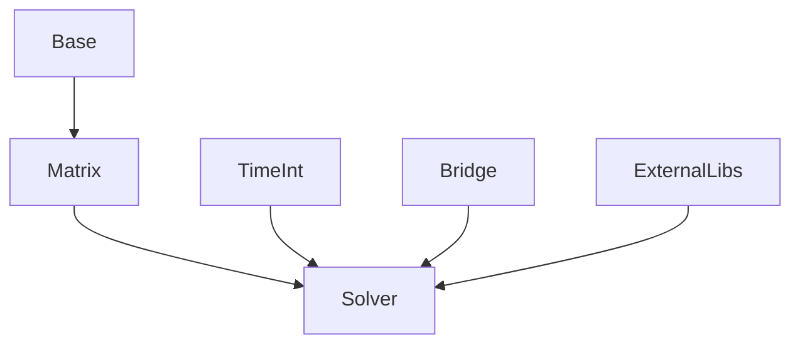

# L2_NM 子总纲（方案 B · 数值工具层）

> **层级**: L2_NM（Numerical Math）  
> **版本**: v1.0 · **日期**: 2026-04-25  
> **对齐**: 总纲 v5.0 · [`UFC_全局域依赖图.md`](../06_核心架构/UFC_全局域依赖图.md)

---

## 1. 层级定位

- **职责**：线性/非线性求解、稀疏矩阵、时间积分、收敛辅助、可选外部库封装。  
- **非职责**：模型语义、单元本构、Step 业务状态机。  
- **依赖**：仅 **L1_IF**；**禁止** `USE L3_MD` / `L4_PH` / `L5_RT`。

---

## 2. 层内域清单与分级

| 域桶 | 分级 | 说明 |
|------|------|------|
| Solver | **核心** | LinSolv / NonlinSolv / Coupling / Parallel / Conv |
| Matrix | **核心** | CSR/CSC、稀疏结构操作 |
| TimeInt | **核心** | Newmark 等（与 StepDriver 参数衔接经 L5） |
| Base | **辅助** | BVH 等通用数值基元 |
| Bridge | **辅助** | L2 对外门面（若有） |
| ExternalLibs | **扩展** | 第三方 BLAS 等封装 |

---

## 3. 层内域间关系图（Mermaid）

---

## 4. 层内调用协议

| 规则 | 内容 |
|------|------|
| **无模型语义** | API 仅接受代数结构与标量参数，不解析 `MD_*` |
| **错误传播** | 求解失败码经 `status` 返回 L5，不吞异常 |
| **性能** | 热路径避免冗余拷贝；并行域与 L1 线程策略对齐 |

---

## 5. 各域 CONTRACT 骨架（种子）

| 域 | 职责两句 |
|----|----------|
| **Solver** | 解 `Ax=b` 与非线性外层算子；不知单元类型。 |
| **Matrix** | 稀疏格式与 SpMV；不装配有限元矩阵语义。 |
| **TimeInt** | 时间离散系数与稳定性辅助；不读关键字文件。 |
| **Base** | 通用算法数据结构。 |
| **ExternalLibs** | 封装第三方；版本与许可在工具链文档登记。 |

---

## 6. L2 层级硬约束

| ID | 约束 |
|----|------|
| L2-H01 | 禁止 `USE` L3/L4/L5/L6 |
| L2-H02 | 新增依赖 ExternalLibs 须 CI 与许可证审计 |
| L2-H03 | 公共 API 须可单测（无全局 `g_ufc_global` 隐式依赖） |

---

*上层调用者：几乎仅为 `L5_RT/Solver` 与 Harness 测试。*
