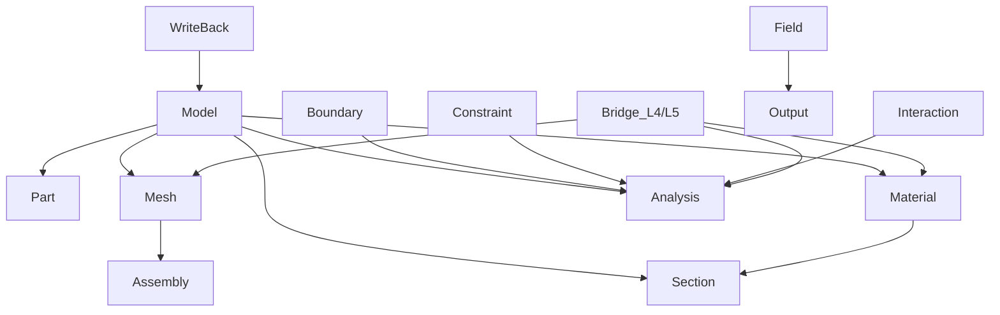

# L3_MD 子总纲（方案 B · 完整规范型）

> **层级**: L3_MD（模型描述层 · 唯一真相来源）  
> **版本**: v1.0 · **日期**: 2026-04-25  
> **对齐**: [`UFC_架构设计总纲_深度整合版_v5.0.md`](../01_架构总纲/UFC_架构设计总纲_深度整合版_v5.0.md) · [`UFC_三级存储策略.md`](../04_技术标准/UFC_三级存储策略.md) · [`UFC_全局域依赖图.md`](../06_核心架构/UFC_全局域依赖图.md)

---

## 1. 层级定位（补充总纲，不重复）

- **唯一真相源（SSOT）**：几何拓扑、材料参数、Step/BC/Interaction 的 **Desc/Algo** 在 ModelBuilder 完成后 **Write-Once**；**State** 仅经 **L5_RT/WriteBack** 白名单更新。  
- **禁止**：L3 在热路径中 **USE L4/L5**；L3 不编排 Newton/装配循环。  
- **Bridge 角色**：`L3_MD/Bridge` 提供 **L3→L4 / L3→L5** 官方 **B** 类映射；**材料热路径路由**以 **L4 Populate + slot** 为准，`MD_MatLibPH_Brg` 标 **LEGACY**（见 Bridge 合同与模块头注释）。

---

## 2. 层内域清单与分级

| 域桶 | 分级 | 备注 |
|------|------|------|
| Model / Part / Mesh / Material / Section | **核心** | SSOT 主干 |
| Analysis（Step/Solver/Amplitude） | **核心** | 时间线与求解配置 |
| Boundary / Constraint / Interaction / Field / Output | **核心** | 边界与输出契约 |
| Assembly（L3 侧模型级装配描述） | **辅助** | 与 L5 热装配区分命名与合同 |
| KeyWord | **扩展** | 与 L6 解析衔接；内核侧为 Desc 消费方 |
| Bridge | **辅助（关键）** | 层间唯一出口；须防双桥接 |
| WriteBack | **辅助（关键）** | 与 L5 成对定义白名单字段 |
| contracts | **元** | 跨域合同索引，非业务域桶 |

---

## 3. 层内域间关系图（Mermaid）



**契约边（层内）**：以 **T**（Desc/State 引用）为主；`Bridge` 对外为 **B**。

---

## 4. 层内调用协议（L3 专属）

| 规则 | 内容 |
|------|------|
| **只读暴露** | 对外（L4/L5）经 Bridge 或 `MD_*_GetDesc_*` / `*_Arg` 只读切片 |
| **Populate 配合** | L3 提供查询；**不**在 IP/NR 循环内被 L4 直接全树遍历 |
| **写回禁区** | 除 WriteBack 合同列出的 API 外，任何层不得写 `State` |
| **Algo/Desc 冻结** | Step 执行阶段禁止改 Desc/Algo |
| **错误传播** | 所有公开过程带 `ErrorStatusType` 或 `*_Arg%status` |

---

## 5. 各域 CONTRACT.md 骨架（复制到域内合同并填实）

> **路径约定**：`UFC/ufc_core/L3_MD/<域>/CONTRACT.md`；已存在者迭代补 **A6 域关系子表** 与 **SIO 偏好**。

### 5.1 通用骨架（每域必填）

```markdown
## <域名> 域级合同卡 (L3_MD)

- **职责**：（2 句话：负责… / 不负责…）
- **十件套 v2.0 映射**：（逻辑件 → 文件/TYPE/过程 → Active|Deferred）
- **四链**：理论 / 逻辑 / 计算 / 数据（各 ≥1 可核对句）
- **四型**：Desc / State / Algo / Ctx（本域哪些为空声明）
- **SIO / *_Arg（本域偏好）**：与 AGENTS.md §5 一致
- **域际关系（A6）**：

| 序号 | 关联域 | 相对本域 | 契约类型 | 主要接触面 | 备注 |
|------|--------|----------|----------|------------|------|
| R1 | | 上游/下游 | T/B/S/… | | |
```

### 5.2 分域一行职责（骨架种子）

| 域 | 职责摘要（填 CONTRACT 时扩展为两句） |
|----|----------------------------------------|
| **Model** | 根容器；聚合 Part/Mesh/Material；不跑 Step |
| **Part** | Part 实例与属性；不算 Ke |
| **Mesh** | 节点/单元拓扑真相；不装配 CSR |
| **Material** | 本构参数与材料实例；不经热路径推 L4 |
| **Section** | 截面与材料引用；不积分 |
| **Analysis/Step** | Step 序列与时间；不替代 L5 驱动 |
| **Analysis/Solver** | 求解器配置 Desc；执行在 L5/L2 |
| **Analysis/Amplitude** | 幅值曲线；求值可由 L4 Bridge 调 |
| **Boundary** | BC Desc；施加在 L5/L4 |
| **Constraint** | MPC 等 Desc；装配在 L5 |
| **Interaction** | 接触对 Desc；接触核在 L4 |
| **Field** | 场定义；与 Output 联表 |
| **Output** | 输出请求；写文件在 L6 |
| **Assembly（L3）** | 模型级装配元数据；忌与 RT_Asm 混淆 |
| **KeyWord** | 关键字树或占位；解析主链在 L6 |
| **Bridge** | 官方跨层映射；见专用合同 |
| **WriteBack** | 白名单字段定义与校验；实现调用在 L5 |

---

## 6. 层级硬约束清单（L3 特有）

| ID | 约束 |
|----|------|
| L3-H01 | 禁止 `USE L4_PH` / `USE L5_RT`（Bridge 模块除外且仅单向出口） |
| L3-H02 | Step 内禁止修改 Desc/Algo |
| L3-H03 | State 写回仅由 L5 WriteBack 清单驱动 |
| L3-H04 | 禁止在材料桥热路径新增对 `PH_Mat_Ctx` 的隐式填充（须 Populate） |
| L3-H05 | 新增域必须先更新 `UFC_ufc_core_目录权威分类.md` 与本子总纲 §2 表 |

---

## 7. 与 Phase 3/4 的衔接

- **Phase 3**：本文件为 L3 子总纲真源；各域 `CONTRACT.md` 十件套与 A6 子表须引用 [`06_域级落地验收表_CodeReview与里程碑.md`](../11_闭环落地专项/06_域级落地验收表_CodeReview与里程碑.md)（含 **A4 因果说明** 与 **A+ 轴 A7–A11**；纯 L3 冷数据域对 A9 等可 **N/A** 并附理由）。
- **Phase 4**：双桥接收敛见 [`Phase4_L3L4桥接_收敛说明.md`](../11_闭环落地专项/Phase4_L3L4桥接_收敛说明.md)（与全局依赖图 §4 同口径）。

---

*维护：域桶增删时同步 §2、§5.2 与 `UFC_全局域依赖图.md`。*
