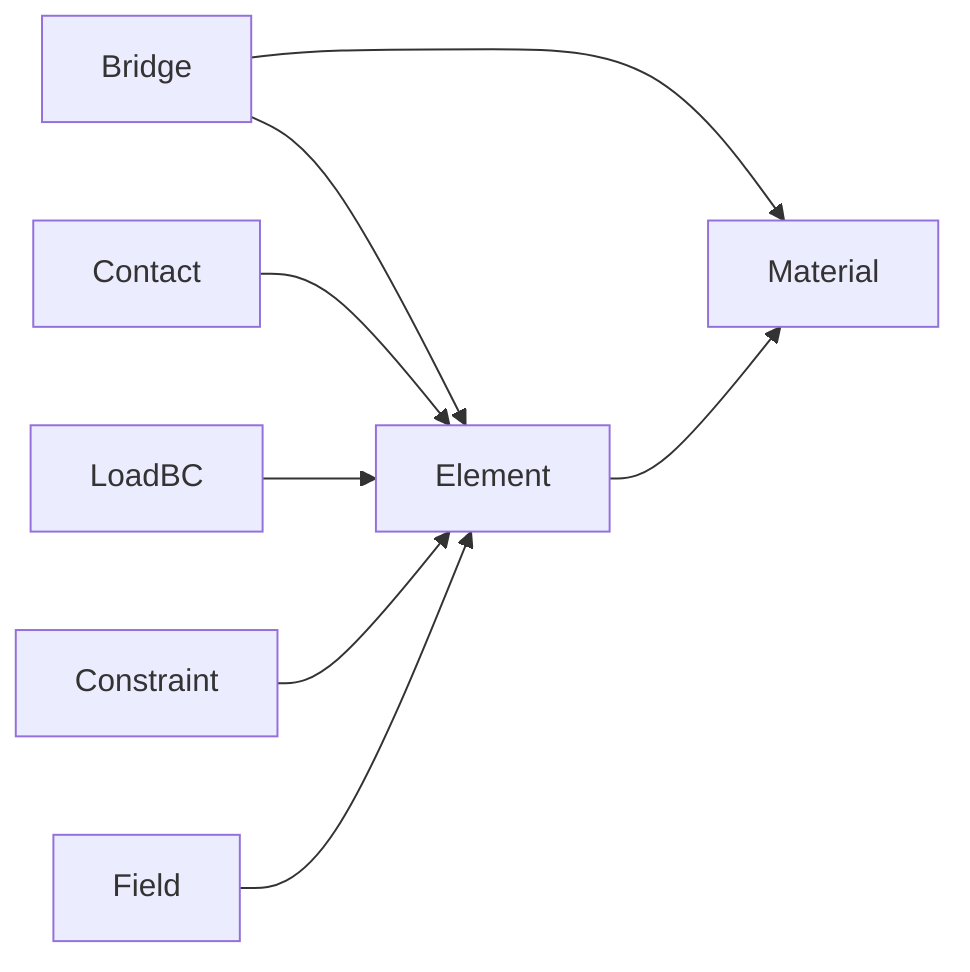

# L4_PH 子总纲（方案 B · 配合 Phase 4 桥接修复）

> **层级**: L4_PH（物理计算层）  
> **版本**: v1.0 · **日期**: 2026-04-25  
> **对齐**: 总纲 v5.0/v5.1 · [`UFC_端到端计算流主链.md`](../06_核心架构/UFC_端到端计算流主链.md) · [`UFC_三级存储策略.md`](../04_技术标准/UFC_三级存储策略.md)

---

## 1. 层级定位

- **职责**：单元数值核、材料本构积分、接触核、PH 侧 LoadBC；**消费** L3 Desc（经 **Populate / Bridge 只读**）。  
- **非职责**：全局 CSR 求解、Job I/O、对 L3 State **直写**（须 L5 WriteBack）。  
- **存储**：域 `*_Ctx` 对齐 **L2 级（Step 级）** 内存池策略；积分点临时数组对齐 **L1 级** 预分配/栈规则。

---

## 2. 层内域清单与分级

| 域桶 | 分级 | 说明 |
|------|------|------|
| Element | **核心** | `Compute_Ke` / `Compute_Fe` 金线 |
| Material | **核心** | slot_pool、本构 Dispatch |
| Contact | **核心** | 搜索/摩擦/显式分支 |
| LoadBC | **核心** | PH 载荷表示 |
| Constraint | **辅助** | PH 侧 MPC 等 |
| Field | **辅助** | 与输出、单元耦合 |
| Bridge | **关键辅助** | **L4 侧主动 Populate / 只读查询 L3**；G4 已废弃越权组装入口 |

---

## 3. 层内域间关系图（Mermaid）

---

## 4. 层内调用协议（L4 专属）

| 规则 | 内容 |
|------|------|
| **Populate 单向** | Step_Init 由 L5 触发；L4 从 L3 **拉取** Desc 填入 slot/cache |
| **热路径零 L3** | IP 循环禁止全模型网格遍历；仅缓存与 `MD_PH_Geom_FillElemCtx_*` 等已登记回退 |
| **Bridge 薄** | `PH_BrgL3`：**查询/拷贝**；**禁止**默认热路径调用已废弃的 `PH_Brg_ElementStiffAssembly` |
| **写回** | 单元/材料状态变更走 **L5 WriteBack** 合同 |
| **Ctx 与池** | `PH_*_Ctx` 须含池句柄或 Step 级预分配（见三级存储策略） |

---

## 5. 各域 CONTRACT 骨架（种子表）

| 域 | 职责两句（扩展写 CONTRACT） |
|----|------------------------------|
| **Element** | 高斯积分与 B 阵；不装 CSR。金线 `PH_Element_Domain%Compute_Ke`。 |
| **Material** | 应力更新与算法切线；不持有 L3 写指针。 |
| **Contact** | 接触力与刚度贡献接口；与 L5 `RT_Asm_ApplyContact` 对齐。 |
| **LoadBC** | PH 载荷核；L5 编排施加。 |
| **Constraint** | PH 约束核；与 L5 约束装配对齐。 |
| **Field** | PH 场变量中间表示。 |
| **Bridge** | L4↔L3 查询与 Populate 协同；**不**承担默认 Ke 组装（G4）。 |

**每域 CONTRACT 必含**：十件套映射表 · 四链 · 四型 · SIO 偏好 · **A6 域关系子表**（上游 L3 / 下游 L5）。

---

## 6. Phase 4 桥接修复同步说明

| 项 | 目标状态 |
|----|----------|
| 双桥接 | L3 `MD_MatLibPH_Brg` **热路径废弃**；L4 Populate + slot 为金线 |
| G4 | `PH_Brg_ElementStiffAssembly` **仅返回 INVALID**；调用方迁移 `Compute_Ke` |
| L4→L3 写 | **禁止**；状态经 WriteBack |

**实现与合同真源**：`L4_PH/Bridge/PH_BrgL3.f90`、`L4_PH/Bridge/CONTRACT.md`、`L3_MD/Bridge/Bridge_L4/MD_MatLibPH_Brg.f90` 头注释。

---

## 7. L4 层级硬约束

| ID | 约束 |
|----|------|
| L4-H01 | 禁止默认热路径 `USE` L3 巨型模块（除 Bridge 已登记切片） |
| L4-H02 | Iter 内禁止 `ALLOCATE`（三级存储 MEM-01） |
| L4-H03 | 禁止写 L3 `State`（除 WriteBack 清单中的间接路径，且须由 L5 调用） |
| L4-H04 | 新增 `USE MD_*` 须过域分级审计（见 Element README 技术债销项） |

---

*配合 `L3_MD_子总纲.md` 与 `L5_RT_子总纲.md` 阅读主链 §3 歧义点。*
