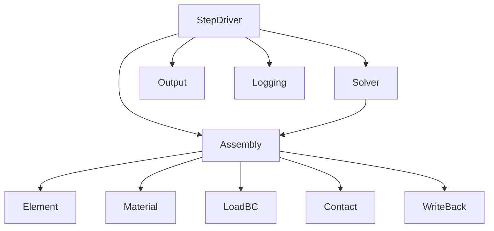

# L5_RT 子总纲（方案 B · 核心计算链调度层）

> **层级**: L5_RT（运行时层）  
> **版本**: v1.0 · **日期**: 2026-04-25  
> **对齐**: 总纲 v5.0/v5.1 · [`UFC_端到端计算流主链.md`](../06_核心架构/UFC_端到端计算流主链.md)

---

## 1. 层级定位

- **职责**：Step / Increment / Iter 状态机；驱动 **Assembly** 调 L4；调用 **L2** 线性解；触发 **WriteBack** 与 **Output**。  
- **非职责**：不实现具体本构与单元形函数（L4）；不持有模型 SSOT（L3）。  
- **SIO 硬战场**：`_Proc`、Harness 编排边界以仓库 AGENTS 与 Principle #14 为准。

---

## 2. 层内域清单与分级

| 域桶 | 分级 | 说明 |
|------|------|------|
| StepDriver | **核心** | 三步状态机、动态/显式分支 |
| Assembly | **核心** | 全局 K/R、接触与约束装配入口 |
| Solver | **核心** | 与 L2 求解器适配、非线性外层控制衔接 |
| WriteBack | **核心** | **唯一** L3 State 白名单写回 |
| LoadBC / Contact / Element / Material | **辅助** | RT 侧薄编排与上下文绑定 |
| Output / Logging | **辅助** | 场输出、日志 |
| Bridge | **辅助** | RT 专用桥 |

---

## 3. 层内域间关系图（Mermaid）

---

## 4. 层内调用协议（L5 专属）

| 规则 | 内容 |
|------|------|
| **热路径零 L3** | `RT_Asm_*` 仅消费 Populate 后结构；禁止遍历 L3 网格库 |
| **写回唯一** | 所有对 L3 `State` 的写经 `RT_WriteBack_*` |
| **L4 入口** | 单元主入口 `PH_Element_Domain%Compute_Ke` 等，禁止复活 G4 遗留桥 |
| **L2 边界** | 数值解算仅经 `NM_*` 公共 API；CSR 生命周期在 Assembly/Solver 合同内定义 |
| **收敛** | 容差 Desc 可从 L3 读；**迭代控制**逻辑归属 L5（见主链歧义点 B） |

---

## 5. 各域 CONTRACT 骨架（种子）

| 域 | 职责两句 |
|----|----------|
| **StepDriver** | 驱动 Step/Inc/Iter；不调具体本构。 |
| **Assembly** | 单元→全局装配与载荷/接触集成；不求解。 |
| **Solver** | 构建代数系统与调用 L2；不算 Ke。 |
| **WriteBack** | 白名单字段写回 L3；唯一写入口。 |
| **Output** | 收集场量并交给 L6 写出（合同定边界）。 |
| **LoadBC/Contact/Element/Material（RT）** | 薄层绑定与参数传递；逻辑在 L4。 |

---

## 6. 核心闭环链（Phase 4）

**顺序**：`StepDriver → Assembly_Solver → Element → Material → Solver`  

**验收**：逐域「CONTRACT → 实现 → **A / A+ / B / C**」见 [`Phase4_核心闭环链_验收追踪.md`](../11_闭环落地专项/Phase4_核心闭环链_验收追踪.md)；全表见 [`06_域级落地验收表_CodeReview与里程碑.md`](../11_闭环落地专项/06_域级落地验收表_CodeReview与里程碑.md)（L5/SIO 域 **A+ 建议全开**）。

---

## 7. L5 层级硬约束

| ID | 约束 |
|----|------|
| L5-H01 | 禁止绕过 WriteBack 写 L3 |
| L5-H02 | 禁止 `USE L6_AP` |
| L5-H03 | SIO 入口须满足五参/六参（本域已登记 `_Proc` 表） |
| L5-H04 | Assembly 热路径禁止新增未登记 L3 `USE` |

---

*与 `L4_PH_子总纲.md` 配对阅读 Populate 与装配边界。*
