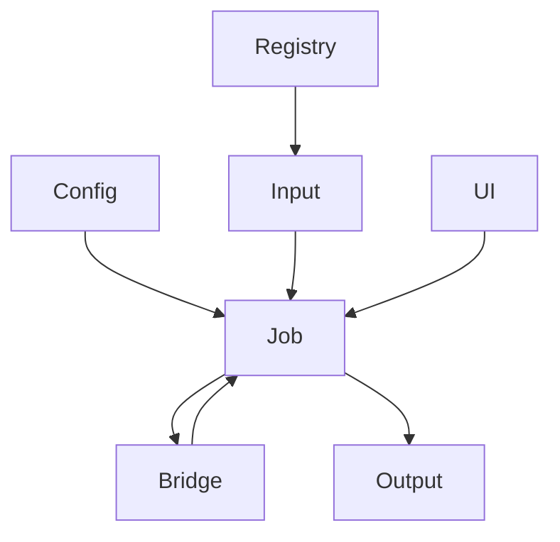

# L6_AP 子总纲（方案 B · 应用层）

> **层级**: L6_AP（Application）  
> **版本**: v1.0 · **日期**: 2026-04-25  
> **对齐**: 总纲 v5.0 · 主链文档 L6 输入/输出段

---

## 1. 层级定位

- **职责**：Job 生命周期、输入解析（关键字/脚本）、配置、结果写出、可选 UI。  
- **非职责**：时间步内数值积分、装配、本构（L5/L4）；模型 SSOT（L3）。  
- **边界类型**：对外 **E**（文件/进程/API）；对内调用 L5 以 **S** 为主。

---

## 2. 层内域清单与分级

| 域桶 | 分级 | 说明 |
|------|------|------|
| Job | **核心** | 启停、资源、与 L5 会话边界 |
| Input | **核心** | Parser / Command / Script |
| Output | **核心** | ODB/文本/报告写出 |
| Config | **核心** | 运行参数与路径 |
| Solver | **辅助** | AP 级求解入口包装（与 L5 区分） |
| Registry | **辅助** | 应用插件注册 |
| Bridge | **辅助** | AP↔内核门面 |
| UI | **扩展** | 可选界面 |

---

## 3. 层内域间关系图（Mermaid）

---

## 4. 层内调用协议

| 规则 | 内容 |
|------|------|
| **不穿透 SSOT** | 不直接修改 L3 Desc；模型构建走官方 Builder API |
| **解析与执行分离** | Parser 产出中间结构，再由 L6/L5 编排落 L3 |
| **错误呈现** | 将 `ErrorStatusType` 映射为用户可读消息与退出码 |

---

## 5. 各域 CONTRACT 骨架（种子）

| 域 | 职责两句 |
|----|----------|
| **Job** | 一次运行的 owner；持有到 L5 会话的句柄。 |
| **Input** | 读入与词法/语法分析；不跑 Newton。 |
| **Output** | 序列化结果；不计算应力。 |
| **Config** | 键值与路径；不替代关键字语义。 |
| **Solver（AP）** | 用户可见的求解器选择与报告；委托 L5。 |
| **Registry** | 应用扩展注册。 |
| **Bridge** | 稳定 AP API 与内核入口绑定。 |
| **UI** | 可选；通过 Job/Config 间接驱动内核。 |

---

## 6. L6 层级硬约束

| ID | 约束 |
|----|------|
| L6-H01 | 禁止 `USE L3_MD` 巨型模块直改模型（须经 L5 或官方 Builder） |
| L6-H02 | 禁止在热循环中替代 L5 StepDriver（性能与架构） |
| L6-H03 | 对外 ABI 变更须文档与版本号 |

---

*与 `L5_RT_子总纲.md` 配对：主链「L6 输入解析 → … → L6 输出」。*
