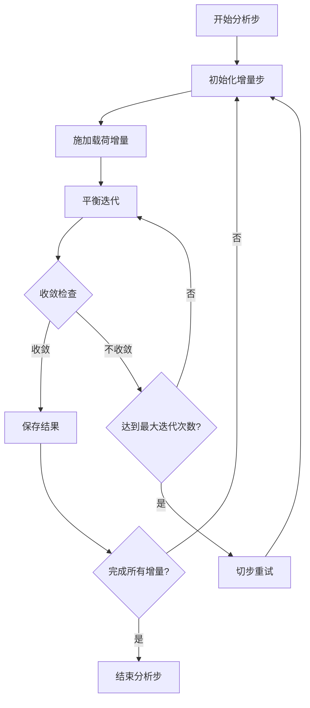
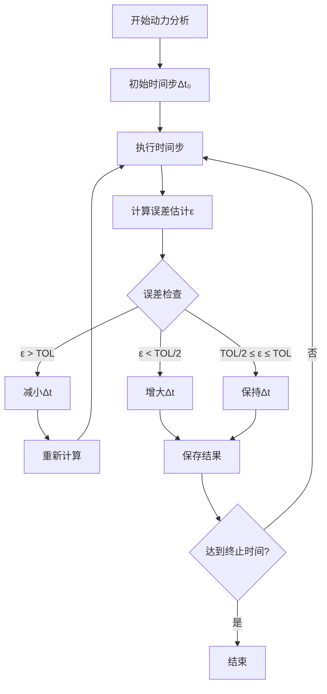

# UFC 架构设计总纲 — 六层+四类+四链+三步+三级+两图+一体

## 📋 文档元数据

- **版本**: v2.0
- **创建日期**: 2026-03-02
- **最后更新**: 2026-03-05
- **规范简称**: UFC_DesignOutline_6L4C4C3S3L2D1U（六层4类4链3步3级2图1体）
- **适用范围**: UFC 项目全生命周期架构设计与实施；**排除 ExternalLibs**（外部库目录不适用本总纲的层级/命名约束，仅接口与调用方式需符合 L1/L2 契约）。
- **核心使命**: 构建世界级 Fortran 有限元计算内核，对标并超越 ABAQUS。
- **v2.0变更摘要**: 修复章节编号混乱（P0）；明确 UFC_GlobalContainer 主设计地位废弃 UFC_GlobalData（P0）；补充 TYPE 接口分层说明（P0）；新增六层域职责定义（P1）；新增四链×六层落地矩阵与 WriteBack API（P1）；新增跨层错误处理协议（P1）；新增多物理场扩展预留槽位（P1）；新增版本控制与向后兼容策略（P1）。

---

## 协作保障机制（总纲落地）

为确保长期协作沿正确轨迹执行，以下四项机制与架构设计总纲**同步生效**：

| 机制                               | 要点                                               | 文档/工具                                                    |
| ---------------------------------- | -------------------------------------------------- | ------------------------------------------------------------ |
| **执行检查清单（每轮必查）** | 七问自查、红黄绿预警、每轮对话前执行               | UFC_检查清单_每轮必查_简化版.md、auto_checklist_assistant.py |
| **记忆强化与基因传承**       | 五象限记忆分类、规范文档化/自动化/记忆系统化三部曲 | PLAN/*.md、UFC_NAMING_STANDARD.md、scripts/                  |
| **偏离预警与自动纠偏**       | 架构/四类TYPE/四链/三步/命名偏离检测与纠偏流程     | UFC_自我纠偏记忆强化基因传承机制_完整版.md                   |
| **对话恢复与上下文重建**     | 断点保存模板、五步恢复流程、强制恢复触发信号       | 同上                                                         |

命名规范在**所有任务中优先开展并始终执行**，防止新生成代码被非规范命名篡改（见[五、三级命名](#五三级命名规范细化)及[九、命名规范可行性讨论](#九命名规范可行性讨论)）。

---

## 目录

1. [一、六层架构（L1-L6）细化](#一六层架构l1-l6细化)
2. [二、四类TYPE系统细化](#二四类type系统细化)
3. [三、四链贯通细化](#三四链贯通细化)
4. [四、三步流程细化](#四三步流程细化)
5. [五、三级命名规范细化](#五三级命名规范细化)
6. [六、两图可视化细化](#六两图可视化细化)
7. [七、一体数据结构（历史参考）](#七一体数据结构历史参考)
8. [八、全局设计原则与验证标准](#八全局设计原则与验证标准)
9. [九、命名规范可行性讨论](#九命名规范可行性讨论)
10. [十、L3_MD 域级架构专项设计](#十l3_md-域级架构专项设计)
11. [十一、六层容器化闭环实施成果](#十一六层容器化闭环实施成果)
12. [十二、跨层错误处理协议](#十二跨层错误处理协议)
13. [十三、多物理场扩展预留槽位](#十三多物理场扩展预留槽位)
14. [十四、版本控制与向后兼容策略](#十四版本控制与向后兼容策略)
15. [十五、实施路线图](#十五实施路线图)
16. [十六、总结与展望](#十六总结与展望)

---

## 一、六层架构（L1-L6）细化

### 1.1 层级定义与职责边界

```
┌─────────────────────────────────────────────────────────────┐
│ L6_AP: Application Layer（应用层）                           │
│ ├─ 职责：命令解析、脚本API、图形界面                         │
│ ├─ 典型模块：AP_Command, AP_Script, AP_GUI                  │
│ ├─ 依赖：L5_RT                                               │
│ └─ 禁止：直接访问L1-L4任何模块                               │
├─────────────────────────────────────────────────────────────┤
│ L5_RT: Runtime Layer（运行时状态层）                         │
│ ├─ 职责：求解器调度、作业管理、步骤控制、全局状态           │
│ ├─ 典型模块：RT_Solver, RT_Job, RT_Step, RT_State           │
│ ├─ 依赖：L4_PH, L3_MD, L2_NM, L1_IF                          │
│ └─ 核心：管理全局系统矩阵K、F、U和收敛控制                  │
├─────────────────────────────────────────────────────────────┤
│ L4_PH: Physics Layer（物理层）                               │
│ ├─ 职责：单元计算、材料本构、接触算法、载荷边界条件         │
│ ├─ 典型模块：PH_Elem, PH_Mat, PH_Contact, PH_Load, PH_BC    │
│ ├─ 依赖：L3_MD, L2_NM, L1_IF                                 │
│ └─ 核心：提供物理计算内核（单元刚度、材料应力应变）         │
├─────────────────────────────────────────────────────────────┤
│ L3_MD: Model Layer（模型数据层）                             │
│ ├─ 职责：材料定义、网格管理、部件装配、模型树               │
│ ├─ 典型模块：MD_Material, MD_Mesh, MD_Part, MD_Assembly     │
│ ├─ 依赖：L2_NM, L1_IF                                        │
│ └─ 核心：提供模型描述数据结构（Desc类TYPE）                 │
├─────────────────────────────────────────────────────────────┤
│ L2_NM: Numerical Layer（数值计算层）                         │
│ ├─ 职责：线性求解器、时间积分、非线性迭代、矩阵运算         │
│ ├─ 典型模块：NM_LinearSolver, NM_TimeIntegration, NM_Matrix │
│ ├─ 依赖：L1_IF                                               │
│ └─ 核心：提供数学算法工具（LU分解、GMRES、Newmark）         │
├─────────────────────────────────────────────────────────────┤
│ L1_IF: Infrastructure Layer（基础设施层）                    │
│ ├─ 职责：精度控制、内存管理、错误处理、日志系统             │
│ ├─ 典型模块：IF_Precision, IF_Memory, IF_Error, IF_Log      │
│ ├─ 依赖：Fortran内置模块                                    │
│ └─ 核心：提供基础工具和类型定义（WP, DP, ErrorCode）        │
└─────────────────────────────────────────────────────────────┘
```

### 1.2 层级依赖铁律

**单向依赖原则**：

```
L6 → L5 → L4 → L3 → L2 → L1
```

**特殊通道（必读）**：

| 通道 | 方向 | 权限 | 说明 |
|------|------|------|------|
| **L5→L3 WriteBack** | L5_RT → L3_MD | 白名单字段写回 | 必须且只能通过 WriteBack API，禁止直接访问字段（见 §3.6） |
| **L4→L3 只读** | L4_PH → L3_MD | 只读 | 通过 Domain 容器的 Get 接口，禁止修改 Desc 字段 |

**严格禁止**：

- ❌ 反向依赖：任何L(n) → L(n+1)的调用
- ❌ 跨层依赖：L6直接访问L1-L4（必须通过L5中转）
- ❌ 平级循环：同层模块间循环依赖

**依赖验证工具**：

```bash
# 检查反向依赖
python UFC/ufc_core/tools/verify_layer_dependency.py

# 生成依赖图
python UFC/ufc_core/tools/generate_dependency_graph.py
```

### 1.3 Bridge 三种设计模式（跨层合法通道）

> **核心原则**：所有跨层访问必须且只能通过 Bridge 模块完成，禁止直接 USE 其他层模块。

#### 模式 1：适配器模式（外部库适配）

**场景**：L2_NM 封装外部数值库（MUMPS、cuSPARSE、MKL 等），对外暴露统一 UFC 接口。

```fortran
module NM_MUMPS_Brg
  public :: NM_Solve_MUMPS
contains
  subroutine NM_Solve_MUMPS(A_csr, b, x, status)
    ! 步骤1：转换 UFC CSR 格式 → MUMPS 内部格式
    ! 步骤2：调用 MUMPS 求解接口
    ! 步骤3：转换 MUMPS 结果 → UFC 格式
    ! 步骤4：错误码映射（MUMPS 错误 → UFC ErrorStatusType）
  end subroutine
end module
```

**命名规则**：`{层}_{外部库}_Brg`，如 `NM_MUMPS_Brg`、`NM_MKL_Brg`、`NM_cuSPARSE_Brg`

#### 模式 2：门面模式（简化接口）

**场景**：L5_RT 通过统一门面访问 L3_MD 材料库，屏蔽材料库内部复杂性。

```fortran
module RT_MatLib_Brg
  use MD_Mat_Domain_Core, only: MD_GetMatById, MD_Mat_Mgr
  public :: RT_EvalMaterial
contains
  subroutine RT_EvalMaterial(mat_id, strain, stress, tangent, status)
    ! 内部调用 L3_MD 的复杂材料库接口
    ! 对外只暴露 mat_id + strain → stress + tangent 的简洁接口
    type(MD_Mat_Desc), pointer :: mat_desc
    call MD_GetMatById(mat_id, mat_desc, status)
    if (status%status_code /= STATUS_OK) return
    call PH_Mat_Elastic_Eval(mat_desc, strain, stress, tangent, status)
  end subroutine
end module
```

**命名规则**：`{源层}_{目标域}_Brg`，如 `RT_MatLib_Brg`（L5→L3材料库访问）

#### 模式 3：路由模式（条件调度）

**场景**：根据材料类型，从 L3_MD 材料描述路由到 L4_PH 具体本构实现。

```fortran
module MD_MatLib_PH_Brg
  public :: MD_RouteToConstitutive
contains
  subroutine MD_RouteToConstitutive(mat_desc, strain, stress, tangent, status)
    type(MD_Mat_Desc), intent(in) :: mat_desc
    real(wp), intent(in)  :: strain(6)
    real(wp), intent(out) :: stress(6), tangent(6,6)
    type(ErrorStatusType), intent(out) :: status
    
    ! 按材料类型路由到具体本构模型
    select case(mat_desc%material_type)
      case(MAT_TYPE_ELASTIC)
        call PH_Mat_Elastic_Core(mat_desc, strain, stress, tangent, status)
      case(MAT_TYPE_VON_MISES)
        call PH_Mat_vonMises_Core(mat_desc, strain, stress, tangent, status)
      case(MAT_TYPE_HYPERELASTIC)
        call PH_Mat_HyperElas_Core(mat_desc, strain, stress, tangent, status)
      case default
        status%status_code = STATUS_ERROR
        status%message = "Unknown material type"
    end select
  end subroutine
end module
```

**命名规则**：`{层}_{源域}_{目标域}_Brg`，如 `MD_MatLib_PH_Brg`（L3材料库→L4物理层路由）

**Bridge 合法访问汇总**：

| 访问方向 | Bridge 模块 | 设计模式 |
|---------|-----------|--------|
| L5_RT → L3_MD 材料库 | `RT_MatLib_Brg` | 门面模式 |
| L3_MD → L4_PH 本构路由 | `MD_MatLib_PH_Brg` | 路由模式 |
| L2_NM → MUMPS/MKL | `NM_MUMPS_Brg`、`NM_MKL_Brg` | 适配器模式 |
| L5_RT → L4_PH 物理接口 | `RT_Physics_Brg` | 门面模式 |

**UFC 实现位置**：`L*/Bridge/*_Brg.f90`（每层各有 Bridge 域）

### 1.4 各层职责清单

#### L1_IF（Infrastructure）职责清单

- [X] 定义全局精度类型（WP, DP, QP）
- [X] 实现内存池管理（Allocate/Deallocate追踪）
- [X] 错误处理框架（ErrorCode枚举+栈追踪）
- [X] 日志系统（分级日志：DEBUG/INFO/WARN/ERROR）
- [X] 常量定义（PI, ZERO, ONE, TWO, HALF, SMALL_NUM）

#### L2_NM（Numerical）职责清单

- [ ] 线性求解器：LU, Cholesky, GMRES, CG
- [ ] 时间积分：Newmark, HHT-α, Generalized-α
- [ ] 非线性迭代：Newton-Raphson, Line Search, Arc-Length
- [ ] 矩阵运算：稀疏矩阵存储、CSR/COO格式、BLAS接口
- [ ] 特征值求解：Lanczos, Subspace Iteration

#### L3_MD（Model）职责清单

- [X] Material：弹性/塑性/超弹性/粘弹性/蠕变/损伤材料定义
- [X] Mesh：节点坐标、单元连接、节点集/单元集管理
- [X] Part：部件定义、截面属性、材料指定
- [X] Assembly：装配体、实例化、约束关系
- [ ] Section：截面类型扩展至30种（当前17种）
- [ ] ContactPair：接触对定义、接触属性

#### L4_PH（Physics）职责清单

- [ ] Elem：单元刚度矩阵Ke、质量矩阵Me、阻尼矩阵Ce
- [X] Mat：材料本构积分（stress/strain/ddsdde计算）
- [ ] Contact：接触检测、罚函数、Lagrange乘子法
- [ ] Load：集中力、分布载荷、体力、热载荷
- [ ] BC：位移边界条件、约束方程、对称边界

#### L5_RT（Runtime）职责清单

- [ ] Solver：全局刚度矩阵组装、求解调度
- [ ] Job：作业管理、输入文件解析、输出文件写入
- [ ] Step：分析步管理（Static/Dynamic/Eigenvalue）
- [ ] State：全局状态管理（U/V/A, stress/strain, reaction）
- [ ] Increment：载荷增量步控制、收敛判断

#### L6_AP（Application）职责清单

- [ ] Command：命令解析器（类似ABAQUS inp文件）
- [ ] Script：Python API接口（类似abaqus.mdb）
- [ ] GUI：图形界面（可选，远期目标）
- [ ] Postprocess：结果后处理、可视化

---

## 二、四类TYPE系统细化

### 2.1 四类TYPE定义与使用规则

```fortran
! ============================================================
! TYPE分类：Desc/State/Algo/Ctx
! ============================================================

! -------------------- Desc类：描述型 --------------------
! 用途：不可变模型定义数据，只读
! 生命周期：模型定义阶段创建，求解过程不变
! 管理层：L3_MD层创建和管理
! 示例：材料参数、截面属性、网格拓扑

TYPE :: MD_ElasticMatDesc
  REAL(WP) :: E          ! Young's modulus [Pa]
  REAL(WP) :: nu         ! Poisson's ratio [-]
  REAL(WP) :: G          ! Shear modulus [Pa]
  REAL(WP) :: K          ! Bulk modulus [Pa]
  INTEGER  :: mat_id     ! Material ID
  CHARACTER(LEN=64) :: mat_name  ! Material name
END TYPE MD_ElasticMatDesc

! -------------------- State类：状态型 --------------------
! 用途：可变运行时状态数据，读写
! 生命周期：求解过程动态更新
! 管理层：L5_RT层管理
! 示例：应力应变、塑性应变、损伤变量

TYPE :: RT_MaterialState
  REAL(WP) :: stress(6)            ! Stress tensor [σ11,σ22,σ33,σ12,σ23,σ13]
  REAL(WP) :: strain(6)            ! Strain tensor [ε11,ε22,ε33,γ12,γ23,γ13]
  REAL(WP) :: equiv_plastic_strain ! Equivalent plastic strain [-]
  REAL(WP) :: damage               ! Damage variable [0-1]
  INTEGER  :: n_state_vars         ! Number of state variables
  REAL(WP), ALLOCATABLE :: state_vars(:) ! Custom state variables
END TYPE RT_MaterialState

! -------------------- Algo类：算法型 --------------------
! 用途：算法配置参数，只读
! 生命周期：全局单例或域级单例，初始化时创建
! 管理层：各层Algo模块
! 示例：求解器参数、收敛容差、积分点数

TYPE :: NM_NewtonRaphsonAlgo
  INTEGER  :: max_iter          ! Maximum iterations
  REAL(WP) :: abs_tol           ! Absolute tolerance
  REAL(WP) :: rel_tol           ! Relative tolerance
  LOGICAL  :: use_line_search   ! Enable line search
  REAL(WP) :: line_search_factor ! Line search factor
END TYPE NM_NewtonRaphsonAlgo

! -------------------- Ctx类：上下文型 --------------------
! 用途：单次计算调用的临时数据
! 生命周期：函数调用内，调用者负责创建和释放
! 管理层：调用者栈上分配
! 示例：单元局部坐标、Jacobian矩阵、Gauss积分权重

TYPE :: PH_ElemCtx
  REAL(WP) :: coords_local(3,8)  ! Local coordinates of element nodes
  REAL(WP) :: Jacobian(3,3)      ! Jacobian matrix
  REAL(WP) :: det_J              ! Determinant of Jacobian
  REAL(WP) :: B_matrix(6,24)     ! Strain-displacement matrix
  REAL(WP) :: N_matrix(8)        ! Shape functions at Gauss point
END TYPE PH_ElemCtx
```

### 2.2 TYPE命名规范

**格式**：`LayerPrefix_DomainName_TypeCategory`

| 层级  | 前缀 | Desc示例          | State示例        | Algo示例           | Ctx示例         |
| ----- | ---- | ----------------- | ---------------- | ------------------ | --------------- |
| L1_IF | IF_  | IF_PrecisionDesc  | IF_MemoryState   | IF_ErrorAlgo       | IF_LogCtx       |
| L2_NM | NM_  | -                 | NM_SolverState   | NM_NewtonAlgo      | NM_IterCtx      |
| L3_MD | MD_  | MD_ElasticMatDesc | -                | -                  | -               |
| L4_PH | PH_  | -                 | PH_MaterialState | PH_IntegrationAlgo | PH_ElemCtx      |
| L5_RT | RT_  | RT_StepDesc       | RT_GlobalState   | RT_SolverAlgo      | RT_IncrementCtx |
| L6_AP | AP_  | AP_CommandDesc    | AP_JobState      | -                  | AP_ParseCtx     |

**检查工具**：

```bash
# 检查TYPE命名规范
python UFC/ufc_core/tools/check_type_naming.py

# 检查四类TYPE分类合理性
python UFC/ufc_core/tools/verify_type_categories.py
```

### 2.3 TYPE接口PROCEDURE标准

#### 2.3.1 分层差异化接口要求（v2.0新增）

> **背景**：各层 TYPE 模式不同（见 §12.3），五大标准接口适用范围并非全层一律强制。

| 层级 | TYPE模式 | 强制接口 | 可选接口 | 理由 |
|------|----------|----------|----------|------|
| L1_IF | Service/Config | `Init / Finalize` | `Ensure` | 无状态服务，无需 Clone/RegLayout |
| L2_NM | Service/Config | `Init / Finalize` | `Ensure` | 无状态服务，无需 Clone/RegLayout |
| L3_MD | Desc / State | **五大接口全部强制** | — | Desc 需序列化， State 需验证，两者均需深拷贝 |
| L3_MD | Algo / Ctx | `Init / Finalize` | `Ensure` | 算法参数/临时上下文，无需 Clone |
| L4_PH | Ctx / State / Params | `Init / Finalize` | `Ensure` | Step 级数据，无需 Clone/RegLayout |
| L5_RT | State / Ctrl | `Init / Finalize` | `Ensure` | Increment 级数据，无需 Clone/RegLayout |
| L6_AP | State / Ctrl | `Init / Finalize` | `Ensure` | Job 级数据，无需 Clone/RegLayout |

**決策原则**：
- **Desc/State（L3_MD）**：必须五大接口（需要序列化/验证/深拷贝）
- **Service/Config（L1/L2）**：仅需 `Init/Finalize`（无状态服务）
- **Ctx/Params/Ctrl（L4/L5/L6）**：仅需 `Init/Finalize`（临时数据/控制参数）

#### 2.3.2 五大标准接口实现模板（适用 L3_MD Desc/State）

每个 TYPE 必须实现五大标准接口：

```fortran
! 标准PROCEDURE模板
TYPE :: MD_ElasticMatDesc
  REAL(WP) :: E, nu, G, K
  INTEGER  :: mat_id
  CHARACTER(LEN=64) :: mat_name
CONTAINS
  PROCEDURE :: RegLayout => MD_ElasticMatDesc_RegLayout  ! 注册字段布局
  PROCEDURE :: Ensure    => MD_ElasticMatDesc_Ensure     ! 验证数据合法性
  PROCEDURE :: Init      => MD_ElasticMatDesc_Init       ! 初始化（设置默认值）
  PROCEDURE :: Clone     => MD_ElasticMatDesc_Clone      ! 深拷贝
  PROCEDURE :: Finalize  => MD_ElasticMatDesc_Finalize   ! 释放资源
END TYPE MD_ElasticMatDesc

! RegLayout示例：注册字段元信息
SUBROUTINE MD_ElasticMatDesc_RegLayout(this)
  CLASS(MD_ElasticMatDesc), INTENT(INOUT) :: this
  ! Register fields: name, type, unit, description
  CALL RegisterField('E',  'REAL', 'Pa', 'Young modulus')
  CALL RegisterField('nu', 'REAL', '-',  'Poisson ratio')
END SUBROUTINE

! Ensure示例：验证数据合法性
SUBROUTINE MD_ElasticMatDesc_Ensure(this, error_code)
  CLASS(MD_ElasticMatDesc), INTENT(IN) :: this
  INTEGER, INTENT(OUT) :: error_code
  error_code = 0
  IF (this%E <= ZERO) error_code = ERR_INVALID_PARAMETER
  IF (this%nu < -ONE .OR. this%nu >= HALF) error_code = ERR_INVALID_PARAMETER
END SUBROUTINE

! Init示例：设置默认值
SUBROUTINE MD_ElasticMatDesc_Init(this)
  CLASS(MD_ElasticMatDesc), INTENT(INOUT) :: this
  this%E = ZERO
  this%nu = ZERO
  this%G = ZERO
  this%K = ZERO
  this%mat_id = -1
  this%mat_name = ''
END SUBROUTINE
```

---

### 2.4 Context 继承体系（来源：02-03-Context架构设计.md）

> **设计原则**：所有 Context 继承自 `BaseCtx`（L1_IF），显式传递，禁止全局/线程局部变量。

**Context 继承树**：

```
BaseCtx（L1_IF）
  ├── MD_Model_Ctx（L3_MD — 模型操作上下文）
  ├── RT_Step_Ctx（L5_RT — Step 执行上下文）
  ├── RT_Solver_Ctx（L5_RT — 求解器上下文）
  ├── PH_Mat_Ctx（L4_PH — 材料评估上下文）
  └── AP_Job_Ctx（L6_AP — Job 执行上下文）
```

**BaseCtx（L1_IF）核心定义**：

```fortran
! 文件位置：L1_IF/Base/IF_BaseCtx_Core.f90
type, public :: BaseCtx
  integer(i4) :: ctx_id    = 0_i4     ! 上下文唯一ID
  integer(i4) :: ctx_level = 0_i4     ! 层级编号（1-6对应L1-L6）
  logical      :: is_active = .false.  ! 是否处于活跃状态
  type(ErrorStatusType) :: err_status  ! 错误状态（随Context传播）
end type BaseCtx
```

**RT_Step_Ctx（L5_RT）继承示例**：

```fortran
! 文件位置：L5_RT/Context/RT_Ctx_Step.f90
type, public, extends(BaseCtx) :: RT_Step_Ctx
  type(RT_StepDesc),   pointer :: step_desc   => null()  ! 步骤描述（只读Desc）
  type(RT_StepState),  pointer :: step_state  => null()  ! 步骤状态（可写State）
  type(MD_Model_Ctx),  pointer :: model_ctx   => null()  ! 嵌套模型上下文
  type(RT_Solver_Ctx), pointer :: solver_ctx  => null()  ! 嵌套求解器上下文
end type RT_Step_Ctx
```

**Context 自上而下传递模式**：

```fortran
! L6_AP → L5_RT：显式传递 job_ctx
subroutine AP_RunJob(job_ctx)
  type(AP_Job_Ctx), intent(inout) :: job_ctx
  call RT_RunStep(job_ctx%step_ctx)   ! 向下传递，不复制
end subroutine

! L5_RT → L4_PH：从 step_ctx 派生 mat_ctx
subroutine RT_RunStep(step_ctx)
  type(RT_Step_Ctx), intent(inout) :: step_ctx
  ! 组合模式：step_ctx 内嵌 mat_ctx
  call PH_EvalMaterial(step_ctx%model_ctx%mat_ctx, ...)
end subroutine
```

**Context 组合模式（嵌套而非继承）**：

```fortran
! 深层Context用组合（嵌套指针），而非多重继承
type :: RT_Step_Ctx
  type(BaseCtx)           :: base          ! 基础上下文字段
  type(MD_Model_Ctx), pointer :: model_ctx => null()    ! 组合：模型上下文
  type(PH_Mat_Ctx), pointer :: mat_ctx => null()   ! 组合：材料上下文
end type
```

**Context 生命周期管理**：

```fortran
! 创建：Step开始时初始化
call RT_InitStepCtx(step_ctx, model_desc, step_desc, status)
! 错误检查：通过 base%err_status 统一管理
if (step_ctx%base%err_status%status_code /= STATUS_OK) return
! 使用：贯穿整个Step执行链
call RT_RunStep(step_ctx)
! 清理：Step结束时销毁
call RT_CleanupStepCtx(step_ctx)
```

**UFC 实现位置**：`L5_RT/Context/RT_Ctx_*.f90`；`L1_IF/Base/IF_BaseCtx_Core.f90`

**Context 四条铁律**：

| 规则 | 内容 |
|------|------|
| 继承规则 | 所有 Context 继承自 `BaseCtx`（L1_IF），ctx_level 记录层级 |
| 传递规则 | 作为子程序参数**显式传递**，**禁止**全局变量/线程局部存储 |
| 生命周期 | Job/Step 开始时创建，结束时销毁；Ctx 短命（函数调用级） |
| 不可变原则 | Ctx 中的 Desc 类型字段为**只读**，State 类型字段**可修改** |

---

## 三、四链贯通细化

### 3.1 理论链（Theory Chain）

**定义**：从物理理论到数学公式的完整推导链。

**关键要素**：

1. 物理假设（小变形、连续介质、各向同性等）
2. 控制方程（平衡方程、本构方程、几何方程）
3. 弱形式推导（虚功原理、变分原理）
4. 离散化（有限元插值、Gauss积分）

**文档化要求**：

- 每个物理模块必须有对应的理论手册（THEORY_*.md）
- 公式必须使用LaTeX格式，保留希腊字母
- 必须引用权威文献（教科书、论文、ABAQUS手册）

**理论手册 Markdown 路径锚点**：

| 理论主题 | Markdown 手册路径 | ABAQUS Theory Manual 对应章节 |
| ---- | ---- | ---- |
| 符号约定与基本概念 | `docs/六层架构拆分/01-理论基础/01-03-01-符号约定与基本概念.md` | Section 1 |
| 连续介质力学理论 | `docs/六层架构拆分/01-理论基础/01-03-02-连续介质力学理论.md` | Section 1.2 |
| 有限元方法理论 | `docs/六层架构拆分/01-理论基础/01-03-03-有限元方法理论.md` | Section 2 |
| 材料本构理论（塑性/超弹性/损伤） | `docs/六层架构拆分/01-理论基础/01-03-04-材料本构理论.md` | Section 4 |
| 单元理论（C3D8/S4/B31等） | `docs/六层架构拆分/01-理论基础/01-03-05-单元理论.md` | Section 3 |
| 非线性求解理论（Newton-Raphson） | `docs/六层架构拆分/01-理论基础/01-03-06-非线性求解理论.md` | Section 2.2 |
| 时间积分理论（Newmark/HHT） | `docs/六层架构拆分/01-理论基础/01-03-07-时间积分理论.md` | Section 2.4 |
| 理论手册完整版（集中入口） | `docs/六层架构拆分/01-理论基础/01-03-理论手册完整版.md` | All Sections |
| 计算架构变量推导 | `docs/六层架构拆分/01-理论基础/01-04-计算架构变量推导.md` | 变量与层/域对应 |
| 数据结构知识图谱设计 | `docs/六层架构拆分/01-理论基础/01-05-数据结构知识图谱设计.md` | 理论与架构映射 |

**示例**：

```markdown
# Von Mises塑性理论链

## 1. 屈服准则
$$\phi = \sqrt{\frac{3}{2} s_{ij} s_{ij}} - \sigma_y = 0$$
其中$s_{ij} = \sigma_{ij} - \frac{1}{3}\sigma_{kk}\delta_{ij}$为偏应力张量。

## 2. 流动法则
$$\dot{\varepsilon}^p_{ij} = \dot{\lambda} \frac{\partial \phi}{\partial \sigma_{ij}} = \dot{\lambda} \frac{3}{2} \frac{s_{ij}}{\sigma_y}$$

## 3. 硬化模型
$$\sigma_y = \sigma_{y0} + H \bar{\varepsilon}^p$$
其中$H$为线性硬化模量。

## 参考文献
- Simo & Hughes, "Computational Inelasticity", 1998
- ABAQUS Theory Manual, Section 4.3.2
```

### 3.2 逻辑链（Logic Chain）

**定义**：从模型定义到求解流程的逻辑控制链。

**关键节点**：

```
模型定义(L3_MD) → 初始化(L5_RT) → 分析步(L5_RT) → 载荷增量步(L5_RT) 
                                                      ↓
                      结果输出(L6_AP) ← 平衡迭代(L5_RT) ← 单元计算(L4_PH)
```

**控制流规范**：

1. **顺序执行**：分析步内严格按Step → Increment → Iteration顺序
2. **条件分支**：根据收敛状态决定是否切步/终止
3. **循环控制**：迭代循环必须有明确退出条件（max_iter或收敛）

**文档化要求**：

- 每个域必须有流程图（Mermaid格式）
- 关键决策点必须有注释说明

**示例**：



### 3.3 计算链（Computation Chain）

**定义**：从全局系统到局部单元的计算调用链。

**典型计算链**：

```
全局求解器(L5_RT)
    ↓
组装全局刚度矩阵K
    ↓
遍历所有单元(L4_PH)
    ↓
单元刚度矩阵Ke(L4_PH)
    ↓
Gauss积分循环
    ↓
材料本构积分(L4_PH)
    ↓
应力应变更新(L4_PH)
```

**性能优化要点**：

1. 最内层循环（Gauss点）避免分配/释放内存
2. 材料本构使用PURE函数（无副作用，编译器优化）
3. 矩阵运算使用BLAS/LAPACK库（避免手写循环）

**验证工具**：

```bash
# 性能分析（识别热点函数）
python UFC/ufc_core/tools/profile_computation_chain.py

# 检查内存分配（识别不必要的allocate）
python UFC/ufc_core/tools/check_allocations.py
```

### 3.4 数据链（Data Chain）

**定义**：从模型数据到运行时状态的数据流转链。

**数据流向**：

```
模型定义数据(L3_MD, Desc类)
    ↓ (只读访问)
运行时状态(L5_RT, State类)
    ↓ (读写访问)
单元局部数据(L4_PH, Ctx类)
    ↓ (临时计算)
返回更新状态(L5_RT, State类)
```

**生命周期管理规则**：详见[UFC_数据链生命周期管理规则.md](UFC_数据链生命周期管理规则.md)

**核心原则**：

1. **Desc类不可变**：模型定义后不允许修改
2. **State类可变**：求解过程动态更新
3. **Ctx类短命**：函数调用内创建和释放
4. **Algo类单例**：全局或域级单例，初始化一次

**验证工具**：

```bash
# 检查数据生命周期
python UFC/ufc_core/tools/verify_data_lifecycle.py

# 检查初始化/释放配对
python UFC/ufc_core/tools/verify_init_order.py
```

### 3.5 四链×六层落地矩阵（v2.0新增）

> **说明**：本节定义四链在每层的具体落地形式，下层规范文档必须对齐本矩阵。

| 层级 | 理论链落地 | 逻辑链落地 | 计算链落地 | 数据链落地 |
|------|-----------|-----------|-----------|----------|
| **L1_IF** | 无（基础设施） | 初始化顺序（Error→Log→IO→Memory） | 内存分配/释放性能 | 全局精度常量传递流 |
| **L2_NM** | 数值算法理论（LU分解、Newmark积分） | 求解器调用链（Solver→LinAlg→Base） | 矩阵运算热点（BLAS调用） | 矩阵数据传递（CSR格式） |
| **L3_MD** | ABAQUS 模型树结构理论 | KW解析→Domain初始化→冻结 | Desc 数据验证（Ensure） | Desc冻结 + State WriteBack 白名单 |
| **L4_PH** | 单元理论（形函数、Gauss积分） | Step边界→PH初始化→Elem计算 | Gauss积分循环（热路径） | L3 Desc→L4 Ctx/Params 派生 |
| **L5_RT** | 非线性迭代理论（NR、收敛判据） | Step→Increment→Iteration 三步流程 | 全局矩阵组装（K/F/U） | L5→L3 WriteBack API（见 §3.6） |
| **L6_AP** | 命令解析理论（inp语法） | 命令→L5调度→三步流程触发 | IO性能（文件读写） | Job级状态管理 |

### 3.6 L5→L3 WriteBack API 接口规范（v2.0新增）

**核心原则**：L5_RT 对 L3_MD 的写回**必须且只能**通过 WriteBack API，禁止直接访问字段。

**标准接口签名**：

```fortran
! 标准 WriteBack 接口签名模板
SUBROUTINE MD_<Domain>_WriteBack_<FieldName>(this, new_value, status)
  CLASS(MD_<Domain>_Domain), INTENT(INOUT) :: this
  <type>, INTENT(IN) :: new_value       ! 白名单字段新值
  TYPE(ErrorStatusType), INTENT(OUT) :: status  ! 错误状态
  ! 内部必须验证 WriteBack 字段在白名单中再执行写回
END SUBROUTINE
```

**白名单定义**：见 §十「L3_MD 域级架构专项设计」→ 11.3「11个域 L5写回白名单汇总」。

**调用示例**：

```fortran
! L5_RT 层调用示例
CALL g_ufc_global%md_layer%mesh%WriteBack_NodeCoords( &
    node_id, new_coords, status)
IF (status%status_code /= STATUS_OK) THEN
  CALL IF_Error_LogError(status)  ! 记录错误
  RETURN
END IF
```

**禁止模式**：

```fortran
! ❌ 禁止：直接访问字段写回
g_ufc_global%md_layer%mesh%node_state(node_id)%currentCoords = new_coords

! ✅ 正确：通过 WriteBack API
CALL g_ufc_global%md_layer%mesh%WriteBack_NodeCoords(node_id, new_coords, status)
```

**编译防护**：Desc/State 的可写字段在公开接口中将 Domain 作 `INTENT(IN)` 传递，仅 WriteBack 子程序使用 `INTENT(INOUT)`。

---

### 3.7 数据流架构：三种数据传递机制（来源：02-05-数据流架构.md）

**下行数据流（模型定义）**：

```
L6_AP → L5_RT → L4_PH → L3_MD → L2_NM → L1_IF
命令解析、Step定义、材料参数、几何定义
```

**上行数据流（状态/结果）**：

```
L1_IF ← L2_NM ← L3_MD ← L4_PH ← L5_RT ← L6_AP
求解结果、收敛状态、错误信息、性能统计
```

**机制 1：Context 传递（推荐）**：

用途：传递完整的执行上下文，适合层间主调用链

```fortran
subroutine RT_RunStep(step_ctx)
  type(RT_Step_Ctx), intent(inout) :: step_ctx
  call RT_RunIncrement(step_ctx)   ! 向下继续传递同一ctx
end subroutine
```

**机制 2：指针传递（性能关键路径）**：

用途：避免大结构体复制，适合 Gauss 点级热路径

```fortran
subroutine PH_EvalElementStiffness(elem_desc, mat_desc, K_elem, status)
  type(MD_ElementDesc), intent(in), target :: elem_desc  ! 指针直接引用，不复制
  type(MD_MaterialDesc), intent(in), target :: mat_desc  ! 指针直接引用，不复制
  real(wp), intent(out) :: K_elem(:,:)
  type(ErrorStatusType), intent(out) :: status
  ! 直接通过指针访问，避免复制开销
end subroutine
```

**机制 3：Workspace 传递（临时数据）**：

用途：传递临时工作数组，避免重复分配，适合内层计算循环

```fortran
subroutine PH_ComputeStiffness(elem_desc, mat_desc, workspace, K_elem, status)
  type(ThreadWorkspace), intent(inout) :: workspace   ! 预分配的临时工作区
  ! 使用 workspace 中的临时数组，不再内部 allocate
  ! workspace%B_matrix, workspace%N_shape 等均预分配
end subroutine
```
  ! 建议使用WS缩写替代workspace，否则连续引用成员体命名会很长。

**Step 执行完整数据流实例**：

```
L6_AP: AP_RunJob(job_ctx)
  ↓  上下文传递
L5_RT: RT_RunStep(step_ctx)
  ↓  上下文+指针传递
L4_PH: PH_AssembleStiffness(mat_ctx, model_desc, K_global)
  ↓  Workspace传递（热路径不分配）
L2_NM: NM_Solve_Linear(K_global, b, u)
  ↓  结果回传
L5_RT: RT_UpdateState(u)   ⇐ WriteBack API
```

**优化策略**：

- 减少数据复制：优先使用指针传递、Workspace 复用
- 提高缓存局部性：数据局部化、预取数据
- 禁止 Gauss 点循环内 allocate/deallocate（热路径鷄性前分配）

---

## 四、三步流程细化

### 4.1 分析步（Analysis Step）

**定义**：完整的分析类型定义，包含边界条件、载荷、求解控制参数。

**典型分析步类型**：

- Static：静力分析
- Dynamic/Implicit：隐式动力分析
- Dynamic/Explicit：显式动力分析
- Eigenvalue：特征值分析
- SteadyStateHeat：稳态传热

**数据结构**：

```fortran
TYPE :: RT_StepDesc
  CHARACTER(LEN=64) :: step_name       ! Step name
  CHARACTER(LEN=32) :: step_type       ! 'Static', 'Dynamic', etc.
  REAL(WP) :: total_time               ! Total time of step
  INTEGER  :: max_increments           ! Maximum number of increments
  REAL(WP) :: initial_inc_size         ! Initial increment size
  REAL(WP) :: min_inc_size             ! Minimum increment size
  REAL(WP) :: max_inc_size             ! Maximum increment size
  LOGICAL  :: nlgeom                   ! Nonlinear geometry (large deformation)
  TYPE(NM_NewtonAlgo) :: newton_algo   ! Newton-Raphson algorithm parameters
END TYPE RT_StepDesc
```

**控制流**：

```fortran
SUBROUTINE RT_ExecuteStep(step_desc, model, state)
  TYPE(RT_StepDesc), INTENT(IN) :: step_desc
  TYPE(MD_Model), INTENT(IN) :: model
  TYPE(RT_GlobalState), INTENT(INOUT) :: state
  
  ! 1. Initialize step
  CALL RT_InitStep(step_desc, state)
  
  ! 2. Execute increments
  DO inc = 1, step_desc%max_increments
    CALL RT_ExecuteIncrement(step_desc, model, state, converged)
    IF (converged) THEN
      CALL RT_SaveIncrement(state)
    ELSE
      CALL RT_CutIncrement(step_desc, state)
    END IF
    IF (state%time >= step_desc%total_time) EXIT
  END DO
  
  ! 3. Finalize step
  CALL RT_FinalizeStep(state)
END SUBROUTINE
```

### 4.2 载荷增量步（Load Increment）

**定义**：在分析步内的子步，将载荷分多次施加。

**增量控制策略**：

- 固定增量：Δλ = constant
- 自动增量：根据收敛性动态调整Δλ
- Arc-Length：控制路径长度增量

**数据结构**：

```fortran
TYPE :: RT_IncrementCtx
  INTEGER  :: inc_number               ! Current increment number
  REAL(WP) :: inc_time                 ! Current increment time
  REAL(WP) :: inc_size                 ! Current increment size (Δλ)
  REAL(WP) :: time_total               ! Total time (sum of all increments)
  INTEGER  :: n_iterations             ! Number of iterations in this increment
  LOGICAL  :: converged                ! Convergence flag
  REAL(WP) :: residual_norm            ! Residual norm
END TYPE RT_IncrementCtx
```

**自动增量算法**：

```fortran
SUBROUTINE RT_AdjustIncrementSize(ctx, step_desc)
  TYPE(RT_IncrementCtx), INTENT(INOUT) :: ctx
  TYPE(RT_StepDesc), INTENT(IN) :: step_desc
  
  ! 快速收敛 → 增大增量
  IF (ctx%n_iterations < 4) THEN
    ctx%inc_size = MIN(ctx%inc_size * 1.5_WP, step_desc%max_inc_size)
  
  ! 慢收敛 → 减小增量
  ELSE IF (ctx%n_iterations > 10) THEN
    ctx%inc_size = MAX(ctx%inc_size * 0.5_WP, step_desc%min_inc_size)
  END IF
END SUBROUTINE
```

### 4.3 平衡迭代步（Equilibrium Iteration）

**定义**：在增量步内的Newton-Raphson迭代，求解非线性方程。

**迭代方程**：

$$
\mathbf{K}_T^{(i)} \Delta\mathbf{u}^{(i)} = \mathbf{f}_{ext} - \mathbf{f}_{int}^{(i)}
$$

其中：

- $\mathbf{K}_T^{(i)}$：第$i$次迭代的切线刚度矩阵
- $\Delta\mathbf{u}^{(i)}$：位移增量
- $\mathbf{f}_{ext}$：外载荷向量
- $\mathbf{f}_{int}^{(i)}$：内力向量

**收敛判据**：

```fortran
! 1. 残差范数准则
residual_norm = NORM2(f_ext - f_int)
converged = (residual_norm < abs_tol) .OR. &
            (residual_norm / f_ext_norm < rel_tol)

! 2. 位移增量准则
du_norm = NORM2(delta_u)
converged = converged .AND. (du_norm / u_norm < disp_tol)

! 3. 能量准则
energy = DOT_PRODUCT(delta_u, f_ext - f_int)
converged = converged .AND. (ABS(energy) < energy_tol)
```

**迭代流程**：

```fortran
SUBROUTINE RT_NewtonIteration(model, state, algo, converged)
  TYPE(MD_Model), INTENT(IN) :: model
  TYPE(RT_GlobalState), INTENT(INOUT) :: state
  TYPE(NM_NewtonAlgo), INTENT(IN) :: algo
  LOGICAL, INTENT(OUT) :: converged
  
  DO iter = 1, algo%max_iter
    ! 1. Assemble global tangent stiffness matrix
    CALL RT_AssembleStiffness(model, state, K_global)
  
    ! 2. Compute residual
    f_residual = f_ext - f_int
  
    ! 3. Check convergence
    CALL RT_CheckConvergence(f_residual, delta_u, algo, converged)
    IF (converged) EXIT
  
    ! 4. Solve linear system
    CALL NM_SolveLinear(K_global, f_residual, delta_u)
  
    ! 5. Line search (optional)
    IF (algo%use_line_search) THEN
      CALL NM_LineSearch(state, delta_u, alpha)
      delta_u = alpha * delta_u
    END IF
  
    ! 6. Update displacement
    state%u_global = state%u_global + delta_u
  
    ! 7. Update internal force
    CALL RT_UpdateInternalForce(model, state, f_int)
  END DO
END SUBROUTINE
```

---

## 五、三级命名规范细化

### 5.1 层级命名规范

**格式**：`LayerPrefix_ModuleName`

| 层级  | 前缀 | 模块示例                            | 文件命名            |
| ----- | ---- | ----------------------------------- | ------------------- |
| L1_IF | IF_  | IF_Precision, IF_Memory, IF_Error   | IF_Precision.f90    |
| L2_NM | NM_  | NM_LinearSolver, NM_TimeIntegration | NM_LinearSolver.f90 |
| L3_MD | MD_  | MD_Material, MD_Mesh, MD_Part       | MD_Material.f90     |
| L4_PH | PH_  | PH_Elem, PH_Mat, PH_Contact         | PH_Elem.f90         |
| L5_RT | RT_  | RT_Solver, RT_Job, RT_Step          | RT_Solver.f90       |
| L6_AP | AP_  | AP_Command, AP_Script, AP_GUI       | AP_Command.f90      |

**文件组织**：

```
UFC/ufc_core/
├── L1_IF/
│   ├── IF_Precision.f90
│   ├── IF_Memory.f90
│   └── IF_Error.f90
├── L2_NM/
│   ├── NM_LinearSolver.f90
│   └── NM_TimeIntegration.f90
├── L3_MD/
│   ├── Material/
│   │   ├── MD_Material_Types.f90
│   │   ├── MD_Material_Reg.f90
│   │   └── MD_Material_Algo.f90
│   └── Mesh/
│       ├── MD_Mesh_Types.f90
│       └── MD_Mesh_Algo.f90
├── L4_PH/
│   ├── Elem/
│   ├── Mat/
│   └── Contact/
├── L5_RT/
│   ├── Solver/
│   ├── Job/
│   └── Step/
└── L6_AP/
    ├── Command/
    └── Script/
```

### 5.2 域级命名规范

**格式**：`LayerPrefix_DomainName_ComponentType`

**组件类型**：

- `_Types`：TYPE定义
- `_Reg`：注册表
- `_Algo`：算法实现
- `_State`：状态管理
- `_Ctx`：上下文管理

**示例**：

```fortran
! Material域
MODULE MD_Material_Types   ! TYPE定义
MODULE MD_Material_Reg     ! 材料注册表
MODULE MD_Material_Algo    ! 材料算法

! Element域
MODULE PH_Elem_Types       ! TYPE定义
MODULE PH_Elem_Reg         ! 单元注册表
MODULE PH_Elem_C3D8        ! 具体单元实现（C3D8）
MODULE PH_Elem_C3D20       ! 具体单元实现（C3D20）
```

### 5.3 功能集命名规范（驼峰法压缩）

**适用场景**：子程序、函数、变量名（局部作用域）

**规则**：

1. 使用有限元领域通用符号
2. 采用驼峰命名法压缩字符串
3. 保留数学符号的物理意义

**常用符号表**：

| 物理量   | 符号 | Fortran变量名       | 说明                                    |
| -------- | ---- | ------------------- | --------------------------------------- |
| 应力     | σ   | stress, sig         | 优先使用stress（清晰），sig用于局部变量 |
| 应变     | ε   | strain, eps         | 优先使用strain（清晰），eps用于局部变量 |
| 位移     | u    | disp, u             | disp用于全局，u用于局部                 |
| 速度     | v    | vel, v              | vel用于全局，v用于局部                  |
| 加速度   | a    | acc, a              | acc用于全局，a用于局部                  |
| 力       | F    | force, F            | force用于全局，F用于局部                |
| 刚度矩阵 | K    | stiff, K_global, Ke | stiff用于算法，Ke用于单元局部           |
| 质量矩阵 | M    | mass, M_global, Me  | mass用于算法，Me用于单元局部            |
| 阻尼矩阵 | C    | damp, C_global, Ce  | damp用于算法，Ce用于单元局部            |
| Jacobian | J    | Jac, det_J          | Jac矩阵，det_J行列式                    |
| 形函数   | N    | shape_func, N       | shape_func用于数组，N用于标量           |
| B矩阵    | B    | B_matrix, B         | 应变-位移矩阵                           |

**子程序命名模板**：

```fortran
! 格式：DomainPrefix_ActionVerb_ObjectNoun
SUBROUTINE PH_Compute_ElemStiffness(...)       ! 计算单元刚度
SUBROUTINE PH_Update_MaterialState(...)        ! 更新材料状态
SUBROUTINE NM_Solve_LinearSystem(...)          ! 求解线性系统
SUBROUTINE MD_Register_Material(...)           ! 注册材料
FUNCTION PH_Eval_ShapeFunction(...) RESULT(N)  ! 计算形函数
```

**驼峰法压缩示例**：

```fortran
! 不推荐：过长
equivalent_plastic_strain_increment

! 推荐：压缩
equivPlasticStrainInc

! 推荐：使用通用符号
deps_p_equiv

! 局部变量：极简
deps_eq
```

**与三层精简命名的关系**：模块/类型命名可采用「层级-域级-功能集」三段式，功能集用驼峰压缩（如 `MD_Mat_ElasticCore`）；详细可行性、命名优先策略及 FEA/工程可读性底线见 [九、三层精简命名可行性讨论](#九三层精简命名可行性讨论)。

---

### 5.4 通用压缩表（完整版）

> **权威来源**：从 docs 命名规范标准提炼，以下为完整压缩词根表，新代码一律采用，存量改到再换。

| 完整单词       | 压缩形式  | 说明           | 完整单词       | 压缩形式 | 说明         |
| -------------- | --------- | -------------- | -------------- | -------- | ------------ |
| Control        | Ctrl      | 控制器         | Allocation     | Alloc    | 分配         |
| System         | Sys       | 系统           | Solver         | Solv     | 求解器       |
| Manager        | Mgr       | 管理器         | Numerical      | Num      | 数值         |
| Configuration  | Config    | 配置           | Register       | Reg      | 注册（3+字符必压缩）|
| Information    | Info      | 信息           | Tolerance      | Tol      | 容差         |
| Processing     | Proc      | 处理           | Convergence    | Conv     | 收敛         |
| Algorithm      | Algo      | 算法           | Integration    | Integ    | 积分         |
| Analysis       | Analys    | 分析           | Evaluation     | Eval     | 评估         |
| Optimization   | Opt       | 优化           | Initialization | Init     | 初始化       |
| Utilities      | Utils     | 工具           | Properties     | Props    | 属性（成员/形参）|
| Enhancement    | Enh       | 增强           | Dimension      | Dim      | 维度         |
| Database       | DB        | 数据库         | constitutive   | const    | 本构（成员/前缀）|
| Library        | Lib       | 库             | temperature    | temp     | 温度         |
| Instance       | Inst      | 实例           | coordinate(s)  | coord    | 坐标         |
| Definition     | Def/Defn  | 定义           | formulation    | Formul   | 格式化       |
| Boundary       | BC        | 边界条件       | parameter(s)   | param    | 参数         |
| Error          | Err       | 错误           | coefficient    | coef     | 系数         |
| Handle         | Hdl       | 处理句柄       | number/num     | n/num    | 数量前缀     |
| Description    | Desc      | 描述           | material       | mat/Mat  | 材料         |

**适用范围**：L3_MD、L4_PH、L5_RT 内成员名、形参、局部变量；新代码一律采用，存量改到再换。对外 API/INP 关键字不简写。层级前缀、角色后缀、四型后缀仍按命名规范标准执行。

---

### 5.5 数学符号优先原则（完整版）

**希腊字母变量表**（直接使用数学符号，20个）：

| 符号      | 物理含义               | 示例变量名 | 符号    | 物理含义               | 示例变量名 |
| --------- | ---------------------- | ---------- | ------- | ---------------------- | ---------- |
| `alpha` | 热膨胀系数、角度参数   | `alpha`  | `nu`  | 泊松比、频率参数       | `nu`     |
| `beta`  | 角度、材料参数         | `beta`   | `xi`  | 局部坐标               | `xi`     |
| `gamma` | 剪切应变、比热比       | `gamma`  | `pi`  | 圆周率                 | `pi`     |
| `delta` | 位移增量、穿透量       | `delta`  | `rho` | 密度（而非density）    | `rho`    |
| `epsilon`| 应变                  | `epsilon` | `sigma`| 应力                  | `sigma`  |
| `zeta`  | 阻尼比、坐标参数       | `zeta`   | `tau` | 剪应力、时间参数       | `tau`    |
| `eta`   | 局部坐标、效率         | `eta`    | `phi` | 角度、势函数           | `phi`    |
| `theta` | 角度、温度参数         | `theta`  | `psi` | 角度、波函数           | `psi`    |
| `kappa` | 曲率、热导率参数       | `kappa`  | `omega`| 圆频率                | `omega`  |
| `lambda`| 拉梅常数、波长、特征值 | `lambda` | `mu`  | 摩擦系数、剪切模量     | `mu`     |

**拉丁字母工程标准变量**（16个，Fortran大小写不敏感时用语义后缀区分）：

| 符号  | 物理含义                     | 示例变量名 | 符号  | 物理含义                  | 示例变量名 |
| ----- | ---------------------------- | ---------- | ----- | ------------------------- | ---------- |
| `E` | Young's modulus（杨氏模量）  | `E`      | `K` | Stiffness matrix（刚度阵）| `K`      |
| `G` | Shear modulus（剪切模量）    | `G`      | `M` | Mass matrix（质量矩阵）   | `M`      |
| `K` | Bulk modulus（体积模量）     | `K`      | `C` | Damping matrix（阻尼阵）  | `C`      |
| `F` | Deformation gradient（变形梯度）| `F`   | `D` | Constitutive matrix（本构）| `D`     |
| `J` | Jacobian determinant         | `detJ`   | `u` | Displacement vector       | `u`      |
| `B` | Left Cauchy-Green tensor     | `B`      | `v` | Velocity vector           | `v`      |
| `C` | Right Cauchy-Green tensor    | `C`      | `a` | Acceleration vector       | `a`      |
| `I` | Identity matrix（单位矩阵）  | `I`      | `f` | Force vector（力向量）    | `f`      |

---

### 5.6 后缀白名单与黑名单

**后缀白名单**（10个允许后缀）：

| 后缀      | 含义      | 示例                    | 说明          |
| --------- | --------- | ----------------------- | ------------- |
| `Core`  | 核心实现  | `PH_Mat_Elastic_Core` | 核心功能实现  |
| `Mgr`   | 管理器    | `MD_Step_Mgr`         | 管理操作      |
| `API`   | 接口      | `MD_Mat_API`          | 对外接口      |
| `Type`  | 类型定义  | `MD_Mat_Type`         | 类型定义      |
| `Init`  | 初始化    | `MD_Mat_Init`         | 初始化操作    |
| `Eval`  | 评估/计算 | `PH_Mat_Elastic_Eval` | 评估/计算操作 |
| `Reg`   | 注册      | `MD_Mat_Reg`          | 注册操作      |
| `Brg`   | 桥接      | `RT_MatLib_Brg`       | 桥接操作      |
| `Parse` | 解析      | `MD_KW_Parse`         | 解析操作      |
| `Valid` | 验证      | `MD_Mat_Valid`        | 验证操作      |

> 扩展白名单（另见 UFC_命名与数据结构规范.md）：`_Defn` | `_Assem` | `_Util` | `_Ctrl` | `_Apply` | `_Solv` | `_Integ`

**后缀黑名单**（7个禁止后缀）：

| 后缀               | 问题                              | 替代方案                        |
| ------------------ | --------------------------------- | ------------------------------- |
| `Complete`       | 多词，歧义（完成/完整）           | 使用 `Core` 或具体功能名      |
| `Advanced`       | 形容词，多词                      | 使用具体功能名（如 `Newton`） |
| `Implementation` | 多词，过长                        | 使用 `Core`                   |
| `Manager`        | 多词，应压缩                      | 使用 `Mgr`                    |
| `Algorithm`      | 多词，过长                        | 使用 `Algo` 或具体方法名      |
| `Standard`       | 名词，仅在ABAQUS Standard场景允许 | 其他场景使用具体功能名          |
| `Definition`     | 多词，过长                        | 使用 `Defn` 或 `Type`       |

---

### 5.7 Bridge命名规范

**Bridge模块命名**（三种命名模式，对应三种设计模式）：

| Bridge类型           | 命名模式                     | 示例                 | 职责               |
| -------------------- | ---------------------------- | -------------------- | ------------------ |
| **跨层Bridge（适配器）** | `{源层}_{外部库}_Brg`    | `NM_MUMPS_Brg`     | L2→外部库适配，封装外部API |
| **同层Bridge（门面）**   | `{层}_{域}_Brg`          | `RT_MatLib_Brg`    | L5→L3材料库访问，简化复杂接口 |
| **路由Bridge**       | `{层}_{源域}_{目标域}_Brg` | `MD_MatLib_PH_Brg` | L3→L4材料本构路由，条件调度 |

**Bridge使用规则**：

- ✅ 允许：通过 Bridge 进行跨层访问（Bridge 是唯一合法跨层通道）
- ❌ 禁止：直接跨层引用（如 L5 直接 USE L3 模块）
- ❌ 禁止：Bridge 中包含业务逻辑（Bridge 只转发，不做计算）

**Bridge三种设计模式**（见 §1.4 详细代码示例）：
1. **适配器模式**：外部库适配（如 NM_MUMPS_Brg 封装 MUMPS 稀疏求解器）
2. **门面模式**：简化复杂接口（如 RT_MatLib_Brg 提供材料库统一访问接口）
3. **路由模式**：条件调度（如 MD_MatLib_PH_Brg 按材料类型路由到具体本构模型）

---

### 5.8 Context命名规范

**Context类型命名**（三种命名模式）：

| Context类型           | 命名模式            | 示例                                 |
| --------------------- | ------------------- | ------------------------------------ |
| **基础Context** | `BaseCtx`         | `BaseCtx`（L1_IF基础设施层定义）    |
| **层Context**   | `{层}_{域}_Ctx`   | `RT_Step_Ctx`、`PH_Mat_Ctx`  |
| **组合Context** | `{层}_{功能}_Ctx` | `AP_Job_Ctx`、`MD_Model_Ctx`      |

**Context继承体系**（见 §2.4 详细代码示例）：

```
BaseCtx（L1_IF）
  ├── MD_Model_Ctx（L3_MD 模型上下文）
  ├── RT_Step_Ctx（L5_RT 分析步上下文）
  ├── PH_Mat_Ctx（L4_PH 材料本构上下文）
  └── AP_Job_Ctx（L6_AP 作业上下文）
```

**Context命名铁律**：

- Context 类型名以 `_Ctx` 结尾
- Context 变量名以 `_ctx` 结尾
- Context 中 Desc 类型字段以 `Desc` 结尾（只读）
- Context 中 State 类型字段以 `State` 结尾（可修改）
- 禁止 Context 变量以 `_state` 结尾；禁止 State 变量以 `_ctx` 结尾

---

### 5.9 常量命名规范

**常量命名格式**：`[前缀]_[类别]_[名称]`（全大写）

```fortran
! ✓ 正确：使用动作/状态导向常量名
integer, parameter :: MAT_TYPE_ELASTIC    = 1   ! MAT = Material
integer, parameter :: SOLVE_METHOD_NEWTON = 1   ! SOLVE = 求解方法
integer, parameter :: ELEM_TYPE_C3D8      = 1   ! ELEM = Element
integer, parameter :: STATUS_OK           = 0   ! STATUS = 状态
integer, parameter :: CONV_CRITERIA_FORCE = 1   ! CONV = Convergence
integer, parameter :: ASSEM_METHOD_SPARSE = 1   ! ASSEM = Assemble

! 错误码常量（层级分段，见 §十二 错误处理协议）
integer, parameter :: ERR_NONE                  = 0
integer, parameter :: ERR_MEMORY_ALLOC_FAIL     = 1001  ! L1_IF段
integer, parameter :: ERR_SINGULAR_MATRIX       = 2001  ! L2_NM段
integer, parameter :: ERR_INVALID_MATERIAL_ID   = 3001  ! L3_MD段
integer, parameter :: ERR_ELEM_NEGATIVE_JACOBIAN= 4001  ! L4_PH段
integer, parameter :: ERR_NR_NOT_CONVERGED      = 5001  ! L5_RT段
integer, parameter :: ERR_INVALID_COMMAND       = 6001  ! L6_AP段
```

---

### 5.10 高级命名规范

#### 5.10.1 嵌套深度限制（≤3层）

**核心原则**：结构体多级嵌套不超过3层，避免过度嵌套导致代码可读性下降。

```
嵌套深度定义：从根类型到最深成员类型的层级数

type A
  type(B) :: b          ! 深度 1
end type
type B
  type(C) :: c          ! 深度 2
end type
type C
  integer :: x          ! 深度 3（最深，合法）
end type

总嵌套深度 = 3  ✅
```

#### 5.10.2 接口设计规范（传结构体，不传成员）

**核心原则**：接口处通过结构体名称传递，不直接出现成员名，提高接口稳定性。

```fortran
! ✓ 正确：接口传递结构体，内部访问成员（封装）
subroutine Eval_Stress(strain, mat_desc, stress)
  real(wp), intent(in) :: strain(6)
  type(Mat_ElasDesc), intent(in) :: mat_desc  ! 传结构体
  real(wp), intent(out) :: stress(6)
  ! 内部访问成员
  stress = Compute_Elastic_Stress(strain, mat_desc%E, mat_desc%nu)
end subroutine

! ✗ 错误：直接传成员变量（接口不稳定，修改结构体即破坏接口）
subroutine Eval_Stress_Bad(strain, E, nu, stress)  ! 禁止
  real(wp), intent(in) :: strain(6), E, nu
  ...
end subroutine
```

#### 5.10.3 材料类型完整定义示例（L3_MD Desc标准范式）

```fortran
type, public :: Mat_ElasDesc
  ! 1. 基本标识
  integer(i4)       :: mat_id   = 0_i4
  character(len=64) :: mat_name = ""
  
  ! 2. 弹性参数（经典变量用原生命名）
  real(wp) :: E      = 0.0_wp  ! Young's modulus
  real(wp) :: nu     = 0.0_wp  ! Poisson's ratio
  real(wp) :: G      = 0.0_wp  ! shear modulus
  real(wp) :: K      = 0.0_wp  ! bulk modulus
  real(wp) :: lambda = 0.0_wp  ! Lamé 第一参数
  real(wp) :: mu     = 0.0_wp  ! Lamé 第二参数（= G）
  
  ! 3. 密度和热参数
  real(wp) :: rho    = 0.0_wp  ! density ρ
  real(wp) :: alpha  = 0.0_wp  ! linear thermal expansion coeff. α
  real(wp) :: c      = 0.0_wp  ! specific heat capacity
  real(wp) :: k_cond = 0.0_wp  ! thermal conductivity（与K区分）
  
  ! 4. 本构矩阵（6×6，Voigt记号）
  real(wp) :: D(6,6) = 0.0_wp  ! constitutive matrix
  
  ! 5. 状态标志（布尔不必 is_ 前缀，用短名）
  logical :: inited    = .false.  ! 已初始化
  logical :: isotropic = .true.   ! 各向同性
  logical :: temp_dep  = .false.  ! 是否温度相关
  
  ! 6. 温度相关参数（若 temp_dep == .true.）
  integer(i4) :: n_temp_pts = 0_i4
  real(wp), allocatable :: temp_pts(:)
  real(wp), allocatable :: E_temp(:)   ! E(T)
  real(wp), allocatable :: nu_temp(:)  ! nu(T)
  
  ! 7. 验证信息
  logical  :: valid_done = .false.
  real(wp) :: valid_tol  = 1.0e-6_wp  ! validation tolerance
end type Mat_ElasDesc
```

#### 5.10.4 子程序动作白名单（标准动词表）

```fortran
! 允许的标准动词（导出接口必须以下列动词之一开头）：
! Init / Finalize / Create / Destroy
! Eval / Compute / Calculate / Form
! Get / Set / Update / Apply
! Valid / Parse / Clean
! Add / Remove / Register / Assemble
! Solve / Integrate / Check / Convert / Query

! 完整格式：层级_域级_功能_动作（对外导出必须四段式全名）
SUBROUTINE MD_Mat_Elastic_Init(...)     ! ✓ 初始化
SUBROUTINE PH_Mat_Elastic_Eval(...)     ! ✓ 评估
SUBROUTINE NM_Solv_Linear_Solve(...)    ! ✓ 求解
SUBROUTINE RT_Asm_Stiff_Assemble(...)   ! ✓ 组装

! 对外禁止纯名词：
! ✗ SUBROUTINE MD_Mat_Material(...)       ! 纯名词，无动词
! ✗ SUBROUTINE PH_Stress_Update(...)      ! 名词开头，应为 Update_Stress
```

#### 5.10.5 命名禁止总表

| 场景   | 禁止项                                                               |
| ------ | -------------------------------------------------------------------- |
| TYPE   | 四型外自造后缀；类型用 `_Mgr/_Core`；超过32字符                    |
| Module | 以四型后缀结尾；角色白名单外后缀；超过32字符                         |
| 变量   | 与类型语义脱节；Context 用 `_state` 结尾；State 用 `_ctx` 结尾；超过20字符 |
| 子程序 | 纯名词无动词；动作白名单外；超过28字符；对外仅短名                   |
| 通用   | 无层级前缀；域级自造缩写；未按压缩表压缩长词根；嵌套深度>3层；接口传成员而非结构体 |

#### 5.10.6 正误命名对照速查

| 错误命名                            | 问题                                   | 正确命名                                     |
| ----------------------------------- | -------------------------------------- | -------------------------------------------- |
| `IF_Prec_Core`                    | L1_IF层不应4级，应2级或3级             | `IF_Prec`（2级）或 `IF_Prec_Init`（3级） |
| `MD_Material_Elastic_Core`        | 域级错误，Material应压缩为Mat          | `PH_Mat_Elastic_Core`                      |
| `NM_TimeIntegration_Newmark_Core` | 功能过长，Integration应压缩为Int       | `NM_TimeInt_Newmark_Core`                  |
| `PH_Mat_Elastic_Complete`         | 后缀多词，应使用Core                   | `PH_Mat_Elastic_Core`                      |
| `PH_Mat_Elastic_Advanced`         | 后缀形容词，应使用具体功能名           | `PH_Mat_Elastic_Extended_Core`             |
| `PH_Mat_von_Mises_Core`           | 功能命名应用驼峰法，去除空格           | `PH_Mat_vonMises_Core`                     |
| `MD_Mat_Base`                     | Base→Init                             | `MD_Mat_Init`                              |
| `material_properties`             | 未按压缩表压缩                         | `mat_props`                                |
| `convergence_tolerance`           | 未按压缩表压缩                         | `conv_tol`                                 |

---

### 5.11 四层域级命名规范与迁移对照表（来源：00-L3L4L5L6域级统一命名规范.md）

> **适用层级**：L3_MD、L4_PH、L5_RT、L6_AP四层自定义域级缩写表。L1_IF和L2_NM域级已在Ĥ7.1内限定。

#### 5.11.1 L3_MD 域级缩写表

| 域级全称 | 缩写 | 示例模块 | 迁移说明 |
|----------|------|----------|----------|
| Amplitude | `Amp` | `MD_Amp_Tabular` | - |
| Bridge | `Brg` | `MD_Brg_API` | - |
| Builder | `Bld` | `MD_Bld_Core` | - |
| Constraint | `Const` | `MD_Const_MPC` | Constraint→Const |
| Contact | `Cont` | `MD_Cont_Core` | Contact→Cont |
| Context | `Ctx` | `MD_Ctx_Core` | - |
| Geometry | `Geom` | `MD_Geom_Node` | - |
| Keyword | `KW` | `MD_KW_Registry` | - |
| Load/BC | `LoadBC` | `MD_Ldbc_BC` | - |
| Material | `Mat` | `MD_Mat_Elastic` | **Material→Mat** |
| Mesh | `Mesh` | `MD_Mesh_Core` | - |
| Output | `Out` | `MD_Out_Request` | Output→Out |
| Parser | `Parse` | `MD_Parse_Input` | Parser→Parse |
| Part | `Part` | `MD_Part_Core` | - |
| Section | `Sect` | `MD_Sect_Prop` | Section→Sect |
| Sets | `Sets` | `MD_Sets_Node` | - |
| Step | `Step` | `MD_Step_Static` | - |
| Utils | `Util` | `MD_Util_String` | - |

#### 5.11.2 L4_PH 域级缩写表

| 域级全称 | 缩写 | 示例模块 | 迁移说明 |
|----------|------|----------|----------|
| Boundary Condition | `BC` | `PH_BC_Dirichlet` | - |
| Bridge | `Brg` | `PH_Brg_API` | - |
| Constraint | `Constr` | `PH_Constr_MPC` | Constraint→Constr |
| Contact | `Cont` | `PH_Cont_Penalty` | Contact→Cont |
| Coupling | `Cpl` | `PH_Cpl_Thermal` | Coupling→Cpl |
| Context | `Ctx` | `PH_Ctx_State` | - |
| Element | `Elem` | `PH_Elem_C3D8` | - |
| Load | `Load` | `PH_Load_Pressure` | - |
| Material | `Mat` | `PH_Mat_vonMises` | **Material→Mat**（P0） |
| Math | `Math` | `PH_Math_Tensor` | MathematicalFoundations→Math |
| Time Integration | `TimeInt` | `PH_TimeInt_Newmark` | TimeIntegration→TimeInt |

#### 5.11.3 L5_RT 域级缩写表

| 域级全称 | 缩写 | 示例模块 | 迁移说明 |
|----------|------|----------|----------|
| Assembly | `Asm` | `RT_Asm_Stiff` | - |
| Bridge | `Brg` | `RT_Brg_Physics` | - |
| Contact | `Cont` | `RT_Cont_Solv` | - |
| Coupling | `Cpl` | `RT_Cpl_Ctrl` | Coupling→Cpl |
| Context | `Ctx` | `RT_Ctx_Drv` | - |
| Element | `Elem` | `RT_Elem_Core` | - |
| Field | `Field` | `RT_Field_Out` | - |
| Increment | `Incr` | `RT_Incr_Ctrl` | - |
| Iteration | `Iter` | `RT_Iter_Core` | - |
| Job | `Job` | `RT_Job_Mgr` | - |
| Load/BC | `LoadBC` | `RT_Ldbc_Apply` | - |
| Material | `Mat` | `RT_Mat_Integ` | - |
| Mesh | `Mesh` | `RT_Mesh_Brg` | - |
| Output | `Out` | `RT_Out_Field` | Output→Out |
| Solver | `Solv` | `RT_Solv_Nonlin` | Solver→Solv |
| State | `State` | `RT_State_Step` | - |

#### 5.11.4 L6_AP 域级缩写表

| 域级全称 | 缩写 | 示例模块 | 迁移说明 |
|----------|------|----------|----------|
| Bridge | `Brg` | `AP_Brg_L5` | - |
| Context | `Ctx` | `AP_Ctx_Job` | - |
| Flow | `Flow` | `AP_Flow_Data` | - |
| Input | `Inp` | `AP_Inp_Parse` | Input→Inp |
| Job | `Job` | `AP_Job_Core` | - |
| Output | `Out` | `AP_Out_VTK` | Output→Out |
| Solver | `Solv` | `AP_Solv_Intf` | Solver→Solv |
| User Interface | `UI` | `AP_UI_Core` | - |

#### 5.11.5 命名迁移对照表（L3/L4/L5/L6合并）

| 层级 | 旧命名 | 新命名 | 迁移说明 | 优先级 |
|------|--------|--------|----------|---------|
| L3_MD | `MD_Material_Core` | `MD_Mat_Core` | Material→Mat | P0 |
| L3_MD | `MD_Output_Core` | `MD_Out_Core` | Output→Out | P1 |
| L3_MD | `MD_Constraint_Core` | `MD_Const_Core` | Constraint→Const | P1 |
| L3_MD | `MD_Instance_Core` | `MD_Inst_Core` | Instance→Inst | P1 |
| L3_MD | `MD_Assembly_Core` | `MD_Assem_Core` | Assembly→Assem | P1 |
| L3_MD | `MD_Input_Parser` | `MD_Parse_Input` | 结构调整 | P0 |
| L4_PH | `PH_Mat_Ctx` | `PH_Mat_Ctx` | Material→Mat | **P0** |
| L4_PH | `PH_Contact_Core` | `PH_Cont_Core` | Contact→Cont | P0 |
| L4_PH | `PH_Contact_Algo_Core` | `PH_Cont_Algo_Core` | Contact→Cont | P0 |
| L4_PH | `PH_Coupling_Ctx` | `PH_Cpl_Ctx` | Coupling→Cpl | P1 |
| L4_PH | `PH_MathematicalFoundations` | `PH_Math_Found` | 简化命名 | P1 |
| L4_PH | `RT_Mat_Integ_Core` | `PH_Mat_Integ_Core` | 移至PH层 | P0 |
| L5_RT | `RT_Constraint_Core` | `RT_Constr_Core` | Constraint→Constr | P1 |
| L5_RT | `RT_TimeStep_Control` | `RT_Time_Ctrl` | 简化命名 | P1 |
| L5_RT | `RT_Coupling_Ctrl` | `RT_Cpl_Ctrl` | Coupling→Cpl | P1 |
| L6_AP | `AP_Output_Format` | `AP_Out_Format` | Output→Out | P1 |
| L6_AP | `AP_Parser_Util` | `AP_Inp_Parse_Util` | 结构调整 | P1 |
| L6_AP | `AP_Cmd_Material_Adv` | `AP_Cmd_Mat_Adv` | Material→Mat | P1 |

> **重点预警**：L4_PH 中约50+个文件使用 `MD_Material_*` 前缀，应改为 `PH_Mat_*`，这是 P0 级命名违规问题。

---


## 六、两图可视化细化

### 6.0 UF_SimData_Type 根数据结构与六层嵌套 TYPE（来源：00-数据结构设计.md）

> **说明**：`UF_SimData_Type` 是全局根容器，以六层嵌套结构体为法则，所有数据通过结构体路径访问。

#### 6.0.1 根数据结构

```fortran
type :: UF_SimData_Type
    ! L1: IF层 - 基础设施层
    type(IF_KernCtrl_Type) :: KernCtrl
    ! L2: NM层 - 数值层
    type(NM_NumCtrl_Type) :: NumCtrl
    ! L3: MD层 - 模型层
    type(MD_ModelCtrl_Type) :: ModelCtrl
    ! L4: PH层 - 物理层
    type(PH_PhysCtrl_Type) :: PhysCtrl
    ! L5: RT层 - 运行时层
    type(RT_StateCtrl_Type) :: StateCtrl
    ! L6: AP层 - 应用层
    type(AP_AppCtrl_Type) :: AppCtrl
    ! 全局状态
    type(UF_GlobState_Type) :: GlobState
end type

type :: UF_GlobState_Type
    logical :: isInit = .false.
    logical :: isRun  = .false.
    logical :: isConv = .false.
    integer :: exitCode = 0
    character(len=256) :: errMsg = ""
end type
```

#### 6.0.2 各层顶层控制结构摘要

```fortran
! L1: 基础设施层
type :: IF_KernCtrl_Type
    type(IF_CoreConfig_Type) :: CoreConfig    ! 核心配置
    type(IF_MemMgr_Type)     :: MemMgr        ! 内存管理
    type(IF_ErrHdl_Type)     :: ErrHdl        ! 错误处理
    type(IF_LogSys_Type)     :: LogSys        ! 日志系统
    type(IF_FileSys_Type)    :: FileSys       ! 文件系统
end type

! L2: 数值层
type :: NM_NumCtrl_Type
    type(NM_LinSolv_Type)    :: LinSolv       ! 线性求解器
    type(NM_NLSolv_Type)     :: NLSolv        ! 非线性求解器
    type(NM_EigenSolv_Type)  :: EigenSolv     ! 特征值求解器
    type(NM_TimeInt_Type)    :: TimeInt       ! 时间积分
end type

! L3: 模型层
type :: MD_ModelCtrl_Type
    type(MD_MeshCtrl_Type)  :: MeshCtrl      ! 网格控制
    type(MD_MatCtrl_Type)   :: MatCtrl       ! 材料控制
    type(MD_SectCtrl_Type)  :: SectCtrl      ! 截面控制
    type(MD_SetCtrl_Type)   :: SetCtrl       ! 集合控制
    type(MD_AmpCtrl_Type)   :: AmpCtrl       ! 幅值控制
    type(MD_StepDef_Type)   :: StepDef       ! 分析步定义
end type

! L4: 物理层
type :: PH_PhysCtrl_Type
    type(PH_PhysCfg_Type)           :: PhysCfg
    type(PH_ElemAlgCtrl_Type)       :: ElemAlg      ! 单元算法
    type(PH_ConstitutiveCtrl_Type)  :: ConstitCtrl  ! 本构控制
    type(PH_ConstrCtrl_Type)        :: ConstrCtrl   ! 约束控制
    type(PH_ContactCtrl_Type)       :: ContactCtrl  ! 接触控制
end type

! L5: 运行时层
type :: RT_StateCtrl_Type
    type(RT_TimeState_Type)   :: TimeState    ! 时间状态
    type(RT_IterState_Type)   :: IterState    ! 迭代状态
    type(RT_ConvState_Type)   :: ConvState    ! 收敛状态
    type(RT_LinSysState_Type) :: LinSys       ! 线性系状态
    type(RT_FieldState_Type)  :: FieldState   ! 场状态（u/v/a/T）
end type

! L6: 应用层
type :: AP_AppCtrl_Type
    type(AP_SolveCfg_Type)  :: SolveCfg    ! 求解配置
    type(AP_LoadMgr_Type)   :: LoadMgr     ! 载荷管理
    type(AP_BCCtrl_Type)    :: BCCtrl      ! 边界条件
    type(AP_OutCtrl_Type)   :: OutCtrl     ! 输出控制
    type(AP_JobCtrl_Type)   :: JobCtrl     ! 作业控制
end type
```

#### 6.0.3 ABAQUS 关键字→ UF_SimData_Type 路径映射

| ABAQUS 关键字 | UFC 数据结构 | 访问路径 |
|------------|--------------|----------|
| `*NODE` / `*ELEMENT` | 网格控制 | `ModelCtrl.MeshCtrl` |
| `*PART` / `*ASSEMBLY` | 网格+集合 | `ModelCtrl.MeshCtrl` + `ModelCtrl.SetCtrl` |
| `*MATERIAL` | 材料库/赋値 | `ModelCtrl.MatCtrl.MatLib` |
| `*SECTION` (SOLID/SHELL) | 截面定义 | `ModelCtrl.SectCtrl` |
| `*STEP` | 分析步定义 | `ModelCtrl.StepDef` |
| `*BOUNDARY` | 边界条件 | `AppCtrl.BCCtrl` |
| `*CLOAD` / `*DLOAD` | 载荷定义 | `AppCtrl.LoadMgr` |
| `*AMPLITUDE` | 幅值曲线 | `ModelCtrl.AmpCtrl` |
| `*OUTPUT` | 输出配置 | `AppCtrl.OutCtrl` |
| `*STATIC` / `*DYNAMIC` | 求解配置 | `AppCtrl.SolveCfg` |

#### 6.0.4 L2_NM 求解器配置常用参数

```fortran
type :: NM_LinSolv_Type
    integer :: solvType = 1  ! 1=Direct, 2=CG, 3=GMRES, 4=BICGSTAB
    logical :: usePrecond = .true.
    real(8) :: tol = 1.0d-8
    integer :: maxIter = 1000
    character(len=64) :: directSolv = "MUMPS"
end type

type :: NM_NLSolv_Type
    integer :: method = 1  ! 1=NR, 2=ModifiedNR, 3=QuasiNR, 4=ArcLength
    real(8) :: tol = 1.0d-6
    integer :: maxIter = 50
    logical :: enLineSearch = .true.
end type

type :: RT_FieldState_Type
    real(8), allocatable :: u(:)   ! 位移向量
    real(8), allocatable :: v(:)   ! 速度向量
    real(8), allocatable :: a(:)   ! 加速度向量
    real(8), allocatable :: T(:)   ! 温度场
    real(8), allocatable :: p(:)   ! 压力场
end type
```

---




```mermaid
graph TB
    subgraph L6_AP["L6_AP: Application Layer"]
        AP_Command[AP_Command<br/>命令解析]
        AP_Script[AP_Script<br/>脚本API]
        AP_GUI[AP_GUI<br/>图形界面]
    end
  
    subgraph L5_RT["L5_RT: Runtime Layer"]
        RT_Solver[RT_Solver<br/>求解器]
        RT_Job[RT_Job<br/>作业管理]
        RT_Step[RT_Step<br/>分析步]
        RT_State[RT_State<br/>全局状态]
    end
  
    subgraph L4_PH["L4_PH: Physics Layer"]
        PH_Elem[PH_Elem<br/>单元计算]
        PH_Mat[PH_Mat<br/>材料本构]
        PH_Contact[PH_Contact<br/>接触算法]
        PH_Load[PH_Load<br/>载荷]
        PH_BC[PH_BC<br/>边界条件]
    end
  
    subgraph L3_MD["L3_MD: Model Layer"]
        MD_Material[MD_Material<br/>材料定义]
        MD_Mesh[MD_Mesh<br/>网格管理]
        MD_Part[MD_Part<br/>部件]
        MD_Assembly[MD_Assembly<br/>装配]
    end
  
    subgraph L2_NM["L2_NM: Numerical Layer"]
        NM_LinearSolver[NM_LinearSolver<br/>线性求解器]
        NM_TimeIntegration[NM_TimeIntegration<br/>时间积分]
        NM_Matrix[NM_Matrix<br/>矩阵运算]
    end
  
    subgraph L1_IF["L1_IF: Infrastructure Layer"]
        IF_Precision[IF_Precision<br/>精度控制]
        IF_Memory[IF_Memory<br/>内存管理]
        IF_Error[IF_Error<br/>错误处理]
        IF_Log[IF_Log<br/>日志系统]
    end
  
    %% 层级依赖（单向）
    L6_AP --> L5_RT
    L5_RT --> L4_PH
    L5_RT --> L3_MD
    L5_RT --> L2_NM
    L4_PH --> L3_MD
    L4_PH --> L2_NM
    L3_MD --> L2_NM
    L2_NM --> L1_IF
    L3_MD --> L1_IF
    L4_PH --> L1_IF
    L5_RT --> L1_IF
    L6_AP --> L1_IF
  
    %% 样式
    classDef layer1 fill:#e3f2fd,stroke:#1976d2,stroke-width:2px
    classDef layer2 fill:#f3e5f5,stroke:#7b1fa2,stroke-width:2px
    classDef layer3 fill:#e8f5e9,stroke:#388e3c,stroke-width:2px
    classDef layer4 fill:#fff3e0,stroke:#f57c00,stroke-width:2px
    classDef layer5 fill:#fce4ec,stroke:#c2185b,stroke-width:2px
    classDef layer6 fill:#e0f2f1,stroke:#00796b,stroke-width:2px
  
    class IF_Precision,IF_Memory,IF_Error,IF_Log layer1
    class NM_LinearSolver,NM_TimeIntegration,NM_Matrix layer2
    class MD_Material,MD_Mesh,MD_Part,MD_Assembly layer3
    class PH_Elem,PH_Mat,PH_Contact,PH_Load,PH_BC layer4
    class RT_Solver,RT_Job,RT_Step,RT_State layer5
    class AP_Command,AP_Script,AP_GUI layer6
```

### 6.2 域级计算流程路线图

**静力分析完整流程**：

```mermaid
graph TD
    Start([开始静力分析]) --> InitModel[L3_MD: 初始化模型]
    InitModel --> InitState[L5_RT: 初始化全局状态]
    InitState --> StepLoop{遍历分析步}
  
    StepLoop -->|Step i| InitStep[L5_RT: 初始化分析步i]
    InitStep --> IncLoop{遍历载荷增量}
  
    IncLoop -->|Inc j| ApplyLoad[L5_RT: 施加载荷增量j]
    ApplyLoad --> IterLoop{平衡迭代}
  
    IterLoop -->|Iter k| AssembleK[L5_RT: 组装全局刚度矩阵K]
    AssembleK --> LoopElems[遍历所有单元]
  
    LoopElems --> ComputeKe[L4_PH: 计算单元刚度Ke]
    ComputeKe --> LoopGauss[遍历Gauss积分点]
  
    LoopGauss --> ComputeB[L4_PH: 计算B矩阵]
    ComputeB --> ComputeStrain[L4_PH: 计算应变ε]
    ComputeStrain --> MatConstitutive[L4_PH: 材料本构积分]
  
    MatConstitutive --> GetMatDesc[L3_MD: 获取材料参数]
    GetMatDesc --> UpdateStress[L4_PH: 更新应力σ和ddsdde]
    UpdateStress --> AccumulateKe[L4_PH: 累加Ke = B^T*D*B]
  
    AccumulateKe --> NextGauss{下一个Gauss点?}
    NextGauss -->|是| LoopGauss
    NextGauss -->|否| AddKeToK[L5_RT: Ke叠加到K]
  
    AddKeToK --> NextElem{下一个单元?}
    NextElem -->|是| LoopElems
    NextElem -->|否| SolveKu[L2_NM: 求解K*Δu=R]
  
    SolveKu --> UpdateU[L5_RT: 更新位移u=u+Δu]
    UpdateU --> ComputeResidual[L5_RT: 计算残差R]
    ComputeResidual --> CheckConverge{收敛检查}
  
    CheckConverge -->|不收敛| CheckMaxIter{达到最大迭代?}
    CheckMaxIter -->|否| IterLoop
    CheckMaxIter -->|是| CutIncrement[L5_RT: 切步重试]
    CutIncrement --> ApplyLoad
  
    CheckConverge -->|收敛| SaveIncrement[L5_RT: 保存增量结果]
    SaveIncrement --> CheckAllInc{完成所有增量?}
    CheckAllInc -->|否| IncLoop
    CheckAllInc -->|是| FinalizeStep[L5_RT: 完成分析步i]
  
    FinalizeStep --> CheckAllStep{完成所有分析步?}
    CheckAllStep -->|否| StepLoop
    CheckAllStep -->|是| WriteOutput[L6_AP: 写输出文件]
    WriteOutput --> End([结束])
  
    %% 样式
    classDef l1 fill:#e3f2fd,stroke:#1976d2
    classDef l2 fill:#f3e5f5,stroke:#7b1fa2
    classDef l3 fill:#e8f5e9,stroke:#388e3c
    classDef l4 fill:#fff3e0,stroke:#f57c00
    classDef l5 fill:#fce4ec,stroke:#c2185b
    classDef l6 fill:#e0f2f1,stroke:#00796b
    classDef decision fill:#ffeb3b,stroke:#f57f17
  
    class GetMatDesc l3
    class SolveKu l2
    class ComputeKe,ComputeB,ComputeStrain,MatConstitutive,UpdateStress,AccumulateKe l4
    class InitState,InitStep,ApplyLoad,AssembleK,AddKeToK,UpdateU,ComputeResidual,SaveIncrement,FinalizeStep,CutIncrement l5
    class WriteOutput l6
    class StepLoop,IncLoop,IterLoop,NextGauss,NextElem,CheckConverge,CheckMaxIter,CheckAllInc,CheckAllStep decision
```



---

## 七、一体数据结构（历史参考）

> ⚠️ **历史设计（已废弃）**：本章为 v1.0 早期设计，已被「十一、六层容器化闭环实施成果」中的 `UFC_GlobalContainer` 设计取代。
> **保留本章仅作历史参考，新代码必须使用 `UFC_GlobalContainer` 架构（见 §十一）。**

| 项目 | 旧设计（UFC_GlobalData） | 新设计（UFC_GlobalContainer） | 状态 |
|------|---------------------|--------------------------|------|
| 命名 | `UFC_GlobalData` | `UFC_GlobalContainer` | 统一为 Container |
| 字段数 | 4个（model/runtime/numerical/infra） | 6个（if/nm/md/ph/rt/ap_layer） | 完整覆盖六层 |
| 层级结构 | 扁平化 | 三级嵌套（Global→Layer→Domain） | 层次更清晰 |
| 状态 | 已废弃 | 正式设计 | — |

### 7.1 总-分多级嵌套设计原则

**问题**：当前每层/域TYPE定义分散，全局-局部数据结构缺乏统一标准。

**解决方案**：设计总-分三级嵌套数据结构：

```
总容器（Global）
    ├─ 域容器（Domain）
    │   ├─ 功能集容器（Feature）
    │   │   ├─ 具体TYPE（Desc/State/Algo/Ctx）
    │   │   └─ ...
    │   └─ ...
    └─ ...
```

### 7.2 全局数据容器设计

```fortran
! ============================================================
! 一级容器：全局数据容器
! ============================================================
TYPE :: UFC_GlobalData
  ! L3_MD: Model data
  TYPE(MD_ModelContainer) :: model
  
  ! L5_RT: Runtime state
  TYPE(RT_RuntimeContainer) :: runtime
  
  ! L2_NM: Numerical algorithms
  TYPE(NM_NumericalContainer) :: numerical
  
  ! L1_IF: Infrastructure
  TYPE(IF_InfrastructureContainer) :: infra
  
CONTAINS
  PROCEDURE :: Init     => UFC_GlobalData_Init
  PROCEDURE :: Finalize => UFC_GlobalData_Finalize
  PROCEDURE :: Validate => UFC_GlobalData_Validate
END TYPE UFC_GlobalData
```

### 7.3 域级数据容器设计

```fortran
! ============================================================
! 二级容器：L3_MD模型数据容器
! ============================================================
TYPE :: MD_ModelContainer
  ! Material domain
  TYPE(MD_MaterialFeatureSet) :: materials
  
  ! Mesh domain
  TYPE(MD_MeshFeatureSet) :: meshes
  
  ! Part domain
  TYPE(MD_PartFeatureSet) :: parts
  
  ! Assembly domain
  TYPE(MD_AssemblyFeatureSet) :: assembly
  
  ! Section domain
  TYPE(MD_SectionFeatureSet) :: sections
  
CONTAINS
  PROCEDURE :: Init     => MD_ModelContainer_Init
  PROCEDURE :: Finalize => MD_ModelContainer_Finalize
  PROCEDURE :: GetMaterial => MD_ModelContainer_GetMaterial
  PROCEDURE :: GetMesh     => MD_ModelContainer_GetMesh
END TYPE MD_ModelContainer

! ============================================================
! 二级容器：L5_RT运行时数据容器
! ============================================================
TYPE :: RT_RuntimeContainer
  ! Global state
  TYPE(RT_GlobalState) :: state
  
  ! Solver
  TYPE(RT_SolverFeatureSet) :: solver
  
  ! Job management
  TYPE(RT_JobFeatureSet) :: job
  
  ! Step management
  TYPE(RT_StepFeatureSet) :: steps
  
CONTAINS
  PROCEDURE :: Init     => RT_RuntimeContainer_Init
  PROCEDURE :: Finalize => RT_RuntimeContainer_Finalize
  PROCEDURE :: GetStep => RT_RuntimeContainer_GetStep
END TYPE RT_RuntimeContainer
```

### 7.4 功能集数据容器设计

```fortran
! ============================================================
! 三级容器：材料功能集
! ============================================================
TYPE :: MD_MaterialFeatureSet
  ! Material registry
  TYPE(MD_MaterialReg) :: registry
  
  ! Elastic materials
  TYPE(MD_ElasticMatDesc), ALLOCATABLE :: elastic_mats(:)
  INTEGER :: n_elastic
  
  ! Plastic materials
  TYPE(MD_PlasticMatDesc), ALLOCATABLE :: plastic_mats(:)
  INTEGER :: n_plastic
  
  ! Hyperelastic materials
  TYPE(MD_HyperElasticMatDesc), ALLOCATABLE :: hyper_mats(:)
  INTEGER :: n_hyper
  
  ! Viscoelastic materials
  TYPE(MD_PronyMatDesc), ALLOCATABLE :: visco_mats(:)
  INTEGER :: n_visco
  
CONTAINS
  PROCEDURE :: Init     => MD_MaterialFeatureSet_Init
  PROCEDURE :: Finalize => MD_MaterialFeatureSet_Finalize
  PROCEDURE :: RegisterMaterial => MD_MaterialFeatureSet_Register
  PROCEDURE :: GetMaterialById  => MD_MaterialFeatureSet_GetById
END TYPE MD_MaterialFeatureSet

! ============================================================
! 三级容器：求解器功能集
! ============================================================
TYPE :: RT_SolverFeatureSet
  ! Solver algorithm
  TYPE(NM_NewtonAlgo) :: newton_algo
  
  ! Linear solver
  TYPE(NM_LinearSolverAlgo) :: linear_solver
  
  ! Convergence control
  TYPE(RT_ConvergenceCtrl) :: convergence
  
  ! Global system matrices
  REAL(WP), ALLOCATABLE :: K_global(:,:)  ! Global stiffness
  REAL(WP), ALLOCATABLE :: M_global(:,:)  ! Global mass
  REAL(WP), ALLOCATABLE :: F_global(:)    ! Global force
  REAL(WP), ALLOCATABLE :: U_global(:)    ! Global displacement
  
CONTAINS
  PROCEDURE :: Init     => RT_SolverFeatureSet_Init
  PROCEDURE :: Finalize => RT_SolverFeatureSet_Finalize
  PROCEDURE :: AssembleStiffness => RT_SolverFeatureSet_AssembleK
  PROCEDURE :: SolveSystem       => RT_SolverFeatureSet_Solve
END TYPE RT_SolverFeatureSet
```

### 7.5 数据访问路径

**完整访问链**：

```fortran
! 示例：获取材料1的弹性模量E
REAL(WP) :: E_value

! 完整路径：global_data%model%materials%elastic_mats(1)%E
E_value = global_data%model%materials%elastic_mats(1)%E

! 简化路径（通过封装函数）
TYPE(MD_ElasticMatDesc), POINTER :: mat_ptr
CALL global_data%model%materials%GetMaterialById(1, mat_ptr)
E_value = mat_ptr%E
```

**封装访问函数**：

```fortran
! 域级封装
FUNCTION MD_ModelContainer_GetMaterial(this, mat_id) RESULT(mat_ptr)
  CLASS(MD_ModelContainer), INTENT(IN) :: this
  INTEGER, INTENT(IN) :: mat_id
  TYPE(MD_ElasticMatDesc), POINTER :: mat_ptr
  
  CALL this%materials%GetMaterialById(mat_id, mat_ptr)
END FUNCTION

! 全局级封装
FUNCTION UFC_GetMaterial(global_data, mat_id) RESULT(mat_ptr)
  TYPE(UFC_GlobalData), INTENT(IN) :: global_data
  INTEGER, INTENT(IN) :: mat_id
  TYPE(MD_ElasticMatDesc), POINTER :: mat_ptr
  
  mat_ptr => global_data%model%materials%GetMaterialById(mat_id)
END FUNCTION
```

### 7.6 优势分析

**当前分散结构的问题**：

- ❌ 参数传递冗长（每个函数需传递10+参数）
- ❌ 数据生命周期管理混乱
- ❌ 跨模块数据访问困难
- ❌ 难以扩展新功能

**一体化嵌套结构的优势**：

- ✅ 参数传递精简（仅传递global_data或domain_container）
- ✅ 生命周期统一管理（Init/Finalize成对调用）
- ✅ 数据访问路径清晰（global_data%model%materials%...）
- ✅ 易于扩展（新增功能集只需在对应域容器添加字段）
- ✅ 便于序列化（整个global_data可一次性写入/读取文件）

---

## 八、全局设计原则与验证标准

### 8.0 适用范围与排除

- **适用**：UFC/ufc_core 下所有层级（L1_IF～L6_AP）的模块、TYPE、过程与命名；全生命周期设计、开发与重构。
- **排除**：**ExternalLibs**（外部第三方库目录）。其内部实现不强制遵守本总纲的层级划分与三级命名；仅 ufc_core 内对外部库的**接口与封装**（如 L1_IF/L2_NM 的 Bridge 模块）需符合 L1/L2 契约与命名规范。

### 8.1 SOLID原则在UFC中的体现

**单一职责原则（Single Responsibility）**：

- 每个模块只负责一个领域（Material只管材料，Mesh只管网格）
- 每个TYPE只描述一类数据（Desc/State/Algo/Ctx严格分离）

**开闭原则（Open-Closed）**：

- 对扩展开放：新增材料类型无需修改现有代码
- 对修改封闭：接口稳定后不允许随意变更

**里氏替换原则（Liskov Substitution）**：

- 派生类型可替换基类（如所有材料Desc可统一处理）

**接口隔离原则（Interface Segregation）**：

- 不强制实现不需要的接口（如Desc类不需要Update方法）

**依赖倒置原则（Dependency Inversion）**：

- 高层模块（L5_RT）依赖抽象接口，不依赖具体实现
- 通过注册表实现依赖注入

### 8.2 性能优化原则

#### 8.2.1 热路径定义与瘮止要求

**热路径**：Gauss 积分循环内，**禁止任何 allocate/deallocate**。

**量化性能目标**：

| 操作 | 目标性能 | 测量方法 |
|------|---------|--------|
| Gauss 积分循环 | ≤ 10 ns/积分点 | 10000 积分点基准测试 |
| 单元小度阵列（C3D8） | ≤ 100 μs/单元 | 1000 单元基准测试 |
| 材料本构积分（J2塑性） | ≤ 10 μs/积分点 | 10000 积分点基准测试 |
| 全局矩阵求解（10000 DOF） | ≤ 1 s | 线性静态分析基准测试 |
| 全局矩阵组装 | ≥ 10 GFLOPS | 峰値性能 |

#### 8.2.2 内存管理

- 避免频繁 allocate/deallocate（使用内存池）
- 避免内存碎片（预分配大块内存）
- 避免内存泄漏（严格配对 Init/Finalize）

#### 8.2.3 计算效率

- 最内层循环避免函数调用（使用 INLINE 或宏）
- 使用 PURE/ELEMENTAL 函数（编译器优化）
- 利用 BLAS/LAPACK 库（避免手写矩阵运算）

#### 8.2.4 并行化

- OpenMP 单元并行（element-level parallelism）
- MPI 区域分解（domain decomposition）
- GPU 加速（CUDA/OpenACC，远期目标）

### 8.3 验证标准与工具链

```bash
# 1. 命名规范检查
python UFC/ufc_core/tools/check_naming_standard.py

# 2. 层级依赖检查
python UFC/ufc_core/tools/verify_layer_dependency.py

# 3. 结构体参数检查
python UFC/ufc_core/tools/check_structured_params.py

# 4. 初始化顺序检查
python UFC/ufc_core/tools/verify_init_order.py

# 5. 注释质量检查（禁止中文）
python UFC/ufc_core/tools/check_comments.py

# 6. 四类TYPE分类检查
python UFC/ufc_core/tools/verify_type_categories.py
```

**数值精度验证**：

```bash
# 1. 单元测试（对比ABAQUS结果）
python UFC/ufc_core/tests/test_element_accuracy.py

# 2. 材料测试（对比解析解）
python UFC/ufc_core/tests/test_material_accuracy.py

# 3. 回归测试（对比历史版本）
python UFC/ufc_core/tests/run_regression_tests.py
```

**性能基准测试**：

```bash
# 1. 性能剖析（识别热点函数）
python UFC/ufc_core/tools/profile_performance.py

# 2. 内存分析（识别内存泄漏）
valgrind --leak-check=full ./ufc_solver

# 3. 并行效率测试
python UFC/ufc_core/tools/benchmark_parallel.py
```

### 8.4 文档化标准

**必备文档清单**：

- [X] UFC_NAMING_STANDARD.md（命名规范）
- [X] UFC_SUFFIX_MINIMAL_PLAN.md（后缀最小化）
- [X] UFC_数据链生命周期管理规则.md（数据链规则）
- [X] UFC_架构设计总纲_六层四类四链三步三级两图一体.md（本文档，规范简称 6L4C4C3S3L2D1U）
- [X] UFC_机制优化实施总结_20260302.md（机制实施总结，规范简称 UFC_MechanismSummary_20260302）
- [X] UFC_检查清单_每轮必查_简化版.md（每轮必查清单）
- [ ] UFC_API_REFERENCE.md（API参考手册）
- [ ] UFC_DEVELOPER_GUIDE.md（开发者指南）

**理论手册要求**：

- 每个物理模块必须有对应理论文档
- 公式使用LaTeX格式
- 引用权威文献

**代码注释要求**：

- 禁止中文注释
- 每个子程序必须有docstring
- 关键算法必须有行内注释

---

### 8.5 物理验证与数学验证体系（来源：02-07-验证体系.md）

#### 8.5.1 本构关系验证

| 验证项目 | 验证公式 | UFC实现位置 |
|---------|---------|------------|
| **客观性验证** | `σ(Q·F) = Q·σ(F)·Q^T`（Q为任意旋转张量） | `L4_PH/Material/PH_Mat_Valid.f90` |
| **热力学一致性** | Clausius-Duhem不等式 `σ : D - ρ(ψ̇ + ηθ̇) ≥ 0` | `L4_PH/Material/PH_Mat_Valid.f90` |
| **材料对称性** | 本构关系满足材料对称群 | `L4_PH/Material/PH_Mat_Valid.f90` |

#### 8.5.2 数宀方法验证

| 验证项目 | 验证公式/要求 | UFC实现位置 |
|---------|---------|------------|
| **Patch Test** | 常应变场应精确再现 | `L2_NM/Valid/NM_Valid_Patch.f90` |
| **收敛性验证** | 网格细化序列，验证收敛率 `error ∝ h^p` | `L2_NM/Valid/NM_Valid_Conv.f90` |
| **稳定性验证** | 时间积分方法的 A-稳定性或 L-稳定性 | `L2_NM/Valid/NM_Valid_Stab.f90` |

#### 8.5.3 物理一致性验证

| 验证项目 | 验证公式 | UFC实现位置 |
|---------|---------|------------|
| **能量守恒** | `Ė_total = v^T·(f_ext - f_int) = 0`（保守系统） | `L4_PH/Valid/PH_Valid_Energy.f90` |
| **动量守恒** | `Ṗ = f_ext - f_int = 0`（无外力系统） | `L4_PH/Valid/PH_Valid_Momentum.f90` |

#### 8.5.4 标准验证测试问题与基准测试

**标准测试问题**：
1. Cook's Membrane
2. Cantilever Beam
3. Patch Test
4. Elastic Wave Propagation

**基准测试**：
- NAFEMS Benchmarks
- ABAQUS Verification Manual

**UFC实现位置**：`L4_PH/Valid/PH_Valid_*.f90`、`L2_NM/Valid/NM_Valid_*.f90`

---

### 8.6 Fortran 编码规范（来源：06-01-Fortran编码规范.md）

#### 8.6.1 模块组织结构

```
<Domain>/
  MODULE/
    XX_Core.f90       — 核心库（主要实现）
    XX_Types.f90      — 类型定义（TYPE声明）
    XX_Impl.f90       — 辅助实现
  TEST/
    test_XX_unit.f90  — 单元测试（pfUnit）
    test_data/        — 测试数据
  DOC/
    design.md         — 设计文档
    api.md            — API 文档
  CMAKE/
    CMakeLists.txt    — 编译配置
```

#### 8.6.2 Fortran 命名规范要点

```fortran
! 类型: TYPE :: MD_Material_VonMises   (前缀_主题_特征)
type :: MD_Material_VonMises
  ...
end type

! 子程序: SUBROUTINE MD_VonMises_Update_Stress(...)
subroutine MD_VonMises_Update_Stress(mat_desc, strain, stress, status)
  ...
end subroutine

! 变量: REAL(wp) :: sigma_voigt(6)    ! Voigt形式应力向量
real(wp) :: sigma_voigt(6)

! 循环变量: 不用i,j,k; 每个INTENT必须明确
do i_elem = 1, n_elems      ! 用语义名称而非单字母
end do
```

#### 8.6.3 缩进、注释与风格要求

| 项目 | 要求 | 说明 |
|------|------|------|
| 缩进 | 2空格（不用Tab） | 所有内径一律2空格 |
| 行长 | 120字符 | 超过则折行 |
| 注释 | 解释「为什么」 | 每行代码目的而非「是什么」 |
| 隐式声明 | `IMPLICIT NONE`强制 | 每个模块必须包含 |
| 默认私有 | `PRIVATE`默认 | 需要公开的才加`PUBLIC` |
| 禁止 | 单字母循环变量 | 用具有语义的名称 |

---

### 8.7 三级测试策略（来源：06-02-测试策略.md）

| 级别 | 类型 | 工具 | 覆盖率目标 | 通过标准 |
|------|------|------|------------|----------|
| **L1单元测试** | 最低优先级 | pfUnit | >90% | 不崩溃; 无segfault; 无NaN/Inf |
| **L2集成测试** | 中优先级 | NAFEMS | >80% | 位移<1%; 应力<2%; 并行效率>75% |
| **L3系统测试** | 最高优先级 | ABAQUS对比 | >70% | 位移<1%; 应力<2%; 3+主案例 |

**编译检查量化标准**：

```bash
# gfortran -O2 -Wall：错误=0, 警告<5
gfortran -O2 -Wall -o ufc_test test_main.f90

# valgrind 内存检查：泄漏=0 bytes
valgrind --leak-check=full ./ufc_test

# gfortran -O3 性能：单点<0.1s, 100点<10s
```

---

### 8.8 性能优化优先级与目标（来源：06-03-性能优化.md）

**优化优先级**：

| 优先级 | 预期收益 | 优化目标 |
|---------|---------|----------|
| **P1（>30%）** | SpMV（稀疏矩阵向量乘）、本构更新 | 最高优先级 |
| **P2（10-30%）** | 单元小度阵列、直接求解器 | 中级优先 |
| **P3（<10%）** | IO处理、初始化阶段 | 按需优化 |

**量化性能目标**：

| 操作 | 目标性能 | 测量方法 |
|------|---------|----------|
| Von Mises 本构积分 | 1.0μs/点 | 10000点基准测试 |
| SpMV（1M DOF） | <100ms | 网格规模测试 |
| PCG 迭代50步 | <5秒 | 标准线性静态分析 |
| 并行8核加速 | >6倍 | OpenMP基准测试 |
| Gauss 积分循环 | ≤10 ns/积分点 | 禁止内层allocate |

---

### 8.9 版本管理规范（来源：06-04-版本管理.md）

**版本格式**：`MAJOR.MINOR.PATCH-PRERELEASE+BUILD`

| 阶段 | 版本号模式 | 说明 |
|------|----------|------|
| Phase 2 实施阶段 | 1.x.x | 核心功能完善 |
| Phase 3 扩展阶段 | 2.x.x | 多物理场/GPU扩展 |
| 正式发布 | v1.0.0 | 稳定版本 |

**发布检查时间线**：

| 时间节点 | 检查项 |
|---------|-------|
| 发布前30天 | 冻结 API、完成 L1 单元测试、更新文档 |
| 发布前7天 | 完成 L2 集成测试、撰写 Release Notes |
| 发布前1天 | 完成 L3 系统测试、性能验收检查 |

**缺陷等级与响应时间**：

| 等级 | 时限 | 描述 |
|------|------|------|
| **P0 严重** | <2小时 | 崩溃、内存泄漏、数据损坏 |
| **P1 重大** | 当天 | 核心功能不可用 |
| **P2 中等** | 一周 | 功能不完整或有变通方案 |
| **P3 轻微** | 下版本 | 文档、风格、非关键优化 |

---

### 8.10 质量检查清单（来源：06-05-质量检查清单.md）

#### 代码质量门禁

- [ ] **编译**：`gfortran` 零 errors，零 warnings
- [ ] **单元测试**：`pfUnit` 全部通过（100%），无跳过
- [ ] **内存检查**：`Valgrind` 零内存泄漏，零未初始化读
- [ ] **命名规范**：模块名/子程序名/变量名符合四段式命名规范
- [ ] **依赖审计**：`grep` 验证无下层引用上层违规（USE审计通过）

#### 性能验收门禁

- [ ] **Von Mises 本构**：< 1μs/点（10000点基准）
- [ ] **SpMV 吞吐**：2–4 GFlops（标准稀疏矩阵基准）
- [ ] **并行效率**：8核并行效率 > 75%（OpenMP基准）
- [ ] **内存峰值**：无非必要大块临时分配（禁止内层循环 allocate）

#### 文档完整性门禁

- [ ] **模块头注释**：每个模块包含版本/作者/职责注释块
- [ ] **子程序参数**：每个参数有内联注释说明物理含义
- [ ] **两图**：每层/域包含逻辑链图（Logic Chain）和计算链图（Computation Chain）
- [ ] **文档覆盖**：所有公共子程序均有文档覆盖

#### 发布门禁

- [ ] **版本号正确**：遵循 MAJOR.MINOR.PATCH 语义化版本
- [ ] **Release Notes 完整**：记录新功能/修复/Breaking Changes
- [ ] **PLAN文档同步**：总纲版本历史已更新
- [ ] **层间依赖审计通过**：无新增未经 Bridge 的跨层 USE

---

## 九、命名规范可行性讨论

> **注**：原总纲 v1.3 中的实施路线图章节已并入「十五、实施路线图」，本章仅保留命名规范可行性讨论内容。

### 9.1 从「层级-域级-功能-后缀」到「层级-域级-功能集」

**现状**：以往采用**层级-域级-功能-后缀**四段式

**目标**：压缩为**层级-域级-功能集**三段式，在保证可读、符合 FEA/工程习惯的前提下精简命名。

| 对比项     | 四段式（旧）                   | 三段式（新）                                          |
| ---------- | ------------------------------ | ----------------------------------------------------- |
| 层级       | IF_/NM_/MD_/PH_/RT_/AP_        | 不变                                                  |
| 域级       | Mat/Elem/Solv/Step/…          | 不变                                                  |
| 功能+后缀  | Elastic_Core, LinearSolver_Mgr | **功能集**：ElasticCore, LinSolvMgr（驼峰压缩） |
| 示例模块名 | MD_Mat_Elastic_Core            | MD_Mat_ElasticCore                                    |
| 示例文件名 | MD_Mat_Elastic_Core.f90        | MD_Mat_ElasticCore.f90                                |

**结论**：三层精简命名**可行**。层级与域级已稳定；将“功能+后缀”合并为单一**功能集**段，用驼峰法压缩，既缩短长度又保留语义，且与现有“功能集用驼峰命名法压缩字符串”一致。

### 9.2 功能集采用驼峰法压缩的规则与约束

**规则**：

1. **功能集**：PascalCase 压缩，如 `ElasticCore`、`LinSolv`、`TimeInt`、`NewtonRaphson`。
2. **不增加新后缀**：不再单独使用 `_Core`/`_Type`/`_Mgr` 等作为第四段；语义并入功能集（如 Core 逻辑即主实现，可体现在名称如 `MatCore` 或仅 `Mat` 由域级表达）。
3. **f90/Module 命名**：与文件名一致，`LayerPrefix_Domain_FunctionSet`，例如 `PH_Mat_ElasticCore`、`NM_Solv_LinSolv`。
4. **TYPE/过程/变量**：仍遵循三级命名；变量与局部名称可继续用有限元通用简写（如 `stress`/`eps`/`Ke`），避免驼峰导致误读（见 9.4）。

**约束（防止误读）**：

- 功能集压缩**不得违背有限元/工程领域通用简写**。例如：`deps_p`（塑性应变增量）、`dEq`（等效应变增量）等已约定俗成的缩写保留；新增缩写需在 UFC_NAMING_STANDARD.md 中登记并避免与常见符号冲突。
- 模块名/类型名以**可读性优先**：遇歧义时优先延长一字而非强行压缩（如 `ContactPenalty` 优于 `ContPen` 若后者易与“Content”混淆）。

### 9.3 命名规范是否作为所有任务的优先项并始终执行

**结论**：**是。命名格式应优先开展且始终进行，防止新生成代码被非规范命名篡改。**

**建议落地方式**：

1. **任务顺序**：任何涉及新增/重命名模块、TYPE、过程的任务，**先**确定三级命名（层级-域级-功能集）再写代码。
2. **每轮检查**：七问自查中“三级命名检查”必做；自动化脚本 `auto_checklist_assistant.py` 与命名检查工具在提交前/每轮对话前运行。
3. **文档锁定**：UFC_NAMING_STANDARD.md 为命名权威来源；新增缩写或功能集命名须先更新该文档再实施代码变更。
4. **ExternalLibs 排除**：本命名与层级约束**不强制**作用于 ExternalLibs 内部实现；仅对 ufc_core 内调用外部库的接口与封装命名做约束（如 L1_IF/L2_NM 的 Brg 模块）。

### 9.4 有限元/工程简写可读性底线

以下为**不可压缩或须谨慎压缩**的示例，避免误读：

| 类别           | 推荐/保留                     | 避免                                   |
| -------------- | ----------------------------- | -------------------------------------- |
| 应力/应变      | stress, strain, sig, eps      | 避免 s/e 单字母作模块或类型主名        |
| 刚度/质量/阻尼 | stiff, mass, damp, Ke, Me, Ce | K/M/C 单字母仅限局部变量或公式注释     |
| 增量/等效      | inc, equiv, deps_p, dEq       | 不将 equiv 缩成 eq（易与 equation 混） |
| 本构/雅可比    | constit, Jacobian, ddsdde     | 保留 ddsdde 等 ABAQUS 惯用名           |

三层精简命名与驼峰压缩**仅针对模块/类型/过程名**；**变量与局部命名**仍以工程可读性为第一优先，必要时保留下划线或短缩写（如 `n_dof`、`ndi`、`nshr`）。

---

## 十、L3_MD 域级架构专项设计

> **详细规范**：本章为摘要，完整内容见专项文档 [UFC_L3_MD_架构设计规范.md](UFC_L3_MD_架构设计规范.md)

### 11.1 L3_MD 定位与四条铁律

```
L3_MD = 模型数据层（Write-Once）
  依赖：只允许 USE L2_NM / L1_IF
  禁止：任何 L3 → L4/L5/L6 反向调用
  对标：ABAQUS Model Database（mdb.models['name']）
```

| 铁律 | 内容 |
|------|------|
| 单向依赖 | L3→L2/L1，禁止反向 |
| Write-Once | Desc 字段 inp 解析完成后冻结 |
| L5写回白名单 | State 字段须明确声明允许/禁止写回 |
| 容器收束 | L4/L5 访问 L3 必须经由域容器 Algo 接口 |

### 11.2 三级嵌套一体化容器

```
第一级 UFC_GlobalContainer           (g_ufc_global 全局单例)
  └── md_layer: MD_L3_LayerContainer
第二级 MD_L3_LayerContainer           (11个ABAQUS标准域字段)
  └── model / part / assembly / mesh / material
      section / amplitude / loadbc / interaction / step / output
第三级 MD_<Domain>_Domain             (域容器四件套)
  └── desc（Write-Once）/ state（L5白名单）/ algo（接口绑定）/ ctx（临时）
```

**命名约束**：域字段名严格对标 ABAQUS 关键字，禁止使用 Ctrl/Def/Mgr 后缀。

### 11.3 11个域 L5写回白名单汇总

| 域 | 允许L5写回的State字段 |
|----|---------------------|
| model | isBuilt |
| part/assembly/material/section | 无 |
| mesh | nGlobalDof, localToGlobal, dofMap |
| amplitude | currentValue, currentTime |
| loadbc | currentLoadScale, isActive |
| interaction | isActive |
| step | currentStepId, currentTime, isComplete |
| output | lastWrittenInc |

### 11.4 现状诊断与P0/P1/P2实施路线

| 优先级 | 主要任务 | 状态 |
|--------|---------|------|
| ✅ P0 | 新建 MD_L3_Container.f90 骨架 + 各域 Domain 四件套空壳 | ✅ 已完成（51文件全量落地） |
| 🔴 P1 | LoadBC 6864行拆分（剥离L5施加逻辑）| 待执行 |
| 🔴 P1 | Material 90+文件扁平化 → 15文件+1容器 | 待执行 |
| 🔴 P1 | MD_Types.f90 字段名对齐ABAQUS（MeshCtrl→mesh 等）| 待执行 |
| 🟡 P2 | Section 截面类型扩展 17→30种 | 待执行 |
| 🟡 P2 | L4/L5 调用点全量迁移到容器 Algo 接口 | 待执行 |

---

## 十一、六层容器化闭环实施成果

> ✅ **正式设计（v2.0+）**：本章定义的 `UFC_GlobalContainer` 是 UFC 架构的**唯一正式全局容器设计**。已废弃的 `UFC_GlobalData`（v1.0 早期设计）见 §七。**所有新代码必须基于本设计实现。**

### 12.1 三级嵌套容器全景图

```
第一级  UFC_GlobalContainer              (g_ufc_global 全局单例)
  ├── if_layer : IF_L1_LayerContainer    ──  6 域  (L1_IF)
  ├── nm_layer : NM_L2_LayerContainer    ──  6 域  (L2_NM)
  ├── md_layer : MD_L3_LayerContainer    ── 11 域  (L3_MD)
  ├── ph_layer : PH_L4_LayerContainer    ──  7 域  (L4_PH)
  ├── rt_layer : RT_L5_LayerContainer    ──  8 域  (L5_RT)
  └── ap_layer : AP_L6_LayerContainer    ──  6 域  (L6_AP)

第二级  <XX>_L<N>_LayerContainer           (层级聚合器)
  └── 各域字段: TYPE(<XX>_<Domain>_Domain)     ── 域容器实例

第三级  <XX>_<Domain>_Domain               (域容器四件套)
  └── 各层差异化TYPE组合（见 12.3 节）
```

### 12.2 六层域级容器文件完整清单（共 48 域 + 6 层容器 + 1 全局容器，v2.2 更正为代码实际目录）

#### L1_IF（7域 + 1容器）

| 序号 | 域名 | 文件 | TYPE模式 | 域职责定义 |
|------|------|------|----------|-----------|
| 1 | Error | IF_Error_Domain_Core.f90 | Service/Config | 错误码枚举、错误栈追踪、跨层错误传递、ErrorStatusType 定义 |
| 2 | Log | IF_Log_Domain_Core.f90 | Service/Config | 分级日志（DEBUG/INFO/WARN/ERROR）、日志输出管理、日志格式化 |
| 3 | IO | IF_IO_Domain_Core.f90 | Service/Config | 文件读写、流式IO、格式化输出、inp/odb 文件接口 |
| 4 | Memory | IF_Memory_Domain_Core.f90 | Service/Config | 内存池管理、Allocate/Deallocate 追踪、内存泄漏检测、ThreadSlab |
| 5 | Persist | IF_Persist_Domain_Core.f90 | Service/Config | 序列化/反序列化、检查点保存/恢复、二进制格式 IO |
| 6 | Base | IF_Base_Domain_Core.f90 | Service/Config | 全局精度类型（WP/DP/QP）、全局常量（PI/ZERO/ONE/HALF/SMALL_NUM） |
| - | 容器 | IF_L1_LayerContainer_Core.f90 | - | 聚合 L1 全部 6 域容器 |

> Precision 为 PARAMETER，不纳入容器。

#### L2_NM（6域 + 1容器）

| 序号 | 域名 | 文件 | TYPE模式 | 域职责定义 |
|------|------|------|----------|-----------|
| 1 | Base | NM_Base_Domain_Core.f90 | Service/Config | 数学基础工具、精度转换、错误码 |
| 3 | Solver | NM_Solver_Domain_Core.f90 | Service/Config | 线性求解（LU/Cholesky/GMRES/CG）、非线性迭代（Newton-Raphson/Line Search/Arc-Length） |
| 4 | Eigen | NM_Eigen_Domain_Core.f90 | Service/Config | 特征值求解（Lanczos/子空间迭代）、模态分析 |
| 5 | TimeIntegration | NM_TimeInt_Domain_Core.f90 | Service/Config | 时间积分（Newmark/HHT-α/Generalized-α）、自适应时间步 |
| 6 | Bridge | NM_Bridge_Domain_Core.f90 | Service/Config | 外部数学库封装（MKL/OpenBLAS/SuperLU）、数学库统一接口 |
| - | 容器 | NM_L2_LayerContainer_Core.f90 | - | 聚合 L2 全部 6 域容器 |

#### L3_MD（14域 + 1容器）

| 序号 | 域名 | 文件 | TYPE模式 | 域职责定义 |
|------|------|------|----------|-----------|
| 1 | Model | MD_Model_Domain_Core.f90 | Desc/State/Algo/Ctx | 模型树根节点、模型元数据、多模型管理、isBuilt 状态 |
| 2 | Part | MD_Part_Domain_Core.f90 | Desc/State/Algo/Ctx | 部件定义、局部网格范围、模型属性（尺寸、类型） |
| 3 | Assembly | MD_Assembly_Domain_Core.f90 | Desc/State/Algo/Ctx | 装配体、实例化、坐标变换、全局网格管理 |
| 4 | Mesh | MD_Mesh_Domain_Core.f90 | Desc/State/Algo/Ctx | 节点坐标、单元连接、节点集/单元集、全局自由度映射 |
| 5 | Section | MD_Section_Domain_Core.f90 | Desc/State/Algo/Ctx | 截面类型（17种已实现，规划扩展至30种）、材料指定 |
| 6 | Material | MD_Mat_Domain_Core.f90 | Desc/State/Algo/Ctx | 弹性/塑性/超弹性/粘弹性/谗变/损伤材料定义、材料注册表 |
| 7 | Amplitude→KeyWord | MD_KeyWord_Domain_Core.f90 | Desc/State/Algo/Ctx | ABAQUS 关键字解析（P0/P1/P2 分级） |
| 8 | LoadBC | MD_LoadBC_Domain_Core.f90 | Desc/State/Algo/Ctx | 载荷和边界条件定义、时间相关载荷、currentLoadScale 状态 |
| 9 | Interaction | MD_Interaction_Domain_Core.f90 | Desc/State/Algo/Ctx | 接触对定义、接触属性、约束定义、isActive 状态 |
| 10 | Step | MD_Step_Domain_Core.f90 | Desc/State/Algo/Ctx | 分析步定义（Static/Dynamic/Eigenvalue）、求解控制参数、currentStepId 状态 |
| 11 | Output | MD_Output_Domain_Core.f90 | Desc/State/Algo/Ctx | 输出请求定义、字段列表、输出频率、lastWrittenInc 状态 |
| 12 | Constraint | MD_Constraint_Domain_Core.f90 | Desc/State/Algo/Ctx | 约束定义（Tie/Coupling/MPC/RBE） |
| 13 | Instance | MD_Instance_Domain_Core.f90 | Desc/State/Algo/Ctx | 部件实例化、装配实例管理 |
| 14 | Bridge | MD_Bridge_Domain_Core.f90 | Service/Config | L3→L4 桥接（材料/接触/载荷桥接） |
| - | 容器 | MD_L3_LayerContainer_Core.f90 | - | 聚合 L3 全部 14 域容器 |

#### L4_PH（7域 + 1容器）

| 序号 | 域名 | 文件 | TYPE模式 | 域职责定义 |
|------|------|------|----------|-----------|
| 1 | Element | PH_Element_Domain_Core.f90 | Ctx/State/Params | 单元刚度/质量阵列计算（Ke/Me/Ce）、形函数、B阵列、Gauss积分 |
| 3 | Contact | PH_Contact_Domain_Core.f90 | Ctx/State/Params | 接触检测、罚函数法、Lagrange 乘子接触、摩擦算法 |
| 4 | Material | PH_Mat_Domain_Core.f90 | Ctx/State/Params | 材料本构积分（stress/strain/ddsdde 计算）、塔性小度阵列 |
| 5 | LoadBC | PH_LoadBC_Domain_Core.f90 | Ctx/State/Params | 载荷边界条件打屏（集中力/分布载荷/体力/热载荷） |
| 6 | Coupling | PH_Coupling_Domain_Core.f90 | Ctx/State/Params | 耐力耦合和其他耦合展度定义，弹性耦合算法，预留多物理场扩展接口 |
| 7 | Bridge | PH_Bridge_Domain_Core.f90 | Ctx/State/Params | 外部物理模块封装（UMAT/VUMAT/第三方本构库） |
| - | 容器 | PH_L4_LayerContainer_Core.f90 | - | 聚合 L4 全部 7 域容器 |

> L4 无 Desc（Desc 属 L3），改用 Params（Step 级算法参数）。

#### L5_RT（8域 + 1容器）

| 序号 | 域名 | 文件 | TYPE模式 | 域职责定义 |
|------|------|------|----------|-----------|
| 1 | Assembly | RT_Assembly_Domain_Core.f90 | State/Ctrl | 全局刚度/质量/载荷矩阵组装（K/M/F）、DOF 映射、全局位移向量 U |
| 3 | Step | RT_Step_Domain_Core.f90 | State/Ctrl | 分析步运行管理、塞荷增量控制、自适应切步策略 |
| 4 | Element | RT_Element_Domain_Core.f90 | State/Ctrl | 单元应力/应变状态管理、Gauss 点状态周期内存储 |
| 5 | Contact | RT_Contact_Domain_Core.f90 | State/Ctrl | 接触运行时状态（接触对、吸引力、摩擦力）、接触小度阵列 |
| 6 | Output | RT_Output_Domain_Core.f90 | State/Ctrl | 结果输出调度、ODB 内容管理、lastWrittenInc 追踪 |
| 7 | Bridge | RT_Bridge_Domain_Core.f90 | State/Ctrl | 外部求解器封装（PETSc/MUMPS/SuperLU）、并行通信接口 |
| 8 | Logging | RT_Logging_Domain_Core.f90 | State/Ctrl | 求解过程日志（迭代次数/收敛信息/计时）、性能剦析 |
| - | 容器 | RT_L5_LayerContainer_Core.f90 | - | 聚合 L5 全部 8 域容器 |

> L5 热数据（Increment/Iteration 级），State 含全局矩阵 K/F/U、NR 迭代状态、ThreadSlab 内存池。

#### L6_AP（6域 + 1容器）

| 序号 | 域名 | 文件 | TYPE模式 | 域职责定义 |
|------|------|------|----------|-----------|
| 1 | Input | AP_Input_Domain_Core.f90 | State/Ctrl | inp 文件解析、55+ AP_Cmd_* 命令处理器、KW 关键字管理 |
| 3 | Solver | AP_Solver_Domain_Core.f90 | State/Ctrl | 作业调度、分析类型路由（Static/Dynamic/Eigenvalue）、并行作业池管理 |
| 4 | UI | AP_UI_Domain_Core.f90 | State/Ctrl | 命令行界面、进度控件、交互式报告（当前CLI） |
| 5 | Bridge | AP_Bridge_Domain_Core.f90 | State/Ctrl | Python API 封装（类 ABAQUS Python）、外部工具集成接口 |
| 6 | Base | AP_Base_Domain_Core.f90 | State/Ctrl | 全局应用层配置、运行环境识别（Windows/Linux/HPC） |
| - | 容器 | AP_L6_LayerContainer_Core.f90 | - | 聚合 L6 全部 6 域容器 |

#### 全局容器

| 文件 | 职责 |
|------|------|
| UFC_GlobalContainer_Core.f90 | 全局单例 g_ufc_global，聚合全部 6 层容器 |

### 12.3 各层 TYPE 模式差异化设计

| 层级 | TYPE组合 | 数据温度 | 生命周期 | 核心特征 |
|------|----------|----------|----------|----------|
| L1_IF | Service/Config | 极冷 | Process级 | 基础设施服务，无状态 |
| L2_NM | Service/Config | 极冷 | Process级 | 数值算法服务，无状态 |
| L3_MD | Desc/State/Algo/Ctx | 冷 | Job级 | Write-Once Desc + L5写回白名单 State |
| L4_PH | Ctx/State/Params | 温 | Step级 | 无Desc，Params含算法参数 |
| L5_RT | State/Ctrl | 热 | Increment级 | 全局矩阵+NR迭代+ThreadSlab |
| L6_AP | State/Ctrl | 温 | Job级 | 命令调度+IO管理 |

### 12.4 Init/Finalize 生命周期协议

**初始化序列**（依赖序）：

```
IF① → NM② → MD③ → (PH④ 延迟到Step开始) → RT⑤ → AP⑥
```

**销毁序列**（严格逆序）：

```
AP⑥ → RT⑤ → PH④ → MD③ → NM② → IF①
```

**各层内域 Init 顺序**：

| 层级 | Init序列 |
|------|----------|
| L1_IF | Error①→Log②→IO③→Memory④→Persist⑤→Base⑥ |
| L2_NM | Base①→LinAlg②→Solver③→Eigen④→TimeInt⑤→Bridge⑥ |
| L3_MD | Model①→Part②→Assembly③→Mesh④→Section⑤→Material⑥→Amplitude⑦→LoadBC⑧→Interaction⑨→Step⑩→Output⑪ |
| L4_PH | Material①→Element②→LoadBC③→Constraint④→Contact⑤→Coupling⑥→Bridge⑦ |
| L5_RT | Logging①→Bridge②→Step③→Assembly④→Solver⑤→Element⑥→Contact⑦→Output⑧ |
| L6_AP | Base①→UI②→Input③→Output④→Solver⑤→Bridge⑥ |

**关键约束**：
- PH层Init需要stepId参数，延迟到第一个Step开始时初始化
- 所有Init/Finalize接口必须传入ErrorStatusType返回状态码
- Finalize失败不中断，记录错误后继续后续域的销毁

### 12.5 跨层访问铁律

| 规则 | 说明 |
|------|------|
| 单向依赖 | L(n) 只能 USE L(n-1)及更低层，禁止反向调用 |
| L5写回L3 | 仅限白名单字段（见 11.3 节），通过 WriteBack API |
| L4读L3 | 只读访问 Desc，禁止修改 |
| 容器入口 | L4/L5/L6 访问下层必须经由层容器字段，禁止直接USE域模块 |
| 同层禁循环 | 同一层内域间禁止循环依赖 |

### 12.6a 六层域级完整列表与核心接口速查（来源：00-域级划分规范.md、00-六层架构完善方案.md）

> **说明**：本节包含六层域级完整列表（职责边界+模块数）及核心接口签名速查，详细接口见各层专项架构设计规范文档。

#### L1_IF 域级完整列表（7域，基于代码实际子目录）

> **权威来源**：`ufc_core/L1_IF/` 代码目录，共 7 个子目录，37 个 .f90 文件（不含 ExternalLibs）

| 域级 | 子目录名 | 职责 | 文件数 | 状态 | 核心模块 |
|------|----------|------|--------|------|----------|
| Base | Base | 全局基础工具、精度类型、数据平台、设备管理、元数据 | 7 | ✅完整 | `IF_Base_Domain_Core`, `IF_DataPlatform`, `IF_DeviceManager`, `IF_Math_Util` |
| Error | Error | 错误处理、错误码体系、错误栈追踪 | 3 | ✅完整 | `IF_Err_API`, `IF_Err_Type`, `IF_Error_Domain_Core` |
| IO | IO | 文件读写、流式IO、格式化输出、解析器、备份 | 7 | ✅完整 | `IF_IO_Core`, `IF_IO_Filters`, `IF_Parser`, `IF_Writer` |
| Log | Log | 分级日志（DEBUG/INFO/WARN/ERROR）、日志格式化 | 3 | ✅完整 | `IF_Log_Core`, `IF_Log_Types`, `IF_Log_Domain_Core` |
| Memory | Memory | 内存池管理、Allocate/Deallocate 追踪、Workspace 管理 | 7 | ✅完整 | `IF_Mem_Mgr`, `IF_Chunk_Mgr`, `IF_Workspace_Mgr`, `IF_StructMemPool` |
| Persist | Persist | 序列化/反序列化、检查点保存/恢复、文件格式适配器 | 6 | ✅完整 | `IF_BackupManager`, `IF_StructFileManager`, `UF_UnstructFileManager` |
| Precision | Precision | 全局精度类型（WP/DP/QP）、全局常量（PI/ZERO/ONE/SMALL_NUM） | 2 | ✅完整 | `IF_Prec`, `IF_Const` |

#### L2_NM 域级完整列表（6域，基于代码实际子目录）

> **权威来源**：`ufc_core/L2_NM/` 代码目录，共 6 个子目录，96 个 .f90 文件（ExternalLibs 为第三方外部库，不计入层级域）

| 域级 | 子目录名 | 职责 | 文件数 | 状态 | 核心模块 |
|------|----------|------|--------|------|----------|
| Base | Base | 数学基础工具、稀疏矩阵基础模式、精度转换、错误码 | 4 | ✅完整 | `NM_Base_Domain_Core`, `NM_Err_Code`, `NM_Precision_Convert` |
| Bridge | Bridge | 外部数学库封装（MUMPS/cuSPARSE/LAPACK/AGMG/HSL）、求解器调度 | 7 | ✅完整 | `NM_LAPACK_Bridge`, `NM_Direct_MUMPS_Brg`, `NM_GPU_cuSPARSE_Brg` |
| Eigen | Eigen | 特征值求解（Lanczos/Arnoldi/子空间迭代）、模态分析 | 11 | ✅完整 | `NM_Eigen_Solver_Core`, `NM_Eigen_Lanczos_Core`, `NM_Eigen_Arnoldi_Core` |
| LinearAlgebra | LinearAlgebra | CSR/COO 稀疏矩阵存储、BLAS/LAPACK 接口、矩阵运算、向量运算 | 15 | ✅完整 | `NM_LinAlg_Dense_Core`, `NM_Sparse_Matrix_Core`, `NM_Vec_Core`, `UF_CSR_Optimizer` |
| Solver | Solver | 线性求解（LU/Cholesky/GMRES/CG）、非线性迭代（Newton-Raphson/Arc-Length） | 4 | ⚠️部分实现 | `NM_Solver_Domain_Core` |
| TimeIntegration | TimeIntegration | 时间积分（Newmark-β/HHT-α/Generalized-α）、自适应时间步控制 | 9 | ✅完整 | `NM_TimeInt_Domain_Core`, `NM_TimeInt_Core` |

#### L3_MD 域级完整列表（14域，基于代码实际子目录）

> **权威来源**：`ufc_core/L3_MD/` 代码目录，共 14 个子目录，173 个 .f90 文件

| 域级 | 子目录名 | 职责 | 文件数 | 状态 | 核心模块 |
|------|----------|------|--------|------|----------|
| Assembly | Assembly | 装配体、实例化、坐标变换、全局网格管理 | 7 | ✅完整 | `MD_Assembly_Domain_Core` |
| Bridge | Bridge | L3→L4 桥接（材料/接触/载荷桥接） | 20 | ✅完整 | `MD_*_Brg`, `MD_MatLib_PH_Brg` |
| Constraint | Constraint | 约束定义（Tie/Coupling/MPC/RBE） | 4 | ✅完整 | `MD_Constraint_Domain_Core` |
| Instance | Instance | 部件实例化、装配实例管理 | 1 | ✅完整 | `MD_Instance_Domain_Core` |
| Interaction | Interaction | 接触对定义、接触属性、约束关系 | 11 | ✅完整 | `MD_Interaction_Domain_Core` |
| KeyWord | KeyWord | ABAQUS 关键字解析（legacy 架构） | 10 | ✅完整 | `MD_KW_*`, `MD_Parse_*` |
| LoadBC | LoadBC | 载荷和边界条件定义、时间相关载荷 | 15 | ✅完整 | `MD_LoadBC_Domain_Core`, `MD_Ldbc_*` |
| Material | Material | 材料定义、材料库（弹性/塑性/超弹性等） | 16 | ✅完整 | `MD_Mat_Domain_Core`, `MD_Mat_*` |
| Mesh | Mesh | 节点坐标、单元连接、节点集/单元集、DOF 映射 | 12 | ✅完整 | `MD_Mesh_Domain_Core` |
| Model | Model | 模型树根节点、模型元数据、多模型管理 | 23 | ✅完整 | `MD_Model_Domain_Core` |
| Output | Output | 输出请求定义、字段列表、输出频率配置 | 31 | ✅完整 | `MD_Output_Domain_Core`, `MD_Out_*` |
| Part | Part | 部件定义、局部网格范围、模型属性 | 8 | ✅完整 | `MD_Part_Domain_Core` |
| Section | Section | 截面类型定义、材料指定、截面属性 | 9 | ✅完整 | `MD_Section_Domain_Core` |
| Step | Step | 分析步定义（Static/Dynamic/Eigenvalue）、求解控制参数 | 5 | ✅完整 | `MD_Step_Domain_Core` |

#### L4_PH 域级完整列表（7域，基于代码实际子目录）

> **权威来源**：`ufc_core/L4_PH/` 代码目录，共 7 个子目录，783 个 .f90 文件（含 Element 下 18 个单元族子目录、Material 下 10 个本构模型子目录）

| 域级 | 子目录名 | 职责 | 文件数 | 状态 | 核心模块 |
|------|----------|------|--------|------|----------|
| Bridge | Bridge | L4 桥接（外部物理模块、UMAT/VUMAT 封装） | 4 | ✅完整 | `PH_Bridge_Domain_Core` |
| Constraint | Constraint | 约束施加（MPC/Tie/RBE2/RBE3/Periodic） | 20 | ✅完整 | `PH_Constraint_Domain_Core`, `PH_Constr_*` |
| Contact | Contact | 接触检测、罚函数法、Lagrange 乘子接触、摩擦算法 | 10 | ✅完整 | `PH_Contact_Domain_Core`, `PH_Cont_*` |
| Coupling | Coupling | 多物理耦合（弹性耦合/热-力耦合）、预留多物理场扩展 | 2 | ✅完整 | `PH_Coupling_Domain_Core` |
| Element | Element | 单元刚度/质量阵列计算（17 族 500+ 文件）、形函数、B 阵、Gauss 积分 | ~500 | ✅完整 | `PH_Elem_*`（含 C3D8/S4R/B31/C3D4 等 18 族） |
| LoadBC | LoadBC | 载荷边界条件施加（集中力/分布载荷/体力/热载荷） | 14 | ✅完整 | `PH_LoadBC_Domain_Core` |
| Material | Material | 材料本构积分（stress/strain/ddsdde，11 类 250+ 文件）、本构模型注册 | ~250 | ✅完整 | `PH_Mat_Domain_Core`, `PH_Mat_*`（含 10 个本构子目录） |

#### L5_RT 域级完整列表（8域，基于代码实际子目录）

> **权威来源**：`ufc_core/L5_RT/` 代码目录，共 8 个子目录，128 个 .f90 文件

| 域级 | 子目录名 | 职责 | 文件数 | 状态 | 核心模块 |
|------|----------|------|--------|------|----------|
| Assembly | Assembly | 全局刚度/质量/载荷矩阵组装、DOF 映射、全局位移向量 U | 23 | ✅完整 | `RT_Assembly_Domain_Core`, `RT_Asm_*` |
| Bridge | Bridge | L5 桥接（外部求解器 PETSc/MUMPS/SuperLU，并行通信） | 13 | ✅完整 | `RT_Bridge_Domain_Core` |
| Contact | Contact | 接触运行时状态（接触对/法向力/摩擦力）、接触矩阵组装 | 11 | ✅完整 | `RT_Contact_Domain_Core`, `RT_Cont_*` |
| Element | Element | 单元应力/应变状态管理、Gauss 点数据周期存储 | 12 | ✅完整 | `RT_Element_Domain_Core` |
| Logging | Logging | 求解过程日志（迭代次数/收敛信息/计时）、性能剖析 | 3 | ✅完整 | `RT_Logging_Domain_Core` |
| Output | Output | 结果输出调度、ODB/VTK/CSV 输出、lastWrittenInc 追踪 | 7 | ✅完整 | `RT_Output_Domain_Core`, `RT_Out_*` |
| Solver | Solver | 求解调度、非线性迭代控制（NR/Arc-Length）、收敛判据管理 | 33 | ✅完整 | `RT_Solver_Domain_Core`, `RT_Solv_*` |
| Step | Step | 分析步运行管理、载荷增量控制、自适应切步策略 | 22 | ✅完整 | `RT_Step_Domain_Core`, `RT_Step_*` |

#### L6_AP 域级完整列表（6域，基于代码实际子目录）

> **权威来源**：`ufc_core/L6_AP/` 代码目录，共 6 个子目录，92 个 .f90 文件

| 域级 | 子目录名 | 职责 | 文件数 | 状态 | 核心模块 |
|------|----------|------|--------|------|----------|
| Base | Base | 全局应用层配置、运行环境识别（Windows/Linux/HPC）、AP_Types | 4 | ✅完整 | `AP_Base_Domain_Core` |
| Bridge | Bridge | Python API 封装（类 ABAQUS Python）、外部工具集成接口 | 5 | ✅完整 | `AP_Bridge_Domain_Core` |
| Input | Input | inp 文件解析、55+ AP_Cmd_* 命令处理器、KW 关键字管理 | 57 | ✅完整 | `AP_Input_Domain_Core`, `AP_Cmd_*` |
| Output | Output | ODB/VTK/CSV 结果输出、后处理可视化接口 | 9 | ✅完整 | `AP_Output_Domain_Core` |
| Solver | Solver | 作业调度、分析类型路由（Static/Dynamic/Eigenvalue）、并行作业池 | 7 | ✅完整 | `AP_Solver_Domain_Core` |
| UI | UI | 命令行界面（CLI）、进度控件、交互式报告 | 7 | ✅完整 | `AP_UI_Domain_Core` |

---

#### 域级统计汇总（基于代码实际子目录，权威版）

> **说明**：此表基于 `ufc_core/` 代码目录实际扫描结果，是**唯一权威数字**。历史文档中的「79域」「55域」均来自规划文档，包含尚未实现的逻辑域，已废弃。

| 层级 | 实际子目录数（域） | .f90 文件数 | 容器文件 | 状态 |
|------|-----------------|------------|---------|------|
| L1_IF | **7** | 37 | `IF_L1_LayerContainer_Core.f90` | ✅ |
| L2_NM | **6** | 96（+ExternalLibs 10 不计） | `NM_L2_LayerContainer_Core.f90` | ✅ |
| L3_MD | **14** | 173 | `MD_L3_LayerContainer_Core.f90` | ✅ |
| L4_PH | **7** | 783（含单元族/本构子目录） | `PH_L4_LayerContainer_Core.f90` | ✅ |
| L5_RT | **8** | 128 | `RT_L5_LayerContainer_Core.f90` | ✅ |
| L6_AP | **6** | 92 | `AP_L6_LayerContainer_Core.f90` | ✅ |
| **合计** | **48** | **1309** | `UFC_GlobalContainer_Core.f90` | ✅ |

---


#### L1_IF 核心接口

| 接口签名 | 功能 |
|----------|------|
| `SUBROUTINE IF_Err_Init(ctx, status)` | 初始化错误处理 |
| `SUBROUTINE IF_Err_Set(ctx, err_code, err_msg, status)` | 设置错误状态 |
| `SUBROUTINE IF_Mem_Alloc(ptr, size, status)` | 分配内存 |
| `SUBROUTINE IF_Mem_Dealloc(ptr, status)` | 释放内存 |
| `SUBROUTINE IF_IO_Open(unit, filename, mode, status)` | 打开文件 |
| `SUBROUTINE IF_IO_Read(unit, buffer, count, status)` | 读取文件 |
| `SUBROUTINE IF_Log_Init(log_file, level, status)` | 初始化日志 |
| `SUBROUTINE IF_Log_Write(level, message, status)` | 写入日志 |
| `SUBROUTINE IF_Timer_Start(timer_id, status)` | 启动计时器 |
| `REAL(wp) FUNCTION IF_Prec_Get_Machine_Epsilon() RESULT(eps)` | 获取机器精度 |

#### L2_NM 核心接口

| 接口签名 | 功能 |
|----------|------|
| `SUBROUTINE NM_Solv_Init(solver, solver_type, status)` | 初始化求解器 |
| `SUBROUTINE NM_Solv_Setup(solver, A, status)` | 设置矩阵（分解） |
| `SUBROUTINE NM_Solv_Solve(solver, b, x, status)` | 求解 Ax=b |
| `SUBROUTINE NM_LinAlg_MatVec(A, x, y, status)` | 稀疏矩阵向量乘 |
| `REAL(wp) FUNCTION NM_LinAlg_VecNorm(x, norm_type) RESULT(norm)` | 向量范数 |
| `SUBROUTINE NM_Mtx_Init(A, n_rows, n_cols, status)` | 初始化矩阵 |
| `SUBROUTINE NM_TimeInt_Init(time_int, method, dt, status)` | 初始化时间积分 |
| `SUBROUTINE NM_TimeInt_Step(time_int, u, u_dot, u_ddot, status)` | 执行时间步 |
| `SUBROUTINE NM_Eigen_Solve(eigen_solver, A, eigenvalues, eigenvectors, status)` | 求解特征值 |

#### L3_MD 核心接口

| 接口签名 | 功能 |
|----------|------|
| `SUBROUTINE MD_Geom_Node_Init(node, node_id, coords, status)` | 初始化节点 |
| `SUBROUTINE MD_Geom_Node_Add(model, node, status)` | 添加节点到模型 |
| `SUBROUTINE MD_Geom_Node_Get(model, node_id, node, status)` | 获取节点 |
| `SUBROUTINE MD_Geom_Elem_Init(elem, elem_id, node_ids, status)` | 初始化单元 |
| `SUBROUTINE MD_Mat_Init(mat, mat_name, mat_type, status)` | 初始化材料 |
| `SUBROUTINE MD_Mat_Add(model, mat, status)` | 添加材料到模型 |
| `SUBROUTINE MD_Mat_Get(model, mat_name, mat, status)` | 获取材料（只读） |
| `SUBROUTINE MD_Mat_Reg(mat_type, handler, status)` | 注册材料类型 |
| `SUBROUTINE MD_KW_Parse(keyword_line, data_lines, model, status)` | 解析关键字行 |
| `SUBROUTINE MD_KW_Register(keyword, handler, status)` | 注册关键字处理器 |
| `SUBROUTINE MD_Ldbc_BC_Init(bc, bc_name, bc_type, status)` | 初始化边界条件 |
| `SUBROUTINE MD_Ldbc_Load_Init(load, load_name, load_type, status)` | 初始化载荷 |

#### L4_PH 核心接口

| 接口签名 | 功能 |
|----------|------|
| `SUBROUTINE PH_Mat_Init(mat_model, mat_params, status)` | 初始化本构模型 |
| `SUBROUTINE PH_Mat_Eval(mat_model, strain, stress, tangent, status)` | 评估本构关系（核心接口） |
| `SUBROUTINE PH_Mat_GetStress(mat_model, strain, stress, status)` | 获取应力向量 |
| `SUBROUTINE PH_Mat_GetTangent(mat_model, strain, tangent, status)` | 获取切线模量矩阵 |
| `SUBROUTINE PH_Mat_Update(mat_model, strain, status)` | 更新状态变量 |
| `SUBROUTINE PH_Elem_Init(elem, elem_type, node_coords, status)` | 初始化单元 |
| `SUBROUTINE PH_Elem_Stiffness(elem, K_elem, status)` | 计算单元刚度矩阵 Ke |
| `SUBROUTINE PH_Elem_Residual(elem, R_elem, status)` | 计算单元残差向量 |
| `SUBROUTINE PH_Elem_Mass(elem, M_elem, status)` | 计算单元质量矩阵 Me |
| `SUBROUTINE PH_Elem_Strain(elem, B_matrix, strain, status)` | 计算单元应变 B |
| `SUBROUTINE PH_Cont_Init(contact, contact_type, status)` | 初始化接触对 |
| `SUBROUTINE PH_Cont_Search(contact, nodes, pairs, status)` | 接触搜索 |
| `SUBROUTINE PH_Cont_Force(contact, pairs, force, status)` | 计算接触力 |

#### L5_RT 核心接口

| 接口签名 | 功能 |
|----------|------|
| `SUBROUTINE RT_Step_Init(step, step_name, step_type, status)` | 初始化分析步 |
| `SUBROUTINE RT_Step_Run(step, status)` | 执行分析步（驱动NR迭代） |
| `SUBROUTINE RT_Step_Cleanup(step, status)` | 清理分析步 |
| `SUBROUTINE RT_Asm_Init(assembly, n_dof, status)` | 初始化全局组装器 |
| `SUBROUTINE RT_Asm_Stiffness(assembly, K_global, status)` | 组装全局刚度矩阵 K |
| `SUBROUTINE RT_Asm_Residual(assembly, R_global, status)` | 组装全局残差向量 R |
| `SUBROUTINE RT_Asm_Mass(assembly, M_global, status)` | 组装全局质量矩阵 M |
| `SUBROUTINE RT_Conv_Init(conv_check, tolerance, status)` | 初始化收敛检查器 |
| `LOGICAL FUNCTION RT_Conv_Check(conv_check, residual) RESULT(is_converged)` | 检查收敛 |
| `SUBROUTINE RT_State_Init(state, n_dof, status)` | 初始化全局状态 |
| `SUBROUTINE RT_State_Update(state, u, u_dot, status)` | 更新位移/速度状态 |
| `SUBROUTINE RT_State_Save(state, filename, status)` | 保存状态（重启文件） |

#### L6_AP 核心接口

| 接口签名 | 功能 |
|----------|------|
| `SUBROUTINE AP_Inp_Parse(filename, model, status)` | 解析 .inp 输入文件 |
| `SUBROUTINE AP_Inp_GetSection(inp_file, section_name, lines, status)` | 获取输入段 |
| `SUBROUTINE AP_Inp_GetKeyword(inp_file, keyword, value, status)` | 获取关键字值 |
| `SUBROUTINE AP_Out_Init(output, output_config, status)` | 初始化输出系统 |
| `SUBROUTINE AP_Out_Write(output, data, status)` | 写入 ODB/VTK 结果 |
| `SUBROUTINE AP_Job_Create(job, job_name, inp_file, status)` | 创建作业 |
| `SUBROUTINE AP_Job_Run(job, status)` | 运行作业（完整分析流程） |
| `INTEGER FUNCTION AP_Job_GetStatus(job) RESULT(status)` | 获取作业运行状态 |
| `SUBROUTINE AP_Job_Cancel(job, status)` | 取消/中止作业 |

---

### 12.6 各层专项设计文档索引

> **文档根路径**：`d:/TEST7/PLAN/`（所有链接路径均相对于此目录）

#### 六层架构设计规范（Layer ArchSpec）

| 层级 | 专项文档 | 版本 | 适用域数 | 状态 |
|------|----------|------|----------|------|
| L1_IF | [UFC_L1_IF_架构设计规范.md](UFC_L1_IF_架构设计规范.md) | v1.1 | 7域（Precision/Error/Log/IO/Memory/Persist/Base） | ✅ 已存在 |
| L2_NM | [UFC_L2_NM_架构设计规范.md](UFC_L2_NM_架构设计规范.md) | v1.1 | 6域（Base/LinearAlgebra/Solver/Eigen/TimeIntegration/Bridge） | ✅ 已存在 |
| L3_MD | [UFC_L3_MD_架构设计规范.md](UFC_L3_MD_架构设计规范.md) | v1.4 | 11域（ABAQUS标准11域） | ✅ 已存在 |
| L4_PH | [UFC_L4_PH_架构设计规范.md](UFC_L4_PH_架构设计规范.md) | v1.1 | 7域（Element/Constraint/Contact/Material/LoadBC/Coupling/Bridge） | ✅ 已存在 |
| L5_RT | [UFC_L5_RT_架构设计规范.md](UFC_L5_RT_架构设计规范.md) | v1.1 | 8域（Assembly/Solver/Step/Element/Contact/Output/Bridge/Logging） | ✅ 已存在 |
| L6_AP | [UFC_L6_AP_架构设计规范.md](UFC_L6_AP_架构设计规范.md) | v1.1 | 6域（Input/Output/Solver/UI/Bridge/Base） | ✅ 已存在 |

#### 层级全景图（Layer Panorama）

| 层级 | 全景图文档 | 版本 | 状态 |
|------|------------|------|------|
| L1_IF | [UFC_L1_IF_层级全景图.md](UFC_L1_IF_层级全景图.md) | v1.0 | ✅ 已存在 |
| L2_NM | [UFC_L2_NM_层级全景图.md](UFC_L2_NM_层级全景图.md) | v1.0 | ✅ 已存在 |
| L3_MD | [UFC_L3_MD_层级全景图.md](UFC_L3_MD_层级全景图.md) | v1.0 | ✅ 已存在 |
| L4_PH | [UFC_L4_PH_层级全景图.md](UFC_L4_PH_层级全景图.md) | v1.0 | ✅ 已存在 |
| L5_RT | [UFC_L5_RT_层级全景图.md](UFC_L5_RT_层级全景图.md) | v1.0 | ✅ 已存在 |
| L6_AP | [UFC_L6_AP_层级全景图.md](UFC_L6_AP_层级全景图.md) | v1.0 | ✅ 已存在 |

#### 容器化重构模板（Domain Container Template）

| 层级 | 容器化模板文档 | 版本 | 状态 |
|------|----------------|------|------|
| L1_IF | [UFC_L1_IF_Domain_容器化重构模板.md](UFC_L1_IF_Domain_容器化重构模板.md) | v1.0 | ✅ 已存在 |
| L2_NM | [UFC_L2_NM_Domain_容器化重构模板.md](UFC_L2_NM_Domain_容器化重构模板.md) | v1.0 | ✅ 已存在 |
| L3_MD | [UFC_L3_Domain_容器化重构模板.md](UFC_L3_Domain_容器化重构模板.md) | v1.0 | ✅ 已存在 |
| L4_PH | [UFC_L4_PH_Domain_容器化重构模板.md](UFC_L4_PH_Domain_容器化重构模板.md) | v1.0 | ✅ 已存在 |
| L5_RT | [UFC_L5_RT_Domain_容器化重构模板.md](UFC_L5_RT_Domain_容器化重构模板.md) | v1.0 | ✅ 已存在 |
| L6_AP | [UFC_L6_AP_Domain_容器化重构模板.md](UFC_L6_AP_Domain_容器化重构模板.md) | v1.0 | ✅ 已存在 |

#### 跨层通用规范（Cross-Layer Specs）

| 文档 | 版本 | 状态 |
|------|------|------|
| [UFC_统一数据容器设计规范.md](UFC_统一数据容器设计规范.md) | v1.0 | ✅ 已存在 |
| [UFC_数据链生命周期管理规则.md](UFC_数据链生命周期管理规则.md) | — | ✅ 已存在 |
| [UFC_系统化整治方案_域边界与链路打通.md](UFC_系统化整治方案_域边界与链路打通.md) | — | ✅ 已存在 |

---

## 十二、跨层错误处理协议

> **v2.0 新增章节**：定义跨层错误传递标准和错误码体系。

### 12.1 ErrorStatusType 标准结构

```fortran
TYPE :: ErrorStatusType
  INTEGER(i4) :: status_code = STATUS_OK
  INTEGER(i4) :: error_code  = ERR_NONE
  CHARACTER(LEN=256) :: message = ""
  INTEGER(i4) :: layer_id = 0_i4      ! 错误发生层级（1-6）
  INTEGER(i4) :: domain_id = 0_i4     ! 错误发生域（域索引）
  INTEGER(i4) :: call_stack_depth = 0_i4
END TYPE ErrorStatusType
```

### 12.2 错误码分类体系

| 错误级别 | 错误码范围 | 可恢复性 | 处理策略 |
|---------|-----------|---------|--------|
| **STATUS_OK** | 0 | — | 正常返回 |
| **STATUS_WARNING** | 1-99 | 可恢复 | 记录日志，继续执行 |
| **STATUS_ERROR** | 100-999 | 部分可恢复 | 回滚到安全状态，尝试恢复 |
| **STATUS_FATAL** | 1000+ | 不可恢复 | 终止程序，输出错误栈 |

### 12.3 跨层错误传递规则

**原则**：错误必须**向上传播**，禁止静默吞没。

**传递路径**：
```
L6_AP ← L5_RT ← L4_PH ← L3_MD ← L2_NM ← L1_IF
```

**标准错误传递示例**：

```fortran
! L4_PH 层检测到错误
SUBROUTINE PH_Element_ComputeKe(this, status)
  TYPE(ErrorStatusType), INTENT(OUT) :: status
  status%status_code = STATUS_OK
  IF (this%mat_id < 1) THEN
    status%status_code = STATUS_ERROR
    status%error_code = ERR_INVALID_MATERIAL_ID
    status%layer_id = 4_i4
    status%message = "Invalid material ID in element"
    RETURN  ! 向上传播
  END IF
END SUBROUTINE

! L5_RT 层接收并处理
CALL ph_layer%element%ComputeKe(status)
IF (status%status_code /= STATUS_OK) THEN
  CALL g_ufc_global%if_layer%log%LogError(status)
  IF (status%status_code >= STATUS_FATAL) STOP
END IF
```

### 12.4 各层标准错误码段划分

| 层级 | 错误码范围 | 示例错误码 |
|------|-----------|------------|
| L1_IF | 1000-1999 | ERR_MEMORY_ALLOC_FAIL=1001, ERR_FILE_NOT_FOUND=1002 |
| L2_NM | 2000-2999 | ERR_SINGULAR_MATRIX=2001, ERR_MAX_ITER_EXCEEDED=2002 |
| L3_MD | 3000-3999 | ERR_INVALID_MATERIAL_ID=3001, ERR_MESH_NOT_BUILT=3002 |
| L4_PH | 4000-4999 | ERR_ELEM_NEGATIVE_JACOBIAN=4001, ERR_MAT_DIVERGE=4002 |
| L5_RT | 5000-5999 | ERR_NR_NOT_CONVERGED=5001, ERR_STEP_CUTBACK_MAX=5002 |
| L6_AP | 6000-6999 | ERR_INVALID_COMMAND=6001, ERR_OUTPUT_WRITE_FAIL=6002 |

### 12.5 Context 错误自动传播机制（来源：02-06-错误处理架构.md）

**核心原则**：错误通过 Context（BaseCtx%err_status）**自动向上传播**，禁止静默吞没。

**通过 Context 自动传播**：

```fortran
! L4_PH 调用材料评估，错误由 mat_ctx 轿到 step_ctx
subroutine RT_RunStep(step_ctx)
  type(RT_Step_Ctx), intent(inout) :: step_ctx
  ! 调用 L4_PH 评估材料
  call PH_EvalMaterial(step_ctx%mat_ctx, ...)
  ! 检查嵌套 Context 的错误状态
  if (step_ctx%mat_ctx%base%err_status%status_code /= STATUS_OK) then
    ! 将层级错误封装到当前层级
    step_ctx%base%err_status = step_ctx%mat_ctx%base%err_status
    return   ! 立即返回，错误向上传播到 L6_AP
  end if
end subroutine
```

**错误恢复策略**：

| 错误类型 | 恢复策略 | 实现位置 |
|---------|---------|----------|
| **可恢复错误** | 自动重试、降级处理、减小步长 | L5_RT |
| **致命错误** | 记录日志、清理资源、退出 | L6_AP |
| **警告** | 记录日志、继续执行 | 各层 |

**错误处理铁律**：

- 禁止静默吞没错误（必须检查 status 并处理）
- 错误必须向上传播，直到 L6_AP 层处理
- 各层错误码段屁格，不允许跨层复用错误码
- `CALL IF_Error_LogError(status)` 必须在 FATAL 错误前调用

--

### 12.7 层间依赖 USE 审计与违规清单（来源：02-06-层间依赖与USE审计.md）

> **原则**：禁止下层引用上层；跨层访问须通过显式 Bridge。

#### 审计结论摘要

| 层   | 禁止引用     | 审计结果 |
|------|--------------|----------|
| L1_IF | L2～L6       | **已合规**：UF_SimData_Type 已迁至 L6_AP/Ctx，L1 无对 L2-L6 的 USE。 |
| L2_NM | L3～L6       | **存在违规**：见下表；建议改为 Bridge 或下沉类型到 L2。 |
| L3_MD | L4～L6       | **部分为 Bridge**（*Brg 文件合规），**部分违规**（非 Brg 直接 USE L5/L6）。 |
| L4_PH | L5～L6       | **存在违规**：L4 多处 USE RT_*（L5），属实现耦合，建议收敛到 Bridge 或类型下沉。 |
| L5_RT | L6           | **合规**：未发现 L5 直接 USE AP_*。 |
| L6_AP | —            | 顶层，可依赖 L1～L5。 |

#### L2_NM 违规清单（禁止引用 L3/L5）

| 文件 | USE 的上层模块 | 修复建议 |
|------|----------------|----------|
| `L2_NM/Solv/Nonlin/UF_NonlinSolv.f90` | `MD_Base_State_API` (L3) | 通过 L2 侧 Bridge 或把 GlobalState 类型下沉到 L2 |
| `L2_NM/Eigen/NM_Eigen_Lanczos_Sparse.f90` | `RT_Solv_Type, RT_Asm_CSR_Convert_Utils` (L5) | 通过 RT→L2 Bridge 提供 CSR 接口，或 L2 仅依赖 L1/L2 类型 |

#### L3_MD 跨层 USE 清单（Bridge 合规 / 违规）

**已通过 Bridge 的跨层（合规）**：

| 文件 | USE 的上层 | 说明 |
|------|------------|------|
| `L3_MD/Brg/MD_ModelContact_Brg.f90` | `RT_ContactTypes, RT_ContactCore` (L5) | 显式 Bridge，合规 |
| `L3_MD/Brg/MD_MatLib_PH_Brg.f90` | `PH_Mat_Ctx` (L4) | L3→L4 Bridge，合规 |
| `L3_MD/Brg/MD_Geom_PH_Brg.f90` | `PH_Elem_Type` (L4) | L3→L4 Bridge，合规 |
| `L3_MD/LoadBC/MD_Ldbc_Brg.f90` | `PH_BC_Types, PH_Load_Types` (L4) | Brg 文件，合规 |

**未通过 Bridge 的跨层（违规，待收敛）**：

| 文件 | USE 的上层 | 修复建议 |
|------|------------|----------|
| `L3_MD/Part/MD_Assem_Core.f90` | `RT_Solv_Type, RT_Solv_Sparse_Core` (L5) | 通过 L5→L3 Bridge 或 L3 仅持不透明句柄 |
| `L3_MD/LoadBC/BC/MD_LdBC_Core.f90` | `RT_Solv_Type, RT_Base_Core, RT_DofMapUtils` (L5) | 同上 |
| `L3_MD/Ctx/Contact/MD_Cont_Core.f90` | `RT_Solv_Type, RT_DofMapUtils` (L5) | 接触/约束与求解器耦合，收敛到 Brg |
| `L3_MD/Ctx/UI/MD_UI_JobMgr.f90` | `RT_Ctx_API` (L5) | 通过 RT 暴露的 Bridge 调用 |
| `L3_MD/KeyWord/MD_KW_Mapper.f90` | `AP_*` (L6), `RT_*` (L5) | 解析结果类型下沉到 L3 或通过 Brg 注入 |

#### L4_PH 违规清单（禁止引用 L5）

| 类型 | 文件/模块 | 修复建议 |
|------|-----------|----------|
| 单元几何非线性 | 多处 `PH_Elem_*_Defn.f90` | 将几何非线性配置类型下沉到 L4 或通过 L5→L4 Bridge 传入 |
| 单元质量/方向 | `PH_Elem_Utils_Common.f90`, `PH_Elem_Comp.f90` | USE `RT_Elem_Quality, RT_Asm_Orient_Core`，同上 |
| 多物理/求解类型 | `PH_Elem_MP_Cpl.f90` | USE `RT_Solv_Type`，同上 |
| Bridge 反查 | `UF_Brg_L4_TO_L3_MD.f90` | L4 Bridge 依赖 L5，改为 L5 调用 L4 |

#### UF_SimData_Type 归属修正（已执行）

- **修正**：`UF_SimData_Type.f90` 已迁至 `L6_AP/Ctx/`；根聚合类型归属应用层，L6 可合法依赖 L1～L5。
- **构建**：CMake 中已删除"L1 下 UF_SimData_Type 放入 OTHER"的逻辑；L6_AP 编译顺序中已加入 AP_Types、UF_SimData_Type 优先编译。

#### 后续整改优先级

1. **L2**：MD_Base_State_API、RT_* 依赖改为通过 Bridge 或类型/接口下沉至 L2。
2. **L3**：非 Brg 的 L3→L5/L6 直接 USE 收敛到显式 Bridge 或 L5/L6 注入接口。
3. **L4**：RT_Asm_GeomNL_Core、RT_Elem_Quality 等改为 L4 自有类型或 L5→L4 Bridge 入参。
4. **定期审计**：grep 各层对 NM_/MD_/PH_/RT_/AP_ 的 USE，每版本重跑并更新本表。

---

### 12.8 ABAQUS 关键字契约表（来源：00-关键字契约表.md）

> **权威来源**：`docs/六层架构拆分/00-总纲/00-关键字契约表.md`（v2.0, 2026-02-17）

#### 优先级分类总览

| 优先级 | 数量 | 状态 | 说明 |
|--------|------|------|------|
| **P0** | 24个 | ✅ 已全部实现 | 核心功能，必须支持 |
| **P1** | 20+个 | ⚠️ 部分实现 | 重要功能，当前版本目标 |
| **P2** | 100+个 | 📋 待实现 | 扩展功能，后续版本规划 |

#### P0 级别（24个，✅ 已全部实现）

**几何拓扑（L3_MD层，8个）**：
`*NODE`, `*ELEMENT`, `*PART`, `*ASSEMBLY`, `*INSTANCE`, `*SURFACE`, `*NSET`, `*ELSET`

**材料截面（L3_MD层，6个）**：
`*MATERIAL`, `*ELASTIC`, `*PLASTIC`, `*SOLID SECTION`, `*SHELL SECTION`, `*DENSITY`

**分析步（L5_RT层，3个）**：
`*STEP`, `*STATIC`, `*DYNAMIC`

**载荷边界（L3_MD层，4个）**：
`*BOUNDARY`, `*CLOAD`, `*DLOAD`, `*AMPLITUDE`

**接触约束（L3_MD层，2个）**：
`*CONTACT PAIR`, `*SURFACE INTERACTION`

**输出控制（L5_RT层，1个）**：
`*FIELD OUTPUT`

#### P1 级别（20+个，⚠️ 部分实现）

| 分类 | 关键字 | UFC层级 |
|------|--------|--------|
| 材料扩展 | `*HYPERELASTIC`, `*CREEP`, `*DAMAGE`, `*BEAM SECTION` | L3_MD |
| 分析步扩展 | `*FREQUENCY`, `*BUCKLE`, `*HEAT TRANSFER`, `*COUPLED TEMPERATURE-DISPLACEMENT` | L5_RT |
| 载荷扩展 | `*DSLOAD`, `*DFLUX`, `*CFLUX`, `*INITIAL CONDITIONS`, `*PREDEFINED FIELD` | L3_MD |
| 约束扩展 | `*TIE`, `*COUPLING`, `*MPC`, `*EQUATION` | L3_MD |
| 输出扩展 | `*HISTORY OUTPUT`, `*NODE OUTPUT`, `*ELEMENT OUTPUT` | L5_RT |
| 接触扩展 | `*CONTACT`, `*FRICTION` | L3_MD |

#### 关键字→UFC映射简表（P0精华）

| ABAQUS关键字 | UFC层级 | UFC模块 | 数据结构路径 |
|-------------|---------|---------|------------|
| `*NODE` | L3_MD | `MD_Node_Parse` | `ModelCtrl.MeshCtrl.NodeCtrl` |
| `*ELEMENT` | L3_MD | `MD_Elem_Parse` | `ModelCtrl.MeshCtrl.ElemCtrl` |
| `*MATERIAL` | L3_MD | `MD_Mat_Mgr` | `ModelCtrl.MatCtrl` |
| `*ELASTIC` | L3_MD | `MD_Mat_Elastic_Parse` | `ModelCtrl.MatCtrl.ElasticCtrl` |
| `*STEP` | L5_RT | `RT_Step_Parse` | `ModelCtrl.StepDef` |
| `*STATIC` | L5_RT | `RT_Solver_Static_Parse` | `ModelCtrl.StepDef.StaticCtrl` |
| `*BOUNDARY` | L3_MD | `MD_Ldbc_Boundary_Parse` | `AppCtrl.BCCtrl` |
| `*CLOAD` | L3_MD | `MD_Load_Concentrated_Parse` | `AppCtrl.LoadMgr.ConcentratedCtrl` |
| `*FIELD OUTPUT` | L5_RT | `RT_Output_Field_Parse` | `AppCtrl.OutCtrl.FieldCtrl` |
| `*CONTACT PAIR` | L3_MD | `MD_Contact_Pair_Parse` | `ModelCtrl.ContactCtrl.PairCtrl` |

#### 关键字解析架构

```
INP文件
  ↓
L3_MD 关键字解析器（MD_KW_Parser）
  ↓
关键字识别和分类（MD_KW_Categories）
  10个分类：MODEL/PART/MESH/MATERIAL/SECTION/CONSTRAINT/LOAD/CONTACT/STEP/OUTPUT
  ↓
关键字到数据结构映射（MD_KW_Types）
  ↓
UF_SimData_Type 数据结构（ModelCtrl / AppCtrl）
  ↓
各层模块使用（L3_MD / L4_PH / L5_RT / L6_AP）
```

#### 关键字层次结构

```
Level 0（顶层）：*HEADING, *PART, *ASSEMBLY, *STEP
  │
  ├── Level 1（*PART内）：*NODE, *ELEMENT, *NSET, *ELSET, *SURFACE
  │                        *MATERIAL, *SOLID SECTION, *SHELL SECTION
  │
  ├── Level 1（*STEP内）：*STATIC, *DYNAMIC, *FREQUENCY
  │                        *BOUNDARY, *CLOAD, *DLOAD
  │                        *FIELD OUTPUT, *HISTORY OUTPUT
  │
  └── Level 2（*MATERIAL内）：*ELASTIC, *PLASTIC, *HYPERELASTIC
                               *CREEP, *DAMAGE, *DENSITY
```

#### 关键字验证四规则

1. **必需参数**：`*MATERIAL` 必须含 `NAME`；`*SOLID SECTION` 必须含 `ELSET` 和 `MATERIAL`。
2. **层次结构**：`*ELASTIC` 必须在 `*MATERIAL` 内；`*STATIC` 必须在 `*STEP` 内。
3. **数据类型**：节点坐标为实数；单元连接为整数；材料参数 E > 0, 0 < nu < 0.5。
4. **依赖关系**：`*SOLID SECTION` 引用的 `MATERIAL` 必须已定义；`*BOUNDARY` 引用的 `NSET` 必须已定义。

> **完整版本**参见：`docs/六层架构拆分/00-总纲/00-关键字契约表.md` 及 `PLAN/UFC_L3_MD_架构设计规范.md`

---

## 十三、多物理场扩展预留槽位

> **v2.0 新增章节**：定义多物理场耦合分析在六层架构中的扩展位置和设计原则。

### 13.1 多物理场架构设计原则

**核心原则**：UFC 架构必须支持多物理场耦合分析（热-结构、流体-结构、电磁-结构等）。

**设计方山**：在**现有六层架构不变的前提下**，通过层内**始坚**展度开放多物理场支持：

### 13.2 多物理场在六层架构中的位置

| 层级 | 多物理场设计位置 | 具体扪度 |
|------|-----------------|------|
| L3_MD | **新增域：`MD_Field_Domain`** | 定义物理场类型（Thermal/Structural/Fluid/Electromagnetic） |
| L3_MD | Material 域扩展 | 材料属性包含多场参数（热导率、电导率等） |
| L4_PH | **PH_Coupling_Domain（已存在）** | 场间耦合算法（热-结构、FSI 等） |
| L4_PH | Element 域扩展 | 单元支持多场自由度（位移+温度+压力等） |
| L5_RT | Assembly 域扩展 | 全局矩阵支持多场 DOF（K_uu/K_ut/K_tt 等） |
| L5_RT | Solver 域扩展 | 多场耦合求解器（分块迭代、全耦合） |

### 13.3 多物理场 DOF 映射设计预留

```fortran
! L3_MD: 物理场域（待创建）
TYPE :: MD_Field_Domain
  INTEGER(i4) :: n_fields = 0_i4
  ! field_type: FIELD_STRUCTURAL/THERMAL/FLUID/ELECTROMAGNETIC
  CHARACTER(LEN=32), ALLOCATABLE :: field_types(:)
  INTEGER(i4), ALLOCATABLE :: dof_per_node(:)  ! 每个节点的自由度数量
END TYPE MD_Field_Domain

! L5_RT: 多场全局矩阵（Assembly域扩展）
! K_uu: 结构小度阵列
! K_ut: 热-结构耦合矩阵
! K_tt: 热传导矩阵
```

### 13.4 实施优先级

| 优先级 | 多物理场类型 | 实施阶段 |
|--------|-------------|--------|
| P1 | 热-结构耦合（Coupled Temp-Disp） | Phase 3（v2.1） |
| P2 | 流体-结构耦合（FSI） | Phase 4（v2.2） |
| P3 | 电磁-结构耦合 | Phase 5（v2.3） |

---

## 十四、版本控制与向后兼容策略

> **v2.0 新增章节**：定义 API 稳定性分级和破坏性变更处理原则。

### 14.1 API 稳定性分级

| 稳定性级别 | 说明 | 变更规则 |
|-----------|------|--------|
| **实验性（Experimental）** | 新功能，可能随时变更 | 允许破坏性变更 |
| **稳定（Stable）** | 已稳定，向后兼容 | 仅允许非破坏性扩展 |
| **冻结（Frozen）** | 永久稳定，不再变更 | 禁止任何变更 |

### 14.2 各层接口稳定性分级

| 层级 | 接口类型 | 稳定性级别 | 说明 |
|------|---------|-----------|------|
| L1_IF | 基础类型（WP/DP） | 冻结 | 永久稳定 |
| L1_IF | 服务接口（Error/Log） | 稳定 | 向后兼容 |
| L2_NM | 算法接口（Solver） | 稳定 | 向后兼容 |
| L3_MD | Domain 容器接口 | 稳定 | 向后兼容 |
| L4_PH | 单元接口 | 稳定 | 向后兼容 |
| L5_RT | 求解器接口 | 稳定 | 向后兼容 |
| L6_AP | 命令接口 | 实验性 | 可能变更 |

### 14.3 破坏性变更处理原则

**原则**：破坏性变更必须经过**双版本过渡期**。

**流程**：
1. **vN.0**：标记旧接口为 `[DEPRECATED]`，保留功能
2. **vN.1**：新增新接口，旧接口仍可用
3. **v(N+1).0**：删除旧接口，仅保留新接口

### 14.4 模型文件（.inp）向后兼容要求

- UFC 必须支持**至少 2 个大版本**的 .inp 文件格式向后兼容
- v2.0 必须能读取 v1.x 的 .inp 文件
- 不兼容的变更必须通过**格式转换工具**迁移

---

## 十五、实施路线图

> **注**：原总纲 v1.3 中的实施路线图（标记为“九、实施路线图”）已并入本章。

### 15.0 当前进度总览

| Phase | 状态 | 完成度 | 说明 |
|-------|------|--------|---------|
| Phase 1 | ✅ 已完成 | 100% | 架构规范完善（总纲 v2.0） |
| Phase 2 | ✅ 已完成 | 100% | 一体化容器重构（51 个容器全量落地） |
| Phase 3 | 🟡 进行中 | 40% | 工具链完善（部分工具已实现） |
| Phase 4 | ⏳ 待开始 | 0% | 理论手册补充 |
| Phase 5 | ⏳ 待开始 | 0% | 性能优化与并行化 |

### 15.1 Phase 1：架构规范完善（✅ 已完成）

- [X] 完成本文档（UFC_架构设计总纲 v2.0）
- [X] 安查并更新 UFC_NAMING_STANDARD.md
- [X] 完善 UFC_数据链生命周期管理规则.md
- [X] 创建 L1-L6 层专项架构设计规范（全部完成：v1.1；L1_IF/L2_NM/L3_MD「v1.4」/L4_PH/L5_RT/L6_AP）
- [X] 创建 L1-L6 层级全景图（全部完成：v1.0）
- [X] 创建 L1-L6 容器化重构模板（全部完成：v1.0）
- [X] 创建 UFC_统一数据容器设计规范.md

> ℹ️ 层专项文档所在目录：`d:/TEST7/PLAN/`，详见 §12.6。

### 15.2 Phase 2：一体化容器架构实施（✅ 已完成）

- [X] 设计并实现 UFC_GlobalContainer 容器
- [X] 实现六层 LayerContainer（L1-L6）
- [X] 实现 51 个 Domain 容器（44 域 + 6 层容器 + 1 全局容器）
- [X] 定义 WriteBack 白名单协议

### 15.3 Phase 3：工具链完善（🟡 进行中）

- [X] verify_type_categories.py（四类TYPE分类检查）
- [X] check_type_naming.py（TYPE命名规范检查）
- [ ] 扩展 verify_init_order.py（支持容器生命周期检查）
- [ ] 开发 generate_dependency_graph.py（依赖图可视化）
- [ ] 集成工具链到 CI/CD 流程

### 15.4 Phase 4：理论手册补充（⏳ 待开始）

- [ ] 补充 L4_PH 各模块理论手册
- [ ] 补充 L3_MD 各模块理论手册
- [ ] 补充 L2_NM 各模块理论手册
- [ ] 创建算法验证案例库

### 15.5 Phase 5：性能优化与并行化（⏳ 待开始）

- [ ] 性能剖析，识别热点函数
- [ ] 实现内存池管理
- [ ] OpenMP 单元并行
- [ ] 集成 BLAS/LAPACK 库
- [ ] 性能基准测试

### 15.6 各层模块实现状态与 P0/P1 待补全清单（来源：00-六层架构完善方案.md）

#### L1_IF 待补全（P0/P1）

| 优先级 | 模块 | 功能 | 状态 |
|---------|------|------|------|
| P1 | `IF_Log_Async.f90` | 异步日志 | 需新建 |
| P1 | `IF_DataPlatform.f90` | 统一数据平台 | 已存在待完善 |
| P1 | `IF_Platform_Types.f90` | 平台类型定义 | 需新建 |
| P1 | `IF_Perf_Monitor.f90` | 性能监控器 | 需新建 |
| P2 | `IF_Log_Rotate.f90` | 日志轮转 | 需新建 |
| P2 | `IF_Profiler.f90` | 性能分析器 | 需新建 |

#### L2_NM 待补全（P0/P1）

| 优先级 | 模块 | 功能 | 状态 |
|---------|------|------|------|
| P0 | `NM_Newton_Core.f90` | Newton-Raphson法 | 待启用 |
| P0 | `NM_Eigen_Lanczos_Core.f90` | Lanczos特征值 | 待完善 |
| P0 | `NM_Eigen_Arnoldi_Core.f90` | Arnoldi特征值 | 待完善 |
| P1 | `NM_Dense_Matrix_Core.f90` | 稠密矩阵 | 需新建 |
| P1 | `NM_Matrix_Ops_Core.f90` | 矩阵运算 | 需新建 |
| P1 | `NM_Vec_Ops_Core.f90` | 向量运算 | 需新建 |
| P1 | `NM_Direct_MUMPS_Brg.f90` | MUMPS桥接 | 需外部库 |
| P1 | `NM_CG_Core.f90` | CG迭代法 | 待启用 |
| P1 | `NM_GMRES_Core.f90` | GMRES法 | 待启用 |
| P2 | `NM_Eigen_JDQR_Core.f90` | JDQR方法 | 需新建 |
| P2 | `NM_GPU_cuSPARSE_Brg.f90` | GPU加速 | 需CUDA |

#### L4_PH 待补全（P0）

| 优先级 | 任务 | 说明 | 状态 |
|---------|------|------|------|
| P0 | L3→L4 接触算法迁移 | 接触实现应在L4而非L3 | 待处理 |
| P0 | 删除重复域级Contact | L4_PH内Contact和Cont应合并 | 待处理 |
| P0 | `PH_Mat_*`前缀统一 | 50+个`MD_Material_*`文件应改名 | **P0紧急** |

#### L6_AP 待补全（P1/P2）

| 优先级 | 模块 | 功能 | 状态 |
|---------|------|------|------|
| P1 | `AP_UI_Types.f90` | UI类型定义 | 需新建 |
| P2 | `AP_UI_CLI.f90` | 命令行界面 | 需新建 |
| P2 | `AP_UI_Progress.f90` | 进度显示 | 需新建 |
| P3 | `AP_UI_GUI.f90` | 图形界面接口 | 需新建 |

---

### 15.7 域级完备性检查结论与行动计划（来源：00-域级完备性检查报告.md）

#### 15.7.1 当前域级划分现状（基于目录扫描，2026-02-17）

| 层级 | 当前域级数 | 目标域级数 | 完备度 | 主要缺失 |
|------|------------|------------|--------|----------|
| L1_IF | 4 (Ctx/Err/Mem/Prec) | 8 | 50% | IO, Log, Math, Timer |
| L2_NM | 5 (Brg/Ctx/Eigen/Solv/TimeInt) | 9 | 56% | Integ, LinAlg, Mtx, Vec |
| L3_MD | 7 (Ctx/Geom/LoadBC/Mat/Out/Sect/Step) | 14 | 50% | Assem/Const/Cont/Inst/KW/Mesh/Part |
| L4_PH | 4+1重复 (BC/Cont/Ctx/Elem/Mat+Material) | 7 | 57% | BC, Load, TimeInt（+删除Material重复） |
| L5_RT | 6+1不规范 (Asm/Brg/Conv/Ctx/Field/State+Optional) | 10 | 60% | Incr, Iter, Job, Out（+删除Optional） |
| L6_AP | 5 (Brg/Ctx/Inp/Out/Solv) | 7 | 71% | Job, UI |
| **总计** | **33** | **55** | **60%** | **22个缺失** |

#### 15.7.2 P0级立即行动清单

| 优先级 | 动作 | 受影响层 | 说明 |
|--------|------|----------|------|
| **P0** | 删除`Material`域级，统一使用`Mat` | L4_PH | 同一层存在Mat和Material两个域级 |
| **P0** | 删除`Optional`域级，功能归入具体域级 | L5_RT | Optional命名不规范，职责不明确 |
| **P0** | 补充`KW`域级（从Ctx/Keyword迁移） | L3_MD | 关键字解析当前混在Ctx子目录 |
| **P0** | 补充`IO`/`Log`/`Timer`域级 | L1_IF | 当前功能分散在Ctx域级 |
| **P0** | 补充`Out`域级 | L5_RT | 输出管理缺失独立域级 |

#### 15.7.3 各层Ctx域级职责边界（防止职责重叠）

| 层级 | Ctx域级职责 | 核心功能 |
|------|------------|----------|
| **L1_IF/Ctx** | 基础设施上下文 | 配置管理、全局上下文、依赖注入 |
| **L2_NM/Ctx** | 数值上下文 | 矩阵上下文、求解器上下文、数值参数 |
| **L3_MD/Ctx** | 模型上下文 | 模型数据上下文、关键字上下文 |
| **L4_PH/Ctx** | 物理上下文 | 物理状态上下文、本构上下文 |
| **L5_RT/Ctx** | 运行时上下文 | 运行时状态上下文、迭代上下文 |
| **L6_AP/Ctx** | 应用上下文 | 应用配置上下文、用户上下文 |

#### 15.7.4 各层Brg域级职责边界（跨层桥接对象）

| 层级 | Brg域级职责 | 桥接对象 |
|------|------------|----------|
| **L2_NM/Brg** | 数值库桥接 | MUMPS、cuSPARSE、AGMG、HSL等外部数值库 |
| **L5_RT/Brg** | 运行时桥接 | 运行时组件桥接、适配器模式 |
| **L6_AP/Brg** | 应用接口桥接 | 外部应用接口、第三方库接口 |

---


### 10.1 架构设计总纲精髓

**六层架构**：清晰分层，单向依赖，职责明确
**四类TYPE**：Desc/State/Algo/Ctx，生命周期管理规范
**四链贯通**：理论链+逻辑链+计算链+数据链，环环相扣
**三步流程**：分析步+载荷增量步+平衡迭代步，层层递进
**三级命名**：层级-域级-功能集，统一规范
**两图可视化**：层级架构图+域级流程图,全局视角
**一体数据结构**：总-分多级嵌套,统一管理

### 10.2 核心价值

**对标ABAQUS**：

- 架构清晰度：超越ABAQUS（六层领域驱动 vs 模糊分层）
- 代码可维护性：媲美工业级标准
- 扩展性：模块化设计，易于添加新功能
- 性能：通过优化达到商业软件水平

**长期协作保障**：

- 自我纠偏机制：七问自查表+三级预警系统
- 记忆强化机制：规范文档化+技能沉淀+自动化工具
- 基因传承机制：完整文档体系+工具链+验证标准

### 10.3 未来展望

**近期目标（6个月内）**：

- 完成L3_MD/L4_PH核心功能实现
- 建立完整自动化工具链
- 通过100+验证案例

**中期目标（1-2年）**：

- 实现L5_RT求解器完整功能
- 支持静力/动力/特征值分析
- 达到ABAQUS 80%功能覆盖

**远期目标（3-5年）**：

- 超越ABAQUS性能（并行化+GPU加速）
- 支持多物理场耦合
- 建立UFC生态系统（插件/API/社区）

---

## 附录A：快速参考卡片

### A.1 七问自查表

在每次代码变更前，必须回答以下问题：

1. **北极星对齐**：本次变更是否符合终极使命和六大战场路线图？
2. **架构合规**：是否违反六层单向依赖原则？
3. **四类TYPE合规**：新增/修改的TYPE是否正确分类为Desc/State/Algo/Ctx？
4. **四链贯通**：是否影响理论链/逻辑链/计算链/数据链的完整性？
5. **三步流程**：是否涉及分析步/载荷增量步/平衡迭代步的逻辑？
6. **三级命名**：是否遵循层级-域级-功能集命名规范？
7. **记忆沉淀**：本次变更是否需要更新文档或记忆系统？

### A.2 三级预警信号

**🔴 红色预警（立即停止）**：

- 出现L(n)→L(n+1)反向依赖
- 引入非UF_/UFC_标准前缀
- 使用wrapper/adapter解决依赖问题
- 代码含中文注释
- 成员名暴露（应使用结构体传递）

**🟡 黄色预警（需评估）**：

- 手动修改≥10个文件
- 发现新模式但文档未更新
- 重复询问相似问题（记忆缺失）
- 出现循环依赖风险
- 参数列表>5个未使用结构体

**🟢 绿色提示（最佳实践）**：

- 使用结构体传递参数
- 遵循ABAQUS标准命名
- 使用希腊字母+英文注释
- 编写Python自动化脚本
- 及时更新规范文档

### A.3 必查文档清单

**每次开发前必读**：

1. UFC_NAMING_STANDARD.md（命名规范）
2. docs/UFC_命名规范标准_逐层逐域全局局部.md（逐层逐域、全局-局部、变量/过程/子程序/子函数对照模板与质量验收标准）
3. UFC_SUFFIX_MINIMAL_PLAN.md（后缀最小化）
4. UFC_数据链生命周期管理规则.md（数据链规则）
5. UFC_架构设计总纲_六层四类四链三步三级两图一体.md（本文档）

**按需查阅**：

6. UFC_API_REFERENCE.md（API参考）
7. UFC_DEVELOPER_GUIDE.md（开发者指南）
8. 各模块THEORY_*.md（理论手册）

**PLAN 层规范文档（层设计必查）**：

| 层 | 架构设计规范 | 层级全景图 | 容器化重构模板 |
| --- | --- | --- | --- |
| L1_IF | `d:/TEST7/PLAN/UFC_L1_IF_架构设计规范.md`（v1.1） | `d:/TEST7/PLAN/UFC_L1_IF_层级全景图.md` | `d:/TEST7/PLAN/UFC_L1_IF_Domain_容器化重构模板.md` |
| L2_NM | `d:/TEST7/PLAN/UFC_L2_NM_架构设计规范.md`（v1.1） | `d:/TEST7/PLAN/UFC_L2_NM_层级全景图.md` | `d:/TEST7/PLAN/UFC_L2_NM_Domain_容器化重构模板.md` |
| L3_MD | `d:/TEST7/PLAN/UFC_L3_MD_架构设计规范.md`（v1.4） | `d:/TEST7/PLAN/UFC_L3_MD_层级全景图.md` | `d:/TEST7/PLAN/UFC_L3_Domain_容器化重构模板.md` |
| L4_PH | `d:/TEST7/PLAN/UFC_L4_PH_架构设计规范.md`（v1.1） | `d:/TEST7/PLAN/UFC_L4_PH_层级全景图.md` | `d:/TEST7/PLAN/UFC_L4_PH_Domain_容器化重构模板.md` |
| L5_RT | `d:/TEST7/PLAN/UFC_L5_RT_架构设计规范.md`（v1.1） | `d:/TEST7/PLAN/UFC_L5_RT_层级全景图.md` | `d:/TEST7/PLAN/UFC_L5_RT_Domain_容器化重构模板.md` |
| L6_AP | `d:/TEST7/PLAN/UFC_L6_AP_架构设计规范.md`（v1.1） | `d:/TEST7/PLAN/UFC_L6_AP_层级全景图.md` | `d:/TEST7/PLAN/UFC_L6_AP_Domain_容器化重构模板.md` |

**跨层通用规范（必查）**：

9. `d:/TEST7/PLAN/UFC_统一数据容器设计规范.md`（UFC_GlobalContainer三级嵌套）
10. `d:/TEST7/PLAN/UFC_数据链生命周期管理规则.md`（数据链生命周期）
11. `d:/TEST7/PLAN/UFC_架构基因传承_一页总纲.md`（速查卡片）
12. `d:/TEST7/PLAN/UFC_系统化整治方案_域边界与链路打通.md`（域边界与链路）

### A.4 常用工具脚本

```bash
# 代码质量检查
python UFC/ufc_core/tools/check_naming_standard.py      # 命名规范
python UFC/ufc_core/tools/verify_layer_dependency.py    # 层级依赖
python UFC/ufc_core/tools/check_structured_params.py    # 结构体参数
python UFC/ufc_core/tools/verify_init_order.py          # 初始化顺序
python UFC/ufc_core/tools/check_comments.py             # 注释质量
python UFC/ufc_core/tools/verify_type_categories.py     # TYPE分类

# 数值验证
python UFC/ufc_core/tests/test_element_accuracy.py      # 单元精度
python UFC/ufc_core/tests/test_material_accuracy.py     # 材料精度
python UFC/ufc_core/tests/run_regression_tests.py       # 回归测试

# 性能分析
python UFC/ufc_core/tools/profile_performance.py        # 性能剖析
python UFC/ufc_core/tools/benchmark_parallel.py         # 并行效率

# 可视化
python UFC/ufc_core/tools/generate_dependency_graph.py  # 依赖图
python UFC/ufc_core/tools/visualize_data_flow.py        # 数据流图
```

---

## 附录B：术语表

### B.1 层级术语

| 术语  | 全称                 | 含义                            |
| ----- | -------------------- | ------------------------------- |
| L1_IF | Infrastructure Layer | 基础设施层：精度/内存/错误处理  |
| L2_NM | Numerical Layer      | 数值计算层：线性求解器/时间积分 |
| L3_MD | Model Layer          | 模型数据层：材料/网格/部件      |
| L4_PH | Physics Layer        | 物理层：单元/材料本构/接触      |
| L5_RT | Runtime Layer        | 运行时层：求解器/作业/步骤      |
| L6_AP | Application Layer    | 应用层：命令/API/界面           |

### B.2 TYPE术语

| 术语  | 含义                       | 生命周期         | 管理层       |
| ----- | -------------------------- | ---------------- | ------------ |
| Desc  | 描述型，不可变模型定义     | 模型定义阶段创建 | L3_MD        |
| State | 状态型，可变运行时数据     | 求解过程动态更新 | L5_RT        |
| Algo  | 算法型，算法配置参数       | 全局或域级单例   | 各层Algo模块 |
| Ctx   | 上下文型，单次计算临时数据 | 函数调用内       | 调用者栈     |

### B.3 四链术语

| 术语   | 含义                           | 关键验证       |
| ------ | ------------------------------ | -------------- |
| 理论链 | 物理理论→数学公式→离散化     | 理论手册完整性 |
| 逻辑链 | 模型定义→求解流程→结果输出   | 流程图正确性   |
| 计算链 | 全局系统→单元计算→材料本构   | 性能剖析热点   |
| 数据链 | 模型数据→运行时状态→局部数据 | 生命周期管理   |

### B.4 三步术语

| 术语       | 含义               | 控制变量                   |
| ---------- | ------------------ | -------------------------- |
| 分析步     | 完整分析类型定义   | Step类型/边界条件/求解参数 |
| 载荷增量步 | 载荷分多次施加     | 增量大小Δλ/自动切步策略  |
| 平衡迭代步 | Newton-Raphson迭代 | 残差范数/最大迭代次数      |

---

## 附录C：实践案例

### C.1 案例1：新增材料类型（Drucker-Prager模型）

**需求**：实现Drucker-Prager塑性材料模型。

**实施步骤**：

**Step 1：理论链梳理**

```markdown
# Drucker-Prager理论链

## 屈服准则
$$f = \alpha I_1 + \sqrt{J_2} - k = 0$$
其中$I_1 = \sigma_{kk}$（第一不变量），$J_2 = \frac{1}{2}s_{ij}s_{ij}$（第二偏应力不变量）

## 参考文献
- Drucker & Prager, "Soil mechanics and plastic analysis", 1952
- ABAQUS Theory Manual, Section 4.4.2
```

**Step 2：数据结构定义（L3_MD层）**

```fortran
! MD_Material_Types.f90
TYPE :: MD_DruckerPragerDesc
  REAL(WP) :: E              ! Young's modulus [Pa]
  REAL(WP) :: nu             ! Poisson's ratio [-]
  REAL(WP) :: alpha          ! Pressure sensitivity parameter [-]
  REAL(WP) :: k              ! Cohesion [Pa]
  REAL(WP) :: psi            ! Dilation angle [rad]
  INTEGER  :: mat_id
  CHARACTER(LEN=64) :: mat_name
CONTAINS
  PROCEDURE :: RegLayout => MD_DruckerPragerDesc_RegLayout
  PROCEDURE :: Ensure    => MD_DruckerPragerDesc_Ensure
  PROCEDURE :: Init      => MD_DruckerPragerDesc_Init
  PROCEDURE :: Clone     => MD_DruckerPragerDesc_Clone
  PROCEDURE :: Finalize  => MD_DruckerPragerDesc_Finalize
END TYPE MD_DruckerPragerDesc
```

**Step 3：本构积分实现（L4_PH层）**

```fortran
! PH_Mat_Eval.f90
SUBROUTINE PH_Plastic_DruckerPrager_Eval(mat_desc, strain, &
                                          stress, equiv_plastic_strain, &
                                          ddsdde, dt)
  TYPE(MD_DruckerPragerDesc), INTENT(IN) :: mat_desc
  REAL(WP), INTENT(IN)    :: strain(6)
  REAL(WP), INTENT(INOUT) :: stress(6)
  REAL(WP), INTENT(INOUT) :: equiv_plastic_strain
  REAL(WP), INTENT(OUT)   :: ddsdde(6,6)
  REAL(WP), INTENT(IN)    :: dt
  
  ! 1. Elastic trial stress
  CALL ComputeElasticStress(mat_desc, strain, stress_trial)
  
  ! 2. Compute I1 and J2
  I1 = stress_trial(1) + stress_trial(2) + stress_trial(3)
  J2 = ComputeJ2(stress_trial)
  
  ! 3. Check yield
  f_trial = mat_desc%alpha * I1 + SQRT(J2) - mat_desc%k
  
  IF (f_trial > ZERO) THEN
    ! Plastic return mapping
    CALL DruckerPragerReturnMapping(mat_desc, stress_trial, &
                                      stress, equiv_plastic_strain, ddsdde)
  ELSE
    ! Elastic response
    stress = stress_trial
    CALL ComputeElasticDDSDDE(mat_desc, ddsdde)
  END IF
END SUBROUTINE
```

**Step 4：注册材料（L3_MD层）**

```fortran
! MD_Material_Reg.f90
CALL MD_MaterialReg_Register('DruckerPrager', mat_id, mat_desc)
```

**Step 5：验证测试**

```python
# tests/test_drucker_prager.py
import numpy as np
import pytest

def test_drucker_prager_uniaxial():
    """单轴压缩试验验证"""
    # 解析解
    sigma_y_analytical = k / (alpha + 1/3)
  
    # UFC计算结果
    sigma_y_ufc = run_ufc_simulation('drucker_prager_uniaxial.inp')
  
    # 误差<1%
    assert abs(sigma_y_ufc - sigma_y_analytical) / sigma_y_analytical < 0.01
```

**Step 6：文档更新**

- 更新 `THEORY_PLASTICITY.md`添加Drucker-Prager理论
- 更新 `UFC_API_REFERENCE.md`添加新TYPE和子程序
- 记忆沉淀：调用 `update_memory`工具

### C.2 案例2：实现自适应时间步长算法

**需求**：在动力分析中实现自适应时间步长控制。

**实施步骤**：

**Step 1：逻辑链设计**



**Step 2：数据结构定义（L5_RT层）**

```fortran
! RT_Step_Types.f90
TYPE :: RT_AdaptiveTimeAlgo
  REAL(WP) :: dt_initial      ! Initial time step
  REAL(WP) :: dt_min          ! Minimum time step
  REAL(WP) :: dt_max          ! Maximum time step
  REAL(WP) :: error_tol       ! Error tolerance
  REAL(WP) :: safety_factor   ! Safety factor (0.8-0.9)
  INTEGER  :: max_reductions  ! Maximum step reductions
CONTAINS
  PROCEDURE :: AdjustTimeStep => RT_AdaptiveTimeAlgo_Adjust
  PROCEDURE :: EstimateError  => RT_AdaptiveTimeAlgo_EstError
END TYPE RT_AdaptiveTimeAlgo
```

**Step 3：算法实现（L5_RT层）**

```fortran
! RT_Step_Algo.f90
SUBROUTINE RT_AdaptiveTimeAlgo_Adjust(this, u, v, a, dt_new)
  CLASS(RT_AdaptiveTimeAlgo), INTENT(IN) :: this
  REAL(WP), INTENT(IN) :: u(:), v(:), a(:)
  REAL(WP), INTENT(OUT) :: dt_new
  
  REAL(WP) :: error_est, scale_factor
  
  ! 1. Estimate error (using higher-order scheme)
  error_est = this%EstimateError(u, v, a)
  
  ! 2. Compute scale factor
  scale_factor = this%safety_factor * SQRT(this%error_tol / error_est)
  
  ! 3. Limit scale factor
  scale_factor = MAX(0.5_WP, MIN(scale_factor, 2.0_WP))
  
  ! 4. Adjust time step
  dt_new = scale_factor * dt_current
  dt_new = MAX(this%dt_min, MIN(dt_new, this%dt_max))
END SUBROUTINE
```

**Step 4：集成到求解器（L5_RT层）**

```fortran
! RT_Solver.f90
SUBROUTINE RT_DynamicSolve_Adaptive(step_desc, model, state)
  TYPE(RT_StepDesc), INTENT(IN) :: step_desc
  TYPE(MD_Model), INTENT(IN) :: model
  TYPE(RT_GlobalState), INTENT(INOUT) :: state
  
  TYPE(RT_AdaptiveTimeAlgo) :: adaptive_algo
  REAL(WP) :: dt, dt_new
  INTEGER :: n_reductions
  
  dt = adaptive_algo%dt_initial
  
  DO WHILE (state%time < step_desc%total_time)
    ! Try time step
    CALL RT_NewmarkIntegration(model, state, dt, converged)
  
    IF (converged) THEN
      ! Adjust for next step
      CALL adaptive_algo%AdjustTimeStep(state%u, state%v, state%a, dt_new)
      dt = dt_new
      state%time = state%time + dt
      n_reductions = 0
    ELSE
      ! Reduce time step
      dt = dt * 0.5_WP
      n_reductions = n_reductions + 1
      IF (n_reductions > adaptive_algo%max_reductions) THEN
        CALL ErrorHandler('Adaptive time step failed')
      END IF
    END IF
  END DO
END SUBROUTINE
```

**Step 5：验证测试**

```python
# tests/test_adaptive_time.py
def test_adaptive_vs_fixed_accuracy():
    """对比自适应与固定步长精度"""
    # 自适应步长
    result_adaptive = run_ufc_simulation('adaptive_time.inp')
  
    # 固定细步长（参考解）
    result_fixed = run_ufc_simulation('fixed_time_fine.inp')
  
    # 自适应步长应达到相同精度但计算量更少
    error = np.max(np.abs(result_adaptive.u - result_fixed.u))
    assert error < 1e-6
    assert result_adaptive.n_steps < result_fixed.n_steps * 0.5
```

---

## 附录E：架构规模、设计模式与命名迁移

### E.1 架构规模统计（来源：00-UFC软件架构图-可视化.md）

| 层级           | 域级数       | 功能模块数      | 核心子程序数     |
| -------------- | ------------ | --------------- | ---------------- |
| L1_IF          | 8            | 18              | 200+             |
| L2_NM          | 9            | 60+             | 700+             |
| L3_MD          | 14           | 300+            | 2500+            |
| L4_PH          | 7            | 750+            | 7000+            |
| L5_RT          | 10           | 150+            | 1200+            |
| L6_AP          | 8            | 80+             | 700+             |
| **总计** | **55** | **1350+** | **12300+** |

**核心功能模块**：

- **求解器**：线性（直接LU/Cholesky、迭代CG/GMRES）、非线性（Newton-Raphson/修正Newton）、特征値（Lanczos/Subspace）
- **材料模型**：弹性（线弹/各向异性）、塑性（J2/硬化/损伤）、超弹性（Neo-Hookean/Mooney-Rivlin/Ogden）、粘弹性（Prony）、聖变（Norton/Garofalo）
- **单元类型**：实体（C3D8/C3D20/C3D4/C3D10）、壳（S4/S8/S3）、梁（B31/B33）、特殊（弹簧/醇尼器/用户单元）

### E.2 架构设计模式总结（来源：08-03-架构设计模式总结.md）

| 模式 | 应用场景 | 示例 |
| ---------------------- | ------------ | ----------------------------------------------- |
| **Context 模式** | 跨层数据传递 | `RT_Step_Ctx`, `MD_Model_Ctx` |
| **Bridge 模式** | 跨层访问 | `RT_MatLib_Brg`, `MD_MatLib_PH_Brg` |
| **策略模式** | 算法选择 | `TimeIntegrationStrategy`, `SolverStrategy` |
| **适配器模式** | 外部库集成 | `NM_MUMPS_Brg`, `NM_GPU_cuSPARSE_Brg` |
| **门面模式** | 简化接口 | `RT_MatLib_Brg`（简化材料库接口） |
| **工厂模式** | 对象创建 | `MD_MatLib_Reg`（材料模型工厂） |
| **观察者模式** | 事件通知 | Step 监控、收敛监控 |

**企业级架构检查清单**：

- [ ] **依赖方向**：严格单向，无循环依赖
- [ ] **Context 传递**：显式传递，无全局/线程局部
- [ ] **Bridge 使用**：跨层访问必须通过 Bridge
- [ ] **错误处理**：统一错误码，通过 Context 传播
- [ ] **扩展性**：支持插件注册，策略可插拔
- [ ] **并行计算**：OpenMP + MPI + GPU 三层并行
- [ ] **容错机制**：自动重试、降级处理、优雅降级
- [ ] **检查点恢复**：增量检查点、断点续算

### E.3 命名规范迁移表（来源：00-命名规范标准.md）

**名词化→动词化迁移表**：

| 旧命名（名词化）          | 新命名（动词化）        | 说明                                                 |
| ------------------------- | ----------------------- | ---------------------------------------------------- |
| `MD_Mat_Base`           | `MD_Mat_Init`         | Base → Init（初始化）                               |
| `RT_Solver_Core`        | `RT_Solve_Linear`     | Solver → Solve（求解），Core → Linear（描述性）    |
| `PH_Elem_Standard`      | `PH_Elem_Eval`        | Standard → Eval（评估）                             |
| `MD_Mat_Complete`       | `MD_Mat_Elastic_Eval` | Complete → Elastic_Eval（完整功能描述）           |
| `NM_Integration_Gauss`  | `NM_Integrate_Gauss`  | Integration → Integrate（积分）                     |
| `Material_Init`         | `Init_Mat`            | 动词前置，Material → Mat                           |
| `Solver_Setup`          | `Setup_Solver`        | 动词前置，Solver 后置                                |
| `Matrix_Assembly`       | `Assemble_Matrix`     | Assembly → Assemble，动词前置                       |
| `material_properties`   | `mat_props`           | 变量压缩：material→mat, properties→props           |
| `solver_configuration`  | `solver_cfg`          | configuration → cfg                                 |
| `convergence_tolerance` | `conv_tol`            | convergence → conv, tolerance → tol                |

**命名规范当前主要问题统计**：

| 层级           | 总模块数         | 符合规范         | 需标准化      | P0问题        |
| -------------- | ---------------- | ---------------- | ------------- | ------------- |
| L1_IF          | ~15              | ~15              | 0             | 0             |
| L2_NM          | ~60              | ~57              | 3             | 0             |
| L3_MD          | ~500+            | ~500+            | 0             | 0             |
| L4_PH          | ~800+            | ~750+            | 50+           | 50+           |
| L5_RT          | ~100+            | ~100+            | 0             | 0             |
| L6_AP          | ~100+            | ~97              | 3             | 0             |
| **总计** | **~1575+** | **~1519+** | **56+** | **50+** |

> **主要问题**：L4_PH层层级前缀错误（P0）：约50+个文件使用 `MD_Material_*` 前缀，应改为 `PH_Mat_*`。

---

## 附录F：L4_PH 层 P0 命名迁移完整清单（来源：00-命名映射表.md）

> **较高优先级**：P0级层级前缀错误，必须立即修复。L4_PH层中约50+个文件使用了错误的 `MD_Material_*` 前缀，应改为 `PH_Mat_*`。

### F.1 L4_PH层 P0错误模块完整列表

#### HyperElas/（超弹性材料，14个）

| 旧命名（错误） | 新命名（正确） | 文件路径 |
|-------------|-------------|----------|
| `MD_Material_ArrudaBoyce_Core` | `PH_Mat_ArrudaBoyce_Core` | `L4_PH/Mat/HyperElas/` |
| `MD_Material_MooneyRivlin_Core` | `PH_Mat_MooneyRivlin_Core` | `L4_PH/Mat/HyperElas/` |
| `MD_Material_Ogden_Core` | `PH_Mat_Ogden_Core` | `L4_PH/Mat/HyperElas/` |
| `MD_Material_Yeoh_Core` | `PH_Mat_Yeoh_Core` | `L4_PH/Mat/HyperElas/` |
| `MD_Material_VanDerWaals_Core` | `PH_Mat_VanDerWaals_Core` | `L4_PH/Mat/HyperElas/` |
| `MD_Material_Gent_Core` | `PH_Mat_Gent_Core` | `L4_PH/Mat/HyperElas/` |
| `MD_Material_BlatzKo_Core` | `PH_Mat_BlatzKo_Core` | `L4_PH/Mat/HyperElas/` |
| `MD_Material_Fung_Core` | `PH_Mat_Fung_Core` | `L4_PH/Mat/HyperElas/` |
| `MD_Material_Demiray_Core` | `PH_Mat_Demiray_Core` | `L4_PH/Mat/HyperElas/` |
| `MD_Material_Guccione_Core` | `PH_Mat_Guccione_Core` | `L4_PH/Mat/HyperElas/` |
| `MD_Material_HolzapfelGasserOgden_Core` | `PH_Mat_HolzapfelGasserOgden_Core` | `L4_PH/Mat/HyperElas/` |
| `MD_Material_VerondaWestmann_Core` | `PH_Mat_VerondaWestmann_Core` | `L4_PH/Mat/HyperElas/` |
| `MD_Material_HyperelasticViscoelastic_Core` | `PH_Mat_HyperelasticViscoelastic_Core` | `L4_PH/Mat/HyperElas/` |
| `MD_Material_HyperelasticMullins_Core` | `PH_Mat_HyperelasticMullins_Core` | `L4_PH/Mat/HyperElas/` |

#### Plast/（塑性材料，22个）

| 旧命名（错误） | 新命名（正确） | 文件路径 |
|-------------|-------------|----------|
| `MD_Material_J2Plasticity_Core` | `PH_Mat_J2Plasticity_Core` | `L4_PH/Mat/Plast/` |
| `MD_Material_DruckerPrager_Core` | `PH_Mat_DruckerPrager_Core` | `L4_PH/Mat/Plast/` |
| `MD_Material_MohrCoulomb_Core` | `PH_Mat_MohrCoulomb_Core` | `L4_PH/Mat/Plast/` |
| `MD_Material_Chaboche_Core` | `PH_Mat_Chaboche_Core` | `L4_PH/Mat/Plast/` |
| `MD_Material_Gurson_Core` | `PH_Mat_Gurson_Core` | `L4_PH/Mat/Plast/` |
| `MD_Material_Hill_Core` | `PH_Mat_Hill_Core` | `L4_PH/Mat/Plast/` |
| `MD_Material_Ludwik_Core` | `PH_Mat_Ludwik_Core` | `L4_PH/Mat/Plast/` |
| `MD_Material_Hosford_Core` | `PH_Mat_Hosford_Core` | `L4_PH/Mat/Plast/` |
| `MD_Material_HockettSherby_Core` | `PH_Mat_HockettSherby_Core` | `L4_PH/Mat/Plast/` |
| `MD_Material_Ziegler_Core` | `PH_Mat_Ziegler_Core` | `L4_PH/Mat/Plast/` |
| `MD_Material_YoshidaUemori_Core` | `PH_Mat_YoshidaUemori_Core` | `L4_PH/Mat/Plast/` |
| `MD_Material_SwiftVoce_Core` | `PH_Mat_SwiftVoce_Core` | `L4_PH/Mat/Plast/` |
| `MD_Material_Prager_Core` | `PH_Mat_Prager_Core` | `L4_PH/Mat/Plast/` |
| `MD_Material_MixedHardening_Core` | `PH_Mat_MixedHardening_Core` | `L4_PH/Mat/Plast/` |
| `MD_Material_MohrCoulomb_Extended_Core` | `PH_Mat_MohrCoulomb_Extended_Core` | `L4_PH/Mat/Plast/` |
| `MD_Material_JohnsonCookFracture_Core` | `PH_Mat_JohnsonCookFracture_Core` | `L4_PH/Mat/Plast/` |
| `MD_Material_ConcreteDamagePlasticity_Core` | `PH_Mat_ConcreteDamagePlasticity_Core` | `L4_PH/Mat/Plast/` |
| `MD_Material_Porous_Core` | `PH_Mat_Porous_Core` | `L4_PH/Mat/Plast/` |
| `MD_Material_GursonPorous_Core` | `PH_Mat_GursonPorous_Core` | `L4_PH/Mat/Plast/` |
| `MD_Material_Crystal_Core` | `PH_Mat_Crystal_Core` | `L4_PH/Mat/Plast/` |
| `MD_Material_Barlat_Core` | `PH_Mat_Barlat_Core` | `L4_PH/Mat/Plast/` |
| `MD_Material_SMA_Core` | `PH_Mat_SMA_Core` | `L4_PH/Mat/Plast/` |

#### Damage/（损伤材料，12个）

| 旧命名（错误） | 新命名（正确） | 文件路径 |
|-------------|-------------|----------|
| `MD_Material_CDM_Core` | `PH_Mat_CDM_Core` | `L4_PH/Mat/Damage/` |
| `MD_Material_SmearedCrack_Core` | `PH_Mat_SmearedCrack_Core` | `L4_PH/Mat/Damage/` |
| `MD_Material_Rankine_Core` | `PH_Mat_Rankine_Core` | `L4_PH/Mat/Damage/` |
| `MD_Material_Mazars_Core` | `PH_Mat_Mazars_Core` | `L4_PH/Mat/Damage/` |
| `MD_Material_Weibull_Core` | `PH_Mat_Weibull_Core` | `L4_PH/Mat/Damage/` |
| `MD_Material_WillamWarnke_Core` | `PH_Mat_WillamWarnke_Core` | `L4_PH/Mat/Damage/` |
| `MD_Material_WaveDamage_Core` | `PH_Mat_WaveDamage_Core` | `L4_PH/Mat/Damage/` |
| `MD_Material_ThermoMechanicalDamage_Core` | `PH_Mat_ThermoMechanicalDamage_Core` | `L4_PH/Mat/Damage/` |
| `MD_Material_RateDependentDamage_Core` | `PH_Mat_RateDependentDamage_Core` | `L4_PH/Mat/Damage/` |
| `MD_Material_MultiphysicsDamage_Core` | `PH_Mat_MultiphysicsDamage_Core` | `L4_PH/Mat/Damage/` |
| `MD_Material_IntegralDamage_Core` | `PH_Mat_IntegralDamage_Core` | `L4_PH/Mat/Damage/` |
| `MD_Material_GradientDamage_Core` | `PH_Mat_GradientDamage_Core` | `L4_PH/Mat/Damage/` |
| `MD_Material_CosseratDamage_Core` | `PH_Mat_CosseratDamage_Core` | `L4_PH/Mat/Damage/` |
| `MD_Material_Damage_Isotropic_Core` | `PH_Mat_Damage_Isotropic_Core` | `L4_PH/Mat/Damage/` |

#### Composite/（复合材料，3个）

| 旧命名（错误） | 新命名（正确） | 文件路径 |
|-------------|-------------|----------|
| `MD_Material_Composite_Core` | `PH_Mat_Composite_Core` | `L4_PH/Mat/Composite/` |
| `MD_Material_Unidirectional_Composite_Core` | `PH_Mat_Unidirectional_Composite_Core` | `L4_PH/Mat/Composite/` |
| `MD_Material_SkinAnisotropic_Core` | `PH_Mat_SkinAnisotropic_Core` | `L4_PH/Mat/Composite/` |

#### Special/及其他（10个）

| 旧命名（错误） | 新命名（正确） | 文件路径 |
|-------------|-------------|----------|
| `MD_Material_4DPrinting_Core` | `PH_Mat_4DPrinting_Core` | `L4_PH/Mat/Special/` |
| `MD_Material_Multiscale_Core` | `PH_Mat_Multiscale_Core` | `L4_PH/Mat/` |
| `MD_Material_Metamaterial_Core` | `PH_Mat_Metamaterial_Core` | `L4_PH/Mat/` |
| `MD_Material_HoekBrown_Core` | `PH_Mat_HoekBrown_Core` | `L4_PH/Mat/` |
| `MD_Material_ModifiedCamClay_Core` | `PH_Mat_ModifiedCamClay_Core` | `L4_PH/Mat/` |
| `MD_Material_GradyImpact_Core` | `PH_Mat_GradyImpact_Core` | `L4_PH/Mat/` |
| `MD_Material_FGM_Core` | `PH_Mat_FGM_Core` | `L4_PH/Mat/` |
| `MD_Material_CartilageBiphasic_Core` | `PH_Mat_CartilageBiphasic_Core` | `L4_PH/Mat/` |
| `MD_Material_Cap_Core` | `PH_Mat_Cap_Core` | `L4_PH/Mat/` |
| `MD_Material_Barcelona_Core` | `PH_Mat_Barcelona_Core` | `L4_PH/Mat/` |
| `MD_Material_GrowthRemodeling_Core` | `PH_Mat_GrowthRemodeling_Core` | `L4_PH/Mat/` |

### F.2 L2_NM 层 P1 命名迁移列表

| 旧命名 | 新命名 | 优先级 | 文件路径 |
|--------|--------|--------|----------|
| `NM_TimeIntegration_Newmark_Core` | `NM_TimeInt_Newmark_Core` | P1 | `L2_NM/TimeInt/` |
| `NM_TimeIntegration_Alpha_Core` | `NM_TimeInt_Alpha_Core` | P1 | `L2_NM/TimeInt/` |
| `NM_TimeStep_Controller_Core` | `NM_TimeStep_Ctrl_Core` | P2 | `L2_NM/TimeInt/` |

### F.3 L6_AP 层 P2 命名迁移列表

| 旧命名 | 新命名 | 优先级 | 文件路径 |
|--------|--------|--------|----------|
| `AP_FileUtils` | `AP_File_Utils` | P2 | `L6_AP/Ctx/` |
| `AP_CommandUtils` | `AP_Command_Utils` | P2 | `L6_AP/Ctx/` |
| `AP_ParserUtils` | `AP_Parser_Utils` | P2 | `L6_AP/Inp/` |

### F.4 迁移执行步骤与向后兼容策略

**执行顺序**：P0 → P1 → P2

**每个模块迁移步骤**：
1. 更新模块名（Fortran MODULE 名）
2. 更新文件名（.f90 文件名应与模块名一致）
3. 更新所有 USE 语句（全库搜索）
4. 更新所有模块调用
5. 更新文档
6. 运行测试确保功能正常

**向后兼容策略**：
- 在迁移过程中，保留旧命名作为别名（标记为deprecated）
- 逐步更新引用
- 在文档中说明迁移计划

---

## 附录G：外部库归并、薄层消除、建模方法论与理想目录总览

### G.1 外部库归并总则（来源：00-六层架构与外部库归并总则.md）

**核心结论**：最终仅保留 **ufc_core** 为唯一 UFC 核心代码库。

| 外部库 | 迁入目标层 | 迁移状态 |
|--------|----------|----------|
| **ufc_numcore** | L2_NM | 已完成（内含lufc_numcore仅保留ExternalLibs） |
| **ufc_modeldata** | L3_MD | Phase 1+2已迁入（接口统一为MD_*进行中） |

**ufc_numcore → L2_NM 层**：
- 向量/矩阵以 L2_NM 的 Vec、Mtx 为准；稀疏 CSR 与装配统一在 L2_NM
- 线性/非线性求解、特征値、时间积分、数值积分与形函数、SPR 恢复等对外仅暴露 L2_NM 的 NM_* 接口
- ufc_numcore 当前仅保留 ExternalLibs（BLAS/LAPACK/Itsol/AGMG-HSL），由 ufc_core 链接使用

**ufc_modeldata → L3_MD 层**：
- Part、Assembly、Instance、Step、Section、Material、LoadBC、Contact、Output、KeyWord、DOF、FieldState、Amplitude、Parser、Builder、Sets 等域按职责并入 L3_MD 对应域
- 桥接（Bridge）与平台接口收敛到 L3_MD 的 Brg 或 Ctx
- 迁移顺序：依赖统一 → 域映射与模块迁入 → 接口统一为 MD_* → 测试与废弃 ufc_modeldata 独立构建

### G.2 薄层封装消除策略（来源：00-薄层封装消除建议.md）

**核心结论**：逐步消除 L1–L6 内的薄层封装，统一为「一层一主名」。

| 类型 | 说明 | 建议 |
|------|------|------|
| **纯 re-export** | 仅 `USE 下层模块` 并 PUBLIC 同名符号，无逻辑 | **删除**；全库改为 USE 规范模块 |
| **兼容别名** | 在 re-export 基础上提供 legacy 别名 | **收敛**：在规范模块中提供别名，删除薄层 |
| **带实现的 Bridge** | 有实际逻辑、类型或跨层适配 | **保留**；命名可保留 UF_* 或改为层前缀+Brg |

**L1_IF 薄层清单**：
- `UF_Precision` → 纯 re-export IF_Prec → **已删除**
- `UF_ErrorBaseManager` → re-export IF_Err_API + legacy 别名 → **已删除**
- `UF_Timer` → 与 IF_Timer 并存，两者独立实现 → **保留**新代码用 IF_Timer
- `UF_DataPlatform` → 实现在 UF_*，IF_* 仅 re-export → **保留**统一入口为 IF_DataPlatform

**待办项目**：对幽破UF_StructMemPool/UF_UnstructMemPool/UF_DeviceManager中大量「SUBROUTINE/END SUBROUTINE名不一致」的问题进行修复后，按阶段 2/3/4 执行统一入口迁移。

### G.3 域级深度建模方法论（来源：99-域级深度建模Skill规范.md）

**「域级深度建模」四阶段流程**（适用于所有55个域的后续建模工作）：

| 阶段 | 名称 | 目的 | 输出物 |
|------|------|------|--------|
| **阶段 1** | 问题定位 (Discovery) | 识别现状与目标的差距 | 问题列表、现状vs目标对比表、依赖关系图 |
| **阶段 2** | 设计决策 (Design) | 制定设计方案，确保可实现且不破坏现有代码 | 接口设计文档、分阶段演进路线图、修复方案清单 |
| **阶段 3** | 代码实现 (Implementation) | 将设计方案转化为可编译、可测试的代码 | 修改后的代码文件、修改清单、单元测试 |
| **阶段 4** | 文档沉淀 (Documentation) | 将设计思想、实现细节、最佳实践沉淀为规范文档 | 新增规范章节、更新后的完备性清单、可视化的依赖关系图 |

**建模核心原则**：
1. 问题驱动：从现实的设计问题出发
2. 渐进式演进：短期解决 Bug，中期补齐接口，长期重构底层
3. 文档优先：设计决策和实现细节都要落笔为文档
4. 依赖明确：每个新增接口都要标注其依赖关系，防止循环依赖
5. 代码可复用：新增代码应尽可能复用现有实现

**L3_MD/LoadBC与Step域重构范本案例**：
```fortran
! 阶段 2 设计决策示例：Step 域提供名称查找接口
INTEGER(i4) FUNCTION MD_Step_Mgr_GetIndexByName(model, stepName, ierr) RESULT(index)
  TYPE(UF_Model),   INTENT(IN)  :: model
  CHARACTER(LEN=*), INTENT(IN)  :: stepName
  INTEGER(i4),      INTENT(OUT), OPTIONAL :: ierr
  ! 内部在 model%steps(:) 中按名称查找，返回下标或 0
END FUNCTION

! 阶段 2 设计决策示例：LoadBC 桥接层构建载荷
 SUBROUTINE MD_Ldbc_Brg_BuildStepLoads(model, step, time, dofMap, F, status)
  ! 将 step%loads(:) 中定义的所有载荷叠加到全局力向量 F
END SUBROUTINE
```

### G.4 理想架构目录结构总览（来源：00-理想架构目录设计.md）

**类型**：55个域级全部有详细章节，约300+个子程序接口定义

| 层级 | 域级 | 目录结构 |
|------|------|----------|
| **L1_IF** | Ctx, Err, IO, Log, Math, Mem, Prec, Timer | `L1_IF/<Domain>/` |
| **L2_NM** | Brg, Ctx, Eigen, NumInt, LinAlg, Mtx, Solv, TimeInt, Vec | `L2_NM/<Domain>/` |
| **L3_MD** | Assem, Const, Cont, Ctx, Geom, Inst, KW, LoadBC, Mat, Mesh, Out, Part, Sect, Step | `L3_MD/<Domain>/` |
| **L4_PH** | BC, Cont, Ctx, Elem, Load, Mat, TimeInt | `L4_PH/<Domain>/` |
| **L5_RT** | Asm, Brg, Conv, Ctx, Field, Incr, Iter, Job, Out, State | `L5_RT/<Domain>/` |
| **L6_AP** | Brg, Ctx, Inp, Job, Out, Solv, UI, Cmd | `L6_AP/<Domain>/` |

**目录层次组织原则**：
- 简单域级：域级下直接放置模块文件（如 `L1_IF/Prec/IF_Prec.f90`）
- 复杂域级：域级下按功能分类再分子目录（如 `L2_NM/Solv/Lin/` / `L2_NM/Solv/Nonlin/`）
- 超复杂域级：多级子目录（如 `L3_MD/Mat/Mech/Elastic/` / `L4_PH/Elem/SLD3D/`）
- 子程序命名符合动词开头格式：`[动词]_[实体]_[细节]`（如 `Init_Prec`, `Eval_Stress`, `Assemble_Matrix`）

**成功标准（必须达成）**：
- **架构**：六层依赖严格单向，无循环依赖
- **模块数量**：核心域模块数 ≤ 50 个
- **代码质量**：所有文件 ≤ 3000 行；所有子程序 ≤ 4000 行（硬性上限）
- **功能**：统一场论框架可运行热-力耦合算例
- **测试**：测试覆盖率 ≥ 80%
- **期望**：性能较当前提升 10 倍以上

### G.5 命名规范补充（来源：00-命名规范标准.md + UFC_命名与数据结构规范.md）

**压缩命名补充表**：

| 完整单词 | 压缩形式 | 说明 |
|----------|----------|------|
| Control | Ctrl | 控制器 |
| Manager | Mgr | 管理器 |
| Algorithm | Algo | 算法 |
| Integration | Integ | 积分 |
| Evaluation | Eval | 评估 |
| Initialization | Init | 初始化 |
| Tolerance | Tol | 容差 |
| Convergence | Conv | 收敛 |
| Numerical | Num | 数值 |
| Library | Lib | 库 |
| Instance | Inst | 实例 |

**四场景命名设计约定**：

| 场景 | 对象 | 第 4 段 |
|------|------|----------|
| A. 类型 | TYPE | `_Desc` \| `_State` \| `_Algo` \| `_Ctx` |
| B. 模块 | Module | `_Mgr` \| `_Core` \| `_Eval` \| `_Brg` \| `_API` \| `_Type` \| ... |
| C. 变量 | 变量 | `*_desc` \| `*_state` \| `*_algo` \| `*_ctx` |
| D. 子程序 | 过程 | 导出四段式全名；模块内可短名 |

**子程序动词白名单**：Init \| Build \| Eval \| Compute \| Form \| Get \| Set \| Update \| Valid \| Parse \| Clean \| Destroy \| Add \| Remove \| Register \| Apply \| Assemble

**TL/UL 几何非线性单元族适配模式**（来源：99-域级深度建模Skill规范.md §4）：
```fortran
! L4_PH 统一入口范式
SUBROUTINE PH_Elem_<Family>_TLUL_Core(elem_type, mat_prop, ctrl, &
                                      n_node, n_dof_per_node,    &
                                      x_ref, u_n, u_inc,         &
                                      state_in, K_elem, R_elem,  &
                                      state_out, ierr)
! 四步过程模板：配置 → 状态 → B矩阵 → 刚度/残差累加
END SUBROUTINE

! L5_RT 统一 Calc 接口范式
SUBROUTINE UF_Elem_<Family>_Calc(elementType, formulation, context, &
                                 state_in, material, state_out, flags)
```

---

## 附录D：版本历史

### v1.0 (2026-03-02)

- 初版发布
- 完整定义六层+四类+四链+三步+三级+两图+一体
- 提供实践案例和实施路线图

### v2.0 (2026-03-05)

- 🔴 **P0 修复**：重组章节编号（消除章节重复和跨越）
- 🔴 **P0 修复**：明确 `UFC_GlobalContainer` 为唯一正式全局容器设计，将 `UFC_GlobalData`（§7）标注为已废弃
- 🔴 **P0 修复**：§2.3 TYPE 接口补充分层差异化要求表（不同层不同强制等级）
- 🟡 **P1 新增**：§12.2 六层 51 文件全部补充域职责定义列
- 🟡 **P1 新增**：§3.5 四链×六层落地矩阵
- 🟡 **P1 新增**：§3.6 L5→L3 WriteBack API 接口规范
- 🟡 **P1 新增**：§1.2 层级依赖铁律增加特殊通道说明（L5→L3 WriteBack / L4→L3 只读）
- 🟡 **P1 新增**：第十二章 跨层错误处理协议（ErrorStatusType / 错误码体系 / 跨层传递）
- 🟡 **P1 新增**：第十三章 多物理场扩展预留槽位
- 🟡 **P1 新增**：第十四章 版本控制与向后兼容策略
- 🟡 **P1 新增**：第十五章 实施路线图（同步实际进度状态）
- 🟢 **P2 完善**：§8.2 性能优化新增热路径定义和量化指标表
- 🟢 **P2 完善**：§12.6 层规范文档索引补充状态标注（✅已存在/🟡待创建）
- 🟢 **P2 完善**：§2.4 Context 继承体系完整代码示例（BaseCtx+RT_Step_Ctx+传递模式+生命周期）
- 🟢 **P2 完善**：§3.7 数据流架构三种传递机制（Context/指针/Workspace完整代码示例）
- 🟢 **P2 完善**：£8.5-8.8 物理验证体系+Fortran编码规范+三级测试策略+性能优化目标（来自 docs 6个工程规范文档）
- 🟢 **P2 完善**：£8.9-8.10 版本管理规范+质量检查门禁清单
- 🟢 **P2 完善**：£12.5 Context错误自动传播机制+错误恢复策略表+四条铁律
- 🟢 **P2 完善**：£12.6a 六层域级核心子程序接口速查（L1-L6全层，65个接口签名）
- 🟢 **P2 完善**：£12.7 层间依赖USE审计违规清单（L2/L3/L4违规详情+修复建议）
- 🟢 **P2 完善**：£12.8 ABAQUS关键字契约表（P0/P1/P2分类+解析架构+层次结构+验证规则）
- 🟢 **P2 完善**：附录E 架构规模统计（55域级/1350+模块/12300+子程序）+设计模式总结表+命名规范迁移表
- 🟢 **P2 完善**：附录A §A.5 命名规范迁移旧名词化→新动词化映射表

### v2.1 (2026-03-05)

- 新增附录H（H.1~H.10，+846行）：docs 全量养分提炼注入
  - H.1 架构定义精华汇编（六层总览更新版/Context体系/Bridge三模式/数据流三机制/USE审计/错误处理/验证体系）
  - H.2 SUBROUTINE/END 名称对照修复清单（UF_StructMemPool 18处+UF_UnstructFileManager 32处）
  - H.3 五阶段实施路线图详细版（A/B/C/D/E共26周，含子任务+验收标准+行数约束）
  - H.4 质量指标体系（双重约束/合并拆分策略/7项质量指标表/根本性差距分析/三级成功标准）
  - H.5 层内关键模块清单（L1~L6各层关键模块汇总）
  - H.6 工具脚本体系（6个Python脚本+命令示例）
  - H.7 79域级完整分类表（权威版，含L1~L6全部域级、跨层Bridge模块汇总）
  - H.8 命名规范四场景约定+接口仅传结构体名+128~147个类型统计+枚举名代码映射
  - H.9 流程图与注释规范（英文+Unicode，逻辑链/计算链模板，符号速查表）
  - H.10 企业级架构设计模式检查清单（7种设计模式+基础/性能/可靠性/工程规范检查项）
- 喂养 UFC_L2_NM_架构设计规范.md（+211行 §16：线性/非线性求解器+CSR矩阵）v1.2
- 喂养 UFC_L3_MD_架构设计规范.md（+183行 §十六：关键字解析器详细设计）v1.6
- 喂养 UFC_L5_RT_架构设计规范.md（+184行 §16：Step分析步+分析类型完整手册）v1.2
- 喂养 UFC_L1_IF_架构设计规范.md（+78行 §16：11域级完整接口表+ufc_infra Bridge体系+SUBROUTINE名称修复）v1.2
- 喂养 UFC_L4_PH_架构设计规范.md（+104行 §16：12域级完整接口表+本构体系+单元公式+时间积分+USE审计）v1.2
- 喂养 UFC_L6_AP_架构设计规范.md（+138行 §16：8域级完整接口表+AP_Cmd_*命令解析体系+Job三阶段生命周期+AP_Job_Ctx结构+UF_SimData_Type根聚合）v1.2
- 喂养 UFC_数据链生命周期管理规则.md（+57行 §九：数据流三机制与四类TYPE对应、下行/上行数据流）v1.3
- 喂养 UFC_统一数据容器设计规范.md（+60行 第八章：79域级容器命名权威表）v1.4
- 喂养 UFC_系统化整治方案_域边界与链路打通.md（第十一章：域级完备性权威表+待处理冲突清单）v1.1
- 喂养 UFC_自我纠偏记忆强化基因传承机制_完整版.md（同步v2.1 docs全量注入状态）v2.1

### v1.3 (2026-03-05)

- 新增「十二、六层容器化闭环实施成果」章节
- 完整统计51个容器化核心文件清单（44域+6层容器+1全局容器）
- 各层TYPE模式差异化设计表、数据温度模型、Init/Finalize生命周期协议
- 跨层访问铁律汇总、六层专项文档索引
- 更新 11.4 节实施路线状态（P0 → ✅ 已完成）

### v1.2 (2026-03-05)

- 新增「十一、L3_MD域级架构专项设计」章节（第十一章）
- 新建专项文档 UFC_L3_MD_架构设计规范.md（968行）
- 覆盖内容：现状诊断/三级嵌套容器/11域TYPE体系/命名规范/两图/L5写回白名单/实施路线

### v1.1 (2026-03-02)

- 补充更多实践案例
- v1.2：添加性能优化专题
- v2.0：集成并行化和GPU加速指南

---

## 文档维护

**负责人**：UFC开发团队
**更新频率**：每月审查，重大变更立即更新
**反馈渠道**：提交Issue到UFC代码仓库

**文档状态**：✅ 已完成，待审查

---

**结语**：

本文档是UFC项目架构设计的总纲，凝聚了六层+四类+四链+三步+三级+两图+一体的设计精髓。它不仅是技术规范，更是长期协作的"基因密码"，确保在漫长的开发过程中始终沿着正确轨迹前进。

愿这份文档成为UFC走向世界级有限元内核的坚实基石！🚀

---

# 附录 H：docs 养分全量提炼注入（S16-S19）

> **来源**：`docs/02-架构定义/`、`docs/03-实施路线/`、`docs/05-工程规范/`、`docs/06-附录/`、`docs/` 根目录规范文件全量提炼。  
> **目的**：使总纲成为无需再查 docs 的完整权威载体。  
> **注入日期**：2026-03-05

---

## H.1 架构定义精华汇编（来源：docs/02-架构定义/）

### H.1.1 六层架构总览（更新版）

**有限元软件三大模块 → UFC 六层映射**：

| FEM 模块 | UFC 层 | 职责 |
|----------|--------|------|
| 前处理   | L6_AP + L3_MD | 命令解析、模型定义、几何/材料/截面/步 |
| 求解器   | L5_RT + L4_PH + L2_NM | Step循环、物理计算、数值求解 |
| 后处理   | L6_AP + L1_IF | 结果输出、ODB/VTK写入、日志 |

**层职责与依赖表（权威版）**：

| 层 | 英文名 | 核心职责 | 禁止引用 |
|----|--------|----------|----------|
| L1_IF | Infrastructure | 精度/错误/内存/IO/日志/计时 | 无（最底层） |
| L2_NM | Numerical Methods | 线性/非线性求解器、CSR矩阵、特征值、数值积分 | L3～L6 |
| L3_MD | Model Definition | 几何/材料/截面/载荷BC/约束/接触/Step 定义 | L4～L6 |
| L4_PH | Physics | 单元计算、材料本构、接触算法、时间积分（物理实现）| L5～L6 |
| L5_RT | Runtime | Step循环/增量/迭代、装配、求解器调度、状态管理 | L6 |
| L6_AP | Application | 命令解析、Job管理、前后处理接口、用户交互 | — |

**层间桥接原则**：
- 跨层访问**必须**通过显式 Bridge（`*_Brg.f90`）
- Context 显式传递，禁止全局/线程局部状态
- 单一数据流：下行（模型定义）+ 上行（状态/结果）

### H.1.2 Context 类型体系（完整版）

```
BaseCtx (L1_IF)
├── MD_Model_Ctx (L3_MD)      - 模型操作上下文
├── RT_Step_Ctx (L5_RT)        - Step 执行上下文
├── RT_Solver_Ctx (L5_RT)      - 求解器上下文
├── PH_Mat_Ctx (L4_PH)    - 材料评估上下文
└── AP_Job_Ctx (L6_AP)         - Job 执行上下文
```

**BaseCtx 核心类型**：
```fortran
TYPE, PUBLIC :: BaseCtx
    INTEGER(i4)         :: ctx_id    = 0_i4
    INTEGER(i4)         :: ctx_level = 0_i4
    LOGICAL             :: is_active = .FALSE.
    TYPE(ErrorStatusType) :: err_status
END TYPE BaseCtx
```

**RT_Step_Ctx（L5_RT）**：
```fortran
TYPE, PUBLIC, EXTENDS(BaseCtx) :: RT_Step_Ctx
    TYPE(RT_StepDesc),    POINTER :: step_desc   => NULL()
    TYPE(RT_StepState),   POINTER :: step_state  => NULL()
    TYPE(MD_Model_Ctx),   POINTER :: model_ctx   => NULL()
    TYPE(RT_Solver_Ctx),  POINTER :: solver_ctx  => NULL()
END TYPE RT_Step_Ctx
```

**Context 设计原则**：
- 继承关系：所有 Context 继承自 `BaseCtx`（L1_IF）
- 显式传递：Context 作为子程序参数显式传递，**禁止**全局/线程局部
- 生命周期：Job/Step 开始时创建，结束时销毁（Init/Cleanup 配对）
- 不可变原则：Desc 为只读，State 可修改
- UFC 实现位置：`L5_RT/Context/RT_Ctx_*.f90`

### H.1.3 Bridge 设计模式（三模式详解）

**Bridge 命名规范**：

| Bridge 类型 | 命名模式 | 示例 | 职责 |
|------------|---------|------|------|
| 跨层 Bridge | `{源层}_{目标域}_Brg` | `RT_MatLib_Brg` | L5→L3 材料库访问 |
| 同层 Bridge | `{层}_{源域}_{目标域}_Brg` | `MD_MatLib_PH_Brg` | L3→L4 材料本构路由 |
| 适配 Bridge | `{层}_{外部库}_Brg` | `NM_MUMPS_Brg` | L2→外部库适配 |

**模式 1：适配器模式**（外部库适配）
```fortran
MODULE NM_MUMPS_Brg
    PUBLIC :: NM_Solve_MUMPS
CONTAINS
    SUBROUTINE NM_Solve_MUMPS(A_csr, b, x, status)
        ! 转换 UFC CSR → MUMPS 格式
        ! 调用 MUMPS；转换结果 → UFC 格式
    END SUBROUTINE
END MODULE
```

**模式 2：门面模式**（简化接口）
```fortran
MODULE RT_MatLib_Brg
    PUBLIC :: RT_EvalMaterial
CONTAINS
    SUBROUTINE RT_EvalMaterial(mat_id, strain, stress, tangent, status)
        ! 内部调用 L3_MD 的复杂材料库接口
    END SUBROUTINE
END MODULE
```

**模式 3：路由模式**（条件调度）
```fortran
MODULE MD_MatLib_PH_Brg
    PUBLIC :: MD_RouteToConstitutive
CONTAINS
    SUBROUTINE MD_RouteToConstitutive(mat_desc, ...)
        SELECT CASE(mat_desc%material_type)
            CASE(MAT_VON_MISES) ; CALL PH_J2Plasticity_Core(...)
            CASE(MAT_ELASTIC)   ; CALL PH_Elastic_Core(...)
        END SELECT
    END SUBROUTINE
END MODULE
```

**Bridge 使用规则**：
- ✅ L5_RT 访问 L3_MD → 通过 `RT_Model_Brg`
- ✅ L5_RT 访问 L4_PH → 通过 `RT_Physics_Brg`
- ✅ L4_PH 访问 L3_MD → 通过 `MD_MatLib_PH_Brg`
- ✅ L2_NM 适配外部库 → 通过 `NM_*_Brg`
- ❌ L5_RT 直接 `USE MD_MatLib_Reg`（应通过 Bridge）
- ❌ L4_PH 直接 `USE RT_Solve_Linear`（违反依赖方向）

### H.1.4 数据流三机制（权威版）

**下行数据流（模型定义）**：
```
L6_AP → L5_RT → L4_PH → L3_MD → L2_NM → L1_IF
命令解析 / Step定义 / 材料参数 / 几何定义
```

**上行数据流（状态/结果）**：
```
L1_IF ← L2_NM ← L3_MD ← L4_PH ← L5_RT ← L6_AP
求解结果 / 收敛状态 / 错误信息 / 性能统计
```

**三种传递机制**：

| 机制 | 用途 | 代码模式 |
|------|------|----------|
| Context 传递（推荐） | 传递完整执行上下文 | `CALL RT_RunStep(step_ctx)` |
| 指针传递（性能关键） | 避免大结构体复制 | `TYPE(MD_ElementDesc), INTENT(IN), TARGET ::` |
| Workspace 传递（临时数据） | 传递临时工作数组，避免重复分配 | `TYPE(ThreadWorkspace), INTENT(INOUT) ::` |

**Step 执行数据流示例**：
```
L6_AP: AP_RunJob(job_ctx)
  ↓
L5_RT: RT_RunStep(step_ctx)
  ↓
L4_PH: PH_AssembleStiffness(mat_ctx, model_desc, K_global)
  ↓
L2_NM: NM_Solve_Linear(K_global, b, u)
  ↓
L5_RT: RT_UpdateState(u)
```

### H.1.5 层间依赖 USE 审计结论

**审计状态总表**：

| 层 | 合规状态 | 主要违规 |
|----|----------|----------|
| L1_IF | ✅ 已合规 | UF_SimData_Type 已迁至 L6_AP/Ctx |
| L2_NM | ⚠️ 存在违规 | L2→L3（MD_Base_State_API）；L2→L5（RT_Solv_Type） |
| L3_MD | ⚠️ 部分违规 | 非 Brg 的 L3→L5/L6 直接 USE |
| L4_PH | ⚠️ 存在违规 | 单元计算 USE RT_Asm_GeomNL_Core（L5） |
| L5_RT | ✅ 合规 | 未发现 L5 直接 USE AP_* |
| L6_AP | ✅ 合规 | 顶层，可依赖 L1～L5 |

**L2_NM 违规修复方向**：
- `NM_Nonlinear_Solver` USE `MD_Base_State_API` → 通过 L2 侧 Bridge 或 GlobalState 类型下沉到 L2
- `NM_Eigen_Lanczos_Sparse` USE `RT_Solv_Type` → 通过 RT→L2 Bridge 提供 CSR 接口

**L3_MD 违规修复方向**：
- `MD_Assem_Core` USE `RT_Solv_Type`（L5）→ 通过 L5→L3 Bridge 或 L3 仅持不透明句柄
- `MD_KW_Mapper` USE `AP_*`（L6）→ 解析结果类型下沉到 L3 或通过 Brg 注入

**L4_PH 违规修复方向**：
- 多处 `PH_Elem_*_Defn` USE `RT_Asm_GeomNL_Core` → 几何非线性配置类型下沉到 L4，或 L5→L4 Bridge 传入
- `PH_Elem_MP_Cpl` USE `RT_Solv_Type` → 同上

**后续定期审计命令**：
```bash
# 审计各层对上层的非法 USE
python scripts/dep_audit.py --output DEPENDENCY_AUDIT_REPORT.md
```

### H.1.6 错误处理架构（完整版）

**错误码分层体系**：

| 错误码范围 | 层级 | 核心错误码示例 |
|-----------|------|----------------|
| 0-999 | L1_IF | `STATUS_OK = 0` |
| 1000-1999 | L2_NM | `NM_ERR_CONVERGENCE_FAILED = 1002` |
| 2000-2999 | L3_MD | `MD_ERR_MATERIAL_NOT_FOUND = 2001` |
| 3000-3999 | L4_PH | `PH_ERR_INVALID_STRAIN = 3001` |
| 4000-4999 | L5_RT | `RT_ERR_INCREMENT_FAILED = 4002` |
| 5000-5999 | L6_AP | — |

**通过 Context 自动传播**：
```fortran
SUBROUTINE RT_RunStep(step_ctx)
    CALL PH_EvalMaterial(step_ctx%mat_ctx, ...)
    IF (step_ctx%mat_ctx%base%err_status%status /= STATUS_OK) THEN
        step_ctx%base%err_status = step_ctx%mat_ctx%base%err_status
        RETURN
    END IF
END SUBROUTINE
```

**错误恢复策略表**：

| 错误类型 | 恢复策略 | 实现位置 |
|---------|---------|----------|
| 可恢复错误 | 自动重试、降级处理、减小步长 | L5_RT |
| 致命错误 | 记录日志、清理资源、退出 | L6_AP |
| 警告 | 记录日志、继续执行 | 各层 |

### H.1.7 验证体系（完整版）

**本构关系验证**：
- 客观性验证：`σ(Q·F) = Q·σ(F)·Qᵀ`（Q 为任意旋转张量）——位置：`L4_PH/Material/PH_Mat_Valid.f90`
- 热力学一致性：Clausius-Duhem 不等式 `σ:D - ρ(ψ̇ + ηθ̇) ≥ 0`
- 材料对称性：本构关系满足材料对称群

**数值方法验证**：
- Patch Test：常应变场应精确再现
- 收敛性验证：网格细化序列，验证收敛率 `error ∝ hᵖ`
- 稳定性验证：时间积分方法的 A-稳定性或 L-稳定性

**物理一致性验证**：
- 能量守恒：`Ė_total = vᵀ·(f_ext - f_int) = 0`（保守系统）
- 动量守恒：`Ṗ = f_ext - f_int = 0`（无外力系统）

**标准测试问题**：Cook's Membrane / Cantilever Beam / Patch Test / Elastic Wave Propagation

**基准测试**：NAFEMS Benchmarks / ABAQUS Verification Manual

---

## H.2 SUBROUTINE/END 名称对照修复清单

> **来源**：`docs/02-架构定义/02-07-SUBROUTINE与END名称对照与批量替换.md`  
> **问题**：声明名 ≠ END 名导致「This name does not match the unit name」编译错误  
> **修复原则**：改 SUBROUTINE 声明行名称，与 END SUBROUTINE 名称保持一致（参数表不动）

### H.2.1 UF_StructMemPool.f90（18处修复）

文件路径：`L1_IF/Mem/StructMemPool/UF_StructMemPool.f90`

| 行号 | 声明名（当前） | END 名（目标） |
|------|---------------|----------------|
| 4732 | `get_un_su_id_by_da_id` | `get_unified_subarray_id_by_data_id` |
| 4772 | `get_st_su_ptr_1d_int` | `get_struct_subarray_ptr_1d_int` |
| 4839 | `get_st_su_ptr_2d_int` | `get_struct_subarray_ptr_2d_int` |
| 4908 | `get_st_su_ptr_3d_int` | `get_struct_subarray_ptr_3d_int` |
| 4979 | `get_st_su_ptr_4d_int` | `get_struct_subarray_ptr_4d_int` |
| 5052 | `get_st_su_ptr_1d_dp` | `get_struct_subarray_ptr_1d_dp` |
| 5119 | `get_st_su_ptr_2d_dp` | `get_struct_subarray_ptr_2d_dp` |
| 5188 | `get_st_su_ptr_3d_dp` | `get_struct_subarray_ptr_3d_dp` |
| 5259 | `get_st_su_ptr_4d_dp` | `get_struct_subarray_ptr_4d_dp` |
| 5332 | `get_st_su_ptr_1d_char` | `get_struct_subarray_ptr_1d_char` |
| 5401 | `get_st_su_ptr_2d_char` | `get_struct_subarray_ptr_2d_char` |
| 5472 | `get_st_su_ptr_3d_char` | `get_struct_subarray_ptr_3d_char` |
| 5545 | `get_st_su_ptr_4d_char` | `get_struct_subarray_ptr_4d_char` |
| 5620 | `get_unified_subarray_ptr_gen` | `get_unified_subarray_ptr_generic` |
| 6368 | `get_st_bl_id_by_da_id` | `get_struct_block_id_by_data_id` |
| 6415 | `get_cl_bl_id_by_da_id` | `get_class_block_id_by_data_id` |
| 6462 | `ch_st_bl_de_mem` | `check_struct_block_device_mem` |
| 6547 | `ch_st_bl_de_mem_on_device` | `check_struct_block_device_mem_on_device` |

### H.2.2 UF_UnstructFileManager.f90（32处修复）

文件路径：`L1_IF/IO/UF_UnstructFileManager.f90`

| 行号 | 声明名（当前） | END 名（目标） |
|------|---------------|----------------|
| 1052 | `write_adj_payload_bin` | `write_adjacency_payload_binary` |
| 1135 | `write_linked_list_bin` | `write_linked_list_payload_binary` |
| 1177 | `write_linked_list_txt` | `write_linked_list_payload_text` |
| 1220 | `ser_linked_list_to_buf` | `serialize_linked_list_to_buffer` |
| 1309 | `deser_linked_list_from_buf` | `deserialize_linked_list_from_buffer` |
| 1383 | `write_linked_list_w_filter` | `write_linked_list_payload_with_filter` |
| 1444 | `load_linked_list_w_filter` | `load_linked_list_payload_with_filter` |
| 1525 | `write_hash_tbl_bin` | `write_hash_table_payload_binary` |
| 1571 | `write_skip_list_bin` | `write_skip_list_payload_binary` |
| 1670 | `write_hash_table_txt` | `write_hash_table_payload_text` |
| 1716 | `ser_hash_tbl_to_buf` | `serialize_hash_table_to_buffer` |
| 1826 | `deser_hash_tbl_from_buf` | `deserialize_hash_table_from_buffer` |
| 1906 | `write_hash_tbl_w_filter` | `write_hash_table_payload_with_filter` |
| 1967 | `load_hash_tbl_w_filter` | `load_hash_table_payload_with_filter` |
| 2048 | `write_skip_list_w_filter` | `write_skip_list_payload_with_filter` |
| 2109 | `load_skip_list_w_filter` | `load_skip_list_payload_with_filter` |
| 2190 | `write_adj_payload_w_filter` | `write_adjacency_payload_with_filter` |
| 2251 | `load_adj_payload_w_filter` | `load_adjacency_payload_with_filter` |
| 2328 | `write_graph_w_filter` | `write_graph_payload_with_filter` |
| 2389 | `load_graph_w_filter` | `load_graph_payload_with_filter` |
| 2565 | `write_queue_w_filter` | `write_queue_payload_with_filter` |
| 2846 | `deser_queue_from_buf` | `deserialize_queue_from_buffer` |
| 2976 | `ser_skip_list_to_buf` | `serialize_skip_list_to_buffer` |
| 3121 | `deser_skip_list_from_buf` | `deserialize_skip_list_from_buffer` |
| 3356 | `deser_graph_from_buf` | `deserialize_graph_from_buffer` |
| 3470 | `ser_adj_to_buf` | `serialize_adjacency_to_buffer` |
| 3568 | `deser_adj_from_buf` | `deserialize_adjacency_from_buffer` |
| 3750 | `reg_chunk_in_gen_mgr` | `register_chunk_in_generic_mgr` |
| 4012 | `load_adj_payload_bin` | `load_adjacency_payload_binary` |
| 4075 | `load_linked_list_bin` | `load_linked_list_payload_binary` |
| 4113 | `load_hash_tbl_bin` | `load_hash_table_payload_binary` |
| 4162 | `load_skip_list_bin` | `load_skip_list_payload_binary` |
| 4322 | `load_queue_w_filter` | `load_queue_payload_with_filter` |

**执行顺序**：先修复 UF_StructMemPool（编译 L1_uf 验证），再修复 UF_UnstructFileManager（全量构建）。

---

## H.3 五阶段实施路线图详细版（共 26 周）

> **来源**：`docs/03-实施路线/04-02-分阶段实施路线图.md`

### 阶段 A：架构固化（4 周）

| 子任务 | 周数 | 输出 | 验收标准 |
|--------|------|------|----------|
| A.1 依赖审计 | 1.0 | `DEPENDENCY_AUDIT_REPORT.md` | 消除所有循环依赖 |
| A.2 Context 统一 | 1.5 | RT_RunJob/Step 显式 Context | Job结束时 Context 完全清理 |
| A.3 模块边界文档 | 0.5 | 每层 README.md | 职责/禁止依赖/允许依赖明确 |
| A.4 命名规范 | 1.0 | `NAMING_MIGRATION_TABLE.md` | 分批迁移，每批编译验证 |

### 阶段 B：核心域收敛（6 周）

| 子任务 | 周数 | 目标 | 检查点 |
|--------|------|------|--------|
| B.1 StepDriver 聚合 | 1.5 | 12→2 核心模块 | 每个子程序 ≤ 4000 行 |
| B.2 Material 完善 | 2.5 | MatLib 子域聚合完成，UMAT 调度统一 | 文件 ≤ 3000 行，子程序 ≤ 4000 行 |
| B.3 Geometry 聚合 | 1.5 | 15→5 核心模块 | 每个子程序 ≤ 4000 行 |
| B.4 Contact 增强 | 0.5 | 摩擦/自适应/通用接触策略 | 功能验证 |

### 阶段 C：统一场论落地（6 周）

| 子任务 | 周数 | 核心内容 | 检查点 |
|--------|------|----------|--------|
| C.1 UF_UnifiedField_Core | 2.0 | 场类型定义/状态管理/场管理器，接口：`C·φ̇ + K·φ + f_int = f_ext` | 每个子程序 ≤ 4000 行 |
| C.2 时间积分统一框架 | 1.5 | θ/Newmark/广义α 统一框架（策略模式） | 每个积分算法子程序 ≤ 2000 行 |
| C.3 多物理耦合 | 1.5 | 单块/交替/分区迭代三种耦合策略 | 每个耦合策略子程序 ≤ 3000 行 |
| C.4 物理模型整合 | 1.0 | 结构/热/孔隙/THM 统一接口 | 热-力耦合算例可运行 |

### 阶段 D：求解与性能（6 周）

| 子任务 | 周数 | 核心内容 | 检查点 |
|--------|------|----------|--------|
| D.1 线性求解增强 | 1.5 | 自动选择/ILU-AMG-Jacobi预条件/GPU 迭代 | 每个求解器子程序 ≤ 3000 行 |
| D.2 非线性诊断 | 1.5 | 收敛诊断/自适应步长/阻尼/线搜索 | 诊断 ≤ 2000 行，策略 ≤ 3000 行 |
| D.3 MPI 分布式 | 2.0 | 域分解/图划分/负载均衡/通信 | 通信 ≤ 2000 行，分解 ≤ 3000 行 |
| D.4 GPU 全链路 | 1.0 | 装配+求解全链路 GPU 化（.cu 内核） | 每个 GPU 内核 ≤ 1000 行 |

### 阶段 E：质量与文档（4 周）

| 子任务 | 周数 | 核心内容 |
|--------|------|----------|
| E.1 错误处理体系 | 1.0 | 统一错误码（IF_Err_Type）/错误恢复/日志链路，≤ 1500 行 |
| E.2 测试体系 | 1.5 | 单元+集成+回归+压力测试，覆盖率 ≥ 80% |
| E.3 文档体系 | 1.0 | 架构/API(Doxygen)/用户/开发者 |
| E.4 监控与诊断 | 0.5 | 性能/内存/收敛监控 |

---

## H.4 质量指标体系（执行检查清单）

> **来源**：`docs/03-实施路线/04-03-模块合并策略.md` + `04-04-成功标准.md` + `04-05-执行检查清单.md`

### H.4.1 双重约束（硬性规定）

| 约束维度 | 限制 | 理由 |
|----------|------|------|
| **文件大小** | ≤ 3000 行 | 便于 IDE 加载、Git 合并、代码审查 |
| **子程序大小** | ≤ 4000 行（硬性上限） | 便于理解、调试、测试 |
| **理想子程序** | 200-1000 行 | 单一职责、易于维护 |
| **核心域模块数** | ≤ 50 个 | 降低依赖复杂度 |

### H.4.2 合并策略（何时合并 / 何时拆分）

**触发合并的条件**：
1. 功能高度相关，经常一起使用
2. 模块间依赖紧密，难以独立使用
3. 合并后文件 ≤ 3000 行
4. 合并后能减少模块间依赖

**合并方法**：合并实现 → 更新 USE → CMakeLists 排除旧文件 → 删除旧文件

**触发拆分的条件**：子程序 > 4000 行 / 职责不清 / 难以测试 / 逻辑复杂

**拆分方法**：按功能拆分 → 提取公共逻辑 → 提取辅助子程序 → 保持接口稳定

### H.4.3 质量指标表（7 项）

| 指标 | 目标值 | 检查方法 |
|------|--------|----------|
| 文件平均行数 | 1000-2000 行 | `wc -l *.f90` |
| 子程序平均行数 | 300-800 行 | 代码分析工具 |
| 最长子程序 | ≤ 4000 行 | `analyze_subroutine_length.py` |
| 最长文件 | ≤ 3000 行 | `wc -l *.f90` |
| 核心模块数量 | ≤ 50 个 | 文件统计 |
| 循环依赖 | 0 个 | `dep_audit.py` |
| 测试覆盖率 | ≥ 80% | 测试工具 |

### H.4.4 成功标准（三级目标）

**必须达成**：
- 六层依赖严格单向，无循环依赖
- 核心域模块数 ≤ 50 个
- 所有文件 ≤ 3000 行，所有子程序 ≤ 4000 行，理想长度 200-1000 行
- 统一场论框架可运行热-力耦合算例
- 测试覆盖率 ≥ 80%

**期望达成**：性能较当前提升 10 倍以上 / 多物理场耦合完整实现 / GPU+MPI 混合并行稳定

**梦想达成**：性能与商业软件相当或更优 / 成为行业参考实现 / 建立活跃开源社区

### H.4.5 根本性差距分析（架构/功能/求解/质量四维）

**架构差距**：

| 项目 | 现状 | 目标 |
|------|------|------|
| 依赖方向 | 部分模块跨层引用 | 严格单向，无循环依赖 |
| Context 管理 | 线程局部 + 部分显式 | 全程显式 Context，Job 结束清理 |
| 模块聚合 | Material 已聚合，StepDriver 分散 | 核心域 50 个以内 |
| 接口统一 | 命名风格混杂 | 层级前缀严格分层 |

**功能差距**：统一场论分散 → UF_UnifiedField_Core 落地；多物理场耦合有限 → 三种耦合策略

**求解差距**：线性求解无自动选择 → 自动+预条件+GPU；并行仅多核 → MPI 分布式+GPU 全链路

**质量差距**：错误处理分散 → 统一码+恢复+日志；测试部分 → 单元+集成+回归 80% 覆盖

---

## H.5 层内关键模块清单

> **来源**：`docs/06-附录/08-01-层内关键模块清单.md`

| 层 | 关键模块 |
|----|----------|
| **L1_IF** | `IF_Prec`, `IF_Const`, `IF_Err_Type`, `IF_Err_API`, `IF_Mem_Mgr`, `IF_Workspace_Solver`, `UF_StateTypes`, `UF_WorkspaceManager` |
| **L2_NM** | 线性求解（直接/迭代/CG）、非线性（NR/弧长/线搜索）、特征值（Lanczos/Arnoldi/子空间）、GPU 内核（.cu） |
| **L3_MD** | 几何/Part/Assembly/Instance、材料定义/MatLib/UMAT 调度、截面/载荷/Step 定义、模型树/DataPlatform 桥接 |
| **L4_PH** | 本构（弹性/塑性/超弹性/损伤）、单元（连续体/壳/梁/耦合/特殊）、接触算法、时间积分、多物理场物理模型 |
| **L5_RT** | Step 循环/Increment/求解器调度、装配/输出/重启、Contact 运行时/LoadBC 应用、Job 执行/Workspace 管理 |
| **L6_AP** | 命令解析（`AP_Cmd_*`）、Job 调度/前后处理、用户 API/Scripting |

---

## H.6 工具脚本体系

> **来源**：`docs/06-附录/08-02-工具与脚本.md`

| 脚本 | 用途 | 调用方式 |
|------|------|----------|
| `analyze_subroutine_length.py` | 统计所有 .f90 子程序行数 | `python scripts/analyze_subroutine_length.py --path UFC/ufc_core` |
| `dep_audit.py` | 生成层间依赖关系报告 | `python scripts/dep_audit.py --output DEPENDENCY_AUDIT_REPORT.md` |
| `merge_analyzer.py` | 分析待合并文件，预测合并后大小 | `python scripts/merge_analyzer.py --files file1.f90 file2.f90` |
| `update_use_statements.py` | 批量更新 USE 语句（模块重命名后） | `python scripts/update_use_statements.py --old-module OLD --new-module NEW` |
| `quality_check.py` | 检查文件大小/子程序长度/命名规范 | `python scripts/quality_check.py --path UFC/ufc_core` |
| `scan_naming_inventory.py` | 逐层逐域扫描变量/过程清单+映射表 | `python UFC/ufc_core/tools/scan_naming_inventory.py --out PLAN/naming_reports` |

**质量检查快速命令**：
```bash
# 文件大小统计
find UFC/ufc_core -name "*.f90" -exec wc -l {} + | sort -rn
# 命名合规检查
python scripts/quality_check.py --path UFC/ufc_core
# 依赖审计
python scripts/dep_audit.py --output DEPENDENCY_AUDIT_REPORT.md
```

---

## H.7 79 域级完整分类表（权威版）

> **来源**：`docs/UFC 六层架构完整域级分类表.md` v2.0  
> **总计**：79 个域级，1548 个文件，~3300 个模块

### 域级统计汇总

| 层级 | 域级数 | 文件数 | 模块数(估) | 已完整 | 完备度 |
|------|--------|--------|------------|--------|--------|
| L1_IF | 11 | 57 | ~150 | 10 | 91% |
| L2_NM | 13 | 100 | ~300 | 9 | 69% |
| L3_MD | 19 | 358 | ~800 | 19 | 100% |
| L4_PH | 12 | 834 | ~1500 | 11 | 92% |
| L5_RT | 16 | 123 | ~350 | 16 | 100% |
| L6_AP | 8 | 76 | ~200 | 8 | 100% |
| **总计** | **79** | **1548** | **~3300** | **73** | **92%** |

### L1_IF 11 个域级

| 域级 | 英文全称 | 职责 | 状态 |
|------|----------|------|------|
| Ctx | Context | 上下文管理、配置、文件系统、数学工具 | ✅ |
| Dev | Device | 设备管理（CPU/GPU） | ✅ |
| Err | Error | 错误处理、错误码体系 | ✅ |
| IO | Input/Output | 文件 IO、解析、写入、备份 | ✅ |
| Log | Logging | 日志记录、日志管理 | ✅ |
| Math | Math Utilities | 数学工具函数 | ✅ |
| Mem | Memory | 内存管理、序列化、内存池 | ✅ |
| Meta | Metadata | 元数据管理 | ✅ |
| Platform | Platform | 数据平台、跨平台支持 | ⚠️ |
| Prec | Precision | 精度定义、数学/物理常量 | ✅ |
| Timer | Timer | 计时器、性能监控 | ✅ |

### L2_NM 13 个域级

| 域级 | 英文全称 | 职责 | 状态 |
|------|----------|------|------|
| Brg | Bridge | 外部库桥接（MUMPS/cuSPARSE/LAPACK） | ✅ |
| Ctx | Context | 数值上下文、并行、耦合 | ✅ |
| Eigen | Eigenvalue | 特征值求解（Lanczos/Arnoldi/子空间迭代） | ✅ |
| Geom | Geometry | 几何工具 | ✅ |
| Integ | Integration | 数值积分 | ⚠️ |
| LinAlg | Linear Algebra | 稠密线性代数 | ⚠️ |
| Mtx | Matrix | 矩阵运算、CSR 优化 | ⚠️ |
| NumInt | Numerical Integration | 数值积分（Gauss） | ✅ |
| Recovery | Recovery | 应力恢复（SPR） | ✅ |
| Shape | Shape Functions | 形函数 | ✅ |
| Solv | Solver | 线性/非线性求解器 | ⚠️ 部分 |
| TimeInt | Time Integration | 时间积分 | ✅ |
| Vec | Vector | 向量运算 | ✅ |

### L3_MD 19 个域级

| 域级 | 英文全称 | 职责 | 状态 |
|------|----------|------|------|
| Amplitude | Amplitude | 幅值曲线定义 | ✅ |
| Brg | Bridge | L3→L4 桥接 | ✅ |
| Builder | Builder | 模型构建器 | ✅ |
| Const | Constraint | 约束定义（Tie/Coupling/MPC） | ✅ |
| Contact | Contact | 接触定义、接触对 | ✅ |
| Ctx | Context | 模型上下文、关键字上下文 | ✅ |
| Geom | Geometry | 几何建模（节点/单元/表面） | ✅ |
| KeyWord | Keyword | 关键字解析（legacy） | ✅ |
| KW | Keyword | 关键字解析（new）| ✅ |
| LoadBC | Load/BC | 载荷边界条件定义 | ✅ |
| Mat | Material | 材料定义、材料库 | ✅ |
| Mesh | Mesh | 网格管理、网格操作 | ✅ |
| Out | Output | 输出定义、输出配置 | ✅ |
| Parser | Parser | 解析器 | ✅ |
| Part | Part | 部件定义、部件管理 | ✅ |
| Sect | Section | 截面定义、截面属性 | ✅ |
| Sets | Sets | 集合定义（节点集/单元集） | ✅ |
| Step | Step | 分析步定义、分析步配置 | ✅ |
| Utils | Utilities | 工具函数 | ✅ |

### L4_PH 12 个域级

| 域级 | 英文全称 | 职责 | 状态 |
|------|----------|------|------|
| BC | Boundary Condition | 边界条件计算 | ✅ |
| Brg | Bridge | L4 桥接 | ✅ |
| Constr | Constraint | 约束施加（MPC/Tie/Periodic） | ✅ |
| Cont | Contact | 接触算法 | ✅ |
| Contact | Contact | 接触（重复域级，待合并） | ⚠️ |
| Coupling | Coupling | 多物理耦合 | ✅ |
| Ctx | Context | 物理上下文、状态上下文 | ✅ |
| Elem | Element | 单元计算（500+ 模块） | ✅ |
| Load | Load | 载荷计算 | ✅ |
| Mat | Material Constitutive | 材料本构（250+ 模块） | ✅ |
| Math | Math | 物理数学工具 | ✅ |
| TimeInt | Time Integration | 时间积分（物理层实现） | ✅ |

### L5_RT 16 个域级

| 域级 | 英文全称 | 职责 | 状态 |
|------|----------|------|------|
| Asm | Assembly | 装配、载荷BC施加、刚度/质量/阻尼、DoF 映射 | ✅ |
| Brg | Bridge | L5 桥接 | ✅ |
| Contact | Contact | 接触求解、摩擦、算法、显式 | ✅ |
| Coupling | Coupling | 耦合控制 | ✅ |
| Ctx | Context | 运行时上下文、驱动、服务注册 | ✅ |
| Elem | Element | 单元运行时、质量优化 | ✅ |
| Field | Field | 场管理、场操作 | ✅ |
| Incr | Increment | 增量步控制、增量步管理 | ✅ |
| Iter | Iteration | 迭代控制、迭代管理 | ✅ |
| Job | Job | 作业管理、作业调度 | ✅ |
| LoadBC | Load/BC | 载荷/BC 初始化与施加 | ✅ |
| Mat | Material | 材料运行时、材料积分接口 | ✅ |
| Mesh | Mesh | 网格运行时、网格桥接 | ✅ |
| Out | Output | 输出运行时、结果输出 | ✅ |
| Solv | Solver | 分析求解、线性/非线性/特征值/时间积分 | ✅ |
| State | State | 状态管理、状态保存 | ✅ |

### L6_AP 8 个域级

| 域级 | 英文全称 | 职责 | 状态 |
|------|----------|------|------|
| Brg | Bridge | L6 桥接 | ✅ |
| Ctx | Context | 应用上下文、配置上下文、Job 上下文 | ✅ |
| Flow | Flow | 数据流控制 | ✅ |
| Inp | Input | 输入解析、命令解析、关键字桥接 | ✅ |
| Job | Job | 作业管理、重启、输出、监控 | ✅ |
| Out | Output | 输出格式、后处理、可视化 | ✅ |
| Solv | Solver Interface | 求解器接口、求解器配置 | ✅ |
| UI | User Interface | 用户界面、命令行界面、进度显示 | ✅ |

### 跨层桥接模块汇总

| 桥接模块 | 源层 | 目标层 | 职责 |
|----------|------|--------|------|
| `MD_MatLib_PH_Brg` | L3_MD | L4_PH | 材料模型桥接 |
| `MD_Contact_Brg` | L3_MD | L4_PH | 接触定义→算法桥接 |
| `RT_Physics_Brg` | L5_RT | L4_PH | 物理计算桥接 |
| `RT_MatLib_Brg` | L5_RT | L4_PH | 材料积分桥接 |
| `UF_Brg_L6_AP_TO_L5_RT` | L6_AP | L5_RT | 应用→运行时桥接 |
| `UF_Brg_L6_AP_TO_L4_PH` | L6_AP | L4_PH | 应用→物理层桥接 |

---

## H.8 命名规范四场景与结构体接口约定

> **来源**：`docs/UFC_命名与数据结构规范.md` v1.3 + `docs/UFC_数据结构与结构体规范.md` v1.0

### H.8.1 四场景命名约定

**场景 A：TYPE（类型名）**

| 四型 | 含义 | 后缀 | 禁止 |
|------|------|------|------|
| Desc | 模型描述/只读配置 | `_Desc` | 用 `_Mgr/_Core` |
| State | 运行时状态 | `_State` | — |
| Algo | 算法描述符 | `_Algo` | — |
| Ctx | 局部上下文/控制 | `_Ctx` | — |

格式：`<层前缀>_<域>_<功能可选>_<四型后缀>`，禁止超过 32 字符。

**场景 B：Module 与文件名**

角色后缀白名单：`_Mgr | _Core | _Eval | _Brg | _API | _Type | _Init | _Parse | _Valid | _Reg | _Defn | _Assem | _Util | _Ctrl | _Apply | _Solv | _Integ`

- 三级：`<层前缀>_<域>_<功能集>`，如 `MD_Mat_ElasticCore`
- 四级（域存在次级子目录时）：`<层前缀>_<域>_<功能集主模块>_<次级子模块>`
- 模块名不得以四型结尾

**场景 C：变量名**
- 四型对应：`*_desc | *_state | *_algo | *_ctx`，禁止超过 20 字符

**场景 D：子程序/过程名**

动作白名单：`Init | Build | Eval | Compute | Form | Get | Set | Update | Valid | Parse | Clean | Destroy | Add | Remove | Register | Apply | Assemble`

- 对外导出：必须四段式全名（层_域_功能_后缀）
- 模块内实现：允许短名，对外须全名或别名
- 禁止纯名词无动词；禁止超过 28 字符

**禁止总表**：

| 场景 | 禁止项 |
|------|--------|
| TYPE | 四型外自造后缀；类型用 `_Mgr/_Core`；> 32 字符 |
| Module | 以四型结尾；角色白名单外后缀；> 32 字符 |
| 变量 | Context 用 `_state` 结尾；State 用 `_ctx` 结尾；> 20 字符 |
| 子程序 | 纯名词无动词；动作白名单外；> 28 字符；对外仅短名 |
| 通用 | 无层级前缀；域级自造缩写；未压缩长词根 |

### H.8.2 接口约定：仅传结构体名

**核心原则**：
- 对外子程序/函数签名以 TYPE 为主：`(ctx)`, `(desc, ctx)`, `(state_in, state_out)`
- 禁止出现 `(x, n, coords, id)` 等散列成员（status/ierr 等极少数标量除外）
- 成员名仅在 TYPE 定义内部可见；跨模块访问通过 Get/Set 或传递整个结构体

**四型与角色**：
- **Desc**：只读配置，传入时只传 `MD_*_Desc` 等类型名
- **State**：读写状态，传入/传出用 `RT_*_State` 等类型名，必要时用 `state_in`/`state_out`
- **Algo**：算法描述符，传入用 `PH_*_Algo` 等类型名
- **Ctx**：聚合 Desc+State+Algo 引用或内嵌，接口传递 `*_Ctx` 类型名

### H.8.3 数据结构体规模统计

| 层级 | 域数 | 结构体数（约） | 主要四型 |
|------|------|----------------|----------|
| L1_IF | 8 | 16～18 | Ctx/Desc 为主 |
| L2_NM | 9 | 22～24 | Desc+Algo+Ctx |
| L3_MD | 14 | 32～35 | 每域至少 Desc |
| L4_PH | 7 | 20～24 | Desc+Algo+Ctx+State |
| L5_RT | 10 | 26～32 | State+Ctx 为主 |
| L6_AP | 7 | 12～14 | Ctx+Desc 为主 |
| **合计** | **55** | **128～147** | — |

**每模块结构体设计原则**：
- 单角色模块：通常 1 个 Ctx 或 1 个 Desc
- Mgr 模块：1 个 Ctx + Desc/State 集合，对外传 Mgr 的 Ctx
- Core/Eval 模块：1 个 Algo 或 Ctx + 可选 Desc
- _Type 模块：多个 TYPE，按域 2～5 个
- 嵌套深度 ≤ 3；跨域用指针/引用

### H.8.4 枚举名与代码类型名映射（关键对照）

**L3_MD 关键映射（存量兼容）**：

| 规范名 | 代码中现有类型名 | 说明 |
|--------|-----------------|------|
| MD_Mat_Desc | MD_MatDef_Type | 存量兼容 |
| MD_MatLib_Desc | MD_MatLib_Type | 存量兼容 |
| MD_Mesh_Desc | MD_NodeTbl_Type, MD_ElemTbl_Type | 实现拆分 |
| MD_Sect_Desc | MD_SectDef_Type | 存量兼容 |
| MD_Step_Desc | MD_StepCfg_Type, MD_StepDef_Type | 配置+定义 |

**L5_RT 关键映射（State_Type 兼容）**：

| 规范名 | 代码中现有类型名 |
|--------|------------------|
| RT_Elem_State | RT_Elem_State（已一致） |
| RT_Glob_State | RT_Glob_State（已一致） |
| RT_Incr_State | RT_IncrState_Type |
| RT_Job_State | RT_JobState_Type |
| RT_Asm_State | RT_AsmState_Type |

---

## H.9 流程图与注释规范（英文+Unicode）

> **来源**：`docs/UFC_流程图与注释规范_英文Unicode.md` v1.0

### H.9.1 核心规则

| 规则项 | 规定 |
|--------|------|
| **语言** | `.f90` 注释与流程图节点标签：**仅英文**，禁止中文 |
| **公式符号** | 注释中使用 Unicode 符号（ε, σ, Kₑ, Fₑ, ∂N/∂ξ, ·, Σ, ⁿ⁺¹）|
| **覆盖范围** | 每个功能子目录选 1～2 个核心子程序配置流程图 |
| **两类图** | 逻辑链（Step/Increment/Iteration）+ 计算链（Gauss点/单元算法）|
| **行长** | 注释每行不超过 72 字符（Fortran 风格）|

### H.9.2 逻辑链注释模板（用于 RT_*/AP_* 模块）

```fortran
!----------------------------------------------------------------------
!> Execute one analysis step.
!> Logic chain:
!>   INP  →  L6_AP: parse & build commands
!>   L3_MD: build model descriptors (Desc)
!>   L5_RT: Step → Increment → Iteration loops
!>   L4_PH: element + material evaluation
!>   L2_NM: solve K · Δu = R
!>
!> Key equations (Unicode):
!>   - Global equilibrium:  Σ F_int(ε, σ) = F_ext
!>   - Linear system:       K · Δu = R
!>   - Newton update:       uⁿ⁺¹ = uⁿ + Δu
!----------------------------------------------------------------------
```

### H.9.3 计算链注释模板（用于 PH_Elem_*/PH_Mat_* 模块）

```fortran
!----------------------------------------------------------------------
!> Compute element stiffness Kₑ and force Fₑ for one C3D8 element.
!>
!> Computation chain (per element):
!>   1. For each Gauss point:
!>      - Compute shape functions N(ξ) and gradients ∂N/∂ξ
!>      - Compute Jacobian J and determinant det(J)
!>      - Compute strain ε = B · uₑ
!>      - Call material routine: σ(ε) and tangent D = ∂σ/∂ε
!>      - Accumulate Kₑ and Fₑ contributions
!>   2. Return assembled Kₑ and Fₑ to Runtime layer.
!>
!> Key symbols (Unicode):
!>   - ε : strain vector (6×1)
!>   - σ : stress vector (6×1)
!>   - B : strain-displacement matrix (6×nₑDOF)
!>   - Kₑ: element stiffness matrix
!>   - Fₑ: element internal force vector
!----------------------------------------------------------------------
```

### H.9.4 Unicode 符号速查表

| 含义 | Unicode | 注释示例 |
|------|---------|----------|
| 应变 | ε | `ε = B · uₑ` |
| 应力 | σ | `σ(ε)`, `∂σ/∂ε` |
| 单元刚度 | Kₑ | `Kₑ`, `Ke` |
| 单元力 | Fₑ | `Fₑ`, `Fe` |
| 偏导数 | ∂ | `∂N/∂ξ`, `∂σ/∂ε` |
| 点积/乘 | · | `K · Δu` |
| 求和 | Σ | `Σ F_int = F_ext` |
| 上标 n+1 | ⁿ⁺¹ | `uⁿ⁺¹ = uⁿ + Δu` |
| 等效应力 | σ_eq | `σ_eq = √(3/2) · ‖s‖` |
| 屈服应力 | σ_y | `φ = σ_eq − σ_y` |

---

## H.10 企业级架构设计模式检查清单

> **来源**：`docs/06-附录/08-03-架构设计模式总结.md`

### 核心设计模式总表

| 模式 | 应用场景 | UFC 示例 |
|------|----------|----------|
| **Context 模式** | 跨层数据传递 | `RT_Step_Ctx`, `MD_Model_Ctx` |
| **Bridge 模式** | 跨层访问 | `RT_MatLib_Brg`, `MD_MatLib_PH_Brg` |
| **策略模式** | 算法选择 | `TimeIntegrationStrategy`, `SolverStrategy` |
| **适配器模式** | 外部库集成 | `NM_MUMPS_Brg`, `NM_GPU_cuSPARSE_Brg` |
| **门面模式** | 简化接口 | `RT_MatLib_Brg`（简化材料库接口）|
| **工厂模式** | 对象创建 | `MD_MatLib_Reg`（材料模型工厂）|
| **观察者模式** | 事件通知 | Step 监控、收敛监控 |

### 企业级架构检查清单

**基础架构**：
- [ ] 依赖方向：严格单向，无循环依赖（用 `dep_audit.py` 验证）
- [ ] Context 传递：显式传递，无全局/线程局部
- [ ] Bridge 使用：跨层访问必须通过 Bridge
- [ ] 错误处理：统一错误码，通过 Context 传播
- [ ] 扩展性：支持插件注册，策略可插拔

**性能架构**：
- [ ] 并行计算：OpenMP + MPI + GPU 三层并行
- [ ] 性能优化：缓存、预取、向量化
- [ ] 性能监控：实时性能指标、性能分析工具
- [ ] 负载均衡：动态负载分配、自适应调度

**可靠性架构**：
- [ ] 容错机制：自动重试、降级处理、优雅降级
- [ ] 检查点恢复：增量检查点、断点续算
- [ ] 资源管理：CPU/内存/GPU 资源限制和监控
- [ ] 错误恢复：可恢复错误自动处理

**工程规范**：
- [ ] 测试：L1 单元(pfUnit >90%) / L2 集成(NAFEMS >80%) / L3 系统(ABAQUS对比 >70%)
- [ ] 编译：gfortran 0 errors，warnings < 5，Valgrind 0 泄漏
- [ ] 性能：Von Mises < 1µs/点，SpMV 2-4 GFlops，并行 8 核 > 6 倍加速
- [ ] 版本：MAJOR.MINOR.PATCH-PRERELEASE+BUILD；P0 严重缺陷 < 2h 响应
