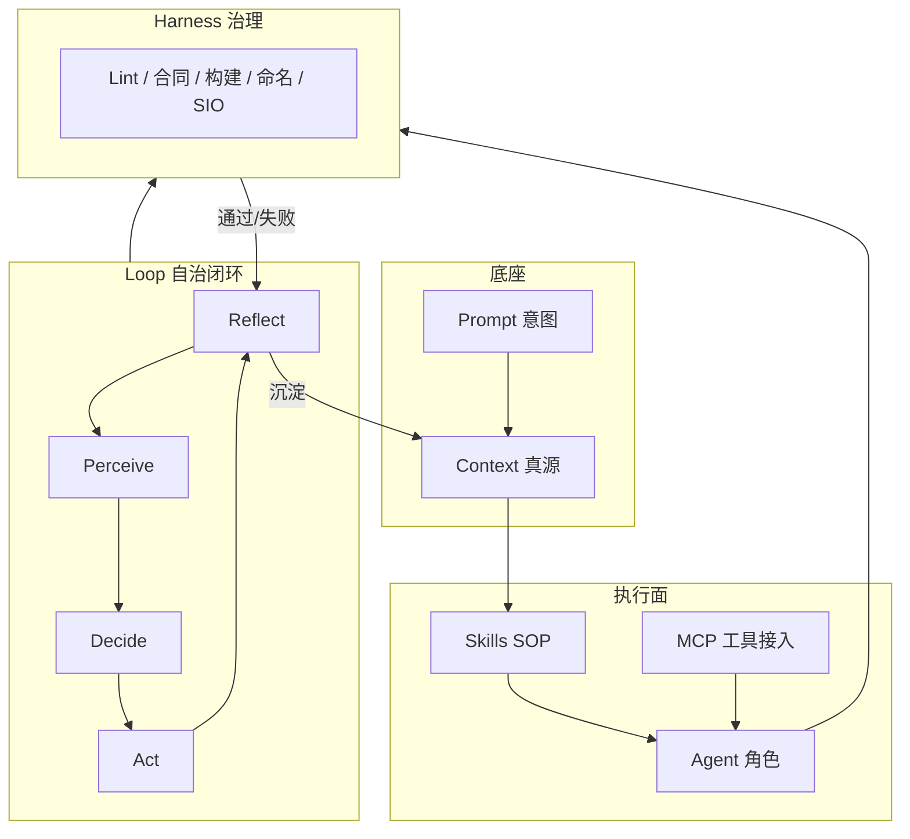

# AI 七层栈（Prompt→Context→Skills→MCP→Agent→Harness→Loop）完整机制与 UFC 优化方案核对

| 项 | 内容 |
|---|------|
| **版本** | 1.1 |
| **日期** | 2026-05-08 |
| **性质** | 报告 / 可执行对齐说明（非 PPLAN 正文替代物） |
| **对齐** | 仓库 [`UFC/AGENTS.md`](UFC/AGENTS.md)、[`UFC/docs/05_Project_Planning/PPLAN/README.md`](../docs/05_Project_Planning/PPLAN/README.md)、[`UFC/ufc_harness/README.md`](UFC/ufc_harness/README.md)、[`UFC/REPORTS/UFC_L3L4L5_CrossLayer_DataFlow_v1.md`](UFC/REPORTS/UFC_L3L4L5_CrossLayer_DataFlow_v1.md) |

---

## 0. 范围与非目标

**范围**：把业界讨论的「AI 编程全栈七层」整理为**可操作的机制说明**，并逐层映射到本仓库已有资产（文档、技能、Harness、域柱与实施路线），形成**核对表与优化缺口清单**。

**非目标**：

- 不宣称 UFC 已实现「全无人值守自治合并」；Fortran 内核仍以**合同、静态检查与验证题**为权威。
- 不把 MCP 强行定义为「Model Control Plane」；正文保留**协议本义**与**控制面比喻**的区分（见 §3）。
- 不替代 [`UFC/docs/05_Project_Planning/PPLAN/README.md`](../docs/05_Project_Planning/PPLAN/README.md) 中的权威规划路径；冲突时以 PPLAN 与域级 `CONTRACT.md` 为准。

---

## 1. 七层完整机制（定义、边界、数据/控制流）

七层是**递进叠加**：上层依赖下层提供的能力与约束，**不是**后者取代前者。

| 层 | 核心机制 | 输入 | 输出 | 与相邻层关系 |
|---|----------|------|------|----------------|
| **Prompt** | 人机意图编码：目标、验收标准、禁止项 | 人的自然语言 / Issue 模板 | 可被调度器消费的「任务描述」 | 只触达 Context 的检索键与 Harness 的策略位，不直接写代码 |
| **Context** | 长驻「事实与规范」：代码树、合同、注册表、历史决策 | 仓库快照、文档、manifest | 检索片段、规则摘要、依赖图 | Skills/Agent 的**只读真源**；Loop 复盘应**写回**可公开沉淀项 |
| **Skills** | 标准化 SOP：步骤、检查点、与架构条款对齐 | Context 指针 + 任务参数 | 合规过程与工件（补丁、报告） | Agent 的**能力包**；变更规范时优先改 Skill 再扩散模板 |
| **MCP** | *协议层*：工具/资源的注册、发现、调用与安全边界（见 §3） | 工具调用请求 | 工具结果（文件、日志、JSON） | 把 Skills 中的「执行动作」接到**可审计**的外部能力；高危写操作仍受 Harness 约束 |
| **Agent** | 多步推理 + 工具循环：规划、调用、纠错 | Prompt + Context + Skills + MCP 工具 | PR、报告、诊断 | 不得绕过 Harness；领域架构取舍须**显式记录** |
| **Harness** | 硬闸门：lint、合同、依赖方向、构建与命名 | 代码/文档/配置 | 通过/失败/门禁报告 | 包住 MCP 与 Agent 的可写范围；**Loop 永不关闭 Harness** |
| **Loop** | 事件或时间驱动的**认知闭环**：感知→决策→执行→复盘 | CI 事件、定时 tick、MR 标签 | 自动修复尝试、回归结果、Context 更新项 | 在 Harness 内编排多 Agent/多脚本；核心是**可验证**，不是无限 `while` |

### 1.1 Loop 内环（与「定时任务」的区分）

**最小闭环**（每一轮 Loop 均应可落地为可观测步骤）：

1. **感知（Perceive）**：收集差异信号（CI 失败、合同漂移、命名违规、坏链、构建错误）。
2. **决策（Decide）**：选择 Skill、变更范围、优先级（可人工策略表 + 自动化规则）。
3. **执行（Act）**：调用 Agent/MCP/脚本；产出补丁或报告。
4. **复盘（Reflect）**：校验是否通过 Harness；将重复问题沉淀为 Context（规范片段、Skill 更新、REPORT 条目）。

**与 UFC 求解语义中的 Loop 区分**：FEM 内核里的 Step/Increment/Iteration 属于**数值循环**；本文 **Loop** 指**研发运维自治闭环**，二者可并存，勿混为一谈。

---

## 2. 分层架构与依赖（Mermaid）

**依赖方向（自上而下消费）**：

`Prompt → Context → Skills → (MCP) → Agent`，全程运行于 `Harness` 边界内，由 `Loop` 重复触发与复盘。

---

## 3. MCP 术语辨析（避免架构讨论口径漂移）

| 含义 | 说明 | UFC 侧建议用法 |
|------|------|----------------|
| **Model Context Protocol** | Anthropic 等推动的**工具与资源接入协议**（Cursor 等环境中的 MCP Server） | 将**只读高频**能力（日志、CI 产物、issue 状态）MCP 化；写库须配合分支策略与 Harness |
| **控制面 / 总线比喻** | 把「注册、路由、配额」统称 MCP | 实际上常由 **Harness + CI + 编排脚本** 与 MCP **共同**承担；不必强行单一名称 |

---

## 4. UFC 仓库映射（七层 → 路径与资产）

| 层 | UFC 现状锚点 | 说明 |
|----|----------------|------|
| **Prompt** | Issue/PR 描述、PPLAN 波次模板（如 [`L3_L4_L5_波次开展_协作说明.md`](../docs/05_Project_Planning/PPLAN/03_实施规划/实施路线/L3_L4_L5_波次开展_协作说明.md)） | 「目标与完成定义」应可链接到合同与验收表 |
| **Context** | [`UFC/docs/README.md`](../docs/README.md)、[`DomainProcedureRegistry`](../docs/03_Domain_Pillars/DomainProcedureRegistry/README.md)、`UFC/ufc_core/**/CONTRACT.md`、`UFC/REPORTS/` | SSOT 以源码树 + 合同卡为准；REPORTS 为过程/交付型沉淀 |
| **Skills** | [`UFC/AGENTS.md`](UFC/AGENTS.md) 技能表、`.claude/skills/`（如 `ufc-layer-domain-feature`、`ufc-structured-io`、`ufc-domain-pillar-closure`） | 实施级规范优先固化为 Skill |
| **MCP** | Cursor/IDE 配置的 MCP 工具；仓库内可参考 `mcp-builder` 技能自建 Server | 与 `ufc_harness` 脚本互补：协议化接入 vs 仓库内 Python 工具 |
| **Agent** | Cursor Agent、外部 batch agent；遵循 [`UFC/AGENTS.md`](UFC/AGENTS.md) Repository rules | 适合批量、可验证任务（命名扫描、registry 对齐、模板生成） |
| **Harness** | [`UFC/ufc_harness/README.md`](UFC/ufc_harness/README.md)、[`UFC/config/ufc_linter.json`](UFC/config/ufc_linter.json)、仓库根 `.cursor/rules/`、`scripts/ci/`（若存在） | Fortran 语法、SIO、命名、文档结构、合同完整性等门禁 |
| **Loop** | CI 工作流、定时 `run_harness.py`、波次 MR 节奏、域柱闭环 P1–P6 | 建议**事件驱动为主**（PR/MR）、**时间兜底为辅**（夜间文档/漂移扫描） |

---

## 5. 与 UFC「优化完善方案」的核对

下列条目与 **PPLAN 主线**、**域柱闭环**、**数据流/SIO** 显式对齐；用于检查「AI 七层」是否**服务**现有工程目标，而非另起炉灶。

### 5.1 PPLAN 阶段与十件套（真源入口）

| PPLAN 主题 | 与七层的关系 | 核对结论 |
|------------|----------------|----------|
| Phase 0 端到端主链 | Context 必须能回答「主链在哪、谁依赖谁」 | 七层中的 Context/Skills 应链接 [`UFC_端到端计算流主链.md`](../docs/05_Project_Planning/PPLAN/06_核心架构/UFC_端到端计算流主链.md) |
| Phase 1–3 存储 / 依赖 / 子总纲 | Context 结构化程度影响 Agent 正确率 | 优先保证 **manifest、域依赖图** 机器可读 |
| Phase 4 桥接收敛与验收 | Harness + Loop 应用高优先级门禁 | 失败信号应进入 Loop **感知**（构建、桥接检查） |
| 闭环专项 `11_闭环落地专项/` | 域级验收表 = Harness 的「业务级」扩展 | 见 [`06_域级落地验收表_CodeReview与里程碑.md`](../docs/05_Project_Planning/PPLAN/11_闭环落地专项/06_域级落地验收表_CodeReview与里程碑.md) |
| HYPLAS 淬炼 / Populate·热路径 | Agent 生成代码必须服从 **热路径与 SIO 分工** | Skills：`ufc-layer-domain-feature` + `ufc-structured-io` |

### 5.2 L3/L4/L5 试点与波次（W0–W8）

| 试点要素 | Harness / Loop 落点 |
|----------|---------------------|
| W0 出口检查表 | Loop **Act** 阶段可脚本化对照 |
| W1 MR 分批（Def→Bridge→热路径） | Prompt 模板化 + Context 提供「当前波次允许改哪些目录」 |
| pilot 任务清单（`.f90` 列表） | **Decide** 阶段用于分批与并行 Agent 分箱 |

权威入口：[`ufc-layer-l3-l4-l5-pilot.md`](../docs/05_Project_Planning/PPLAN/03_实施规划/实施路线/ufc-layer-l3-l4-l5-pilot.md)、[`L3_L4_L5_pilot_f90任务清单.md`](../docs/05_Project_Planning/PPLAN/03_实施规划/实施路线/L3_L4_L5_pilot_f90任务清单.md)。

### 5.3 域柱贯通（P1–P6）与 Skills

| 机制 | UFC 资产 |
|------|-----------|
| 域柱闭环固化 | Skill：`ufc-domain-pillar-closure`（P1–P6 推广、registry、最小验收） |
| 跨层数据流与 Hard SIO | [`UFC_L3L4L5_CrossLayer_DataFlow_v1.md`](UFC/REPORTS/UFC_L3L4L5_CrossLayer_DataFlow_v1.md) §1.5；[`UFC/AGENTS.md`](UFC/AGENTS.md) Repository rules §5 |
| 模板域 → 业务域 | Context 中 **DOMAIN_PILLAR_CARD** / `CONTRACT.md` 的 SIO 小节 |

### 5.4 `ufc_harness` 与 Loop 的衔接

| 能力 | 脚本/入口 | 建议 Loop 角色 |
|------|-----------|----------------|
| 文档结构 / 坏链 | `run_harness.py doc-structure`、`plan-checks` | Perceive：文档漂移 |
| 命名检查 | `naming_checker` | Perceive + Act：自动报告/辅助修复 |
| SIO 检查 | `sio_checker` | Perceive：PR 门禁 |
| 合同完整性 / 架构 | `contract_completeness.py`、`domain_boundary_checker.py` | Perceive：合同与依赖越界 |
| 构建 | `build_trigger.py` | Act：语法与链接阶段验证 |

详见 [`UFC/ufc_harness/README.md`](UFC/ufc_harness/README.md)。

---

## 6. 差距与优化建议（可执行清单）

下列项为**在现有 UFC 方法论下的增强**，不改变内核架构前提。

| ID | 现状 | 建议 | 受益层 |
|----|------|------|--------|
| G-01 | Context 分散在 docs / REPORTS / 合同卡 | 在 PPLAN 或 Registry 维护「**Agent 必读最短路径**」一页索引（链接到 SSOT） | Context / Agent |
| G-02 | Harness 工具丰富但 CI 集成度因仓库而异 | 将 `doc-structure`、`naming_checker`、`sio_checker` **分级**纳入 PR 必选/可选 | Harness / Loop |
| G-03 | Loop 多为人工驱动波次 | 增加 **事件驱动**：CI 失败 → 自动附加 harness 日志摘要 → Skill 建议修复路径 | Loop |
| G-04 | MCP 与 `ufc_harness` 边界未写清 | 约定：**仓库内可复现**走 `ufc_harness`；**外部系统只读**可走 MCP | MCP / Harness |
| G-05 | 复盘沉淀不统一 | Loop **Reflect** 固定产出：更新 `UFC/REPORTS/` 或「坑点」进 Domain 卡 / Skill | Loop / Context |
| G-06 | 数值正确性 | Agent 不得替代 **fem-kernel-verification**；合并前保留 Patch test / 金值等 Harness | Harness |

---

## 7. 一句话总纲（便于对外同步）

**Prompt 给目标，Context 给真源，Skills 给标准作业法，MCP 给受控工具接入，Agent 给多步执行，Harness 给硬闸门，Loop 把「感知—决策—执行—复盘」做成常态；UFC 的优化完善仍服从 PPLAN、域柱与合同，AI 栈用于加速对齐而非绕过验证。**

---

## 8. 参考链接（仓库内）

- [`UFC/AGENTS.md`](UFC/AGENTS.md)
- [`UFC/docs/05_Project_Planning/PPLAN/README.md`](../docs/05_Project_Planning/PPLAN/README.md)
- [`UFC/REPORTS/UFC_L3L4L5_CrossLayer_DataFlow_v1.md`](UFC/REPORTS/UFC_L3L4L5_CrossLayer_DataFlow_v1.md)
- [`UFC/docs/03_Domain_Pillars/DomainProcedureRegistry/CONVENTIONS.md`](../docs/03_Domain_Pillars/DomainProcedureRegistry/CONVENTIONS.md)
- [`UFC/ufc_harness/README.md`](UFC/ufc_harness/README.md)

---

## 9. 与「公众号式」七层叙事的互补关系

下列内容对理解 **UFC/REPORTS** 中工程版七层文档**有帮助**，但需在工程落地时**收紧口径**：

| 公众号叙事强项 | 对 UFC 文档的帮助 |
|----------------|------------------|
| 把七层说成「从人类意图到永续运转」的闭环 | 与本文 §1、§2 一致，便于对外宣讲与 onboarding |
| Context 五大块（代码库、规约、决策、故障、团队规范） | 可直接映射到 UFC/docs、CONTRACT.md、REPORTS/、PPLAN 与流程说明 |
| Skills 按代码/工程/运维分类 | 与 AGENTS.md 技能表 + .claude/skills/ 的落地方式一致 |
| MCP「注册、纳管、路由、通信与管控」四职责 | 有助于理解「为何要有统一工具面」；但**工程上**多 Agent 路由/配额常由 **CI + 编排脚本 + Harness** 与 **MCP 工具层**共同承担（见本文 §3） |
| Harness：架构约束、权限、合规、熔断 | 与 UFC 合同、linter、ufc_harness 门禁高度同构 |
| Loop：动态状态机 + 感知-决策-执行-复盘 | 与本文 §1.1 一致；须与 **FEM 数值循环**（Step/Increment/Iteration）严格区分 |
| **道法术器** | 见 §10：可作为心智模型，**不替代** PPLAN/合同的技术真源 |

**需在 UFC 侧刻意区分的口径**：

1. **Harness**：公众号译作「执行引擎」偏 motivational；在 UFC 中 **Harness = 治理与门禁（缰绳）**，**执行**主要由 Agent + Skills + 构建/测试运行时完成，避免术语混用导致「Harness 里跑业务逻辑」的误解。  
2. **MCP**：保持 **Model Context Protocol** 本义（工具/资源接入）；不宜在架构图里单独承担「全栈多 Agent 总线」的全部职责，除非你们**显式**自建一层编排服务并写清边界。  
3. **「脱离人工干预」**：对 Fortran 内核与 V&V，UFC 仍应坚持 **人/门禁对合并与数值结论负责**；Loop 的目标是 **减少重复劳动与漂移**，不是取消工程责任。

---

## 10. 道法术器 × 七层（UFC 可用对照）

| 道法术器 | 含义（简） | 在七层中的主要锚点（UFC） |
|----------|------------|---------------------------|
| **道** | 为何做、演化方向、人与 AI 分工 | **Prompt**（顶层目标与验收）；**Loop** 的「为何转、转什么」 |
| **法** | 规矩、框架、边界 | **Context**（规约/合同/架构真源）；**Harness**（lint/合同/SIO/依赖）；**MCP**（工具接入与权限的协议层约定） |
| **术** | 怎么做、拆解与应变 | **Prompt** 写法；**Agent** 分角色；**Skills** 封装与迭代；**Loop** 的复盘与策略调整 |
| **器** | 借用的工具与载体 | **Skills**（可调用能力）；**MCP Servers**（外部工具）；**Agent**；ufc_harness 脚本；CI Job |

**常见误区（与公众号「辩证思考」对齐，落到 UFC）**：重器轻道（只堆脚本不更新合同）、重术轻法（只调 Agent 不加固 Harness）、有道无术（只写 PPLAN 不落地 Loop）、有术无道（只修 CI 不对齐域柱与数据链）。

---

## 11. 能否搭建「属于 UFC」的完整链路 Prompt→Context→Skills→MCP→Agent→Harness→Loop？

**结论：可以；且主体已具备，缺口主要在「Loop 的产品化」与「Context 对 Agent 的最短路径」。**

| 环节 | UFC 现状 | 若要「完整闭环」可补的一刀 |
|------|----------|---------------------------|
| **Prompt** | Issue/PR、波次说明、验收表述 | 固定 **UFC 任务模板**（链接到域合同 + 完成定义） |
| **Context** | docs、Registry、CONTRACT、REPORTS | **Agent 必读索引**（单页 SSOT 入口，见前文 G-01） |
| **Skills** | AGENTS.md + ufc-* / em-kernel-* skills | 新域/新规范时 **先改 Skill 再改生成器** |
| **MCP** | IDE 可选接入 | 优先 **只读**（CI 日志、issue）；写操作仍走分支与 Harness |
| **Agent** | Cursor / 批处理 | 与 **W0/W1 分箱、pilot 清单** 绑定，避免越界改合同 |
| **Harness** | ufc_harness、ufc_linter、.cursor/rules | **PR 分级门禁**（G-02）：必选 vs 可选检查 |
| **Loop** | 部分脚本 + 人工波次 | **事件驱动**（PR/CI）+ **定时兜底** + **Reflect 写回** REPORTS/Skill（G-03、G-05） |

**一句话**：公众号材料提升**认知与叙事**；UFC 落地以 **UFC/REPORTS/AI_SevenLayer_Stack_UFC_Mechanism_and_Optimization.md + PPLAN + 合同** 为纲，把「完整链路」做成 **可门禁、可复盘、不绕过验证** 的工程系统，而非口号。

*本节版本：1.1-append（随 §9–§11 增补）*
