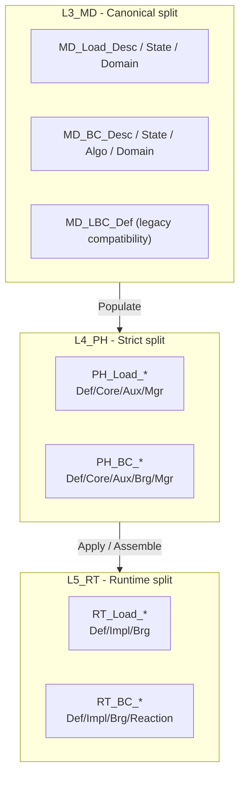

# LoadBC 域功能模块清单 (Domain Module Inventory)

**路径**: `UFC/REPORTS/LoadBC_Domain_Inventory.md`  
**对齐规范**: `REPORT_Naming_Unified_Spec.md`（域缩 = `LoadBC`；实现已拆为 `Load` / `BC` 双柱）  
**源文档**: `LoadBC_L3L4L5_four_type_synthesis.md`, `LoadBC_Procedure_Algorithm.md`, `ufc_core/L3_MD/LoadBC/CONTRACT.md`, `ufc_core/L4_PH/LoadBC/CONTRACT.md`

---

## 1. 域简述

| 属性 | 值 |
|------|-----|
| **域柱类型** | 全贯通域柱 (P4) |
| **域缩** | `LoadBC`（实现层分为 `Load` / `BC`） |
| **层覆盖** | `L3_MD` / `L4_PH` / `L5_RT` |
| **功能** | 载荷定义、边界条件定义、幅值引用、运行期装配与施加 |
| **canonical 口径** | L3 `MD_Load_*` + `MD_BC_*`；L4 `PH_Load_*` + `PH_BC_*`；L5 `RT_Load_*` + `RT_BC_*` |
| **runtime umbrella / legacy** | `Boundary/`、`MD_LBC_Def.f90`，以及 L5 的 `RT_LoadBC_Proc/Core/ConstApply` 编排/兼容层 |

---

## 2. 结构总览



---

## 3. 功能模块清单

### 3.1 L3_MD（冷路径定义）

| 文件 | 角色 | 说明 | 状态 |
|------|------|------|------|
| `MD_Load_Def.f90` | `Def` | 纯 Load 四型权威：`MD_Load_Desc` / `State` / `Domain` | **ACTIVE** |
| `MD_BC_Def.f90` | `Def` | 纯 BC 四型权威：`MD_BC_Desc` / `State` / `Algo` / `Domain` | **ACTIVE** |
| `MD_LoadBC_Types.f90` | `Types` | 聚合 Load/BC 类型引用与控制类型 | **ACTIVE** |
| `MD_LBC_Def.f90` | `Def` | 旧 mixed 兼容层（保留，不作新真源） | **LEGACY** |

### 3.2 L4_PH（严格 Load / BC 双柱）

| 文件 | 角色 | 说明 | 状态 |
|------|------|------|------|
| `PH_Load_Def.f90` | `Def` | Load 侧类型与 `_Arg` | **ACTIVE** |
| `PH_Load_Core.f90` | `Core` | 集中力 / 分布力 / 重力 / 热载等组装核 | **ACTIVE** |
| `PH_Load_Aux_Def.f90` | `Aux_Def` | `PH_Load_Stp_Ctl_Algo` | **ACTIVE** |
| `PH_Load_Mgr.f90` | `Mgr` | `PH_Load_Ctx` 与装配操作 | **ACTIVE** |
| `PH_Load_NestedToFlat.f90` | `Proc` | Load flatten / 投影 | **ACTIVE** |
| `PH_BC_Def.f90` | `Def` | BC 侧类型定义 | **ACTIVE** |
| `PH_BC_Core.f90` | `Core` | Dirichlet / CSR / dense apply 核 | **ACTIVE** |
| `PH_BC_Aux_Def.f90` | `Aux_Def` | `PH_BC_Stp_Ctl_Algo` | **ACTIVE** |
| `PH_BC_Mgr.f90` | `Mgr` | `PH_BC_Ctx` 与方法控制 | **ACTIVE** |
| `PH_BC_Brg.f90` | `Brg` | BC 桥接与 CSR 结构 | **ACTIVE** |
| `PH_BC_NestedToFlat.f90` | `Proc` | BC flatten | **ACTIVE** |
| `PH_BC_FlatToNested.f90` | `Proc` | BC WriteBack / mask | **ACTIVE** |

### 3.3 L5_RT（runtime split + umbrella 编排）

| 文件 | 角色 | 说明 | 状态 |
|------|------|------|------|
| `RT_Load_Def.f90` | `Def` | `RT_Load_Desc / State / Algo / Ctx` | **ACTIVE** |
| `RT_Load_Impl_Def.f90` | `Impl_Def` | Load runtime impl 四型（含 cutback / amp） | **ACTIVE** |
| `RT_Load_Impl.f90` | `Impl` | Load 侧施加实现 | **ACTIVE** |
| `RT_Load_Brg.f90` | `Brg` | Load runtime 桥接 | **ACTIVE** |
| `RT_BC_Def.f90` | `Def` | `RT_BC_Desc / State / Algo / Ctx` | **ACTIVE** |
| `RT_BC_Impl_Def.f90` | `Impl_Def` | BC runtime impl 四型（含 convergence / cutback） | **ACTIVE** |
| `RT_BC_Impl.f90` | `Impl` | BC 侧施加实现 | **ACTIVE** |
| `RT_BC_Brg.f90` | `Brg` | BC runtime 桥接 | **ACTIVE** |
| `RT_BC_ReactionForce.f90` | `Reaction` | 反力恢复与约束后处理 | **ACTIVE** |
| `RT_LoadBC_ConstApply.f90` | `Constraint_Brg` | Tie/MPC/Coupling/RigidBody 的 penalty/CSR 约束施加桥 | **ACTIVE** |
| `RT_LoadBC_Proc.f90` | `Proc` | 运行期 umbrella SIO facade，封装对 `RT_LoadBC_Impl` 的调用 | **ACTIVE** |
| `RT_LoadBC_Core.f90` | `Core` | 旧 facade；保留 Init/Assemble/Apply 等兼容实现 | **LEGACY** |

---

## 4. 关键控制载体

| 层 | 载体 | 关键字段 / 含义 |
|----|------|-----------------|
| L3 | `MD_Load_Desc` | `magnitude`, `scale_factor`, `time_dependence`, `amplitude_id`, `load_type` |
| L3 | `MD_BC_Algo` | `apply_mode`, `penalty_factor`, `ramp_fraction`, `use_ramp`, `lagrange_multiplier` |
| L4 | `PH_Load_Stp_Ctl_Algo` | 载荷积分 / follower / projection 控制 |
| L4 | `PH_BC_Stp_Ctl_Algo` | BC enforcement / cache / method 控制 |
| L5 | `RT_Load_Impl_Algo` | `max_cutbacks`, `auto_cutback_enabled`, `cutback_factor`, `min_load_increment` |
| L5 | `RT_BC_Impl_Algo` | `max_cutbacks`, `auto_cutback_enabled`, `cutback_factor`, `load_convergence_tol` |

---

## 5. 算法主链

```text
L3 MD_Load_* / MD_BC_* (cold definitions)
  -> Populate / bridge
  -> L4 PH_Load_* / PH_BC_* (local load assembly + BC application)
  -> L5 RT_Load_* / RT_BC_* (runtime orchestration, cutback, reaction)
  -> RT_Asm_* global K/F
```

---

## 6. 当前残余缺口

| 项 | 优先级 | 现状 |
|----|--------|------|
| `REPORTS` 旧 mixed 叙事 | P0 | 本次已切到 split canonical |
| L5 contract 仍含 umbrella `RT_LoadBC_*` 叙事 | P1 | 尚待继续对齐 `L5_RT/LoadBC/CONTRACT.md` |
| `Boundary/` 与 `MD_LBC_Def.f90` legacy 清理 | P1 | 仍保留兼容，不再作为文档主真源 |
| 用户载荷 ABI wrapper 独立化 | P1 | 尚未形成独立 `RT_DLOAD_*` / `RT_ULOAD_*` 文件 |

---

> **END** — LoadBC Domain Inventory v2.0（已按 Load / BC 双柱 canonical 重刷）
