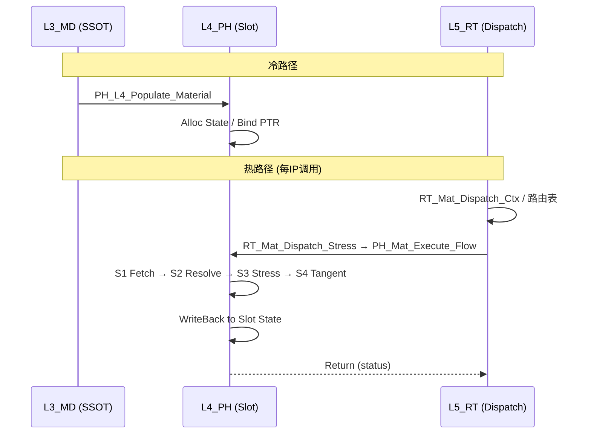

# Material 域功能模块清单 (Domain Module Inventory)

**路径**: UFC/REPORTS/Material_Domain_Inventory.md  
**对齐规范**: REPORT_Naming_Unified_Spec.md（域缩=**Mat**）；[Domain_Compression_Canon.md](Domain_Compression_Canon.md)（P1 柱 **`Mat`**）；层缀 MD/PH/RT  
**源文档**: Material_L3L4L5_four_type_UMAT_discussion_synthesis.md, Material_Procedure_Algorithm.md, Procedure_Pointer_Inventory.md  

**权威性与漂移**: 本清单用于导航与切片规划；若与 **`UFC/ufc_core/**/Material/**/CONTRACT.md`**（若存在）或 **`UFC/ufc_core` 源码**不一致，**以 CONTRACT + 代码为准**，并应在本文件中追平（见 `Material_Refactor_Slice01_TaskCard.md`）。

---

## 1. 域简述

| 属性 | 值 |
|------|-----|
| **域柱类型** | 全贯通域柱 (P1) |
| **域缩** | Mat |
| **层覆盖** | L3_MD (模型定义), L4_PH (物理核), L5_RT (运行时编排) |
| **功能** | 材料本构模型定义、注册、应力更新、切线模量、状态变量管理 |
| **源手册** | Abaqus ANALYSIS_3 (Materials Part V) + USER.pdf (UMAT/VUMAT) |

## 2. 四型结构总览

```mermaid
graph TB
    subgraph L3_MD[L3_MD - Model Definition (SSOT)]
        MD_Mat_Desc["MD_Mat_Desc<br/>族 Desc: Elas/Plast/Hyper/...<br/>User Desc: UMAT 扩展"]
        MD_Mat_State["MD_Mat_State<br/>状态变量声明<br/>stateVars(:) 布局"]
        MD_Mat_Algo["MD_Mat_Algo<br/>族选择枚举<br/>步控参数"]
        MD_Mat_Ctx["MD_Mat_Ctx<br/>配置查询上下文"]
    end
    subgraph L4_PH[L4_PH - Physics Kernel (Hot Path)]
        PH_Mat_Slot["PH_Mat_Slot<br/>四型槽容器"]
        PH_Mat_Desc["PH_Mat_Desc + 辅<br/>Cfg_Init / Pop_Vld"]
        PH_Mat_State["PH_Mat_State + 辅<br/>Lcl_Comp(应力/切线)<br/>Lcl_Evo(状态变量)"]
        PH_Mat_Algo["PH_Mat_Algo + 辅<br/>Stp_Ctl<br/>constitutive PTR"]
        PH_Mat_Ctx["PH_Mat_Ctx + 辅<br/>Inc_Evo(步/增量)<br/>Lcl_Comp(应变/温度)"]
    end
    subgraph L5_RT[L5_RT - Runtime Orchestration]
        RT_Mat_Algo["RT_Mat_Algo<br/>Stp_Ctl_Algo(分发)"]
        RT_Mat_Core["RT_Mat_Core<br/>RT_Mat_Dispatch_Stress / Tangent"]
    end
    L3_MD -->|Populate| L4_PH
    L4_PH -->|Dispatch| L5_RT
    L5_RT -->|经表路由调用 L4| L4_PH
```

## 3. 功能模块清单

### 3.1 L3_MD (模型定义层)

| 文件 | 模块角色 | 模块名 | 关键子程序 | 接口 | 状态 |
|------|---------|--------|-----------|------|------|
| MD_Mat_Def.f90 | Def | MD_Mat_Def | CreateDesc, GetModelType | — | EXIST |
| MD_Mat_Reg.f90 | Reg | MD_Mat_Registry | RegisterFamily(11族), LookupDesc | — | EXIST |
| MD_Mat_Elas_Def.f90 | Def | MD_Mat_Elas_Def | SetElasticProps | EXTENDS MD_Mat_Desc | EXIST |
| MD_Mat_Plast_Def.f90 | Def | MD_Mat_Plast_Def | SetPlasticHardening | EXTENDS MD_Mat_Desc | EXIST |
| MD_Mat_Hyper_Def.f90 | Def | MD_Mat_Hyper_Def | SetHyperelasticParams | EXTENDS MD_Mat_Desc | EXIST |
| MD_Mat_User_Def.f90 | Def | MD_Mat_User_Def | SetUMATProps(nprops,nstatv) | EXTENDS MD_Mat_Desc | EXIST |
| MD_MatPH_Brg.f90 | Brg | MD_MatPH_Brg | PopulateL4Slot, ValidateDesc | — | EXIST |

### 3.2 L4_PH (物理内核层) — 中枢与真源

> **说明**: 族实现分布在 `Elas/`、`Plast/`、`Hyper/` 等子目录；下列为**域入口/槽池/执行流**真源，非全量文件枚举。

| 文件 | 模块角色 | 模块名 | 关键内容 | 状态 |
|------|---------|--------|----------|------|
| PH_Mat_Def.f90 | Def | PH_Mat_Def | 对外聚合 USE：`PH_Mat_Slot`、四型、`PH_MAT_*` 枚举等 | EXIST |
| PH_Mat_Domain_Core.f90 | Domain | PH_Mat_Domain_Core | `PH_Mat_Slot`、`PH_Mat_Domain`、`PH_Mat_Eval_Arg`、`PH_Mat_Constitutive_Ifc`、DualWrite、槽池生命周期 | EXIST |
| PH_Mat_KernelDefn.f90 | Def | PH_Mat_KernelDefn | `PH_Mat_Update_Arg`、注册表用 kernel 抽象接口（与域 SIO `Eval_Arg` 并存） | EXIST |
| PH_Mat_Core.f90 | Proc | PH_Mat_Core | `PH_Mat_Execute_Flow`、`PH_Mat_Execute_Tangent_Flow`、S1–S4 步骤子程序 | EXIST |
| PH_Mat_Reg.f90 | Reg | PH_Mat_Reg | 族 kernel 注册与调度表 | EXIST |
| PH_Mat_Aux_Def.f90 | Aux | PH_Mat_Aux_Def | 四型辅 TYPE（Cfg/Pop/Inc/Lcl 等） | EXIST |
| PH_Mat_Dispatch.f90 | Mgr | PH_Mat_Dispatch | L4 侧族/模型分发辅助 | EXIST |
| PH_L4_Populate.f90 | Brg | PH_L4_Populate | `PH_L4_Populate_Material`：L3→L4 槽填充 | EXIST |
| Contract/PH_Mat_*.f90 | Def/Brg | 若干 | UMAT/本构契约与 props 定义 | EXIST |
| Dispatch/PH_Mat*.f90 | Proc | 若干 | 族调用门面（如 `PH_MatEval`、PLM 等） | EXIST |

**已弃用/不存在于仓库的 Inventory 旧名（勿再写入任务卡）**: 独立文件 `PH_Mat_Constitutive_Ifc.f90`、`PH_Mat_Slot_Mgr.f90`、`PH_Mat_Execute_Flow.f90`、`PH_Mat_Update_Arg.f90`、`PH_Mat_Elas_Execute.f90` — 能力已合并至 **`PH_Mat_Domain_Core`** / **`PH_Mat_Core`** / **`PH_Mat_KernelDefn`** 或族 `*_Eval.f90`、`*_Core.f90`。

### 3.3 L5_RT (运行时层)

| 文件 | 模块角色 | 模块名 | 关键子程序 | 接口 | 状态 |
|------|---------|--------|-----------|------|------|
| RT_Mat_Def.f90 | Def | RT_Mat_Def | `RT_Mat_Algo`、`RT_Mat_Dispatch_Ctx`、路由表类型 | EXIST |
| RT_Mat_Core.f90 | Core | RT_Mat_Core | `RT_Mat_Dispatch_Stress`、`RT_Mat_Dispatch_Tangent`、表 init/register（**非**独立 `RT_Mat_Dispatch.f90`） | EXIST |
| RT_Mat_Brg.f90 | Brg | RT_Mat_Brg | 自 L4 域构建路由表等 | EXIST |
| RT_Mat_*_Core.f90 / RT_Mat_*_Def.f90 | 族 | 各模块 | 13 族运行时 Def/Core（与 `PH_Mat_Reg` 族枚举对齐） | EXIST |

## 4. 关键子程序签名

### 4.1 本构抽象接口 (`PH_Mat_Constitutive_Ifc`)

定义位置：**`PH_Mat_Domain_Core.f90`**（非独立 Ifc 文件）。与旧式五参 `(desc,state,algo,ctx,args)` 不同，当前为 **域 SIO 形**：`PH_Mat_Eval_Arg` + `status`。

```fortran
ABSTRACT INTERFACE
  SUBROUTINE PH_Mat_Constitutive_Ifc(desc, state, arg, status)
    USE IF_Prec_Core, ONLY: wp, i4
    IMPORT :: PH_Mat_Desc, PH_Mat_State, PH_Mat_Eval_Arg, i4
    TYPE(PH_Mat_Desc),      INTENT(IN)    :: desc
    TYPE(PH_Mat_State),     INTENT(INOUT) :: state
    TYPE(PH_Mat_Eval_Arg),  INTENT(INOUT) :: arg
    INTEGER(i4),            INTENT(OUT)   :: status
  END SUBROUTINE
END INTERFACE
```

**`PH_Mat_Update_Arg`**: 仍由 **`PH_Mat_KernelDefn`** 提供，供 **注册/kernel 回调路径**使用；与 **`PH_Mat_Eval_Arg`**（嵌套 `inp`/`out` 辅 TYPE）并行存在 — 迁移 SIO 时勿混名。

### 4.2 Populate 签名

```fortran
SUBROUTINE PH_L4_Populate_Material(ph_dom, mat_id, status, md_src)
  USE IF_Prec_Core, ONLY: i4
  TYPE(PH_Mat_Domain), INTENT(INOUT) :: ph_dom
  INTEGER(i4),         INTENT(IN)    :: mat_id
  TYPE(ErrorStatusType), INTENT(OUT) :: status
  TYPE(MD_L3_LayerContainer), INTENT(IN), OPTIONAL :: md_src
END SUBROUTINE
```

（完整 `USE` 列表以 **`PH_L4_Populate.f90`** 为准。）

### 4.3 L5 Dispatch 签名

```fortran
SUBROUTINE RT_Mat_Dispatch_Stress(ctx, status, material_dom)
  TYPE(RT_Mat_Dispatch_Ctx), INTENT(INOUT) :: ctx
  TYPE(ErrorStatusType),     INTENT(OUT)   :: status
  TYPE(PH_Mat_Domain), INTENT(IN), OPTIONAL, TARGET :: material_dom
END SUBROUTINE
```

`RT_Mat_Dispatch_Tangent` 同形。实现模块：**`RT_Mat_Core`**（`RT_Mat_Core.f90`）。

## 5. 算法流程图 (S0-S4 Pipeline)



## 6. 三维度过程算法

| 维度 | 描述 | UFC 映射 |
|------|------|----------|
| **空间** | IP 点本构更新 | Gauss 点应变->应力映射 |
| **时间** | 增量步内 S1/S2/S3/S4 | 步/增量/迭代状态机 |
| **动作** | S-Pipeline | 获取槽->族路由->应力->切线->写回 |

## 7. TODO / 缺口（实际代码审计 2026-05-05）

| 项 | 优先级 | 状态 | 说明 |
|----|--------|------|------|
| 11 family 全标记 | P0 | **DONE** | `PH_Mat_Def` 定义 12 族（含 USER/UMAT/VUMAT），与 L5_RT/Material 13 _Def 模块对应 |
| MD_Mat_Desc/Algo/State | P1 | ⏸保留(已弃用标记) | MD_Mat_Def.f90(374-386) 已有 ! DEPRECATED, EXTENDS 新类型已定义, 待族文件迁移后移除 |
| 11 family Execute 完整 | P0 | **40%** | L5_RT 13 族: Elas/Plast/Hyper/Visco/Creep/Damage/Geo/Comp/Therm/Acou/User 各有 _Core; 但 L4 侧 `PH_Mat_Core` 仅接入 ~7 族, 完整度约 40% |
| DualWrite 实装 | P0 | **DONE** | `PH_Mat_State_DualWrite_Stress6/Ctan66/StateVars` 在 `PH_Mat_Domain_Core.f90`(218-250) 已实现，`PH_Mat_Core.f90`(356-424) 已消费 |
| UMAT 对偶表全面化 | P1 | **DONE** | 25+ `UF_*_UMAT` wrappers 在 `PH_MatPLMEval.f90` 已集成, `PH_UMAT_Def` 及 `PH_GTN_UMAT_API`/`PH_Mat_PLM_J2_UMAT_API` 均有实现 |
| UMAT non-UMAT 用户材料钩子 | P2 | **UNDONE** | `PH_MAT_USER_VUMAT` 标记存在(100)但无显式 VUMAT 桥实例 |
| props 机器可读表 | P2 | **UNDONE** | 各族 props 布局仍为 Fortran 源码内嵌, 无自动 JSON/CSV 导出 |

---

> **END** — Material Domain Inventory v1.1（对齐 PH_Mat_Domain_Core / RT_Mat_Core；修正旧文件名与 Eval/Update Arg 双轨说明）
