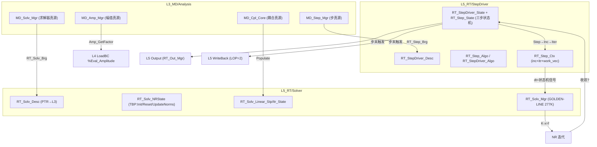

# 分析域：L3 / L5、四型、Step / Amplitude / Solver / Coupling 四子域 — 合订（一体化设计）

**文档性质**：与 **`Material_…`**（材料）、**`Element_…`**（单元/UEL）、**`Section_…`**（截面）、**`Contact_…`**（接触）、**`LoadBC_…`**（载荷/BC）、**`Output_…`**（输出）、**`WriteBack_…`**（写回）并列的 **Analysis 域柱合订**；把 **分析步/幅值/求解器/耦合** 作为 **四子域复合半贯通柱**（L3+L5，L4 无独立域），写清 **L3 定义 → L5 执行** 的分工、**四型** 裁剪与 **与 StepDriver/Solver 金线** 的衔接。
**代码真源**：`ufc_core/L3_MD/Analysis/`（L3 分析步/幅值/求解器/耦合定义，6 个子目录 + 2 桥 + 1 Comp，见 `Analysis/CONTRACT.md`）；`ufc_core/L5_RT/StepDriver/`（L5 步驱动 12 个 .f90，见 **`RT_Step_Def.f90`** AUTHORITY）；`ufc_core/L5_RT/Solver/`（L5 求解器 15 个 .f90，见 **`RT_Solv_Def.f90`** AUTHORITY）；L4 无独立 Analysis 域。
**报告 ID**：`REP-ANALYSIS-PILLAR`；**命名与五场景（S0–S4）**：`REPORTS/REPORT_Naming_Quad_OnePager_FiveScenes.md` §1、§3。

**与跨域模板关系**：**`Pillar_L3L4L5_CrossLayer_Design_Template.md` §4.1** Analysis 行；**一页填槽** **`OnePager_FourKind_MasterAux_Nesting.md` §3.4**；**本文件 §3.5** 四型主/辅架构图解（四子域分节+三步状态机+mermaid）。
**一体化联动审查**：与 **WriteBack 合订本 §3.5.7a**（UEXTERNALDB LOP 生命周期映射与 Analysis Step 对偶）；**LoadBC 合订本**（幅值 `Amp_GetFactor` 由 LoadBC 消费）；**Output 合订本**（步末触发输出 vs 步驱动信号）— **同议题同批次**改。
**外部手册锚点（只读核对）**：优先 **`Manual/ANALYSIS_1.pdf`**（*Vol.I* 分析步定义/过程）、**`ANALYSIS_2.pdf`**（步过程与 prescribed conditions）、**`KEYWORD.pdf`**（`*STEP`、`*AMPLITUDE`、`*SOLVER`、`*COUPLED TEMPERATURE-DISPLACEMENT`…）；以本域 `CONTRACT` 为准。

---

## 功能模块完整性公式

**完整功能模块 = 数据结构（四型TYPE：Desc/State/Algo/Ctx + Args）+ 过程算法（空间维度 + 时间维度 + 动作维度）**

- **数据结构侧**（四子域）：
  - **Step**: `MD_Step_Desc/State/Algo/Ctx`(L3) + `RT_Step_Desc/State/Algo/Ctx`(L5) + `RT_Step_Stp_Ctl_Algo`(auto_dt/target_iters/growth/cutback)
  - **Amplitude**: `MD_Amp_Desc/State` + `MD_Amp_Algo` + `MD_Amplitude_Eval_Ctx`(L3) + 8 种 `MD_Amp_*_Arg`(SIO)
  - **Solver**: `MD_Solver_Desc/State/Algo/Ctx`(L3) + `RT_Solv_NRState`(L5 含TBP) + `RT_Solv_Itr_Algo`
  - **Coupling**: `MD_Cpl_Desc/State/Algo/Ctx`(L3) + `MD_Cpl_Stp_Ctl_Algo`
- **过程算法侧**：三步状态机（Step → Increment → Iteration）+ K·x=f Pipeline（Assembly → Factorize → Solve → UpdateNorms → Check）为**动作维度**；`RT_Step_Stp_Ctl_Algo`(时间维度步控) + `RT_Solv_Itr_Algo`(迭代控制 Newton 策略) + `MD_Cpl_Stp_Ctl_Algo`(耦合松弛/子循环) + 空间维度（网格离散/求解器拓扑）驱动全管道
- **两则关系**：四子域各自持有 `Algo` TYPE（L3 定义/L5 运行时）同时是数据结构第四槽和 Pipeline 策略容器（R-12）
- **半贯通复合柱特殊性**：L4 无独立 Analysis 域——三步状态机编排全部在 L5 完成（`RT_StepDriver` + `RT_Solv_Mgr`），L4 物理核以消费式调用响应步驱动信号；这意味着过程算法的时间维度（三步状态机）是 Analysis 域的编排核心
- **本节与 `Analysis_Procedure_Algorithm.md`** 互补对照：后者展开各子域 `Algo TYPE` 字段细节、K·x=f Pipeline 的步骤级时序和四子域间的跨域编排

---

## 0. 文档目的与范围

| 涵盖 | 不涵盖 |
|------|--------|
| Analysis 域在 **半贯通复合柱** 中的职责；四子域 L3/L5 分工 | 具体 **NR 迭代公式**、**弧长法推导** |
| **L3** `MD_Step_*` / `MD_Amp_*` / `MD_Solv_*` / `MD_Cpl_*` 四型与模块清单 | 全仓库每一种 **求解器** 的算法细节 |
| **L5** `RT_StepDriver_*` / `RT_Solv_*` 四型与编排流程 | **L2_NM** 层的数值算法实现（见 L2 域级设计文档） |
| **L4 消费式调用** 与 **三步状态机** 机制 | **L6 AP** 层的输入解析/作业管理细节 |

---

## 1. 术语：半贯通复合柱、四子域、三步状态机

| 术语 | 含义 | Analysis 域在本文件中的定位 |
|------|------|---------------------------|
| **半贯通复合柱** | Analysis：**L3+L5** 有独立域目录，**L4 无独立域**（消费式调用物理核），且包含 **Step / Amplitude / Solver / Coupling** 四子域 | Analysis 为 **半贯通复合柱**；L4 侧无独立 Analysis 域 |
| **四子域** | Step（分析步定义/增量控制）、Amplitude（幅值曲线求值）、Solver（求解器参数/收敛判据）、Coupling（多场耦合策略） | 四子域在 L3 各有独立目录与 CONTRACT；L5 StepDriver 消纳 Step+Solver，L5 Solver 消纳 Solver 热路径 |
| **三步状态机** | Step / Increment / Iteration 三级状态（`RT_STEP_*` / `RT_INC_*` / `RT_ITER_*` 常量） | 三步状态机是 L5 StepDriver 域的核心编排机制（见 `RT_Step_Def.f90` §77–103） |

---

## 2. 三层职责总览（Analysis 相关）

### 2.1 一句话

- **L3_MD / Analysis**：**分析配置 SSOT** —— 分析步定义（类型/时间/增量）、幅值曲线定义与求值（Tabular/Smooth/Periodic/Modulated/Decay/Ramp/User）、求解器参数配置（容差/收敛判据/稳定化）、多场耦合配置（对定义/策略/松弛）；**不做** 求解执行。
- **L4_PH**：**不存独立分析域**；L4 物理核以 **消费式调用** 消纳 StepDriver 信号（步/增量/迭代状态机驱动），求解器经 L5 调度 L2_NM。
- **L5_RT / StepDriver + Solver**：**分析步驱动 + 求解执行** —— 三步状态机（Step→Increment→Iteration）、NR 迭代控制、稀疏矩阵装配/求解、收敛检查、接触残差集成；**不定义** 分析步配置、**不做** 本构计算。

### 2.2 对照表

| 层 | 主要职责 | 典型产物或类型 |
|----|----------|---------------|
| **L3_MD** | 分析步/幅值/求解器/耦合 定义与注册 | `MD_Step_*`（Desc/State/Ctx）、`MD_Amp_*`（Desc/State/Algo/Arg）、`MD_Solver_Desc/Algo/State/Ctx`、`MD_Cpl_Desc/State/Algo/Ctx` |
| **L4_PH** | 消费式调用（无独立域） | 物理核经 L5 StepDriver 信号驱动 |
| **L5_RT** | 步驱动/求解执行/状态机 | `RT_StepDriver_*`（Desc/State/Algo/Ctx + 三步常量）、`RT_Solv_*`（Desc/NRState/LinearState/Ctx）、`RT_Solv_Mgr`（277K 行金线） |

---

## 3. 三层数据流：定义 → 驱动 → 求解

### 3.1 分析步金线（冷路径）

```text
INP (*STEP / *AMPLITUDE / *SOLVER / *COUPLED TEMPERATURE-DISPLACEMENT)
  → L6_AP / KeyWord 映射
  → MD_Step_Mgr (L3 分析步注册)
  → MD_Amp_Mgr (L3 幅值注册)
  → MD_Solv_Mgr (L3 求解器配置注册)
  → MD_Cpl_Core (L3 耦合对注册)
  → RT_Step_Brg (L3→L5 步参数灌入)
  → RT_Solv_Brg (L3→L5 求解器参数灌入)
```

### 3.2 热路径（每增量/每迭代）

```text
RT_StepDriver_State (三步状态机: Step→Increment→Iteration)
  → RT_StepDriver_Cfg_Strat (步控制策略)
  → RT_Solv_Mgr (求解器金线: K·x=f)
    → RT_Solv_NRState (NR 迭代状态)
    → RT_Solv_Linear_* (线性求解)
  → 收敛检查 → 下一迭代 / Cutback / 步完成
  → 触发 Output (步末/时间点)
  → 触发 WriteBack (步末/UEXTERNALDB LOP=2)
```

### 3.3 幅值消费链（与 LoadBC 域交叉）

```text
MD_Amp_Desc (L3 幅值真源)
  → Amp_GetFactor / MD_Amp_EvalAtTime (L3 求值)
  → PH_LoadBC_Domain%Eval_Amplitude (L4 消费)
  → RT_LoadBC_ApplyLoads (L5 编排)
```

---

## 3.5 四型主/辅架构图解（L3 / L4 / L5 全景）

> 下列与 **`MD_Step_Def.f90`**、**`MD_Amp_Def.f90`**、**`MD_Solv_Def.f90`**、**`MD_Cpl_Def.f90`**、**`RT_Step_Def.f90`**、**`RT_Solv_Def.f90`**（AUTHORITY）对齐；字段变更以 .f90 / 合同为准。Analysis 为 **半贯通复合柱**：L4 无独立域，四型在 L3+L5 全景展开。

### 3.5.1 Step 子域（L3 `MD_Step_*` / L5 `RT_StepDriver_*`）

```text
L3 Step 四型（MD_Step_Def.f90 AUTHORITY）
─────────────────────────────────────────
MD_Step_State (主·State)               ← 步内运行时状态
├── MD_Step_Inc_Evo_State              ← [Phase:Inc|Verb:Evo] current_time / current_increment / total_increments / accumulated_time
└── MD_Step_Stp_Ctl_State              ← [Phase:Stp|Verb:Ctl] is_active / is_complete / is_converged / newton_iterations / cutback_count

MD_Step_Ctx (主·Ctx)                   ← 瞬态跨层上下文
├── MD_Step_Inc_Evo_Ctx                ← [Phase:Inc|Verb:Evo] step_time / total_time / time_increment / increment_number / analysis_type / nlgeom / first_increment / last_increment
└── MD_Step_Itr_Com_Ctx                ← [Phase:Itr|Verb:Comp] iteration_number / newmark_gamma / newmark_beta / hht_alpha

L5 StepDriver 四型（RT_Step_Def.f90 AUTHORITY）
───────────────────────────────────────────────
RT_Step_Desc (主·Desc)                 ← 步描述
├── RT_Step_Inc_Evo_Desc               ← [Phase:Inc|Verb:Evo] time_start / time_end / dt_init / dt_min / dt_max / max_inc / max_cutbacks
└── RT_Step_Itr_Com_Desc               ← [Phase:Itr|Verb:Comp] nr_max_iter / nr_tol

RT_Step_State (主·State)               ← 三步状态机
├── RT_Step_Inc_Evo_State              ← [Phase:Inc|Verb:Evo] inc_num / time_current / dt / total_incs
└── RT_Step_Stp_Ctl_State              ← [Phase:Stp|Verb:Ctl] step_status / n_cutbacks / total_iters / total_cpu_time

RT_Step_Algo (主·Algo)                 ← 步控制算法
└── RT_Step_Stp_Ctl_Algo               ← [Phase:Stp|Verb:Ctl] auto_dt / target_iters / growth_threshold / growth_factor / cutback_factor

RT_Step_Ctx (主·Ctx)                   ← 瞬态工作上下文
├── RT_Step_Inc_Evo_Ctx                ← [Phase:Inc|Verb:Evo] inc_status / dt_trial / time_at_inc_start / inc_converged
├── RT_Step_Itr_Com_Ctx                ← [Phase:Itr|Verb:Comp]
│   ├── RT_Step_Itr_Ctrl               ← iter_status / inc_iters / inc_iters_max
│   ├── RT_Step_Itr_Residual           ← res_norm_0 / res_norm / res_norm_prev
│   └── RT_Step_Itr_Metrics            ← disp_norm / conv_rate / pnewdt
├── work_vec(:) POINTER
├── temp_scalar
└── pool_slot

RT_StepDriver_Desc (L5 旧版主·Desc, 逐步迁移→RT_Step_Desc)
RT_StepDriver_State (L5 旧版主·State, 逐步迁移→RT_Step_State)
RT_StepDriver_Algo (L5 旧版主·Algo, 逐步迁移→RT_Step_Algo)

三步状态机常量（RT_Step_Def.f90 §77–103）：
  Step:  IDLE / RUNNING / CONVERGED / CUTBACK / FAILED / COMPLETED
  Inc:   IDLE / PREDICTING / ITERATING / CONVERGED / CUTBACK / FAILED
  Iter:  NOT_STARTED / ASSEMBLING / SOLVING / UPDATING / CHECKING / CONVERGED / CONTINUING / DIVERGED
```

### 3.5.2 Amplitude 子域（L3 `MD_Amp_*`，L5 无独立域）

```text
L3 Amplitude 四型（MD_Amp_Def.f90 AUTHORITY）
─────────────────────────────────────────────
MD_Amp_Desc (主·Desc)                  ← 统一幅值描述符（11 种类型）
├── name / amp_id / amp_type / definition / n_points / smooth / interp_method
├── Tabular 分支: time_data(:) / value_data(:) / tabular_extrapolate
├── Periodic 分支: omega / periodic_t0 / n_fourier / fourier_a(:) / fourier_b(:)
├── Decay 分支: decay_a0 / decay_a1 / decay_t0 / decay_td
├── Modulated 分支: mod_carr_freq / mod_carr_amp / mod_carr_phase / mod_fm / mod_depth
├── Smooth 分支: smooth_t1 / smooth_t2 / smooth_a1 / smooth_a2
├── Ramp 分支: ramp_t_end
└── 子Desc（历史兼容，新版优先 MD_Amp_Desc 统一布局）:
    MD_Amp_Tabular_Desc / MD_Amp_User_Desc / MD_Amp_Periodic_Desc / MD_Amp_Modulated_Desc

MD_Amp_State (主·State)                ← 幅值运行时状态
├── currentValue / currentTime / currentIndex
└── MD_Amp_Inc_Evo_State               ← [Phase:Inc|Verb:Evo] step_idx / incr_idx

MD_Amp_Algo (主·Algo)                      ← interpolation_method

MD_Amp_Desc_Cfg_View (辅·Desc View)    ← 冷侧视图（不含 ALLOCATABLE 载荷）
MD_Amp_Desc_Itr_View (辅·Itr View)     ← 迭代侧视图（周期/衰减/调制参数）
MD_Amp_Desc_Pilot_Views                ← cfg + itr 双视图容器

Arg 类型:
  MD_Amp_Add_Arg / MD_Amp_Get_Arg / MD_Amp_EvalAtTime_Arg / MD_Amp_GetSummary_Arg
  MD_Amp_Apply_Add_Arg / MD_Amp_Apply_Get_Arg / MD_Amp_Apply_EvalAtTime_Arg / MD_Amp_Apply_GetSummary_Arg

幅值类型常量（AMP_* = 1..11）：
  TABULAR / SMOOTH / PERIODIC / MODULATED / DECAY / RAMP / SOLUTION_DEPENDENT / ACTUATOR / SPECTRUM / USER / PSD

插值方法常量（INTERP_* = 1..3）：
  LINEAR / SMOOTH / STEP
```

### 3.5.3 Solver 子域（L3 `MD_Solv_*` / L5 `RT_Solv_*`）

```text
L3 Solver 四型（MD_Solv_Def.f90 AUTHORITY）
───────────────────────────────────────────
MD_Solver_Desc (主·Desc)               ← 一次性求解器配置描述符
├── MD_Solv_Cfg_Init_Desc              ← [Phase:Cfg|Verb:Init] config_id / step_ref
├── MD_Solv_Itr_Com_Desc               ← [Phase:Itr|Verb:Comp] max_iterations / residual_tol / correction_tol / energy_tol / check_* / line_search / line_search_tol
└── MD_Solv_Stp_Ctl_Desc               ← [Phase:Stp|Verb:Ctl] stabilize / stabilize_factor / stabilize_energy_fraction

MD_Solver_Algo (主·Algo)               ← 求解器算法参数
└── MD_Solv_Itr_Com_Algo               ← [Phase:Itr|Verb:Comp] 与 Desc.itr 重叠 + max_cutbacks / cutback_factor

MD_Solver_State (主·State)             ← 运行时求解器状态跟踪
├── MD_Solv_Stp_Ctl_State              ← [Phase:Stp|Verb:Ctl] current_config_idx / failed_steps
└── MD_Solv_Itr_Com_State              ← [Phase:Itr|Verb:Comp] total_iterations / max_iterations_reached / last_residual_norm / last_correction_norm / converged

MD_Solver_Ctx (主·Ctx)                 ← 瞬态工作缓冲
├── MD_Solv_Itr_Com_Ctx                ← [Phase:Itr|Verb:Comp] current_residual_norm / current_correction_norm / energy_ratio / iteration_count / needs_cutback / cutback_factor
├── work_vec(:) POINTER
└── rhs(:) POINTER

附加类型（L3 Stub，供 L5 兼容）:
  MD_LinearSolver_Desc（solver_id）
  MD_NR_Algo（max_iter）
  MD_Precond_Desc（precond_type）

L5 Solver 四型（RT_Solv_Def.f90 AUTHORITY）
───────────────────────────────────────────
RT_Solv_Desc (主·Desc)            ← 运行时求解器描述符
├── RT_Solv_Cfg_Desc                   ← runtime_id / solver_label / md_linear PTR / md_nr PTR / md_precond PTR / n_dofs_total / n_eqns / is_initialized / is_active
└── RT_Solv_Itr_Desc_Cache             ← linear_method / nr_strategy / unsymmetric_system

RT_Solv_NRState (主·State, 含 TBP)     ← NR 迭代状态
├── RT_Solv_Stp_State                  ← n_cutbacks / total_iters
├── RT_Solv_Itr_NRState                ←
│   ├── RT_Solv_Itr_Ctrl               ← curr_iter / max_iter_reached
│   ├── RT_Solv_Itr_Norms              ← res_norm_abs / res_norm_rel / disp_norm_abs / disp_norm_rel / energy_norm
│   ├── RT_Solv_Itr_Refs               ← res_ref / disp_ref / pnewdt_min
│   └── RT_Solv_Itr_Flags              ← converged / cutback_requested / severe_discontinuity
└── ErrorStatusType status
  TBP: Init / Reset / UpdateNorms

RT_Solv_Linear_Stp_State (辅·线性求解步级状态)
  ← ndof / nnz / method / unsymmetric / factorization_available / reuse_factorization / factorization_age / rhs PTR / du PTR

RT_Solv_Linear_Itr_State (辅·线性求解迭代级状态)
  ← krylov_iter / krylov_tol_achieved / residual_initial / residual_final / solver_flag / solved

求解器状态常量（RT_SOLV_STATUS_* = 0..4）：
  NOT_STARTED / CONVERGED / DIVERGED / MAX_ITER / BREAKDOWN

线性求解方法常量（RT_SOLV_LINSOL_* = 1..4）：
  DIRECT / CG / GMRES / BICGSTAB

NR 策略常量（RT_SOLV_NR_* = 1..3）：
  FULL / MODIFIED / INITIAL

范数类型常量（RT_SOLV_NORM_* = 1..3）：
  L2 / LINF / L1
```

### 3.5.4 Coupling 子域（L3 `MD_Cpl_*`，L5 经 Solver/Coupling 消纳）

```text
L3 Coupling 四型（MD_Cpl_Def.f90 AUTHORITY）
───────────────────────────────────────────
MD_Cpl_Desc (主·Desc)                  ← 不可变多场耦合配置容器
├── n_pairs                            ← [Phase:Cfg|Verb:Init] 活跃耦合对数
├── pairs(MD_COUP_MAX_PAIRS=16)        ← MD_Coup_PairDef 数组
│   └── MD_Coup_PairDef                ← pair_id / src_field_id / dst_field_id / qty_type / interface_surf_id / scale_factor / is_active / label / keyword_source
└── MD_Cpl_Stp_Ctl_Desc                ← [Phase:Stp|Verb:Ctl] strategy / interp_method / max_coupling_iter / coupling_tol / is_configured

MD_Cpl_State (主·State)                ← 运行时耦合状态
├── MD_Cpl_Inc_Evo_State               ← [Phase:Inc|Verb:Evo] current_step_id / n_active_pairs
└── MD_Cpl_Stp_Ctl_State               ← [Phase:Stp|Verb:Ctl] is_active / populated_to_l5

MD_Cpl_Algo (主·Algo)                  ← 算法级耦合参数
└── MD_Cpl_Stp_Ctl_Algo                ← [Phase:Stp|Verb:Ctl] relaxation_factor / use_aitken / subcycle_ratio

MD_Cpl_Ctx (主·Ctx)                    ← 跨层耦合传输瞬态上下文
└── MD_Cpl_Pop_Brg_Ctx                 ← [Phase:Pop|Verb:Brg] populate_pending / writeback_done

场 ID 常量（MD_COUP_FIELD_* = 1..6）：
  STR / THM / FLD / DIF / EM / ACO

耦合策略常量（MD_COUP_STRAT_* = 0..3）：
  ONEWAY / STAG / PARTITER / MONO
```

### 3.5.5 三步状态机与 L5 金线 mermaid



### 3.5.6 四子域选型速览表

| 子域 | L3 主 TYPE | L5 主 TYPE | L3→L5 Populate | 金线 | 消费域 |
|------|-----------|-----------|----------------|------|--------|
| **Step** | `MD_Step_State` / `MD_Step_Ctx` | `RT_StepDriver_State` / `RT_Step_State` / `RT_Step_Ctx` | `RT_Step_Brg` | `RT_StepDriver` 三步状态机 | Solver / Output / WriteBack |
| **Amplitude** | `MD_Amp_Desc` / `MD_Amp_State` / `MD_Amp_Algo` | （无独立 L5 域） | `Amp_GetFactor` (L3 求值) | `MD_Amp_EvalAtTime` | LoadBC / BC |
| **Solver** | `MD_Solver_Desc` / `MD_Solver_Algo` / `MD_Solver_State` / `MD_Solver_Ctx` | `RT_Solv_Desc` / `RT_Solv_NRState` / `RT_Solv_Cfg_Desc` | `RT_Solv_Brg` | `RT_Solv_Mgr` (GOLDEN-LINE) | StepDriver / Element |
| **Coupling** | `MD_Cpl_Desc` / `MD_Cpl_State` / `MD_Cpl_Algo` / `MD_Cpl_Ctx` | （经 L5 Solver/Coupling 消纳） | `MD_Cpl_Pop_Brg_Ctx` | `RT_Solv_Mgr` (耦合迭代) | 多场分析 |

### 3.5.7 与 WriteBack 域的 LOP 生命周期对偶

UEXTERNALDB(LOP) 与 Analysis Step 生命周期对偶关系（交叉引用 **WriteBack 合订本 §3.5.7a**）：

| LOP 值 | 含义 | Step 状态机对应 | WriteBack 动作 |
|--------|------|----------------|----------------|
| 0 | 分析开始 | `RT_STEP_IDLE` → `RT_STEP_RUNNING` | Init |
| 1 | 增量开始 | `RT_INC_PREDICTING` | — |
| 2 | **增量结束** | `RT_INC_CONVERGED` | **WriteState (WB-01)** |
| 3 | 分析结束 | `RT_STEP_COMPLETED` | Finalize |
| 4 | 重启动 | `RT_STEP_RUNNING` (恢复) | LoadCheckpoint |

### 3.5.8 防双写约束与半柱规则

1. **L4 无独立 Analysis 域**：物理核消费式调用，不建 `PH_Step_*` 或 `PH_Solver_*` 四型。
2. **L5 不复制 L3 配置**：`RT_Solv_Cfg_Desc` 用 `POINTER→L3`（`md_linear`/`md_nr`/`md_precond`），不建第二套 SSOT。
3. **三步状态机唯一权威**：`RT_Step_State` / `RT_StepDriver_State` 是步/增量/迭代状态唯一真源；L3 `MD_Step_State` 仅步初只读快照。
4. **Solver Desc↔Algo 双向转换有界**：`MD_Solver_Desc_From_Algo` / `MD_Solver_Algo_From_Desc` 明确哪些字段重叠、哪些互斥（Algo 含 cutback，Desc 含 stabilize）。
5. **幅值求值在 L3**：`Amp_GetFactor` / `MD_Amp_EvalAtTime` 保持在 L3（冷数据允许 ALLOCATABLE），L4/L5 不重建幅值表。

---

## 4. ABI 镜像对偶（Analysis 域无独立 ABI）

Analysis 域 **不引入独立 ABI Mirror**：

- ABAQUS 的 `*STEP` / `*AMPLITUDE` / `*SOLVER` 无用户子程序接口。
- 生命周期钩子 `UEXTERNALDB` 已在 **WriteBack 合订本 §3.5.7a** 覆盖（LOP 映射见本文 §3.5.7）。
- 用户幅值 `UAMP/VUAMP` 的 ABI 镜像已在 `MD_Amp_User_Desc`（`use_vuamp` 标志 + `props`/`nsvars`）中覆盖，无需独立 `PH_UAMP_Context`。

---

## 5. 与其他域柱的交叉引用

| 对偶域 | 交叉点 | 说明 |
|--------|--------|------|
| **Material** | `PH_Mat_Stp_Ctl_Algo` | 材料域步控算法与 Step 子域对齐 |
| **Element** | `PH_Elem_Stp_Ctl_Algo` / `PH_Elem_Stp_Ctl_Dyn_Algo` | 单元域静/动步控与 Step 子域对齐 |
| **LoadBC** | `Amp_GetFactor` → `PH_LoadBC_Domain%Eval_Amplitude` | 幅值求值由 LoadBC 消费 |
| **Output** | 步末触发 `RT_Out_Mgr` | Step 状态机 `RT_STEP_COMPLETED` 信号驱动输出 |
| **WriteBack** | `UEXTERNALDB(LOP=2)` 对偶 `RT_INC_CONVERGED` | 增量结束触发回写（见 §3.5.7） |
| **Section** | M-S-E 三维正交 | 截面轴不与分析轴交叉（正交维） |
| **Contact** | `RT_Cont_Solv` 经 Solver 求解 | 接触力/刚度集成到全局系统 |
| **L2_NM** | 线性/非线性求解器实现 | L5 Solver 调度 L2_NM 的数值算法 |
| **Procedure/Algorithm** | `Analysis_Procedure_Algorithm.md` §2(Algo TYPE)、§3(K·x=f 管道)、§4(三态机+枚举驱动) | 本合订 §3.5(Algo) 与专域合订 §2 互为镜像；管道设计以专域合订为准 |

---

## 6. 维护

- 新增子域或分析类型时：**更新 §3.5 对应子节** + `CONTRACT.md` + `DESIGN_*_FourTypes.md`。
- 三步状态机扩展时：**更新 §3.5.5 mermaid** + `RT_Step_Def.f90` 常量。
- LOP 生命周期映射变更时：**同步 WriteBack 合订本 §3.5.7a**。

---

*冷归档全文：`UFC/REPORTS/archive/Analysis_L3L4L5_four_type_synthesis.md`。入口 stub：`UFC/REPORTS/Analysis_L3L4L5_four_type_synthesis.md`。P3–P6 域柱合订（根 stub）：`Contact_L3L4L5_four_type_synthesis.md`、`LoadBC_L3L4L5_four_type_synthesis.md`、`Output_L3L4L5_four_type_synthesis.md`、`WriteBack_L3L4L5_four_type_synthesis.md`。跨层模板：`Pillar_L3L4L5_CrossLayer_Design_Template.md`。一页填槽：`OnePager_FourKind_MasterAux_Nesting.md`。*
