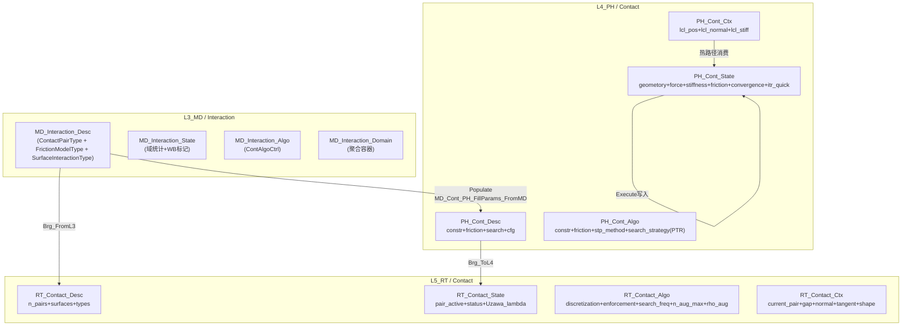

# 接触域：L3 / L4 / L5、四型、搜索–检测–力–刚度 — 合订（一体化设计）

**文档性质**：与 `**Material_L3L4L5_four_type_UMAT_discussion_synthesis.md`**（材料）、`**Element_L3L4L5_four_type_UEL_discussion_synthesis.md**`（单元/UEL）、`**Section_L3L4L5_four_type_synthesis.md**`（截面）并列的 **P3 接触域柱合订**；把 **接触（Contact/Interaction）** 作为 **贯通域柱**，写清 **L3 真源 → Populate → L4 消费 → L5 调度** 的分工、**四型** 裁剪与 **防双主源** 边界。
**代码真源**：`ufc_core/L3_MD/Interaction/`（**L3-only SSOT**，见 `**L3_MD/Interaction/CONTRACT.md` v3.1**）；`ufc_core/L4_PH/Contact/`（L4 物理计算，见 `**L4_PH/Contact/CONTRACT.md` v3.1**）；`ufc_core/L5_RT/Contact/`（L5 运行调度，见 `**L5_RT/Contact/CONTRACT.md` v3.0**）。
**报告 ID**：`REP-CONT-PILLAR`；**命名与五场景（S0–S4）**：`REPORTS/REPORT_Naming_Quad_OnePager_FiveScenes.md` §1、§3。

**与跨域模板关系**：`**Pillar_L3L4L5_CrossLayer_Design_Template.md` §4.1** Contact 行；**一页填槽** `**OnePager_FourKind_MasterAux_Nesting.md` §3.2**；**本文件 §3.5** 四型主/辅架构图解（6辅State+3辅Desc+3辅Algo+3辅Ctx+Procedure-as-Parameter+ABI镜像+mermaid）。
**一体化联动审查**：与 **材料合订本 §14.2**（UEL 路径含截面注册表→`mat_desc`）；**单元合订本 §4**（接触力→全局 K/F）；**截面合订本 §8**（`celent`/厚度与接触域联合键）— **同议题同批次**改。  
**外部手册锚点（只读核对）**：`**REPORTS/REPORT_Naming_Quad_OnePager_FiveScenes.md` §6**；优先 `**D:\TEST7\Manual\ANALYSIS_5.pdf`**（*Vol.V — Prescribed conditions, constraints & interactions*，书签 **Part VII** 起）、`**KEYWORD.pdf*`*（`*CONTACT*`、`*SURFACE`、`*SURFACE INTERACTION*` 等）、`**USER.pdf**`（接触相关用户子程序，版本 **6.14** 与 2016 Analysis 卷可能不一致）；`**ANALYSIS_2.pdf`**（*Vol.II* 步/过程）用于与 **步序、输出节拍** 对齐时查阅。

---

## 功能模块完整性公式

**完整功能模块 = 数据结构（四型TYPE：Desc/State/Algo/Ctx + Args）+ 过程算法（空间维度 + 时间维度 + 动作维度）**

- **数据结构侧**：`PH_Cont_Desc/State/Algo/Ctx` + 6辅State（Geometry/Force/Stiffness/Friction/Convergence/Itr_Quick）+ 3辅Desc（Constr/Friction/Search）+ 3辅Algo（Constr/Friction/Stp_Method）+ 3辅Ctx（Lcl_Pos/Lcl_Normal/Lcl_Stiff） + `search_strategy` 过程指针 + `MD_Int_ContactArgs` / `PH_Cont_Detect_Arg` / `PH_Cont_Enforce_Arg`（层间结构化IO）
- **过程算法侧**：Uzawa Loop（Search → Detect → Force → Stiffness → AugLag）为**动作维度**；`PH_Cont_Algo` / `RT_Contact_Algo`（时间维度 Uzawa 外迭代管理 n_aug_max/rho_aug/search_frequency）+ `PH_Cont_Search_Desc_Algo`（空间维度 BVH/Hash/CCD 搜索策略）驱动全管道
- **两则关系**：`PH_Cont_Algo` 同时是四型并列第四槽（数据结构侧）和 Uzawa Loop 的策略容器（过程算法侧，R-12）；Procedure-as-Parameter（`search_strategy` PTR）是动作维度可替换性的核心机制
- **完整域柱定义**：`MD_Int_Def`(L3 SSOT) + `PH_Cont_Domain`(L4 物理核) + `RT_Cont_Solv`(L5 调度) = 三层完备的全贯通支柱（P3）
- **本节与 `Contact_Procedure_Algorithm.md*`* 互补对照：后者展开 3辅Algo 字段细节、`search_strategy` PTR 抽象接口和 Uzawa Loop 的步骤级时序

---

## 0. 文档目的与范围


| 涵盖                                         | 不涵盖                          |
| ------------------------------------------ | ---------------------------- |
| 接触域在 **P3 贯通柱** 中的职责；L3/L4/L5 分工           | 具体 **BVH/NR投影** 完整推导         |
| **L3** `MD_Int_*` / `MD_Cont_*` 四型与模块清单    | 全仓库每一种 **摩擦模型** 的本构公式        |
| **Populate** 金线、**搜索→检测→力→刚度** 热路径         | **UEL** 全刚度组装（见 Element 合订本） |
| **L4/L5 目标态** 与 **防双四型主源**（类比材料 **§8.1c**） | 替代各层 `**CONTRACT.md`** 字段级真源 |


---

## 1. 术语：贯通域柱、半域柱、接触正交维


| 术语                  | 含义                               | 接触域在本文件中的定位                               |
| ------------------- | -------------------------------- | ----------------------------------------- |
| **贯通域柱（P3）**        | Contact：**L3+L4+L5** 均有可指认域目录与金线 | 接触为 **全贯通柱**；三层各有独立域目录                    |
| **双名域缩**            | `Cont`（短）/ `Contact`（长）等价并用      | 新代码优先 `PH_Cont_*`；`PH_Contact_*` 不强制改名    |
| **L3 偏重：Desc SSOT** | L3 持有接触对/摩擦/表面定义的唯一真源            | L3 `MD_Int_Def`/`MD_Cont_Mgr` 为 Desc SSOT |


---

## 2. 三层职责总览（接触相关）

### 2.1 一句话

- **L3_MD / Interaction**：**接触定义 SSOT** —— 接触对、表面、摩擦参数、连接器、Legacy 同步；**不做** 搜索与力计算。
- **L4_PH / Contact**：**接触物理计算引擎** —— 间隙/穿透检测、法向力/摩擦力计算、接触刚度组装、搜索算法（BVH/Hash/CCD）、显式接触、热-力耦合、磨损；**不持** Desc 真源、**不编排** 迭代循环。
- **L5_RT / Contact**：**运行时调度与编排** —— 搜索调度、力计算调度、全局装配协调、增广 Lagrange (Uzawa) 外迭代管理、接触状态更新、诊断回写；**不计算** 穿透/法向力/摩擦力（L4 负责）。

### 2.2 对照表


| 层         | 主要职责                       | 典型产物或类型（接触相关）                                                                                                                                            |
| --------- | -------------------------- | -------------------------------------------------------------------------------------------------------------------------------------------------------- |
| **L3_MD** | 接触 Desc 真源、注册、查询、Legacy 同步 | `**MD_Interaction_Desc`**、`**ContactPairType**`、`**SurfaceInteractionType**`、`**FrictionModelType**`、`**MD_ContactPairDef**`、`**MD_Interaction_Domain**` |
| **L4_PH** | 搜索/检测/力/刚度计算、摩擦模型库         | `**PH_Cont_Desc/State/Algo/Ctx`**、`**PH_Contact_InterfaceCtx**`、`**PH_Cont_Friction_Model**`、`**PH_Thermal_Cont_***`                                         |
| **L5_RT** | 迭代编排、装配协调、Uzawa 外迭代        | `**RT_Contact_Desc/State/Algo/Ctx`**、`**RT_Cont_Solv**`（金线）、`**RT_Cont_AugLagSolv**`                                                                     |


---

## 3. 三层数据流：Populate → 热路径 → 回写

### 3.1 Populate 金线（冷路径）

```text
INP (*CONTACT PAIR / *SURFACE INTERACTION / *FRICTION)
  → L6_AP / KeyWord 映射
  → MD_Interaction_Domain::Add (L3 冷存储)
  → MD_Cont_PH_FillParams_FromMD (L3→L4 Bridge)
  → PH_Cont_Desc / PH_Cont_Friction_Model / PH_Cont_Algo
  → RT_Contact_Brg_FromL3 (L3→L5 Populate)
  → RT_Contact_Desc (n_pairs, surfaces, 算法参数)
```

### 3.2 热路径（每增量步/迭代）

```text
StepDriver → RT_Cont_Search → L4 PH_ContSearch (搜索调度)
         ↓
RT_Cont_ComputeForce → L4 PH_Cont_* (穿透→力计算)
         ↓
RT_Cont_Assemble → RT_Asm_ApplyContact (接触贡献→全局 K/F)
         ↓
收敛检查 → (若 AugLagrange) Uzawa 外迭代循环
```

### 3.3 回写（步末/检查点）

```text
RT_Contact_Brg_WriteBack → 接触诊断
  → MD_WB_Interaction (L3 状态更新)
```

---

## 3.5 四型主/辅架构图解（L3 / L4 / L5 全景）

> 下列与 `**PH_Cont_Def.f90**`（AUTHORITY）、`**RT_Cont_Def.f90**`、`**MD_Int_Def.f90**` 对齐；字段变更以 .f90 为准。

### 3.5.1 L4 四型主 TYPE 与辅 TYPE 嵌套（`PH_Cont_Def.f90` AUTHORITY）

```text
PH_Cont_Desc (主·Desc)                    ← 冷 / Populate 后只读
├── constr : PH_Cont_Constr_Desc           ← 约束描述
│   ├── config : PH_Cont_Constr_Desc_Config (method, adaptive_penalty)
│   └── penalty: PH_Cont_Constr_Desc_Penalty(penalty_parameter, growth/reduction_factor)
├── friction: PH_Cont_Friction_Desc        ← 摩擦描述
│   ├── model  : PH_Fric_Cfg_Model         (model_type, stick_slip_transition)
│   ├── coeff  : PH_Fric_Cfg_Coeff         (mu_static, mu_dynamic)
│   └── phys   : PH_Fric_Cfg_Physical      (friction_stiffness, critical_slip_vel, regularization)
├── search  : PH_Cont_Search_Desc          ← 搜索描述
│   ├── algo   : PH_Cont_Search_Desc_Algo   (search_algorithm)
│   └── params : PH_Cont_Search_Desc_Params(search_radius, tolerance, adaptive_search)
├── cfg_penalty: PH_Cont_Cfg_Penalty_Desc  (penalty_normal, penalty_tangent)
├── cfg_tol   : PH_Cont_Cfg_Tol_Desc       (gap_tolerance, mu_friction)
├── contact_pair_id : INTEGER(i4)
├── slave_surface_id: INTEGER(i4)
└── master_surface_id: INTEGER(i4)

PH_Cont_State (主·State)                  ← 温 / INOUT
├── contact_state : INTEGER(i4)           ← 0=separate, 1=contact, 2=sticking, 3=sliding
├── geometry : PH_Cont_Geometry_State     ← 几何辅 State
│   ├── gap, penetration, previous_gap : REAL(wp)
│   ├── normal_vector(:) : REAL(wp), ALLOCATABLE
│   └── tangent_vector1/2(:) : REAL(wp), ALLOCATABLE
├── force : PH_Cont_Force_State           ← 力辅 State
│   ├── normal_force(:), friction_force(:) : ALLOCATABLE
│   ├── normal/friction_force_magnitude : REAL(wp)
│   ├── contact_traction(:) : ALLOCATABLE
│   └── contact_pressure, shear_traction : REAL(wp)
├── stiffness : PH_Cont_Stiffness_State   ← 刚度辅 State
│   ├── matrix : PH_Cont_Stiffness_State_Matrix(K_contact, C_contact)
│   └── scalar : PH_Cont_Stiffness_State_Scalar(normal_stiffness, tangential_stiffness)
├── friction : PH_Cont_Friction_State     ← 摩擦辅 State
│   ├── slip : PH_Cont_Friction_State_Slip(slip_velocity, slip_magnitude, accumulated_slip, slip_rate)
│   └── friction_state : INTEGER(i4)
├── convergence : PH_Cont_Convergence_State ← 收敛辅 State
│   ├── residual_norm, residual_norm_previous, convergence_rate : REAL(wp)
│   ├── iteration_count : INTEGER(i4)
│   └── force/displacement/gap/friction_converged : LOGICAL
└── itr_quick : PH_Cont_Itr_Quick_State   ← 快查辅 State
    ├── contact_status : INTEGER(i4)
    ├── force : PH_Cont_Itr_Quick_State_Force(f_normal, f_friction)
    └── geom  : PH_Cont_Itr_Quick_State_Geom(gap, slip)

PH_Cont_Algo (主·Algo)                    ← 冷/步级 / IN
├── constr : PH_Cont_Constr_Algo           ← 约束辅 Algo
│   ├── iter  : PH_Cont_Constr_Algo_Iter (max_iterations)
│   ├── tol   : PH_Cont_Constr_Algo_Tol  (tolerance, relative_tolerance)
│   └── solver: PH_Cont_Constr_Algo_Solver(optimization_strategy, convergence_acceleration)
├── friction: PH_Cont_Friction_Algo        ← 摩擦辅 Algo
│   ├── rate  : PH_Cont_Friction_Algo_Rate(decay_rate, pressure_exponent, transition_velocity)
│   └── config: PH_Cont_Friction_Algo_Config(rate_dependency)
├── stp_method: PH_Cont_Stp_Method_Algo   (method, scale_factor)
└── search_strategy : PROCEDURE(ContactSearchStrategy_Ifc), POINTER ← Procedure-as-Parameter

PH_Cont_Ctx (主·Ctx)                      ← 热 / INOUT
├── lcl_pos   : PH_Cont_Lcl_Pos_Ctx       (x_slave(3), x_master(3))
├── lcl_normal: PH_Cont_Lcl_Normal_Ctx    (normal(3))
└── lcl_stiff : PH_Cont_Lcl_Stiff_Ctx     (K_contact(24,24))
```

### 3.5.2 L5 四型主 TYPE（`RT_Cont_Def.f90` AUTHORITY）

```text
RT_Contact_Desc (主·Desc)                 ← DELEGATED → L3 索引
├── n_contact_pairs : INTEGER(i4)
├── contact_name    : CHARACTER(*)
├── master/slave_surf_ids : ALLOCATABLE
├── contact_types   : ALLOCATABLE
├── friction_models : ALLOCATABLE
└── penalty_stiffness: ALLOCATABLE

RT_Contact_State (主·State)               ← 调度态 / 对级状态
├── pair_active(:), pair_status(:) : ALLOCATABLE
├── n_active, n_open, n_closed    : INTEGER(i4)
├── f_contact(:), penetration(:)  : ALLOCATABLE
└── lambda_n/trial                 : ALLOCATABLE (Uzawa 乘子)

RT_Contact_Algo (主·Algo)                 ← 调度算法参数
├── discretization_method, enforcement_method : INTEGER(i4)
├── penalty_scale   : REAL(wp)
├── search_frequency: INTEGER(i4)
├── n_aug_max       : INTEGER(i4)     ← Uzawa 外迭代上限
└── rho_aug         : REAL(wp)        ← Uzawa 增益因子

RT_Contact_Ctx (主·Ctx)                   ← 栈标量热路径上下文
├── current_pair_idx: INTEGER(i4)
├── gap_distance    : REAL(wp)
├── normal_vector(3), tangent_vector(3,2) : REAL(wp)
└── shape_master/slave(4) : REAL(wp)
```

### 3.5.3 L3 四型主 TYPE（`MD_Int_Def.f90` AUTHORITY）

```text
MD_Interaction_Desc (主·Desc)             ← SSOT / 冷真源
├── ContactPairType   ← 接触对定义 (slave/master/ref/adjust...)
├── SurfaceInteractionType ← 表面交互参数
├── FrictionModelType     ← 摩擦模型枚举
├── MD_ContactPairDef     ← 接触对详细规格
├── MD_ContactProperty    ← 接触属性
├── ContPairDef           ← 简化对定义
└── ContAlgoDesc          ← 算法描述

MD_Interaction_State (主·State)           ← 域级统计 + WriteBack 标记
MD_Interaction_Algo  (主·Algo)            ← 接触算法参数（可调）
MD_Int_Ctx / MD_Interaction_Domain (主·Ctx) ← 域容器与问题上下文
```

### 3.5.4 辅 TYPE 命名规范速查


| 层      | 主 TYPE                   | 辅 TYPE 命名模式                                  | 示例                                                                       |
| ------ | ------------------------ | -------------------------------------------- | ------------------------------------------------------------------------ |
| **L4** | `PH_Cont_Desc`           | `PH_Cont_<Sub>_<Kind>` 或 `PH_Fric_Cfg_<Sub>` | `PH_Cont_Constr_Desc_Config`、`PH_Fric_Cfg_Model`、`PH_Cont_Lcl_Pos_Ctx`   |
| **L4** | `PH_Cont_State`          | `PH_Cont_<Sub>_State`                        | `PH_Cont_Geometry_State`、`PH_Cont_Force_State`、`PH_Cont_Itr_Quick_State` |
| **L4** | `PH_Cont_Algo`           | `PH_Cont_<Sub>_Algo_<Sub>`                   | `PH_Cont_Constr_Algo_Iter`、`PH_Cont_Friction_Algo_Rate`                  |
| **L4** | `PH_Cont_Ctx`            | `PH_Cont_Lcl_<Sub>_Ctx`                      | `PH_Cont_Lcl_Pos_Ctx`、`PH_Cont_Lcl_Normal_Ctx`、`PH_Cont_Lcl_Stiff_Ctx`   |
| **L5** | `RT_Contact_`*           | 扁平字段为主（调度语义简单）                               | —                                                                        |
| **L3** | `MD_Int_`* / `MD_Cont_*` | 域容器聚合                                        | `MD_Interaction_Domain`                                                  |


### 3.5.5 扩展四型（用户接触子程序 ABI 镜像）

```text
PH_Contact_InterfaceCtx  ← ABAQUS UINTER/VUINTER 通用输入 (gap, slip1/2, pressure, temp, coords, tang1/2)
PH_Contact_InterfaceState ← ABAQUS UINTER/VUINTER 通用输出 (traction_n/t1/t2, dtn_dgap, svars, converged)
PH_Contact_VUINTER_Ctx  ← 显式向量化块 (nblock, gap_blk, pres_blk, svars_blk...)
PH_Contact_UINTER_Ctx   ← 隐式标量 (coords, cdisp, cdispdot, temp, dtemp, time, dtime...)
PH_Contact_GAPCON_Ctx   ← 间隙导热 (gap, pressure, temp1/2, cond, dcond_dgap/dpres)
PH_Contact_GAPUNIT_Ctx  ← 辐射/电导 (geom.gap/pressure/coords + thermal.temp1/temp2)
```

> **文档惯例**：与材料 `PH_UMAT_Context`（ABI_Flat）对偶，接触 ABI 镜像 TYPE 命名以 `**PH_Contact_<SubProgram>_Ctx/State/Algo`** 为模式，**≠** 四型主 `PH_Cont_Ctx`（热路径工作区）。

#### 3.5.5a Standard 接口原型与参数映射

**FRIC（自定义摩擦行为）**：

```fortran
      SUBROUTINE FRIC(LM, TAU, DDTDDG, DDTDDP, DSLIP, SED, SFD,
     1                 DDTDDT, PNEWDT, STATEV, DG, DP, DT, PREDEF,
     2                 LFLAGS, MLFLAGS, NOEL, NPT, LAYER, KSPT,
     3                 KSTEP, KINC)
```


| FRIC 参数       | UFC 四型归属                                       | 说明                |
| ------------- | ---------------------------------------------- | ----------------- |
| `LM(2)`       | `PH_Cont_State%contact_state`                  | 法向/切向状态（闭合/滑移/粘着） |
| `TAU(2)`      | `PH_Cont_State%force%friction_force`           | 切向摩擦应力            |
| `DDTDDG(2,2)` | `PH_Cont_State%stiffness%matrix`               | 切向应力对滑移雅可比        |
| `DDTDDP(2)`   | `PH_Cont_State%stiffness%matrix`               | 切向应力对法向压力导数       |
| `DG(2)`       | `PH_Cont_Ctx%lcl_pos`                          | 当前滑移增量            |
| `DP`          | `PH_Cont_State%force%normal_force_magnitude`   | 法向接触压力            |
| `STATEV(*)`   | `PH_Cont_State%friction%slip%accumulated_slip` | 摩擦状态变量（累积滑移/磨损）   |


**FRIC_COEF（自定义摩擦系数）**：

```fortran
      SUBROUTINE FRIC_COEF(MU, P, SLIPRATE, TEMP, PREDEF, LFLAGS,
     1                      NOEL, NPT, LAYER, KSPT, KSTEP, KINC)
```


| FRIC_COEF 参数 | UFC 四型归属                                     | 说明     |
| ------------ | -------------------------------------------- | ------ |
| `MU`         | `PH_Cont_Desc%friction%coeff%mu_dynamic`     | 摩擦系数输出 |
| `P`          | `PH_Cont_State%force%normal_force_magnitude` | 法向压力   |
| `SLIPRATE`   | `PH_Cont_State%friction%slip%slip_rate`      | 滑移速率   |
| `TEMP`       | `PH_Cont_Ctx%lcl_pos`                        | 温度     |


**UINTER（自定义接触界面本构）**：

```fortran
      SUBROUTINE UINTER(RS, STRS, STRN, TIME, DTIME, TEMP, DTEMP,
     1                   PREDEF, STATEV, NUMSTV, NUMFIELD, NUMPRO,
     2                   LAYER, KSPT, KELEM, NODE, NOEL)
```


| UINTER 参数    | UFC 四型归属                               | 说明                 |
| ------------ | -------------------------------------- | ------------------ |
| `RS(2)`      | `PH_Cont_State%force`                  | 接触反力（法向/切向）        |
| `STRS(2)`    | `PH_Cont_State%force%contact_traction` | 接触应力               |
| `STRN(2)`    | `PH_Cont_Ctx%lcl_pos`                  | 接触相对变形/滑移          |
| `STATEV(*)`  | `PH_Cont_State%friction`               | 界面状态变量（损伤/塑性滑移/脱粘） |
| `TIME/DTIME` | `RT_Contact_Ctx`                       | 时间/时间步长            |


**GAPCON（间隙导热）**：

```fortran
      SUBROUTINE GAPCON(GAP, PRESS, TEMP1, TEMP2, COND, DCONDDG, DCONDDP)
```


| GAPCON 参数    | UFC 四型归属                                 | 说明           |
| ------------ | ---------------------------------------- | ------------ |
| `GAP`        | `PH_Cont_State%geometry%gap`             | 间隙距离         |
| `PRESS`      | `PH_Cont_State%force%contact_pressure`   | 接触压力         |
| `TEMP1/2`    | `PH_Contact_GAPCON_Ctx%temp1/temp2`      | 两侧温度         |
| `COND`       | `PH_Contact_GAPCON_Ctx%cond`             | 间隙热传导系数      |
| `DCONDDG/DP` | `PH_Contact_GAPCON_Ctx%dcond_dgap/dpres` | 传导系数对间隙/压力导数 |


#### 3.5.5b Explicit 接口原型与参数映射

**VUINTER（显式接触对自定义）**：

```fortran
      SUBROUTINE VUINTER(CWRITEONLY, CREADONLY)
```


| VUINTER 参数   | UFC 四型归属                                           | 说明                |
| ------------ | -------------------------------------------------- | ----------------- |
| `CWRITEONLY` | `PH_Contact_InterfaceState` + `PH_Contact_VUINTER_Ctx` | 输出：切向力/热流/状态更新    |
| `CREADONLY`  | `PH_Contact_InterfaceCtx` + `PH_Contact_VUINTER_Ctx`   | 输入：滑移/压力/温度/间隙/坐标 |


**VFRIC（显式自定义摩擦）**：

```fortran
      SUBROUTINE VFRIC(FTANG, STATEV, KSTEP, KINC, NCONTACT,
     1                  NFACNOD, NSECNOD, NMAINNOD, NFRICDIR,
     2                  NSTATEVAR, NPROPS, NTEMP, NPRED, NUMDEFTFV,
     3                  TIMESTEP, TIMGLB, DTIMCUR, SURFINT,
     4                  DSLIPFRIC, PRESS, TEMP, PREDEF, PROPS)
```


| VFRIC 参数    | UFC 四型归属                                     | 说明      |
| ----------- | -------------------------------------------- | ------- |
| `FTANG`     | `PH_Cont_State%force%friction_force`         | 切向摩擦力输出 |
| `DSLIPFRIC` | `PH_Cont_State%friction%slip%slip_velocity`  | 滑移速率输入  |
| `PRESS`     | `PH_Cont_State%force%normal_force_magnitude` | 法向压力输入  |
| `STATEV`    | `PH_Cont_State%friction`                     | 摩擦状态变量  |


#### 3.5.5c 接口选型速览


| 需求                | Standard             | Explicit                                |
| ----------------- | -------------------- | --------------------------------------- |
| 仅摩擦（库仑/速率相关）      | **FRIC**             | **VFRIC**                               |
| 摩擦系数复杂依赖          | **FRIC_COEF**        | 用VFRIC                                  |
| 法向+切向全接触本构（粘附/损伤） | **UINTER**           | **VUINTER**（接触对）/ **VUINTERACTION**（通用） |
| 接触热/电耦合           | **GAPCON/GAPELECTR** | VUINTER（含热流）                            |
| 磨损/材料去除           | **UMESHMOTION**      | **UMESHMOTION**                         |


#### 3.5.5d 收敛与稳定性要点

1. **摩擦收敛**：用正则化库仑模型（避免硬切换），FRIC/UINTER中加粘弹性正则化。
2. **接触振荡**：法向罚函数+阻尼（UINTER中 `DAMPING×滑移速率`），切向SUPG类稳定化。
3. **状态变量更新**：`STATEV`存储累积滑移/接触压力历史/损伤变量，避免迭代漂移。

**防双写约束**：

- **禁止**：FRIC/UINTER 与内置接触模型同时作用于同一接触对（须合同指定优先序）。
- **禁止**：用户接触子程序直接写全局 `K/F`（须经 L4 `PH_Cont_Ctx%lcl_stiff` → L5 组装）。

### 3.5.6 三层四型嵌套深度对照（mermaid）




---

## 4. L3 现状：四型与模块（真源表）

> 下列与 `**L3_MD/Interaction/CONTRACT.md` §2–§4** 对齐；实现变更以合同为准。

### 4.1 四型裁剪（L3 域内）


| Kind      | L3 TYPE / 说明                                                                                                                                                                               | 备注                       |
| --------- | ------------------------------------------------------------------------------------------------------------------------------------------------------------------------------------------ | ------------------------ |
| **Desc**  | `**MD_Interaction_Desc`**、`**ContactPairType**`、`**SurfaceInteractionType**`、`**FrictionModelType**`、`**MD_ContactPairDef**`、`**MD_ContactProperty**`、`**ContPairDef**`、`**ContAlgoDesc**` | **SSOT**；含表面引用、摩擦参数、接触类型 |
| **State** | `**MD_Interaction_State`**、`**MD_ContactPairState**`、`**ContNode**`、`**ContForceRes**`                                                                                                     | 域级统计 + WriteBack 白名单标记   |
| **Algo**  | `**MD_Interaction_Algo`**、`**ContAlgoCtrl**`、`**ContAlgo**`                                                                                                                                | 接触算法参数（可调）               |
| **Ctx**   | `**MD_Int_Ctx`**、`**MD_Interaction_Domain**`（聚合容器）、`**UF_ContProblem**`                                                                                                                    | 域容器与问题上下文                |


### 4.2 模块清单（摘要）


| 文件                     | `MODULE`           | 角色                                   |
| ---------------------- | ------------------ | ------------------------------------ |
| `MD_Int_Def.f90`       | `MD_Int_Def`       | **AUTHORITY**：核心四型 + 接触对 + 表面交互 + 摩擦 |
| `MD_Int_Types.f90`     | `MD_Int_Types`     | 低层级数值算法用类型                           |
| `MD_Cont_Mgr.f90`      | `MD_Cont_Mgr`      | `MD_Interaction_Domain` 域容器 + CRUD   |
| `MD_Int_Core.f90`      | `MD_Int_Core`      | 核心 CRUD + 校验                         |
| `MD_Int_Friction.f90`  | `MD_Int_Friction`  | 摩擦参数管理                               |
| `MD_Int_Detect.f90`    | `MD_Int_Detect`    | 穿透检测框架                               |
| `MD_Int_Stiffness.f90` | `MD_Int_Stiffness` | 刚度相关                                 |
| `MD_Int_Connector.f90` | `MD_Int_Connector` | 连接器（Spring/Joint/Dashpot/Bushing）    |
| `MD_Int_Mapper.f90`    | `MD_Int_Mapper`    | 表面映射                                 |
| `MD_Int_Legacy.f90`    | `MD_Int_Legacy`    | Legacy ↔ Domain 同步                   |


---

## 5. L4 现状：四型与算法矩阵

### 5.1 AUTHORITY 四型 (`PH_Cont_Def.f90`)


| 四型        | TYPE 名称               | 核心字段                                                                                                                                  | 温度/INTENT |
| --------- | --------------------- | ------------------------------------------------------------------------------------------------------------------------------------- | --------- |
| **Desc**  | `PH_Cont_Desc`        | contact_pair_id, slave_surface_id, method, penalty_parameter, mu_static, mu_dynamic, search_algorithm                                 | 冷/IN      |
| **State** | `PH_Cont_State`       | contact_state, gap, penetration, normal_force(:), friction_force(:), K_contact(:,:), slip_velocity(:), residual_norm, iteration_count | 温/INOUT   |
| **Algo**  | `PH_Cont_Algo`        | max_iterations, tolerance, optimization_strategy, decay_rate, rate_dependency, ai_enabled                                             | 冷/IN      |
| **Ctx**   | `PH_Contact_InterfaceCtx` | slave_node_coords(:,:), master_node_coords(:,:), normal_vector(:), tangent_vector(:), contactPressure, gap_function                   | 热/INOUT   |


### 5.2 LEGACY 四型（简化型，新代码禁用）


| TYPE               | 说明                                                            |
| ------------------ | ------------------------------------------------------------- |
| `PH_Contact_Desc`  | 简化 Desc (penalty_normal/tangent, gap_tolerance, mu_friction)  |
| `PH_Contact_State` | 简化 State (gap, f_normal, f_friction, contact_status, slip)    |
| `PH_Contact_Algo`  | 简化 Algo (method, scale_factor)                                |
| `PH_Contact_Ctx`   | 简化 Ctx (x_slave(3), x_master(3), normal(3), K_contact(24,24)) |


> **新代码应 USE `PH_Cont_Def`**；LEGACY 仅为兼容。

### 5.3 扩展四型


| TYPE                                  | 用途         |
| ------------------------------------- | ---------- |
| `PH_Cont_Friction_Model`              | 摩擦模型配置     |
| `PH_Cont_Thermal_Properties`          | 热接触属性      |
| `PH_Cont_Dynamic_Properties`          | 动力学接触属性    |
| `PH_Contact_VUINTER_Ctx`              | 用户接触子程序上下文 |
| `PH_Contact_GAPCON_Ctx`               | 间隙导热上下文    |
| `PH_Thermal_Cont_Desc/State/Algo/Ctx` | 热接触完整四型    |


### 5.4 算法完整度


| 算法模块       | 完整度        | 缺失关键项                 |
| ---------- | ---------- | --------------------- |
| NTS 搜索     | **55%**    | NTS 投影核心(NR迭代+自然坐标求解) |
| 罚函数        | **20%**    | 面级力向量/完整刚度矩阵          |
| Coulomb 摩擦 | **15%**    | 增量返回映射、粘滑分支一致切线       |
| BVH 搜索     | **70–80%** | SAH 排序/精确距离           |


---

## 6. L5 现状：四型与调度

### 6.1 四型 (`RT_Cont_Def.f90`)


| 四型        | TYPE 名称            | 核心字段                                                                                                       |
| --------- | ------------------ | ---------------------------------------------------------------------------------------------------------- |
| **Desc**  | `RT_Contact_Desc`  | n_contact_pairs, contact_name, master/slave_surf_ids, contact_types, friction_models, penalty_stiffness    |
| **State** | `RT_Contact_State` | pair_active(:), pair_status(:), n_active/open/closed, f_contact(:), penetration(:), lambda_n/trial (Uzawa) |
| **Algo**  | `RT_Contact_Algo`  | discretization_method, enforcement_method, penalty_scale, search_frequency, n_aug_max, rho_aug             |
| **Ctx**   | `RT_Contact_Ctx`   | current_pair_idx, gap_distance, normal_vector(3), tangent_vector(3,2), shape_master/slave(4)               |


### 6.2 金线模块


| 文件                       | MODULE               | 角色                           |
| ------------------------ | -------------------- | ---------------------------- |
| `RT_Cont_Solv.f90`       | `RT_Cont_Solv`       | **GOLDEN-LINE**：搜索/力/装配/统计门面 |
| `RT_Cont_AugLagSolv.f90` | `RT_Cont_AugLagSolv` | Uzawa 外迭代管理                  |
| `RT_Cont_Brg.f90`        | `RT_Cont_Brg`        | FromL3/ToL4/WriteBack 桥接     |


---

## 7. 四型跨层裁剪表（目标态 + 当前态）


| Kind      | L3（当前）                              | L4（目标 / 当前）                                            | L5（目标 / 当前）                                    |
| --------- | ----------------------------------- | ------------------------------------------------------ | ---------------------------------------------- |
| **Desc**  | **RETAINED** `MD_Int_*`/`MD_Cont_*` | **DELEGATED→L3**（Populate 灌入 `PH_Cont_Desc`）           | **DELEGATED**（仅索引/配置参数 `RT_Contact_Desc`）      |
| **State** | **RETAINED**（域统计 + WriteBack 标记）    | **RETAINED**（`PH_Cont_State`：gap/force/stiffness/slip） | **RETAINED**（`RT_Contact_State`：对级状态/Uzawa 乘子） |
| **Algo**  | **RETAINED**（默认算法参数）                | **RETAINED**（`PH_Cont_Algo`：迭代/优化/AI开关）                | **RETAINED**（`RT_Contact_Algo`：离散化/施加/搜索频率）    |
| **Ctx**   | **RETAINED**（域容器/问题上下文）             | **RETAINED**（`PH_Contact_InterfaceCtx`：节点坐标/法向/间隙）         | **RETAINED**（`RT_Contact_Ctx`：栈标量热路径上下文）       |


**说明**：接触域四型在三层均 **RETAINED**，因为各层语义不同——L3 是定义、L4 是物理计算、L5 是调度编排，不存在"哪一层可以省略"的情况。与截面域（L4 可 DELEGATED）不同。

---

## 8. 与材料 / 单元 / 截面合订本的衔接点


| 主题                           | 材料合订本                                   | 单元合订本                                  | 本文（接触）                                                                                            |
| ---------------------------- | --------------------------------------- | -------------------------------------- | ------------------------------------------------------------------------------------------------- |
| **Populate**                 | `PH_L4_Populate_Material`               | `PH_L4_Populate_Element`               | `MD_Cont_PH_FillParams_FromMD`（L3→L4）；`RT_Contact_Brg_FromL3`（L3→L5）                              |
| **热路径**                      | `PH_Mat_Execute_Flow`                   | `PH_Element_Compute_Ke/Fe`             | `PH_Cont_AlgorithmFramework`（搜索→检测→力→刚度）                                                          |
| **刚度装配**                     | 材料切线→单元刚度                               | 单元贡献→全局 K/F                            | 接触贡献→`RT_Asm_ApplyContact`→全局 K/F                                                                 |
| **用户子程序**                    | `PH_UMAT_Context`（ABI_Flat）             | `PH_UEL_Context`（ABI_Flat）             | `PH_Contact_VUINTER_Ctx` / `PH_Contact_UINTER_Ctx` / `PH_Contact_GAPCON_Ctx`（用户接触子程序）             |
| **防双主源**                     | **§8.1c**                               | Element **§4**                         | **§9** 与本表                                                                                        |
| **截面轴**                      | ntens/应力态                               | celent/厚度                              | 接触域不直接消费截面；`celent` 在 UEL ABI_Flat 中与接触无关                                                         |
| **Procedure/Algorithm 专域合订** | `Material_Procedure_Algorithm.md` §2–§4 | `Element_Procedure_Algorithm.md` §2–§4 | `**Contact_Procedure_Algorithm.md`** §2(Algo TYPE)、§3(搜索指针+Uzawa Loop)、§4(Procedure-as-Parameter) |


---

## 9. 防双主源与命名一致性

### 9.1 防双四型主源

- **禁止**：L3 `**MD_Int_*`/`MD_Cont_*` 全四型** 与 L4 `**PH_Cont_*` 全四型** 再与 **L5 `RT_Contact_*` 全四型** 三者 **并列 Writable SSOT**。
- **允许**：L3 **唯一冷真源**（Desc 方向）+ L4 **物理计算主源**（State/Ctx/Algo）+ L5 **调度编排主源**（Desc/State/Algo/Ctx 为调度语义，非物理真源）。
- **关键约束**：L4 State 写 `PH_Cont_State`（gap/force/stiffness），L5 State 写 `RT_Contact_State`（pair_active/status/Uzawa 乘子）；两者 **语义不同**，不构成双写。

### 9.2 域缩双名

- `**PH_Cont_*`** — 短形式，新代码优先
- `**PH_Contact_***` — 长形式，用于核心实现和过程名
- 两者等价，不强制批量改名（与 `UFC_命名规范_v3.0 §10.1` 一致）

### 9.3 摩擦枚举双轨

- `PH_FRIC_*`（`PH_Cont_Domain`）：域级摩擦族分类
- `PH_FRICT_*`（`PH_Cont_Friction`）：算法级模型 ID

---

## 10. 分阶段落地（纳入一体化设计）


| 阶段                  | 交付物                                  | 验收                           |
| ------------------- | ------------------------------------ | ---------------------------- |
| **S0（本文 + 合同对齐）**   | 本合订本文 + 三层合同交叉引用闭合                   | 评审能通过「接触域出现在 Populate/热路径叙述」 |
| **S1（NTS 投影核心补全）**  | `PH_Cont_NTS_Eval`：NR 迭代 + 自然坐标求解    | Hertz 接触 PatchTest 收敛        |
| **S2（罚函数面级力）**      | 面级投影后间隙→等效节点力向量→完整刚度矩阵               | NTS 单对验证                     |
| **S3（摩擦返回映射）**      | 增量形式粘滑分支返回映射 + 一致切线                  | Coulomb 粘滑临界点精度              |
| **S4（L5 CMake 集成）** | 解除 `EXCLUDE REGEX`；RT_Cont_Solv 编译通过 | 全量编译零错误                      |


---

## 附录 A — 接触算法矩阵速查


| 算法                       | 枚举常量                   | 适用场景 | 完整度      |
| ------------------------ | ---------------------- | ---- | -------- |
| Node-to-Surface (NTS)    | `PH_CONT_NODE_TO_SURF` | 小滑移  | **55%**  |
| Surface-to-Surface (STS) | `PH_CONT_SURF_TO_SURF` | 大滑移  | **待补全**  |
| Mortar                   | `PH_CONT_MORTAR`       | 高精度  | **待补全**  |
| Self-Contact             | `PH_CONT_SELF_CONTACT` | 自身折叠 | **框架已有** |


## 附录 B — 搜索方法矩阵


| 搜索方法                | 复杂度        | 适用规模          |
| ------------------- | ---------- | ------------- |
| BVH (层次包围体)         | O(N log N) | 大规模 (>1000 对) |
| Spatial Hash (空间哈希) | O(N) 均摊    | 中等规模          |
| Bounding Box (包围盒)  | O(N²)      | 小规模 (<100 对)  |
| CCD (连续碰撞检测)        | O(N log N) | 高速冲击          |


## 附录 C — 维护与同步清单

- `**L3_MD/Interaction/CONTRACT.md`**：任意 **四型 / 模块** 变更 → 同步本文 **§4、§7**。
- `**L4_PH/Contact/CONTRACT.md`**：算法矩阵 / 摩擦模型变更 → 同步本文 **§5、附录 A**。
- `**L5_RT/Contact/CONTRACT.md`**：Uzawa 参数 / 搜索频率变更 → 同步本文 **§6**。
- **材料 / 单元合订本**：凡 **Populate、用户子程序、全局 K/F** 变更涉及接触 → 同步本文 **§8**。

---

*冷归档全文：`UFC/REPORTS/archive/Contact_L3L4L5_four_type_synthesis.md`。入口 stub：`UFC/REPORTS/Contact_L3L4L5_four_type_synthesis.md`。一体化设计并列（根 stub）：`Material_L3L4L5_four_type_UMAT_discussion_synthesis.md`、`Element_L3L4L5_four_type_UEL_discussion_synthesis.md`、`Section_L3L4L5_four_type_synthesis.md`、`Pillar_L3L4L5_CrossLayer_Design_Template.md`。*