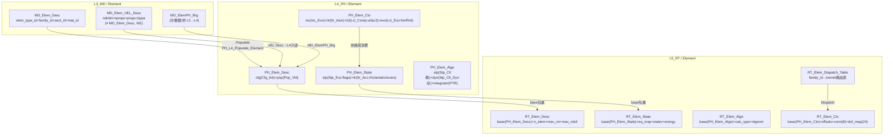

# 单元域：L3 / L4 / L5、四型、UEL — 讨论沉淀（合订草稿）

**文档性质**：与材料域 `**Material_L3L4L5_four_type_UMAT_discussion_synthesis.md`** 对偶，聚焦 **Abaqus UEL（User Element）** 与 UFC **单元域柱**（`MD_Elem_*` / `PH_Elem_*` / `RT_Elem_*`）的分层、四型映射与实现锚点。  
**代码真源**：`ufc_core/L3_MD/Element/Elem/`（含 **`MD_Elem_UEL_Def.f90`**）、`ufc_core/L4_PH/Element/`、`ufc_core/L5_RT/Element/`（含 `**RT_Elem_UEL.f90`**）。  
**报告 ID**：`REP-ELEM-UEL`；**命名与五场景（S0–S4）**：`REPORTS/REPORT_Naming_Quad_OnePager_FiveScenes.md` §1、§3。

**与材料合订本关系**：材料侧 **§14**（UEL 与单元域柱、`**RT_Elem_UEL` 薄适配现状**）为本文件 **索引入口**；本文件展开 **UEL 形参 ↔ 四型/Args** 与 **目标架构**（不含完整 NS/SUPG 推导）。

**与跨域模板关系**：`**Pillar_L3L4L5_CrossLayer_Design_Template.md` §4.1**「Element」行预填模块名；Populate/热路径以 `**CONTRACT.md`** 与实装为准。  
**与截面正交维**：`**Section_L3L4L5_four_type_synthesis.md`**（`**sect_id`、厚度/取向、M-S-E 校验** 与 `**PH_Elem_MaterialRoute`**）。  
**一体化三文档**：本文件 ↔ **材料合订本**（**§8.1c、§14**）↔ **截面合订本**（**§3 金线、§8、§9**）↔ `**Pillar_…` §0 / §4.1**；变更 **Populate、`PH_UEL_*`、`RT_Elem_UEL`、截面注册表** 时 **四角同步审查**。  
**一页填槽（主/辅 · 总分 · ABI_Flat）**：`**OnePager_FourKind_MasterAux_Nesting.md` §3.1**（与 `**Pillar` §4.1** 域行联用）；**本文件 §3.5** 四型主/辅架构图解（L3/L4/L5 全景+mermaid）。

---

## 功能模块完整性公式

**完整功能模块 = 数据结构（四型TYPE：Desc/State/Algo/Ctx + Args）+ 过程算法（空间维度 + 时间维度 + 动作维度）**

- **数据结构侧**：`PH_Elem_Desc/State/Algo/Ctx` + 辅TYPE（`Cfg_Init_Desc`, `Lcl_Comp_Ctx`, `Stp_Ctl_Algo`, `Stp_Ctl_Dyn_Algo`） + `PH_Elem_<Verb>_Arg`（层间结构化IO）；L3 侧 `MD_Elem_UEL_Desc` 为 UEL 专用 SSOT
- **过程算法侧**：`integrator` 过程指针 + `RT_Elem_Dispatcher` 路由 + `PH_Elem_*_Core`(Ke/Re) 为**动作维度**；`Stp_Ctl_Algo`/`Stp_Ctl_Dyn_Algo`（时间维度 Step/Inc/Itr 积分策略）+ 族级形状函数（空间维度 Gauss 积分/拓扑）共同驱动
- **两则关系**：`PH_Elem_Algo` 同时是四型并列中的第四槽（数据结构侧）和 Ke/Re Pipeline 的策略容器（过程算法侧，R-12）
- **完整域柱定义**：`MD_Elem_*`(L3 SSOT, 须从 Mesh 剥离为独立 L3_MD/Element/) + `PH_Elem_Domain`(L4 物理核) + `RT_Elem_Dispatcher`(L5 路由编排) = 三层完备的全贯通支柱
- **本节与 `Element_Procedure_Algorithm.md`** 互补对照：后者展开 `Algo TYPE` 字段细节、`integrator` PTR 抽象接口和 Ke/Re 管线的步骤级时序

---

### 0.1 是否还需补充？


| 状态           | 内容                                                                                                                                                |
| ------------ | ------------------------------------------------------------------------------------------------------------------------------------------------- |
| **已够用（草稿级）** | 分层对照、扁平→四型策略、§3 摘要、附录 A ABI 骨架、与材料 **§14** / **§8.1c** 交叉引用。                                                                                      |
| **已入草稿**     | **附录 C**：UEL 形参 × 四类 × 主/辅/壳 × L3/L4（与材料 **附录 G** 同维）；**C.0**：`**PH_UEL_Context` ≠ `PH_Elem_Ctx`**，文档推荐 `**PH_UEL_ABI_Flat**`（与材料 **附录 G.0** 对偶）。 |
| **建议下一批**    | `**PH_UEL_Def.f90`** 实装（与 `**PH_UMAT_Def.f90**` 同角色）；`**PH_UEL_Context` 字段逐字对账** Abaqus 手册与 `**RT_Elem_UEL`**；**L5 路由列** 仍以材料 **附录 F** 为权威。       |
| **U0 已闭合**   | `**L4_PH/Element/CONTRACT.md` v2.2**：**UEL 子模式（UEL-A / UEL-B）+ U1–U4** 与材料 **§14.4** 一字级对齐。                                                       |
| **实现依赖**     | `PH_Elem_State` 当前为 **轻量标志/计数型**（见 `PH_Elem_Def.f90`），**尚未**承载全维 `**rhs`/`amatrx`**；落位前须在合同中标 **主写入面**（Context vs State vs 临时 `Arg`）。             |


---

## 0. 外部 UEL 长文对照是否有用？

**有用**，建议定位为：


| 用途             | 说明                                                                                                                |
| -------------- | ----------------------------------------------------------------------------------------------------------------- |
| **ABI 清单**     | 官方序 `**rhs, amatrx, svars, energy, …`** 与 **维度**（`NDOFEL×NRHS`、`NDOFEL×NDOFEL`）是 **子程序边界真源**；可摘入本文件 **附录 A** 作速查。 |
| **与 UMAT 对比**  | 你给出的 **层级 / 自由度 / PDE 弱形式** 对照表，适合固定 **§3** 叙述，避免与材料点 **S3** 混淆。                                                  |
| **CFD/SUPG 等** | 属于 **专题实现**；本合订本 **只挂目录与风险提示**（LBB、稳定化、维数），细节另文或链手册。                                                              |


**注意**：`LFLAGS` / `MLFLAGS` 等 **语义以所用 Abaqus 版本文档为准**；UFC 内部以 `**ErrorStatusType` + 合同** 表达失败，不逐字复制 Abaqus include。

---

## 1. UEL 在分层中的位置（相对 UMAT）


| 维度         | **UMAT**                              | **UEL**                                                                                                                                                       |
| ---------- | ------------------------------------- | ------------------------------------------------------------------------------------------------------------------------------------------------------------- |
| **锚点尺度**   | 材料点 **S3（±S4）**                       | 单元 **S2–S3**：形函数、积分环、**单元残差与切线**                                                                                                                              |
| **主输出**    | `stress` / `statev` / `DDSDDE`（Voigt） | `**RHS`**、`**AMATRX**`（及 `**SVARS**`、`ENERGY`）                                                                                                                |
| **自由度**    | 由单元配方隐含                               | **可自定义** `NDOFEL`（多物理 / CFD 混合元）                                                                                                                              |
| **UFC 现状** | `PH_UMAT_Context` + 材料槽四型较完整          | `**MD_Elem_UEL_Desc`**（冷参数包）+ `**RT_Elem_UEL_API**` 当前 **转材料 `PH_*_UMAT_API`**（薄适配）；**§14.2** 路径含 **截面注册表 → `mat_desc`**。**完整单元 K/RHS 主链仍在演进**（见材料 **§14.4**） |


---

## 2. 扁平 UEL 形参 → 四型主辅 + Args（设计目标：全局短签名）

**你的目标**：无论 UMAT 还是 UEL，**不再在 UFC 内核全局使用 30+ 扁平形参的长签名**；一律 **灌入四型主辅 `TYPE` + 边界 `*_Arg` / Context 镜像**。

**与仓库原则对齐**：


| 机制              | UMAT 侧锚点                                                                            | UEL 侧目标态（命名可调整）                                                                                                                                                                                          |
| --------------- | ----------------------------------------------------------------------------------- | -------------------------------------------------------------------------------------------------------------------------------------------------------------------------------------------------------- |
| **ABI 镜像 TYPE** | `**PH_UMAT_Context`**（`**PH_UMAT_Def.f90**`）；文档简称 **ABI_Flat**（材料 **附录 G.0**）       | `**PH_UEL_Context`**（`**PH_UEL_Def.f90**`，待落地）：与 UMAT **命名对偶**；**≠** 四型 `**PH_Elem_Ctx`**。文档宜写 `**PH_UEL_ABI_Flat**`；收纳 UEL 形参视图；**子程序体内** 用 `**ASSOCIATE`** 指向 `**PH_Elem_*` 四型**（材料合订 **§10.14、§11**）。 |
| **L3 冷参数包**     | `MD_Mat_User_Desc` / `props`                                                        | `**MD_Elem_UEL_Desc`**（已实现）：`ndofel, nsvars, nprops, props, jprops, integ_npts…`（**与 `MD_Elem_Desc` 分离**，**W2**）                                                                                    |
| **L4 运行权威**     | `PH_Mat_Slot` 四型                                                                    | `**PH_Elem_Domain` / 配方 `PH_Elem_*` + `PH_Elem_Ctx` / `PH_Elem_State`**；UEL 增量场进 **Ctx/State**，**RHS/AMATRX** 进 **State 或 `PH_UEL_Context` 工作缓冲**（合同未定处标 **TODO**）。                                      |
| **L5**          | `RT_Mat_Dispatch_*`                                                                 | `**RT_Elem_Dispatcher` / `RT_Elem_UEL_*`**：只 **校验 + 索引 + 调 L4**，**不**在形参表展开 30+ 实参。                                                                                                                      |
| **对外唯一长签名**     | 仅 **用户钩子** `SUBROUTINE UMAT(...)` / `UEL(...)` **或** 单点 `RT_*_API(context, status)` | **UFC 内部** 全局 `**SUBROUTINE Foo(ctx, status)`** 或 `**Foo(arg, status)**`，`ctx/arg` 内含 **嵌套四型引用或指针切片**。                                                                                                   |


**Principle #14**：跨 Harness / 层边界用 `***_Arg`**；**热路径**避免仅包 `status` 的薄 Arg（见 `AGENTS.md` SIO 条款）。

---

## 3. 核心 UEL 量与四型角色（摘要表）


| UEL 概念                     | 四型角色（UFC）           | 典型落点（目标态）                                                                                                        |
| -------------------------- | ------------------- | ---------------------------------------------------------------------------------------------------------------- |
| `rhs`                      | State / 力学输出（残差）    | `**PH_Elem_State`** 扩展或 `**PH_UEL_Context%rhs**`                                                                 |
| `amatrx`                   | State（切线）或 Algo 工作区 | 同上 / 对称存储策略见合同                                                                                                   |
| `svars`                    | State（演化）           | `**PH_Elem_State**` 或 UEL 专用 `svars` 缓冲                                                                          |
| `energy(8)`                | State / 输出规格        | Context 或 Output 桥                                                                                               |
| `u, du, v, a`              | Ctx / 增量            | `**PH_Elem_Ctx**` + 时间积分子块                                                                                       |
| `time, dtime, kstep, kinc` | Ctx                 | `RT_Com_Base_Ctx` 或单元 ctx 嵌套                                                                                     |
| `props, nprops, jprops`    | Desc                | `**MD_Elem_UEL_Desc**`（L3）→ Populate → L4 只读镜像                                                                   |
| `lflags, mlflags`          | Algo / 控制           | `**PH_Elem_Algo**` 内 `**PH_Elem_Stp_Ctl_Algo**` / `**PH_Elem_Stp_Ctl_Dyn_Algo**`（或写入 `**PH_UEL_Context**` 的控制整型） |
| `noel, npt, layer, kspt`   | Ctx（索引）             | Context；与 `**mat_pt_idx**` 不同：单元/积分点编号                                                                           |


### 3.5 四型主/辅架构图解（L3 / L4 / L5 全景）

> 下列与 `**PH_Elem_Def.f90**` / `**PH_Elem_Aux_Def.f90**`（AUTHORITY）、`**RT_Elem_Def.f90**`、`**MD_Elem_Def.f90**` 对齐；字段变更以 .f90 为准。

#### 3.5.1 L4 四型主 TYPE 与辅 TYPE 嵌套（`PH_Elem_Def.f90` AUTHORITY）

```text
PH_Elem_Desc (主·Desc)                    ← 冷 / Populate 后只读
├── cfg    : PH_Elem_Cfg_Init_Desc        ← 配置+初始化辅Desc
│   ├── elem_type_id / family_id        : INTEGER(i4)
│   ├── ndim / section_type              : INTEGER(i4)
│   └── n_nodes / n_dof / n_integration  : INTEGER(i4)
└── pop    : PH_Elem_Pop_Vld_Desc         ← Populate+校验辅Desc
    ├── n_nodes / n_dof / dof_per_node    : INTEGER(i4)
    └── n_elements / n_integration        : INTEGER(i4)

PH_Elem_Ctx (主·Ctx)                      ← 热 / INOUT
├── inc    : PH_Elem_Inc_Evo_Ctx           ← 增量+演化辅Ctx
│   ├── step_idx / incr_idx              : INTEGER(i4)
│   └── dt / total_time                   : REAL(wp)
├── itr    : PH_Elem_Itr_Asm_Ctx           ← 迭代+装配辅Ctx
│   ├── current_ip / current_elem        : INTEGER(i4)
│   ├── det_J / weight                   : REAL(wp)
│   └── iteration_count                  : INTEGER(i4)
├── lcl    : PH_Elem_Lcl_Comp_Ctx          ← 本地+计算辅Ctx
│   ├── u_elem(:) / du_elem(:)          : REAL(wp), POINTER
│   ├── dN_dX(:,:)                       : REAL(wp)
│   └── J_mat(:,:)                       : REAL(wp)
└── evo    : PH_Elem_Lcl_Evo_Ctx           ← 本地+演化辅Ctx
    ├── Ke_mat(:,:) / Ke_geo(:,:)        : REAL(wp)
    ├── Ke(:,:) / R_int(:)               : REAL(wp)
    └── (单元级刚度/内力工作区)

PH_Elem_State (主·State)                   ← 温/热 / INOUT
├── stp    : PH_Elem_Stp_Evo_State         ← 步级+演化辅State
│   ├── initialized / stiffness_built    : LOGICAL
│   ├── current_step / n_active_elems    : INTEGER(i4)
│   └── n_converged                      : INTEGER(i4)
└── itr    : PH_Elem_Itr_Acc_State         ← 迭代+累积辅State
    ├── rhs(:,:) / amatrx(:,:)           : REAL(wp), ALLOCATABLE  ← rhs/AMATRX (落位见合同U0)
    ├── svars(:) / energy(8)             : REAL(wp), ALLOCATABLE
    └── mass(:,:)                         : REAL(wp), ALLOCATABLE

PH_Elem_Algo (主·Algo)                     ← 冷/步级 / IN
├── stp    : PH_Elem_Stp_Ctl_Algo          ← 静力步控辅Algo
│   ├── integration_order                : INTEGER(i4)
│   ├── hourglass_control                : INTEGER(i4)
│   └── stiffness_type                   : INTEGER(i4)
├── dyn    : PH_Elem_Stp_Ctl_Dyn_Algo      ← 动力步控辅Algo
│   ├── reduced_integ                    : LOGICAL
│   ├── mass_type                        : INTEGER(i4)
│   └── rayleigh_alpha / rayleigh_beta   : REAL(wp)
└── integrator : PROCEDURE(PH_Elem_Integrator_Ifc), POINTER ← Procedure-as-Parameter
```

#### 3.5.2 L5 四型主 TYPE（`RT_Elem_Def.f90` AUTHORITY）

```text
RT_Elem_Desc (主·Desc)                    ← DELEGATED → L4 base 包裹
├── base        : PH_Elem_Desc             ← L4 冷元数据 (Populate source)
├── n_elem      : INTEGER(i4)              ← 域级单元总数
├── max_nn      : INTEGER(i4)              ← 最大节点数/单元 (8)
├── max_ndof_elem: INTEGER(i4)             ← 最大DOF/单元 (24)
└── ndof_per_node: INTEGER(i4)             ← 每节点DOF (3)

RT_Elem_State (主·State)                   ← L4 base + 装配上下文 + 内核扩展
├── base        : PH_Elem_State             ← L4 基础状态
├── n_eq        : INTEGER(i4)              ← 方程数
├── eq_map(:)   : INTEGER(i4), ALLOCATABLE ← 方程映射
├── is_active   : LOGICAL                  ← 激活标志
├── statev(:)   : REAL(wp), ALLOCATABLE    ← UEL 状态变量 [nstatev]
├── energy(8)   : REAL(wp)                 ← 能量分量
└── nstatev     : INTEGER(i4)              ← 状态变量数

RT_Elem_Algo (主·Algo)                     ← L4 base + 路由/调度参数
├── base        : PH_Elem_Algo              ← L4 algo (积分/沙漏)
├── calc_type   : INTEGER(i4)              ← 0=all, 1=Ke, 2=Fe, 3=Me, 4=output
└── nlgeom      : LOGICAL                  ← 几何非线性标志

RT_Elem_Ctx (主·Ctx)                       ← L4 base + 装配偏移 + DOF映射
├── base        : PH_Elem_Ctx               ← L4 IP scratch
├── node_offset / elem_offset              : INTEGER(i4)
├── n_secondary : INTEGER(i4)
├── elem_id / nn / ndof_elem               : INTEGER(i4)
├── conn(8)     : INTEGER(i4)              ← 节点连接 [max_nn]
└── dof_map(24) : INTEGER(i4)              ← DOF映射 [max_ndof_elem]

RT_Elem_Dispatch_Table (调度表)
├── n_registered : INTEGER(i4)
├── max_families  : INTEGER(i4)
└── entries(:)   : RT_Elem_Router_Entry, ALLOCATABLE  ← family_id→kernel
```

#### 3.5.3 L3 四型主 TYPE（`MD_Elem_Def.f90` AUTHORITY）

```text
MD_Elem_Desc (主·Desc)               ← SSOT / 冷真源
├── elem_type_id / family_id / ndim       : INTEGER(i4)
├── n_nodes / n_dof / n_integration       : INTEGER(i4)
├── section_type / mat_id                 : INTEGER(i4)
└── sect_id                               : INTEGER(i4)  ← 截面轴 M-S-E

MD_Elem_UEL_Desc (主·Desc·UEL专用)         ← SSOT / UEL 冷参数包
├── ndofel / nprops / nsvars              : INTEGER(i4)
├── props(:) / jprops(:)                 : REAL(wp), ALLOCATABLE
├── jtype                                 : INTEGER(i4)
├── jdltyp / mdload                       : INTEGER(i4)
└── (≠ MD_Elem_Desc, W2 禁混用)

MD_Elem_Domain (域容器 TBP)               ← 注册+查询+Populate
├── Add / Query / Ctrl / Populate
└── 步绑定截面→ntens Populate
```

#### 3.5.4 辅 TYPE 命名规范速查


| 层      | 主 TYPE          | 辅 TYPE 命名模式                                                                 | 示例                                                                                       |
| ------ | --------------- | --------------------------------------------------------------------------- | ---------------------------------------------------------------------------------------- |
| **L4** | `PH_Elem_Desc`  | `PH_Elem_Cfg_<Sub>_Desc` / `PH_Elem_Pop_<Sub>_Desc`                         | `PH_Elem_Cfg_Init_Desc`、`PH_Elem_Pop_Vld_Desc`                                           |
| **L4** | `PH_Elem_State` | `PH_Elem_Stp_<Sub>_State` / `PH_Elem_Itr_<Sub>_State`                       | `PH_Elem_Stp_Evo_State`、`PH_Elem_Itr_Acc_State`                                          |
| **L4** | `PH_Elem_Ctx`   | `PH_Elem_Inc_<Sub>_Ctx` / `PH_Elem_Itr_<Sub>_Ctx` / `PH_Elem_Lcl_<Sub>_Ctx` | `PH_Elem_Inc_Evo_Ctx`、`PH_Elem_Itr_Asm_Ctx`、`PH_Elem_Lcl_Comp_Ctx`、`PH_Elem_Lcl_Evo_Ctx` |
| **L4** | `PH_Elem_Algo`  | `PH_Elem_Stp_Ctl_<Sub>_Algo` + Procedure PTR                                | `PH_Elem_Stp_Ctl_Algo`(静)、`PH_Elem_Stp_Ctl_Dyn_Algo`(动)、`integrator` PTR                 |
| **L5** | `RT_Elem_`*     | `base` 字段包裹 L4 四型                                                           | `RT_Elem_Desc%base`、`RT_Elem_Ctx%base`                                                   |
| **L3** | `MD_Elem_`*     | `MD_Elem_Base_*` / `MD_Elem_UEL_*`                                          | `MD_Elem_Desc`、`MD_Elem_UEL_Desc`                                                   |


#### 3.5.5 扩展四型与 ABI 镜像

```text
PH_UEL_Context (ABI Mirror)               ← 文档名 ABI_Flat, ≠ PH_Elem_Ctx
├── rhs(ndofel,nrhs)                    ← 单元残差向量
├── amatrx(ndofel,ndofel)                ← 单元切线矩阵
├── svars(nsvars)                        ← UEL 状态变量
├── energy(8)                            ← 能量分量
├── u(ndofel) / du(ndofel) / v(ndofel) / a(ndofel)  ← DOF 场
├── time(2) / dtime                      ← 时间
├── props(nprops) / nprops / jprops     ← 属性数组
├── lflags(mlflags)                      ← 控制标志
├── pnewdt                               ← 步长调整
├── noel / npt / layer / kspt            ← 编号
├── celent / params(nparams)             ← 特征长度/参数
├── kstep / kinc                         ← 步/增量
└── jtype                                ← 单元类型
```

> **文档惯例**：`PH_UEL_Context`（代码名）= **ABI_Flat**（文档名），与材料 `PH_UMAT_Context`(ABI_Flat) 对偶；**≠** 四型主 `PH_Elem_Ctx`（热路径工作区）。见 **附录 C.0**。

#### 3.5.6 三层四型嵌套深度对照（mermaid）




---

## 4. 与材料文档的交叉引用

- **不推荐双四型**：**§8.1c**（材料合订本）— **不要** L3 `MD_Elem_UEL_*` 全四型 + L4 `PH_Elem_*` 再平行一套 **双主源**。  
- **总–分与访问深度**：**§10.14、§11**（`ASSOCIATE` / FetchState / Accessor）。  
- **跨域柱模板**：`**Pillar_L3L4L5_CrossLayer_Design_Template.md` §4.1** Element 行（**Populate** 列含 `**sect_id`**，见 `**Section_…` §9 S0**）。  
- **截面轴（M–E–S）**：`**celent`、厚度、取向、层号** 与 `**sect_id` / `MD_Sect*`** 的Populate与优先序见 `**Section_L3L4L5_four_type_synthesis.md` §3、§8**；与 `**MD_Elem_UEL_Desc%props`** 重叠时 **不得** 静默双写 —— 与材料 **§14.5** 末条联动。

---

## 5. 你提供的最小杆单元示例 — 在 UFC 中的对应思路

Fortran 最小 UEL 中 `**RHS ≈ K·U`**、`**AMATRX = E·A/L**` 的逻辑，在 UFC 中对应：

1. **L3**：`props(1:2)=E,A` 进入 `**MD_Elem_UEL_Desc`**（`**celent**` 优先由 `**sect_id` → `MD_Sect*` + 单元几何** 联合确定，见 **截面合订 §8**；若纯 UEL 自含几何则仍在 **UEL Desc** 约定字段）。
2. **Populate**：写入 L4 单元缓存 / **Context**（与 `**PH_L4_Populate_Element`**、`**sect_id**` 行一致，见 `**Pillar` §4.1**）。
3. **热路径**：L4 核计算 `**amatrx` → `rhs`**，写回 **State/Context**；L5 **不调**长形参列表，只调 `**PH_Elem_*_Eval` 或 `RT_Elem_*`** 带 **窄 bundle**。

**常见错误**（你列的避坑）在 UFC 合同层应写成：**维数检查**（`NDOFEL` vs 注册节点自由度）、**LBB**（混合元）、**SVARS 步进一致性** —— 与材料域 **G5 props 布局** 同类，建议 **机器可读布局表**（待 Element 域开 Phase）。

---

## 6. 四类（四型）命名统一规范（L3 / L4 / L5）

本节固定 **单元域** 与 **材料域** 可 **逐字对账** 的命名规则，避免再出现「`UEL` 缀在 `MD`/`PH`/`RT` 之间漂移」「第二套 `PH_Elem_UEL_*` 四型」等分叉。

### 6.1 层前缀与域中缀（硬规则）


| 层      | 前缀    | 域中缀        | 示例                                                |
| ------ | ----- | ---------- | ------------------------------------------------- |
| **L3** | `MD_` | `**Elem`** | `MD_Elem_Def`、`MD_Elem_Desc`、`MD_ElemPH_Brg` |
| **L4** | `PH_` | `**Elem`** | `PH_Elem_Def`、`PH_Elem_Domain`、`PH_Elem_CPE4`     |
| **L5** | `RT_` | `**Elem`** | `RT_Elem_Def`、`RT_Elem_Dispatcher`、`RT_Elem_UEL`  |


- **不写** `PH_Element_*` / `RT_Element_*`（全仓以 `**Elem`** 为缩写）。  
- **桥模块**：`MD_ElemPH_Brg`（L3→L4）、`PH_ElemRT_Brg`（L4↔L5）保持 `**Brg`** 后缀（与材料 `RT_Mat_Brg` 同族动词）。

### 6.2 主四型（Four-Kind）名称 — 与 `PH_Elem_Def.f90` 一致


| Kind      | L4 主 TYPE（槽/域真源）    | L3 对位（注册/Populate 输入）         | 语义                                                                  |
| --------- | ------------------- | ----------------------------- | ------------------------------------------------------------------- |
| **Desc**  | `**PH_Elem_Desc`**  | `**MD_Elem_Desc**` + 族扩展 | 冷：拓扑、单元型号线、截面/材料引用                                                  |
| **Ctx**   | `**PH_Elem_Ctx`**   | `**MD_Elem_Ctx**`（若用）    | 热：步内 `**u/du**`、形函数、`J` 等工作区                                        |
| **State** | `**PH_Elem_State`** | `**MD_Elem_State**`（若用）  | 热：收敛标志、计数等；**大数组 `rhs/amatrx` 落位见合同（§0.1）**                         |
| **Algo**  | `**PH_Elem_Algo`**  | `**MD_Elem_Algo**`       | 冷/步级：积分子、沙漏、`**PH_Elem_Stp_Ctl_Algo` / `PH_Elem_Stp_Ctl_Dyn_Algo**` |


**辅 TYPE（Depth 2）** 命名模式与材料一致：`**PH_Elem_<Phaseabb>_<Verbabb>_<Kind>`**  
例：`PH_Elem_Cfg_Init_Desc`、`PH_Elem_Lcl_Comp_Ctx`、`PH_Elem_Stp_Ctl_Algo`（见 `PH_Elem_Def.f90` / `PH_Elem_Aux_Def.f90`）。

**历史别名**（仅注释/迁移）：`PH_Elem_Base_*` ⇒ `**PH_Elem_*`**（`PH_Elem_Def.f90` 已注明），**新代码禁止**再引入 `PH_Elem_Desc` 为新公共名。

### 6.3 UEL / 用户单元「专用名」— 与 `**PH_UMAT_*`** ABI 对偶（锁定）

**对偶一行表**（与材料 `**PH_UMAT_Def.f90`** 对称；Fortran **可暂保留** `*_Context` 后缀；**文档/评审** 宜用 **ABI_Flat** 消解与四型 **Ctx** 的口语冲突，见 **附录 C.0**、材料 **附录 G.0**）：


| 材料 UMAT ABI                            | 单元 UEL ABI（锁定）                                                              |
| -------------------------------------- | --------------------------------------------------------------------------- |
| `**PH_UMAT_Def`**                      | `**PH_UEL_Def**`（建议路径 `**ufc_core/L4_PH/Element/Contract/PH_UEL_Def.f90**`） |
| `**PH_UMAT_Context**`（文档 **ABI_Flat**） | `**PH_UEL_Context`**（文档 **ABI_Flat**）                                       |
| （可选）`**PH_UMAT_Intf`**                 | （可选）`**PH_UEL_Intf**`                                                       |


| 对象               | **推荐唯一公共名**                                     | 说明                                                                                                                                                                                                                            |
| ---------------- | ----------------------------------------------- | ----------------------------------------------------------------------------------------------------------------------------------------------------------------------------------------------------------------------------- |
| L3 UEL 冷参数包      | `**MD_Elem_UEL_Desc`**                          | `**MODULE MD_Elem_UEL_Def**`；**不得**与 `**MD_Elem_Desc`**（注册域柱）混用 —— **W2**。                                                                                                                                               |
| L4/L5 UEL ABI 镜像 | `**PH_UEL_Context`**                            | **代码名**与 `**PH_UMAT_Context`** **对偶**（`**_Context`** 表示 **ABI 调用帧**，不是四型里的 **Ctx**）。合订/评审宜写 `**PH_UEL_Context`（ABI_Flat）** 或目标别名 `**PH_UEL_ABI_Flat`**；域归属由 **材料 Contract / 单元 Contract** 与 `USE` 说明，**不在 TYPE 名中插入 `Elem`**。 |
| L5 薄门面           | `**RT_Elem_UEL_API**` / `**RT_Elem_UEL_Probe**` | `**MODULE RT_Elem_UEL**`；仅 **校验 + 路由**，不定义新 Desc。                                                                                                                                                                             |


#### 6.3.1 为何不用「Context」当口语总称？

**四型之一已是 `PH_Elem_Ctx`（Ctx）**；若再称扁参包为「Context」，评审易混为 **「把 UEL 索引写进了四型 Ctx」**。因此：**总（扁参整包）= `PH_UEL_Context` 代码名 / `PH_UEL_ABI_Flat` 文档名**；**分（步内几何与场）= `PH_Elem_Ctx` 及其辅嵌套**。

**弃用（仅历史草稿）**：`**PH_ElemUEL_Context`** —— 一律改为 `**PH_UEL_Context**`，避免与 `**PH_UMAT_Context**` 不对称。

### 6.4 `*_Arg` / 热路径束（SIO）

- **模式**：`**PH_Elem_<Verb>_Arg`**、`**PH_Elem_Core_*_Arg**`、`**PH_Element_Compute_*_Arg**`（见 `PH_Elem_Def.f90`）。  
- **原则**：与 `**AGENTS.md` Principle #14** 一致 —— **多字段一起演进** 或 **Harness/生成器消费** 处用 `Arg`；**禁止**仅包 `status` 的薄封装。  
- **UEL ABI 专用 Arg**（与 `**PH_UEL_Context` / ABI_Flat** 同族前缀）：`**PH_UEL_*_Arg`**，例如 `**PH_UEL_Assemble_Arg**`（示例名，以合同为准）。**普通单元热路径**仍用 `**PH_Elem_*_Arg`**。

### 6.5 禁止项（评审用）

1. `**PH_Elem_UEL_Desc` / `MD_Elem_UEL_State` 等「第二套槽四型」** 与 `**PH_Elem_Desc`…** 并列为真源 —— 违反材料 **§8.1c** / 本文件 **§4**。
2. `**RT_Elem_UEL_*` 内定义** 与 `**MD_Elem_Desc`** 同义的并行 Desc —— 违反 `**RT_Elem_UEL.f90` W2**。
3. **自创、无合同登记的**「半前缀」过程名（如裸 `ElemPH_GetCtx`）；**已登记**的 `**MD_PH_Elem_*`**（L3 桥 **Arg + 过程**，见 `L3_MD/Bridge/CONTRACT.md`）**保留**，与本节 **§6.1** 不冲突。
4. **裸 `UEL_Context`**（无 `**PH_` 前缀**），**避免**；口语「Context」须区分 **ABI 扁参（ABI_Flat）** 与 **四型 `Ctx`** —— 与 **附录 C.0**、**§6.3.1** 一致。
5. **再引入 `PH_ElemUEL_Context`**：与 `**PH_UMAT_Context**` 不对称，**禁止**（评审打回）。

---

## 附录 A — UEL 标准形参序（外部 ABI 速查，供对照手册）

> 下列为 **Abaqus UEL 风格** 子程序签名骨架；**字段注释以官方文档为准**。

```text
UEL(rhs, amatrx, svars, energy,
    nDOFEL, nRHS, nSVARS,
    props, nProps, u, du, v, a, jType,
    time, dtime, kpredef, nPredef,
    lFlags, mlFlags, pnewdt, celent, params, nParams,
    prevState, currentState,
    noel, npt, layer, kspt, kstep, kinc)
```

**输出**：`rhs(ndofel,nrhs)`，`amatrx(ndofel,ndofel)`，`svars(nsvars)`，`energy(8)`。  
**输入**：自由度场 `u,du,v,a`，时间步，`props/jprops`，几何/编号，`lflags` 等。

---

## 附录 C — UEL 形参 × 四类 × 主/辅/壳 × L3/L4（与材料附录 G 同维）

**用途**：与 `**Material_L3L4L5_four_type_UMAT_discussion_synthesis.md` 附录 G** 对偶；**L5 路由/重叠** 仍以材料 **附录 F** 为权威，本附录 **不** 展开 L5 列。

**图例**：**主** = `PH_Elem_*` 四型顶层或Populate直接叶子；**辅** = Depth 2 辅 `TYPE`；**壳** = `**PH_UEL_Context`**（文档 `**PH_UEL_ABI_Flat**`）中的 ABI 视图 —— **≠** `**PH_Elem_Ctx`**。

### C.0 `*Context` 后缀与四型 **Ctx** 的歧义消解（UEL）


| 对象           | 代码 `TYPE`（目标/草稿）                           | 推荐文档名                 | 与四型关系                         |
| ------------ | ------------------------------------------ | --------------------- | ----------------------------- |
| UEL 扁参工作区    | `**PH_UEL_Context`**（`PH_UEL_Def.f90` 待落地） | `**PH_UEL_ABI_Flat**` | **不是** `PH_Elem_Ctx`          |
| 四型之一 **Ctx** | `**PH_Elem_Ctx`**                          | **保留 `Ctx` 后缀**       | Desc/State/Algo/Ctx 之 **Ctx** |


**落地策略**：Fortran 可与 `**PH_UMAT_Context`** 保持 `***_Context` 对偶** 直至专门 MR；**合订/合同/评审** 宜写 `**PH_UEL_Context`（ABI 扁参，文档简称 ABI_Flat）**。

### C.1 全形参表（骨架序与 `MD_Elem_UEL_Def` 头注释一致处优先）


| UEL 形参                                  | 四型          | 主/辅/壳 | L3（单元/注册）                                    | L4（槽 / 核 / ABI_Flat）                                                                       |
| --------------------------------------- | ----------- | ----- | -------------------------------------------- | ------------------------------------------------------------------------------------------ |
| `rhs`                                   | State       | 主/壳   | —                                            | `**PH_Elem_State` 扩展** 或 `**PH_UEL_Context`**（主写入面以 `**L4_PH/Element/CONTRACT.md` U0** 为准） |
| `amatrx`                                | State       | 主/壳   | —                                            | 同上                                                                                         |
| `svars`                                 | State       | 主     | `nsvars` 合同（`**MD_Elem_UEL_Desc`**）          | `**PH_Elem_State**` 或 UEL 演化缓冲                                                             |
| `energy`                                | State       | 主/壳   | 输出规格                                         | ABI_Flat 或 Output 桥                                                                        |
| `nDOFEL`,`nRHS`,`nSVARS`                | Desc / Algo | 主     | `**MD_Elem_UEL_Desc**`（`ndofel` 等）           | `**PH_Elem_Desc**` Populate                                                                |
| `props`,`nProps`                        | Desc        | 主     | `**MD_Elem_UEL_Desc**`（**SSOT**）             | L4 只读镜像 / `**PH_Elem_Desc`**                                                               |
| `jprops`,`njprop`（完整签名）                 | Desc        | 主     | `**MD_Elem_UEL_Desc**`                       | 同上                                                                                         |
| `u`,`du`,`v`,`a`                        | Ctx         | 主/辅   | —                                            | `**PH_Elem_Ctx**` + 时间积分子块；大数组视图可映 **壳**                                                   |
| `jType`                                 | Desc        | 主     | `**MD_Elem_UEL_Desc%jtype`**                 | 配方/注册线                                                                                     |
| `time`,`dtime`,`kstep`,`kinc`           | Ctx         | 主/壳   | 步进定义                                         | `**PH_Elem_Ctx**` / `**RT_Com_Base_Ctx**`；标量可映 **壳**                                       |
| `kPredef`,`nPredef`（及预定义场数组，若签名含）       | Ctx         | 壳/辅   | 场定义                                          | **ABI_Flat** 或 `**PH_Elem_Ctx`** 扩展                                                        |
| `lFlags`,`mlFlags`                      | Algo        | 主/壳   | —                                            | `**PH_Elem_Algo**` / `**PH_Elem_Stp_Ctl_***`；整型视图可映 **壳**                                  |
| `pnewdt`                                | Ctx / Algo  | 壳/主   | —                                            | **ABI_Flat** + `**PH_Elem_Stp_Ctl_Algo`**                                                  |
| `celent`                                | Ctx         | 壳     | —                                            | **ABI_Flat**；与 `**sect_id` / `MD_Sect*`** 联合见 `**Section_L3L4L5_four_type_synthesis.md**`  |
| `params`,`nParams`                      | Desc        | 主/壳   | 用户常量                                         | `**MD_Elem_UEL_Desc**` 或 **ABI_Flat**（以合同为准）                                               |
| `prevState`,`currentState`（若签名含）        | Ctx / State | 壳为主   | —                                            | **ABI_Flat**（CFD/多物理耦合）；与 `**PH_Elem_State`** 的边界见合同                                       |
| `noel`,`npt`,`layer`,`kspt`             | Ctx         | 壳     | —                                            | **ABI_Flat**；与 `**mat_pt_idx`** 不同：单元/积分点编号                                                |
| `jdltyp`,`mdload` 等（`MD_Elem_UEL_Desc`） | Desc        | 主     | `**MD_Elem_UEL_Desc**`（`jdltyp`/`mdload` 字段） | Populate → L4 只读                                                                           |


**维护**：材料 **附录 F / A / G** 与本 **附录 C** 任一改 **形参归类** 或 **ABI_Flat 用语** 时，**四角联审**（材料 / 单元 / 截面 / Pillar §4.1）。

---

## 附录 B — 维护说明

- **材料合订本 §14、§14.5** 与 **本文件** 同步更新：任一描述 `**RT_Elem_UEL` 行为**、**截面注册表路径**、`**PH_UEL_Context` / `PH_UEL_Def`** 或 **§6 命名** 变更时，**材料 / 单元** 两边各改相关节。  
- **截面合订本 §3、§8、§9、附录 C**：`**sect_id`、`celent`、厚度与 UEL 重叠字段** 或 **M-S-E** 变更时，同步 **截面** 与 **本节 §4、§5**。  
- `**Pillar_L3L4L5_CrossLayer_Design_Template.md` §0 / §4.1 / §0.4**：Populate 与 **三轴** 叙述变更时，核对 **Material/Element 表行** 与 **Section §9 S0**。  
- **UMAT 侧层权威列**：材料 **附录 F**；**形参 × 四类 × 主/辅/壳 × L3/L4**：材料 **附录 G** ↔ 本文件 **附录 C**（对偶）。  
- **新增 TYPE/模块** 前：先查 **§6.1–§6.5** 是否已有同语义名称，避免 **第三套** 命名体系。  
- **Procedure/Algorithm 域域合订**：`**Element_Procedure_Algorithm.md`**（§2 Algo TYPE、§3 Integrator PTR、§4 Ke/Re 管道）；对偶 `Material_Procedure_Algorithm.md`、`Section_Procedure_Algorithm.md`。

---

*冷归档全文路径：`UFC/REPORTS/archive/Element_L3L4L5_four_type_UEL_discussion_synthesis.md`。入口 stub（外链锚点）：`UFC/REPORTS/Element_L3L4L5_four_type_UEL_discussion_synthesis.md`。主对照（根 stub）：`UFC/REPORTS/Material_L3L4L5_four_type_UMAT_discussion_synthesis.md` §14；**截面轴**（根 stub）：`UFC/REPORTS/Section_L3L4L5_four_type_synthesis.md`。*