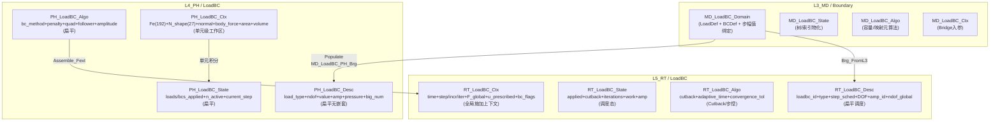

> **命名对齐（Canon）**：P4 柱级 **`DomainAbbr` = `LoadBC`**（见 `Domain_Compression_Canon.md`）。文档域缩与架构用语一律 **LoadBC**，**勿使用「Ldbc」**。Fortran 仍可出现存量前缀 **`PH_Ldbc_*`**、**`RT_Ldbc_*`**、**`MD_LBC_*`** 等，新 MODULE/TYPE 优先 **`PH_LoadBC_*`** / **`RT_LoadBC_*`**，与 `TBP_Unification_Phases_and_LoadBC_Lexicon.md` 一致。

# 载荷/边界条件域：L3 / L4 / L5、四型、载荷组装与 BC 施加 — 合订（一体化设计）

**文档性质**：与 **`Material_…`**（材料）、**`Element_…`**（单元/UEL）、**`Section_…`**（截面）、**`Contact_…`**（接触）并列的 **P4 LoadBC 域柱合订**；把 **载荷与边界条件（LoadBC）** 作为 **贯通域柱**，写清 **L3 真源 → Populate → L4 消费 → L5 调度** 的分工、**四型** 裁剪与 **防双主源** 边界。
**代码真源**：`ufc_core/L3_MD/Boundary/`（**L3-only SSOT**，见 **`L3_MD/Boundary/CONTRACT.md`**）；`ufc_core/L4_PH/LoadBC/`（L4 物理计算，见 **`L4_PH/LoadBC/CONTRACT.md` v4.0**）；`ufc_core/L5_RT/LoadBC/`（L5 运行调度，见 **`L5_RT/LoadBC/CONTRACT.md` v2.0**）。
**报告 ID**：`REP-LOADBC-PILLAR`；**命名与五场景（S0–S4）**：`REPORTS/REPORT_Naming_Quad_OnePager_FiveScenes.md` §1、§3。

**与跨域模板关系**：**`Pillar_L3L4L5_CrossLayer_Design_Template.md` §4.1** LoadBC 行；**一页填槽** **`OnePager_FourKind_MasterAux_Nesting.md` §3.2**；**本文件 §3.5** 四型主/辅架构图解（扁平四型+后续可引入Stp_Ctl_Algo+mermaid）。  
**Base / `Boundary/` 目录 / LoadBC 文档统一索引**（四型+算法一张表、Boundary 是否独立成柱）：**`Base_Boundary_LoadBC_FourType_Algorithm_Unified_Index.md`**。
**一体化联动审查**：与 **接触合订本 §8**（接触力→全局 K/F 与 LoadBC 载荷向量的装配顺序）；**单元合订本 §4**（压力面与单元关联）；**Constraint 域合同**（约束类关键字分界）— **同议题同批次**改。  
**外部手册锚点（只读核对）**：**`REPORTS/REPORT_Naming_Quad_OnePager_FiveScenes.md` §6**；优先 **`D:\TEST7\Manual\ANALYSIS_5.pdf`**（*Vol.V* **§34 Prescribed conditions**、幅值与局部坐标系等）、**`ANALYSIS_2.pdf`**（*Vol.II* **Part III** 过程/步内 prescribed 与输出请求时序）、**`KEYWORD.pdf`**（`*BOUNDARY`、`*CLOAD`、`*DLOAD`、`*FILM`、`*STEP`…）、**`USER.pdf`**（**DLOAD / UAMP** 等载荷类子程序）。

---

## 功能模块完整性公式

**完整功能模块 = 数据结构（四型TYPE：Desc/State/Algo/Ctx + Args）+ 过程算法（空间维度 + 时间维度 + 动作维度）**

- **数据结构侧**：`PH_LoadBC_Desc/State/Algo/Ctx`（**扁平四型**，暂无 depth-2 嵌套——因载荷/BC 语义简单，标量+枚举即可表达） + `PH_Ldbc_Load_Def`(载荷缓存) / `PH_Ldbc_Def`(BC 类型) / `PH_Ldbc_Stp_Ctl_Algo`(P0 补全) + `RT_Ldbc_Proc`(SIO 16types/8组)
- **过程算法侧**：双 Pipeline（Assemble → Apply）为**动作维度**——`Assemble_Fext`(载荷组装) + `Apply_DirichletBC`(BC 施加)；`PH_Ldbc_Stp_Ctl_Algo`（时间维度步控：bc_method/penalty/quad/follower/amplitude/conv_norm/cutback）+ 空间维度（分布载荷积分/Gauss 点映射）驱动全管道
- **两则关系**：`PH_LoadBC_Algo` 同时是四型并列第四槽（数据结构侧）和 Assemble→Apply 管道的策略容器（过程算法侧，R-12）；枚举驱动（vs Procedure Pointer）为设计决策（载荷/BC 枚举类型有限，无需 PTR 级可替换）
- **完整域柱定义**：`MD_Ldbc_*`(L3 SSOT, 须从 Boundary 剥离为独立 L3_MD/LoadBC/) + `PH_LoadBC_Domain`(L4 物理核) + `RT_Ldbc_Impl`(L5 调度) = 三层完备的全贯通支柱（P4）
- **本节与 `LoadBC_Procedure_Algorithm.md`** 互补对照：后者展开 `PH_Ldbc_Stp_Ctl_Algo` 字段细节、Assemble→Apply 双管线的步骤级时序

---

## 0. 文档目的与范围

| 涵盖 | 不涵盖 |
|------|--------|
| LoadBC 域在 **P4 贯通柱** 中的职责；L3/L4/L5 分工 | 具体 **载荷积分公式** 完整推导 |
| **L3** `MD_Ldbc_*` / `MD_Load_*` / `MD_BC_*` 四型与模块清单 | 全仓库每一种 **BC 施加方法** 的公式推导 |
| **Populate** 金线、**组装→施加** 热路径 | **Constraint 域** 的 MPC/Tie/Coupling（见 Constraint 合同） |
| **L4/L5 目标态** 与 **防双主源** | 替代各层 **`CONTRACT.md`** 字段级真源 |

---

## 1. 术语：贯通域柱、域缩、载荷/BC/IC 分界

| 术语 | 含义 | LoadBC 域在本文件中的定位 |
|------|------|---------------------------|
| **贯通域柱（P4）** | LoadBC：**L3+L4+L5** 均有可指认域目录与金线 | LoadBC 为 **全贯通柱**；三层各有独立域目录 |
| **域柱缩写 (Canon)** | **`LoadBC`** | 文档/任务卡第二段柱级 token；柱内可有 `Load`/`BC`/`LBC` 专题段；Fortran 存量前缀 `PH_Ldbc_*`/`RT_Ldbc_*`/`MD_LBC_*` 仍合法直至迁移 |
| **载荷/BC/IC 分界** | 载荷（CLOAD/DLOAD/GRAV/压力）与 BC（Dirichlet/Neumann）在同一域，但施加路径不同 | L3 统一存储；L4/L5 分 Load 侧和 BC 侧两条热路径 |
| **约束类关键字分界** | `*TIE`/`*MPC` 等属 **Constraint 域**，不属 LoadBC | 边界条件 `*BOUNDARY` 属 LoadBC；约束方程 `*EQUATION` 属 Constraint |

---

## 2. 三层职责总览（LoadBC 相关）

### 2.1 一句话

- **L3_MD / Boundary**：**载荷/BC/IC 定义 SSOT** —— 载荷类型、幅值引用、目标节点/单元集、BC 类型、初始条件；**不做** 施加算法。
- **L4_PH / LoadBC**：**载荷物理计算与 BC 数值施加** —— 集中力/分布力/体力/压力组装、Dirichlet BC 消元/罚函数/Lagrange 施加、幅值因子求值、地应力 K₀ 特化；**不解析** INP、**不做** 全局 CSR。
- **L5_RT / LoadBC**：**运行时调度与全局施加编排** —— 按步激活载荷/BC、幅值插值、收敛检查与 Cutback、反力计算、与 `RT_Asm_*` 装配调用顺序对齐；**不实现** 单元等效力积分核（L4 负责）。

### 2.2 对照表

| 层 | 主要职责 | 典型产物或类型 |
|----|----------|---------------|
| **L3_MD** | 载荷/BC Desc 真源、步绑定、幅值引用 | **`LoadDef`**、**`BCDef`**、**`MD_LoadBC_Domain`**、**`MD_LoadBC_Algo`**、**`MD_LoadBC_Ctx`** |
| **L4_PH** | 载荷组装 + BC 施加 + 幅值求值 | **`PH_LoadBC_Desc/State/Ctx`**、**`PH_LoadBC_Domain`**（金线容器）、**`PH_Ldbc_Load_Def`**/`PH_Ldbc_Def` |
| **L5_RT** | 全局施加编排 + 收敛控制 + 反力 | **`RT_LoadBC_Desc/State/Algo/Ctx`**、**`RT_Ldbc_Impl`**、**`RT_BC_ReactionForce`** |

---

## 3. 三层数据流：Populate → 热路径 → 回写

### 3.1 Populate 金线（冷路径）

```text
INP (*CLOAD / *DLOAD / *BOUNDARY / *INITIAL CONDITIONS)
  → L6_AP / KeyWord 映射
  → MD_LoadBC_Domain::Add (L3 冷存储)
  → MD_LoadBC_PH_Brg (BuildStepBCs_Idx / BuildStepLoads_Idx)
  → PH_L4_Populate_LoadBC() ← Layer 顺序: Material → Element → LoadBC → …
    → PH_LoadBC_Desc / State / Ctx  ← Populate 后只读
```

### 3.2 组装热路径

```text
PH_LoadBC_Domain%IncrBegin_Reset()     ← 增量开始清零
  → PH_LoadBC_Domain%Assemble_Fext()   ← 组装: CLOAD + 体载 + 面载 + 热载
  → PH_LoadBC_Domain%Apply_DirichletBC/CSR()  ← Dirichlet: dense 与 CSR 两路
  → PH_LoadBC_Domain%Eval_Amplitude()  ← 幅值因子 A(t) 查询
    → F_ext → L5 RT_Asm_GlobalLoad     ← 贡献到全局
```

### 3.3 L5 施加编排

```text
StepDriver (步/增量编排)
  → RT_LoadBC_ApplyLoads()     ← 载荷施加
    → L4 PH_LoadBC_Domain slot ← 消费 L4 已 Populate 数据
  → RT_LoadBC_ApplyBCs()       ← BC 施加
    → global K/F 更新          ← RT_Asm_* 对齐
  → RT_BC_Compute_Reactions()  ← 反力计算
```

---

## 3.5 四型主/辅架构图解（L3 / L4 / L5 全景）

> 下列与 **`PH_LBC_Def.f90`**（AUTHORITY）、**`RT_Ldbc_Def.f90`**、**`MD_Load_Def.f90`** / **`MD_BC_Def.f90`** 对齐；字段变更以 .f90 为准。

### 3.5.1 L4 四型主 TYPE 与辅 TYPE 嵌套（`PH_LBC_Def.f90` AUTHORITY）

```text
PH_LoadBC_Desc (主·Desc)                 ← 冷 / Populate 后只读
├── load_type      : INTEGER(i4)         ← PH_LOAD_* 枚举 (1=CONCENTRATED, 2=DISTRIBUTED, ...)
├── ndof           : INTEGER(i4)         ← 总 DOF 数
├── nn             : INTEGER(i4)         ← 单元节点数
├── ndof_per_node  : INTEGER(i4)         ← 每节点 DOF (默认3)
├── dof_dir        : INTEGER(i4)         ← 分布载 DOF 方向
├── dof            : INTEGER(i4)         ← 集中力/Dirichlet 目标 DOF
├── value          : REAL(wp)            ← 载荷/BC 值
├── amp_factor     : REAL(wp)            ← 幅值因子
├── pressure       : REAL(wp)            ← 压力值
├── rho            : REAL(wp)            ← 重力密度
└── big_num        : REAL(wp)            ← 罚函数大数 (Dirichlet)

PH_LoadBC_State (主·State)               ← 步级持久状态
├── loads_applied  : LOGICAL
├── bcs_applied    : LOGICAL
├── n_active_loads : INTEGER(i4)
├── n_active_bcs   : INTEGER(i4)
└── current_step   : INTEGER(i4)

PH_LoadBC_Algo (主·Algo)                 ← 冷/步级 / IN
├── bc_method      : INTEGER(i4)         ← 1=Penalty, 2=Lagrange, 3=Elimination
├── penalty_param  : REAL(wp)            ← 罚参数 (1E12)
├── quad_order     : INTEGER(i4)         ← Gauss 积分阶 (默认2)
├── use_follower   : LOGICAL             ← 随动压力载荷
└── use_amplitude  : LOGICAL             ← 幅值曲线插值

PH_LoadBC_Ctx (主·Ctx)                   ← 热 / INOUT (单元级工作区)
├── Fe(192)        : REAL(wp)            ← 单元力向量 (max 8nodes×24DOF)
├── N_shape(27)    : REAL(wp)            ← 积分点形函数
├── normal(3)      : REAL(wp)            ← 面法向
├── body_force(3)  : REAL(wp)            ← 体力向量
├── g_vec(3)       : REAL(wp)            ← 重力向量
├── D_mat(6,6)     : REAL(wp)            ← 热载材料刚度
├── eps_th(6)      : REAL(wp)            ← 热应变
├── area           : REAL(wp)            ← 单元面面积
└── volume         : REAL(wp)            ← 单元体积
```

> **L4 LoadBC 特点**：四型为 **扁平结构**（无辅 TYPE 嵌套），与 Contact/Material 的多层嵌套不同。载荷/BC 语义简单（标量+枚举），不需要 Depth-2 辅 TYPE。后续若引入 `PH_Ldbc_Stp_Ctl_Algo`（步控算法），可按材料 `PH_Mat_Stp_Ctl_Algo` 模式嵌套。

### 3.5.2 L5 四型主 TYPE（`RT_Ldbc_Def.f90` AUTHORITY）

```text
RT_LoadBC_Desc (主·Desc)                 ← DELEGATED → L3 索引
├── loadbc_id, loadbc_type : INTEGER(i4)
├── name            : CHARACTER(64)
├── step_idx_start/end : INTEGER(i4)      ← 步调度窗
├── time_start/end  : REAL(wp)           ← 时间调度窗
├── dof_index       : INTEGER(i4)        ← 目标 DOF
├── node_set_id, elem_set_id : INTEGER(i4) ← 目标集
├── amp_id          : INTEGER(i4)        ← 幅值引用
├── magnitude       : REAL(wp)
├── n_loads, n_bcs  : INTEGER(i4)        ← 域级计数
└── ndof_global     : INTEGER(i4)

RT_LoadBC_State (主·State)               ← 调度态 / 运行状态
├── load_applied, bc_applied : LOGICAL
├── cutback_active : LOGICAL
├── total_cutbacks : INTEGER(i4)
├── total_iterations: INTEGER(i4)
├── accumulated_work: REAL(wp)
├── current_amp    : REAL(wp)
└── time            : REAL(wp)

RT_LoadBC_Algo (主·Algo)                 ← Cutback/自适应/收敛控制
├── auto_cutback_enabled : LOGICAL       ← 自动 Cutback 开关
├── max_cutbacks   : INTEGER(i4)         ← Cutback 上限 (10)
├── cutback_factor : REAL(wp)            ← 缩减因子 (0.5)
├── min_load_increment : REAL(wp)        ← 最小载荷增量
├── adaptive_time_enabled : LOGICAL      ← 自适应时间步
├── target_iterations : REAL(wp)         ← 目标迭代数 (4.0)
├── dt_increase/decrease_factor : REAL(wp) ← 步长增减因子
├── dt_min, dt_max : REAL(wp)
├── load_convergence_tol : REAL(wp)      ← 载荷收敛容差
└── displacement_tol : REAL(wp)          ← 位移收敛容差

RT_LoadBC_Ctx (主·Ctx)                   ← 增量级热路径上下文
├── step_time, total_time, time_increment : REAL(wp)
├── step/incr/iter_number : INTEGER(i4)
├── analysis_type  : INTEGER(i4)         ← RT_LOADBC_STATIC/DYNAMIC/THERMAL
├── nlgeom         : LOGICAL
├── first/last_increment : LOGICAL
├── F_global(:)    : REAL(wp), POINTER   ← 全局力向量引用
├── u_prescribed(:): REAL(wp), POINTER   ← 指定位移引用
└── bc_flags(:)    : INTEGER(i4), POINTER ← BC 标志引用
```

### 3.5.3 L3 四型主 TYPE（`MD_Load_Def.f90` / `MD_BC_Def.f90` AUTHORITY）

```text
MD_Load_Def / MD_BC_Def (主·Desc)        ← SSOT / 冷真源
├── LoadDef        ← 载荷定义 (type, target_set, magnitude, amp_ref)
├── BCDef          ← BC定义 (dof, value, type=DISP/UTEMP/UMASFL...)
├── MD_LoadBC_Domain ← 域容器 (Add/Query/Ctrl)
├── MD_LoadBC_Algo   ← 容量/映射元算法
└── MD_LoadBC_Ctx    ← Bridge 入参上下文

MD_Ldbc_Domain (域容器 TBP)              ← 金线 SIO
├── Add / Query / Ctrl / Sync
└── 步幅值绑定 (BuildStepBCs_Idx / BuildStepLoads_Idx)
```

### 3.5.4 辅 TYPE 命名规范速查

| 层 | 主 TYPE | 辅 TYPE 命名模式 | 当前状态 |
|----|---------|-----------------|----------|
| **L4** | `PH_LoadBC_Desc/State/Algo/Ctx` | **扁平**（无辅 TYPE） | 载荷/BC 语义简单，暂不需要嵌套 |
| **L4** | `PH_Ldbc_Load_Def` / `PH_Ldbc_Def` | 拆分式管理器 | `PH_Ldbc_Load_Mgr`、`PH_Ldbc_Mgr`（Load/BC 物理语义不同允许拆分） |
| **L5** | `RT_LoadBC_*` | **扁平** + SIO Proc | `RT_Ldbc_Proc` 16types/8组 |
| **L3** | `MD_Ldbc_*` / `MD_Load_*` / `MD_BC_*` | 域容器+拆分式 | `MD_Ldbc_Domain` + `MD_Load_Def` + `MD_BC_Def` |

> **后续演进**：若 L4 Algo 需引入步控子结构，可参照材料 `PH_Mat_Stp_Ctl_Algo` 模式新增 `PH_Ldbc_Stp_Ctl_Algo` 辅 TYPE。

### 3.5.5 三层四型嵌套深度对照（mermaid）



### 3.5.7 ULOAD ABI 镜像对偶（用户载荷子程序）

> 与 `PH_UMAT_Context`（材料）、`PH_UEL_Context`（单元）对偶，ULOAD 提供 **用户自定义集中力/力矩** 的 ABI 入口。

**标准 Fortran 原型**：

```fortran
      subroutine uload(force, nDOFEL, nRHS, props, nProps, u, du, v, a,
     1     jType, time, dtime, kpredef, nPredef, lFlags, mlFlags,
     2     pnewdt, celent, params, nParams, prevState, currentState,
     3     noel, npt, layer, kspt, kstep, kinc)
      include 'aba_param.inc'
      ! 变量声明（略）
      end
```

**核心参数映射（ULOAD → UFC 四型）**：

| ULOAD 参数 | UFC 四型归属 | 说明 |
|------------|-------------|------|
| `FORCE(ndofel,nrhs)` | `PH_LoadBC_Ctx%Fe(192)` → 写回 | 节点集中力/力矩向量（最终输出） |
| `U(ndofel)` | `PH_Elem_Ctx%u` 或 `PH_LoadBC_Ctx` | 节点当前位移 |
| `DU(ndofel,nrhs)` | `PH_Elem_Ctx%du` | 牛顿迭代位移修正量 |
| `V/A(ndofel)` | `PH_Elem_Ctx`（动态分析） | 节点速度/加速度 |
| `TIME(2)` | `RT_LoadBC_Ctx%step_time/total_time` | 总时间/增量步时间 |
| `DTIME` | `RT_LoadBC_Ctx%time_increment` | 时间步长 Δt |
| `PROPS(nProps)` | `PH_LoadBC_Desc` | 用户载荷参数（如幅值 F0） |
| `LFLAGS(3)` | `RT_LoadBC_State` 控制标志 | 载荷类型/迭代状态/更新标志 |
| `NOEL/NPT` | `RT_LoadBC_Desc` 索引 | 单元号/积分点号 |
| `KSTEP/KINC` | `RT_LoadBC_Ctx%step/incr_number` | 分析步/增量步号 |
| `CELENT` | `MD_Sect_Desc` → 单元特征长度 | 稳定化/网格自适应 |

**与 DLOAD / UTRACLOAD 分界**：

| 子程序 | 载荷类型 | 作用对象 | UFC 消费路径 |
|--------|----------|----------|-------------|
| **ULOAD** | 集中力/力矩（节点级） | 节点 | `PH_LoadBC_Ctx%Fe` → 组装到 `F_ext` |
| **DLOAD** | 分布压力/面力（单元级） | 单元/面 | `PH_LoadBC_Domain%Assemble_Fext` |
| **UTRACLOAD** | 切向/法向面力（表面级） | 表面 | 接触合订本 §3.5.5（GAPCON/GAPUNIT） |

**防双写约束**：

- **禁止**：ULOAD 与 `*CLOAD` 同时作用于同一 DOF（须合同指定优先序）。
- **禁止**：ULOAD 直接写全局 `F_global`（须经 L4 `PH_LoadBC_Ctx%Fe` → L5 组装）。
- **CFD-FEM 耦合场景**（可选扩展）：体积力加载（NS方程对流项/压力梯度→集中力）、稳定化力嵌入（SUPG/GLS→附加集中力）、伪时间迭代（通过 `DTIME` 控制收敛）。

**ABI 镜像命名**：`PH_ULOAD_Context`（文档名 ABI_Flat，≠ `PH_LoadBC_Ctx`），与 `PH_UMAT_Context`/`PH_UEL_Context` 对偶。

### 3.5.8 DLOAD ABI 镜像对偶（用户分布载荷子程序）

> 与 `PH_ULOAD_Context`（节点级集中力）对偶，DLOAD 提供 **用户自定义分布压力/面力** 的 ABI 入口，作用对象为单元/面而非节点。

**标准 Fortran 原型**：

```fortran
      subroutine dload(f, kstep, kinc, time, noel, npt, layer, kspt,
     1     coords, jltyp, sname, props, nprops, cellmindir,
     2     cellnormal, pnewdt, celent, dtime, predef, ndim)
      include 'aba_param.inc'
      ! 变量声明（略）
      end
```

**核心参数映射（DLOAD → UFC 四型）**：

| DLOAD 参数 | UFC 四型归属 | 说明 |
|------------|-------------|------|
| `F` | `PH_LoadBC_Ctx%Fe_elem` → 组装到 `F_ext` | 分布载荷值（压力/面力，标量或向量分量） |
| `TIME(2)` | `RT_LoadBC_Ctx%step_time/total_time` | 总时间/增量步时间 |
| `NOEL/NPT` | `RT_LoadBC_Desc%elem_id/integ_pt` | 单元号/积分点号 |
| `KSTEP/KINC` | `RT_LoadBC_Ctx%step/incr_number` | 分析步/增量步号 |
| `COORDS(ndim)` | `PH_Elem_Ctx%x(:,:)` | 积分点空间坐标 |
| `JLTYP` | `MD_Load_Desc%load_type` | 载荷类型标识（P/NU1/NU2/TAU1/TAU2 等） |
| `SNAME` | `MD_LoadBC_Desc%set_name` | 面/单元集名称 |
| `PROPS(nProps)` | `PH_LoadBC_Desc` | 用户分布载荷参数（如压力 P0） |
| `CELLENT` | `MD_Sect_Desc%characteristic_length` | 单元特征长度（稳定化/自适应） |
| `DTIME` | `RT_LoadBC_Ctx%time_increment` | 时间步长 Δt（瞬态分析） |
| `PREDEF(ndim)` | `RT_LoadBC_Ctx%predefined_field` | 预定义场（温度等） |

**与 ULOAD / UTRACLOAD 分界**（交叉引用 §3.5.7）：

| 子程序 | 载荷类型 | 作用对象 | UFC 消费路径 | 典型场景 |
|--------|----------|----------|-------------|----------|
| **ULOAD** | 集中力/力矩（节点级） | 节点 | `PH_LoadBC_Ctx%Fe` → 组装 | 弹簧支撑/点载荷 |
| **DLOAD** | 分布压力/面力（单元级） | 单元/面 | `PH_LoadBC_Domain%Assemble_Fext` | 水压/风载/热压力 |
| **UTRACLOAD** | 切向/法向面力（表面级） | 表面 | 接触合订本 §3.5.5（GAPCON/GAPUNIT） | 接触摩擦/牵引力 |

**DLOAD 载荷类型常量（JLTYP 映射）**：

| JLTYP 值 | 含义 | UFC 常量 | 说明 |
|----------|------|----------|------|
| 1 | 法向压力 | `DLOAD_TYPE_P` | 垂直于面（默认正方向） |
| 2 | 第一切向 | `DLOAD_TYPE_NU1` | 面内第一方向 |
| 3 | 第二切向 | `DLOAD_TYPE_NU2` | 面内第二方向 |
| 4 | 体载 | `DLOAD_TYPE_BODY` | 重力/离心力/电磁力 |

**防双写约束**：

- **禁止**：DLOAD 与 `*DLOAD` 关键字同时作用于同一单元面（须合同指定优先序：用户子程序优先）。
- **禁止**：DLOAD 直接写全局 `F_global`（须经 L4 `PH_LoadBC_Ctx%Fe_elem` → L5 `RT_LoadBC_Assemble`）。
- **瞬态 DLOAD**：时间依赖性通过 `TIME(2)` + `DTIME` 控制，不重建幅值表（UAMP 已在 Analysis 域覆盖）。
- **热-力耦合 DLOAD**：热膨胀压力通过 `PREDEF(ndim)` 温度场耦合，不引入独立热载荷 ABI。

**ABI 镜像命名**：`PH_DLOAD_Context`（文档名 ABI_Flat，≠ `PH_LoadBC_Ctx`），与 `PH_ULOAD_Context`/`PH_UMAT_Context` 对偶。

**与 ULOAD 联合使用场景**：

- **混合载荷**：DLOAD（分布水压）+ ULOAD（集中支撑反力）同时作用。
- **CFD-FEM 耦合**：DLOAD 映射 CFD 压力场到 FEM 网格表面。
- **自适应网格**：DLOAD 通过 `CELLENT` 检测单元尺寸，实现网格无关载荷分布。

---

## 4. L3 现状：四型与模块（真源表）

> 下列与 **`L3_MD/Boundary/CONTRACT.md`** 对齐；实现变更以合同为准。

### 4.1 四型裁剪（L3 域内）

| Kind | L3 TYPE / 说明 | 备注 |
|------|----------------|------|
| **Desc** | **`LoadDef`**、**`BCDef`**、**`MD_LdbcDesc`**、**`MD_BC_Def`**（DISP/UTEMP/UMASFL 等）、**`MD_Load_Def`**（DLOAD/DFILM 等） | **SSOT**；含载荷类型常量、目标集、幅值引用 |
| **State** | **`MD_LoadBC_State`**（若存在） | 树/索引物化状态；不存放步内收敛历史 |
| **Algo** | **`MD_LoadBC_Algo`** | 容量/映射等元算法；无单元积分 Compute_Fe |
| **Ctx** | **`MD_LoadBC_Ctx`**（若存在） | 无 L5 求解器 Ctx；Bridge 入参由 RT/PH 注入 |

### 4.2 模块清单（摘要）

| 文件 | `MODULE` | 角色 |
|------|----------|------|
| `MD_BC_Def.f90` | `MD_BC_Def` | BC 四型基类 + 特化 Desc |
| `MD_Load_Def.f90` | `MD_Load_Def` | Load 四型基类 + 特化；`MD_LoadBC_State/Algo/Ctx` |
| `MD_Ldbc_Domain.f90` | `MD_Ldbc_Domain` | `MD_LoadBC_Domain` 域容器 + SIO Arg |
| `MD_Ldbc_Mgr.f90` | `MD_Ldbc_Mgr` | Legacy→域转换、步/幅值查询 |
| `MD_Ldbc_Idx.f90` | `MD_LoadBC_Idx` | 索引绑定（避免循环 USE） |
| `MD_Ldbc_Brg.f90` | `MD_Ldbc_Brg` | L6 向 UF_* API 兼容 |
| `MD_Ldbc_Query.f90` | `MD_Ldbc_Query` | 查询接口 |
| `MD_Ldbc_Container.f90` | `MD_Ldbc_Container` | 旧容器兼容 |
| `MD_Ldbc_Core.f90` | `MD_Ldbc_Core` | 核心操作 |

---

## 5. L4 现状：四型与接口

### 5.1 四型 (`PH_Ldbc_Def.f90` + `PH_Ldbc_Load_Def.f90`)

| 四型 | TYPE 名称 | 核心字段 | 说明 |
|------|-----------|----------|------|
| **Desc** | `PH_LoadBC_Desc` | load_type, ndof, nn, dof_dir, value, amp_factor, pressure, big_num | Populate 后只读 |
| | `PH_Ldbc_LoadCache_Type` | … | 载荷缓存 |
| | `PH_Ldbc_Cache_Type` / `PH_Ldbc_Dirichlet_Desc` / `PH_Ldbc_Neumann_Desc` | … | BC 缓存与分类 |
| **State** | `PH_LoadBC_State` | F_ext, F_body, F_thermal, reaction | 积累向量，每增量步更新 |
| **Algo** | （隐式） | — | 算法逻辑分布在各 Core 模块中，无统一 Algo TYPE |
| **Ctx** | `PH_LoadBC_Ctx` | Fe, N_shape, normal, body_force, area, volume | 热路径 IP 级临时工作区 |
| | `PH_Ldbc_Ctx` / `PH_Ldbc_Ctx` | … | 载荷/BC 积分上下文 |

### 5.2 金线容器 (`PH_LoadBC_Domain` TBP)

| TBP | 说明 |
|-----|------|
| `%Init` / `%Finalize` | Step 级生命周期 |
| `%RegisterLoad` / `%RegisterBC` | Populate 注册 |
| `%RegisterPressureSurface` | 压力面注册 |
| `%IncrBegin_Reset` | 增量开始清零 |
| `%Assemble_Fext` | 外载/体载/热载组装 |
| `%Apply_DirichletBC` / `%Apply_DirichletBC_CSR` | Dirichlet: dense 与 CSR 两路 |
| `%Eval_Amplitude` | 幅值因子 A(t) 查询 |

### 5.3 枚举体系

- **载荷类型**：`PH_LOAD_*`(1–8)（权威）；`LOAD_*`(1–6) / `LOAD_TYPE_*`(1–6)（LEGACY MIRROR）
- **BC 处置方法**：`PH_LDBC_BC_ELIMINATION / PENALTY / LAGRANGE`

---

## 6. L5 现状：四型与调度

### 6.1 四型 (`RT_Ldbc_Def.f90`)

| 四型 | TYPE 名称 | 核心字段 |
|------|-----------|----------|
| **Desc** | `RT_LoadBC_Desc` | loadbc_id, type, name, step scheduling, DOF, amp_id, magnitude, n_loads, n_bcs, ndof_global |
| **State** | `RT_LoadBC_State` | load_applied, bc_applied, cutback_active, total_cutbacks, total_iterations, accumulated_work, current_amp |
| **Algo** | `RT_LoadBC_Algo` | auto_cutback, max_cutbacks, cutback_factor, adaptive_time, target_iterations, convergence_tol |
| **Ctx** | `RT_LoadBC_Ctx` | step_time, total_time, dt, step/inc/iter number, analysis_type, nlgeom, F_global, u_prescribed, bc_flags |

### 6.2 金线模块

| 文件 | MODULE | 角色 |
|------|--------|------|
| `RT_Ldbc_Impl.f90` | `RT_Ldbc_Impl` | Init/Update/ApplyLoads/ApplyBCs/ComputeReactions/CheckConvergence/ApplyCutback |
| `RT_Ldbc_Proc.f90` | `RT_Ldbc_Proc` | SIO _In/_Out 封装（16 types，8 组接口） |
| `RT_BC_ReactionForce.f90` | `RT_BC_ReactionForce` | BC 约束施加 + 反力计算 |
| `RT_Ldbc_Brg.f90` | `RT_LoadBC_Brg` | FromL3/ToL4/WriteBack 桥接 |

---

## 7. 四型跨层裁剪表（目标态 + 当前态）

| Kind | L3（当前） | L4（目标 / 当前） | L5（目标 / 当前） |
|------|------------|-------------------|-------------------|
| **Desc** | **RETAINED** `MD_Ldbc_*` | **DELEGATED→L3**（Populate 灌入 `PH_LoadBC_Desc` 等） | **DELEGATED**（仅索引/调度参数 `RT_LoadBC_Desc`） |
| **State** | **RETAINED**（树/索引物化状态） | **RETAINED**（`PH_LoadBC_State`：F_ext/reaction 等） | **RETAINED**（`RT_LoadBC_State`：cutback/iteration/amp） |
| **Algo** | **RETAINED**（元算法/容量） | **TRIMMED**（无统一 Algo TYPE；分布各 Core） | **RETAINED**（`RT_LoadBC_Algo`：cutback/convergence 控制） |
| **Ctx** | **TRIMMED**（无 L5 求解器 Ctx） | **RETAINED**（`PH_LoadBC_Ctx`：IP 级积分工作区） | **RETAINED**（`RT_LoadBC_Ctx`：全局施加上下文） |

**L4 Algo 缺失说明**：当前 L4 LoadBC 无统一 Algo TYPE，算法参数嵌入 Desc 或 Domain。后续可按需引入 `PH_Ldbc_Stp_Ctl_Algo`（与 Element/Material 对齐）。

---

## 8. 与材料 / 单元 / 截面 / 接触合订本的衔接点

| 主题 | 材料合订本 | 单元合订本 | 接触合订本 | 本文（LoadBC） |
|------|------------|------------|------------|----------------|
| **Populate** | `PH_L4_Populate_Material` | `PH_L4_Populate_Element` | `MD_Cont_PH_FillParams` | `PH_L4_Populate_LoadBC`（Layer 顺序: Material→Element→LoadBC→…） |
| **热路径** | `PH_Mat_Execute_Flow` | `PH_Element_Compute_Ke/Fe` | `PH_Cont_AlgorithmFramework` | `PH_LoadBC_Domain%Assemble_Fext` + `Apply_DirichletBC` |
| **全局贡献** | 材料切线→单元刚度 | 单元贡献→全局 K/F | 接触贡献→全局 K/F | F_ext→`RT_Asm_GlobalLoad`；K_bc→全局 K |
| **幅值** | 材料无直接消费 | 单元压力面消费幅值 | 接触无直接消费 | `Amp_GetFactor`（L3）；`Eval_Amplitude`（L4） |
| **约束分界** | — | — | — | `*BOUNDARY` 属 LoadBC；`*EQUATION/*TIE` 属 Constraint |
| **Procedure/Algorithm 专域合订** | `Material_Procedure_Algorithm.md` §2–§4 | `Element_Procedure_Algorithm.md` §2–§4 | `Contact_Procedure_Algorithm.md` §2–§4 | **`LoadBC_Procedure_Algorithm.md`** §2(Algo TYPE)、§3(Assemble→Apply 双管道)、§4(Procedure Pointer 说明) |

---

## 9. 防双主源与命名一致性

### 9.1 防双四型主源

- **禁止**：L3 **`MD_Ldbc_*` 全四型** 与 L4 **`PH_LoadBC_*` 全四型** 并列 Writable SSOT。
- **允许**：L3 **唯一冷真源**（Desc 方向）+ L4 **组装/施加主源** + L5 **调度主源**。
- **关键约束**：L3 Desc 为 write-once；L4 State 写 F_ext/reaction；L5 State 写 cutback/iteration 状态。

### 9.2 Fortran 前缀现状（与文档柱缩 **`LoadBC`** 区分）

| 层 | 文档柱缩（Canon） | 当前 Fortran 主前缀（存量） |
|----|-------------------|---------------------------|
| L3 | **`LoadBC`** | `MD_Ldbc_*`（并存 `MD_Load_*` / `MD_BC_*`） |
| L4 | **`LoadBC`** | `PH_Ldbc_*` / `PH_LoadBC_*`（并存） |
| L5 | **`LoadBC`** | `RT_Ldbc_*` / `RT_LoadBC_*` / `RT_BC_*`（并存） |

**后续统一建议**：文档 / 任务卡一律 **`LoadBC`**；Fortran **新 MODULE** 优先 **`PH_LoadBC_*`** / **`RT_LoadBC_*`**（见 `TBP_Unification_Phases_and_LoadBC_Lexicon.md`）；存量 **`PH_Ldbc_*`** 等与 **TBP P2** 迁移脚本对齐。**禁止**再用 **`Ldbc`** 作为柱级文档缩写。

---

## 10. 分阶段落地（纳入一体化设计）

| 阶段 | 交付物 | 验收 |
|------|--------|------|
| **S0（本文 + 合同对齐）** | 本合订本文 + 三层合同交叉引用闭合 | 评审能通过「LoadBC 出现在 Populate/热路径叙述」 |
| **S1（L4 Algo 统一）** | `PH_Ldbc_Stp_Ctl_Algo`（可选；当前 TRIMMED 可维持） | 若引入则与 Element/Material Algo 对齐 |
| **S2（CMake 集成）** | 解除 `EXCLUDE`；L3 Boundary 编译通过 | 全量编译零错误 |
| **S3（Fortran 前缀收敛）** | **`PH_Ldbc_*` → `PH_LoadBC_*`**（批量改名脚本；与 TBP P2 绑定） | **待办** |

---

## 附录 A — 载荷类型枚举速查

| 枚举 | ID | 说明 |
|------|----|------|
| `PH_LOAD_CONCENTRATED` | 1 | 集中力（CLOAD） |
| `PH_LOAD_DISTRIBUTED` | 2 | 分布力（DLOAD） |
| `PH_LOAD_BODY` | 3 | 体力（GRAVITY） |
| `PH_Ldbc_PRESSURE` | 4 | 压力 |
| `PH_Ldbc_THERMAL` | 5 | 热载 |
| `PH_LOAD_SURFACE_TRACTION` | 6 | 面牵引力 |
| — | 7–8 | 预留 |

## 附录 B — BC 施加方法枚举

| 枚举 | 说明 |
|------|------|
| `PH_LDBC_BC_ELIMINATION` | 消元法（直接修改 K/F） |
| `PH_LDBC_BC_PENALTY` | 罚函数法（大数法） |
| `PH_LDBC_BC_LAGRANGE` | Lagrange 乘子法（扩展系统） |

## 附录 C — 维护与同步清单

- **`L3_MD/Boundary/CONTRACT.md`**：任意 **四型 / 模块 / P7 子表** 变更 → 同步本文 **§4、§7**。
- **`L4_PH/LoadBC/CONTRACT.md`**：接口 / 枚举变更 → 同步本文 **§5、附录 A/B**。
- **`L5_RT/LoadBC/CONTRACT.md`**：SIO / Cutback / 反力变更 → 同步本文 **§6**。
- **材料 / 单元 / 接触合订本**：凡 **Populate、全局 K/F、幅值** 变更涉及 LoadBC → 同步本文 **§8**。
- **Constraint 域合同**：**载荷/BC 与约束的关键字分界** 变更 → 同步本文 **§1 术语表**。
- **`USER.pdf` 换版或增补扫描词**：重跑 **`UFC/temp_pdf_extractor.py`** → 更新 **附录 D** 与 **`REPORTS/user_subroutine_keyword_pages_ABAQUS_USER_6_14.json`**。

## 附录 D — `USER.pdf`（Abaqus 6.14）子程序手册：载荷类关键词命中页（PyMuPDF）

**方法**：同 **`WriteBack` 合订本附录 D`** 的逐页文本抽取；本表为脚本中 **`LoadBC`** 组：`DLOAD`、`UAMP`、`DISP`、`CREEP`、`DFLUX`、`FILM`、`BDF`、`CLOAD`、`BOUNDARY`（词边界）。**完整页列表**（含 **CREEP** 等高频词的全量命中）见 **`REPORTS/user_subroutine_keyword_pages_ABAQUS_USER_6_14.json`**（由 **`UFC/temp_pdf_extractor.py`** 每次运行 **覆盖写入**，UTF-8）。

| 关键词 | 命中页（抽检或压缩） | 备注 |
|--------|----------------------|------|
| **DLOAD** | 3, 11, 37–40, 331, 371, 637, 639 | 分布载荷用户子程序索引窗 |
| **UAMP** | 3, 11, 117–123, 607, 637, 639 | 幅值相关子程序集中段 |
| **DISP** | 3, 11, 35, 36, 637, 639 | 与 prescribed 位移类钩子交叉 |
| **CREEP** | 3, 5, 11, 13–25, 74, 109, 153–159, 172, 183, 203, 241, 264, 277–278, 291, 320–321, 341–342, 452, 490, 500, 637–640 等 **共 41 页** | 在整册中作 **交叉引用** 出现极多；对账时优先结合 **`CONTRACT`** 锁定具体子程序名再精读 |
| **DFLUX** | 3, 11, 31–33, 637, 639 | 热流边界类 |
| **FILM** | 3, 11, 41–43, 637, 639 | 膜系数 / 对流边界类 |
| **BDF** | — | 本扫描词边界下 **无命中**（若手册用别名或连写，需另加扫描词） |
| **CLOAD** | 325, 531 | 集中力 |
| **BOUNDARY** | 3, 5, 35–36, 78, 85, 103, 289, 294, 299, 324, 363–367, 531, 553–556, 558, 615, 617, 637–642 等 | 命中页较多；与 `*BOUNDARY` 关键字对账时配合 **`KEYWORD.pdf`** |

---

*冷归档全文：`UFC/REPORTS/archive/LoadBC_L3L4L5_four_type_synthesis.md`。入口 stub：`UFC/REPORTS/LoadBC_L3L4L5_four_type_synthesis.md`。一体化设计并列（根 stub）：`Material_L3L4L5_four_type_UMAT_discussion_synthesis.md`、`Element_L3L4L5_four_type_UEL_discussion_synthesis.md`、`Section_L3L4L5_four_type_synthesis.md`、`Contact_L3L4L5_four_type_synthesis.md`、`Output_L3L4L5_four_type_synthesis.md`、`WriteBack_L3L4L5_four_type_synthesis.md`、`Pillar_L3L4L5_CrossLayer_Design_Template.md`。*
