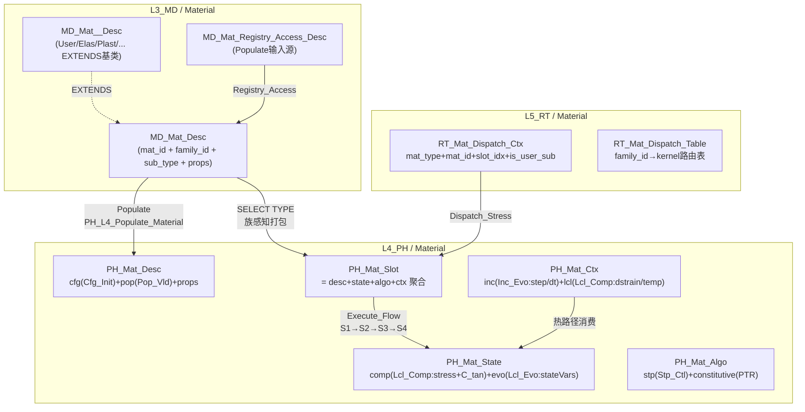
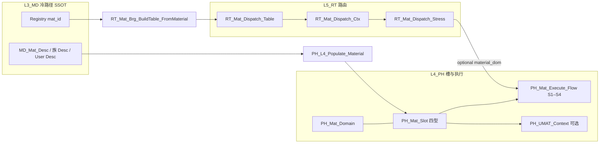
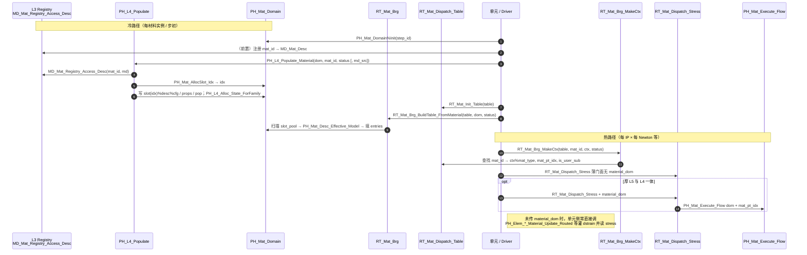
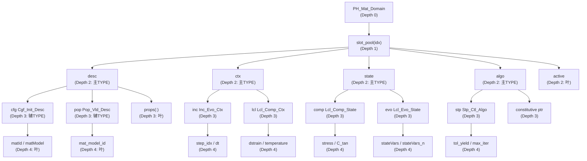
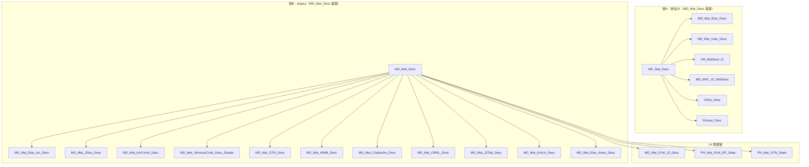
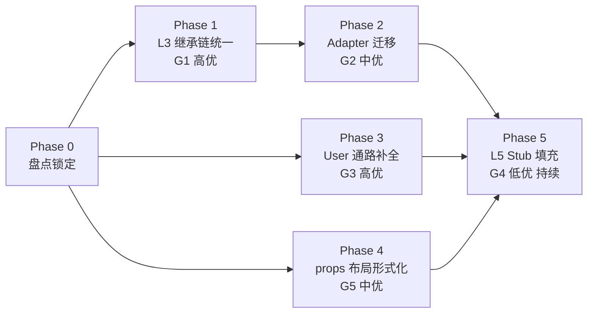

# 材料域：L3 / L4 / L5、四型、UMAT — 讨论沉淀（合订本）

**文档性质**：将对话中关于分层职责、四型与 Args、UMAT 与 UFC 映射、空间/时间尺度、动作后缀、以及若干实现注记**沉淀为可维护的单一入口**。  
**代码真源**（材料相关）：`ufc_core/L3_MD/Material/`、`ufc_core/L4_PH/Material/`、`ufc_core/L5_RT/Material/`、`ufc_core/L1_IF/Base/IF_Mat_Dispatch_Def.f90`。  
**报告 ID**：`REP-MAT-UMAT`；**命名与五场景（S0–S4）**：`REPORTS/REPORT_Naming_Quad_OnePager_FiveScenes.md` §1、§3。

**与另文关系**：本文件为**合订主文档**；若仅需速查表，可并列阅读 `UMAT_parameter_to_UFC_types_and_scale_taxonomy.md`（内容已吸收进附录 A–D，该文件可保留作短版或日后删除以避免双维护——以本合订本为准）。

---

## 功能模块完整性公式

**完整功能模块 = 数据结构（四型TYPE：Desc/State/Algo/Ctx + Args）+ 过程算法（空间维度 + 时间维度 + 动作维度）**

- **数据结构侧**：`MD_Mat_Desc/State/Algo/Ctx` + 辅TYPE（`Cfg_Init_Desc`, `Lcl_Comp_State`, `Lcl_Evo_State`, `Inc_Evo_Ctx`, `Lcl_Comp_Ctx`, `Stp_Ctl_Algo`, `constitutive` PTR） + `PH_Mat_Update_Arg`（层间结构化IO）
- **过程算法侧**：S-Pipeline（S1_FetchState → S2_Dispatch → S3_StressUpdate → S4_Tangent）为**动作维度**；`Stp_Ctl_Algo`（时间维度步控）+ 族级积分（空间维度 Gauss 点）共同驱动
- **两则关系**：`PH_Mat_Algo` 同时是四型并列中的第四槽（数据结构侧）和 S-Pipeline 的策略容器（过程算法侧，R-12）
- **完整域柱定义**：`MD_Mat_Def`(L3 SSOT) + `PH_Mat_Slot`(L4 运行时槽/S-Pipeline) + `RT_Mat_Dispatch`(L5 路由编排) = 三层完备的全贯通支柱
- **本节与 `Material_Procedure_Algorithm.md`** 互补对照：后者展开 `Algo TYPE` 字段细节、`constitutive` 过程指针抽象接口和 S-Pipeline 的步骤级时序

---

## 0. 文档目的与范围

| 涵盖 | 不涵盖 |
|------|--------|
| L3_MD / L4_PH / L5_RT 职责边界与常见误解 | 全仓库六层每一子域的枚举 |
| Desc / State / Algo / Ctx + Args 与材料槽、UMAT 的对应 | 非材料域（单元、接触、求解器）的完整四型展开（**截面轴** 见 **`Section_L3L4L5_four_type_synthesis.md`**） |
| UMAT 参数 → UFC 类型/字段、S/T 尺度、后缀动词；§7–§10（含 **§10.7–§10.14**）、**§11–§12**、**§13–§14**（跨域柱模板 + **UEL/单元域柱**）；`props`/布局合同、族级 Desc；**附录 F、附录 G**；**`Pillar_L3L4L5_CrossLayer_Design_Template.md`**；**截面正交维** **`Section_L3L4L5_four_type_synthesis.md`**（**ntens/应力态Populate**）；**一页填槽** **`OnePager_FourKind_MasterAux_Nesting.md` §3.1**（主/辅四型、总分、ABI_Flat）；**本文件 §2.5** 四型主/辅架构图解（L3/L4/L5 全景+mermaid） | 具体本构公式的推导；**完整 UEL 刚度组装**的公式推导 |

---

## 1. 三层职责总览（L3_MD / L4_PH / L5_RT）

### 1.1 一句话

- **L3_MD**：**模型数据与合同（SSOT）**——「是什么材料、参数从哪来」，偏冷路径、可注册、可与关键字/模型树对齐。  
- **L4_PH**：**物理与数值实现**——在材料点/槽上算 `Δε → σ、C_tan、SDV`，热路径、族核、`PH_Mat_Execute_Flow`（S1–S4）等。  
- **L5_RT**：**运行期路由与装配侧上下文**——**不写本构**；解决「当前 `mat_id` / 族标记 / `mat_pt_idx` 指向哪条槽、是否走用户子程序」，例如 `RT_Mat_Dispatch_Ctx`、`RT_Mat_Brg_BuildTable_FromMaterial`。

### 1.2 对照表

| 层 | 主要职责 | 典型产物或类型 |
|----|----------|----------------|
| **L3_MD** | 材料定义真源、注册访问 | `MD_Mat_Desc`、`MD_Mat_<Fam>_Desc`、`MD_Mat_Registry_Access_Desc` |
| **L4_PH** | 本构与材料槽四型、`Populate`、Execute | `PH_Mat_Slot`、`PH_Mat_Desc/Ctx/State/Algo`、`PH_L4_Populate_Material`、`PH_Mat_Reg`、`PH_Mat_Core` |
| **L5_RT** | 调度表、Dispatch 门面 | `RT_Mat_Dispatch_Table`、`RT_Mat_Dispatch_Ctx`、`RT_Mat_Core`（`RT_Mat_Dispatch_Stress` 等） |

### 1.3 重要澄清：L5 **不是**四型里的「Algo 主角」

- **`PH_Mat_Algo`**（如 `PH_Mat_Stp_Ctl_Algo`：容差、子增量方案、局部迭代上限）描述的是 **IP 本构算法控制**，仍在 **L4 槽**或族内核侧。  
- **`RT_Mat_Dispatch_Ctx`** 更接近 **路由上下文**（族枚举、`mat_id`、slot 索引、`is_user_sub`），**不承担**屈服面、回映迭代等 Algo 语义。  
- 实现上允许 **`RT_Mat_Dispatch_Stress(ctx, status, material_dom)`** 可选第三参：传入 **`PH_Mat_Domain`** 时转 **`PH_Mat_Execute_Flow`**，使 L5 门面与 L4 热路径显式衔接；未传第三参时保持「仅校验路由」的薄语义（兼容旧调用点）。

---

## 2. 「功能 = 四型 + Args + 主辅嵌套 + 过程」与 UFC 材料槽

### 2.1 用户给出的结构式（材料域解读）

> 功能 = 数据结构（四类 TYPE：Desc / State / Algo / Ctx + Args 封装签名）— 主/辅 TYPE 嵌套 + 算法过程（空间尺度 + 时间尺度 + 动作）。

在 **UFC 材料槽**上的落地：

| 构成 | UFC 材料域落点 |
|------|----------------|
| **Desc** | `PH_Mat_Desc`：`PH_Mat_Cfg_Init_Desc`、`PH_Mat_Pop_Vld_Desc`、`props(:)`；L3 侧 **`MD_Mat_Desc` / `MD_Mat_<Fam>_Desc`** 为 Populate 输入源 |
| **State** | `PH_Mat_State`：`PH_Mat_Lcl_Comp_State`（`stress`、`C_tan`）、`PH_Mat_Lcl_Evo_State`（`stateVars` / `stateVars_n`） |
| **Ctx** | `PH_Mat_Ctx`：`PH_Mat_Inc_Evo_Ctx`（步/增量/`dt`）、`PH_Mat_Lcl_Comp_Ctx`（`dstrain`、`temperature`、等效应变速率等） |
| **Algo** | `PH_Mat_Algo`：`PH_Mat_Stp_Ctl_Algo`、`constitutive` 过程指针；族级另有 `PH_Mat_<Fam>_Algo` 等 |
| **Args（签名束）** | 热路径核：**`PH_Mat_Update_Arg`**；结构化 Eval：**`PH_Mat_Eval_Arg`**（`PH_Mat_Lcl_Comp_ArgIn` / `ArgOut`）；跨层路由：**`RT_Mat_Dispatch_Ctx`**；UMAT ABI：**`PH_UMAT_Context`**（文档 **ABI_Flat**，见 **附录 G.0**） |

**主/辅嵌套**：主四型字段深度受「Depth 2 cap」等仓库约定约束，力学/演化量进 **`%comp` / `%evo`** 辅 TYPE，避免无限摊平。

**过程（动作）**：与 **附录 D** 后缀及 **附录 B/C** 时空尺度交叉——Populate 偏冷路径与 S0–S2、T1–T2；`Execute` / `_Core` 偏 **S3×(T2–T4)**。

### 2.5 四型主/辅架构图解（L3 / L4 / L5 全景）

> 下列与 **`PH_Mat_Def.f90`** / **`PH_Mat_Domain_Core.f90`**（AUTHORITY）、**`RT_Mat_Def.f90`**、**`MD_Mat_Def.f90`** 对齐；字段变更以 .f90 为准。

#### 2.5.1 L4 四型主 TYPE 与辅 TYPE 嵌套（`PH_Mat_Domain_Core.f90` AUTHORITY）

```text
PH_Mat_Desc (主·Desc)                     ← 冷 / Populate 后只读
├── cfg     : PH_Mat_Cfg_Init_Desc         ← 配置+初始化辅Desc
│   ├── mat_model_id / mat_family_id : INTEGER(i4)
│   ├── ntens / ndi / nshr           : INTEGER(i4)
│   └── section_type                  : INTEGER(i4)
├── pop     : PH_Mat_Pop_Vld_Desc          ← Populate+校验辅Desc
│   ├── n_sdv / n_props               : INTEGER(i4)
│   └── needs_validation              : LOGICAL
└── props(:): REAL(wp), ALLOCATABLE     ← 线性属性数组 (SSOT from L3)

PH_Mat_State (主·State)                   ← 温/热 / INOUT
├── comp   : PH_Mat_Lcl_Comp_State        ← 力学辅State
│   ├── stress(ntens)  : REAL(wp)         ← Voigt 应力
│   └── C_tan(ntens,ntens) : REAL(wp)     ← 一致切线
└── evo    : PH_Mat_Lcl_Evo_State         ← 演化辅State
    ├── stateVars(n_sdv)  : REAL(wp)      ← 用户/内部状态变量
    └── stateVars_n(n_sdv): REAL(wp)      ← 上一增量步 SDV (双写用)

PH_Mat_Algo (主·Algo)                     ← 冷/步级 / IN
├── stp    : PH_Mat_Stp_Ctl_Algo           ← 步控辅Algo
│   ├── tol_res / tol_eng              : REAL(wp)
│   ├── max_sub_incr                   : INTEGER(i4)
│   └── cutback_factor                 : REAL(wp)
└── constitutive : PROCEDURE(PH_Mat_Constitutive_Ifc), POINTER ← Procedure-as-Parameter

PH_Mat_Ctx (主·Ctx)                       ← 热 / INOUT
├── inc    : PH_Mat_Inc_Evo_Ctx            ← 增量+演化辅Ctx
│   ├── step_idx / incr_idx            : INTEGER(i4)
│   └── dt / total_time                 : REAL(wp)
└── lcl    : PH_Mat_Lcl_Comp_Ctx           ← 本地+计算辅Ctx
    ├── dstrain(ntens)  : REAL(wp)        ← 应变增量
    ├── temperature     : REAL(wp)        ← 当前温度
    └── eq_strain_rate  : REAL(wp)        ← 等效应变速率
```

#### 2.5.2 L5 四型主 TYPE（`RT_Mat_Def.f90` AUTHORITY）

```text
RT_Mat_Dispatch_Ctx (主·路由Ctx)          ← L5 不持本构四型，仅路由上下文
├── mat_type    : INTEGER(i4)              ← 11-family 标记 (PH_MAT_ELASTIC...PH_MAT_USER)
├── mat_id      : INTEGER(i4)              ← 材料实例 ID
├── slot_idx    : INTEGER(i4)              ← 槽池索引
├── is_user_sub : LOGICAL                  ← 是否走用户子程序
├── route_status: INTEGER(i4)             ← 路由查找结果
└── kernel_entry: TYPE(PH_Mat_Kernel_Entry) ← 族核入口

RT_Mat_Route_Entry (路由表条目)
├── family_id : INTEGER(i4)
└── kernel    : PROCEDURE, POINTER

RT_Mat_Dispatch_Table (调度表)
├── n_registered : INTEGER(i4)
└── entries(:)   : ALLOCATABLE
```

#### 2.5.3 L3 四型主 TYPE（`MD_Mat_Def.f90` AUTHORITY）

```text
MD_Mat_Desc (主·Desc)                     ← SSOT / 冷真源
├── mat_id / mat_family_id / sub_type : INTEGER(i4)
├── behavior / cmname                  : CHARACTER(*)
├── props(:) / nprops                  : 材料属性数组
└── nstatv                              : INTEGER(i4)

MD_Mat_<Fam>_Desc (族级扩展Desc, EXTENDS(MD_Mat_Desc))
├── MD_Mat_User_Desc                   ← 用户本构 (nprops/nstatv/cmname/布局ID)
├── MD_Mat_Elas_Desc                   ← 弹性族
├── MD_Mat_Plast_Desc                  ← 塑性族
├── ...                                ← 其余 11 族
└── (均 EXTENDS 基类，不另建平行四型)

MD_Mat_Registry_Access_Desc (注册表访问) ← Populate 输入源
```

#### 2.5.4 辅 TYPE 命名规范速查

| 层 | 主 TYPE | 辅 TYPE 命名模式 | 示例 |
|----|---------|-----------------|------|
| **L4** | `PH_Mat_Desc` | `PH_Mat_Cfg_<Sub>_Desc` / `PH_Mat_Pop_<Sub>_Desc` | `PH_Mat_Cfg_Init_Desc`、`PH_Mat_Pop_Vld_Desc` |
| **L4** | `PH_Mat_State` | `PH_Mat_Lcl_<Sub>_State` | `PH_Mat_Lcl_Comp_State`、`PH_Mat_Lcl_Evo_State` |
| **L4** | `PH_Mat_Ctx` | `PH_Mat_Inc_<Sub>_Ctx` / `PH_Mat_Lcl_<Sub>_Ctx` | `PH_Mat_Inc_Evo_Ctx`、`PH_Mat_Lcl_Comp_Ctx` |
| **L4** | `PH_Mat_Algo` | `PH_Mat_Stp_Ctl_Algo` + Procedure PTR | `PH_Mat_Stp_Ctl_Algo`、`constitutive` PTR |
| **L4** | `PH_Mat_Slot` | 槽 = 四型聚合 | `PH_Mat_Slot%dsc`/`%stt`/`%alg`/`%cxt` |
| **L5** | `RT_Mat_Dispatch_Ctx` | 扁平路由字段 | mat_type+mat_id+slot_idx |
| **L3** | `MD_Mat_Desc` | `MD_Mat_<Fam>_Desc` (EXTENDS) | `MD_Mat_User_Desc`、`MD_Mat_Elas_Desc` |

#### 2.5.5 扩展四型与 ABI 镜像

```text
PH_UMAT_Context (ABI Mirror)              ← 文档名 ABI_Flat, ≠ PH_Mat_Ctx
├── stress(ntens) / statev(nstatv) / ddsdde(ntens,ntens)  ← UMAT 形参视图
├── stran(ntens) / dstran(ntens)        ← 应变/应变增量
├── time(2) / dtime                     ← 时间
├── props(nprops) / nprops / ndi / nshr / ntens  ← 属性+维数
├── coords(3) / drot(3,3) / dfgrd0(3,3) / dfgrd1(3,3)  ← 几何
├── pnewdt                              ← 步长调整
├── noel / npt / layer / kspt           ← 编号
└── cmname                               ← 材料名
```

> **文档惯例**：`PH_UMAT_Context`（代码名）= **ABI_Flat**（文档名），仅为与外部子程序形参对齐的镜像/调用帧；**≠** 四型主 `PH_Mat_Ctx`（热路径工作区）。见 **附录 G.0**。

#### 2.5.6 三层四型嵌套深度对照（mermaid）



---

## 3. Abaqus UMAT 在求解链路中的位置

### 3.1 与求解器一致的调用链（概念）

单元在积分点组装输入：**总应变/应变增量、时间、温度、变形梯度等** → 本构子程序读入 **步初 `stress` / `statev`**，用 **`props`** 与 **历史变量** 更新为 **步末 `stress` / `statev`**，并给出 **`ddsdde`** 供整体 Newton 使用。

### 3.2 与 UFC L4 热路径的对应（语义）

| 求解器/UMAT 概念 | UFC L4（材料） |
|------------------|----------------|
| 一次材料点更新 | `PH_Mat_Execute_Flow`：S1 取槽 → S2 族合法 → S3 应力更新 → S4 切线 → 写回槽 |
| 扁平 `props` | `PH_Mat_Desc%props`（由 `PH_L4_Populate_Material` 等从 L3 灌入） |
| `stress` / `statev` / `ddsdde` | `state%comp%stress`、`state%evo%stateVars*`、`state%comp%C_tan`；核侧 **`PH_Mat_Update_Arg`** |
| 仅切线、不重复整步应力 | `PH_Mat_Execute_Tangent_Flow`（S1→S2→S4），与「仅 `DDSDDE`」类调用同阶 |

### 3.3 UMAT 参数 → UFC 类型：见附录 A；**跨层权威与重叠**见附录 F；**四类 × 主/辅/壳 × L3/L4** 见附录 G（**G.0**：`PH_UMAT_Context` 文档名 **ABI_Flat**，避免与四型 **Ctx** 混读）

---

## 4. 内置本构与用户 UMAT 能否「统一」

**结论（工程上）**：

- **语义可统一**：均为 **(Desc, Ctx_n, State_n) → (State_{n+1}, C_alg)**；路由上均可挂在 **同一族枚举 + 注册核**。  
- **实现不必强行同一扁平签名**：内置可走 **强类型族 `*_Desc` + `PH_Mat_<Fam>_Core`**；用户材料可走 **`PH_MAT_USER`**（同值弃用别名 `PH_MAT_USER_UMAT`），在 L4 用 **`PH_UMAT_Context`** 对齐 Abaqus ABI 再调钩子/外部子程序。  
- **真源**：物理参数仍以 **L3→Populate→`desc%props`** 与合同为准；`PH_UMAT_Context` 为工作区镜像（见 `PH_UMAT_Def.f90` 头注释 W1）。

---

## 5. 对先前问题的正式答复

### Q1：L3 是否以 Desc/Algo 为主，L4 贯通，L5 是否以 Algo 为主？

- **L3**：**Desc 为主**（注册、族/子类型、`props` 表）；若出现「Algo」字样，多指 **分析过程/库级策略**，与 **IP 上 `PH_Mat_Algo`** 粒度不同，不宜混为一谈。  
- **L4**：四型 **齐全**；**Populate** 贯通 L3→L4 Desc；**Execute** 贯通 Ctx/State 与族核；**Args** 在层间/Harness 按 Principle #14 使用（非每个子程序强行套 Arg）。  
- **L5**：**不以四型 Algo 为主**；以 **路由表 + Dispatch 上下文** 为主，本构 Algo 仍在 **L4**。

### Q2：过程按空间、时间、动作分类；各层动作能否分类？

**可以**，并与仓库动词习惯一致：

- **空间**：见 **附录 B（S0–S5）**——从模型到 Voigt 分量。  
- **时间**：见 **附录 C（T0–T5）**——从作业到材料子增量。  
- **动作**：见 **附录 D**——`_Def` / `_Core` / `_Populate` / `_Dispatch` 等与 **S×T** 的交叉说明。

**各层典型动作（归纳）**：

| 层 | 典型动作动词 |
|----|----------------|
| L3 | 注册、校验、合同对齐、为 Populate 提供 Desc |
| L4 | `Populate`、`Validate`、`Execute`（S1–S4）、`Eval`、族 `_Core`、注册 `_Reg` |
| L5 | `Init_Table`、`Register_Route`、`MakeCtx`、`Dispatch_Stress` / `Dispatch_Tangent`、`WriteBackHook` |

---

## 6. 实施侧补充（来自 Material 调度与槽一致性改造的讨论）

以下内容便于读代码时对照，**非**规范全文：

| 主题 | 要点 |
|------|------|
| **L5 → L4 执行** | `RT_Mat_Dispatch_Stress(ctx, status, material_dom)` 可选传入 **`PH_Mat_Domain`**，内部调用 **`PH_Mat_Execute_Flow`**；`RT_Mat_Dispatch_Tangent(..., material_dom)` 调用 **`PH_Mat_Execute_Tangent_Flow`**（避免重复 S3）。 |
| **SDV 双写** | `PH_Mat_State_DualWrite_StateVars` 除写入 **`stateVars`** 外，同步 **`stateVars_n`**，利于下一增量步初 `sdv_n` 与 `stateVars` 一致。 |
| **Populate** | `PH_L4_Populate_Material`：`MD_Mat_Registry_Access_Desc` + `SELECT TYPE` 族感知打包、`PH_L4_Alloc_State_ForFamily` 等；`md_src` 可选参数保留给调用方签名兼容。 |
| **J2 试点** | `PH_Mat_Reg` 中 `PH_Kern_PlJ2_update` 在 `mat_model_id == MAT_PLAST_J2_ISO` 时走 **`PH_J2_ComputeStress`**；测试见 `tests/L5_RT/RT_Mat_Test.f90` 等。 |

---

## 7. `props` 形式统一与「40 种材料」的语义表问题（讨论沉淀）

### 7.1 目标：形式统一，而不是「全局下标 1 永远是 E」

- **统一 `props(:)` + `nprops` + `mat_model_id`（+ 族/子类型）** 解决的是 **边界形状与推广成本**：热路径、UMAT、Harness 只认一种线性格式。  
- **不能**要求 40 种本构共用**同一张物理下标表**（第 3 个分量在模型 A 是 `σ_y`，在模型 B 可能是别的量）。混乱来自 **「谁解释每个下标」**，而非来自「用不用数组」。  
- **推荐**：**一种数组容器** + **按 `mat_model_id`（或 family+sub_type）一行的布局合同**（机器可读、可版本化）——40 种材料对应 **40 行布局定义**，而不是 40 套互不兼容的内存类型或 40 份散落自然语言。

### 7.2 与关键字解析的关系

在 **关键字 / 注释 → 规范中间表示（族 + sub_type + 命名字段）→ 按布局写入 `props`**** 之间加一层归一化**，词义偏差收口在 L3 侧，热路径只认 **`props` + 模型 ID**。

### 7.3 与「双轨」Desc 的关系（不必二选一）

| 轨道 | 作用 |
|------|------|
| **族级强类型 `MD_Mat_<Fam>_Desc`** | 校验、默认值、族特有字段、与关键字映射 |
| **线性格式 `MD_Mat_Desc%props` + 布局合同** | 与 UMAT、注册核、跨层拷贝对齐 |

即：**不是用 `props` 取代 Desc**，而是 **Desc 为 SSOT，对外/对核可 Flatten 为 `props`**。

---

## 8. 是否还要族级四型？是否做 `MD_Mat_UMAT_*` + `EXTENDS` + 指针别名？（讨论沉淀）

### 8.1 是否还要 `MD_Mat_XXX_(Desc/State/Algo/Ctx)`？

- **不必**为「每一种微观本构名字」各做一整套四型（否则类型爆炸）。  
- **需要**按 **族 / 力学分支**（弹、塑、超弹、损伤、…）维护 **扩展 Desc**（及按需的 State/Algo/Ctx），**子类型**用 **`sub_type` / `mat_model_id` + `props` 布局** 区分。  
- **USER/UMAT 专用**：一条 **`MD_Mat_User_Desc`**（或同义命名 **`MD_Mat_UMAT_Desc`**）**`EXTENDS(MD_Mat_Desc)`** 即可承载 `props/nprops/nstatv/cmname/布局 ID` 等，**不必**让弹性、超弹也假装成完整 UMAT 四型。

### 8.1a `MD_Mat_User_Desc` 与 `MD_Mat_UMAT_Desc`（命名）

- **语义等同**：二者都表示「用户本构 / UMAT 侧在 L3 的扩展 Desc」；仓库内 **只须保留一个** `TYPE` 名作为代码真源，另一名称仅在文档或迁移说明中作**同义项**引用，避免双类型并行维护。

### 8.1b 路由枚举：`PH_MAT_USER` 与 `PH_MAT_USER_UMAT`

- **推荐主名 `PH_MAT_USER`**（= 99）：隐式用户材料在 L4 槽上的**族路由标记**；`UMAT` 与 `USER` 语义重复，不宜再作为主标识符。
- **`PH_MAT_USER_UMAT`** 在 `PH_Mat_Enum.f90` 中为 **同值弃用别名**（`PARAMETER :: PH_MAT_USER_UMAT = PH_MAT_USER`），供旧调用点逐步迁移。
- **显式离散模型 ID** 仍用 **`MAT_USER_UMAT` / `MAT_USER_VUMAT`**（`PH_Mat_Reg` / `MD_Mat_Ids`），与上者分工不同，勿混读。

### 8.1c **不推荐「双四型」**（L3 与 L4 各建一套完整 UMAT 四型）

- **不推荐**：在 L3 再定义一整套 **`PH_Mat_UMAT_Desc/State/Algo/Ctx`（或镜像式 `MD_Mat_UMAT_*` 四型全集）**，同时又要求 L4 材料槽 **`PH_Mat_*` 四型** 再复制一套「仅服务 UMAT」的平行四型主源（双主、双迁移、Populate/Execute 两处真源）。
- **推荐**：**L3 一支 User/UMAT 扩展 Desc**（`props`/`nprops`/`nstatv`/布局 ID 真源）+ **L4 通用材料槽四型**（`PH_Mat_Desc/Ctx/State/Algo`）+ **`PH_UMAT_Context` 作为 ABI 对齐工作区**（`PH_UMAT_Def.f90`）；本构状态与切线的**步内权威**仍在槽 `state`，UMAT 形参仅为调用期视图（与附录 F「分期真源」一致）。

### 8.2 `E` 指针指向 `props(1)` 这类设计？

- **`TYPE, EXTENDS(MD_Mat_Desc)` + 仅 `props` 真源** —— **推荐**。  
- **`REAL, POINTER :: E => props(1)`** 在 Desc 内做别名 —— **一般不推荐**：`props` 重分配或布局变更时别名易失效；双写真源；调试成本高。更干净的是 **布局表下标常量** 或 **`PURE` 访问函数** 读 `props(idx_E)`。

### 8.3 多态

Fortran 以 **`EXTENDS` + `SELECT TYPE`** 为主流；材料侧常见模式是 **`MD_Mat_Desc` 基类 + 少数族扩展 + User 一支**，而非为每个 UMAT 建子类型。

### 8.4 完整示例与改造步骤（USER / UMAT 路径）

以下按 **与仓库模块名对齐** 的流水线描述；实现细节以 `ufc_core/L3_MD/Material/User/`、`PH_L4_Populate.f90`、`PH_UMAT_Def.f90`、`RT_Mat_Brg.f90` 为准。

#### 8.4.1 端到端示例（概念主线）

1. **关键字 / 输入解析** → 填充 L3 **`TYPE(MD_Mat_User_Desc), EXTENDS(MD_Mat_Desc)`**（或已选定的同义类型名）：`nprops`、`nstatv`、`props(:)`、可选 `layout_id` / `cmname`；`class_id = MD_MAT_CATEGORY_US`。
2. **`PH_MapL3MatTypeToL4`**（`PH_L4_L3MatContract`）→ **`ph_marker = PH_MAT_USER`**；`PH_L4_Populate_Material`（或桥接）在 **`CASE (PH_MAT_USER)`**（或按 L3 `SELECT TYPE`）分支：分配 **`slot%desc%props`**，拷贝 L3 `props`，设置 **`cfg%matModel`**（如 `MAT_USER_UMAT`）、**`pop`** 校验维度。
3. **`PH_Mat_AllocSlot_Idx`** → **`PH_Mat_GetState_Idx` / `SetState`**：保证 **`stress(ntens)`**、**`stateVars(nstatv)`**（及按需 **`C_tan`**）已分配，与 UMAT 约定一致。
4. **装配 `PH_UMAT_Context`**：从槽 **`desc/ctx/state`** 与单元侧 **`ndir`/`nshr`/`ntens`**、**`dstran`** 等填入 **`PH_UMAT_Def`** 中与 Abaqus UMAT 对应的字段（子集亦可，未用字段保持约定初值）。
5. **调用本构**：通过 **`PH_UMAT_Intf`** 或注册过程调用用户 **`UMAT`**；将 **`stress` / `statev` / `ddsdde`** 写回槽（**`PH_Mat_State_DualWrite_Stress6`** 等或直写 **`%comp` / `%evo`**）。
6. **L5**：**`RT_Mat_Brg`** 建表 **`ctx%mat_type = PH_MAT_USER`**（显式动态用 **`MAT_USER_UMAT`**）；**`is_user_sub = .TRUE.`**；**`RT_Mat_Dispatch_Stress(..., material_dom)`** 可选第三参时，内置族可走 **`PH_Mat_Execute_Flow`**，用户核仍以 L4 钩子为主（与 §1.3 一致）。

#### 8.4.2 改造步骤（可勾选清单）

| 步 | 动作 |
|----|------|
| 1 | **盘点**：L3 User 支 **`props` 布局**、**`nstatv`**、与 **`PH_UMAT_Context`** / 附录 A、F 的字段对应表。 |
| 2 | **L3**：在 **单一** `MD_Mat_User_Desc`（或等价名）上增字段；**不**新增平行 **`PH_Mat_UMAT_*` 四型族** 作为第二主源。 |
| 3 | **Populate**：`PH_L4_Populate` / 桥接增加 **`PH_MAT_USER`**（或 `MD_MAT_CATEGORY_US`）分支：灌 **`desc%props`**、**`matModel`**、按需 **`ALLOCATE`** **`state%evo%stateVars`**。 |
| 4 | **L4 适配**：小模块「**槽 → `PH_UMAT_Context`**」只搬数、不做本构；单元线程把 **`ntens`/`dstran`** 等接入。 |
| 5 | **绑定**：**`PH_UMAT_Intf`** → 实际 **`SUBROUTINE UMAT(...)`** 或桩，错误经 **`ErrorStatusType`** 返回。 |
| 6 | **测试**：**`PH_MapL3MatTypeToL4`** → Populate →（可选）**`RT_Mat_Dispatch_Stress`** + 域 → 断言 **非零 `stress`/`ddsdde`** 或金值对比。 |
| 7 | **收尾**：对外文档与 **新代码** 统一写 **`PH_MAT_USER`**；旧符号 **`PH_MAT_USER_UMAT`** 仅保留为 **枚举别名** 直至无引用。 |

---

## 9. 完整分类：体系是否按层「各设计一套」？UMAT 参数在 L3/L4/L5 是否重叠？

### 9.1 分类体系要不要按 L3/L4/L5 各做一套？

**不要。** 一套 **正交维度** 即可，**层只决定「谁持有真源、谁拷贝、谁路由」**，不必为每层重新定义「什么是 Desc」：

| 分类维度 | 说明 |
|----------|------|
| **四型角色** | Desc / State / Algo / Ctx / Args（边界束） |
| **可变性** | 只读（步内） vs 本步迭代中读写 vs 步末提交 |
| **时空锚点** | 附录 B/C 的 S、T |
| **管道阶段** | 定义（冷）→ Populate → IP 热路径 →（可选）WriteBack |

**层**在总表里体现为 **「权威层 / 参与层」列**，而不是另起三套分类名词。

### 9.2 「重叠」的精确定义

- **不是**指 L3 与 L4 在同一时刻对同一缓冲做两套互斥主源（若那样设计则错误）。  
- **是指**：同一 **逻辑量**（如 `stress`、`props`）在流水线 **不同阶段、不同容器** 出现 —— **分期真源（staging）**：定义与归档在 L3、增量迭代在 L4 槽、L5 仅路由元数据。  
- **L5**：**不持有** `stress`/`statev`/`props` 大数组本体（`RT_Mat_Dispatch_Ctx` 仅 `mat_type`、`mat_id`、`mat_pt_idx` 等），与 UMAT 大批形参 **无数组级重叠**。

### 9.3 UMAT 形参全量 × 层 × 四型 × 重叠 — 总表（附录 F 摘要）

下表为 **标准 UMAT 接口** 全量形参在 **材料域 L3/L4/L5** 下的分工（与单元/求解器其它层耦合略）。**「重叠」**列说明层间关系。

---

## 10. 通用机制：L3 → L4 → L5（数据结构 + 过程算法）

本节把材料域在 **模型装配（冷）** 与 **积分点本构（热）** 两阶段的 **通用流水线** 固定下来：每层 **持什么结构**、**跑什么过程**、**层间交界面** 是什么。实现锚点仍以 `L3_MD/Material`、`L4_PH/Material`、`L5_RT/Material` 为准。

### 10.1 机制要满足的约束（设计不变量）

| 不变量 | 含义 |
|--------|------|
| **SSOT 分层** | **L3** 持「材料定义」真源（族/class、离散模型 ID、`props` 布局合同）；**L4 槽** 持「本步 IP 上可算的状态」真源；**L5** 持「这次调用连到哪条槽」的路由元数据，**不**持 Voigt 大数组。 |
| **冷 / 热分离** | **Populate** 只在冷路径把 L3 → L4 **拷贝/分配** 一次（或步初刷新）；热路径 **不** 回写 L3 `props` 作为迭代主源。 |
| **路由 ≠ 本构** | L5 **校验/解析** `mat_type`、`mat_id`、`mat_pt_idx`、`is_user_sub`；**应力更新与切线**在 L4（`PH_Mat_Execute_Flow` / 用户钩子 / `PH_UMAT_Context`）。 |
| **四型闭合在槽** | IP 上 **Desc/Ctx/State/Algo** 的权威在 **`PH_Mat_Slot`**；跨层边界用 **`*_Arg` / `PH_Mat_Update_Arg` / `PH_UMAT_Context`** 按 Principle #14 与域合同裁剪，而非每层再造一套四型名词。 |

### 10.2 按层：核心数据结构（材料域）

| 层 | 容器 / 枢纽 | 本构相关核心类型（摘） | 角色 |
|----|-------------|------------------------|------|
| **L3** | `MD_L3_LayerContainer`（或等价层容器） | **`MD_Mat_Desc`**；族扩展 **`MD_Mat_<Fam>_Desc`** / **`MD_Mat_User_Desc`**；**`MD_Mat_Registry_Access_*`**；**`class_id`**、**`mat_model_id`（离散 `MAT_*`）** | 冷数据、注册、与输入deck/关键字对齐 |
| **L4** | **`PH_Mat_Domain`** | **`slot_pool(:)`** 元素为 **`PH_Mat_Slot`**：**`desc`**（`cfg`/`pop`/`props`）、**`ctx`**（`inc`/`lcl`）、**`state`**（`comp`/`evo`）、**`algo`**；**`PH_Mat_*_Arg`** 束；**`PH_Mat_Update_Arg`**；用户路径 **`PH_UMAT_Context`** | IP 四型 + 执行面 |
| **L5** | **`RT_Mat_Dispatch_Table`**（按 `mat_id` 等建表） | **`RT_Mat_Dispatch_Ctx`**：`mat_type`（**`PH_MAT_*`**）、`mat_id`、`mat_pt_idx`、**`is_user_sub`** 等 | 运行期路由；可选触发 L4 Execute |

**层间映射（一次性合同）**：**`PH_MapL3MatTypeToL4(class_id)`** → **`PH_MAT_*`** 族标记；**`PH_MapL3ClassToDefaultMatId`** → 默认离散 **`MAT_*`**（与 **`PH_Mat_Reg`** 对齐）。

### 10.3 冷路径过程算法（定义 → 注册 → Populate）

**阶段目标**：为每个将参与求积的材料点预留 **槽位**，并把 L3 定义 **灌入** `PH_Mat_Slot%desc`（及按需 `state/algo` 维数）。

```
算法 ColdPath_Material(IP 或预扫描得到的 material 实例列表)
  1. [L3] 解析 / 构造 MD_Mat_*：class_id、mat_model_id、props、nstatv 合同
  2. [L3] 写入注册表（若使用 Registry）：保证 mat_id ↔ L3 描述可查询
  3. [L4] PH_Mat_Domain%Init(step_id) → 分配 slot_pool
  4. FOR 每个材料点索引 mat_pt_idx
       4.1 [L4] PH_Mat_AllocSlot_Idx(dom, mat_pt_idx, status)  // 或等价分配
       4.2 [L4] ph_family ← PH_MapL3MatTypeToL4(md.class_id)
       4.3 [L4] PH_L4_Populate_Material(…):  // 冷路径桥
             - 写 slot%desc%cfg（matId、matModel = MAT_* 或 USER）
             - ALLOC/COPY slot%desc%props ← L3 props
             - 校验 slot%desc%pop；按需 ALLOC state%evo%stateVars、comp%stress、comp%C_tan
             - 写 slot%desc%cfg 中族路由所需的 Effective_Model / sub_type（若适用）
       4.4 [L5] RT_Mat_Brg_BuildTable_FromMaterial(…)  // 建 RT_Mat_Dispatch_Table 行：
             - ctx%mat_type = ph_family; ctx%mat_id = …; ctx%mat_pt_idx = mat_pt_idx
             - is_user_sub ← (ph_family == PH_MAT_USER 或 PH_MAT_USER_VUMAT)
  5. 返回：dom、table 就绪；热路径只读 table + 通过 mat_pt_idx 访问 slot_pool(mat_pt_idx)
```

**失败语义**：任一步 `status /= OK` → 不上热路径；Populate 与建表 **同事务** 或明确顺序（先槽后表），避免「表指向未灌槽」。

### 10.4 热路径过程算法（单次 IP 本构调用）

**阶段目标**：在 **T2–T3**（及材料内 **T4**）上，对 **S3** 材料点完成 **应变增量进、应力与切线出**（及 SDV 更新）。

```
算法 HotPath_Constitutive(mat_id, mat_pt_idx, dstrain, … 来自单元)
  1. [L5] 取 RT_Mat_Dispatch_Table(mat_id) → RT_Mat_Dispatch_Ctx ctx
  2. [L5] RT_Mat_Dispatch_Stress(ctx, status [, material_dom])
       2a. 校验 ctx%mat_type 合法（PH_Mat_Dispatch_Stress）
       2b. 若 present(material_dom) 且 非 USER 快捷路径：
             → PH_Mat_Execute_Flow(slot, …)  // 见 10.4.1
       2c. 若 USER / 或未传 material_dom：仅路由；单元或适配层调 UMAT 钩子 + PH_UMAT_Context
  3. [L4] PH_Mat_Execute_Flow（S1–S4 骨架）：
       S1  FetchState   : 从 slot 取出 stress/statev/C_tan 等到 PH_Mat_Update_Arg 或局部缓冲
       S2  Dispatch     : 按 mat_type + Effective_Model 选核（PH_Mat_Reg / 族 Core）
       S3  StressUpdate: 核内更新 stress、statev（权威写在 slot.state）
       S4  Tangent      : 写 C_tan；或 PH_Mat_Execute_Tangent_Flow 走 S1→S2→S4
  4. [单元] 读回 slot%state → 组装单元内力 / 刚度
```

#### 10.4.1 `PH_Mat_Execute_Flow` 与 L5 门面的关系

- **薄 L5**：只调用 **`RT_Mat_Dispatch_Stress(ctx, status)`** → **族合法校验**，本构留在单元直接调 L4（旧调用兼容）。
- **厚 L5**：**`RT_Mat_Dispatch_Stress(ctx, status, material_dom)`** → 在 **`ctx%mat_pt_idx`** 合法时 **转调 `PH_Mat_Execute_Flow`**，把 **「路由 + 执行」** 收束到同一套测试与 Harness。

### 10.5 变体分支（同机制、不同填法）

| 分支 | 数据结构要点 | 算法要点 |
|------|--------------|----------|
| **内置族核** | `MAT_*` + `PH_MAT_*`；`PH_Mat_Desc_Effective_Model` | S2 选 **`PH_Mat_<Fam>_Core`**；不走 `PH_UMAT_Context` 或使用子集 |
| **USER / UMAT** | L3 **`MD_Mat_User_Desc`**；L4 槽四型 + **`PH_UMAT_Context`** | Populate 同冷路径；热路径 **槽 → Context → UMAT → 写回槽**（§8.4） |
| **仅切线** | 同槽 | **`PH_Mat_Execute_Tangent_Flow`**（S1→S2→S4），避免重复 S3 |
| **步末写回 L3** | 可选 L3 结果库 | **WriteBack** 在收敛后 T3 末；**不**与步内 L4 权威竞争（分期真源，见 §9.2） |

### 10.6 数据流总图（材料域）



**读图顺序**：自上而下业务为 **先冷后热**；横向 **L3→L4** 经 Populate，**L4↔L5** 经建表与 `mat_pt_idx`，**热环**在 **slot ↔ Execute / UMAT** 闭合。

### 10.7 泳道时序图（冷装配 vs 热本构）

下列 **sequenceDiagram** 把「谁先调用谁」固定下来；模块名与仓库一致。



### 10.8 冷路径：逐步清单与检查点

| 步骤 | 动作 | 检查点（失败则停） |
|------|------|-------------------|
| C1 | **`PH_Mat_Domain%Init(step_id, status)`** | `dom%initialized`、`ALLOCATED(dom%slot_pool)` |
| C2 | L3：**`MD_Mat_Registry_Access_Desc`** 可解析 `mat_id` | `ASSOCIATED(md)`、`status=OK` |
| C3 | **`PH_L4_Populate_Material(ph_dom, mat_id, status)`**（内部 **`PH_Mat_AllocSlot_Idx`**） | 返回 `idx`；`slot_pool(idx)%active` 最终为 **`.TRUE.`** |
| C4 | 核对 **`desc%cfg%matId`**、**`desc%cfg%matModel`**（`PH_MapL3MatTypeToL4(class_id)`）、**`desc%props`** | `SIZE(props)` 与合同一致 |
| C5 | 核对 **`state%comp` / `%evo`** 已按族分配 | 弹塑等有 `stateVars` 维数；弹线有 `C_tan` |
| C6 | **`RT_Mat_Init_Table(table, status)`** | `table%initialized` |
| C7 | **`RT_Mat_Brg_BuildTable_FromMaterial(table, material_dom, status)`** | `table%n_entries` 与活跃槽一致；无 **table full** |
| C8 | （可选）对表做一次 **`RT_Mat_Brg_MakeCtx`** 抽检 | `ctx%mat_pt_idx` 指向已灌槽 |

### 10.9 热路径：逐步清单与两种 L5 门面

| 步骤 | 动作 | 说明 |
|------|------|------|
| H1 | **`RT_Mat_Brg_MakeCtx(table, mat_id, ctx, status)`** | 得到 **`ctx%mat_type`、`ctx%mat_pt_idx`、`ctx%is_user_sub`** |
| H2 | 单元把 **`dstrain`、`dt`、`temp`** 等写入 **`dom%slot_pool(mat_pt_idx)%ctx`**（按项目约定） | 与 **`PH_Mat_Lcl_Comp_Ctx`** / `Update_args` 对齐 |
| H3a | **`CALL RT_Mat_Dispatch_Stress(ctx, status)`**（无第三参） | **仅校验** `mat_type`、`mat_pt_idx`；**不调用** `PH_Mat_Execute_Flow` |
| H3b | **`CALL RT_Mat_Dispatch_Stress(ctx, status, material_dom)`** | 校验槽 active 后 **`PH_Mat_Execute_Flow(material_dom, ctx%mat_pt_idx, status)`** |
| H4 | 从 **`slot%state%comp%stress`**、**`%C_tan`** 读回应力与切线 | 供单元 B 阵与刚度组装 |

实现锚点（厚 L5）：`RT_Mat_Core.f90` 中 **`RT_Mat_Dispatch_Stress`** 在 **`PRESENT(material_dom)`** 时直接 **`CALL PH_Mat_Execute_Flow`**。

### 10.10 示例代码 A：手工灌槽 + 建表 + 薄 Dispatch（摘自测试思路）

与 **`tests/L5_RT/RT_Mat_Test.f90`** 中 **`test_populated_material_domain_bridge`** 一致：**不经过** `PH_L4_Populate_Material`，用于理解 **槽字段与 L5 表** 的最小闭环。

```fortran
! 最小片段：USE 略；假定已 USE PH_Mat_Def, RT_Mat_Def, RT_Mat_Core, RT_Mat_Brg, …
TYPE(PH_Mat_Domain)         :: material_dom
TYPE(RT_Mat_Dispatch_Table) :: table
TYPE(RT_Mat_Dispatch_Ctx)   :: ctx
TYPE(ErrorStatusType)       :: status
INTEGER(i4) :: mat_pt_idx

CALL material_dom%Init(1_i4, status)
CALL RT_Mat_Init_Table(table, status)

CALL PH_Mat_AllocSlot_Idx(material_dom, mat_pt_idx, status)
material_dom%slot_pool(mat_pt_idx)%desc%cfg%matId     = 7_i4
material_dom%slot_pool(mat_pt_idx)%desc%cfg%matModel  = PH_MAT_ELASTIC
material_dom%slot_pool(mat_pt_idx)%desc%pop%mat_model_id = 101_i4
ALLOCATE(material_dom%slot_pool(mat_pt_idx)%desc%props(2))
material_dom%slot_pool(mat_pt_idx)%desc%props(1) = 210.0E9_wp
material_dom%slot_pool(mat_pt_idx)%desc%props(2) = 0.30_wp
material_dom%slot_pool(mat_pt_idx)%active = .TRUE.

CALL RT_Mat_Brg_BuildTable_FromMaterial(table, material_dom, status)
CALL RT_Mat_Brg_MakeCtx(table, 7_i4, ctx, status)
CALL RT_Mat_Dispatch_Stress(ctx, status)  ! 薄：路由合法即 OK
! 应力更新由单元路由例程完成，例如：
! CALL PH_Elem_MatRoute_Elastic3D(ctx, material_dom%slot_pool(mat_pt_idx), dstrain, …)
```

### 10.11 示例代码 B：经 Registry 的 Populate（生产路径骨架）

与 **`PH_L4_Populate.f90`** 中 **`PH_L4_Populate_Material`** 对齐：**`mat_id` → Registry → 自动写 `cfg/matModel/props` → 按族分配 state**。

```fortran
TYPE(PH_Mat_Domain)         :: ph_dom
TYPE(ErrorStatusType)       :: status
INTEGER(i4), PARAMETER :: my_mat_id = 42_i4

CALL ph_dom%Init(1_i4, status)
IF (status%status_code /= IF_STATUS_OK) RETURN

! 前置：L3 已将 CLASS(MD_Mat_Desc) 注册到 mat_id=my_mat_id（如 MD_Mat_Elas_Desc 等）
CALL PH_L4_Populate_Material(ph_dom, my_mat_id, status)
IF (status%status_code /= IF_STATUS_OK) RETURN

! 后续：RT_Mat_Init_Table → RT_Mat_Brg_BuildTable_FromMaterial(table, ph_dom, status)
```

内部顺序（便于单步调试）可记为：**`MD_Mat_Registry_Access_Desc` → `PH_Mat_AllocSlot_Idx` → 写 `cfg%matId` / `cfg%matModel`（`PH_MapL3MatTypeToL4`）→ 拷贝 `props` → `PH_L4_Pack_Props_From_L3` → `PH_L4_Alloc_State_ForFamily` → `active=.TRUE.`**。

### 10.12 示例代码 C：厚 L5 —— 一次调用直达 `PH_Mat_Execute_Flow`

当 **`RT_Mat_Dispatch_Stress`** 传入 **`material_dom`** 时，L5 在完成索引校验后 **直接调用 L4 四步流水线**（与单元是否另行写 `ctx%lcl` 取决于上游是否已灌好槽）。

```fortran
TYPE(RT_Mat_Dispatch_Ctx)   :: ctx
TYPE(ErrorStatusType)       :: status

CALL RT_Mat_Brg_MakeCtx(table, mat_id, ctx, status)
IF (status%status_code /= IF_STATUS_OK) RETURN

CALL RT_Mat_Dispatch_Stress(ctx, status, material_dom)
! status / ctx%route_status 反映 PH_Mat_Execute_Flow 是否成功
```

### 10.13 热路径分支流程图（薄 vs 厚 vs USER）

```mermaid
flowchart TD
  A[MakeCtx 得到 ctx] --> B{第三参 material_dom 传入?}
  B -->|否| C[RT_Mat_Dispatch_Stress 薄门面]
  C --> D[仅校验 mat_type / mat_pt_idx]
  D --> E[单元或 PH_Elem_* 灌 ctx 并调族核 / USER 钩子]
  B -->|是| F[RT_Mat_Dispatch_Stress 厚门面]
  F --> G[PH_Mat_Execute_Flow(dom, ctx%mat_pt_idx)]
  G --> H[slot.state 更新]
  E --> U{ctx%is_user_sub?}
  U -->|是| J[典型：PH_UMAT_Context + UMAT 写回槽]
  U -->|否| K[典型：族 Registered Core / Execute_Flow 已在厚路径执行]
```

**阅读提示**：**`is_user_sub`** 由 **`RT_Mat_Brg_BuildTable_FromMaterial`** 根据 **`PH_MAT_USER` / `PH_MAT_USER_VUMAT`** 设置；**USER 路径**仍可在单元侧选择 **薄 Dispatch + UMAT**，或在注册好通用桩后走 **厚 Dispatch + `PH_Mat_Execute_Flow`**（以当前仓库实现为准）。完整 USER 装配清单见 **§8.4**。

### 10.14 访问深度与总–分模式（设计规范）

本节把 **「长链 `%` + 模块 `USE` 膨胀」** 从语法层提升到 **数据布局与过程边界** 层，给出可在评审中引用的 **总–分规范**；**数值深度表、三种缓解模式的完整代码与 mermaid** 见 **§11**（本节约束与 §11 实现一一对应，避免双维护）。

#### 10.14.1 触及的设计核心（结论先行）

| 维度 | 是否触及「核心」 | 说明 |
|------|------------------|------|
| **数据布局** | **是** | 主四型 + 辅 TYPE + `props` 扁平并存，决定 **真源分区** 与 **Populate/Execute 分工**。 |
| **过程边界** | **是** | 「谁传什么进子程序」决定 **依赖面** 与 **可测性**；仅靠 `ASSOCIATE` 不能缩小 `USE`。 |
| **`ASSOCIATE` / 局部别名** | **否（单点）** | 是 **过程内可读性/书写噪声** 工具，**不**替代边界设计与窄 Args。 |

#### 10.14.2 总–分模式（规范表述）

**总（边界枢纽，少类型穿透）**

- **冷路径编排**：允许上层持有 **`PH_Mat_Domain`**，子过程形参可为 **`PH_Mat_Domain`** 或 **`INTEGER(mat_pt_idx)`** + 域对象，由 **Populate / Bridge / Test** 统一打开槽。
- **L5 路由**：只传 **`RT_Mat_Dispatch_Table` + `RT_Mat_Dispatch_Ctx`**，不向下扩散 `PH_Mat_State` 全型（除非合同明确要求）。
- **热路径本构核（S2–S4 主体）**：**总** 应收束为 **`PH_Mat_Update_Arg`** 和/或 **`TYPE(PH_Mat_Desc/Ctx/State/Algo)` 局部四元组**（与 **`PH_Mat_Execute_Flow`** 已采用的 **模式 B** 一致，见 **§11.3**），**不推荐**把 **`PH_Mat_Domain`** 继续穿透到最深族核内部，以免 **隐式依赖面** 过大、单测难以替身。

**分（过程内层层递推，浅索引）**

- 在同一 **`SUBROUTINE`/`FUNCTION`** 内，对 **`material_dom%slot_pool(idx)`** 使用 **`ASSOCIATE(s => …)`**，将 **Domain 外 4 层** 有效压缩为 **`s%desc%…`（2 层主壳 + 辅 + 叶）**。
- **单元 / L5 域外**：优先 **`PH_Mat_GetCtx_Idx` / `SetState_Idx` / `DualWrite_*`**（**模式 C**），把 4 层收束在 **材料域模块内部**。

**与「嵌套 + 扁平」并存（无矛盾）**

- **嵌套辅 TYPE**：表达 **Cfg/Pop、Lcl/Inc、Comp/Evo** 等 **语义分区**，并受 **`Depth 2 cap`**（主四型 → 辅 → 叶）约束。
- **`props(:)`**：表达 **版本化、可序列化、布局表驱动** 的冷参数面；**不**用深层 `%` 链为每个标量建字段。
- **二者关系**：嵌套管 **「谁有权哪类语义」**；`props` 管 **「同一语义下的数值打包」**——见 **§7**、**§8.2**。

#### 10.14.3 `ASSOCIATE` 对照示例（与 §11.3 模式 A 一致）

下列写法与文中 **手工灌槽** 示例一致，用于 **同一槽连续多行写入**；**注意 §10.14.5 的 ALLOCATE 约束**。

```fortran
! 总：过程仍接收 PH_Mat_Domain；分：块内用 s 缩短链
! 推荐：对可分配部件先完成 ALLOCATE，再进入 ASSOCIATE（避免标准灰色地带）
IF (.NOT. ALLOCATED(material_dom%slot_pool(mat_pt_idx)%desc%props)) THEN
  ALLOCATE(material_dom%slot_pool(mat_pt_idx)%desc%props(2))
END IF
ASSOCIATE (s => material_dom%slot_pool(mat_pt_idx))
  s%desc%cfg%matId         = 7_i4
  s%desc%cfg%matModel      = PH_MAT_ELASTIC
  s%desc%pop%mat_model_id = 101_i4
  s%desc%props(1) = 210.0E9_wp
  s%desc%props(2) = 0.30_wp
  s%active = .TRUE.
END ASSOCIATE
```

**与「指针关联」的区分**：Fortran **`ASSOCIATE`** 建立的是 **关联名**（块内别名），**不是** `POINTER` 可随意再指向；**无悬空指针**问题，也 **不** 像 `POINTER` 组件那样易干扰别名分析。若需跨过程长期持有子对象，应使用 **`TYPE` 组成** 或 **显式 `POINTER` 字段并文档化生命周期**（慎用）。

#### 10.14.4 分层递推：谁允许拿「总」、谁必须收「分」（防漏）

| 调用角色 | 推荐的「总」 | 进入后的「分」 | 常见漏洞（禁止） |
|----------|--------------|----------------|------------------|
| **Populate / 测试初始化** | `PH_Mat_Domain` + `idx` | **`ASSOCIATE(s=>slot)`** 批量写 `desc/state` | 在 **`ASSOCIATE` 内对关联子对象做可能改变关联状态的 `DEALLOCATE`/迁移** |
| **`PH_Mat_Execute_Flow` 编排** | `Domain` + `mat_pt_idx` | **S1 拷贝四型到局部** → S2–S4 仅用局部（**模式 B**） | 在 S2–S4 内仍散落 `domain%slot_pool(idx)%…` 长链 |
| **族内核 `*_Core`** | **`PH_Mat_Update_Arg`** + 族私有工作 | 不 `USE` 全槽 | **再引入一套与槽平行的应力/SDV 真源** |
| **单元 / RT** | `ctx` + 必要时 `dom` | **`Get/Set_Idx` Arg 束**（**模式 C**） | 手写 4 层路径且跨 5+ 模块复制 |

#### 10.14.5 深度目标与 Fortran 细节（补漏洞）

1. **物理 `%` 深度**：从 **`PH_Mat_Domain`** 到典型叶字段当前为 **4 层**（见 **§11.1 表**）；**不**宜在 **不重构主壳** 的情况下再叠加第 5 层业务包装。  
2. **合同 `Depth 2 cap`**：指 **Slot 内「主四型 → 辅 TYPE → 叶」** 的层次预算；与 **「Domain 起算 +2」** 合读，避免两套数字各说各话。  
3. **`ASSOCIATE` + `ALLOCATE`**：标准对 **关联期间对关联实体或其部件的分配状态改变** 交互较微妙；**工程规则**：**优先**在 **`ASSOCIATE` 之前** `ALLOCATE(slot_pool(idx)%desc%props(…))`，块内只做标量/数组赋值；或整块不用 `ASSOCIATE` 只做读。  
4. **大 `nstatv`**：**模式 B** 整 `TYPE` 赋值可能触发 **ALLOCATABLE 深拷贝**；超长 SDV 时应在合同层规定 **「只拷贝指针/切片」或「核内直接操作槽」** 的例外（见 **§11.3 模式 B 代价**）。

#### 10.14.6 推荐组合（「最优」= 分层组合，非单招）

| 层次需求 | 推荐手段 | 锚节 |
|----------|----------|------|
| 边界少类型 | `PH_Mat_Domain` / `ctx` + 窄 Args | §10.2–§10.4 |
| 过程内浅写 | `ASSOCIATE` | **§11.3 模式 A**、§10.14.3 |
| 热路径浅读算写 | 局部四型 + 末步写回 | **§11.3 模式 B** |
| 域外消费 | Accessor / `DualWrite_*` | **§11.3 模式 C** |

#### 10.14.7 反模式清单（评审一票否决项）

- **假总–分**：形参仍是 `Domain`，但子程序内 **直接依赖 10+ 叶字段** —— 应改为 **窄 Args 或模式 B**。  
- **双真源**：槽内 `state` 与核内 **平行静态缓冲** 长期不同步。  
- **`POINTER` 指向 `props(k)`** 作为持久别名（**§8.2**）：`props` 重分配即 **未定义行为** 风险。  
- **为浅层而拆语义**：把同一力学量拆到 **多个无合同 sibling 字段**，Populate 与 Execute **各写一半**。

#### 10.14.8 演进 backlog（可选，与代码对齐时打勾）

- [ ] **`PH_L4_Populate` / 测试** 在「同一 `idx` 连续写 ≥5 处」处引入 **模式 A**（见 **§11.5**）。  
- [ ] **`PH_Mat_WriteStress_Idx(dom, idx, s6)`** 一类 API，把 **`DualWrite_*` 仍暴露的 3 层** 再收一层（**§11.3 注**）。  
- [ ] **族核入口签名审计**：确保 **不** 以 `PH_Mat_Domain` 为默认第一参，除非该过程明确为 **编排级**。

---

## 附录 F — UMAT 形参跨层分类与重叠关系（全量）

**图例**：**权威** = 该量在材料域本步迭代中的主写入面；**拷贝** = 从上游灌入或向下游镜像；**路由** = 仅索引/标志，不持数组。

| UMAT 形参 | 四型角色 | L3（材料域） | L4（材料槽 / 核） | L5 | 层间重叠说明 |
|-----------|----------|-------------|-------------------|-----|----------------|
| `stress` | State | 可选：结果库/初始场定义（若存在） | **权威**：`state%comp%stress` / `PH_Mat_Update_Arg%stress_new` | 不持有 | L3 与 L4：**步内迭代以 L4 槽为准**；回写后 L3 可有归档副本（分期） |
| `statev` | State | 可选：初值或输出归档 | **权威**：`state%evo%stateVars*`、`sdv_n`/`sdv_tr` | 不持有 | 同上 |
| `ddsdde` | State（切线） | 一般不存 | **权威**：`state%comp%C_tang`、`PH_Mat_Update_Arg%D_tang` | 不持有 | 无 L5 重叠 |
| `sse,spd,scd` | State / 能量 | 可选输出规格 | 计算写入或 `PH_UMAT_Context` | 不持有 | 多为 USER 路径 |
| `rpl,ddsddt,drplde,drpldt` | State / 耦合 | 合同级元数据 | `PH_UMAT_Context` / 扩展 | 不持有 | 热力强耦合时与 L3 场定义衔接 |
| `stran` | Ctx / Args | 可由模型定义间接约束 | **步内**：`ArgIn%strain` / `PH_Mat_Update_Arg%strain_n` | 不持有 | 与单元应变历史衔接，非 L5 |
| `dstran` | Ctx | — | **权威**：`ctx%lcl%dstrain`、`PH_Mat_Update_Arg%dstrain` | 不持有 | 由单元装配写入 L4 |
| `time`, `dtime` | Ctx | 分析控制定义 | `ctx%inc`、`PH_Mat_Update_Arg%dt`、`PH_UMAT_Context` | 不持有 | L3 存「步进策略」；L4 存本步标量 |
| `temp`, `dtemp` | Ctx | 场定义 / 边界 | `ctx%lcl%temperature`（`dtemp` 可扩） | 不持有 | 与热分析层衔接 |
| `predef`, `dpred` | Ctx | 场定义 | `PH_UMAT_Context` / 扩展 | 不持有 | — |
| `cmname` | Desc | 关键字 / 用户命名 | `PH_UMAT_Context` / L3 `behavior` | 不持有 | 标识非 Voigt |
| `ndi,nshr,ntens` | Desc/Ctx | 合同与维数约定 | `PH_Mat_Update_Arg%ntens`、`PH_UMAT_Context` | 不持有 | 与应力状态一致 |
| `nstatv` | Desc/Algo | 合同 | 槽分配、`PH_Mat_KernelBase%n_sdv` | 不持有 | L3 定长 → Populate → L4 |
| `props`, `nprops` | Desc | **SSOT**：`MD_Mat_Desc%props` / 族 Desc | **拷贝+热读**：`PH_Mat_Desc%props`、核指针 | 不持有 | **L3→L4 分期真源**：Populate 拷贝；步内不回到 L3 改 props |
| `coords` | Ctx | 网格几何（通常非 L3 材料独占） | `PH_UMAT_Context%coords` / 槽 ctx 扩展 | 不持有 | 几何真源多在网格/单元侧 |
| `drot`, `dfgrd0`, `dfgrd1` | Ctx | — | `PH_UMAT_Context` | 不持有 | 大变形由单元传入 |
| `pnewdt` | Ctx/Algo | — | `PH_UMAT_Context`、`PH_Mat_Stp_Ctl_Algo` | 不持有 | 与求解器时间缩放交互 |
| `celent` | Ctx | — | `PH_UMAT_Context` | 不持有 | 单元特征长度 |
| `noel,npt,layer,kspt` | Ctx | — | `PH_UMAT_Context` | **路由可间接用**：仅索引，非存数组 | L5 `mat_pt_idx` 与 `npt` 不同：**槽索引 vs 单元内 GP 号** |
| `kstep,kinc` | Ctx | 步进定义 | `ctx%inc`、`PH_UMAT_Context` | 不持有 | — |

**小结（直接回答用户原问）**：

1. **分类**：用 **一套** 四型 × 可变性 × S/T × 管道阶段即可；**不必**为 L3/L4/L5 各造一套分类法，只在矩阵里写清 **权威层**。  
2. **30+ 扁平参数与层重叠**：**大部分形参不会同时在 L3、L4、L5 各持一份主源**；常见是 **L3 Desc（含 props）→ Populate → L4 槽上 State/Ctx 迭代**；**L5 仅路由元数据**，与应力/SDV/props **无数组级重叠**。若 L3 另存结果或初始场，属于 **分期/归档副本**，须在架构上标明 **步内热源为 L4**，避免双写冲突。

---

## 附录 G — UMAT 形参 × 四类 × 主/辅/壳 × L3/L4（与附录 F 同维）

**用途**：在 **附录 F（权威层 + 重叠）**、**附录 A（字段路径）** 之上，再给出 **四型（Desc/Ctx/State/Algo）** 与 **主/辅/壳** 分类，专供 **总–分结构设计** 与评审「一形参一格」。

**图例**：

| 标记 | 含义 |
|------|------|
| **主** | 落入 **`PH_Mat_*` 四型顶层** 或其 **直接叶子**（Populate 后步内常写/常读） |
| **辅** | 落入 **Depth 2 辅 TYPE**（如 `PH_Mat_Lcl_Comp_Ctx`、`PH_Mat_Lcl_Comp_State`） |
| **壳** | **ABI 扁参镜像**字段：代码 `TYPE` 名为 **`PH_UMAT_Context`**；**≠** 四型 **Ctx**。推荐文档/未来迁移名 **`PH_UMAT_ABI_Flat`**（见 **G.0**） |

### G.0 `*Context` 后缀与四型 **Ctx** 的歧义消解（命名）

| 对象 | 代码 `TYPE`（现状） | 推荐并列文档名 | 与四型关系 |
|------|---------------------|----------------|------------|
| UMAT 扁参工作区 | **`PH_UMAT_Context`** | **`PH_UMAT_ABI_Flat`** | **不是** `PH_Mat_Ctx`；仅为 **与外部分子程序形参对齐的镜像/调用帧** |
| UEL 扁参工作区（目标） | 设计名 **`PH_UEL_Context`** | **`PH_UEL_ABI_Flat`** | **不是** `PH_Elem_Ctx` |
| 四型之一 **Ctx** | **`PH_Mat_Ctx`**、**`PH_Elem_Ctx`** | **保留 `Ctx` 后缀** | **Desc/State/Algo/Ctx** 中的 **Ctx** |

**落地策略**：Fortran **可不改名** 直至专门 MR；**合订/合同/评审** 中宜写 **「`PH_UMAT_Context`（ABI 扁参，文档简称 ABI_Flat）」**，避免口语「Context」指代漂移。

### G.1 全形参表（L3/L4；L5 仅路由见附录 F）

| UMAT 形参 | 四型 | 主/辅/壳 | L3（材料域） | L4（槽 / 核 / ABI_Flat） |
|-----------|------|-----------|-------------|------------------------|
| `stress` | State | 主 | 初值/归档可选 | **`state%comp%stress`**；`PH_Mat_Update_Arg` |
| `statev` | State | 主 | `nstatv`/布局合同 | **`state%evo%stateVars*`** |
| `ddsdde` | State | 主 | — | **`state%comp%C_tan`** |
| `sse,spd,scd` | State | 主/壳 | 输出规格 | 计算写 **槽** 或 **壳** 能量槽位 |
| `rpl,ddsddt,drplde,drpldt` | State / Ctx | 壳为主 | 合同元数据 | **`PH_UMAT_Context`** 同名字段 / 扩展 |
| `stran` | Ctx | 辅/Args | — | **`PH_Mat_Update_Arg%strain_n`**、`ArgIn%strain` |
| `dstran` | Ctx | 辅 | — | **`ctx%lcl%dstrain`**、`PH_Mat_Update_Arg%dstrain` |
| `time`,`dtime` | Ctx | 主/辅 | 步进策略定义 | **`ctx%inc`**、`PH_Mat_Update_Arg%dt`；标量可映 **壳** |
| `temp`,`dtemp` | Ctx | 辅 | 场定义 | **`ctx%lcl%temperature`**（`dtemp` 可扩） |
| `predef`,`dpred` | Ctx | 壳 | 场定义 | **`PH_UMAT_Context`** 预留 / 扩展辅块 |
| `cmname` | Desc | 壳/主 | `behavior`/关键字 | **`PH_UMAT_Context%cmname`** 或槽 **Desc** 标识 |
| `ndi`,`nshr`,`ntens` | Desc/Ctx | 主/壳 | 合同维数 | **`PH_Mat_Update_Arg%ntens`**、**壳** |
| `nstatv` | Desc/Algo | 主 | 合同定长 | 槽分配、`PH_Mat_KernelBase%n_sdv` |
| `props`,`nprops` | Desc | 主 | **SSOT** `MD_Mat_Desc%props` | **`desc%props`**（Populate 拷贝） |
| `coords` | Ctx | 壳 | — | **`PH_UMAT_Context%coords`**（几何真源在网格/单元） |
| `drot`,`dfgrd0`,`dfgrd1` | Ctx | 壳 | — | **`PH_UMAT_Context`** |
| `pnewdt` | Ctx/Algo | 壳/主 | — | **壳** + **`PH_Mat_Stp_Ctl_Algo`** |
| `celent` | Ctx | 壳 | — | **`PH_UMAT_Context`**；与 **截面/单元** 联合见 **`Section_L3L4L5_four_type_synthesis.md`** |
| `noel`,`npt`,`layer`,`kspt` | Ctx | 壳 | — | **`PH_UMAT_Context`**；`layer/kspt` 与 **S4** 衔接 |
| `kstep`,`kinc` | Ctx | 主/壳 | 步进定义 | **`ctx%inc`** + **壳** |

**对称文档**：**`Element_L3L4L5_four_type_UEL_discussion_synthesis.md` 附录 C**（UEL 形参表）。**维护**：附录 F/A/G 任一改 **形参归类** 须同步另两附录与本表 **G.0**。

---

## 附录 A — UMAT 参数 ↔ UFC 类型/字段（对照表）

| UMAT 形参（逻辑角色） | UFC 落点（主 TYPE） | UFC 具体类型 / 字段路径 | 备注 |
|------------------------|---------------------|-------------------------|------|
| `stress(ntens)` | **State（力学）** | `PH_Mat_State` → `PH_Mat_Lcl_Comp_State%stress(:)` | 与 `PH_Mat_Update_Arg%stress_new` 在 S3/S4 热路径中同步打包 |
| `statev(nstatv)` | **State（演化）** | `PH_Mat_State` → `PH_Mat_Lcl_Evo_State%stateVars` / `stateVars_n` | 核侧亦用 `PH_Mat_Update_Arg%sdv_n` / `%sdv_tr` |
| `ddsdde(ntens,ntens)` | **State（力学）** | `PH_Mat_Lcl_Comp_State%C_tan(:,:)` | `PH_Mat_Update_Arg%D_tang` |
| `stran(ntens)` | **Ctx / Args** | `PH_Mat_Lcl_Comp_ArgIn%strain` 或 `PH_Mat_Update_Arg%strain_n` | |
| `dstran(ntens)` | **Ctx** | `PH_Mat_Ctx` → `PH_Mat_Lcl_Comp_Ctx%dstrain(6)` | `PH_Mat_Update_Arg%dstrain` |
| `time(2)`, `dtime` | **Ctx** | `PH_Mat_Inc_Evo_Ctx`：`step_idx` / `incr_idx` / `dt`；时间标量可外扩 | `TIME(1:2)` 需由上层填入或扩展字段 |
| `temp`, `dtemp` | **Ctx** | `PH_Mat_Lcl_Comp_Ctx%temperature`（`dtemp` 可扩展） | |
| `predef`, `dpred` | **Ctx** | 建议扩展辅 TYPE 或 User 专用包 | `PH_UMAT_Context` 已预留 |
| `props`, `nprops` | **Desc** | `PH_Mat_Desc%props`；L3：`MD_Mat_Desc` / `MD_Mat_<Fam>_Desc` | |
| `ndi`, `nshr`, `ntens` | **Desc / Ctx** | `PH_Mat_Update_Arg%ntens`；`PH_UMAT_Context%ndi,%nshr,%ntens` | |
| `nstatv` | **Desc / Algo** | `PH_Mat_KernelBase%n_sdv`；槽上 `ALLOCATE(state%evo%stateVars(n))` | |
| `cmname` | **Desc** | `PH_UMAT_Context%cmname`；或 L3 `behavior`/`materialType` 映射 | |
| `coords(3)` | **Ctx** | `PH_UMAT_Context%coords` | |
| `drot`, `dfgrd0`, `dfgrd1` | **Ctx** | `PH_UMAT_Context` 同名字段 | 大变形 |
| `sse,spd,scd,rpl,ddsddt,drplde,drpldt` | **State / Ctx** | `PH_UMAT_Context` 同名字段 | |
| `pnewdt` | **Ctx / Algo** | `PH_UMAT_Context%pnewdt`；`PH_Mat_Stp_Ctl_Algo` | |
| `celent` | **Ctx** | `PH_UMAT_Context%celent` | |
| `noel,npt,layer,kspt` | **Ctx** | `PH_UMAT_Context` 同名字段 | |
| `kstep,kinc` | **Ctx** | `PH_Mat_Inc_Evo_Ctx` 与 `PH_UMAT_Context` | |

**整段 UMAT ABI 镜像**：`PH_UMAT_Context`（`PH_UMAT_Def.f90`）；**形参 × 四类 × 主/辅/壳** 见 **附录 G**；**`Context` vs 四型 `Ctx` 歧义** 见 **附录 G.0**（推荐文档名 **ABI_Flat**）。

**L5 路由**：`RT_Mat_Dispatch_Ctx`（`IF_Mat_Dispatch_Def.f90`）。

**热路径 Args**：`PH_Mat_Update_Arg`（`PH_Mat_KernelDefn.f90`）。

**四型主壳与辅嵌套**：

| 主 TYPE | 辅 TYPE（嵌套） |
|---------|-----------------|
| `PH_Mat_Desc` | `PH_Mat_Cfg_Init_Desc`, `PH_Mat_Pop_Vld_Desc`, `props` |
| `PH_Mat_Ctx` | `PH_Mat_Inc_Evo_Ctx`, `PH_Mat_Lcl_Comp_Ctx` |
| `PH_Mat_State` | `PH_Mat_Lcl_Comp_State`, `PH_Mat_Lcl_Evo_State` |
| `PH_Mat_Algo` | `PH_Mat_Stp_Ctl_Algo`, `constitutive` 过程指针 |

**Eval Arg 拆分**：`PH_Mat_Eval_Arg` → `PH_Mat_Lcl_Comp_ArgIn` / `PH_Mat_Lcl_Comp_ArgOut`。

---

## 附录 B — 空间尺度（S0–S5）

| 代号 | 尺度名称 | 典型载体 | 材料本构可见范围 |
|------|----------|----------|------------------|
| **S0** | 模型 / 作业 | 整模型、边界条件表 | 一般不直接进入 UMAT |
| **S1** | 部件 / 区域 | Part、Set、Orientation | 取向 → `DROT` 等 |
| **S2** | 单元 | `NOEL`、单元配方 | B 阵、厚度、沙漏 |
| **S3** | 积分点（材料点） | `NPT` | **UMAT 默认工作点**；`mat_pt_idx` → `slot_pool` |
| **S4** | 层 / 截面点 | `LAYER`, `KSPT` | 壳/层合板多层状态 |
| **S5** | 张量分量 | `NTENS` Voigt | `stress` / `dstran` / `ddsdde` |

**约定**：本构闭包最小空间闭包为 **S3（±S4）**。

---

## 附录 C — 时间尺度（T0–T5）

| 代号 | 尺度名称 | 与 Abaqus / UFC |
|------|----------|-----------------|
| **T0** | 分析全程 | Job |
| **T1** | 分析步 | `KSTEP`；`step_idx` |
| **T2** | 全局增量 | `KINC`、`DTIME`；`incr_idx`、`dt` |
| **T3** | 全局 Newton 迭代 | 同一增量内多次本构调用 |
| **T4** | 材料点子增量 | 回映/分割；`PNEWDT`；`PH_Mat_Stp_Ctl_Algo` |
| **T5** | 率相关内时钟 | 蠕变松弛材料内部 |

**约定**：单次 UMAT 调用对应 **T2–T3** 截面；**T4** 在子程序或 `PH_Mat_<Fam>_Core` 内闭合。

---

## 附录 D — 动作后缀分类

| 后缀 | 语义 | 主要层 | 与 S×T 交叉（典型） |
|------|------|--------|---------------------|
| `_Def` | 类型与常量定义 | L3/L4 | 全域 |
| `_Brg` | 跨层桥接、Populate 映射 | L3/L4 | S0–S2 × T1–T2 |
| `_Core` | 本构数值核 | L4 | **S3 × (T2–T4)** |
| `_Eval` | 应力/切线求值封装 | L4 | **S3 × (T2–T4)** |
| `_Proc` | 过程/SIO 编排 | L4/L5 | 边界相关 |
| `_Reg` | 核注册表 | L4 | 初始化 + 热路径查表 |
| `_Pop` / `Populate` | 冷路径灌槽 | L4 | S0–S2 × T1–T2 |
| `_Dispatch` / `_Route` | 路由校验 | L5/L4 门脸 | **S2–S3 × T2–T3** |
| `_Init` / `_Finalize` | 生命周期 | L4/L5 | T1–T2 |
| `_Alloc` / `_Clear` | 内存 | L4 | Populate / Finalize |
| `_Apply` | Args 应用（Principle #14） | 合同边界 | 依调用点 |
| `_Sync` / `_WriteBack` | 同步写回 | L5/L4 | 收敛后 T3 末 |
| `_Test` / `_Harness` | 验证 | tests / harness | — |

---

## 附录 E — 一行记忆与维护说明

**一行记忆**：**UMAT = 在 (S3[,S4]) 上跨越 (T2–T4) 的一次本构调用**；UFC 用 **`PH_Mat_Desc/Ctx/State/Algo`** 主辅嵌套持数，用 **`PH_Mat_Update_Arg`** 或 **`PH_UMAT_Context`** 对接扁平 ABI；**`RT_Mat_Dispatch_Ctx`** 只解决「这次调用哪个槽」，**不等于**四型里的 **Algo**。

**维护**：实现变更（如 `PH_Mat_Lcl_Comp_Ctx` 增加 `dtemp`、L5 Dispatch 签名、`PH_MAT_USER` 命名、`RT_Elem_UEL` 行为、**`sect_id`/应力态 Populate**）时，请同步更新 **附录 A、附录 F、附录 G**、**§8.1a–8.1c / §8.4**、**§10（含 §10.7–§10.14）**、**§11**、**§12**、**§13–§14**、**`Pillar_L3L4L5_CrossLayer_Design_Template.md` §0 / §0.4 / §4.1**、**`Section_L3L4L5_four_type_synthesis.md`（§8–§9、附录 C）**、**`Element_L3L4L5_four_type_UEL_discussion_synthesis.md`（§4、附录 B、附录 C）**、**`Material_Procedure_Algorithm.md`**（§2 Algo TYPE、§3 constitutive PTR、§4 S-Pipeline）**`LoadBC_Procedure_Algorithm.md`**、**`Contact_Procedure_Algorithm.md`**（冷/热/全局贡献交叉引用）与相关代码路径行。

---

## 11. 嵌套深度分析与缓解模式

**与 §10.14 关系**：**§10.14** 给出 **总–分** 边界规范与反模式；**本章** 给出 **深度计量、模式 A/B/C 完整示例、mermaid 结构图与文件级盘点**——两处应交叉阅读，不在此重复 §10.14 的规范表。

### 11.1 现状：从 Domain 到叶字段的访问链深度

当前材料域四型嵌套后的典型访问链：

```
PH_Mat_Domain -> slot_pool(idx) -> desc/ctx/state/algo -> 辅TYPE(cfg/pop/inc/lcl/comp/evo/stp) -> 叶字段
```

| 典型访问路径 | 深度 | 举例 |
|-------------|------|------|
| `material_dom%slot_pool(idx)%desc%cfg%matId` | **4** | 写材料 ID |
| `material_dom%slot_pool(idx)%desc%pop%mat_model_id` | **4** | 写离散模型 ID |
| `material_dom%slot_pool(idx)%desc%props(1)` | **4** | 读弹性模量 |
| `material_dom%slot_pool(idx)%state%comp%stress(1)` | **4** | 读应力分量 |
| `material_dom%slot_pool(idx)%state%comp%C_tan(1,1)` | **4** | 读切线分量 |
| `material_dom%slot_pool(idx)%state%evo%stateVars(1)` | **4** | 读 SDV |
| `material_dom%slot_pool(idx)%ctx%inc%dt` | **4** | 读时间增量 |
| `material_dom%slot_pool(idx)%ctx%lcl%dstrain(1)` | **4** | 读应变增量 |
| `material_dom%slot_pool(idx)%algo%stp%tol_yield` | **4** | 读屈服容差 |
| `material_dom%slot_pool(idx)%active` | **3** | 读槽活跃标志 |

**说明**：`Depth 2 cap` 约束的是 **Slot 到叶字段** 为 2 层（Slot -> 主四型 -> 辅TYPE -> 叶），但从 **Domain 外部调用** 实际为 **4 层**。

### 11.2 是否「太深」？—— 诊断

| 维度 | 评价 |
|------|------|
| **语义清晰度** | **4 层路径语义明确**：`dom -> 槽池[idx] -> 哪型 -> 哪相 -> 叶字段`。每层都有独立含义，不是无意义包装。**不深**。 |
| **代码可读性** | 单行超 50 字符时可读性下降；同一 `slot_pool(idx)` 前缀重复出现时冗余感强。**需缓解**。 |
| **性能** | Fortran `ASSOCIATE` 与局部变量在编译后均为指针/引用，**零额外开销**；深度访问本身不引发额外间接寻址（编译器内联结构体成员偏移）。**不构成性能问题**。 |
| **维护风险** | 直接写 4 层路径时，若中间层改名（如 `cfg` -> `init_cfg`），所有直接访问点需同步修改。**API 函数可收束此风险**。 |

**结论**：4 层嵌套语义正确、性能无损，但**在冷路径 Populate 与测试中同一槽批量写入场面下，冗余前缀明显，建议用缓解模式降低书写噪声**。

### 11.3 三种缓解模式 + 示例代码

#### 模式 A：ASSOCIATE 缩短前缀（F2003，推荐冷路径 Populate 用）

**原理**：将重复的 `dom%slot_pool(idx)` 绑定为短名，后续只写 `s%desc%cfg%matId`。

**适用**：同一槽批量写入 3 行以上时（Populate、测试初始化）。

```fortran
! ====== 模式 A：ASSOCIATE 缩短前缀 ======
! 适用：冷路径 Populate / 测试中同一槽批量写入
SUBROUTINE Example_Populate_With_Associate(material_dom, mat_id, status)
  TYPE(PH_Mat_Domain),    INTENT(INOUT) :: material_dom
  INTEGER(i4),            INTENT(IN)    :: mat_id
  TYPE(ErrorStatusType),  INTENT(OUT)   :: status
  INTEGER(i4) :: idx

  CALL PH_Mat_AllocSlot_Idx(material_dom, idx, status)
  IF (status%status_code /= IF_STATUS_OK) RETURN

  ! --- 核心：先 ALLOCATE，再 ASSOCIATE 将 4 层缩短为 2 层（与 §10.14.3 一致）---
  IF (.NOT. ALLOCATED(material_dom%slot_pool(idx)%desc%props)) THEN
    ALLOCATE(material_dom%slot_pool(idx)%desc%props(2))
  END IF
  ASSOCIATE(s => material_dom%slot_pool(idx))
    s%desc%cfg%matId        = mat_id
    s%desc%cfg%matModel     = PH_MAT_ELASTIC
    s%desc%pop%mat_model_id = MAT_ELAS_ISO
    s%desc%props(1) = 210.0E9_wp   ! E
    s%desc%props(2) = 0.30_wp      ! nu
    s%active = .TRUE.
  END ASSOCIATE
  ! --- 出作用域后 s 不再可用，无悬空风险 ---

  status%status_code = IF_STATUS_OK
END SUBROUTINE
```

**注意**：`ASSOCIATE` 中 **不宜对 `s%desc%props` 做 `ALLOCATE/DEALLOCATE` 再依赖 `s` 访问**（Fortran 标准对关联名与重分配的交互为灰色地带）。**规范写法**见 **§10.14.3**（**先**对 `slot_pool(idx)%desc%props` **`ALLOCATE`**，**再**进入 `ASSOCIATE` 只做赋值）。

#### 模式 B：S1 FetchState 局部拷贝（热路径 Execute 已采用）

**原理**：将槽中四型整体拷贝到局部变量，后续 S2-S4 全部用 1 层路径访问；末步统一写回。

**适用**：热路径 `PH_Mat_Execute_Flow` 等需「读->算->写回」闭环的场面。

```fortran
! ====== 模式 B：S1 FetchState + 局部变量 + 末步写回 ======
! 适用：热路径 Execute_Flow (已实现, 见 PH_Mat_Core.f90)
SUBROUTINE PH_Mat_Execute_Flow(domain, mat_pt_idx, status)
  TYPE(PH_Mat_Domain),   INTENT(INOUT) :: domain
  INTEGER(i4),           INTENT(IN)    :: mat_pt_idx
  TYPE(ErrorStatusType), INTENT(OUT)   :: status

  ! --- 局部四型：1 层即可访问叶字段 ---
  TYPE(PH_Mat_Desc)  :: desc_loc
  TYPE(PH_Mat_Ctx)   :: ctx_loc
  TYPE(PH_Mat_State)  :: state_loc
  TYPE(PH_Mat_Algo)  :: algo_loc

  ! S1: 整体拷贝 (4层->1层)
  desc_loc  = domain%slot_pool(mat_pt_idx)%desc
  ctx_loc   = domain%slot_pool(mat_pt_idx)%ctx
  state_loc = domain%slot_pool(mat_pt_idx)%state
  algo_loc  = domain%slot_pool(mat_pt_idx)%algo

  ! S2-S4: 全部 1 层路径
  !   desc_loc%cfg%matModel   (2层, 而非 4层)
  !   state_loc%comp%stress   (2层)
  !   ctx_loc%lcl%dstrain     (2层)
  CALL PH_Mat_S2_Dispatch(desc_loc, status)
  CALL PH_Mat_S3_StressUpdate(desc_loc, ctx_loc, state_loc, algo_loc, status)
  CALL PH_Mat_S4_Tangent(desc_loc, ctx_loc, state_loc, algo_loc, status)

  ! 末步：一次性写回 (1行 4层, 而非散落多处)
  domain%slot_pool(mat_pt_idx)%state = state_loc
END SUBROUTINE
```

**优势**：热路径核心循环中 **全部 2 层**，只有 S1 取与末步写回两处 4 层。

**代价**：含 `ALLOCATABLE` 字段的 `TYPE` 赋值会触发深拷贝；热路径中 `stress(6)` / `C_tan(6,6)` / `stateVars(n)` 的拷贝开销可忽略（< 1 us）；**大 SDV 向量（>1000）时须评估**。

#### 模式 C：Accessor API 函数收束（已有，推荐跨模块消费）

**原理**：已有 `PH_Mat_GetCtx_Idx` / `PH_Mat_SetState_Idx` / `PH_Mat_State_DualWrite_*` 等 API，把 4 层访问收束在 **一个模块内部**，消费侧只调 API。

**适用**：域外模块（单元、L5 Dispatch）访问槽状态时。

```fortran
! ====== 模式 C：Accessor API ======
! 适用：域外消费 (单元侧、L5 调度) 访问槽状态

! --- 取 Ctx (4层封装在 API 内) ---
TYPE(PH_Mat_GetCtx_Arg) :: ctx_arg
CALL PH_Mat_GetCtx_Idx(material_dom, mat_pt_idx, ctx_arg)
IF (ctx_arg%status%status_code /= IF_STATUS_OK) RETURN
! 后续用 ctx_arg%ctx%inc%dt  (2层)

! --- 写 State (4层封装在 API 内) ---
TYPE(PH_Mat_SetState_Arg) :: ss_arg
ss_arg%state = state_loc  ! 从局部变量
CALL PH_Mat_SetState_Idx(material_dom, mat_pt_idx, ss_arg)

! --- DualWrite 快捷 (封装 4 层 + SDV 同步) ---
CALL PH_Mat_State_DualWrite_Stress6(material_dom%slot_pool(mat_pt_idx)%state, s6)
CALL PH_Mat_State_DualWrite_StateVars(material_dom%slot_pool(mat_pt_idx)%state, nsdv, sdv_pack)
```

**注**：`DualWrite_*` 系列目前仍需传入 `slot_pool(idx)%state`（3 层），可考虑未来增加 `PH_Mat_WriteStress_Idx(dom, idx, s6)` 形式将 4 层完全收束在 API 内。

### 11.4 三种模式适用场景速查

| 场景 | 推荐模式 | 示例 |
|------|----------|------|
| 冷路径 Populate（同一槽批量写 5+ 字段） | **A: ASSOCIATE** | `PH_L4_Populate.f90`、测试初始化 |
| 热路径 Execute（读->算->写回） | **B: S1 FetchState** | `PH_Mat_Execute_Flow` |
| 域外只读/单写（单元/L5 消费侧） | **C: Accessor API** | `PH_Mat_GetCtx_Idx` / `SetState_Idx` |
| 测试断言（偶发 1-2 次访问） | 直接 4 层写（可读即可） | `ASSERT(mat_dom%slot_pool(1)%desc%cfg%matId == 1)` |

### 11.5 现有代码盘点：哪些已用、哪些待改善

| 源文件 | 当前做法 | 改善建议 |
|--------|----------|----------|
| `PH_L4_Populate.f90` | 直接 4 层 (`ph_dom%slot_pool(idx)%desc%cfg%matId`) | **引入 ASSOCIATE** 缩短 Populate 函数内的批量写入 |
| `PH_Mat_Domain_Core.f90` (`PH_L4_Alloc_State_ForFamily`) | 直接 4 层 | **引入 ASSOCIATE**：`ASSOCIATE(s => ph_dom%slot_pool(idx))` |
| `PH_Mat_Core.f90` (`PH_Mat_Execute_Flow`) | **已用模式 B**：S1 FetchState -> 局部变量 | 无需改动 |
| `RT_Mat_Brg.f90` (`BuildTable_FromMaterial`) | 直接 4 层（循环内只读） | 可引入 ASSOCIATE；但只读 2 字段，改善收益低 |
| `RT_Mat_Test.f90` / `TEST_Material_L3_L4_Closure.f90` | 直接 4 层 | **引入 ASSOCIATE** 提升测试可读性 |

### 11.6 嵌套深度结构图（含层计数）



### 11.7 改造示例：`PH_L4_Populate_Material` 用 ASSOCIATE 重写

**改造前**（当前代码，摘自 `PH_L4_Populate.f90` 第 193-219 行）：

```fortran
CALL PH_Mat_AllocSlot_Idx(ph_dom, idx, status)
IF (status%status_code /= IF_STATUS_OK) RETURN

ph_dom%slot_pool(idx)%desc%cfg%matId = mat_id
ph_dom%slot_pool(idx)%desc%cfg%matModel = PH_MapL3MatTypeToL4(md%class_id)

mid_pop = md%id
IF (mid_pop <= 0_i4) mid_pop = md%pop%mat_model_id
ph_dom%slot_pool(idx)%desc%pop%mat_model_id = mid_pop

np = md%nProps
IF (np <= 0_i4) np = md%pop%nProps
IF (np > 0_i4 .AND. ALLOCATED(md%props)) THEN
  IF (ALLOCATED(ph_dom%slot_pool(idx)%desc%props)) &
    DEALLOCATE(ph_dom%slot_pool(idx)%desc%props)
  ALLOCATE(ph_dom%slot_pool(idx)%desc%props(np))
  ph_dom%slot_pool(idx)%desc%props(1:np) = md%props(1:np)
END IF

CALL PH_L4_Pack_Props_From_L3(md, ph_dom, idx, np, status)
CALL PH_L4_Alloc_State_ForFamily(ph_dom, idx, phm)
ph_dom%slot_pool(idx)%active = .TRUE.
```

**改造后**（引入 ASSOCIATE）：

```fortran
CALL PH_Mat_AllocSlot_Idx(ph_dom, idx, status)
IF (status%status_code /= IF_STATUS_OK) RETURN

ASSOCIATE(s => ph_dom%slot_pool(idx))
  s%desc%cfg%matId        = mat_id
  s%desc%cfg%matModel     = PH_MapL3MatTypeToL4(md%class_id)

  mid_pop = md%id
  IF (mid_pop <= 0_i4) mid_pop = md%pop%mat_model_id
  s%desc%pop%mat_model_id = mid_pop

  np = md%nProps
  IF (np <= 0_i4) np = md%pop%nProps
  IF (np > 0_i4 .AND. ALLOCATED(md%props)) THEN
    ! NOTE: ALLOCATE via long path (ASSOCIATE + ALLOCATE 非标准安全)
    IF (ALLOCATED(ph_dom%slot_pool(idx)%desc%props)) &
      DEALLOCATE(ph_dom%slot_pool(idx)%desc%props)
    ALLOCATE(ph_dom%slot_pool(idx)%desc%props(np))
    s%desc%props(1:np) = md%props(1:np)   ! 赋值可用短名
  END IF

  CALL PH_L4_Pack_Props_From_L3(md, ph_dom, idx, np, status)
  IF (status%status_code /= IF_STATUS_OK) THEN
    END ASSOCIATE; RETURN
  END IF

  phm = s%desc%cfg%matModel
  CALL PH_L4_Alloc_State_ForFamily(ph_dom, idx, phm)
  s%active = .TRUE.
END ASSOCIATE
```

**改动要点**：
1. `ASSOCIATE(s => ph_dom%slot_pool(idx))` 将重复前缀缩短为 `s`
2. `ALLOCATE/DEALLOCATE` 仍用完整路径（避免 Fortran 标准对关联名与重分配交互的未定义行为）
3. 中途 `RETURN` 前需 `END ASSOCIATE`（或用 `BLOCK` + 退出标志替代）
4. 调用 `PH_L4_Pack_Props_From_L3` / `PH_L4_Alloc_State_ForFamily` 等子程序时仍传 `ph_dom` 与 `idx`（子程序内部用自身 ASSOCIATE）

### 11.8 改造示例：测试初始化用 ASSOCIATE 重写

**改造前**（当前代码，摘自 `RT_Mat_Test.f90` 第 183-186 行）：

```fortran
material_dom%slot_pool(mat_pt_idx)%desc%cfg%matId = 7_i4
material_dom%slot_pool(mat_pt_idx)%desc%cfg%matModel = PH_MAT_ELASTIC
material_dom%slot_pool(mat_pt_idx)%desc%pop%mat_model_id = 101_i4
ALLOCATE(material_dom%slot_pool(mat_pt_idx)%desc%props(2_i4))
```

**改造后**：

```fortran
ASSOCIATE(s => material_dom%slot_pool(mat_pt_idx))
  s%desc%cfg%matId        = 7_i4
  s%desc%cfg%matModel     = PH_MAT_ELASTIC
  s%desc%pop%mat_model_id = 101_i4
  ALLOCATE(s%desc%props(2_i4))  ! 测试中可接受
  s%desc%props(1) = 210.0E9_wp
  s%desc%props(2) = 0.30_wp
  s%active = .TRUE.
END ASSOCIATE
```

---

## 12. 三层改造差距分析与分阶段方案

### 12.1 总体结论

**不需要大爆炸式统一改造。需要定向增量补齐。**

三层骨架已基本落地，差距不在架构层面，而在**双轨遗留对齐**和**User/UMAT 通路补全**上。以下逐项列出设计目标与代码现状的五大差距，并给出分阶段改造方案。

### 12.2 五大差距（设计目标 vs 代码现状）

| # | 差距 | 严重度 | 现状 | 设计目标 |
|---|------|--------|------|----------|
| **G1** | L3 双继承链 | **高** | `MD_Mat_Desc`(legacy) 与 `MD_Mat_Desc`(新) 两条 EXTENDS 链并存；部分族文件仍 `EXTENDS(MD_Mat_Desc)` | 统一到 `MD_Mat_Desc` 为唯一基类 |
| **G2** | L4 Adapter 仍用 legacy 四型 | **中** | UMAT/VUMAT/UHARD/CREEP 等 6+ 个 Adapter 用 `MD_Mat_Desc/State/Algo` 局部变量 | 走 `PH_Mat_Slot → PH_UMAT_Context` 桥接 |
| **G3** | User/UMAT Populate 通路不完整 | **高** | L3 `MD_Mat_User_Desc` 已有；L4 `PH_Mat_User_Def.f90` 是孤立 stub；`PH_L4_Populate_Material` 无 `PH_MAT_USER` 分支 | Populate 完整走通 User 材料灌槽 |
| **G4** | L5 族级 stub 大部分空 | **低** | 7/11 族 Core <1KB 空壳；仅 Elas/Plast/Hyper 有实现 | 按需填充；厚 L5 不依赖族级 Core |
| **G5** | props 布局合同未形式化 | **中** | 40 种 props 各自 ad-hoc 填充；无机读/版本化布局表 | 每族一行布局行，可机器校验 |

**已对齐设计的部分**（无需改造）：

- `PH_Mat_Slot/Domain` 四型槽池 ✓
- `PH_Mat_Execute_Flow` S1–S4 + FetchState 模式 ✓
- `PH_L4_Populate_Material` + ASSOCIATE 缓解 ✓
- `PH_Mat_Reg` 核注册 + `PH_MAT_*` 11 族枚举 ✓
- `RT_Mat_Brg` 建表/MakeCtx + 厚薄两种 Dispatch ✓
- `PH_UMAT_Context` ABI 工作区 ✓

### 12.3 G1 详述：L3 双继承链

#### 现状

L3 存在两条并行的 `EXTENDS` 继承链：



**影响范围**：
- L3 侧约 **12 个** 族文件仍 `EXTENDS(MD_Mat_Desc)`
- L4 侧约 **3 个** Core 文件仍 `EXTENDS(MD_Mat_Desc/State)`
- L4 Adapters 约 **6 个** 文件 `USE MD_Mat_Types` 中的 `MD_Mat_Desc/State/Algo`

#### 改造路径

1. 先确认 `MD_Mat_Desc` 与 `MD_Mat_Desc` 字段差（若 `Base_Desc` 只是 `Desc` 的子集，可安全替换）
2. 逐文件 `EXTENDS(MD_Mat_Desc)` → `EXTENDS(MD_Mat_Desc)`
3. `MD_Mat_Types` 模块添加 `! DEPRECATED` 注释
4. 回归测试

### 12.4 G2 详述：Adapter 迁移

#### 现状

6+ 个 Adapter（UMAT、VUMAT、UHARD、CREEP、UMATHT、UHYPER、UMULLINS 等）仍使用 legacy 四型做局部变量：

```fortran
! 当前：每个 Adapter 独立创建 legacy 四型
TYPE(MD_Mat_Desc)  :: desc   ! legacy
TYPE(MD_MatState) :: state  ! legacy
TYPE(MD_Mat_Algo)  :: algo   ! legacy
TYPE(PH_Mat_Ctx)   :: ctx
```

#### 目标

Adapter 应通过 `PH_Mat_Slot → PH_UMAT_Context` 桥接，不再直接使用 legacy 类型：

```fortran
! 目标：Adapter 从 Slot 取数据，填 PH_UMAT_Context，调 UMAT，写回 Slot
ASSOCIATE(s => material_dom%slot_pool(mat_pt_idx))
  CALL PH_UMAT_Context_Init(uctx)
  uctx%stress(1:ntens)  = s%state%comp%stress(1:ntens)
  uctx%statev(1:nstatv) = s%state%evo%stateVars(1:nstatv)
  uctx%dstran(1:ntens)  = s%ctx%lcl%dstrain(1:ntens)
  ! ... 填其余 UMAT 形参
  CALL PH_UMAT_Intf(uctx, status)
  ! ... 写回 Slot
END ASSOCIATE
```

### 12.5 G3 详述：User/UMAT 通路

#### 现状断点

| 断点 | 文件 | 缺失 |
|------|------|------|
| L3 → L4 Populate 分支 | `PH_L4_Populate.f90` | 无 `PH_MAT_USER` CASE |
| L4 State 分配 | `PH_L4_Alloc_State_ForFamily` | 无 `PH_MAT_USER` 分支 |
| L4 User 类型 | `PH_Mat_User_Def.f90` | 孤立 stub，未与 Slot 四型连接 |
| L5 User Dispatch | `RT_Mat_User_Core.f90` | 空壳（仅声明，无实现） |
| UMAT 钩子绑定 | `PH_UMAT_Intf` | 缺实际 UMAT 子程序绑定 |

#### 补全路径

与设计文档 **§8.4.2 改造步骤** 完全一致，此处不再重复。

### 12.6 G4 详述：L5 族级 Stub

#### 策略

厚 L5 模式下，`RT_Mat_Dispatch_Stress(ctx, status, material_dom)` 直接调 `PH_Mat_Execute_Flow`，**不需要**每族单独的 `RT_Mat_<Fam>_Core`。

| 族 | 现状 | 策略 |
|----|------|------|
| Elas | 7.5KB 完整实现 | 保留 |
| Plast | 4.1KB 完整实现 | 保留 |
| Hyper | 4.1KB 完整实现 | 保留 |
| Creep | 0.9KB 最小实现 | 保留 |
| Damage | 0.9KB 最小实现 | 保留 |
| Acoustic/Comp/Geo/Therm/User/Visco | <0.2KB 空壳 | 暂不填充，热路径走厚 L5 门面 |

仅当某族需要**族特有路由逻辑**时才扩展 stub。

### 12.7 G5 详述：props 布局合同

#### 现状

当前各族 `props` 填充是硬编码式，无统一校验：

```fortran
! 当前：硬编码下标
s%desc%props(1) = 210.0E9_wp   ! E —— 但只有注释说明，无机读合同
s%desc%props(2) = 0.30_wp      ! nu
```

#### 目标

```fortran
! 目标：常量名引用 + 布局表校验
USE PH_Mat_Elas_Layout, ONLY: idx_E, idx_nu
s%desc%props(idx_E)  = 210.0E9_wp
s%desc%props(idx_nu) = 0.30_wp
```

外加机器可读 JSON 布局表 + CI 自动校验。

### 12.8 分阶段改造方案



#### Phase 0：盘点锁定（1–2 天，无代码变更）

| 步 | 动作 | 产物 |
|----|------|------|
| 0.1 | 全量扫描 `EXTENDS(MD_Mat_Desc)` 文件列表 + 行号 | `legacy_extends_index.csv` |
| 0.2 | 全量扫描 `USE MD_Mat_Types` / `USE MD_Mat_Desc` 消费侧 | `legacy_use_index.csv` |
| 0.3 | 盘点 `PH_L4_Populate_Material` 的 SELECT TYPE / CASE 分支覆盖 | 确认哪些族已走通、哪些缺失 |
| 0.4 | 盘点 L5 各族 stub 真实代码量 | `l5_stub_status.csv` |

#### Phase 1：L3 继承链统一（G1，高优，约 3–5 天）

| 步 | 动作 | 说明 |
|----|------|------|
| 1.1 | 确认 `MD_Mat_Desc` 与 `MD_Mat_Desc` 字段差 | 若 `Base_Desc` 只是 `Desc` 子集，可安全替换 |
| 1.2 | 逐文件 `EXTENDS(MD_Mat_Desc)` → `EXTENDS(MD_Mat_Desc)` | L3 约 12 个文件 + L4 约 3 个文件 |
| 1.3 | `MD_Mat_Types` 模块添加 `! DEPRECATED` 注释 | 保留模块体以兼容 Adapter（Phase 2 再清） |
| 1.4 | 回归测试 | `tests/L3_MD/` + `tests/L4_PH/` 全通过 |

#### Phase 2：Adapter 迁移到 Slot 桥接（G2，中优，约 5–7 天）

| 步 | 动作 | 说明 |
|----|------|------|
| 2.1 | 定义标准 Adapter 骨架：Slot → `PH_UMAT_Context` → UMAT → 写回 Slot | 以 `UMAT_Adapter.f90` 为试点 |
| 2.2 | 逐个改造：UMAT → VUMAT → UHARD → CREEP → UMATHT → UHYPER → UMULLINS | 每个完成后跑对应测试 |
| 2.3 | 移除 `USE MD_Mat_Types` 依赖 | Adapter 只需 `USE PH_Mat_Def`, `USE PH_UMAT_Def` |
| 2.4 | `MD_Mat_Types` 模块体可移入 `Legacy_Adapters_Reference/` | 不再是编译依赖 |

#### Phase 3：User/UMAT Populate 通路补全（G3，高优，约 3–5 天）

| 步 | 动作 | 说明 |
|----|------|------|
| 3.1 | `PH_L4_Populate_Material` 增加 `PH_MAT_USER` CASE | 从 `MD_Mat_User_Desc` 灌 `desc%props`、`cfg%matModel = MAT_USER_UMAT` |
| 3.2 | `PH_L4_Alloc_State_ForFamily` 增加 `PH_MAT_USER` 分支 | 分配 `stress(6)` + `C_tan(6,6)` + `stateVars(nstatv)` |
| 3.3 | L5：`RT_Mat_User_Core.f90` 补全 `RT_Mat_User_Dispatch` | 设 `ctx%is_user_sub = .TRUE.`；可调 `PH_UMAT_Intf` |
| 3.4 | `PH_UMAT_Intf` 绑定实际 UMAT 子程序桩 | 错误经 `ErrorStatusType` 返回 |
| 3.5 | 端到端测试 | L3 User_Desc → Populate → L5 Dispatch → 断言非零 stress |

#### Phase 4：props 布局合同形式化（G5，中优，约 3 天）

| 步 | 动作 | 说明 |
|----|------|------|
| 4.1 | 为每族创建 `layout_id → props 下标映射` 常量模块 | 如 `PH_Mat_Elas_Layout: idx_E=1, idx_nu=2` |
| 4.2 | 机器可读 JSON/YAML 布局表 | `tools/mat_props_layout.json` |
| 4.3 | Populate 阶段校验 `SIZE(props) >= layout%n_min` | 替代当前硬编码 `np >= 2` 判断 |
| 4.4 | CI 集成 | 布局表变更时自动校验 Populate 与测试一致 |

#### Phase 5：L5 族级 Stub 按需填充（G4，低优，持续）

厚 L5 门面已可统一分发，空壳族无需立即填充。仅当族特有路由逻辑需要时再扩展。

### 12.9 工期与优先级总览

| Phase | 工期 | 优先级 | 依赖 |
|-------|------|--------|------|
| 0 盘点锁定 | 1–2 天 | 必须 | — |
| 1 L3 继承链统一 | 3–5 天 | 高 | Phase 0 |
| 2 Adapter 迁移 | 5–7 天 | 中 | Phase 1 |
| 3 User 通路补全 | 3–5 天 | 高 | Phase 0（可与 1 并行） |
| 4 props 布局形式化 | 3 天 | 中 | Phase 0（可与 2/3 并行） |
| 5 L5 Stub 填充 | 持续 | 低 | Phase 2+3 |

**核心改造（Phase 0–3）总工期约 2–3 周。**

---

## 13. 推广：贯通域柱设计模板（其它域柱）

材料域合订（**§10–§12**、**§10.14**、**§11**）承担 **「第一条金线」** 的详述与 **§12 差距（G1–G5）** 跟踪；**可复用到单元 / 接触 / 载荷边界 / Output / WriteBack 的抽象模板**（不变量、冷/热阶段、域柱映射表、反模式、通用 mermaid）单独维护为：

**`UFC/REPORTS/Pillar_L3L4L5_CrossLayer_Design_Template.md`**

**材料–单元–截面正交维**（Populate 与 **`ntens`/应力态**）合订为 **`Section_L3L4L5_four_type_synthesis.md`**；与 **§14 UEL**、**Element 合订本** 联动审查时 **以 `sect_id` 与 `MD_Sect*` 冷真源为锚**。

**推广顺序建议**：（1）在新域 **`CONTRACT.md`** 增加 **「L3/L4/L5 分工 + 主写入面时刻」**；（2）按模板 **§4** 填一行映射；（3）先打通 **冷路径 + 薄 Dispatch + 一条热路径** 再扩族；（4）与技能 **`ufc-domain-pillar-closure`**、**`ufc-structured-io`** 对齐。**材料域 G1–G5 未全部关闭前**，其它域以 **流程与合同对齐模板** 为主，**不必**等待材料代码「完美」后再启动。

---

## 14. 单元域柱与 Abaqus **UEL** 对齐（生成方案讨论）

本节回答：**能否像 UMAT 材料金线那样，为「用户单元 / UEL」单独生成一套可推广的 L3–L4–L5 方案？** 结论分 **现状锚点** 与 **目标态模板** 两层；并与 **§8.1c（不推荐双四型）**、**`Pillar_L3L4L5_CrossLayer_Design_Template.md` §4（Element 行）** 对齐。

### 14.1 UEL 与 UMAT 在分层上的同构与差异

| 维度 | **UMAT（材料点）** | **UEL（单元）** |
|------|-------------------|-----------------|
| **空间锚点** | 附录 B：**S3**（±S4） | **S2–S3**：单元形函数、B 阵、积分点环；**自由度在单元层组装** |
| **扁平 ABI** | **`PH_UMAT_Context`**（**`PH_UMAT_Def.f90`**）对齐 Abaqus UMAT 形参；**文档简称 ABI_Flat**，见 **附录 G.0** | Abaqus **UEL** 多参数长签名：**`PH_UEL_Context`**（**`PH_UEL_Def.f90`**，与 UMAT **命名对偶**，待落地）对齐 **热/调用期** 视图；**文档简称 `PH_UEL_ABI_Flat`**，见 **Element 合订本 附录 C.0**；**`MD_Elem_UEL_Desc`**（**`MD_Elem_UEL_Def.f90`**）承载 **冷路径** 拓扑/整数/`props`/`jprops` 等 **非增量态** |
| **L5 角色** | `RT_Mat_*`：路由 `mat_id` → 槽 | **`RT_Elem_UEL`**：当前为 **UEL 形 7 参薄门面**（见下） |
| **与材料耦合** | 单元调材料槽 | UEL 常 **内嵌或多点调 UMAT**；或完全自定义本构 |

### 14.2 代码现状（避免过度设计时的「真源」）

- **`MD_Elem_UEL_Desc`**（L3）：**UEL 调用参数包**，与 **`MD_Elem_Desc`（域柱注册）** **刻意分离** —— 见 `MD_Elem_UEL_Def.f90` 头注释 **W2**（勿在 L4/L5 复用注册 Desc 冒充 UEL 参数包）。  
- **`RT_Elem_UEL_API`**（L5）：校验 `elem_desc` / 截面注册表 → 取 **`mat_desc`** → **`SELECT TYPE`** 转 **`PH_*_UMAT_API`**（弹/超/弹塑材料核）。即：**当前实现是「UEL 形入口 + 材料核」的薄适配**，**不是**完整用户单元 **K/RHS/内部自由度** 的 L4 主实现。  
- **`RT_Elem_UEL_Probe`**：冷路径探针，供合同/测试。

**设计含义**：材料合订本中的 **L3→Populate→槽→Execute** 金线 **可直接服务**「UEL 入口内调 UMAT」子集；若产品目标是 **完整 Abaqus UEL 等价物**，必须在 **单元域柱** 另开 **单元侧权威状态** 与 **刚度/内力装配** 主链（见 14.4）。

### 14.3 推荐命名与「双四型」边界（与 §8.1c 一致）

- **L3**：保留 **`MD_Elem_UEL_Desc`**（或将来 **`MD_Elem_User_Desc`** 同义择一），**不要**再平行造一整套 **`MD_Elem_UEL_State/Algo/Ctx` 全四型** 与 **`PH_Elem_*` 四型槽** 双主源。  
- **L4**：**主运行体** 仍为 **`PH_Elem_Def` / `PH_Elem_Domain` / `PH_Elem_Ctx` / `PH_Elem_State`**（及配方 `PH_Elem_C3D8` 等）；若需 **UEL ABI 工作区**，引入 **`PH_UEL_Context`**（**`PH_UEL_Def.f90`**）一类 **镜像包**（文档 **`PH_UEL_ABI_Flat`**，**≠** **`PH_Elem_Ctx`**），与 **`PH_UMAT_Context`**（文档 **`PH_UMAT_ABI_Flat`**）**逐字对称**，对齐 UEL 长签名（**Element 附录 C**）。  
- **L5**：**`RT_Elem_UEL_*`** 保持 **薄**：校验 + 查表 + 调 L4 **单元核** 或 **材料核**（按场景）；**重组装** 仍在 **`RT_Elem_Dispatcher` / `RT_Elem_*Proc`** 与装配层。

### 14.4 目标态：完整「UEL 域柱」分阶段生成清单（草案）

| 阶段 | 交付 | 说明 |
|------|------|------|
| **U0** | 合同：**`L4_PH/Element/CONTRACT.md`** **「UEL 子模式与分阶段清单（U0）」**（**UEL-A** 薄适配 vs **UEL-B** 目标 + **U1–U4** 与本文表一字级对齐；**v2.2 / 2026-05-03**） | 与 `RT_Elem_UEL` **W2** 一致 |
| **U1** | 冷路径：`MD_Elem_UEL_Desc` ← 关键字/INP；**`PH_L4_Populate_Element`**（或等价）把 UEL 相关字段写入 **`PH_Elem_Domain`** 或单元缓存 | 与模板 **`Pillar_…§4.1` Element 行** 对齐 |
| **U2** | 热路径：**`PH_UEL_*`**（Context/Intf/Arg，与 **`PH_UMAT_*`** 对偶）或扩展配方过程：在积分点环内 **调材料槽** 或 **调用户 UEL 子程序** | 与 **`PH_Elem_MaterialRoute`** 分工写清 |
| **U3** | L5：**`RT_Elem_UEL_API`** 分支 —— **仅材料** / **单元+材料** 两模式；**禁止**在 RT 模块内发明并行 Desc（已符合 **W2**） |
| **U4** | Harness：最小 **UEL 探针 + 单单元刚度金值** 测试 | 类比材料 **`RT_Mat_Test`** |

### 14.5 与材料文档的交叉维护

- **附录 B/C**：UEL 强调 **S2×T2–T3** 与材料 **S3×T2–T4** 不同，推广时 **勿把材料时间尺度表直接套到单元组装**。  
- **附录 D**：`_UEL` 后缀建议固定为 **「用户单元 ABI 边界 / L5 薄适配」**，与 **`_UMAT`**（材料 ABI）并列，不混用。  
- **对偶合订（UEL 专篇）**：**`UFC/REPORTS/Element_L3L4L5_four_type_UEL_discussion_synthesis.md`** — UEL 形参→四型、**`PH_UEL_Context`（Mirror）/ `PH_UEL_Def`**（与 **`PH_UMAT_*`** 对称）、外部 ABI **附录 A**、**附录 C**（与材料 **附录 G** 同维）；**`RT_Elem_UEL` 行为变更时与本 §14 同步**。  
- **截面 / M–E–S**：**`celent`、壳/膜厚度、层向** 与 **`sect_id` → `MD_Sect*`**、`SectCompat_Get_StressState` → **`ntens`** 的Populate链见 **`Section_L3L4L5_four_type_synthesis.md` §3、§8**；**§14.2** 所述 **`RT_Elem_UEL_API`** 经 **截面注册表** 取 **`mat_desc`** 时，**不得**与 **`MD_Elem_UEL_Desc`** 内 **`props`** 重复建第二套截面 SSOT（优先序见 **Section §8**「UEL 薄适配」行）。

---

*合订说明：整合「L3/L4/L5 与四型/UMAT 问答」「UMAT 参数表与 S/T/后缀分类」「Material 调度与槽一致性实施注记」「`props` 统一与布局合同」「族级 Desc / UMAT 四型 / 指针别名讨论」「UMAT 全参跨层分类与重叠（附录 F）」「UMAT 形参 × 四类 × 主/辅/壳 × L3/L4（附录 G；**Mirror/Frame** 命名）」「§10 L3–L5 通用机制（数据结构 + 冷/热算法 + §10.7–§10.13 泳道/清单/示例/分支图 + **§10.14 访问深度与总–分规范**）」「§11 嵌套深度分析与缓解模式（ASSOCIATE / FetchState / Accessor API 三模式 + 改造示例代码）」「§12 三层改造差距分析与分阶段方案（五大差距 G1–G5 + Phase 0–5 改造路线图）」「**§13** 指向跨域柱模板 **`Pillar_L3L4L5_CrossLayer_Design_Template.md`**」「**§14** 单元域柱与 **UEL** 对齐（现状 `RT_Elem_UEL` 薄适配 + 完整 UEL 目标态清单）」；对偶草稿 **`Element_L3L4L5_four_type_UEL_discussion_synthesis.md`**（根 stub → `archive/` 全文）；**材料–单元–截面** 第三轴 **`Section_L3L4L5_four_type_synthesis.md`**（根 stub → `archive/` 全文）。**主文档冷存**：`UFC/REPORTS/archive/Material_L3L4L5_four_type_UMAT_discussion_synthesis.md`；**stub 锚点**：`UFC/REPORTS/Material_L3L4L5_four_type_UMAT_discussion_synthesis.md`。*

