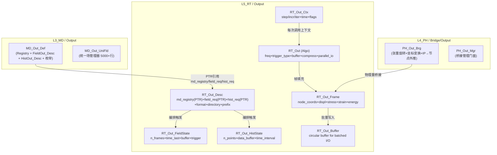

# 输出域：L3 / L5、四型、Field/History 输出 — 合订（一体化设计）

**文档性质**：与 **`Material_…`**（材料）、**`Element_…`**（单元/UEL）、**`Section_…`**（截面）、**`Contact_…`**（接触）、**`LoadBC_…`**（载荷/BC）并列的 **P5 Output 域柱合订**；把 **输出（Output）** 作为 **半贯通域柱**（L3+L5，L4 无独立域），写清 **L3 定义 → L5 编排** 的分工、**四型** 裁剪与 **与 WriteBack 域的边界**。
**代码真源**：`ufc_core/L3_MD/Output/`（L3 输出请求定义，10 个 .f90）；`ufc_core/L4_PH/Bridge/Output/`（L4 输出桥接，2 个 .f90）；`ufc_core/L5_RT/Output/`（L5 运行编排，7 个 .f90，见 **`RT_Out_Def.f90`** AUTHORITY）；`ufc_core/L6_AP/Output/`（L6 应用层格式化/后处理）。
**报告 ID**：`REP-OUTPUT-PILLAR`；**命名与五场景（S0–S4）**：`REPORTS/REPORT_Naming_Quad_OnePager_FiveScenes.md` §1、§3。

**与跨域模板关系**：**`Pillar_L3L4L5_CrossLayer_Design_Template.md` §4.1** Output 行；**一页填槽** **`OnePager_FourKind_MasterAux_Nesting.md` §3.3**；**本文件 §3.5** 四型主/辅架构图解（双State+Frame/Buffer/TriggerCtx辅+PTR引用L3+mermaid）。
**一体化联动审查**：与 **WriteBack 合订本 §8**（WriteBack 与 Output 的保存协调）；**StepDriver**（步末触发输出 vs 步末触发回写）— **同议题同批次**改。  
**外部手册锚点（只读核对）**：**`REPORTS/REPORT_Naming_Quad_OnePager_FiveScenes.md` §6**；优先 **`D:\TEST7\Manual\ANALYSIS_2.pdf`**（*Vol.II* 步定义、过程与 **prescribed conditions / output requests** 叙述）、**`KEYWORD.pdf`**（`*OUTPUT`、`*FIELD OUTPUT`、`*HISTORY OUTPUT`、`*NODE FILE`…）、**`USER.pdf`**（**USDFLD / UVARM / ORIENT** 等与场输出相关的用户子程序，以本域 `CONTRACT` 为准）。

---

## 功能模块完整性公式

**完整功能模块 = 数据结构（四型TYPE：Desc/State/Algo/Ctx + Args）+ 过程算法（空间维度 + 时间维度 + 动作维度）**

- **数据结构侧**：`RT_Out_Desc` / `RT_Out_FieldState`(Field 输出状态) / `RT_Out_HistState`(History 输出状态) / `RT_Out`(Algo 策略) / `RT_Out_Ctx` + 辅TYPE（`RT_Out_Frame`, `RT_Out_Buffer`, `RT_Out_TriggerCtx`）+ `RT_Out_Stp_Ctl_Algo`(频率/触发 P1) + `RT_Out_Itr_Algo`(缓冲/压缩/IO P1) + `RT_Out_Proc`(SIO 5组)
- **过程算法侧**：Frame → Buffer → Writer 管道为**动作维度**——`CheckTrigger`(触发判定) → `PH_Out_Brg`(坐标变换) → `RT_Out_Frame`(帧填充) → `RT_Out_Buffer`(批量) → `RT_Writer_*`(格式化写出)；`RT_Out_Stp_Ctl_Algo`（时间维度步级频率/触发）+ `RT_Out_Itr_Algo`（迭代级缓冲压缩参数）驱动全管道
- **两则关系**：`RT_Out`(Algo) 同时是四型并列中的第四槽（数据结构侧）和 Frame→Buffer→Writer 管道的策略容器（过程算法侧，R-12）；双 State 设计（FieldState/HistState）体现了过程算法对数据结构的产出写入面需求
- **半贯通特殊性**：L4 无独立 Output 域——坐标变换/张量旋转经 `PH_Out_Brg` 薄桥嵌入 L5 编排；这意味着过程算法的空间维度（物理量变换）由 Bridge 层消费式供给
- **本节与 `Output_Procedure_Algorithm.md`** 互补对照：后者展开 `Stp_Ctl_Algo`/`Itr_Algo` 字段细节和 Frame→Buffer→Writer 步骤级时序

---

## 0. 文档目的与范围

| 涵盖 | 不涵盖 |
|------|--------|
| Output 域在 **P5 半贯通柱** 中的职责；L3/L5 分工 | 具体 **ODB/VTK/HDF5 文件格式** 规范 |
| **L3** `MD_Out_*` 四型与模块清单 | 全仓库每一种 **输出变量** 的物理含义 |
| **L5** `RT_Out_*` 四型与编排流程 | **WriteBack** 域的回写逻辑（见 WriteBack 合订本） |
| **L4 Bridge** 输出桥接角色 | **L6 AP** 层的格式化/后处理细节 |

---

## 1. 术语：半贯通柱、输出/回写分界

| 术语 | 含义 | Output 域在本文件中的定位 |
|------|------|---------------------------|
| **半贯通柱（P5）** | Output：**L3+L5** 有独立域目录，**L4 无独立域**（仅 Bridge） | Output 为 **半贯通柱**；L4 侧仅有 `PH_Out_Brg` / `PH_Out_Mgr` |
| **输出 vs 回写** | Output = 「何时/何量写出」；WriteBack = 「写回 L3 模型树」 | Output 决定 **输出请求/格式/频率**；WriteBack 决定 **回写目标/校验** |
| **Field vs History** | Field = 场变量（逐节点/逐单元/逐积分点快照）；History = 时间序列（标量/向量随时间变化） | 两类输出请求在 L3 Desc 中分别定义，L5 分别编排 |

---

## 2. 三层职责总览（Output 相关）

### 2.1 一句话

- **L3_MD / Output**：**输出请求定义 SSOT** —— Field Output 请求（变量/频率/区域）、History Output 请求（变量/频率/区域）、变量注册表、输出坐标系定义；**不做** 输出执行。
- **L4_PH / Bridge/Output**：**物理量→输出格式桥接** —— 张量旋转/坐标变换、积分点→节点外推、应力/应变的物理量映射；**不编排** 输出循环。
- **L5_RT / Output**：**输出运行编排** —— 步末/时间点触发输出、Frame 缓冲、格式化写入（VTK/HDF5/ODB/ASCII）、Restart 文件管理；**不定义** 输出请求、**不做** 物理量变换。

### 2.2 对照表

| 层 | 主要职责 | 典型产物或类型 |
|----|----------|---------------|
| **L3_MD** | 输出请求定义、变量注册、解析 | **`MD_Output_Registry`**、**`MD_FieldOut_Desc`**、**`MD_HistOut_Desc`** |
| **L4_PH** | 物理量桥接、坐标变换 | **`PH_Out_Brg`**、**`PH_Out_Mgr`**（Bridge 目录下） |
| **L5_RT** | 输出编排、格式化写入、Restart | **`RT_Out_Desc`**、**`RT_Out_FieldState`**、**`RT_Out_HistState`**、**`RT_Out`**、**`RT_Out_Ctx`** |

---

## 3. 三层数据流：请求定义 → 桥接 → 编排 → 写入

### 3.1 输出请求金线（冷路径）

```text
INP (*FIELD OUTPUT / *HISTORY OUTPUT)
  → L6_AP / KeyWord 映射
  → MD_Out_Parse (L3 解析)
  → MD_Output_Registry (L3 变量注册)
  → MD_FieldOut_Desc / MD_HistOut_Desc (L3 输出请求 SSOT)
```

### 3.2 输出执行金线（热路径，步末/触发点）

```text
StepDriver (步末/时间触发点)
  → RT_Out_Mgr::WriteFieldOutput / WriteHistoryOutput
    → RT_Out_Frame (增量级缓冲)
      → L4 PH_Out_Brg (物理量→输出格式桥接)
        → RT_Writer_VTK / RT_Writer_HDF5 / RT_Writer_ODB / ASCII
```

### 3.3 Restart 金线

```text
RT_Out_Restart::SaveRestart / LoadRestart
  → 状态序列化 + Checksum 验证
```

---

## 3.5 四型主/辅架构图解（L3 / L5 全景，L4 Bridge 辅助）

> 下列与 **`RT_Out_Def.f90`**（AUTHORITY）、**`MD_Out_Def.f90`** 对齐；字段变更以 .f90 为准。Output 为 **半贯通柱**，L4 无独立域。

### 3.5.1 L5 四型主 TYPE 与辅 TYPE 嵌套（`RT_Out_Def.f90` AUTHORITY）

```text
RT_Out_Desc (主·Desc)              ← DELEGATED → L3 Registry 聚合
├── runtime_id      : INTEGER(i4)       ← 运行时实例 ID
├── output_label    : CHARACTER(64)     ← 输出请求标签
├── md_registry     : MD_Output_Registry, POINTER ← L3 请求注册表引用
├── field_req       : MD_FieldOut_Desc, POINTER  ← L3 Field 请求引用
├── hist_req        : MD_HistOut_Desc, POINTER   ← L3 History 请求引用
├── output_format   : INTEGER(i4)       ← RT_OUT_FMT_* (1=VTK, 2=HDF5, 3=ODB, 4=ASCII)
├── output_directory: CHARACTER(256)    ← 输出目录
├── file_prefix     : CHARACTER(64)     ← 文件前缀
├── is_active       : LOGICAL           ← 激活标志
└── is_initialized  : LOGICAL           ← 初始化标志

RT_Out_FieldState (主·State·Field)     ← Field 输出执行状态
├── n_frames_written / n_frames_current_step / n_frames_max : INTEGER(i4)
├── time_last_written / time_next_due : REAL(wp)
├── inc_last_written / inc_interval   : INTEGER(i4)
├── buffer_active    : LOGICAL
├── buffer_frame_count / buffer_max_frames : INTEGER(i4)
├── suppress_this_inc: LOGICAL
└── write_pending    : LOGICAL
  CONTAINS: Init / Reset / CheckTrigger

RT_Out_HistState (主·State·History)    ← History 输出执行状态
├── n_points_written / n_points_current_step : INTEGER(i4)
├── time_last_written / time_next_due / time_interval : REAL(wp)
├── n_variables      : INTEGER(i4)
├── data_buffer(:,:) : REAL(wp), ALLOCATABLE ← [time, values]
├── buffer_active    : LOGICAL
├── buffer_point_count / buffer_max_points : INTEGER(i4)
  CONTAINS: Init / Reset / AddPoint

RT_Out (主·Algo)                        ← 输出算法控制参数
├── field_freq_incr / hist_freq_incr   : INTEGER(i4)   ← 增量频率
├── field_freq_time / hist_freq_time   : REAL(wp)      ← 时间频率
├── trigger_type     : INTEGER(i4)     ← RT_OUT_TRIG_* (0=INCREMENT, 1=TIME, 2=STEP_END, 3=ANALYSIS_END)
├── trigger_at_step_end / trigger_at_analysis_end : LOGICAL
├── use_field/hist_buffer : LOGICAL
├── field/hist_buffer_size : INTEGER(i4)
├── flush_frequency  : INTEGER(i4)
├── compress_output  : LOGICAL
├── split_by_step    : LOGICAL
├── max_file_size_mb : INTEGER(i4)
├── use_parallel_io  : LOGICAL
├── io_comm_rank / io_comm_size : INTEGER(i4)
  CONTAINS: Init / SetFrequency

RT_Out_Ctx (主·Ctx)                    ← 每次调用上下文
├── step_id / incr_id / iter_id        : INTEGER(i4)
├── step_time / total_time / time_increment : REAL(wp)
├── is_first_incr / is_last_incr / is_step_end / is_analysis_end : LOGICAL
├── n_nodes / n_elements / n_dofs      : INTEGER(i4)
├── force_field_write / force_hist_write / suppress_all_output : LOGICAL
  CONTAINS: Init / Update
```

### 3.5.2 辅 TYPE（`RT_Out_Def.f90`）

```text
RT_Out_Frame (辅·帧缓冲)              ← 单增量级输出容器
├── step_id / incr_id : INTEGER(i4)
├── time / dt         : REAL(wp)
├── n_nodes / n_elements : INTEGER(i4)
├── node_coords(:,:) / node_displ(:,:) / node_velocity(:,:) / node_accel(:,:) : ALLOCATABLE
├── node_temp(:) / node_reaction(:,:) : ALLOCATABLE
├── elem_conn(:,:) / elem_stress(:,:) / elem_strain(:,:) / elem_energy(:) / elem_statev(:,:) : ALLOCATABLE
├── n_field_vars     : INTEGER(i4)
├── field_var_names(:) : CHARACTER(64), ALLOCATABLE
├── field_var_data(:,:) : REAL(wp), ALLOCATABLE
├── is_valid / coords_updated / displ_updated : LOGICAL
  CONTAINS: Init / Allocate / Clear

RT_Out_Buffer (辅·循环缓冲)           ← 批量写入循环缓冲
├── capacity / size / head / tail : INTEGER(i4)
├── data(:) / indices(:) : ALLOCATABLE
├── is_full / needs_flush : LOGICAL
  CONTAINS: Init / Push / Pop / Flush / Clear

RT_Out_TriggerCtx (辅·触发上下文)      ← 时间/增量/步末触发
└── 触发判定逻辑参数
```

### 3.5.3 L3 四型主 TYPE（`MD_Out_Def.f90` AUTHORITY）

```text
MD_Out_Def (主·Desc·L3)                ← SSOT / 输出请求定义
├── MD_Output_Registry   ← 变量注册表 (PTR→RT_Out_Desc%md_registry)
├── MD_FieldOut_Desc     ← Field 输出请求 (变量/频率/区域/坐标系)
├── MD_HistOut_Desc      ← History 输出请求 (变量/频率/区域)
├── OUT_VAR_* 常量       ← 输出变量枚举 (U=1, V=2, A=3, RF=4, S=11, E=12, ...)
├── OUT_LOC_* 常量       ← 输出位置枚举 (NODE=1, ELEM_IN=2, ELEM_CENTROID=3, ...)
└── OUT_FREQ_* 常量      ← 频率模式枚举

MD_Out_UniFld (主·Ctx·L3)              ← 统一场管理器 (5000+行最大模块)
├── 字段管理 / Legacy 同步 / 数据端口桥接
```

### 3.5.4 L4 Bridge 辅助 TYPE

```text
PH_Out_Brg (Bridge·L4)                 ← 物理量→输出格式桥接
├── 张量旋转 / 坐标变换
├── 积分点→节点外推
└── 应力/应变物理量映射

PH_Out_Mgr (Bridge·L4)                 ← 输出管理桥接
└── 编排 L4 物理量到输出格式的门面
```

> **半柱特点**：L4 无独立 Output 域目录；桥接在 `L4_PH/Bridge/Output/` 下完成。Output Desc SSOT 在 L3，运行编排 Authority 在 L5。

### 3.5.5 辅 TYPE 命名规范速查

| 层 | 主 TYPE | 辅 TYPE 命名模式 | 示例 |
|----|---------|-----------------|------|
| **L5** | `RT_Out_Desc` | `RT_Out_<Sub>_<Kind>` | `RT_Out_FieldState`、`RT_Out_HistState` |
| **L5** | `RT_Out` (Algo) | `RT_Out_Frame` / `RT_Out_Buffer` / `RT_Out_TriggerCtx` | 辅 TYPE 独立命名 |
| **L5** | `RT_Out_Ctx` | 扁平字段 | 步/增量/时间/标志 |
| **L4** | `PH_Out_Brg/Mgr` | Bridge 前缀 | `PH_Out_Brg`、`PH_Out_Mgr` |
| **L3** | `MD_Out_Def` | `MD_Out_<Verb>` | `MD_Out_API`、`MD_Out_Parse`、`MD_Out_VarReg` |

### 3.5.6 L3↔L5 四型嵌套对照（mermaid）



### 3.5.7 用户输出子程序 ABI 镜像对偶（UVARM / VUVARM / URDFIL / UHISTR / USDFLD）

> 与材料 `PH_UMAT_Context`（ABI_Flat）、接触 `PH_Contact_UINTER_Ctx`（ABI 镜像）对偶，Output 域的用户子程序 ABI 镜像以 **`PH_Out_<SubProgram>_Ctx`** 为命名模式，**≠** 四型主 `RT_Out_Ctx`（步内热路径工作区）。

#### 3.5.7a Standard 接口原型与参数映射

**UVARM（积分点自定义场变量，最常用）**：

```fortran
      SUBROUTINE UVARM(UVAR,DIRECT,T,TIME,DTIME,CMNAME,ORNAME,
     1 NUVARM,NOEL,NPT,LAYER,KSPT,KSTEP,KINC,NDI,NSHR,COORD,
     2 JMAC,JMATYP,MATLAYO,LACCFLA)
```

| UVARM 参数 | UFC 四型归属 | 说明 |
|------------|-------------|------|
| `UVAR(NUVARM)` | `RT_Out_Frame%field_var_data(:,:)` → 写回 | 用户自定义输出变量数组（云图/曲线） |
| `NUVARM` | `MD_FieldOut_Desc%n_user_vars` | 变量个数（与 inp `*USER OUTPUT VARIABLES` 一致） |
| `T(3,3)` | `PH_Out_Brg` 应力变换入口 | 当前应力张量 |
| `DIRECT(3,3)` | `PH_Out_Brg` 坐标变换 | 材料方向张量 |
| `NOEL,NPT` | `RT_Out_Ctx%current_elem/ipt` | 单元号/积分点号 |
| `TIME(2)` | `RT_Out_Ctx%step_time/total_time` | 总时间/步时间 |
| `CMNAME` | `MD_Out_Def` 材料标识 | 材料名 |

> **ABI 镜像命名**：`PH_UVARM_Context`（文档名 ABI_Flat，≠ `RT_Out_Ctx`）

**URDFIL（实时读结果文件 / 监控 / 终止分析）**：

```fortran
      SUBROUTINE URDFIL(LSTOP,LOVRWRT,KSTEP,KINC,DTIME,TIME)
```

| URDFIL 参数 | UFC 四型归属 | 说明 |
|-------------|-------------|------|
| `LSTOP` | `RT_Out_Ctx%suppress_all_output` | =1 终止分析 |
| `LOVRWRT` | `RT_Out(Algo)%compress_output` | =1 允许覆盖当前步结果 |
| `KSTEP,KINC` | `RT_Out_Ctx%step_id/incr_id` | 分析步/增量步号 |
| `TIME(2),DTIME` | `RT_Out_Ctx%step_time/time_increment` | 时间信息 |

> **ABI 镜像命名**：`PH_URDFIL_Context`（文档名 ABI_Flat，≠ `RT_Out_Ctx`）

**UHISTR（自定义历程输出专用接口）**：

```fortran
      SUBROUTINE UHISTR(NHIST,HIST,TIME,DTIME,KSTEP,KINC,
     1 NOEL,NPT,LAYER,KSPT,NDOFEL,NRHS,NSUBST,PROPS,NPROPS,
     2 COORDS,DROT,NDLOAD,JTYPE,TIMEINC)
```

| UHISTR 参数 | UFC 四型归属 | 说明 |
|-------------|-------------|------|
| `HIST(NHIST)` | `RT_Out_HistState%data_buffer(:,:)` → 写回 | 历程输出变量数组（曲线数据） |
| `NHIST` | `MD_HistOut_Desc%n_user_hist` | 历程变量个数 |
| `NOEL,NPT` | `RT_Out_Ctx%current_elem/ipt` | 单元号/积分点号 |
| `TIME(2),DTIME` | `RT_Out_Ctx%step_time/time_increment` | 时间信息 |
| `PROPS(NPROPS)` | `MD_HistOut_Desc%user_props` | 用户历程参数 |

> **ABI 镜像命名**：`PH_UHISTR_Context`（文档名 ABI_Flat，≠ `RT_Out_Ctx`）

**USDFLD（预定义场变量定义 + 传递给 UMAT/FRIC/UEL）**：

```fortran
      SUBROUTINE USDFLD(FIELD,KSTEP,KINC,TIME,NFIELD,NOEL,NPT,
     1 LAYER,KSPT,COORDS,TEMP,DTEMP,PREDEF,DPRED,STATEV,
     2 NSTATV,PROPS,NPROPS,CMNAME,JMAC,JMATYP,MATLAYO,LACCFLA)
```

| USDFLD 参数 | UFC 四型归属 | 说明 |
|-------------|-------------|------|
| `FIELD(NFIELD)` | `RT_Out_Frame%field_var_data` + UMAT 输入 | 自定义场变量（可输出云图 + 传给本构） |
| `NFIELD` | `MD_FieldOut_Desc%n_field_vars` | 场变量个数 |
| `STATEV(NSTATV)` | `RT_Out_Frame%elem_statev(:,:)` | 状态变量（USDFLD→UMAT 传递链） |
| `TEMP,DTEMP` | `PH_Out_Brg` 温度变换 | 当前温度/温度增量 |
| `CMNAME` | `MD_Out_Def` 材料标识 | 材料名 |

> **ABI 镜像命名**：`PH_USDFLD_Context`（文档名 ABI_Flat，≠ `RT_Out_Ctx`）

#### 3.5.7b Explicit 接口原型与参数映射

**VUVARM（显式积分点自定义输出）**：

```fortran
      SUBROUTINE VUVARM(UVAR,NUVARM,NOEL,NPT,TIME,DTIME,
     1 KSTEP,KINC,NDI,NSHR,COORD,TEMP,
     2 PREDEF,LFLAGS,MLFLAGS,CMNAME,ORNAME)
```

| VUVARM 参数 | UFC 四型归属 | 说明 |
|-------------|-------------|------|
| `UVAR(NUVARM)` | `RT_Out_Frame%field_var_data(:,:)` → 写回 | 显式自定义输出变量数组 |
| `NUVARM` | `MD_FieldOut_Desc%n_user_vars` | 变量个数 |
| `NOEL,NPT` | `RT_Out_Ctx%current_elem/ipt` | 单元号/积分点号 |
| `TIME(2),DTIME` | `RT_Out_Ctx%step_time/time_increment` | 时间信息 |
| `TEMP` | `PH_Out_Brg` 温度 | 当前温度 |
| `CMNAME,ORNAME` | `MD_Out_Def` 标识 | 材料/方向名 |

> **ABI 镜像命名**：`PH_VUVARM_Context`（文档名 ABI_Flat，≠ `RT_Out_Ctx`）

#### 3.5.7c Field vs History 双轨选型

| 需求 | Standard | Explicit |
|------|----------|----------|
| **Field Output（云图/全场）** | **UVARM** / USDFLD / STATEV(UMAT/UEL/FRIC) | **VUVARM** |
| **History Output（曲线/单点）** | **UHISTR**（专用） / UVARN / URDFIL | VUVARM（设为历程点） |
| 实时监控/终止分析 | **URDFIL** | （显式内置监控） |
| 场变量→本构传递 | **USDFLD** → UMAT/FRIC/UEL | （显式通过 VUMAT STATEV） |

#### 3.5.7d 防双写约束与 ABI 闭环

1. **UVARM 无状态变量**：仅输出，不存储历史；需历史数据须用 `STATEV`（UMAT/USDFLD）传递。
2. **URDFIL 不写回 L3**：仅读结果文件 + 终止/覆盖标志，**≠** WriteBack 域（见 §8）。
3. **USDFLD→UMAT 传递链**：`FIELD` 可传给 UMAT/FRIC/UEL 消费，但 **禁止** USDFLD 直接修改 `STATEV` 后又被 UVARM 输出（须合同指定优先序）。
4. **NUVARM 严格匹配**：子程序 `UVAR(NUVARM)` 维度必须等于 inp `*USER OUTPUT VARIABLES` 数字，否则 FATAL。
5. **ABI 闭环**：`UVARM → RT_Out_Frame%field_var_data → RT_Out_Buffer → RT_Writer_*`，经 `PH_Out_Brg` 坐标变换，**不经** Populate 金线（PTR 引用机制，见 §3.5.6 mermaid）。

---

## 4. L3 现状：四型与模块（真源表）

### 4.1 四型裁剪（L3 域内）

| Kind | L3 TYPE / 说明 | 备注 |
|------|----------------|------|
| **Desc** | **`MD_Output_Registry`**、**`MD_FieldOut_Desc`**、**`MD_HistOut_Desc`** | **SSOT**；含变量/频率/区域/坐标系 |
| **State** | （隐式） | 输出计数/最后写入时间等在 L5 侧管理 |
| **Algo** | （隐式） | 输出频率/触发策略在 Desc 中表达 |
| **Ctx** | **`MD_Out_UniFld`**（统一场管理器） | 字段管理上下文 |

### 4.2 模块清单

| 文件 | `MODULE` | 角色 |
|------|----------|------|
| `MD_Out_Def.f90` | `MD_Out_Def` | **AUTHORITY**：输出常量/变量枚举/Field-Hist Desc/Registry |
| `MD_Out_API.f90` | `MD_Out_API` | 公开 API 层 |
| `MD_Out_Parse.f90` | `MD_Out_Parse` | 输出请求解析 |
| `MD_Out_Lib.f90` | `MD_Out_Lib` | 输出工具库 |
| `MD_Out_FieldExport.f90` | `MD_Out_FieldExport` | 场导出 |
| `MD_Out_VarReg.f90` | `MD_Out_VarReg` | 变量注册 |
| `MD_Out_ReportPlot.f90` | `MD_Out_ReportPlot` | 报告/绘图 |
| `MD_Out_Sync.f90` | `MD_Out_Sync` | Legacy 同步 |
| `MD_Out_UniFld.f90` | `MD_Out_UniFld` | 统一场管理器（5000+ 行，最大模块） |
| `MD_Out_UniFldOps.f90` | `MD_Out_UniFldOps` | 统一场操作 |
| `MD_Out_Mgr.f90` | `MD_Out_Mgr` | 管理器门面 |
| `MD_OutDP_Brg.f90` | `MD_OutDP_Brg` | 数据端口桥接 |

---

## 5. L4 现状：Bridge 输出

L4 **无独立 Output 域目录**；输出桥接在 `L4_PH/Bridge/Output/` 下：

| 文件 | `MODULE` | 角色 |
|------|----------|------|
| `PH_Out_Brg.f90` | `PH_Out_Brg` | 物理量→输出格式桥接（张量旋转/坐标变换/外推） |
| `PH_Out_Mgr.f90` | `PH_Out_Mgr` | 输出管理桥接 |

**职责**：将 L4 物理量（应力/应变/位移等）转换为输出友好的格式（坐标旋转、积分点→节点外推、张量分量提取）。

---

## 6. L5 现状：四型与编排

### 6.1 四型 (`RT_Out_Def.f90`)

| 四型 | TYPE 名称 | 核心字段 | 说明 |
|------|-----------|----------|------|
| **Desc** | `RT_Out_Desc` | runtime_id, output_label, md_registry(PTR), field_descs(:), hist_descs(:) | 聚合 L3 请求 + 运行时元数据 |
| **State** | `RT_Out_FieldState` | n_frames, last_frame_time, buffer | Field 输出执行状态 |
| | `RT_Out_HistState` | n_points, last_time, buffer | History 输出执行状态 |
| **Algo** | `RT_Out` | output_format, trigger_type, frequency, buffer_size, compress | 输出算法控制参数 |
| **Ctx** | `RT_Out_Ctx` | current_time, current_inc, current_step, frame | 每次调用上下文 |

### 6.2 辅助 TYPE

| TYPE | 用途 |
|------|------|
| `RT_Out_Frame` | 单增量级输出帧缓冲 |
| `RT_Out_Buffer` | 循环缓冲（批量写入） |
| `RT_Out_TriggerCtx` | 触发上下文（时间/增量/步末） |

### 6.3 金线模块

| 文件 | MODULE | 角色 |
|------|--------|------|
| `RT_Out_Mgr.f90` | `RT_Out_Mgr` | **GOLDEN-LINE**：输出编排主模块 |
| `RT_Out_Impl.f90` | `RT_Out_Impl` | 输出实现 |
| `RT_Out_Proc.f90` | `RT_Out_Proc` | SIO 过程封装 |
| `RT_Out_Restart.f90` | `RT_Out_Restart` | Restart 文件管理 |
| `RT_Writer_HDF5.f90` | `RT_Writer_HDF5` | HDF5 格式写入 |
| `RT_Writer_ODB.f90` | `RT_Writer_ODB` | ODB 格式写入 |
| `RT_Out_Brg.f90` | `RT_Out_Brg` | Bridge 桥接 |

### 6.4 输出格式枚举

| 格式 | 常量 | 说明 |
|------|------|------|
| VTK | `RT_OUT_FMT_VTK = 1` | 可视化工具包格式 |
| HDF5 | `RT_OUT_FMT_HDF5 = 2` | 高性能层次数据格式 |
| ODB | `RT_OUT_FMT_ODB = 3` | Abaqus 输出数据库格式 |
| ASCII | `RT_OUT_FMT_ASCII = 4` | 纯文本格式 |

### 6.5 触发类型枚举

| 触发 | 常量 | 说明 |
|------|------|------|
| 按增量 | `RT_OUT_TRIG_INCREMENT = 0` | 每 N 增量输出一次 |
| 按时间 | `RT_OUT_TRIG_TIME = 1` | 按时间间隔输出 |
| 步末 | `RT_OUT_TRIG_STEP_END = 2` | 步结束时输出 |
| 分析结束 | `RT_OUT_TRIG_ANALYSIS_END = 3` | 分析结束时输出 |

---

## 7. 四型跨层裁剪表（目标态 + 当前态）

| Kind | L3（当前） | L4（Bridge） | L5（目标 / 当前） |
|------|------------|--------------|-------------------|
| **Desc** | **RETAINED**（输出请求 SSOT） | **不存在**（Bridge 仅转发） | **DELEGATED→L3**（`RT_Out_Desc` 聚合 L3 Registry） |
| **State** | **TRIMMED**（L3 不持输出执行状态） | **不存在** | **RETAINED**（`RT_Out_FieldState/HistState`：帧计数/缓冲） |
| **Algo** | **TRIMMED**（频率/触发在 Desc 中） | **不存在** | **RETAINED**（`RT_Out`：格式/触发/缓冲/压缩） |
| **Ctx** | **TRIMMED**（`MD_Out_UniFld` 为管理器，非热路径 Ctx） | **Bridge 转发**（坐标变换/外推） | **RETAINED**（`RT_Out_Ctx`：每次调用上下文） |

**半柱分类**：P5 Output 为 **L3+L5 半贯通柱**，L4 无独立域。物理量→输出格式的桥接在 `L4_PH/Bridge/Output/` 中完成。

---

## 8. 与 WriteBack 域的边界

| 主题 | Output 域 | WriteBack 域 |
|------|-----------|--------------|
| **核心职责** | 输出请求编排 + 格式化写入 | 计算结果→L3 模型树回写 |
| **触发时机** | 步末/时间点/步末/分析结束 | 步末/检查点 |
| **数据方向** | L5→文件（VTK/HDF5/ODB/ASCII） | L5→L3（模型树状态更新） |
| **数据内容** | 用户请求的输出变量（应力/位移/能量等） | 求解结果（节点位移/坐标/速度/单元应力/SDV） |
| **L3 角色** | 请求定义（Desc SSOT） | 回写目标（State 更新） |
| **共同消费者** | StepDriver 触发 | StepDriver 触发 |
| **Procedure/Algorithm 专域合订** | **`Output_Procedure_Algorithm.md`** §2(Algo TYPE)、§3(Frame→Buffer→Writer 管道) | `WriteBack_Procedure_Algorithm.md` §2–§4 |

**关键约束**：Output 域 **不写回** L3 模型树；WriteBack 域 **不定义** 输出请求。两者在步末由 StepDriver 分别调度。

---

## 9. 与其他合订本的衔接点

| 主题 | 材料合订本 | 单元合订本 | WriteBack 合订本 | 本文（Output） |
|------|------------|------------|------------------|----------------|
| **Populate** | `PH_L4_Populate_Material` | `PH_L4_Populate_Element` | 不参与 Populate | L3 输出请求经 Populate 传递给 L5 |
| **触发机制** | 材料点无直接触发 | 单元核无直接触发 | 步末/检查点 | 步末/时间点/步末/分析结束 |
| **数据消费** | 应力/SDV 可被 Output 请求 | 位移/应力/能量可被 Output 请求 | 消费 WriteBack 写回的 L3 State | 消费 L5 求解结果 + L4 Bridge 变换 |
| **Restart** | 材料状态可序列化 | 单元状态可序列化 | Checkpoint 管理 | `RT_Out_Restart` 保存/加载 |

---

## 10. 分阶段落地（纳入一体化设计）

| 阶段 | 交付物 | 验收 |
|------|--------|------|
| **S0（本文 + 合同对齐）** | 本合订本文 + L3/L5 合同交叉引用 | 评审能通过「Output 出现在输出请求/编排叙述」 |
| **S1（L3 CONTRACT 落盘）** | `L3_MD/Output/CONTRACT.md` 标准化 | 与 L5 `RT_Out_Def` TYPE 对齐 |
| **S2（L4 Bridge 增强）** | `PH_Out_Brg` 完整化（张量旋转/外推/分量提取） | 单元应力→节点外推精度验证 |
| **S3（OnePager 填槽）** | Output 域填槽行写入 OnePager | 与 Pillar §4.1 对齐 |

---

## 附录 A — 输出变量枚举速查

| 变量 | 常量 | 位置 |
|------|------|------|
| U (位移) | `OUT_VAR_U = 1` | 节点 |
| V (速度) | `OUT_VAR_V = 2` | 节点 |
| A (加速度) | `OUT_VAR_A = 3` | 节点 |
| RF (反力) | `OUT_VAR_RF = 4` | 节点 |
| CF (集中力) | `OUT_VAR_CF = 5` | 节点 |
| TEMP (温度) | `OUT_VAR_TEMP = 6` | 节点 |
| S (应力) | `OUT_VAR_S = 11` | 积分点/单元 |
| E (应变) | `OUT_VAR_E = 12` | 积分点/单元 |
| PE (塑性应变) | `OUT_VAR_PE = 13` | 积分点/单元 |
| EE (弹性应变) | `OUT_VAR_EE = 14` | 积分点/单元 |
| PEEQ (等效塑性应变) | `OUT_VAR_PEEQ = 15` | 积分点/单元 |
| MISES (Von Mises 应力) | `OUT_VAR_MISES = 16` | 积分点/单元 |

## 附录 B — 输出位置枚举

| 位置 | 常量 | 说明 |
|------|------|------|
| `OUT_LOC_NODE` | 1 | 节点 |
| `OUT_LOC_ELEM_IN` | 2 | 单元积分点 |
| `OUT_LOC_ELEM_CENTROID` | 3 | 单元质心 |
| `OUT_LOC_ELEM_SURFACE` | 4 | 单元表面 |
| `OUT_LOC_GLOBAL` | 5 | 全局 |

## 附录 C — 维护与同步清单

- **`L3_MD/Output/`**：变量注册/请求定义变更 → 同步本文 **§4** 与 L5 `RT_Out_Def` 的 `MD_Output_Registry` 引用。
- **`L4_PH/Bridge/Output/`**：坐标变换/外推算法变更 → 同步本文 **§5**。
- **`L5_RT/Output/`**：格式/触发/缓冲变更 → 同步本文 **§6**。
- **WriteBack 合订本**：Output 与 WriteBack 的步末调度顺序变更 → 同步本文 **§8**。

---

*冷归档全文：`UFC/REPORTS/archive/Output_L3L4L5_four_type_synthesis.md`。入口 stub：`UFC/REPORTS/Output_L3L4L5_four_type_synthesis.md`。一体化设计并列（根 stub）：`Material_L3L4L5_four_type_UMAT_discussion_synthesis.md`、`Element_L3L4L5_four_type_UEL_discussion_synthesis.md`、`Section_L3L4L5_four_type_synthesis.md`、`Contact_L3L4L5_four_type_synthesis.md`、`LoadBC_L3L4L5_four_type_synthesis.md`、`WriteBack_L3L4L5_four_type_synthesis.md`、`Pillar_L3L4L5_CrossLayer_Design_Template.md`。*
