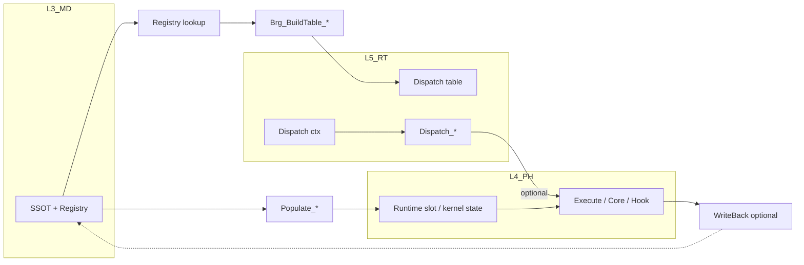

# 贯通域柱：L3 / L4 / L5 跨层设计模板（可推广）

**文档性质**：从 **材料域** 已沉淀的 L3→L4→L5 机制（见 `Material_L3L4L5_four_type_UMAT_discussion_synthesis.md` §10–§12、§10.14、§11）抽象为 **各贯通域柱复用的设计模板**。  
**适用域柱（P1–P6 推广目标）**：材料 **Material**、单元 **Element**、接触 **Interaction/Contact**、载荷与边界 **LoadBC**、输出 **Output**、写回 **WriteBack**（及与求解/作业层的衔接）。

**非目标**：替代各域 `CONTRACT.md` 字段级真源；不规定具体本构/单元公式。

---

## 功能模块完整性公式（跨域柱模板级引用）

**完整功能模块 = 数据结构（四型TYPE：Desc/State/Algo/Ctx + Args）+ 过程算法（空间维度 + 时间维度 + 动作维度）**

- **数据结构侧**：本模板 §4.1 的预填表中，每个域柱的 Hub + 四型 + Arg + Aux = 是**数据结构**维度的横切画像
- **过程算法侧**：本模板 §3 的标准阶段模式（冷路径 C1-C5 + 热路径 H1-H5 + 写回 W1-W2）+ 各域 **`*_Procedure_Algorithm.md`**（**根 stub**，长文在 `REPORTS/archive/` 同名）的 Pipeline = 是**过程算法**维度的横切画像
- **两则关系**：本模板 §4.3 明确要求——任一域柱首版落地须同时更新 §4.1（数据结构）和 §4.3（过程算法/管道/PTR）= 即"完整功能模块"的落地检查单
- **引用关系**：本模板作为跨域柱复用的模板层，不重复展开各域公式的域专属细节；具体域专属公式见各域合订本 §0.5

---

**单元 / UEL 专篇（对偶材料 UMAT 合订）**：**`Element_L3L4L5_four_type_UEL_discussion_synthesis.md`**（与 **`Material_…` §14** 同步）。  
**截面 / M–E–S 正交维合订**：**`Section_L3L4L5_four_type_synthesis.md`**（与 **§0 材料–单元–截面**、**L3 `Section/CONTRACT.md`** 同步）。  
**四型主/辅 · 总分 · 并列/嵌套（一页填槽）**：**`OnePager_FourKind_MasterAux_Nesting.md`** — **硬规则 R-01–R-08** + **材料 / 单元 / 截面空表**；与 **§4.1** 域行联用。  
**四 REPORT + OnePager 命名与五场景（S0–S4）**：**`REPORTS/REPORT_Naming_Quad_OnePager_FiveScenes.md`**（报告 ID、文件名模板、与冷/热金线对照）。  
**Abaqus 用户子程序 ↔ UFC 域柱**：**`REPORTS/Abaqus_UserSubroutine_UFC_Map.md`**（Std / Exp / CFD 子程序名与 P1–P6 关切映射；**无** Fortran 长签名，接口以持证 **USER.pdf** 为准）。  
**P3–P6 域柱合订**：**`Contact_L3L4L5_four_type_synthesis.md`**（P3 全贯通柱，AUTHORITY四型+GOLDEN-LINE `RT_Cont_Solv`）、**`LoadBC_L3L4L5_four_type_synthesis.md`**（P4 全贯通柱，AUTHORITY四型+金线TBP `PH_LoadBC_Domain`）、**`Output_L3L4L5_four_type_synthesis.md`**（P5 半贯通柱，L4无独立域+GOLDEN-LINE `RT_Out_Mgr`）、**`WriteBack_L3L4L5_four_type_synthesis.md`**（P6 半贯通柱，白名单守卫+GOLDEN-LINE `RT_WriteBack_Domain`）；与 **`REPORT_Naming_Quad_OnePager_FiveScenes.md` §1、§6**（本地 **`Manual/ANALYSIS_*.pdf`**、**`KEYWORD.pdf`**、**`USER.pdf`** 锚点）交叉核对。

---

## 0. 正交维：材料–单元–截面 vs 贯通域柱（P1–P6）

### 0.1 三个名词对齐（与域卡一致）

| 概念 | 含义 | 判据（实用） |
|------|------|----------------|
| **贯通域柱（P1–P6）** | **材料 / 单元 / 接触 / LoadBC / Output / WriteBack** 等：在 **L3、L4、L5 各有可指认的域职责与模块边界**，冷 **Populate**、热 **Dispatch/Execute**、可选 **WriteBack** 能连成 **金线** | 三层目录 + 三层 `CONTRACT.md`（或等价合同）能说清 **SSOT / 热权威 / 路由** |
| **半域柱** | 某一整层 **缺失独立域** 或 **运行时主体偏在一端** | 例：**`L5_RT/StepDriver/DOMAIN_PILLAR_CARD.md`** — L3 步定义真源 + L5 状态机，**L4 无独立 StepDriver 域**（消费式调用物理核） |
| **专属层 / L3 偏重域** | 定义、注册、库表主要在 **L3**；L4/L5 **仅有薄桥或尚未闭合** | 例：当前 **`L3_MD/Section/`**（`MD_Sect_*` 族）— **截面真源已在模型层**，热路径上多经 **单元 / 材料 Populate** 消纳 |

### 0.2 材料 × 单元 × 截面：三维正交（不是「第 7 根柱」硬插队）

- **材料轴**：本构、状态变量、**UMAT/VUMAT** 等（**点 / IP** 尺度为主）。  
- **单元轴**：形函数、B 阵、积分、装配、**UEL** 等（**单元 / 高斯点环** 尺度为主）。  
- **截面轴**：**同一单元型 + 同一材料卡** 仍可能对应 **不同厚度 / 纤维取向 / 层合顺序 / 梁截面几何 / 偏置** —— 这是 **与材料、单元正交的第三维信息**；在 Abaqus 语义里常由 **`sect_id` / `*SECTION`** 绑定到 **element set**。

**设计立场**：截面域 **宜纳入同一套「冷/热 + 四型语义」设计考虑**，但在 **柱清单** 上不必改名为「P7」替代某一柱；更干净的做法是把它标为 **横切正交维**：在 **Populate** 与 **单元核入口** 上与 **Material、Element 两柱同时发生关系**（**联合键**：`elem_id` + `sect_id` + `mat_id` + `ip`…，以合同为准）。

### 0.3 截面域四类文档（建议稿名与目录）

与 **`Material_L3L4L5_four_type_UMAT_discussion_synthesis.md`**、**`Element_L3L4L5_four_type_UEL_discussion_synthesis.md`** **同形制** 新增一份 **合订讨论稿**（放 **`UFC/REPORTS/`**，不替代各层 `CONTRACT.md`）：

| 章 | 内容 |
|----|------|
| **§0** | 术语 + 本文与 **P1–P6 模板、半柱、L3 偏重** 的关系；**禁止双主源**（与材料 **§8.1c** 同构：不得 **L3 `MD_Sect_*` 全四型** 与 **L4 `PH_Elem_*` 内再刻一套截面全四型** 并列为真源）— **成稿见 `Section_L3L4L5_four_type_synthesis.md`** |
| **§1** | **三维正交**：截面输入如何 **不改变** 材料本构方程，但 **改变** 单元上 **力流 / 刚度维度 / 取向**；与 **`RT_Elem_Sect`**、**`PH_Elem_MaterialRoute`** 的 **读序** |
| **§2** | **L3 现状真源**：`L3_MD/Section/`（`MD_Sect_Def`、`MD_Sect_Domain`、`MD_Sect_Mgr`、`MD_Sect_Brg`…）字段级索引 |
| **§3** | **L4 目标态**：独立 **`L4_PH/Section/`**（`PH_Sect_*` 四型）**vs** 截面字段 **嵌入 `PH_Elem_Desc` / Populate 缓存** —— **二选一主挂载**，另一为 **视图/派生** |
| **§4** | **L5**：`RT_Elem_Sect`、Dispatcher 是否需要 **`RT_Sect_*`** 独立路由表（仅当截面驱动 **跨单元一致策略** 时值得） |
| **§5** | **四型裁剪表**（Desc/Ctx/State/Algo 在 L3/L4/L5 的 RETAIN/DELEGATE/TRIM） |
| **附录** | 关键字 / 截面类型 × 层 × 四型角色矩阵（**机读表**）；壳层合板 **layer/kspt** 与材料 **S4** 的衔接（见材料合订本尺度表交叉引用） |

**落地顺序建议**：先 **`REPORTS` 合订稿 + 各层 `CONTRACT.md` 各增一节「截面：分工与Populate钩子」**；待 **L4 挂载策略** 选定后，再考虑 **`DOMAIN_PILLAR_CARD.md`（Section）** 是否升级为 **全贯通柱**。

### 0.4 与 §4.1 表的关系

**§4.1** 仍以 **P1–P6** 为行；截面 **不单独占一行**。**Populate 列**已在 **Material**、**Element** 两行补 **`sect_id`** 与 **`Section_L3L4L5_four_type_synthesis.md` §9 S0** 指针；**Element 行 L5 列** 已显式 **`RT_Elem_UEL`** + **`L5_RT/Element/CONTRACT.md` §3.1**（**UEL-A / UEL-B**）。热路径仍以各域合同为准。若截面 **L4 独立域**成熟，可再 **拆行「Section」** 与 Element 行并列。

---

## 1. 模板在回答什么问题

| 问题 | 模板给出的答案形态 |
|------|-------------------|
| 三层各持什么？ | **L3 = SSOT（定义/注册/合同）**；**L4 = 运行期槽或物理执行体（热路径真源）**；**L5 = 路由/装配上下文（元数据，不持大数组）**。 |
| 冷/热如何切？ | **冷**：解析/注册 → **Populate（或等价灌入）** → 建 **Dispatch 表/索引**。**热**：**MakeCtx / 查表** → **Dispatch（薄/厚）** → **Execute / 核 / 钩子** → 可选 **WriteBack**。 |
| 与「四型」关系？ | **L4 侧**以 **Desc / State / Algo / Ctx（+ Args）** 为默认壳；若某域不适配四型名词，仍须保留 **「定义 / 运行态 / 控制 / 环境」四类语义分区**，并在域合同中命名。 |
| 与扁平存储？ | **嵌套 = 语义与权限边界**；**扁平缓冲（如 props、packed dof、buffer id）** = **版本化/序列化/外部 ABI**；二者 **分工不互斥**。 |

---

## 2. 全局不变量（所有域柱继承）

以下与材料域 **§10.1** 同构，推广时 **不得破坏**：

1. **SSOT 分层**：步内热路径的 **主写入面** 在 **L4 执行体**；L3 为定义真源；L5 不复制 Voigt 级大状态（除非合同明确极小元数据）。
2. **冷 / 热分离**：Populate 类步骤 **不** 与 Newton 内环混写；热路径 **不** 把 L3 当迭代主源改写字段（除非合同规定的只读缓存）。
3. **路由 ≠ 核心算法**：L5（或 L4 门脸）只做 **合法性与索引**；**物理/本构/接触约束/输出筛选** 在 L4（或注册核）。
4. **总–分传递**（见材料 **§10.14**）：边界传 **枢纽对象 + 索引**；过程内 **ASSOCIATE / 局部快照 / 窄 Args** 收束深度；域外 **Accessor / `*_Arg`**。

---

## 3. 标准阶段模式（可复制流程）

### 3.1 冷路径（每实例 / 步初 / 网格变更后）

| 序号 | 抽象步骤 | 材料域锚点（示例） | 其它域应填 |
|------|----------|-------------------|------------|
| C1 | 初始化 L4 **容器/域** | `PH_Mat_Domain%Init` | `PH_*_Domain` / 单元数据域等 |
| C2 | L3 **注册/解析** 可查询 | `MD_Mat_Registry_Access_*` | 各域 Registry / Model 树 |
| C3 | **Populate**：L3 → L4 灌入定义态 + 分配运行态维数 | `PH_L4_Populate_Material` | `PH_L4_Populate_*` |
| C4 | **建路由表**：L4 → L5 只写元组 | `RT_Mat_Brg_BuildTable_FromMaterial` | `RT_*_Brg_*` |
| C5 | 校验 **表项 ↔ 槽/实体** 一致 | `mat_id`、`mat_pt_idx` | 域自定义主键 |

### 3.2 热路径（每 IP / 每接触点 / 每输出节拍）

| 序号 | 抽象步骤 | 材料域锚点 | 其它域应填 |
|------|----------|------------|------------|
| H1 | **MakeCtx / GetRoute** | `RT_Mat_Brg_MakeCtx` | 接触对、LoadCase、Output request id |
| H2 | **写入本步局部输入**（应变增量、间隙、载荷增量…） | `slot%ctx%lcl` | 域对应 ctx |
| H3 | **Dispatch**（薄：仅校验；厚：转 Execute） | `RT_Mat_Dispatch_Stress` | `RT_*_Dispatch_*` |
| H4 | **Execute**：核或钩子写 **权威状态** | `PH_Mat_Execute_Flow` | 单元刚度、接触力、输出缓存 |
| H5 | **消费侧读回**（单元、求解器） | 读 `slot%state` | 读 L4 结果缓冲 |

### 3.3 写回（可选，收敛后 / 作业末）

| 序号 | 抽象步骤 | 说明 |
|------|----------|------|
| W1 | **L4 → L3 或 ODB/结果文件** | 仅 **分期真源**；与步内 L4 权威无冲突（合同写明时刻） |
| W2 | **Hook 与幂等** | `RT_Mat_Brg_WriteBackHook` 类；多次调用安全策略由域规定 |

---

## 4. 域柱映射表（设计填槽用）

### 4.0 用法与草稿性质

- **用法**：评审时检查每域是否具备 **冷 Populate（或等价）**、**热 Dispatch/Execute**、**可选 WriteBack** 三截；缺列即风险。**材料–单元–截面** 正交关系见 **§0**。
- **§4.1 预填列**：根据 **`UFC/ufc_core`** 下 `rg "^MODULE (MD_|PH_|RT_)"` **按目录抽样**（2026-05-03），仅作 **占位草稿**；**以各域 `CONTRACT.md` 与实装为准**，新增模块后应复扫更新。
- **符号**：**（合同）** = 名称见于 `CONTRACT`/设计稿但 **当前 `.f90` 中可无同名 `SUBROUTINE`**；**TODO** = 尚未见集中模块。

### 4.1 预填草稿表（L3 / L4 / L5 占位模块名）

路径均相对于仓库 **`UFC/ufc_core/`**。同一格内 **逗号分隔** 多个入口模块；省略号表示族内大量配方文件未全列。

| 域柱 | L3 占位（目录 + 代表 `MODULE`） | L4 占位（目录 + 代表 `MODULE`） | L5 占位（目录 + 代表 `MODULE`） | 冷路径（Populate / Bridge） | 热路径（Dispatch / Execute / Hook） | WriteBack / 副作用 |
|------|-----------------------------------|-----------------------------------|----------------------------------|------------------------------|----------------------------------------|---------------------|
| **Material** | `L3_MD/Material/`：`MD_Mat_Def`、`*_Registry*`、各 `MD_Mat_*_Def`（**族级** `MD_Mat_<Fam>_Desc`）、**`MD_Mat_User_Desc`**(`EXTENDS(MD_Mat_Desc)`, props/nprops/nstatv/布局ID); **OnePager §3.1** | `L4_PH/Material/`：**`PH_Mat_Def`**（AUTHORITY 四型 + **3辅Desc**: `Cfg_Init_Desc`/`Pop_Vld_Desc` + `props(:)` + **2辅State**: `Lcl_Comp_State`(`stress`/`C_tan`) / `Lcl_Evo_State`(`stateVars`/`stateVars_n`) + **2辅Ctx**: `Inc_Evo_Ctx`(步/增量/`dt`) / `Lcl_Comp_Ctx`(`dstrain`/`temperature`) + **2辅Algo**: `Stp_Ctl_Algo`(步控) / `constitutive`过程指针; 族级 `PH_Mat_<Fam>_Algo`）、`PH_Mat_Domain_Core`、`PH_L4_Populate`、`PH_Mat_Core`、`PH_Mat_Reg`、`PH_UMAT_Def`…；**`PH_UMAT_Context`（ABI Mirror，文档名 ABI_Flat，≠ 四型 `Ctx`）** 见 **附录 G.0**; **OnePager §3.1** | `L5_RT/Material/`：`RT_Mat_Def`、`RT_Mat_Core`、`RT_Mat_Brg`、**`RT_Mat_Dispatch_Ctx`**（跨层路由Arg）、**`RT_Mat_Aux_Def`**(`RT_Mat_Stp_Ctl_Algo` P2补全)、**`RT_Mat_Algo`**(stp_ctl嵌入); **OnePager §3.1** | **`PH_L4_Populate_Material`**（`MD_Mat_Registry_Access_Desc`+`SELECT TYPE`族感知+`PH_L4_Alloc_State_ForFamily`）；**与 `sect_id` 正交衔接**（**`L3_MD/Section`** → **`ntens`/应力态 Populate**，见 **Section合订本 §9 S0**）；**OnePager §3.1** | **`RT_Mat_Dispatch_Stress`**→**`PH_Mat_Execute_Flow`**(S1取槽→S2族合法→S3应力更新→S4切线→写回槽)、`PH_Mat_Execute_Tangent_Flow`(仅切线)、单元侧 **`PH_Elem_MaterialRoute`**、`PH_UMAT_*`；**签名束**：**`PH_Mat_Update_Arg`**(热路径核) / **`PH_Mat_Eval_Arg`**(`ArgIn`/`ArgOut`); **OnePager §3.1** | **`RT_Mat_Brg_WriteBackHook`**；SDV双写须用 **`PH_Mat_State_DualWrite_StateVars`**; **OnePager §3.1** |
| **Element** | `L3_MD/Element/Elem/`：**`MD_Elem_Def`**、**`MD_Elem_PHBinding`**、**`MD_Elem_Mgr`**、**`MD_Elem_Family`**、**`MD_Elem_InpMap`**、**`MD_Elem_UEL_Def`**（**`MD_Elem_UEL_Desc`**：SSOT ndofel/nprops/props/jtype, **≠** `MD_Elem_Desc`）、`MD_Elem_Reg`、**`MD_Elem_Domain`**、`MD_Elem_Populate`、`MD_Elem_Validate`；`L3_MD/Bridge/Bridge_L4/`：**`MD_ElemPH_Brg`**; **OnePager §3.1** | `L4_PH/Element/`：**`PH_Elem_Def`**（AUTHORITY 四型 + **辅Desc**: `Cfg_Init_Desc` + **辅State**: `Lcl_Comp_State` + **辅Ctx**: `Lcl_Comp_Ctx`(`u/du`/形函数/`J`) + **2辅Algo**: `Stp_Ctl_Algo`(静) / `Stp_Ctl_Dyn_Algo`(动); 积分子/沙漏）、**`PH_Elem_Domain`**、**`PH_Elem_Core`**、**`PH_Elem_Eval`**、`Shared/PH_ElemRT_Brg`、`Shared/PH_Elem_MaterialRoute`、`*Defn`、各实体元 **`PH_Elem_CPE4`**、`PH_Elem_C3D8`…；**`PH_UEL_Def` / `PH_UEL_Context`（ABI Mirror，文档名 ABI_Flat，≠ `PH_Elem_Ctx`）** 见 **附录 C.0**; `rhs/amatrx`落位见合同 **U0**; **OnePager §3.1** | `L5_RT/Element/`：**`RT_Elem_Def`**、**`RT_Elem_Core`**、**`RT_Elem_Dispatcher`**、`RT_Elem_KernelProc`、`RT_Elem_AsmProc`、`RT_Elem_ComputeProc`、`RT_ElemDispatch_Brg`、**`RT_Elem_UEL`**（**CONTRACT.md §3.1**：UEL-A / UEL-B 交叉索引；**`RT_Elem_UEL_API`** / **`RT_Elem_UEL_Probe`** 薄门面，仅校验+路由）、`RT_Elem_Sect`、`RT_Elem_ThermalMechCpl`；`L5_RT/Element/Mesh/`：`RT_Mesh_Def`、`RT_Mesh_Proc`…; **签名束**：**`PH_Elem_<Verb>_Arg`** / **`PH_Elem_Core_*_Arg`** / UEL专用 **`PH_UEL_*_Arg`**; **OnePager §3.1** | **（合同）** **`PH_L4_Populate_Element`** — 见 `L4_PH/Element/CONTRACT.md`；**`sect_id` → 厚度/取向/M-S-E**（**Section合订本 §9 S0**）；**当前实装锚点**：**`MD_Elem_Populate`**、`MD_ElemPH_Brg`（冷数据/桥）；**OnePager §3.1** | **`RT_Elem_Dispatcher`** / `RT_Elem_*Proc`、各 **`PH_Elem_*`** 配方、`PH_Elem_MaterialRoute`；**UEL 薄适配**：`RT_Elem_UEL_API` → 材料 **`PH_*_UMAT_API`**（见合订本 **§14**）；**OnePager §3.1** | **`RT_ElemWB_Brg`**（单元写回桥）；**OnePager §3.1** |
| **Section（正交维）** | `L3_MD/Section/`：**`MD_Sect_Def`**（AUTHORITY 四型：**`MD_Sect_Desc`**(SSOT: section_id+section_name+`mat_desc` PTR→`MD_Mat_Desc`+thickness+orientation(3)+offset+nlayer+integ_npts+integ_rule+section_family×9+section_type×17+TBP InitBasic/InitComposite/AssociateMat/Validate/Nullify) + **`MD_Sect_Registry`**(sections(:)+nsections+TBP Add/GetSectIdx/FindByName/FindByMaterial) + **`MD_Sect_Catalog_Desc`**(固定容量256) + `MD_Sect_State`(active_sections+total_section_area) + `MD_Sect_Ctx`(current_section_idx) + `MD_Sect_Algo`(default_integration_rule) + **`MD_Sect_Domain`**(域容器 TBP: Init/Finalize/Add/Get/Validate/GetSummary)）、**`MD_SectCompat`**(`SECT_MAT_COMPAT(9,11)`/`SECT_ELEM_COMPAT(9,12)`/`SectCompat_Get_StressState`)、`MD_Sect_Core`(`Validate_Triple`)、`MD_Sect_Brg`(L3→L4校验/应力态桥)、`MD_Sect_Mgr`、`MD_SectLib`、`MD_SectionSync`、`MD_PropMass`…；**SIO Arg**: `MD_Sect_Add_Arg`/`MD_Sect_Validate_Arg`/`MD_Sect_GetSummary_Arg`/`MD_Sect_Get_Arg`/`MD_Sect_GetByName_Arg`; **OnePager §3.1** | **L4无独立截面域**（方案B：嵌入`PH_Elem_*`）；截面参数由 **`PH_L4_Populate_Element`** 灌入 **`PH_Elem_Desc`**/配方局部/`PH_Elem_MaterialRoute`入参；`PH_Elem_*GetThickness`/`SetSectionProps`只读消费；步内力学态不在截面域持主份(**TRIMMED/派生**)；`PH_Elem_Algo`承载积分规则(**DELEGATED**)；**OnePager §3.1** | **L5无独立截面域**；`RT_Elem_Sect`(单元运行时截面参数门面/探针)；**`RT_Sec_Def`**(`RT_Sec_Algo`嵌入`RT_Sec_Stp_Ctl_Algo` P3补全); `MD_Mesh_Brg`(`InitSects`/`MapSectId`：sect_id↔运行时网格上下文）；仅传递索引/厚度/取向元数据+错误状态，**不复制**Voigt级stress；**OnePager §3.1** | **`MD_Sect_Brg`**(L3→L4校验/应力态桥)、**`MD_Section_Brg_Validate_Assignment`**；**M-S-E冷路径闭合**：`MD_SectCompat::Validate_Triple`→`MD_Sect_Brg_Get_StressState`(`ntens`派发)→`PH_L4_Populate_Element`将截面字段灌入单元/材料桥；**与Material Populate衔接**：`sect_id`→`ntens`/应力态 Populate(见**Section合订本 §9 S0**)；**OnePager §3.1** | **无独立热路径**；截面参数嵌入单元Populate→配方只读消费(`GetThickness`/`SetSectionProps`)；**M-S-E联合键**：`sect_id`+`mat_id`+`elem_type_id`→`SectCompat_Get_StressState`；`PH_Elem_MaterialRoute`只读消费截面量；**OnePager §3.1** | **L3 `MD_Sect_*`冷真源(步内只读)**；L4嵌入单元配方(方案B)步内只读派生；**防双主源**(禁L3+L4+嵌入三主源并列SSOT)；`celent`/厚度与UEL重叠时须合同定优先序(防双写)；截面不引入独立ABI；**OnePager §3.1** |
| **Contact / Interaction** | `L3_MD/Interaction/`：**`MD_Int_Def`**（AUTHORITY：`MD_Interaction_Desc`含ContactPairType+FrictionModelType+SurfaceInteractionType）、**`MD_Int_Core`**、**`MD_Int_Mgr`**、**`MD_Cont_Mgr`**、`MD_Int_*`；**`MD_Int_Legacy`**；`L3_MD/Bridge/`：**`MD_ContPH_Brg`**（`MD_Cont_PH_FillParams_FromMD`）、**`MD_Int_ContactArgs`**; **OnePager §3.2** | `L4_PH/Contact/`：**`PH_Cont_Def`**（AUTHORITY 四型 + **6辅State**: Geometry/Force/Stiffness/Friction/Convergence/Itr_Quick + **3辅Desc**: Constr/Friction/Search + **3辅Algo**: Constr/Friction/Stp_Method + **3辅Ctx**: Lcl_Pos/Lcl_Normal/Lcl_Stiff + **Procedure-as-Parameter** `search_strategy` 指针）；**`PH_Cont_Domain`**、**`PH_Cont_Core`**、`Core/*`、`Search/*`（BVH/Hash/CCD）、`Friction/*`、`Explicit/*`、`Self/*`、`Thermal/*`、`Wear/*`、`AI/*`；**扩展四型**（ABI镜像）：**`PH_Contact_InterfaceCtx/State`**、**`PH_Contact_VUINTER/UINTER/GAPCON/GAPUNIT_Ctx/State/Algo`**；域缩双名 **`PH_Cont_*`**(短)/**`PH_Contact_*`**(长)；**合订本 §3.5.1–3.5.5**（§3.5.5含FRIC/UINTER/VUINTER/VFRIC/GAPCON原型+映射+选型表）; **OnePager §3.2** | `L5_RT/Contact/`：**`RT_Cont_Def`**（AUTHORITY 四型：`RT_Contact_Desc/State/Algo/Ctx`；Algo含 **Uzawa 参数** `n_aug_max`+`rho_aug`+`search_frequency`）、**`RT_Cont_Solv`**（GOLDEN-LINE）、**`RT_Cont_Brg`**（FromL3/ToL4/WriteBack）、**`RT_Cont_Core`**、`RT_Cont_Search`、`RT_Cont_Ctrl`、`RT_Cont_Expl`、**`RT_Cont_AugLagSolv`**（Uzawa外迭代管理）；**合订本 §3.5.2**; **OnePager §3.2** | **`MD_Cont_PH_FillParams_FromMD`**（L3→L4 Bridge）；**`RT_Contact_Brg_FromL3`**（L3→L5 Populate）；**合订本 §3.1 + §3.5.6 mermaid**; **OnePager §3.2** | **`RT_Cont_Search`**→L4搜索；**`RT_Cont_ComputeForce`**→L4力计算；**`RT_Cont_Assemble`**→全局K/F；**`RT_Cont_AugLag_Solve`**（Uzawa外迭代）；**`PH_Cont_AlgorithmFramework`**（搜索→检测→力→刚度）；**合订本 §3.2 + §3.5.1**; **OnePager §3.2** | **`RT_Contact_Brg_WriteBack`**→`MD_WB_Interaction`；磨损**`PH_Cont_WearEvolution`**；**合订本 §3.3 + §3.5.5**; **OnePager §3.2** |
| **LoadBC** | `L3_MD/Boundary/`：**`MD_Ldbc_Domain`**（`MD_LoadBC_Domain`容器）、**`MD_Ldbc_Mgr`**、**`MD_Ldbc_Apply`**、`MD_Ldbc_Core`、`MD_Ldbc_Brg`、`MD_Ldbc_Idx`、`MD_Ldbc_Query`、`MD_Ldbc_Container`；**`MD_Load_Def`**/`MD_BC_Def`**（四型基类+特化）；**`MD_LoadBC_Algo/State/Ctx`**；`Analysis/Step/`：**`MD_Step_Sync`**（**`UF_Step_BuildLegacyLoadDefs_FromLdbc`** → L5 Legacy **`LoadDef`**）；`Analysis/Amplitude/`：**`Amp_GetFactor`**; **OnePager §3.2** | `L4_PH/LoadBC/`：**`PH_Ldbc_Def`**（AUTHORITY 四型：`PH_LoadBC_Desc/State/Algo/Ctx`；**扁平无辅TYPE** — 载荷/BC语义简单，标量+枚举，暂无Depth-2嵌套）、**`PH_Ldbc_Core`**、**`PH_LoadBC_Domain`**（金线TBP：Assemble_Fext/Apply_DirichletBC/Eval_Amplitude）、`PH_Ldbc_Load_Def`/`PH_Ldbc_Load_Mgr`、`PH_Ldbc_Def`/`PH_Ldbc_Mgr`、`PH_Ldbc_Brg`、`PH_Ldbc_FlatToNested`/`NestedToFlat`、`PH_Ldbc_GeostaticAlgo`、`PH_Ldbc_Legacy`；**后续可引入** `PH_Ldbc_Stp_Ctl_Algo`（与材料 `PH_Mat_Stp_Ctl_Algo` 对齐）；**ABI Mirror**：**`PH_ULOAD_Context`**（节点级集中力，ABI_Flat，≠ `PH_LoadBC_Ctx`）+ **`PH_DLOAD_Context`**（分布压力/面力，ABI_Flat）— 见合订本 §3.5.7/§3.5.8; **OnePager §3.2** | `L5_RT/LoadBC/`：**`RT_Ldbc_Def`**（AUTHORITY 四型：`RT_LoadBC_Desc/State/Algo/Ctx`；Algo含 **cutback控制** `auto_cutback/max_cutbacks/cutback_factor` + **自适应时间** `adaptive_time/dt_increase/decrease_factor` + **收敛容差** `load_convergence_tol/displacement_tol`；Ctx含 `F_global/u_prescribed/bc_flags` POINTER引用全局系统向量）、**`RT_Ldbc_Impl`**（7步TBP）、**`RT_Ldbc_Proc`**（SIO 16types/8组）、**`RT_Ldbc_Brg`**、**`RT_BC_ReactionForce`**；**合订本 §3.5.2**; **OnePager §3.2** | **`PH_L4_Populate_LoadBC`**（Layer顺序: Material→Element→LoadBC→…）；**`MD_LoadBC_PH_Brg`**（BuildStepBCs_Idx/BuildStepLoads_Idx）；**合订本 §3.1 + §3.5.5 mermaid**; **OnePager §3.2** | **`RT_LoadBC_ApplyLoads`**→L4 `PH_LoadBC_Domain%Assemble_Fext`；**`RT_LoadBC_ApplyBCs`**→全局K/F；**`RT_LoadBC_CheckConvergence`**/**`ApplyCutback`**；**`RT_BC_Compute_Reactions`**；**合订本 §3.2 + §3.5.1**; **OnePager §3.2** | **反力**`RT_BC_ReactionForce`；**`RT_LoadBC_Brg_WriteBack`**；**合订本 §3.3 + §3.5.4**; **OnePager §3.2** |
| **Output** | `L3_MD/Output/`：**`MD_Out_Def`**（AUTHORITY：`MD_Output_Registry`+`MD_FieldOut_Desc`+`MD_HistOut_Desc`+`OUT_VAR_*`枚举+`OUT_LOC_*`枚举）、**`MD_Out_API`**、**`MD_Out_Parse`**、**`MD_Out_VarReg`**、**`MD_Out_Lib`**、`MD_Out_FieldExport`、`MD_Out_ReportPlot`、`MD_Out_Sync`、**`MD_Out_UniFld`**（5000+行最大模块，统一场管理器Ctx）、`MD_Out_UniFldOps`、**`MD_Out_Mgr`**、`MD_OutDP_Brg`; **OnePager §3.3** | `L4_PH/Bridge/Output/`：**`PH_Out_Brg`**（张量旋转/坐标变换/IP→节点外推）、**`PH_Out_Mgr`**；**L4无独立Output域**（半贯通柱）；**合订本 §3.5.4 + §3.5.7**（UVARM/VUVARM/URDFIL/UHISTR/USDFLD ABI镜像对偶+Field/History双轨选型表）; **OnePager §3.3** | `L5_RT/Output/`：**`RT_Out_Def`**（AUTHORITY四型：**主** `RT_Out_Desc`(PTR→L3 Registry/FieldReq/HistReq) / `RT_Out_FieldState`(帧计数+触发) / `RT_Out_HistState`(数据点+buffer) / `RT_Out`(Algo: stp_ctl(`RT_Out_Stp_Ctl_Algo`频率/触发 P1补全) + itr_algo(`RT_Out_Itr_Algo`缓冲/压缩/IO P1补全) + legacy) / `RT_Out_Ctx`(步/增量/时间+标志)；**辅** `RT_Out_Frame`(单增量级输出容器+node/elem ALLOCATABLE) / `RT_Out_Buffer`(循环缓冲Push/Pop/Flush) / `RT_Out_TriggerCtx`(触发判定)）、**`RT_Out_Mgr`**（GOLDEN-LINE）、**`RT_Out_Impl`**、**`RT_Out_Proc`**（SIO 5组）、**`RT_Out_Brg`**、**`RT_Out_Restart`**（Save/Load/Rollback+Checksum）、**`RT_Writer_ODB`**/**`RT_Writer_HDF5`**；**合订本 §3.5.1–3.5.2 + §3.5.6 mermaid**; **OnePager §3.3** | L3 **`MD_Out_*`** 注册/解析→L5编排（PTR引用机制）；L4 **`PH_Out_*`** 物理量桥接→Frame填充；**合订本 §3.1 + §3.5**; **OnePager §3.3** | **`RT_Out_Mgr`**步末/时间点触发→**`RT_Out_FieldState%CheckTrigger`**→**`PH_Out_Brg`**坐标变换→**`RT_Out_Frame`**填充→**`RT_Out_Buffer`**批量→**`RT_Writer_*`**（VTK/HDF5/ODB/ASCII）；**合订本 §3.2 + §3.5.1**; **OnePager §3.3** | 文件(VTK/HDF5/ODB/ASCII)；**不写回L3**（与WriteBack分界，见**Output合订本 §8**）；Restart流; **OnePager §3.3** |
| **WriteBack（横切）** | `L3_MD/WriteBack/`：**`MD_WB_Def`**（AUTHORITY：白名单类型+`WB_DOMAIN_*`11域常量+`MD_WriteBack_Desc/Entry/Target/Ctx/State`+`MD_WBMapEntry`映射）、**`MD_WB_Domain`**（`MD_WriteBack_WhiteListDomain`：AddEntry/IsAllowed/GetSummary）、**`MD_WB_Core`**（Register_Map/Validate/Execute）、**`MD_WB_Mgr`**（Init/Register/IsAllowed/Finalize白名单管理器）、**`MD_WB_Brg`**（L5→L3分派：Init/Finalize_API + SetContainer + **WB_Guard**白名单校验 + 11域写回入口）；**合订本 §3.5.3**; **OnePager §3.3** | `L4_PH/Bridge/WriteBack/`：**`PH_WB`**（物理量→回写格式准备）；**L4禁止直写L3**（须经L5转发，WB-02硬规则）；**合订本 §3.5.4 + §3.5.7**（UEXTERNALDB/STATEV/PUTVRM三级写回ABI镜像+LOP生命周期映射）; **OnePager §3.3** | `L5_RT/WriteBack/`：**`RT_WB_Def`**（AUTHORITY四型：**主** `RT_WB_Desc`/`RT_WB_ProgressState`/`RT_WB_BufferState`/`RT_WB_Algo`(Algo: stp_ctl(`RT_WB_Stp_Ctl_Algo`触发/策略/验证 P2补全) + itr_algo(`RT_WB_Itr_Algo`缓冲/压缩/审计 P2补全) + legacy)/`RT_WB_Ctx`(全POINTER); **辅** `RT_WB_TransformCtx`/`CheckpointStatus`/`WriteBackAuditRecord`）、**`RT_WBDomain`**（GOLDEN-LINE 9TBP）、**`RT_WBImpl`**、**`RT_WBProc`**（SIO 5组）、**`RT_WriteBack_Brg`**；**合订本 §3.5.1–3.5.2 + §3.5.6 mermaid**; **OnePager §3.3** | **不参与Populate**（反方向L5→L3）；WB-01唯一合法L3步内变异路径；WB_Guard校验在L3 `MD_WB_Brg`；**合订本 §3 + §3.5**; **OnePager §3.3** | **`RT_WB_Ctx`** AttachBuffers→**`RT_WBImpl`**编排→**`MD_WB_Brg`**11域分派（经WB_Guard）→L3各域WriteBack；步末/检查点触发；**WriteBack先于Output**; **OnePager §3.3** | L3 State归档（白名单守卫+NaN截断+审计）；Checkpoint（序列化+Checksum验证+回滚）；**合订本 §3.2–3.3 + §3.5**; **OnePager §3.3** |
| **Analysis（半贯通复合柱）** | `L3_MD/Analysis/`：**Step** `MD_Step_Def`（AUTHORITY：`MD_Step_State`(inc+stp辅) + `MD_Step_Ctx`(inc+itr辅:Newmark/HHT)）、`MD_Step_Mgr`(28.9K+步真源)、`MD_Step_Proc`(106.7K)、`MD_Step_Sync`（含 Legacy **`LoadDef`** 扁平化）；**Amplitude** `MD_Amp_Def`（AUTHORITY：`MD_Amp_Desc`(11类型统一+Tab/Periodic/Decay/Modulated分支) + `MD_Amp_State`(currentValue+inc辅) + `MD_Amp_Algo` + `MD_Amp_Desc_Cfg/Itr_View`辅 + 8 Arg类型）、`MD_Amp_Mgr`、`MD_Amp_UF`、`MD_Amp_Idx`；**Solver** `MD_Solv_Def`（AUTHORITY四型：`MD_Solver_Desc`(cfg+itr+stp辅) + `MD_Solver_Algo`(itr辅含cutback) + `MD_Solver_State`(stp+itr辅) + `MD_Solver_Ctx`(itr辅+POINTER) + Stub `MD_LinearSolver_Desc`/`MD_NR_Algo`/`MD_Precond_Desc`）、`MD_Solv_Mgr`、`MD_Solv_Sync`；**Coupling** `MD_Cpl_Def`（AUTHORITY四型：`MD_Cpl_Desc`(n_pairs+PairDef数组+ctl辅) + `MD_Cpl_State`(inc+stp辅) + `MD_Cpl_Algo`(stp辅:relaxation/aitken/subcycle) + `MD_Cpl_Ctx`(Pop_Brg辅) + 场ID常量MD_COUP_FIELD_* + 策略常量MD_COUP_STRAT_*）、`MD_Cpl_Core`；**桥** `MD_Ana_Brg`、`MD_Ana_Comp`；**合订本 §3.5.1–3.5.4**; **OnePager §3.4** | **L4无独立Analysis域**（半贯通复合柱）；物理核消费式调用，不建`PH_Step_*`或`PH_Solver_*`四型；步驱动信号经L5 StepDriver分发；**合订本 §3.5.8 防双写约束**; **OnePager §3.4** | `L5_RT/StepDriver/`：**`RT_Step_Def`**（AUTHORITY四型：**主** `RT_Step_Desc`(inc+itr辅) / `RT_Step_State`(inc+stp辅) / `RT_Step_Algo`(stp辅) / `RT_Step_Ctx`(inc+itr辅:Itr_Ctrl/Residual/Metrics+work_vec+pool_slot) + 旧版`RT_StepDriver_Desc/State/Algo` + **三步状态机常量** RT_STEP_*/RT_INC_*/RT_ITER_*）、**`RT_StepDriver`**（GOLDEN-LINE）、`RT_Step_Core`、`RT_Step_Exec`、`RT_Step_Impl`、`RT_Step_NR_Core`、`RT_Step_Brg`、`RT_Step_WS`、`RT_AI_StepCtrAlgo`；`L5_RT/Solver/`：**`RT_Solv_Def`**（AUTHORITY：`RT_Solv_Desc`(cfg+itr_cache辅,PTR→L3) + `RT_Solv_NRState`(stp+itr辅+TBP:Init/Reset/UpdateNorms) + `RT_Solv_Linear_Stp/Itr_State`(辅) + 求解器状态常量RT_SOLV_STATUS_*）、**`RT_Solv_Mgr`**（GOLDEN-LINE 277K）、`RT_Solv_Core`、`RT_Solv_Nonlin`、`RT_Solv_Brg`、`RT_Solv_Impl`、`RT_Solv_Proc`、`RT_Solv_Sparse`、`RT_Solv_TimeInt`、`RT_Solv_Lin`、`RT_Solv_ContResidual`、`RT_Solv_CoreMemPool`、`RT_Solv_Def`、`RT_AI_ConvPredictAlgo`、`RT_Asm_DofMapUtils`、`RT_Solv_ABAQUSReg`；**合订本 §3.5.1–3.5.3**; **OnePager §3.4** | `RT_Step_Brg`(L3→L5步参数); `RT_Solv_Brg`(L3→L5求解器参数); 幅值不经Populate(L3求值`Amp_GetFactor`); 耦合经`MD_Cpl_Pop_Brg_Ctx`; **合订本 §3.1** | `RT_StepDriver`三步状态机(Step→Inc→Iter)→`RT_Solv_Mgr`(K·x=f)→NR迭代→收敛检查→Cutback/步完成; 触发Output(`RT_Out_Mgr`)与WriteBack(UEXTERNALDB LOP=2); **合订本 §3.2 + §3.5.5 mermaid**; **OnePager §3.4** | L5 `RT_StepDriver_State`步/增量/迭代状态唯一真源; L5 `RT_Solv_NRState`求解器状态唯一真源(含TBP); L3配置步内只读; LOP生命周期与WriteBack对偶(**合订本 §3.5.7**); **合订本 §3.5.8**; **OnePager §3.4** |

### 4.2 复扫命令（更新 §4.1 时用）

在仓库根或 `UFC/` 下执行（PowerShell / bash 均可）：

```bash
# Element L3
rg "^MODULE MD_" ufc_core/L3_MD/Element/Elem -g "*.f90"
# Element L4 / L5
rg "^MODULE PH_" ufc_core/L4_PH/Element -g "*.f90"
rg "^MODULE RT_" ufc_core/L5_RT/Element -g "*.f90"

# Section L3 (L4/L5 no independent domain)
rg "^MODULE MD_" ufc_core/L3_MD/Section -g "*.f90"

# Interaction L3 / Contact L4-L5
rg "^MODULE MD_" ufc_core/L3_MD/Interaction -g "*.f90"
rg "^MODULE PH_" ufc_core/L4_PH/Contact -g "*.f90"
rg "^MODULE RT_" ufc_core/L5_RT/Contact -g "*.f90"

# LoadBC
rg "^MODULE MD_" ufc_core/L3_MD/Boundary -g "*.f90"
rg "^MODULE PH_" ufc_core/L4_PH/LoadBC -g "*.f90"
rg "^MODULE RT_" ufc_core/L5_RT/LoadBC -g "*.f90"

# Output / WriteBack
rg "^MODULE MD_" ufc_core/L3_MD/Output -g "*.f90"
rg "^MODULE (PH_|RT_)" ufc_core/L4_PH/Bridge/Output -g "*.f90"
rg "^MODULE RT_" ufc_core/L5_RT/Output -g "*.f90"
rg "^MODULE (MD_|PH_|RT_)" ufc_core/L3_MD/WriteBack ufc_core/L4_PH/Bridge/WriteBack ufc_core/L5_RT/WriteBack -g "*.f90"
```

**注**：**WriteBack** 仍是 **策略 + Hook + 多桥**；不要求与 Material **四型同构**，但必须在各域 **`CONTRACT.md`** 写清 **时刻、幂等、真源**。

### 4.3 Procedure/Algorithm 专域合订交叉引用

§4.1 聚焦 **结构（四类TYPE + 冷/热/WB）**；各域在 **过程/算法** 维度另有 **专域合订**（每域一份 **`*_Procedure_Algorithm.md`**：**根 stub**，长文在 `../archive/` 同名；全景见 [`Procedure_Algorithm_L3L4L5_synthesis.md`](../Procedure_Algorithm_L3L4L5_synthesis.md)）。

| 域 | Procedure/Algorithm 专域合订（根 stub → archive 长文） | 核心内容 |
|----|-----------------------------|----------|
| **Material** | [Material_Procedure_Algorithm.md](../Material_Procedure_Algorithm.md) | §2 12族 Algo TYPE；§3 `constitutive` 过程指针（`PH_Mat_Constitutive_Ifc`）；§4 S-Pipeline |
| **Element** | [Element_Procedure_Algorithm.md](../Element_Procedure_Algorithm.md) | §2 Algo TYPE（Stp_Ctl/Dyn/ShapeFunc/JacB/Mass）；§3 Integrator PTR；§4 Ke/Re 管道 |
| **Section** | [Section_Procedure_Algorithm.md](../Section_Procedure_Algorithm.md) | §2 Algo TYPE（1 字段）；§4 无 Procedure Pointer 的设计依据（正交维只读） |
| **Contact** | [Contact_Procedure_Algorithm.md](../Contact_Procedure_Algorithm.md) | §2 3 辅 Algo（Constr/Friction/Search）；§3 `search_strategy` PTR（Procedure-as-Parameter）；§4 Uzawa Loop |
| **LoadBC** | [LoadBC_Procedure_Algorithm.md](../LoadBC_Procedure_Algorithm.md) | §2 Algo TYPE（BC 方法/载荷求积/幅值/收敛/Cutback）；§3 Assemble→Apply 双管道；§4 枚举驱动 |
| **Output** | [Output_Procedure_Algorithm.md](../Output_Procedure_Algorithm.md) | §2 Algo TYPE（Stp_Ctl+Itr）；§3 Frame→Buffer→Writer 管道；§4 枚举驱动 |
| **WriteBack** | [WriteBack_Procedure_Algorithm.md](../WriteBack_Procedure_Algorithm.md) | §2 Algo TYPE（Stp_Ctl+Itr）；§3 WB_Guard 管道；§4 11 域硬编码分派 |
| **Analysis** | [Analysis_Procedure_Algorithm.md](../Analysis_Procedure_Algorithm.md) | §2 Algo TYPE（7 个 L5 类型）；§3 K·x=f 管道；§4 三态机 + 枚举驱动 |

**设计原则**：**§4.1 列「结构/四型/冷热/WB」+ §4.3 列「过程/算法/管道/PTR」= 完整域柱横切画像**。任一域首版落地须同时更新两表。

---

## 5. 与材料域完备性的关系（诚实检查单）

材料域 **设计叙述**（§8–§11、§10.14）已可用于评审；**代码闭环** 仍按 **§12 五大差距（G1–G5）** 逐项补齐。推广到其它域柱前建议：

- [ ] 材料域 **G3 User Populate**、**G1 单继承链** 至少有一条 **Harness 级闭环测试**；
- [ ] 各新域柱首版 **只实现冷路径 + 薄 Dispatch + 一条热路径**，再扩族；
- [ ] 每域维护 **自己的 `CONTRACT.md` 一节「L3/L4/L5 分工」**，与本模板 **交叉引用**（避免 REPORT 与合同漂移）。

---

## 6. 通用 mermaid（域无关）



---

## 7. 反模式（跨域通用）

1. **L5 持大数组真源**（应力、全自由度位移等）。  
2. **无 Populate 直接热路径**（表指针悬空、维数未分配）。  
3. **双四型 / 双主源**（材料域已明确「不推荐」，其它域同理：**不要** L3/L4 各一套完整平行四型）。  
4. **假总–分**：形参传枢纽，体内仍依赖 10+ 未合同字段（应改为 **窄 Args**，见材料 **§10.14**）。

---

## 8. 与仓库技能/合同的衔接

- **域柱闭环固化**（命名、Def/Ops/Brg/Proc、registry）：技能 **`ufc-domain-pillar-closure`**。  
- **结构化 IO / `*_Arg`**：技能 **`ufc-structured-io`**；**仅**在边界/编排/多字段演进处强制，避免薄封装泛滥（见 `AGENTS.md` SIO 条款）。  
- **材料域长篇合订**：`UFC/REPORTS/Material_L3L4L5_four_type_UMAT_discussion_synthesis.md`（**§13** 指向本模板）。

---

## 9. 维护

- 新增域柱落地时：**更新 §4.1 预填表**（建议每次大合并后跑 **§4.2** `rg`）+ 该域 **`CONTRACT.md`** +（若存在）域柱 rollout 矩阵。  
- 材料域 §12 差距关闭后：在 **§5 检查单** 中勾掉对应项并注明版本/日期。  
- **`PH_L4_Populate_Element`**：若将来在 `*.f90` 中出现具名过程，将 **§4.1 Element 冷路径** 从「（合同）」改为实装路径并删 **TODO** 行。

---

*冷归档全文：`UFC/REPORTS/archive/Pillar_L3L4L5_CrossLayer_Design_Template.md`。入口 stub：`UFC/REPORTS/Pillar_L3L4L5_CrossLayer_Design_Template.md`。材料域参考（根 stub）：`UFC/REPORTS/Material_L3L4L5_four_type_UMAT_discussion_synthesis.md`。P3–P6 域柱合订（根 stub）：`Contact_L3L4L5_four_type_synthesis.md`、`LoadBC_L3L4L5_four_type_synthesis.md`、`Output_L3L4L5_four_type_synthesis.md`、`WriteBack_L3L4L5_four_type_synthesis.md`。Analysis：`Analysis_L3L4L5_four_type_synthesis.md`。过程算法全景（根 stub）：`Procedure_Algorithm_L3L4L5_synthesis.md`。P0补全：`PH_Ldbc_Aux_Def` (L4 LoadBC Stp_Ctl_Algo)。P1补全：`MD_Cont_Aux_Def` (L3 Contact Stp_Ctl_Algo)、`RT_Out_Aux_Def` (L5 Output Stp_Ctl_Algo + Itr_Algo)。P2补全：`RT_WB_Aux_Def` (L5 WriteBack Stp_Ctl_Algo + Itr_Algo)、`RT_Mat_Aux_Def` (L5 Material Stp_Ctl_Algo)。P3补全：`RT_Sec_Aux_Def` (L5 Section Stp_Ctl_Algo)。八域过程算法专域Procedure（**均为根 stub**，长文 `UFC/REPORTS/archive/` 同名）：`Material_Procedure_Algorithm.md`、`Element_Procedure_Algorithm.md`、`LoadBC_Procedure_Algorithm.md`、`Contact_Procedure_Algorithm.md`、`Output_Procedure_Algorithm.md`、`WriteBack_Procedure_Algorithm.md`、`Analysis_Procedure_Algorithm.md`、`Section_Procedure_Algorithm.md`。Registry 对账优先级见 `docs/03_Domain_Pillars/DomainProcedureRegistry/README.md`。*


