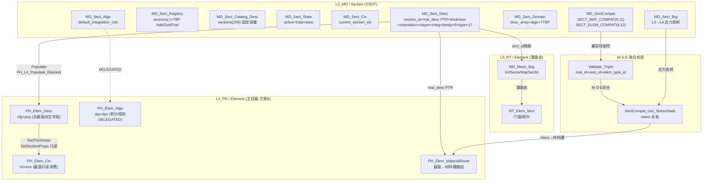

# 截面域：L3 / L4 / L5、四型、材料–单元–截面正交 — 合订（一体化设计）

**文档性质**：与 `**Material_L3L4L5_four_type_UMAT_discussion_synthesis.md`**（材料）、`**Element_L3L4L5_four_type_UEL_discussion_synthesis.md**`（单元 / UEL）并列的 **第三轴合订**；把 **截面（Section）** 作为 **与材料、单元正交的模型维**，写清 **L3 真源 → Populate → L4 消费 → L5 路由** 的分工、**四型** 裁剪与 **防双主源** 边界。  
**代码真源**：`ufc_core/L3_MD/Section/`（**L3-only SSOT**，见 `**L3_MD/Section/CONTRACT.md` v3.1**）；L4 消费锚点见 `**L4_PH/Element/CONTRACT.md**`（Material–Section–Element 热路径说明）；L5 网格桥 `**MD_Mesh_Brg**`（`InitSects`、`MapSectId` 等，见 `**L3_MD/Bridge/CONTRACT.md**`）。  
**报告 ID**：`REP-SECT-MES`；**命名与五场景（S0–S4）**：`REPORTS/REPORT_Naming_Quad_OnePager_FiveScenes.md` §1、§3。

**与跨域模板关系**：`**Pillar_L3L4L5_CrossLayer_Design_Template.md` §0**（材料–单元–截面正交维 vs P1–P6）；**§4.1** 表 **Material / Element** 行 **Populate** 列已含 `**sect_id**` 与 **本文 §9 S0** 指针（`**Pillar` §0.4**）。  
**一体化联动审查**：与 **材料合订本 §14.5、维护段**；**Element 合订本 §4、附录 B**；**本文附录 C** — **同议题同批次**改，避免 **Populate / UEL / `ntens**` 三角漂移。  
**一页填槽（主/辅四型、总分、Populate 主挂载）**：`**OnePager_FourKind_MasterAux_Nesting.md` §3.1**（截面列 + **R-08**）；**本文件 §3.5** 四型主/辅架构图解（L3四型全景+M-S-E数据流mermaid+防双主源）。

---

## 功能模块完整性公式

**完整功能模块 = 数据结构（四型TYPE：Desc/State/Algo/Ctx + Args）+ 过程算法（空间维度 + 时间维度 + 动作维度）**

- **数据结构侧**：`MD_Sect_Desc/State/Algo/Ctx` + 辅TYPE（`MD_Sect_Registry`, `MD_Sect_Catalog_Desc` 为 Desc 下的辅助容器） + `MD_Sect_Add/Validate/Get/GetByName/GetSummary_Arg`（SIO 边界 Arg）
- **过程算法侧**：Section 域**无独立热路径 Pipeline**（正交维设计决策）；`Validate_Triple`(M-S-E 兼容性校验) 为**动作维度**核心入口；L5 `RT_Sec_Stp_Ctl_Algo`（M-S-E 兼容/积分规则/查询策略）提供**时间维度** Populate 级控制
- **两则关系**：`MD_Sect_Algo`（`default_integration_rule` 单字段）是 L3 冷侧策略容器；R-12 在此应用方式为**委托给 Element**（方案 B：截面 L4 无独立域，策略参数嵌入 `PH_Elem_Algo`）
- **正交维特殊性**：截面不构成独立贯通柱，而是 M×E×S 正交第三轴；"完整功能"的定义必须同时对照 Material 和 Element 两柱的 Populate 消费点
- **本节与 `Section_Procedure_Algorithm.md**` 互补对照：后者展开 `Validate_Triple` 算法细节和 `RT_Sec_Stp_Ctl_Algo` 字段控制策略

---

## 0. 文档目的与范围


| 涵盖                                                                                                  | 不涵盖                                           |
| --------------------------------------------------------------------------------------------------- | --------------------------------------------- |
| 截面域在 **M×E×S 三维正交** 中的职责；与 **贯通域柱（P1–P6）**、**半域柱**、**L3 偏重域** 的关系                                   | 具体 **本构公式**、**完整壳方程** 推导                      |
| **L3** `MD_Sect_*` / `MD_Section_*` 四型与模块清单（与域合同一致）                                                 | 全仓库每一单元族的 **B 阵** 逐项实现说明                      |
| **Populate** 金线、**M-S-E** 三元校验、**应力态 / ntens** 与材料 `**PH_Mat_Update_Arg` / `PH_UMAT_Context**` 的衔接 | **UEL** 全刚度组装（见 **Element 合订本** + 材料 **§14**） |
| **L4/L5 目标态** 与 **防双四型主源**（类比材料 **§8.1c**）                                                          | 替代各层 `**CONTRACT.md**` 字段级真源                  |


---

## 1. 术语：贯通域柱、半域柱、截面正交维


| 术语              | 含义                                                                                  | 截面域在本文件中的定位                                                      |
| --------------- | ----------------------------------------------------------------------------------- | ---------------------------------------------------------------- |
| **贯通域柱（P1–P6）** | Material / Element / Contact / LoadBC / Output / WriteBack：**L3+L4+L5** 均有可指认域目录与金线 | 截面 **不替代** 其中任一柱的「主名」；在 **Populate** 上 **横切 Material + Element** |
| **半域柱**         | 某层无独立域或主体偏一端（例：**StepDriver** L3+L5，L4 无独立 Step 域）                                  | 截面 **当前** 更接近 **L3 偏重**：热路径多在 **单元侧 helper** 消纳                  |
| **正交维（M×E×S）**  | 三轴信息可独立变化：**同一材料卡 + 同一单元型** 仍可因 **厚度 / 取向 / 层合 / 梁截面几何** 不同而不同                      | **截面轴** 持有 **几何与引用索引**；**本构** 仍在材料轴；**离散与积分** 仍在单元轴              |


---

## 2. 三层职责总览（截面相关）

### 2.1 一句话

- **L3_MD / Section**：**截面定义 SSOT** —— 族/类型、`**material_ref`/`mat_id**`、厚度、取向、层数、积分规则、注册表；**M-S-E 兼容性** 与 **应力态查询**（`MD_SectCompat`、`MD_Sect_Brg`）。  
- **L4_PH**：**不存第二套截面 SSOT**；在 **Populate** 后将 **截面派生量** 写入 **单元缓存 / `PH_Elem_*` 上下文 / 材料路由入参**（见 `**PH_Elem_MaterialRoute**`、`PH_Elem_*_GetThickness` 等，以 `**L4_PH/Element/CONTRACT.md**` 为准）。  
- **L5_RT**：**网格 / 装配侧 ID 映射与薄路由**（例：`**RT_Elem_Sect**`、`**MD_Mesh_Brg**` `InitSects` / `MapSectId`）；**不做** 截面本构与 **不做** 形函数。

### 2.2 对照表


| 层         | 主要职责                          | 典型产物或类型（截面相关）                                                                                                    |
| --------- | ----------------------------- | ---------------------------------------------------------------------------------------------------------------- |
| **L3_MD** | 截面 Desc 真源、注册、校验、Legacy 同步    | `**MD_Sect_Desc**`、`**MD_Sect_Registry**`、`**MD_SectDesc**`、`**MD_Section_Domain**`、`**MD_Sect_Add_Arg**` … |
| **L4_PH** | 单元核消费截面参数；材料槽消费 **ntens/应力态** | `**PH_Elem_***` 配方 + `**PH_Elem_MaterialRoute**`；**（目标）** `PH_Sect_*` **仅当** 合同选定「独立 L4 截面域」                     |
| **L5_RT** | 运行时映射、装配门面                    | `**RT_Elem_Sect**`；`**RT_Mesh_Brg***` / `**MD_Mesh_Brg**` 与 sect_id                                              |


---

## 3. 材料 × 单元 × 截面：联合键与数据流

### 3.1 联合键（逻辑）


| 键                               | 典型来源                                         | 用途                                            |
| ------------------------------- | -------------------------------------------- | --------------------------------------------- |
| `**sect_id` / section 名**       | L3 `**MD_Section_Domain**` / elem→section 绑定 | 取 **厚度、取向、`mat_id**`                          |
| `**mat_id` / `mat_pt_idx**`     | L3 Material + L5 Dispatch                    | 本构槽与 **UMAT** 路由                              |
| `**elem_type_id` / family_id`** | L3 `**MD_Elem_*` + L4 配方**                   | **M-S-E** 校验、`**SectCompat_Get_StressState`** |


### 3.2 金线（与 `L3_MD/Section/CONTRACT.md` §5 一致）

```text
INP (*SOLID SECTION / *SHELL SECTION / *BEAM SECTION / …)
  → L6_AP / KeyWord 映射
  → MD_Section_Domain::Add（L3 冷存储）
  → MD_SectCompat::Validate_Triple（M-S-E）
  → MD_Sect_Brg（应力态 / ntens / Populate 硬错误拦截）
  → PH_L4_Populate_Element（或等价）将截面字段灌入单元/材料桥
  → PH_Elem_* 热路径 + PH_Elem_MaterialRoute（只读派生量）
```

### 3.5 四型主/辅架构图解（L3 / L4 / L5 全景）

> 下列与 `**MD_Sect_Def.f90**`（AUTHORITY）、`**L3_MD/Section/CONTRACT.md` v3.1** 对齐；字段变更以 .f90 / 合同为准。截面为 **L3 偏重正交维**：L4/L5 无独立域，四型在 L3 全景展开，L4/L5 仅列消费/映射角色。

#### 3.5.1 L3 四型主 TYPE（`MD_Sect_Def.f90` AUTHORITY）

```text
MD_Sect_Desc (主·Desc)                      ← SSOT / 冷真源
├── section_id       : INTEGER(i4)           ← 截面唯一标识
├── section_name     : CHARACTER(64)         ← 截面名称
├── mat_id           : INTEGER(i4)           ← 关联材料 ID
├── mat_desc         : CLASS(MD_Mat_Desc), POINTER  ← 材料真源 PTR (AssociateMat TBP)
├── thickness        : REAL(wp)              ← 厚度 (壳/膜)
├── orientation(3)   : REAL(wp)              ← 取向角
├── offset           : REAL(wp)              ← 偏移
├── nlayer           : INTEGER(i4)           ← 层数 (复合截面)
├── integ_npts       : INTEGER(i4)           ← 积分点数
├── integ_rule       : CHARACTER(16)         ← 积分规则
├── section_family   : INTEGER(i4)           ← 族 ID [1..9]
├── section_type     : INTEGER(i4)           ← 类型 ID [1..17]
├── is_initialized   : LOGICAL               ← 初始化标志
├── area             : REAL(wp)              ← 截面面积 (梁/桁)
├── valid            : LOGICAL               ← 有效性标志
└── TBP: InitBasic / InitComposite / AssociateMat / Validate / Nullify

MD_Sect_Registry (辅·Desc·注册表)            ← 动态注册
├── sections(:)      : ALLOCATABLE           ← 截面数组
├── nsections        : INTEGER(i4)
├── capacity         : INTEGER(i4)
└── TBP: Init / AddSection / GetSectIdx / FindByName / FindByMaterial / Clear

MD_Sect_Catalog_Desc (辅·Desc·固定目录)      ← 固定容量注册
├── sections(256)    : MD_Sect_Desc          ← 固定数组 (MD_SECTION_MAX)
└── n_sections       : INTEGER(i4)

MD_Sect_State (主·State)                    ← 域统计 / 温
├── active_sections  : INTEGER(i4)           ← 活跃截面数
├── total_sections   : INTEGER(i4)           ← 总截面数
└── total_section_area: REAL(wp)             ← 总截面面积

MD_Sect_Ctx (主·Ctx)                        ← 查询上下文 / 热
└── current_section_idx : INTEGER(i4)       ← 当前截面索引

MD_Sect_Algo (主·Algo)                      ← 冷侧配置
└── default_integration_rule : INTEGER(i4)  ← 默认积分规则

MD_Sect_Domain (域容器·Desc聚合)             ← 生命周期管理
├── desc_array(:)    : ALLOCATABLE           ← 截面描述数组
├── n_sections       : INTEGER(i4)
├── capacity         : INTEGER(i4)
├── algo             : MD_Sect_Algo
├── initialized      : LOGICAL
└── TBP: Init / Finalize / Add / Get / GetByName / Validate / GetSummary
```

#### 3.5.2 L4 四型（DELEGATED → 嵌入 `PH_Elem_*`，方案 B）

```text
L4 无独立截面域四型；截面参数由 Populate 灌入单元域消费：

PH_Elem_Desc (消费截面量的 L4 主·Desc)
└── cfg / pop 内含截面派生字段
    ├── sect_id → thickness / orientation / offset
    ├── mat_id → MaterialRoute 入参
    └── integ_npts / integ_rule → PH_Elem_Algo (DELEGATED)

PH_Elem_Ctx (消费截面量的 L4 主·Ctx)
└── lcl / evo 内含截面只读派生量
    ├── GetThickness() → desc 厚度只读
    └── SetSectionProps() → Populate 后只读消费

PH_Elem_State (L4 主·State)
└── 步内力学态不在截面域持主份 (TRIMMED / 派生)

PH_Elem_Algo (L4 主·Algo)
└── stp / dyn 承载截面积分规则 (DELEGATED)

PH_Elem_MaterialRoute (材料路由·截面桥)
└── 截面参数→材料槽路由入参 (只读消费)
```

> **防双主源**：L3 `MD_Sect_`* 全四型 + L4 `PH_Sect_*` 全四型 + `PH_Elem_*` 内嵌截面四型，三者 **禁止并列 Writable SSOT**（见 **§5**、材料 **§8.1c**）。

#### 3.5.3 L5 四型（DELEGATED → 映射/路由仅）

```text
L5 无独立截面域四型；仅提供 ID 映射与薄路由：

RT_Elem_Sect (单元运行时截面参数门面/探针)
├── GetThickness()   → 查询 L3 截面厚度
├── GetOrientation() → 查询 L3 截面取向
└── (行为以 L5_RT/Element/CONTRACT.md 为准)

MD_Mesh_Brg (网格桥·截面映射)
├── RT_Mesh_BrgInitSects()  → 初始化截面映射
└── RT_Mesh_BrgMapSectId()  → sect_id ↔ 运行时网格上下文

原则：L5 不复制 Voigt 级 stress；仅传递索引/厚度/取向元数据+错误状态
```

#### 3.5.4 SIO Arg 命名规范速查


| 层      | 主 TYPE           | Arg 命名模式                | 示例                                                                 |
| ------ | ---------------- | ----------------------- | ------------------------------------------------------------------ |
| **L3** | `MD_Sect_Domain` | `MD_Sect_<Verb>_Arg`    | `MD_Sect_Add_Arg`、`MD_Sect_Validate_Arg`                           |
| **L3** | `MD_Sect_Domain` | `MD_Sect_Get<Qual>_Arg` | `MD_Sect_Get_Arg`、`MD_Sect_GetByName_Arg`、`MD_Sect_GetSummary_Arg` |
| **L4** | (嵌入 `PH_Elem_`*) | `PH_Elem_<Verb>_Arg`    | 见 Element 合订本 §3.5.4                                               |
| **L5** | (嵌入 `RT_Elem_`*) | `RT_Elem_<Verb>_Arg`    | 见 Element 合订本 §3.5.4                                               |


#### 3.5.5 扩展四型与 ABI 镜像

```text
截面域无独立 ABI Mirror
├── celent / 厚度 / 取向 → 来自截面 + 单元联合，不引入第三 ABI
├── UEL 路径中 celent 与 MD_Sect_Desc 字段重叠时
│   → 须在合同定优先序（防双写）
└── 不引入 PH_Sect_UMAT / PH_Sect_UEL 之类第三 ABI
```

> **文档惯例**：截面域 **无 ABI Mirror**；UEL `celent`/厚度来自截面+单元联合查询，不构成独立 ABI 扁平包。见 **§8 第三行**。

#### 3.5.6 三层四型裁剪与 M-S-E 数据流对照（mermaid）




---

## 4. L3 现状：四型与模块（真源表）

> 下列与 `**ufc_core/L3_MD/Section/CONTRACT.md` §2–§4** 对齐；实现变更以合同为准。

### 4.1 四型裁剪（L3 域内）


| Kind      | L3 TYPE / 说明                                                                                   | 备注                                                                 |
| --------- | ---------------------------------------------------------------------------------------------- | ------------------------------------------------------------------ |
| **Desc**  | `**MD_Sect_Desc`**、`**MD_SectDesc**`、`**MD_Section_Catalog_Desc**`、`**MD_Sect_Registry**` | **SSOT**；`MD_Sect_Desc` 含 `**mat_desc` 指针** 与 **厚度/取向/层数/积分** |
| **State** | `**MD_Section_State`**                                                                         | 域级统计：`active_sections`、`total_section_area` 等                      |
| **Algo**  | `**SectionAlgo`**                                                                              | 默认积分规则等 **冷侧** 配置                                                  |
| **Ctx**   | `**MD_Section_Ctx`**                                                                           | `**current_section_idx**` 等查询上下文                                   |


### 4.2 模块清单（摘要）


| 文件                    | `MODULE`         | 角色                                                                       |
| --------------------- | ---------------- | ------------------------------------------------------------------------ |
| `MD_Sect_Def.f90`     | `MD_Sect_Def`    | **AUTHORITY**：族/类型常量、四型、Registry、`MD_Section_Domain` TBP、**SIO `*_Arg`** |
| `MD_Sect_Compat.f90`  | `MD_SectCompat`  | `**SECT_MAT_COMPAT` / `SECT_ELEM_COMPAT**`、`SectCompat_Get_StressState`  |
| `MD_Sect_Core.f90`    | `MD_Sect_Core`   | CRUD + `**Validate_Triple**`                                             |
| `MD_Sect_Mgr.f90`     | `MD_Sect_Mgr`    | Legacy 管理                                                                |
| `MD_Sect_Lib.f90`     | `MD_SectLib`     | `**UF_SectionDef**` 与库表                                                  |
| `MD_Sect_Brg.f90`     | `MD_Sect_Brg`    | L3→L4 **校验 / 应力态桥**                                                      |
| `MD_Sect_Domain.f90`  | `MD_SectDomain`  | 域容器再导出                                                                   |
| `MD_Sect_ionSync.f90` | `MD_SectionSync` | Legacy ↔ Domain 同步                                                       |
| `MD_Sect_Prop*.f90`   | `MD_PropMass` 等  | **质量 / 转动惯量** 等附加属性                                                      |


### 4.3 截面家族与类型码（9 族 × 17 类，摘要）


| 族 ID | 常量                                              | 说明                                                                                                       |
| ---- | ----------------------------------------------- | -------------------------------------------------------------------------------------------------------- |
| 1–9  | `**SECT_FAM_SOLID`** … `**SECT_FAM_CONNECTOR**` | 与 `**SECT_SOLID_3D**` … `**SECT_BEAM_GENERAL**` 等 **17** 个 `**SECT_*`** 类型码配合使用（见 `**MD_Sect_Def.f90**`） |


**详细表**：见域合同 **§「截面家族定义」**；单元族对照 **§「正交兼容性矩阵」**。

---

## 5. L4 策略：独立 `PH_Sect_*` vs 嵌入 `PH_Elem_*`（必须二选一主挂载）


| 方案                         | 内容                                                                                                                  | 适用                                                                           |
| -------------------------- | ------------------------------------------------------------------------------------------------------------------- | ---------------------------------------------------------------------------- |
| **A. 独立 `L4_PH/Section/`** | `**PH_Sect_Desc/Ctx/State/Algo**` + `**PH_L4_Populate_Section**`；单元核 `**USE**` 截面域只读接口                              | 截面逻辑 **复杂**（层合板、通用梁截面、多物理厚度场）且多处复用                                           |
| **B. 嵌入单元域（当前主流）**         | **无** 独立 `PH_Sect_*`；`**PH_L4_Populate_Element`** 把 L3 `**MD_Sect***` 压入 `**PH_Elem_Desc`/配方局部 / MaterialRoute 入参** | **与现有 `**PH_Elem_MaterialRoute`**、大量 `**GetThickness`/`SetSectionProps**` 一致 |


**防双主源（类比材料合订本 §8.1c）**：

- **禁止**：L3 `**MD_Sect_*` 全四型** 与 L4 `**PH_Sect_*` 全四型** 再与 `**PH_Elem_*` 内嵌截面四型** 三者 **并列 Writable SSOT**。  
- **允许**：L3 **唯一冷真源** + L4 **其一**为 **主挂载**（A 或 B），其余为 **只读视图 / ASSOCIATE 别名 / 窄 Args**。

**本一体化设计推荐（现阶段）**：**方案 B 为主挂载**；在 `**L4_PH/Element/CONTRACT.md`** 已出现的 **M–S–E 热路径** 上继续闭合；**仅当** 出现跨单元型大量重复的截面中间结果时，再 **抽 Phase** 引入 **方案 A** 并单独立合同版本。

---

## 6. L5 与网格桥：ID 映射与 `RT_Elem_Sect`


| 机制                 | 说明                                                                            |
| ------------------ | ----------------------------------------------------------------------------- |
| `**MD_Mesh_Brg`**  | `**RT_Mesh_BrgInitSects**`、`**RT_Mesh_BrgMapSectId**`：L3 `sect_id` ↔ 运行时网格上下文 |
| `**RT_Elem_Sect**` | 单元运行时 **截面参数门面 / 探针**（占位与行为以 `**L5_RT/Element/CONTRACT.md`** 为准）              |
| **原则**             | L5 **不复制** Voigt 级 `**stress`**；只传递 **索引、厚度、取向元数据、错误状态**                      |


---

## 7. 四型跨层裁剪表（目标态 + 当前态）


| Kind      | L3（当前）                  | L4（目标 / 当前）                                                      | L5（目标 / 当前）                      |
| --------- | ----------------------- | ---------------------------------------------------------------- | -------------------------------- |
| **Desc**  | **RETAINED** `MD_Sect*` | **DELEGATED→L3**（Populate 灌入）或 **RETAINED**（若采用 §5 方案 A）         | **DELEGATED**（仅索引/句柄）            |
| **State** | **RETAINED**（域统计）       | **TRIMMED / 派生**（步内力学状态 **不在** 截面域持主份）                           | **TRIMMED**                      |
| **Algo**  | **RETAINED**（默认积分规则等）   | **DELEGATED** 至 `**PH_Elem_Algo`** 或 **独立 `PH_Sect_Algo`**（方案 A） | **TRIMMED**                      |
| **Ctx**   | **RETAINED**（当前截面索引）    | **RETAINED** 在 **单元调用 ctx**（`PH_Elem_Ctx`）为主                     | **RETAINED** 在 Dispatch **元上下文** |


---

## 8. 与材料 / 单元合订本的衔接点


| 主题                           | 材料合订本                                             | 单元合订本                                  | 本文（截面）                                                                                         |
| ---------------------------- | ------------------------------------------------- | -------------------------------------- | ---------------------------------------------------------------------------------------------- |
| **应力态 / `ntens`**            | 附录 F、`**ndi`/`nshr**` 与 **S3**                    | *CAX/壳** Voigt 形状                      | `**SectCompat_Get_StressState`**：Section+Element → StressState                                 |
| **Populate**                 | `**PH_L4_Populate_Material`**                     | `**PH_L4_Populate_Element**`（合同）       | **M-S-E** 在 **冷路径** 闭合；`**MD_Section_Brg_Validate_Assignment`**                                |
| **用户子程序**                    | `**PH_UMAT_Context`**                             | `**PH_UEL_Context**`（目标）               | `**celent`/厚度/取向** 来自 **截面 + 单元** 联合；不引入 `**PH_Sect_UMAT`** 之类第三 ABI                           |
| **UEL 薄适配与截面**               | **§14.2**（`RT_Elem_UEL` 查 **截面注册表** → `mat_desc`） | **Element 合订 §1–§3**                   | `**sect_id`/`MD_Sect*`** 为 **冷真源**；`**MD_Elem_UEL_Desc`** 与截面字段 **重叠** 时须在合同定 **优先序**，防 **双写** |
| **双四型**                      | **§8.1c**                                         | **Element 合订 §4**                      | **§5** 与本表                                                                                     |
| **Procedure/Algorithm 专域合订** | `Material_Procedure_Algorithm.md` §2–§4           | `Element_Procedure_Algorithm.md` §2–§4 | `**Section_Procedure_Algorithm.md`** §2(Algo TYPE)、§4(无 Procedure Pointer 的设计依据)               |


---

## 9. 分阶段落地（纳入一体化设计）


| 阶段                   | 交付物                                                                                                                                                      | 验收                                                                      |
| -------------------- | -------------------------------------------------------------------------------------------------------------------------------------------------------- | ----------------------------------------------------------------------- |
| **S0（本文 + 合同对齐）**    | 三 REPORT + `**Pillar` §0 / §0.4 / §4.1** 交叉引用闭合；`**L4_PH/Element/CONTRACT.md` v2.2** **UEL U0** 与材料 **§14.4** 一字级对齐；`**Pillar` §0.3** 章纲与本文 **§0–§7** 一致 | 评审能通过 **「截面轴出现在 Populate 叙述」**（**§4.1 Material/Element Populate 列**已落实） |
| **S1（Populate 显式化）** | `**PH_L4_Populate_Element`**（或等价）文档与实现中列出 `**sect_id` → 字段清单**（厚度、取向、`mat_id`、积分点）                                                                       | Element **CONTRACT** 中 **M–S–E** 行与代码路径一致                               |
| **S2（热路径只读）**        | 所有 `**PH_Elem_*Get*Section*`** / `**PH_Elem_MaterialRoute**` **不得写回** L3 `MD_Sect*`                                                                      | Harness **负例**：热路径 **USE L3 深层写** 应失败于 CR / 合同                          |
| **S3（L5 映射硬化）**      | `**RT_Mesh_BrgMapSectId`** 与 `**RT_Elem_Sect**` 行为写清 **幂等 / 缺省 sect**                                                                                    | 与 `**MD_Mesh_Brg`** 合同互链                                                |
| **S4（可选：L4 独立截面域）**  | 仅当 **§5 方案 A** 评审通过：新建 `**L4_PH/Section/`** + `**PH_Sect_Def.f90**` + 三层合同 bump                                                                          | **DOMAIN_PILLAR_CARD** 升级为 **全贯通柱**                                     |


---

## 附录 A — M-S-E 校验入口速查


| 入口                                   | 模块              | 用途           |
| ------------------------------------ | --------------- | ------------ |
| `**SECT_MAT_COMPAT(9,11)`**          | `MD_SectCompat` | 截面族 × 材料族    |
| `**SECT_ELEM_COMPAT(9,12)**`         | `MD_SectCompat` | 截面族 × 单元族    |
| `**MD_Section_Validate_Triple**`     | `MD_Sect_Core`  | 三元组合法        |
| `**MD_Section_Brg_Get_StressState**` | `MD_Sect_Brg`   | **ntens** 派发 |


---

## 附录 B — 关键字 / INP → L3 行（占位扩展表）


| 关键字族（示例）                    | L3 落点                               | 备注                      |
| --------------------------- | ----------------------------------- | ----------------------- |
| `*SOLID SECTION`            | `MD_SectDesc` / `MD_Sect_Desc` | 与实体元绑定                  |
| `*SHELL SECTION` / 复合材料     | 厚度、`**nlayer`**、`orientation`       | 与 **材料合订本 S4** 衔接       |
| `*BEAM SECTION`             | 梁截面参数、`SECT_BEAM_*`                 | 与 **Element Beam** 合同衔接 |
| `*MASS` / `*ROTARY INERTIA` | `**MD_Prop*`**                      | 质量子域                    |


**机读扩展**：建议后续以 CSV 维护 `**keyword × MD_Sect* 字段 × Populate 目标字段`**，本附录只保留索引。

---

## 附录 C — 维护与同步清单

- `**L3_MD/Section/CONTRACT.md**`：任意 **四型 / 模块 / R1–R7** 变更 → 同步本文 **§4、§7、附录 A**。  
- `**Material_…` / `Element_…`**：凡 **Populate、ntens、厚度、UEL/UMAT 上下文** 变更涉及截面 → 同步本文 **§8** 与对端章节；**材料 §14.2 / §14.5** 与 **Element 附录 B** 与本文 **§8 第二行** 联动。  
- `**Pillar_L3L4L5_CrossLayer_Design_Template.md` §4.1 / §0.4**：**Material / Element** Populate 列与 **§0.4** 叙述；改动时同步 **本文 §9 S0** 指针仍有效。  
- **一体化审查清单（三 REPORT）**：① `**sect_id`** 是否出现在 **Populate** 叙述（Pillar §4.1 + Section §3）；② **UEL** 路径 `**celent`/厚度** 是否声明 **相对 `MD_Sect*`**（Section §8 + Material §14 + Element §4）；③ `**PH_UEL_*` / `PH_UMAT_***` 命名是否仍对偶（Element §6.3）。

---

*冷归档全文：`UFC/REPORTS/archive/Section_L3L4L5_four_type_synthesis.md`。入口 stub：`UFC/REPORTS/Section_L3L4L5_four_type_synthesis.md`。一体化设计并列（根 stub）：`Material_L3L4L5_four_type_UMAT_discussion_synthesis.md`、`Element_L3L4L5_four_type_UEL_discussion_synthesis.md`、`Pillar_L3L4L5_CrossLayer_Design_Template.md`。*
