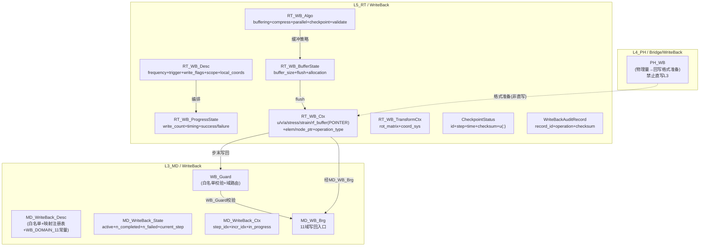

# 写回域：L3 / L5、四型、状态回写与 Checkpoint — 合订（一体化设计）

**文档性质**：与 **`Material_…`**（材料）、**`Element_…`**（单元/UEL）、**`Section_…`**（截面）、**`Contact_…`**（接触）、**`LoadBC_…`**（载荷/BC）、**`Output_…`**（输出）并列的 **P6 WriteBack 域柱合订**；把 **写回（WriteBack / WB）** 作为 **半贯通域柱**（L3+L5，L4 无独立域），写清 **L5 求解结果 → L3 模型树回写** 的唯一合法路径、**四型** 裁剪与 **白名单守卫** 机制。
**代码真源**：`ufc_core/L3_MD/WriteBack/`（L3 白名单管理 + 域路由分派，5 个 .f90，见 **`L3_MD/WriteBack/CONTRACT.md` v3.1**）；`ufc_core/L5_RT/WriteBack/`（L5 回写编排 + Checkpoint，6 个 .f90，见 **`L5_RT/WriteBack/CONTRACT.md` v2.0**）。
**报告 ID**：`REP-WB-PILLAR`；**命名与五场景（S0–S4）**：`REPORTS/REPORT_Naming_Quad_OnePager_FiveScenes.md` §1、§3。

**与跨域模板关系**：**`Pillar_L3L4L5_CrossLayer_Design_Template.md` §4.1** WriteBack 行；**一页填槽** **`OnePager_FourKind_MasterAux_Nesting.md` §3.3**；**本文件 §3.5** 四型主/辅架构图解（双State+全POINTER+白名单守卫+检查点+审计+mermaid）。
**一体化联动审查**：与 **Output 合订本 §8**（Output 与 WriteBack 的保存协调）；**所有域柱**（WriteBack 是各域 L3 状态更新的唯一通道）— **同议题同批次**改。  
**外部手册锚点（只读核对）**：**`REPORTS/REPORT_Naming_Quad_OnePager_FiveScenes.md` §6**；优先 **`KEYWORD.pdf`**（`*RESTART`、`*IMPORT`、`*STEP`… 与结果/模型回传相关关键字族）、**`ANALYSIS_2.pdf`**（*Vol.II* 与 **restart / 作业控制** 相关章节，以书签检索为准）、**`USER.pdf`**（若存在 **模型回写/子程序侧** 钩子再逐项对账）；**`ANALYSIS_5.pdf`** 仅在 **约束与交互** 与回写白名单交界时作辅证。

---

## 功能模块完整性公式

**完整功能模块 = 数据结构（四型TYPE：Desc/State/Algo/Ctx + Args）+ 过程算法（空间维度 + 时间维度 + 动作维度）**

- **数据结构侧**：`RT_WB_Desc` / `RT_WB_ProgressState`(回写进度) / `RT_WB_BufferState`(缓冲状态) / `RT_WB_Algo`(回写策略) / `RT_WB_Ctx`(全POINTER预分配) + 辅TYPE（`RT_WB_TransformCtx`, `CheckpointStatus`, `WriteBackAuditRecord`）+ `RT_WB_Stp_Ctl_Algo`(触发/策略/验证 P2) + `RT_WB_Itr_Algo`(缓冲/压缩/审计 P2) + `RT_WBProc`(SIO 5组)
- **过程算法侧**：WB_Guard 管道（AttachBuffers → WBImpl 编排 → MD_WB_Brg 11域分派 → Audit）为**动作维度**——`RT_WB_Stp_Ctl_Algo`（时间维度步级触发/策略/验证）+ `RT_WB_Itr_Algo`（迭代级缓冲/压缩/审计）驱动全管道
- **两则关系**：`RT_WB_Algo` 同时是四型并列中的第四槽（数据结构侧）和 WB_Guard 管道的策略容器（过程算法侧，R-12）；双 State（Progress/Buffer）体现了 WB_Guard 管道的两大产出——回写进展与缓冲水位
- **半贯通特殊性**：L4 无独立 WriteBack 域——L4 禁直写 L3（WB-02），物理量→回写格式准备经 `PH_WB` Bridge 嵌入 L5 编排；这意味着过程算法的动作维度（11域分派 + WB_Guard 白名单校验）全部在 L3+L5 完成
- **本节与 `WriteBack_Procedure_Algorithm.md`** 互补对照：后者展开 `Stp_Ctl_Algo`/`Itr_Algo` 字段细节、WB_Guard 管道的步骤级时序和白名单校验策略

---

## 0. 文档目的与范围

| 涵盖 | 不涵盖 |
|------|--------|
| WriteBack 域在 **P6 半贯通柱** 中的职责；L3/L5 分工 | 具体 **序列化格式** 的二进制细节 |
| **L3** `MD_WB_*` 四型与白名单机制 | 全仓库每一个 **回写字段** 的字段级映射 |
| **L5** `RT_WB_*` 四型与 Checkpoint 机制 | **Output** 域的输出请求/格式化写入（见 Output 合订本） |
| **防双主源** 与 **白名单守卫** | **L4 物理计算** 的具体实现 |

---

## 1. 术语：半贯通柱、写回/输出分界、白名单守卫

| 术语 | 含义 | WriteBack 域在本文件中的定位 |
|------|------|-------------------------------|
| **半贯通柱（P6）** | WriteBack：**L3+L5** 有独立域目录，**L4 无独立域** | WriteBack 为 **半贯通柱**；L4 侧不直接写 L3 |
| **唯一合法路径** | L5→L3 的状态变异 **仅** 经 WriteBack 白名单守卫 | 任何 L4/L5 代码直写 L3 为 **架构违规** |
| **白名单守卫** | `WB_Guard`：仅白名单内字段可写入 L3 | 白名单外字段写入尝试为 **FATAL** 级错误 |
| **写回 vs 输出** | WriteBack = 「写回 L3 模型树」；Output = 「格式化写出文件」 | WriteBack 更新 L3 State；Output 写出 VTK/HDF5/ODB |

---

## 2. 三层职责总览（WriteBack 相关）

### 2.1 一句话

- **L3_MD / WriteBack**：**白名单管理与域路由分派** —— 定义允许回写的域与字段（`WB_DOMAIN_*`）、白名单校验（`WB_Guard`）、域路由分派（Step/Amplitude/LoadBC/Mesh/Model/Interaction/Output）、NaN 检查与截断；**不做** 物理量计算。
- **L4_PH**：**不直接写 L3** —— L4 物理计算结果经 L5 转发，由 WriteBack 域执行回写；L4 侧有 `PH_WB` Bridge 辅助数据准备。
- **L5_RT / WriteBack**：**回写编排 + Checkpoint** —— 位移/应力/应变/SDV 回写、GP→节点外推、Checkpoint 保存/加载/回滚、审计机制；**不定义** 白名单、**不做** 文件 I/O。

### 2.2 对照表

| 层 | 主要职责 | 典型产物或类型 |
|----|----------|---------------|
| **L3_MD** | 白名单管理、域路由分派、写回守卫 | **`MD_WriteBack_Desc/State/Ctx`**、**`MD_WriteBack_Entry`**、**`MD_WB_Brg`**（分派桥） |
| **L4_PH** | 数据准备（Bridge 辅助） | `PH_WB`（物理量→回写格式准备） |
| **L5_RT** | 回写编排、Checkpoint、审计 | **`RT_WB_Desc`**、**`WriteBackCtx`**、**`CheckpointStatus`**、**`RT_WriteBack_Domain`**（金线） |

---

## 3. 三层数据流：求解完成 → 回写 → L3 更新

### 3.1 回写金线（步末/检查点）

```text
L5_RT 求解完成（步末/检查点）
  → MD_WB_SetContainer(l3_container)  // L5 设置 L3 容器指针
  → MD_WB_Step/Mesh/Output/...       // 按域分派写回
    → WB_Guard(白名单校验)            // 校验字段是否允许
    → g_l3%desc%<domain>%WriteBack*(...) // 经 MD_L3_LayerContainer%desc 路由
```

### 3.2 Checkpoint 金线

```text
RT_WriteBack_Domain
  → SaveCheckpoint(状态序列化 + Checksum)
  → LoadCheckpoint(反序列化 + 验证)
  → RollbackToCheckpoint(回滚到保存点)
```

### 3.3 逻辑链

```text
L5 Commit → RT_WBImpl → MD_WB_Brg (白名单守卫 + 域路由) → MD_L3_LayerContainer%desc%<domain>%WriteBack
```

### 3.4 数据链

```text
L5 State(温) → WriteBack 白名单 → L3 Mesh/Material/Step/Output State(温)
```

---

## 3.5 四型主/辅架构图解（L3 / L5 全景，L4 Bridge 辅助）

> 下列与 **`RT_WB_Def.f90`**（AUTHORITY）、**`MD_WB_Def.f90`** 对齐；字段变更以 .f90 为准。WriteBack 为 **半贯通柱**，L4 无独立域（禁止直写 L3）。

### 3.5.1 L5 四型主 TYPE 与辅 TYPE 嵌套（`RT_WB_Def.f90` AUTHORITY）

```text
RT_WB_Desc (主·Desc)              ← DELEGATED → L3 白名单聚合
├── runtime_id      : INTEGER(i4)       ← 运行时实例 ID
├── wb_label        : CHARACTER(64)     ← 写回配置标签
├── write_frequency : INTEGER(i4)       ← 写回频率 (每 N 增量)
├── write_trigger   : INTEGER(i4)       ← RT_WB_WRITE_EVERY_INC/STEP_END/USER_DEFINED
├── write_displacement : LOGICAL        ← 位移写回开关
├── write_velocity / write_acceleration : LOGICAL ← 速度/加速度 (动态分析)
├── write_stress / write_strain / write_reaction : LOGICAL
├── write_contact_force : LOGICAL       ← 接触力写回
├── output_scope    : INTEGER(i4)       ← RT_WB_SCOPE_ALL/SUBSET
├── output_node_ids(:) : INTEGER(i4), POINTER ← 输出节点子集
├── output_element_ids(:) : INTEGER(i4), POINTER
├── use_local_coords : LOGICAL         ← 局部坐标系开关
├── local_coord_sys_id : INTEGER(i4)   ← 局部坐标系 ID
├── is_initialized / is_active : LOGICAL
  CONTAINS: Init / SetOutputFields / SetScope

RT_WB_ProgressState (主·State·进度)    ← 写回执行状态
├── last_write_step / last_write_increment : INTEGER(i4)
├── total_writes / current_write_count : INTEGER(i4)
├── n_nodes_written / n_elements_written / n_gp_written / n_total_dofs : INTEGER(i4)
├── last_write_time / write_elapsed / avg_write_time : REAL(wp)
├── last_write_successful : LOGICAL
├── n_write_failures : INTEGER(i4)
└── last_error_status : ErrorStatusType
  CONTAINS: Init / Reset / UpdateProgress / RecordWriteTime

RT_WB_BufferState (主·State·缓冲)     ← 缓冲管理状态
├── node/elem/gp_buffer_size : INTEGER(i4)
├── nodes/elements/gps_in_buffer : INTEGER(i4)
├── buffer_needs_flush : LOGICAL
├── flush_threshold : INTEGER(i4)       ← 1000
├── total_allocations/deallocations / active_buffers : INTEGER(i4)
├── buffers_allocated : LOGICAL
└── status : ErrorStatusType
  CONTAINS: Init / Reset / CheckFlush

RT_WB_Algo (主·Algo)                   ← 缓冲/压缩/检查点控制
├── use_node/elem_buffering : LOGICAL
├── node/elem_buffer_capacity : INTEGER(i4) ← 10000/5000
├── compress_output : LOGICAL
├── compression_level : INTEGER(i4)    ← 1-9 (6)
├── use_parallel_write : LOGICAL
├── n_write_threads : INTEGER(i4)
├── batch_small_writes : LOGICAL
├── batch_threshold : INTEGER(i4)      ← 100
├── save_checkpoint_on_write : LOGICAL
├── checkpoint_interval : INTEGER(i4)  ← 10
├── validate_before_write : LOGICAL
└── checksum_enabled : LOGICAL
  CONTAINS: Init / SetBufferStrategy

RT_WB_Ctx (主·Ctx)                    ← 热路径写回上下文 (预分配, 禁 ALLOCATABLE)
├── u_buffer(:) / v_buffer(:) / a_buffer(:) : REAL(wp), POINTER ← 位移/速度/加速度
├── stress_buffer(:) / strain_buffer(:) / rf_buffer(:) : REAL(wp), POINTER
├── work_array(:) / temp_vector(:) : REAL(wp), POINTER
├── elem_stress(:) / elem_strain(:) : REAL(wp), POINTER ← 当前单元
├── current_elem_id / current_gp_id : INTEGER(i4)
├── node_disp(:) / node_react(:) : REAL(wp), POINTER ← 当前节点
├── current_node_id : INTEGER(i4)
├── buffer_size / buffer_offset : INTEGER(i4)
├── buffer_needs_flush : LOGICAL
├── operation_type : INTEGER(i4)       ← RT_WB_TARGET_*
├── field_type : INTEGER(i4)           ← RT_WB_FIELD_*
└── n_items_to_write : INTEGER(i4)
  CONTAINS: AttachBuffers / ClearBuffers / FlushBuffer / Detach
```

### 3.5.2 辅 TYPE（`RT_WB_Def.f90`）

```text
RT_WB_TransformCtx (辅·坐标变换)      ← 全局↔局部坐标变换
├── rot_matrix(3,3) / inv_rot_matrix(3,3) : REAL(wp)
├── rotation_available : LOGICAL
├── coord_sys_type : INTEGER(i4)       ← 0=Cartesian, 1=Cylindrical, 2=Spherical
├── coord_sys_id : INTEGER(i4)
├── n_transform_nodes : INTEGER(i4)
├── transform_node_ids(:) : INTEGER(i4), POINTER
├── temp_global(3) / temp_local(3) : REAL(wp)
├── transformation_active : LOGICAL
└── status : ErrorStatusType
  CONTAINS: Init / SetRotation / TransformVector / Reset

CheckpointStatus (辅·检查点)          ← 检查点状态 (RT_WB_Domain.f90)
├── id / step / increment / iteration : INTEGER(i4)
├── time / checksum : REAL(wp)
├── valid : LOGICAL
├── filepath : CHARACTER(256)
└── u(:) : REAL(wp), ALLOCATABLE

WriteBackAuditRecord (辅·审计)        ← 回写审计记录 (RT_WB_Domain.f90)
├── record_id / operation_type / target_step : INTEGER(i4)
├── timestamp / data_checksum : REAL(wp)
├── success : LOGICAL
```

### 3.5.3 L3 四型主 TYPE（`MD_WB_Def.f90` AUTHORITY）

```text
MD_WriteBack_Desc (主·Desc)            ← SSOT / 白名单 + 映射注册表
├── MD_WriteBack_Entry                ← 白名单条目 (domain_id + field_name + allowed)
├── MD_WriteBack_Target               ← 写回目标索引
├── MD_WBMapEntry                     ← source→target 映射
└── WB_DOMAIN_* 常量 (11 域)          ← 1=STEP, 2=AMPLITUDE, 3=LOADBC, 4=MESH, 5=MODEL, ...

MD_WriteBack_State (主·State)          ← active / n_completed / n_failed / current_step
MD_WriteBack_Ctx (主·Ctx)             ← step_idx / incr_idx / in_progress
MD_WB_Brg (主·Brg)                    ← L5→L3 分派桥接
├── Init / Finalize_API
├── SetContainer
├── WB_Guard (白名单校验)
└── 11 域写回入口: MD_WB_Step/Amplitude/LoadBC/Mesh/NodePos/NodeDisp/NodeVel/NodeAcc/ElemStress/Model/Interaction/Output
```

### 3.5.4 L4 Bridge 辅助

```text
PH_WB (Bridge·L4)                    ← 物理量→回写格式准备
└── 物理量格式化 / NaN 截断

> WB-02 硬规则：L4 禁止直写 L3，须经 L5 转发。
```

### 3.5.5 辅 TYPE 命名规范速查

| 层 | 主 TYPE | 辅 TYPE 命名模式 | 示例 |
|----|---------|-----------------|------|
| **L5** | `RT_WB_Desc` | `RT_WB_<Sub>_<Kind>` | `RT_WB_ProgressState`、`RT_WB_BufferState` |
| **L5** | `RT_WB_Algo` | `RT_WB_TransformCtx` (辅独立命名) | 坐标变换上下文 |
| **L5** | `RT_WB_Ctx` | 扁平 POINTER 缓冲 | `u_buffer`/`stress_buffer`/`work_array` |
| **L5** | `RT_WriteBack_Domain` (金线) | `CheckpointStatus` / `WriteBackAuditRecord` | 检查点+审计 |
| **L3** | `MD_WB_Def` | `MD_WriteBack_<Kind>` / `MD_WBMapEntry` | `MD_WriteBack_Desc/Entry/Target/Ctx/State` |
| **L3** | `MD_WB_Brg` | `MD_WB_<Domain>` | `MD_WB_Step`、`MD_WB_Mesh`、`MD_WB_LoadBC`... |

### 3.5.6 L3↔L5 四型嵌套对照（mermaid）



---

### 3.5.7 用户写回子程序 ABI 镜像对偶（UEXTERNALDB / STATEV / PUTVRM）

> 与 Output `PH_UVARM_Context`（ABI_Flat）、材料 `PH_UMAT_Context`（ABI_Flat）对偶，WriteBack 域的 ABAQUS 原生写回机制为**三级体系**，映射方式需区分：**积分点级**（STATEV 自动写回）、**全局流程级**（UEXTERNALDB 生命周期钩子）、**结果文件级**（URDFIL+PUTVRM ODB 写回）。

#### 3.5.7a UEXTERNALDB（全局生命周期钩子，核心 WriteBack 接口）

**接口原型**：

```fortran
      SUBROUTINE UEXTERNALDB(LOP, LRESTART, TIME, DTIME, KSTEP, KINC)
```

| UEXTERNALDB 参数 | UFC 四型归属 | 说明 |
|-------------------|-------------|------|
| `LOP` | `RT_WriteBack_Domain` 生命周期触发 | 0=分析开始, 1=增量开始, **2=增量结束(WriteBack最佳位置)**, 3=分析结束, 4=重启动 |
| `LRESTART` | `RT_WB_Algo%save_checkpoint_on_write` | =1 重启动模式 |
| `TIME(2)` | `RT_WB_Ctx%step_time/total_time` | 总时间/步时间 |
| `DTIME` | `RT_WB_Ctx%time_increment` | 时间步长 |
| `KSTEP,KINC` | `MD_WriteBack_Ctx%step_idx/incr_idx` | 分析步/增量步号 |

**LOP→UFC WriteBack 生命周期映射**：

| LOP | ABAQUS 含义 | UFC WriteBack 触发点 | 对应 TBP/机制 |
|-----|-------------|---------------------|-------------|
| 0 | 分析开始 | `RT_WriteBack_Domain%Init` | 白名单注册+容器挂载 |
| 1 | 增量开始 | （不触发写回） | 预分配缓冲区 |
| **2** | **增量结束（收敛后）** | **`RT_WriteBack_Domain%WriteState`** | **L5→L3 唯一合法写回路径 (WB-01)** |
| 3 | 分析结束 | `RT_WriteBack_Domain%Finalize` | 审计+文件关闭 |
| 4 | 重启动 | `RT_WriteBack_Domain%LoadCheckpoint` | Checksum 验证+状态恢复 |

> **ABI 镜像命名**：`PH_UEXTDB_Context`（文档名 ABI_Flat，≠ `RT_WB_Ctx`）

#### 3.5.7b STATEV 自动写回（积分点级，UMAT/VUMAT 托管）

**机制**：ABAQUS 对积分点状态变量采用「求解器托管+自动写回」：
- 增量步开始：求解器把上一步收敛的 `STATEV` 自动读入子程序
- 子程序计算：更新 `STATEV`（塑性/损伤/磨损等）
- 增量步结束：求解器**自动把新 STATEV 写回全局数据库**，供下一步/重启动使用
- 收敛失败：自动丢弃不收敛的 `STATEV`，回退到上一步收敛状态（**事务性回滚**）

| STATEV 机制 | UFC WriteBack 映射 | 说明 |
|-------------|-------------------|------|
| `STATEV(NSTATV)` 自动持久化 | `MD_WB_Material` → SDV 回写 | 详见**材料合订本 §14** |
| `*DEPVAR` 关键字 | `MD_Mat_User_Desc%nstatv` | 状态变量个数声明 |
| 收敛失败自动回滚 | `RT_WriteBack_Domain%RollbackToCheckpoint` | 事务性写回保证 |

> **不重复材料合订本**：STATEV 自动写回的完整原型和参数映射见材料合订本 §14 + 附录 G.0；本节仅标注 WriteBack 侧交叉引用。

#### 3.5.7c PUTVRM ODB 结果写回（结果文件级）

**接口原型**：

```fortran
      CALL PUTVRM(NAME, ARRAY, JRRAY, FLGRAY, JMAC, JMATYP, MATLAYO, LACCFLA)
```

| PUTVRM 参数 | UFC 四型归属 | 说明 |
|-------------|-------------|------|
| `NAME` | `RT_Writer_ODB` 输出变量标识 | 写回 ODB 的场变量名（如 'WEAR'） |
| `ARRAY` | `RT_Out_Frame%field_var_data` → `RT_Writer_ODB` | 写回数据数组 |
| `JRRAY` | `PH_Out_Brg` 整数缓冲 | 整型伴随数据 |

> **与 Output 域分界**：`GETVRM`（读 ODB）属 Output 域（见 Output 合订本 §3.5.7a URDFIL）；`PUTVRM`（写回 ODB）属 WriteBack 域——但两者在 `URDFIL` 子程序内成对调用，**须合同指定优先序**。

> **ABI 镜像命名**：`PH_PUTVRM_Context`（文档名 ABI_Flat，≠ `RT_WB_Ctx`）

#### 3.5.7d 三级写回选型表

| 需求 | ABAQUS 机制 | UFC WriteBack 路径 |
|------|------------|-------------------|
| 积分点状态持久化/重启动 | **STATEV 自动写回**（UMAT/VUMAT） | `MD_WB_Material`（见材料合订本 §14） |
| 全局数据写回外部文件/数据库 | **UEXTERNALDB**（LOP=2 增量结束） | `RT_WriteBack_Domain%WriteState` + `MD_WB_Brg` 分派 |
| 结果写回 ODB（后处理可见） | **URDFIL+PUTVRM** | `RT_Writer_ODB` + `RT_Out_Frame` |
| 分析流程控制/提前终止 | URDFIL(`LSTOP`) | `RT_WB_Ctx%operation_type` + WB-04(步末约束) |
| 重启动恢复 | UEXTERNALDB(LOP=4) | `RT_WriteBack_Domain%LoadCheckpoint` + Checksum |

#### 3.5.7e 防双写约束

1. **UEXTERNALDB 不直写 L3**：外部文件/数据库写回 **≠** L3 模型树回写；L3 写回须经 `MD_WB_Brg` + `WB_Guard`（WB-02）。2. **PUTVRM 写回 ODB ≠ WriteBack 写回 L3**：两者目标不同（ODB vs 模型树），须分属 Output/WriteBack 不同调度链。3. **STATEV 双写风险**：UMAT 更新 STATEV 后又被 UVARM 输出 + PUTVRM 写回 ODB，须合同指定优先序（防同帧多写）。4. **LOP=2 时序**：UEXTERNALDB(LOP=2) 须在 `RT_WriteBack_Domain%WriteState` **之后**调用（确保 L3 State 最新后再写外部文件）。

---

## 4. L3 现状：四型与模块（真源表）

> 下列与 **`L3_MD/WriteBack/CONTRACT.md` v3.1** 对齐；实现变更以合同为准。

### 4.1 四型裁剪（L3 域内）

| Kind | L3 TYPE / 说明 | 备注 |
|------|----------------|------|
| **Desc** | **`MD_WriteBack_Desc`**（写回映射注册表）、**`MD_WriteBack_Entry`**（白名单条目）、**`MD_WriteBack_Target`**（写回目标索引）、**`MD_WBMapEntry`**（source→target 映射） | **SSOT**；白名单枚举 + 映射 |
| **State** | **`MD_WriteBack_State`** | active, n_completed, n_failed, current_step |
| **Algo** | （隐式：校验/路由逻辑在 `MD_WB_Brg` 中） | `WB_Guard` 白名单校验 + 域路由 |
| **Ctx** | **`MD_WriteBack_Ctx`** | step_idx, incr_idx, in_progress |

### 4.2 域分类常量（`WB_DOMAIN_*`）

| 常量 | ID | 说明 |
|------|----|------|
| `WB_DOMAIN_STEP` | 1 | 步状态回写 |
| `WB_DOMAIN_AMPLITUDE` | 2 | 幅值回写 |
| `WB_DOMAIN_LOADBC` | 3 | 载荷/BC 回写 |
| `WB_DOMAIN_MESH` | 4 | 网格回写（节点位移/坐标/速度/加速度） |
| `WB_DOMAIN_MODEL` | 5 | 模型状态回写 |
| `WB_DOMAIN_INTERACTION` | 6 | 接触状态回写 |
| `WB_DOMAIN_OUTPUT` | 7 | 输出状态回写 |
| `WB_DOMAIN_ASSEMBLY` | 8 | 装配回写 |
| `WB_DOMAIN_CONSTRAINT` | 9 | 约束回写 |
| `WB_DOMAIN_MATERIAL` | 10 | 材料回写 |
| `WB_DOMAIN_SECTION` | 11 | 截面回写 |

### 4.3 模块清单

| 文件 | `MODULE` | 角色 |
|------|----------|------|
| `MD_WB_Def.f90` | `MD_WB_Def` | **AUTHORITY**：白名单类型 + WB_DOMAIN_* 常量 |
| `MD_WB_Core.f90` | `MD_WB_Core` | 映射管理（Register_Map/Get_Map/Validate/Execute） |
| `MD_WB_Domain.f90` | `MD_WBDomain` | SIO 域逻辑（AddEntry/IsAllowed/GetSummary） |
| `MD_WB_Mgr.f90` | `MD_WBMgr` | 白名单管理器（Init/Register/IsAllowed/Finalize） |
| `MD_WB_Brg.f90` | `MD_WB_Brg` | **L5→L3 分派桥接**（11 域写回入口） |

### 4.4 L3 Bridge 写回入口速查

| 入口 | 目标域 |
|------|--------|
| `MD_WB_Step` | Step 状态（currentTime/Inc/Iter） |
| `MD_WB_Amplitude` | 幅值 |
| `MD_WB_LoadBC` | 载荷/BC |
| `MD_WB_Mesh` | Mesh（currentDOF） |
| `MD_WB_Mesh_NodePos/NodeDisp/NodeVel/NodeAcc` | 节点场量 |
| `MD_WB_Mesh_ElemStress` | 单元应力 |
| `MD_WB_Model` | 模型状态（isBuilt, build_timestamp） |
| `MD_WB_Interaction` | 接触状态 |
| `MD_WB_Output` | 输出状态 |

---

## 5. L5 现状：四型与编排

### 5.1 四型 (`RT_WB_Def.f90`)

| 四型 | TYPE 名称 | 核心字段 | 说明 |
|------|-----------|----------|------|
| **Desc** | `RT_WB_Desc` | 回写变量列表、映射规则、汇总策略 | TBP: Init/SetOutputFields/SetScope |
| **State** | `CheckpointStatus` | Checkpoint 状态 | 保存/加载/回滚 |
| | `WriteBackAuditRecord` | 审计记录 | 回写审计 |
| **Algo** | （内嵌） | WBAlgo_Init/SetBufferStrategy | 外推算法/平滑策略/缓冲策略 |
| **Ctx** | `WriteBackCtx` | 回写上下文、内存池、并行分区 | Buffer attach/clear/flush |

### 5.2 金线容器 (`RT_WriteBack_Domain` TBP)

| TBP | 说明 |
|-----|------|
| `%Init` / `%Finalize` | 生命周期 |
| `%WriteState` | 状态回写 |
| `%NodePos/NodeDisp/ElemStress/ElemStrain/ElemEplas/NodeAccel/GPStateVar/CurrentTime` | 变量级回写 |
| `%SaveCheckpoint` / `%LoadCheckpoint` / `%RollbackToCheckpoint` | Checkpoint 管理 |
| `%ValidateWriteBack` / `%AuditWriteBack` | 一致性验证 + 审计 |

### 5.3 金线模块

| 文件 | MODULE | 角色 |
|------|--------|------|
| `RT_WB_Def.f90` | `RT_WB_Def` | **AUTHORITY**：四型定义 + 辅助 TYPE |
| `RT_WB_Domain.f90` | `RT_WBDomain` | **GOLDEN-LINE**：域逻辑容器 |
| `RT_WB_Impl.f90` | `RT_WBImpl` | 回写实现 + 主应力/VonMises 计算 |
| `RT_WB_Proc.f90` | `RT_WBProc` | SIO 过程封装（5 组 _In/_Out） |
| `RT_WB_Brg.f90` | `RT_WriteBack_Brg` | FromL5/ToL4/ToL3 桥接 |

---

## 6. 四型跨层裁剪表（目标态 + 当前态）

| Kind | L3（当前） | L5（目标 / 当前） |
|------|------------|-------------------|
| **Desc** | **RETAINED**（白名单 + 映射注册表 SSOT） | **DELEGATED→L3**（`RT_WB_Desc` 聚合 L3 白名单引用） |
| **State** | **RETAINED**（`MD_WriteBack_State`：n_completed/n_failed） | **RETAINED**（`CheckpointStatus`/`WriteBackAuditRecord`：执行状态/审计） |
| **Algo** | **RETAINED**（`WB_Guard` 校验 + 域路由逻辑） | **TRIMMED**（外推/平滑策略内嵌在实现中） |
| **Ctx** | **RETAINED**（`MD_WriteBack_Ctx`：step_idx/incr_idx） | **RETAINED**（`WriteBackCtx`：内存池/并行分区） |

**半柱分类**：P6 WriteBack 为 **L3+L5 半贯通柱**，L4 无独立域。L4 物理计算结果经 L5 转发至 L3。

---

## 7. 架构约束（硬规则）

| ID | 规则 | 来源 |
|----|------|------|
| **WB-01** | WriteBack 为 **唯一合法** 的 L3 步内变异路径 | `L3_MD/WriteBack/CONTRACT.md` §5 |
| **WB-02** | **禁止** L4 直接写 L3，须经 L5 转发 | R-06 (禁止双主源) |
| **WB-03** | 白名单外字段写入尝试为 **FATAL** 级错误 | `MD_WB_Brg` WB_Guard |
| **WB-04** | 写回时机仅在 **步末/检查点** | 低频约束 |
| **WB-05** | NaN 检查与截断：NaN 值截断为零 + WARNING | `MD_WB_Brg` |

---

## 8. 与 Output 域的边界

| 主题 | WriteBack 域 | Output 域 |
|------|--------------|-----------|
| **核心职责** | 计算结果→L3 模型树回写 | 输出请求编排 + 格式化写入 |
| **触发时机** | 步末/检查点 | 步末/时间点/步末/分析结束 |
| **数据方向** | L5→L3（模型树状态更新） | L5→文件（VTK/HDF5/ODB/ASCII） |
| **L3 角色** | 回写目标（State 更新） | 请求定义（Desc SSOT） |
| **共同消费者** | StepDriver 触发 | StepDriver 触发 |
| **Procedure/Algorithm 专域合订** | **`WriteBack_Procedure_Algorithm.md`** §2(Algo TYPE)、§3(WB_Guard 管道)、§4(Procedure Pointer 说明) | `Output_Procedure_Algorithm.md` §2–§4 |

**关键约束**：WriteBack 域 **不定义** 输出请求；Output 域 **不写回** L3 模型树。两者在步末由 StepDriver **分别**调度（WriteBack 先于 Output，确保 L3 State 最新后再输出）。

---

## 9. 与其他合订本的衔接点

| 主题 | 材料合订本 | 单元合订本 | Output 合订本 | 本文（WriteBack） |
|------|------------|------------|---------------|-------------------|
| **回写目标** | `MD_WB_Material`（应力/SDV） | `MD_WB_Mesh_ElemStress`（单元应力） | `MD_WB_Output`（输出状态） | L3 白名单定义各域回写目标 |
| **热路径约束** | IP 零 L3 扫库 | IP 零直扫 L3 Mesh | 步末非热路径高频 | 步末调用（非热路径高频） |
| **防双主源** | L4 不直写 L3 | L4 不直写 L3 | — | WriteBack 为 L3 唯一写入通道 |
| **Checkpoint** | 材料状态可序列化 | 单元状态可序列化 | Restart 文件 | `RT_WriteBack_Domain%Save/Load/RollbackCheckpoint` |

---

## 10. 分阶段落地（纳入一体化设计）

| 阶段 | 交付物 | 验收 |
|------|--------|------|
| **S0（本文 + 合同对齐）** | 本合订本文 + L3/L5 合同交叉引用 | 评审能通过「WriteBack 为 L3 唯一写入通道」 |
| **S1（白名单审计增强）** | 各域回写字段机读表（JSON/CSV） | 与 `MD_WB_Brg` 入口一一对应 |
| **S2（Checkpoint 一致性验证）** | `ValidateWriteBack` 在步末自动执行 | 数据不丢失、Checksum 验证通过 |
| **S3（OnePager 填槽）** | WriteBack 域填槽行写入 OnePager | 与 Pillar §4.1 对齐 |

---

## 附录 A — 四链说明

| 链 | 映射说明 |
|---|----------|
| **理论链** | 状态回写理论→白名单约束→数据一致性 |
| **逻辑链** | L5 Commit→RT_WBImpl→MD_WB_Brg(Guard+Route)→各目标域 State |
| **计算链** | L3 无计算；仅数据搬运 + 校验 |
| **数据链** | L5 State(温)→WriteBack 白名单→L3 Mesh/Material/Step/Output State(温) |

## 附录 B — 错误处理速查

| 场景 | 错误码 | 严重级 | 恢复策略 |
|------|--------|--------|----------|
| 白名单外字段写入 | `ERR_L3_WRITEBACK_xxx` | FATAL | 标记 status 并返回 |
| NaN 值回写 | — | WARNING | 截断为零 + 日志 |
| 回写目标域未初始化 | — | ERROR | 跳过该域写回 |
| Checkpoint 校验失败 | — | ERROR | 返回 status |

## 附录 C — 维护与同步清单

- **`L3_MD/WriteBack/CONTRACT.md`**：白名单/域路由变更 → 同步本文 **§4**。
- **`L5_RT/WriteBack/CONTRACT.md`**：Checkpoint/审计/回写接口变更 → 同步本文 **§5**。
- **所有域柱**：新增回写字段须先在 `MD_WB_Mgr` 注册白名单 → 同步本文 **§4.2 域分类常量**。
- **Output 合订本**：步末调度顺序变更 → 同步本文 **§8**。
- **`USER.pdf` 换版或增补扫描词**：重跑 **`UFC/temp_pdf_extractor.py`** → 更新 **附录 D** 与 **`REPORTS/user_subroutine_keyword_pages_ABAQUS_USER_6_14.json`**。

## 附录 D — `USER.pdf`（Abaqus 6.14）子程序手册：关键词命中页（PyMuPDF）

**方法**：对 **`D:\TEST7\Manual\USER.pdf`** 逐页 `get_text("text")`，**词边界** 正则（`temp_pdf_extractor.py` 中 `WriteBack` 组：`RESTART`、`IMPORT`、`CHECKPOINT`、`SDV`；短语 **`STATE VARIABLE`**）。**不摘录** 手册正文；页码为 **PDF 打印页序（1-based）**。

**机器可读完整表**：`REPORTS/user_subroutine_keyword_pages_ABAQUS_USER_6_14.json`（字段 `keywords_flat`，键形如 `WriteBack:RESTART`）。运行 **`UFC/temp_pdf_extractor.py`** 时会 **覆盖写入** 该 JSON（UTF-8）。

| 关键词 / 短语 | 命中页（抽检） | 备注 |
|---------------|----------------|------|
| **RESTART** | 227, 228, 316, 348, 375, 377–379 | 与 restart / 读写模型状态叙述对齐时从该窗精读 |
| **IMPORT** | 377, 379 | 常与 restart 叙述同册交叉 |
| **CHECKPOINT** | — | 本扫描词边界下 **无独立命中**；若手册用词不同，仍以 **`RESTART`** 窗为准 |
| **SDV** | 325, 384, 531, 579, 587 | 与材料 SDV / 回写字段对账时作辅证 |
| **STATE VARIABLE** | 3, 109, 110, 324, 382, 407, 421, 433, 477, 500, 508, 519, 530, 639 | 多为总述或交叉引用；UFC 仍以 **`CONTRACT` + 本合订** 为真源 |

---

*冷归档全文：`UFC/REPORTS/archive/WriteBack_L3L4L5_four_type_synthesis.md`。入口 stub：`UFC/REPORTS/WriteBack_L3L4L5_four_type_synthesis.md`。一体化设计并列（根 stub）：`Material_L3L4L5_four_type_UMAT_discussion_synthesis.md`、`Element_L3L4L5_four_type_UEL_discussion_synthesis.md`、`Section_L3L4L5_four_type_synthesis.md`、`Contact_L3L4L5_four_type_synthesis.md`、`LoadBC_L3L4L5_four_type_synthesis.md`、`Output_L3L4L5_four_type_synthesis.md`、`Pillar_L3L4L5_CrossLayer_Design_Template.md`。*
