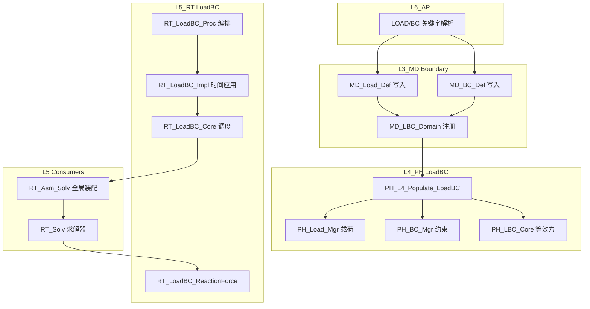

# L3_MD/L4_PH/L5_RT LoadBC 标准域柱卡

**域路径**：`L3_MD/Boundary` -> `L4_PH/LoadBC` -> `L5_RT/LoadBC`  
**角色**：P4 全贯通域柱 -- 载荷/边界条件定义真源(L3)、等效力/约束物理计算(L4)、载荷调度与时间应用(L5)  
**文档日期**：2026-04-28  
**柱型**：全柱（三层均有独立域目录）

---

## 0. 源文件与权威入口核对

| 项 | 说明 |
|----|------|
| 合同卡 | `L3_MD/Boundary/CONTRACT.md`、`L4_PH/LoadBC/CONTRACT.md`、`L5_RT/LoadBC/CONTRACT.md` |
| 设计文档 | `L3_MD/Boundary/DESIGN_BC_FourTypes.md`、`L4_PH/LoadBC/DESIGN_LoadBC_Domain.md` |
| 推导卡 | `L3_MD/Boundary/DERIVATION_CARD.md` |
| 闭环测试 | `tests/TEST_LoadBC_L3_L4_Closure.f90`（待创建） |

---

## 1. 域职责十件套

| # | 项 | LoadBC 落地要点 |
|---|----|-----------------|
| 1 | **域定位** | L3/L4/L5 三层贯通域柱：L3 持有载荷/BC 定义唯一真源（类型/幅值/作用域/时间函数），L4 承载物理计算（等效节点力/面力/体力/约束处理），L5 驱动载荷调度（幅值插值/时间步应用/全局力装配）。 |
| 2 | **职责边界** | **L3 负责**：Load/BC Desc 定义、幅值函数描述、作用域/DOF、Amplitude 引用。**L4 负责**：等效节点力计算、面力/体力积分、BC 约束施加、Geostatic 算法。**L5 负责**：幅值时间插值、增量步载荷应用、反力计算、全局 F_ext 装配。**禁止**：L3 计算等效力；L4 存储载荷定义真源；L5 实现具体力学积分。 |
| 3 | **功能模块** | 见 Section 4 三层 `.f90` 清单。 |
| 4 | **四型 TYPE** | **Desc**：`MD_BC_Def/MD_Load_Def`(L3 BC/Load 类型+参数)。**State**：`PH_LBC_State`(L4 等效力/约束状态)。**Algo**：`PH_LBC_Algo`(L4 Geostatic 参数)。**Ctx**：`PH_LBC_Ctx`(L4 积分缓存) / `RT_LoadBC_Ctx`(L5 调度上下文)。 |
| 5 | **公开接口** | 以各层 `CONTRACT.md` 为准。 |
| 6 | **数据所有权** | L3 持有载荷/BC 定义权威真源；Populate 后 L4 持有运行期力学量；L5 持有调度上下文和 Amplitude 插值。 |
| 7 | **依赖规则** | 允许：L4 经 Populate 读 L3 BC/Load Desc；L5 经 Bridge 读 L4 LoadBC 域。禁止：L4 积分内 USE L3 深层容器。 |
| 8 | **合同卡** | 三层各维护 `CONTRACT.md`。 |
| 9 | **Harness 验收** | 见 Section 6。 |
| 10 | **扩展点** | 新载荷类型：通过 L3 Load_Def 常量 + L4 计算扩展；新 BC 类型：通过 L3 BC_Def + L4 约束扩展；Geostatic/Predefined：L4 专域算法。 |

---

## 2. 域柱定位与主链

| 层 | 职责 | 禁止 |
|----|------|------|
| L3_MD | 载荷/BC 定义真源：类型/幅值/作用域/时间函数/Amplitude 引用 | 计算等效节点力 |
| L4_PH | 物理计算：等效节点力/面力/体力积分/BC约束施加/Geostatic | 存储载荷定义真源 |
| L5_RT | 载荷调度：幅值插值/时间步应用/反力计算/全局 F_ext 装配 | 实现具体力学积分 |

主链：

```text
MD_BC_Def + MD_Load_Def(L3) + MD_LBC_Domain(L3)
  -> PH_L4_Populate_LoadBC(L4)
  -> PH_LBC_Core / PH_Load_Mgr / PH_BC_Mgr(L4)
  -> RT_LoadBC_Proc(L5) -> RT_LoadBC_Impl(L5 时间应用)
  -> RT_LoadBC_Core(L5) -> global F_ext 装配
  -> RT_LoadBC_ReactionForce(L5 反力)
```

---

## 3. 四型裁剪决策

| 层 | Desc | State | Algo | Ctx |
|----|------|-------|------|-----|
| L3 | RETAINED(`MD_BC_Def`/`MD_Load_Def`) | TRIMMED | TRIMMED | TRIMMED |
| L4 | DELEGATED->L3(via Populate) | RETAINED(`PH_LBC_State`) | RETAINED(`PH_LBC_Algo`) | RETAINED(`PH_LBC_Ctx`) |
| L5 | DELEGATED | DELEGATED->L4 | DELEGATED->L4 | RETAINED(`RT_LoadBC_Ctx`) |

---

## 4. .f90 功能模块清单（三层分列）

### 4.1 L3_MD/Boundary（真源层）

| 文件 | 后缀 | 模块命名 | 职责 | 现有 |
|------|------|----------|------|------|
| `MD_BC_Def.f90` | Def | `MD_BC_Def` | BC TYPE定义：BC类型/DOF/作用域 | Y |
| `MD_Load_Def.f90` | Def | `MD_Load_Def` | Load TYPE定义：载荷类型/幅值/分布 | Y |
| `MD_LBC_Domain.f90` | Domain | `MD_LBC_Domain` | LoadBC 域容器 | Y |
| `MD_LBC_Mgr.f90` | Mgr | `MD_LBC_Mgr` | 管理器（251KB，需评估瘦身） | Y |
| `MD_LBC_Idx.f90` | Idx | `MD_LBC_Idx` | LoadBC 索引 | Y |
| `MD_LBC_Brg.f90` | Brg | `MD_LBC_Brg` | L3->L4 桥接 | Y |

### 4.2 L4_PH/LoadBC（计算层）

| 文件 | 后缀 | 模块命名 | 职责 | 现有 |
|------|------|----------|------|------|
| `PH_LBC_Def.f90` | Def | `PH_LBC_Def` | L4 LoadBC TYPE 定义 | Y |
| `PH_BC_Def.f90` | Def | `PH_BC_Def` | L4 BC TYPE 定义 | Y |
| `PH_Load_Def.f90` | Def | `PH_Load_Def` | L4 Load TYPE 定义 | Y |
| `PH_LBC_Core.f90` | Core | `PH_LBC_Core` | LoadBC 计算核心 | Y |
| `PH_BC_Mgr.f90` | Mgr | `PH_BC_Mgr` | BC 管理器 | Y |
| `PH_Load_Mgr.f90` | Mgr | `PH_Load_Mgr` | Load 管理器 | Y |
| `PH_BC_Brg.f90` | Brg | `PH_BC_Brg` | BC 桥接 | Y |
| `PH_LBC_FlatToNested.f90` | Map | `PH_LBC_FlatToNested` | 扁平->嵌套映射 | Y |
| `PH_LBC_NestedToFlat.f90` | Map | `PH_LBC_NestedToFlat` | 嵌套->扁平映射 | Y |
| `PH_LBC_GeostaticAlgo.f90` | Eval | `PH_LBC_GeostaticAlgo` | Geostatic 算法 | Y |
| `PH_LBC_Legacy.f90` | Lib | `PH_LBC_Legacy` | legacy 兼容（冻结） | Y |

### 4.3 L5_RT/LoadBC（调度层）

| 文件 | 后缀 | 模块命名 | 职责 | 现有 |
|------|------|----------|------|------|
| `RT_LoadBC_Def.f90` | Def | `RT_LoadBC_Def` | RT_LoadBC_Ctx / 调度常量 | Y |
| `RT_LoadBC_Core.f90` | Core | `RT_LoadBC_Core` | 载荷调度核心 | Y |
| `RT_LoadBC_Impl.f90` | Impl | `RT_LoadBC_Impl` | 时间步应用实现 | Y |
| `RT_LoadBC_Proc.f90` | Proc | `RT_LoadBC_Proc` | 载荷过程编排 | Y |
| `RT_LoadBC_Brg.f90` | Brg | `RT_LoadBC_Brg` | L4->L5 桥接 | Y |
| `RT_BC_ReactionForce.f90` | Eval | `RT_BC_ReactionForce` | 反力计算 | Y |

### 4.4 L5 消费点

| L5 文件 | 消费性质 |
|---------|----------|
| `L5_RT/Assembly/RT_Asm_Solv.f90` | 全局 F_ext 装配消费 |
| `L5_RT/StepDriver/*` | 步驱动中载荷应用编排 |
| `L5_RT/Solver/*` | 求解器消费外力向量 |

---

## 5. 数据生命周期图



---

## 6. Harness 验收项

| 类别 | 验收项 |
|------|--------|
| **命名** | `MD_BC_*`/`MD_Load_*`/`MD_LBC_*` / `PH_LBC_*`/`PH_BC_*`/`PH_Load_*` / `RT_LoadBC_*` 与层域一致。 |
| **依赖/架构** | L4 积分内禁止 USE L3 深层容器。 |
| **合同** | 三层 `CONTRACT.md` 存在且一致。 |
| **金线闭环** | L3 定义 -> L4 Populate -> L5 应用 -> 全局 F_ext 验证。 |
| **载荷覆盖** | 集中力/面力/体力/Pressure/位移BC 最小矩阵可达。 |

---

## 7. 清旧资产台账

| 文件 | 处置 | 说明 |
|------|------|------|
| `MD_LBC_Mgr.f90` (251KB) | 瘦身 | 过大，评估拆分为 Load_Mgr + BC_Mgr + LBC_Core 子模块 |
| `PH_LBC_Legacy.f90` | 冻结 legacy | 不新增 API |
| `MD_LBC_Brg.f90` (42KB) | 评估瘦身 | 桥接文件过大，评估拆分 |

---

## 8. 域间关系表

| 关系类型 | 从 | 到 | 机制 |
|----------|----|----|------|
| **包含** | `L3_MD` | `Boundary/` | 目录与模块前缀 `MD_BC_*`/`MD_Load_*`/`MD_LBC_*` |
| **包含** | `L4_PH` | `LoadBC/` | 目录与模块前缀 `PH_LBC_*`/`PH_BC_*`/`PH_Load_*` |
| **包含** | `L5_RT` | `LoadBC/` | 目录与模块前缀 `RT_LoadBC_*` |
| **数据** | `L3_MD` | `L4_PH` | Populate：L3 BC/Load Desc -> L4 计算域 |
| **数据** | `L4_PH` | `L5_RT` | Bridge：L4 域 -> L5 调度 |
| **执行** | `L5_RT` | `L4_PH` | Dispatch：L5 时间应用 -> L4 等效力计算 |
| **耦合** | `Element` | `LoadBC` | L4 单元面提供面力积分 |
| **耦合** | `StepDriver` | `LoadBC` | L5 步驱动编排载荷应用时序 |
| **耦合** | `Amplitude` | `LoadBC` | L3/L5 幅值函数用于载荷时间插值 |
