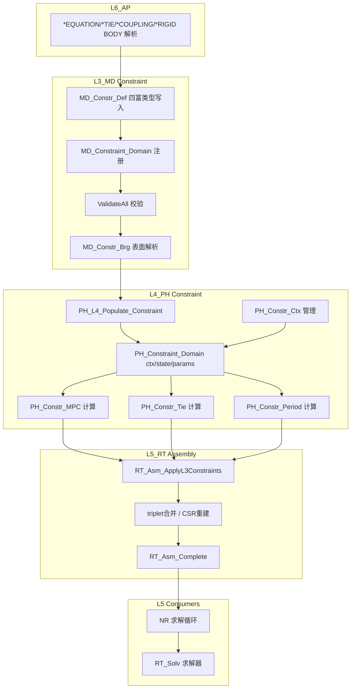

# L3_MD/L4_PH/(L5_RT/Assembly) Constraint 标准域柱卡

**域路径**：`L3_MD/Constraint` -> `L4_PH/Constraint` -> `L5_RT/Assembly`（约束消费点）  
**角色**：H1 半贯通域柱 -- 约束定义真源(L3)、约束数值计算(L4)、约束施加/装配(L5 Assembly)  
**文档日期**：2026-04-28  
**柱型**：半柱（L3/L4 独立域目录；L5 无独立 Constraint 目录，通过 Assembly 消费）

---

## 0. 源文件与权威入口核对

| 项 | 说明 |
|----|------|
| 合同卡 | `L3_MD/Constraint/CONTRACT.md`、`L4_PH/Constraint/CONTRACT.md` |
| 推导卡 | `L3_MD/Constraint/DERIVATION_CARD.md` |
| L5 消费合同 | `L5_RT/Assembly/CONTRACT.md`（`RT_Asm_ApplyL3Constraints` / `RT_Asm_ApplyConstraints`） |
| 适配器 | `L4_PH/Adapters/Constraint/MPC_Adapter.f90`、`UMESHMOTION_Adapter.f90` |
| 闭环测试 | `tests/TEST_Constraint_L3_L4_Closure.f90`（待创建） |

---

## 1. 域职责十件套

| # | 项 | Constraint 落地要点 |
|---|----|-------------------|
| 1 | **域定位** | L3/L4/L5(Assembly) 半贯通域柱：L3 持有约束定义唯一真源（MPC/Tie/Coupling/RigidBody），L4 承载约束数值计算（罚函数/Lagrange乘子/DOF消元/变换），L5 Assembly 消费约束贡献汇入全局 K/F。 |
| 2 | **职责边界** | **L3 负责**：约束 Desc 四富类型定义（TieConstraintDef/MPCConstraintDef/CplConstraintDef/RigidBodyDef）、MD_ConstraintUnion 容器、验证、注册、表面桥接、INP解析映射。**L4 负责**：约束方程数值形式（局部 Kc/Fc）、MPC/Tie/Periodic/RBE 计算核、罚函数/Lagrange乘子/DOF消元/变换、约束违反量检测。**L5 负责**：全局 CSR 约束装配（`RT_Asm_ApplyL3Constraints`）、triplet合并/符号分析、密集回退路径。**禁止**：L3 做约束方程数值装配；L4 存储约束 Desc 真源；L5 实现具体约束算法。 |
| 3 | **功能模块** | 见 Section 4 三层 `.f90` 清单。 |
| 4 | **四型 TYPE** | **Desc**：`TieConstraintDef`/`MPCConstraintDef`/`CplConstraintDef`/`RigidBodyDef` + `MD_ConstraintUnion`(L3)。**State**：`MD_Constraint_State`(L3监控占位) / `PH_Constraint_State`(L4 乘子/残差/活跃)。**Algo**：`MD_Constr_Algo`(L3默认施加方式/罚刚度) / `PH_Constraint_Params`(L4施加方法/容差)。**Ctx**：`MD_Constr_Ctx`(L3操作期) / `PH_Constraint_Ctx`(L4步级/约束方程/主从连接)。 |
| 5 | **公开接口** | 以各层 `CONTRACT.md` 为准：L3 = Def/Mgr/Brg/Sync；L4 = Domain/MPC/Tie/Period/Ctx；L5 = Assembly `RT_Asm_ApplyL3Constraints`。 |
| 6 | **数据所有权** | L3 持有权威 Desc 真源（Write-Once）；Populate 后 L4 持有运行期约束域（Ctx/State/Params）；L5 Assembly 持有全局 K/F 装配结果；步内热路径不反向读 L3。 |
| 7 | **依赖规则** | 允许：L4 经 `PH_L4_Populate_Constraint` 读 L3 Desc。禁止：L4 约束 Compute 热路径内 USE L3 深层容器；L5 新建第二套约束 Desc 真源。 |
| 8 | **合同卡** | L3、L4 各维护 `CONTRACT.md`；L5 约束消费点记录在 Assembly 合同。 |
| 9 | **Harness 验收** | 见 Section 6。 |
| 10 | **扩展点** | 新约束类型：通过 `MD_Constr_Def` 新增 Desc TYPE + L4 新增 Compute 核；新施加方法：通过 `PH_CONS_*` 枚举扩展 + L4 `PH_Constr_Domain` 分派；周期边界：通过 `PH_Constr_Period_*` 子域。 |

---

## 2. 域柱定位与主链

Constraint 是 H1 半贯通域柱（L3+L4 独立域目录，L5 通过 Assembly 消费）。三层职责正交：

| 层 | 职责 | 禁止 |
|----|------|------|
| L3_MD | 约束定义真源：MPC系数/Tie面对/耦合DOF/刚体主从/表面桥接 | 计算约束力、数值装配 |
| L4_PH | 约束数值计算：罚函数/Lagrange乘子/DOF消元/变换/局部Kc/Fc | 存储约束 Desc 真源 |
| L5_RT | 约束施加：全局K/F矩阵修正/triplet合并/CSR重建/符号分析 | 实现具体约束算法 |

主链：

```text
MD_ConstraintUnion(L3)
  -> PH_L4_Populate_Constraint(L4)
  -> PH_Constraint_Domain(L4 ctx/state/params)
  -> PH_Constr_*_Compute(L4 MPC/Tie/Period 局部贡献)
  -> RT_Asm_ApplyL3Constraints(L5 全局装配)
  -> RT_Asm_Complete -> NR 求解循环
```

---

## 3. 四型裁剪决策

| 层 | Desc | State | Algo | Ctx |
|----|------|-------|------|-----|
| L3 | RETAINED(`TieConstraintDef`/`MPCConstraintDef`/`CplConstraintDef`/`RigidBodyDef` + `MD_ConstraintUnion`) | RETAINED(`MD_Constraint_State` 监控占位) | RETAINED(`MD_Constr_Algo` 默认施加/罚刚度) | RETAINED(`MD_Constr_Ctx` 操作期瞬态) |
| L4 | DELEGATED->L3(via Populate) | RETAINED(`PH_Constraint_State` 乘子/残差/活跃) | RETAINED(`PH_Constraint_Params` 施加方法/容差) | RETAINED(`PH_Constraint_Ctx` 步级/方程系数/主从) |
| L5 | DELEGATED | DELEGATED->L4 | DELEGATED->L4 | N/A（Assembly 自有 Ctx） |

约束类型矩阵：

| 约束类型 | L3 Desc TYPE | L4 计算核 | L5 施加路径 |
|----------|-------------|-----------|------------|
| MPC | `MPCConstraintDef` | `PH_Constr_MPC` / `PH_ConstrMPC_Brg` | `RT_Asm_ApplyL3Constraints`（triplet merge） |
| Tie | `TieConstraintDef` | `PH_Constr_Tie` / `PH_ConstrTie_Brg` | `RT_Asm_ApplyL3Constraints`（triplet merge） |
| Coupling | `CplConstraintDef` | (via MPC 展开) | `RT_Asm_ApplyL3Constraints` |
| Rigid Body | `RigidBodyDef` | (RBE2/RBE3 via MPC 展开) | `RT_Asm_ApplyL3Constraints` |
| Periodic | (L3 无独立 Desc) | `PH_Constr_Period` / `PH_ConstrPeriod_Brg` | Assembly 消费 |

---

## 4. .f90 功能模块清单（三层分列）

### 4.1 L3_MD/Constraint（真源层）

| 文件 | 后缀 | 模块命名 | 职责 | 现有 |
|------|------|----------|------|------|
| `MD_Constr_Def.f90` | Def | `MD_Constr_Def` | **AUTHORITY** — 4 富类型 Desc + `MD_ConstraintUnion` + `MD_Constraint_State` + 16 常量 + 12 过程 | Y |
| `MD_Constr_Mgr.f90` | Mgr | `MD_Constr_Mgr` | `MD_Constraint_Domain` 容器、`Add*/Get*/ValidateAll`、`MD_Constr_Algo`/`MD_Constr_Ctx` | Y |
| `MD_Constr_Brg.f90` | Brg | `MD_Constr_Brg` | 表面/elset 名→节点列表；Tie 最近邻配对 | Y |
| `MD_Constr_Prop.f90` | Prop | `MD_Constr_Prop` | 接触属性数据库（材料/摩擦索引侧） | Y |
| `MD_Constr_Sync.f90` | Sync | `MD_Constr_Sync` | Legacy/`UF_*` → `MD_ConstraintUnion` 同步 | Y |

### 4.2 L4_PH/Constraint（计算层）

| 文件 | 后缀 | 模块命名 | 职责 | 现有 |
|------|------|----------|------|------|
| `PH_Constr_Domain.f90` | Domain | `PH_ConstraintDomain` | **核心**：`PH_Constraint_Domain` TYPE + Init/Finalize/Register/AddMPC/消元/变换/Lagrange更新 | Y |
| `PH_Constr_Core.f90` | Core | `PH_Constr_Core` | 约束施加算法核心 | Y |
| `PH_Constr_Def.f90` | Def | `PH_Constr_Def` | L4 约束 TYPE 定义 | Y |
| `PH_Constr_Ctx.f90` | Ctx | `PH_Constr_Ctx` | 约束上下文：Init/Clear/Copy/Valid（Structured 版） | Y |
| `PH_Constr_MPC.f90` | Eval | `PH_Constr_MPC` | MPC 核心算法：罚/Lagrange/违反量检测 | Y |
| `PH_ConstrMPC_Brg.f90` | Brg | `PH_ConstrMPC_Brg` | MPC Apply 四型 + Init/AddTerm/Assemble/Check/Finalize | Y |
| `PH_ConstrMPC_Def.f90` | Def | `PH_ConstrMPC_Def` | MPC_Term/MPC_Constraint/MPC_Params/MPC_State 类型 | Y |
| `PH_Constr_Tie.f90` | Eval | `PH_Constr_Tie` | Tie 核心算法：节点配对/权重/违反量 | Y |
| `PH_ConstrTie_Brg.f90` | Brg | `PH_ConstrTie_Brg` | Tie Apply 四型 + Init/BuildPairs/Weights/Check | Y |
| `PH_ConstrTie_Def.f90` | Def | `PH_ConstrTie_Def` | Tie_Constraint_Params/State/Node_Pair/Surface_Pair 类型 | Y |
| `PH_Constr_Period.f90` | Eval | `PH_Constr_Period` | 周期边界：宏应变/应力计算、边界节点识别 | Y |
| `PH_ConstrPeriod_Brg.f90` | Brg | `PH_ConstrPeriod_Brg` | 周期边界 Apply 四型 + Init/BuildPairs/Displacement/Macro | Y |
| `PH_ConstrPeriod_Def.f90` | Def | `PH_ConstrPeriod_Def` | Period_BC_Params/State/Node_Pair_Data 类型 | Y |

### 4.3 L4_PH/Adapters/Constraint（适配器层）

| 文件 | 后缀 | 模块命名 | 职责 | 现有 |
|------|------|----------|------|------|
| `MPC_Adapter.f90` | Adapter | — | MPC 约束适配器 | Y |
| `UMESHMOTION_Adapter.f90` | Adapter | — | 网格运动适配器 | Y |

### 4.4 L5_RT 消费点（Assembly 域）

| L5 文件 | 消费性质 |
|---------|----------|
| `L5_RT/Assembly/RT_Asm_Solv.f90` | `RT_Asm_ApplyL3Constraints`：MPC/Tie/Cpl/Rigid 罚装配→triplet合并→CSR重建 |
| `L5_RT/Assembly/RT_Asm_Proc.f90` | `RT_Asm_ApplyConstraints`：SIO 过程式约束施加接口 |
| `L5_RT/Assembly/RT_Asm_Impl.f90` | `RT_Asm_ApplyConstraints_Impl`：约束施加实现 |
| `L5_RT/StepDriver/RT_Step_Exec.f90` | Assembly pipeline 中 L3 constraints 编排 |
| `L5_RT/Solver/RT_Solv_Nonlin.f90` | 非线性求解中 `l3_csr_reanalyze_required` 标志消费 |

---

## 5. 数据生命周期图



**文字要点**

1. **创建(Model Build)**：L6 解析 `*EQUATION/*TIE/*COUPLING/*RIGID BODY` → L3 写入四富类型 Desc → 注册到 `MD_Constraint_Domain` → `ValidateAll` 校验一致性。
2. **桥接(Surface Resolve)**：L3 `MD_Constr_Brg` 物化 Tie/Cpl/Rigid 表面名→节点列表。
3. **映射(Populate)**：L4 `PH_L4_Populate_Constraint` 读取 L3 `MD_ConstraintUnion`，`ClearMPCEquations` 后逐条 `AddMPCEquation`，`Register` 非MPC约束。
4. **计算(NR Loop)**：L4 `PH_Constr_MPC/Tie/Period` 计算局部约束贡献（Kc/Fc/违反量）。
5. **装配(Assembly)**：L5 `RT_Asm_ApplyL3Constraints` 汇入全局 K/F，triplet合并→CSR重建→可选符号分析。
6. **收敛/检查(Converge)**：约束违反量检查；Lagrange 乘子更新（增广路径）。

---

## 6. Harness 验收项

| 类别 | 验收项 |
|------|--------|
| **命名** | `MD_Constr_*`(L3) / `PH_Constr_*`(L4) / `RT_Asm_*Constraint*`(L5) 前缀与层域一致；`check_naming.py` 通过。 |
| **依赖/架构** | L4 约束 Compute 热路径内禁止 `USE` L3 深层模块；L5 禁止新建约束 Desc 真源。 |
| **合同** | L3、L4 `CONTRACT.md` 存在且与公开过程签名一致。 |
| **金线闭环** | L3 注册 → L4 Populate → L4 Compute → L5 ApplyL3Constraints → 验证。 |
| **四型** | L3 四富类型（Tie/MPC/Cpl/Rigid）与 `MD_Constr_Def.f90` 字段一致；L4 `PH_Constraint_Ctx/State/Params` 与 `PH_Constr_Domain.f90` 一致。 |
| **约束类型覆盖** | MPC/Tie/Coupling/RigidBody(RBE2/RBE3)/Periodic 最小类型矩阵可达。 |
| **施加方法覆盖** | `PH_CONS_ELIMINATION/TRANSFORM/LAGRANGE/PENALTY/AUGLAG` 五种枚举可达。 |

---

## 7. 清旧资产台账

### 7.1 已删除模块

| 文件 | 处置 | 说明 |
|------|------|------|
| `MD_Constraint_API.f90` | **已删除** | 零调用的 API 封装层（14KB，无任何 L6/L5 使用） |
| `MD_Const_Idx_API.f90` | **已删除** | 零调用的 Idx API（4KB，简单转发） |
| `MD_Constr_Core.f90` | **已删除** | 死代码（7 过程操作扁平类型，0 外部 USE） |
| `MD_Constr_Brg.f90` (旧) | **已删除** | 空骨架（0 过程、0 消费者） |
| `MD_Constr_PairDef.f90` | **已删除** | 死代码（接触对 Desc；0 直接 USE 消费者） |

### 7.2 后续任务触发表

| 任务 | 触发条件 | 处理原则 |
|------|----------|----------|
| `Constraint-L3L4-Closure-Test` | 金线闭环测试需求 | 创建 `TEST_Constraint_L3_L4_Closure.f90` |
| `Constraint-Period-L3-Desc` | 周期边界需要 L3 Desc 真源 | 新增 `PeriodicBCDef` 到 `MD_Constr_Def.f90` |
| `Constraint-RBE3-Weight-Align` | RBE3 权重与 L4 `PH_Constr_RBE3_CalcWeights` 对齐 | 确认 `RigidBodyDef%tied_weights` 与 L4 一致 |
| `Constraint-CSR-Reanalyze` | `l3_csr_reanalyze_required` 标志需要全流程贯通 | 确保 StepDriver/NR Solver 正确消费 |

---

## 8. 域间关系表

| 关系类型 | 从 | 到 | 机制 |
|----------|----|----|------|
| **包含** | `L3_MD` | `Constraint/` | 目录与模块前缀 `MD_Constr_*` |
| **包含** | `L4_PH` | `Constraint/` | 目录与模块前缀 `PH_Constr_*` |
| **数据** | `L3_MD` | `L4_PH` | Populate：L3 `MD_ConstraintUnion` → L4 `PH_Constraint_Domain` |
| **执行** | `L5_RT/Assembly` | `L4_PH` | `RT_Asm_ApplyL3Constraints` 消费 L4 约束贡献 |
| **消费** | `L3_MD/Constraint` | `L3_MD/Element/Mesh` | 节点/表面/集合名解析 |
| **消费** | `L3_MD/Constraint` | `L3_MD/Assembly` | 装配体引用（表面定位） |
| **合同** | `L3_MD/Constraint` | `L3_MD/Interaction` | 接触约束共享 `constraint_union` |
| **耦合** | `L4_PH/Element` | `L4_PH/Constraint` | 约束与单元共享节点/DOF |
| **接口** | `L6_AP/Input` | `L3_MD/Constraint` | `*EQUATION/*TIE/*COUPLING/*RIGID BODY` 解析 |
| **适配** | `L4_PH/Adapters/Constraint` | `L4_PH/Constraint` | MPC/UMESHMOTION 用户子程序适配 |

---

## 附录 A：约束类型总览矩阵

| 约束类型 | L3 Desc TYPE | L3 常量 | L4 枚举 | 施加方法 |
|----------|-------------|---------|---------|----------|
| MPC (通用) | `MPCConstraintDef` | `CONSTRAINT_MPC` | `PH_CTYPE_MPC` | Elimination/Penalty/Lagrange |
| MPC (梁) | `MPCConstraintDef` (`mpc_type=BEAM`) | `MPC_TYPE_BEAM` | `PH_CTYPE_MPC` | Elimination |
| MPC (连杆) | `MPCConstraintDef` (`mpc_type=LINK`) | `MPC_TYPE_LINK` | `PH_CTYPE_MPC` | Elimination |
| MPC (销) | `MPCConstraintDef` (`mpc_type=PIN`) | `MPC_TYPE_PIN` | `PH_CTYPE_MPC` | Elimination |
| Tie | `TieConstraintDef` | `CONSTRAINT_TIE` | `PH_CTYPE_TIE` | Penalty/Lagrange |
| Kinematic Coupling | `CplConstraintDef` (`KINEMATIC`) | `COUPLING_TYPE_KINEMATIC` | `PH_CTYPE_COUPLING` | Elimination/Penalty |
| Distributing Coupling | `CplConstraintDef` (`DISTRIBUTING`) | `COUPLING_TYPE_DISTRIBUTING` | `PH_CTYPE_COUPLING` | Penalty |
| RBE2 (刚体) | `RigidBodyDef` (`RBE2`) | `RBE_TYPE_RBE2` | `PH_CTYPE_RBE2` | Elimination/Penalty |
| RBE3 (加权平均) | `RigidBodyDef` (`RBE3`) | `RBE_TYPE_RBE3` | `PH_CTYPE_RBE3` | Penalty |
| Embedded | — | — | `PH_CTYPE_EMBEDDED` | Penalty |
| Periodic BC | (L4 独立) | — | — | Penalty/Lagrange |

---

## 附录 B：变更日志

| 版本 | 日期 | 变更 |
|------|------|------|
| v1.0 | 2026-04-28 | 初始版本：基于 L3 5个.f90 + L4 13个.f90 + L5 Assembly消费点创建十件套域柱卡 |
