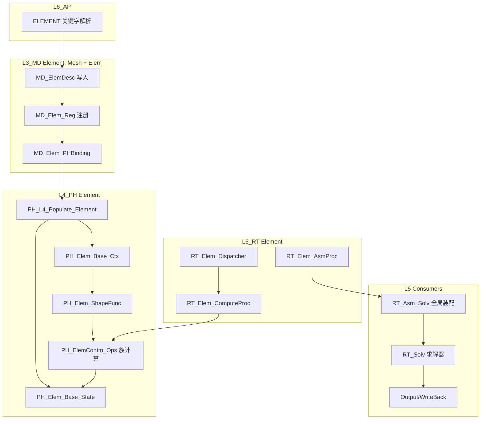

# L3_MD/L4_PH/L5_RT Element 标准域柱卡

**域路径**：`L3_MD/Element/Elem` -> `L4_PH/Element` -> `L5_RT/Element`  
**角色**：P2 全贯通域柱 -- 单元定义真源(L3)、单元物理计算热路径(L4)、单元调度与装配驱动(L5)  
**文档日期**：2026-04-28  
**柱型**：全柱（三层均有独立域目录）

---

## 0. 源文件与权威入口核对

| 项 | 说明 |
|----|------|
| 合同卡 | `L3_MD/Element/Elem/CONTRACT.md`、`L4_PH/Element/CONTRACT.md`、`L5_RT/Element/CONTRACT.md` |
| 设计文档 | `L4_PH/Element/DESIGN_Elem_FourTypes.md` |
| 闭环测试 | `tests/TEST_Element_L3_L4_Closure.f90`（待创建） |

---

## 1. 域职责十件套

| # | 项 | Element 落地要点 |
|---|----|-----------------|
| 1 | **域定位** | L3/L4/L5 三层贯通域柱：L3 持有单元拓扑/连接/截面定义唯一真源，L4 承载单元物理计算（刚度/质量/内力/形函数/积分点），L5 驱动 element loop/装配分派。 |
| 2 | **职责边界** | **L3 负责**：节点拓扑、连接关系、section 映射、类型注册、L3->L4 binding 和 Populate。**L4 负责**：形函数/Gauss积分/刚度矩阵/内力计算/质量矩阵/非线性几何/∂R/∂θ。**L5 负责**：element loop 调度/装配驱动/族分派/UEL扩展入口。**禁止**：L3 计算刚度/应力/质量；L4 存储 mesh 拓扑真源；L5 实现具体单元算法。 |
| 3 | **功能模块** | 见 Section 4 三层 `.f90` 清单。 |
| 4 | **四型 TYPE** | **Desc**：`MD_ElemDesc`(L3 单元类型/节点拓扑/截面)。**State**：`PH_Elem_Base_State`(L4 RHS/AMATRX/SVARS/ENERGY)。**Algo**：TRIMMED（时间积分参数由 L5/Solver 注入）。**Ctx**：`PH_Elem_Base_Ctx`(L4 坐标/位移增量/形函数缓存/内嵌 Mat Ctx) / `RT_Elem_Dispatch_Ctx`(L5 调度)。 |
| 5 | **公开接口** | 以各层 `CONTRACT.md` 为准：L3 = Def/Domain/Reg/Validate/Populate；L4 = Core/Contm_Ops/ShapeFunc/Dispatch；L5 = Dispatcher/ComputeProc/AsmProc。 |
| 6 | **数据所有权** | L3 持有权威 mesh/element 定义真源；Populate 后 L4 持有运行期 Ctx/State；L5 持有 dispatch 调度上下文；热路径不反向读 L3。 |
| 7 | **依赖规则** | 允许：L4 经 Populate 读 L3 ElemDesc；L5 经 Bridge 读 L4 元素域。禁止：L4 element loop 内 USE L3 Mesh 深层容器；L5 实现具体形函数/积分。 |
| 8 | **合同卡** | 三层各维护 `CONTRACT.md`。 |
| 9 | **Harness 验收** | 见 Section 6。 |
| 10 | **扩展点** | 新单元族：通过 `PH_Elem_Reg` 注册 + 新子目录实现；UEL 用户单元：通过 `RT_Elem_UEL` 入口扩展。 |

---

## 2. 域柱定位与主链

Element 是 P2 全贯通域柱。三层职责正交：

| 层 | 职责 | 禁止 |
|----|------|------|
| L3_MD | 单元定义真源：节点拓扑/连接/section/类型映射/注册 | 计算刚度/应力/质量 |
| L4_PH | 单元物理计算：形函数/积分/刚度/内力/质量/NLGeom/∂R/∂θ | 存储 mesh 拓扑真源 |
| L5_RT | 单元调度：element loop/装配驱动/族分派/UEL 入口 | 实现具体单元算法 |

主链：

```text
MD_ElemDesc(L3) + MD_Elem_PHBinding(L3)
  -> PH_L4_Populate_Element(L4)
  -> PH_Elem_Domain / PH_Elem_Base_Ctx / PH_Elem_Base_State(L4)
  -> RT_Elem_Dispatcher(L5) -> RT_Elem_ComputeProc(L5)
  -> PH_ElemContm_Ops / PH_Elem_{族}_Eval(L4 kernels)
  -> RT_Elem_AsmProc(L5) -> 全局装配
```

---

## 3. 四型裁剪决策

| 层 | Desc | State | Algo | Ctx |
|----|------|-------|------|-----|
| L3 | RETAINED(`MD_ElemDesc`) | TRIMMED | TRIMMED | TRIMMED |
| L4 | DELEGATED->L3(via Populate) | RETAINED(`PH_Elem_Base_State`) | TRIMMED(由L5注入) | RETAINED(`PH_Elem_Base_Ctx`) |
| L5 | DELEGATED | DELEGATED->L4 | DELEGATED->L4/Solver | RETAINED(`RT_Elem_Dispatch_Ctx`) |

设计详情：`L4_PH/Element/DESIGN_Elem_FourTypes.md`

---

## 4. .f90 功能模块清单（三层分列）

### 4.1 L3_MD/Element/Elem（真源层）

| 文件 | 后缀 | 模块命名 | 职责 | 现有 |
|------|------|----------|------|------|
| `MD_Elem_Def.f90` | Def | `MD_Elem_Def` | 四型 + 族 Desc/Algo TYPE 真源（`L3_MD/Element/Elem/`） | Y |
| `MD_Elem_Domain.f90` | Domain | `MD_Elem_Domain` | 单元域容器TYPE | Y |
| `MD_Elem_Reg.f90` | Reg | `MD_Elem_Reg` | 单元族注册表 | Y |
| `MD_Elem_Validate.f90` | Validate | `MD_Elem_Validate` | 单元参数校验 | Y |
| `MD_Elem_PHBinding.f90` | Brg | `MD_Elem_PHBinding` | L3->L4 单元绑定映射 | Y |
| `MD_Elem_Family.f90` | Def | `MD_Elem_Family` | 单元族分类定义 | Y |
| `MD_Elem_Mgr.f90` | Mgr | `MD_Elem_Mgr` | 单元管理器 / 类型目录 | Y |
| `MD_Elem_InpMap.f90` | Map | `MD_Elem_InpMap` | INP 类型串映射 | Y |
| `MD_Elem_UEL_Def.f90` | Def | `MD_Elem_UEL_Def` | UEL 冷参数包（≠ 域柱 `MD_Elem_Desc`） | Y |
| `MD_Elem_Populate.f90` | Pop | `MD_Elem_Populate` | L3 Desc -> L4 Populate 入口 | Y |

### 4.2 L3_MD/Element/Mesh（Mesh 容器层，Element 依赖）

| 文件 | 后缀 | 模块命名 | 职责 | 现有 |
|------|------|----------|------|------|
| `MD_Mesh_Def.f90` | Def | `MD_Mesh_Def` | Mesh TYPE 定义 | Y |
| `MD_Mesh_Core.f90` | Core | `MD_Mesh_Core` | Mesh 容器核心 | Y |
| `MD_Mesh_Domain.f90` | Domain | `MD_Mesh_Domain` | Mesh 域容器 | Y |
| `MD_Mesh_Sync.f90` | Sync | `MD_Mesh_Sync` | Mesh 层同步 | Y |

### 4.3 L4_PH/Element（计算层）

| 文件 | 后缀 | 模块命名 | 职责 | 现有 |
|------|------|----------|------|------|
| `PH_Elem_Def.f90` | Def | `PH_Elem_Def` | L4 单元 TYPE 定义 | Y |
| `PH_Elem_Ctx.f90` | Ctx | `PH_Elem_Ctx` | PH_Elem_Base_Ctx 上下文 TYPE | Y |
| `PH_Elem_Core.f90` | Core | `PH_Elem_Core` | 单元计算核心入口 | Y |
| `PH_Elem_Domain.f90` | Domain | `PH_Elem_Domain` | 单元域容器 | Y |
| `PH_Elem_Reg.f90` | Reg | `PH_Elem_Reg` | L4 单元族注册表 | Y |
| `PH_ElemContm_Ops.f90` | Ops | `PH_ElemContm_Ops` | 连续体单元通用操作（热路径） | Y |
| `PH_ElemDomain_Ops.f90` | Ops | `PH_ElemDomain_Ops` | 单元域级操作 | Y |
| `PH_Elem_ShapeFunc.f90` | Eval | `PH_Elem_ShapeFunc` | 形函数求值 | Y |
| `PH_Elem_GaussInt.f90` | Eval | `PH_Elem_GaussInt` | 高斯积分 | Y |
| `PH_Elem_Nlgeom.f90` | Eval | `PH_Elem_Nlgeom` | 非线性几何 | Y |
| `PH_NLGeomEval.f90` | Eval | `PH_NLGeomEval` | NLGeom 求值（大变形） | Y |
| `PH_Elem_Mass2.f90` | Eval | `PH_Elem_Mass2` | 质量矩阵计算 | Y |
| `PH_Elem_MassDispatch.f90` | Dsp | `PH_Elem_MassDispatch` | 质量矩阵分派 | Y |
| `PH_ElemKeDispatch.f90` | Dsp | `PH_ElemKeDispatch` | 刚度矩阵分派 | Y |
| `PH_ElemFeDispatch.f90` | Dsp | `PH_ElemFeDispatch` | 内力分派 | Y |
| `PH_Elem_OutDispatch.f90` | Dsp | `PH_Elem_OutDispatch` | 输出分派 | Y |
| `PH_Elem_CalcWrapper.f90` | Exec | `PH_Elem_CalcWrapper` | 计算包装器 | Y |
| `PH_Elem_ComplexStiff.f90` | Eval | `PH_Elem_ComplexStiff` | 复刚度 | Y |
| `PH_Elem_dRdTheta.f90` | Eval | `PH_Elem_dRdTheta` | dR/dTheta 可微分接口 | Y |
| `PH_Elem_StructuralFacade.f90` | Facade | `PH_Elem_StructuralFacade` | 结构门面 | Y |
| `PH_Physical_Def.f90` | Def | `PH_Physical_Def` | 物理层基础定义 | Y |
| 各族 `Solid3D/Shell/Beam/...` | Eval | `PH_Elem_{族}_*` | 族内核算法 | Y |

### 4.4 L5_RT/Element（调度层）

| 文件 | 后缀 | 模块命名 | 职责 | 现有 |
|------|------|----------|------|------|
| `RT_Elem_Def.f90` | Def | `RT_Elem_Def` | RT_Elem_Dispatch_Ctx / 调度常量 | Y |
| `RT_Elem_Core.f90` | Core | `RT_Elem_Core` | 单元调度核心 | Y |
| `RT_Elem_Dispatcher.f90` | Dsp | `RT_Elem_Dispatcher` | element loop 族分派 | Y |
| `RT_Elem_ComputeProc.f90` | Proc | `RT_Elem_ComputeProc` | 单元计算编排 | Y |
| `RT_Elem_AsmProc.f90` | Proc | `RT_Elem_AsmProc` | 装配编排 | Y |
| `RT_Elem_KernelProc.f90` | Proc | `RT_Elem_KernelProc` | 内核调用编排 | Y |
| `RT_Elem_Proc.f90` | Proc | `RT_Elem_Proc` | 总过程编排 | Y |
| `RT_ElemDispatch_Brg.f90` | Brg | `RT_ElemDispatch_Brg` | L4->L5 分派桥接 | Y |
| `RT_ElemWB_Brg.f90` | Brg | `RT_ElemWB_Brg` | 写回桥接 | Y |
| `RT_Elem_Sect.f90` | Def | `RT_Elem_Sect` | 运行时截面定义 | Y |
| `RT_Elem_ThermalMechCpl.f90` | Eval | `RT_Elem_ThermalMechCpl` | 热-力耦合 | Y |
| `RT_Elem_UEL.f90` | Exec | `RT_Elem_UEL` | 用户单元入口 | Y |

### 4.5 L5 消费点

| L5 文件 | 消费性质 |
|---------|----------|
| `L5_RT/Assembly/RT_Asm_Solv.f90` | 全局装配驱动单元刚度/内力 |
| `L5_RT/Assembly/RT_Asm_NLGeomDispatch.f90` | NLGeom 装配分派 |
| `L5_RT/Solver/*` | 求解器消费单元残差/切线 |
| `L5_RT/Output/*` | 输出单元结果 |

---

## 5. 数据生命周期图



**文字要点**

1. **创建(Model Build)**：L6 解析关键字 -> L3 写入 `MD_ElemDesc` -> 注册 -> L3-L4 binding。
2. **映射(Populate)**：L4 `PH_L4_Populate_Element` 读取 L3 Desc，构建 `PH_Elem_Base_Ctx/State`。
3. **调度(Element Loop)**：L5 `RT_Elem_Dispatcher` 驱动族分派 -> `RT_Elem_ComputeProc` 编排。
4. **计算(Kernel)**：L4 形函数/积分/刚度/内力 -> State 更新。
5. **装配(Assembly)**：`RT_Elem_AsmProc` -> 全局装配 -> 求解器。
6. **输出(Output)**：WriteBack 读取 State -> 输出结果。

---

## 6. Harness 验收项

| 类别 | 验收项 |
|------|--------|
| **命名** | `MD_Elem_*` / `PH_Elem_*` / `RT_Elem_*` 前缀与层域一致。 |
| **依赖/架构** | L4 element loop 内禁止 USE L3 Mesh 深层容器。 |
| **合同** | 三层 `CONTRACT.md` 存在且与公开过程签名一致。 |
| **金线闭环** | L3 注册 -> L4 Populate -> L5 Dispatch -> L4 Kernel -> 装配验证。 |
| **四型** | `DESIGN_Elem_FourTypes.md` 与 TYPE 模块字段一致。 |
| **族覆盖** | Solid3D/Solid2D/Shell/Beam/Truss/Spring 最小族矩阵可达。 |
| **热路径** | 新增调用不得在 element loop 内反向读 L3。 |

---

## 7. 清旧资产台账

| 文件 | 处置 | 说明 |
|------|------|------|
| `PH_Elem_Contm.f90` | 收敛到 `PH_ElemContm_Ops.f90` | 避免 Core/Contm 职责重叠 |
| `PH_Elem_StructuralFacade.f90` | 评估是否仍需 | 薄门面，若无消费者可裁剪 |
| `PH_Mat_hTensor.f90` | 位置待迁 | 属 Material 域，不应在 Element 目录 |

---

## 8. 域间关系表

| 关系类型 | 从 | 到 | 机制 |
|----------|----|----|------|
| **包含** | `L3_MD/Element/Mesh` | `Element/` | 目录与模块前缀 `MD_Elem_*` |
| **包含** | `L4_PH` | `Element/` | 目录与模块前缀 `PH_Elem_*` |
| **包含** | `L5_RT` | `Element/` | 目录与模块前缀 `RT_Elem_*` |
| **数据** | `L3_MD` | `L4_PH` | Populate：L3 ElemDesc -> L4 Ctx/State |
| **数据** | `L4_PH` | `L5_RT` | Bridge：L4 域 -> L5 Dispatcher |
| **执行** | `L5_RT` | `L4_PH` | Dispatch：L5 Ctx -> L4 Kernels |
| **耦合** | `Material` | `Element` | L4 内嵌 `PH_Mat_Base_Ctx` 于 `PH_Elem_Base_Ctx` |
| **执行** | `L5_RT/Assembly` | `Element` | 装配驱动单元刚度/内力 |
