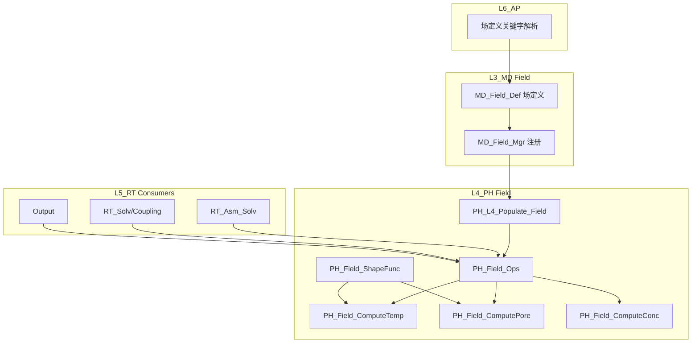

# L3_MD/L4_PH Field 标准域柱卡

**域路径**：`L3_MD/Field` -> `L4_PH/Field` -> L5消费(Assembly/Solver/Output)  
**角色**：H2 半柱域 -- 场定义真源(L3)、场物理计算(L4)、L5无独立域(消费式)  
**文档日期**：2026-04-28  
**柱型**：半柱（L5 无独立域目录，由 Assembly/Solver/Output 消费）

---

## 0. 源文件与权威入口核对

| 项 | 说明 |
|----|------|
| 合同卡 | `L3_MD/Field/CONTRACT.md`（待创建）、`L4_PH/Field/CONTRACT.md` |
| 闭环测试 | `tests/TEST_Field_L3_L4_Closure.f90` |

---

## 1. 域职责十件套

| # | 项 | Field 落地要点 |
|---|----|------------------|
| 1 | **域定位** | L3/L4 半柱域：L3 保存场定义真源，L4 承担物理场计算，L5 只在 Assembly/Solver/Output 中消费。 |
| 2 | **职责边界** | **L3 负责**：场实体/分布/Region/初始条件 Desc 权威。**L4 负责**：温度场/孔压场/浓度场计算、高斯积分、形函数、多场耦合。**L5 消费**：装配/求解/输出中的场贡献。**禁止**：L3 求解场方程；L4 存储场定义真源。 |
| 3 | **功能模块** | 见 Section 4 `.f90` 清单。 |
| 4 | **四型 TYPE** | **Desc**：`MD_FieldDesc`(L3 场定义)。**State**：`PH_Field_State`(L4 场计算状态)。**Algo**：`PH_Field_Algo`(L4 积分参数)。**Ctx**：`PH_Field_Ctx`(L4 计算上下文)。 |
| 5 | **公开接口** | L3 = Def/Mgr；L4 = Def/Ops/Compute*；L5 无独立接口。 |
| 6 | **数据所有权** | L3 持有场定义权威；Populate 后 L4 持有运行期场数据。 |
| 7 | **依赖规则** | 允许：L4 经 Populate 读 L3 Field Desc。禁止：L4 Compute 内 USE L3 深层容器。 |
| 8 | **合同卡** | L3/L4 各维护 `CONTRACT.md`。 |
| 9 | **Harness 验收** | 见 Section 6。 |
| 10 | **扩展点** | 新场类型：通过 L3 Def + L4 Compute 新增；多场耦合：通过 L4 `PH_Field_Cpl` 扩展。 |

---

## 2. 域柱定位与主链

Field 是 H2 半柱域：L3 保存场定义真源，L4 承担物理场计算，L5 只在 Assembly/Solver/Output 中消费。

| 层 | 职责 | 禁止 |
|----|------|------|
| L3_MD | 场定义真源：温度场/孔隙/浓度/预定义场/初始条件 | 场方程求解 |
| L4_PH | 场物理计算：高斯积分/形函数/场方程/多场耦合 | 存储场定义真源 |
| L5_RT | (无独立域)由 Assembly/Solver/Output 消费 | N/A |

主链：

```text
L3_MD Field Desc/State
  -> L4_PH PH_L4_Populate_Field
  -> L4_PH PH_Field_Desc/State/Algo/Ctx
  -> L4_PH PH_Field_Ops / PH_Field_Compute*
  -> L5_RT Assembly/Solver/Output consumers
```

---

## 3. 四型裁剪决策

| 层 | Desc | State | Algo | Ctx |
|----|------|-------|------|-----|
| L3 | RETAINED(`MD_FieldDesc`) | RETAINED(`MD_FieldState`) | TRIMMED | TRIMMED |
| L4 | DELEGATED->L3(via Populate) | RETAINED(`PH_Field_State`) | RETAINED(`PH_Field_Algo`) | RETAINED(`PH_Field_Ctx`) |
| L5 | DELEGATED | DELEGATED->L4 | DELEGATED->L4 | DELEGATED->L4 |

---

## 4. .f90 功能模块清单（两层分列）

### 4.1 L3_MD/Field（真源层）

| 文件 | 后缀 | 模块命名 | 职责 | 现有 |
|------|------|----------|------|------|
| `MD_Field_Def.f90` | Def | `MD_Field_Def` | 场 TYPE/实体/分布/Region/初始条件 Desc 权威 | Y |
| `MD_Field_Mgr.f90` | Mgr | `MD_Field_Mgr` | 容器与查询/注册过程 | Y |

### 4.2 L4_PH/Field（计算层）

| 文件 | 后缀 | 模块命名 | 职责 | 现有 |
|------|------|----------|------|------|
| `PH_Field_Def.f90` | Def | `PH_Field_Def` | L4 场 TYPE 定义 | Y |
| `PH_Field_Ops.f90` | Ops | `PH_Field_Ops` | Generic Ops；由旧 Core 收敛 | Y |
| `PH_Field_ComputeTemp.f90` | Eval | `PH_Field_ComputeTemp` | 温度场内核 | Y |
| `PH_Field_ComputePore.f90` | Eval | `PH_Field_ComputePore` | 孔压场内核 | Y |
| `PH_Field_ComputeConc.f90` | Eval | `PH_Field_ComputeConc` | 浓度场内核 | Y |
| `PH_Field_GaussQuadrature.f90` | Eval | `PH_Field_GaussQuadrature` | 积分支持 | Y |
| `PH_Field_ShapeFunc.f90` | Eval | `PH_Field_ShapeFunc` | 形函数/Jacobian 支持 | Y |
| `PH_Field_Cpl.f90` | Eval | `PH_Field_Cpl` | 多物理耦合贡献 | 待创建 |

### 4.3 L5 消费点

| L5 文件 | 消费性质 |
|---------|----------|
| `L5_RT/Assembly/RT_Asm_Solv.f90` | 装配/求解过程中的场贡献消费 |
| `L5_RT/Assembly/RT_Asm_ShapeScalarField.f90` | 标量场形函数路径 |
| `L5_RT/Assembly/RT_Asm_ShapeMechanicalField.f90` | 机械场形函数路径 |
| `L5_RT/Solver/Coupling/RT_MF_Def.f90` | 多场耦合定义 |
| `L5_RT/Bridge/RT_Brg_Def.f90` | RT 桥接数据定义 |
| `L5_RT/Output/RT_Out_Def.f90` / `RT_Out_Mgr.f90` | Field 输出请求/写出 |

---

## 5. 数据生命周期图



---

## 6. Harness 验收项

| 类别 | 验收项 |
|------|--------|
| **命名** | `MD_Field_*` / `PH_Field_*` 前缀与层域一致。 |
| **依赖/架构** | L4 Compute 内禁止 USE L3 深层容器。 |
| **合同** | L3/L4 `CONTRACT.md` 存在且源码匹配。 |
| **金线闭环** | L3 注册 -> L4 Populate -> L4 Ops -> 验证。 |
| **Def 独立保留** | `MD_Field_Def.f90` 保留为独立模块，TYPE/常量被多个模块引用。 |

---

## 7. 清旧资产台账

| 旧资产 | 决策 | 理由 |
|--------|------|------|
| `MD_Field_Core.f90` | 已合并到 `MD_Field_Mgr.f90` | CRUD 过程属于 L3 管理器 |
| `MD_Field_Brg.f90` | 已删除 | 空桥接，无跨层契约 |
| `PH_Field_Brg.f90` | 已删除 | 纯转调门面，无消费者 |
| stale docs `*_Types`/`*_API` | 更新为实际文件名 | 避免文档真源漂移 |

---

## 8. 域间关系表

| 关系类型 | 从 | 到 | 机制 |
|----------|----|----|------|
| **包含** | `L3_MD` | `Field/` | 目录与模块前缀 `MD_Field_*` |
| **包含** | `L4_PH` | `Field/` | 目录与模块前缀 `PH_Field_*` |
| **数据** | `L3_MD` | `L4_PH` | Populate：L3 Field Desc -> L4 Field Ctx/State |
| **消费** | `L5_RT/Assembly` | `L4_PH/Field` | 装配过程中消费场计算结果 |
| **消费** | `L5_RT/Solver` | `L4_PH/Field` | 求解器消费场方程贡献 |
| **消费** | `L5_RT/Output` | `L4_PH/Field` | 输出场结果 |
| **耦合** | `Material` | `Field` | 温度场影响材料本构参数 |
| **耦合** | `Element` | `Field` | 单元提供积分点/形函数给场方程 |

---

## 9. 后续集成 Backlog

| ID | 任务 | 触发条件 | 优先级 |
|----|------|----------|--------|
| `Field-Populate-01` | L4 Populate 明确读取 `MD_Field_Desc` | 已完成最小 typed 入口 | DONE |
| `Field-Parser-01` | L6 初始条件解析写入 L3 Field | KeyWord 域推进到初始条件时 | 已记录 |
| `Field-Idx-01` | Field 数量增多后补索引 | 性能测试触发 | 触发式 |
| `Field-Output-01` | 稳定 Field 输出合同 | Output 域需要时 | 触发式 |

---

## 附录：后续域复制模板规则

| 主题 | 复制规则 |
|------|----------|
| `Def` 保留 | TYPE、枚举、常量会被多个模块、测试、Populate、跨层桥接或 Registry 引用时独立保留 |
| L3 `Mgr` | 域内容器、注册、查询、生命周期过程归 `Mgr` |
| L4 `Ops` | 通用过程体使用 `Ops`，避免把非真源过程继续堆进泛化 `Core` |
| `Brg` | 只有真实跨层或跨域桥接才保留；纯转调门面删除 |
| `Proc` | 只有 L5 需要单一真实编排入口时新增；禁止只包 status 或只转调 Compute* 的薄 Proc |
| L5 消费锚点 | 先在合同中记录消费者和热路径，不急于创建独立 L5 域 |
