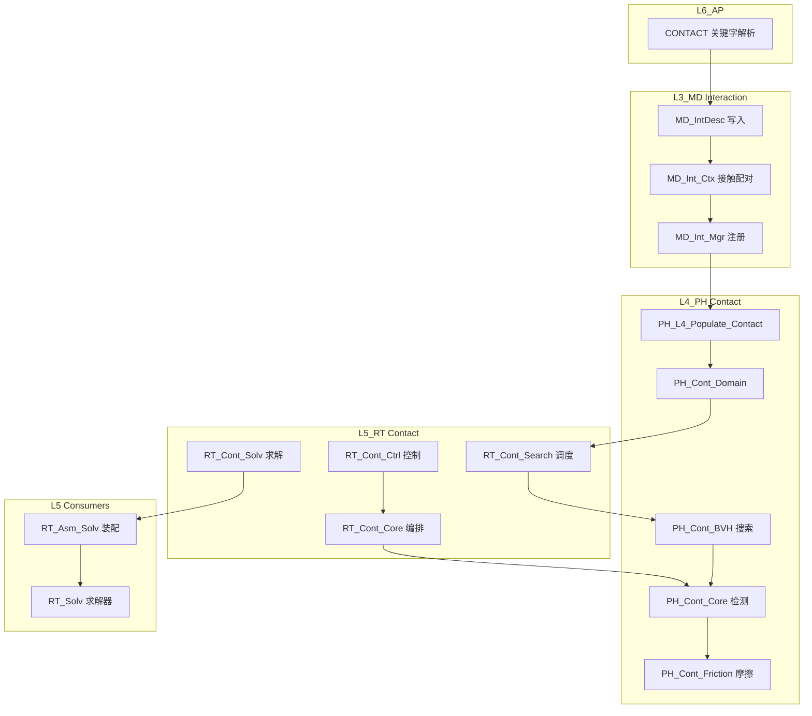

# L3_MD/L4_PH/L5_RT Contact 标准域柱卡

**域路径**：`L3_MD/Interaction` -> `L4_PH/Contact` -> `L5_RT/Contact`  
**角色**：P3 全贯通域柱 -- 接触定义真源(L3)、接触物理计算(L4)、接触调度(L5)  
**文档日期**：2026-04-28  
**柱型**：全柱（三层均有独立域目录）

---

## 0. 源文件与权威入口核对

| 项 | 说明 |
|----|------|
| 合同卡 | `L3_MD/Interaction/CONTRACT.md`、`L4_PH/Contact/CONTRACT.md`、`L5_RT/Contact/CONTRACT.md` |
| 设计文档 | `L4_PH/Contact/DESIGN_Cont_FourTypes.md`、`L4_PH/Contact/DESIGN_Contact_Domain.md` |
| 闭环测试 | `tests/TEST_Contact_L3_L4_Closure.f90`（待创建） |

---

## 1. 域职责十件套

| # | 项 | Contact 落地要点 |
|---|----|-----------------|
| 1 | **域定位** | L3/L4/L5 三层贯通域柱：L3 持有接触定义唯一真源（接触对/属性/摩擦模型参数），L4 承载接触物理计算（搜索/检测/法向/摩擦/罚函数），L5 驱动接触调度（搜索调度/接触循环/全局约束装配）。 |
| 2 | **职责边界** | **L3 负责**：接触对定义、属性参数、摩擦模型描述、接触面/节点集、解析映射。**L4 负责**：接触搜索算法(BVH)、穿透检测、法向力/摩擦力计算、罚函数/增广Lagrange、自接触、磨损/热接触。**L5 负责**：搜索调度时序、接触循环编排、全局约束装配、增广Lagrange求解。**禁止**：L3 执行搜索/穿透计算；L4 存储接触定义真源；L5 实现具体搜索/摩擦算法。 |
| 3 | **功能模块** | 见 Section 4 三层 `.f90` 清单。 |
| 4 | **四型 TYPE** | **Desc**：`MD_IntDesc`(L3 接触对/属性)。**State**：`PH_Cont_State`(L4 穿透量/接触力/滑移)。**Algo**：`PH_Cont_Algo`(L4 搜索参数/容差/罚刚度)。**Ctx**：`PH_Cont_Ctx`(L4 接触点对缓存) / `RT_Cont_Dispatch_Ctx`(L5 调度)。 |
| 5 | **公开接口** | 以各层 `CONTRACT.md` 为准。 |
| 6 | **数据所有权** | L3 持有接触定义权威真源；Populate 后 L4 持有运行期接触域；L5 持有调度上下文；热路径不反向读 L3。 |
| 7 | **依赖规则** | 允许：L4 经 Populate 读 L3 IntDesc；L5 经 Bridge 读 L4 Contact 域。禁止：L4 搜索循环内 USE L3 深层容器。 |
| 8 | **合同卡** | 三层各维护 `CONTRACT.md`。 |
| 9 | **Harness 验收** | 见 Section 6。 |
| 10 | **扩展点** | 新摩擦模型：通过 L4 Friction 子域扩展；磨损/热接触：通过 Wear/Thermal 子域；AI 搜索加速：通过 `PH_Cont_AI` 插槽。 |

---

## 2. 域柱定位与主链

Contact 是 P3 全贯通域柱。三层职责正交：

| 层 | 职责 | 禁止 |
|----|------|------|
| L3_MD | 接触定义真源：接触对/属性/摩擦模型参数/接触面/节点集 | 执行搜索/法向穿透计算 |
| L4_PH | 接触物理计算：搜索(BVH)/检测/法向/摩擦/罚函数/自接触/磨损/热 | 存储接触定义真源 |
| L5_RT | 接触调度：搜索调度/接触循环编排/全局约束装配/AugLag求解 | 实现具体搜索/摩擦算法 |

主链：

```text
MD_IntDesc(L3) + MD_Int_Ctx(L3)
  -> PH_L4_Populate_Contact(L4)
  -> PH_Cont_Def / PH_Cont_Core(L4)
  -> RT_Cont_Search(L5) -> PH_Contact_Search(L4 BVH)
  -> RT_Cont_Core(L5) -> PH_Cont_Core(L4 法向/摩擦)
  -> RT_Cont_Solv(L5) -> 全局约束装配
```

---

## 3. 四型裁剪决策

| 层 | Desc | State | Algo | Ctx |
|----|------|-------|------|-----|
| L3 | RETAINED(`MD_IntDesc`) | TRIMMED | TRIMMED | RETAINED(`MD_Int_Ctx`) |
| L4 | DELEGATED->L3(via Populate) | RETAINED(`PH_Cont_State`) | RETAINED(`PH_Cont_Algo`) | RETAINED(`PH_Cont_Ctx`) |
| L5 | DELEGATED | DELEGATED->L4 | DELEGATED->L4 | RETAINED(`RT_Cont_Dispatch_Ctx`) |

设计详情：`L4_PH/Contact/DESIGN_Cont_FourTypes.md`

---

## 4. .f90 功能模块清单（三层分列）

### 4.1 L3_MD/Interaction（真源层）

| 文件 | 后缀 | 模块命名 | 职责 | 现有 |
|------|------|----------|------|------|
| `MD_Int_Def.f90` | Def | `MD_Int_Def` | 四型TYPE：MD_IntDesc + 接触类型/属性常量 | Y |
| `MD_Int_Core.f90` | Core | `MD_Int_Core` | 接触域容器核心 | Y |
| `MD_Int_Ctx.f90` | Ctx | `MD_Int_Ctx` | 接触上下文（接触面/节点集/配对） | Y |
| `MD_Int_Mgr.f90` | Mgr | `MD_Int_Mgr` | 管理器：生命周期管理 | Y |
| `MD_Cont_Mgr.f90` | Mgr | `MD_Cont_Mgr` | 接触管理器（legacy 扩展） | Y |
| `MD_Int_API.f90` | API | `MD_Int_API` | 公开接口 API | Y |
| `Bridge_L5/MD_Int_Brg.f90` | Brg | `MD_Int_Brg` | L3→L5 接触桥（`L3_MD/Bridge/`，域内无存根） | Y |
| `MD_Int_Sync.f90` | Sync | `MD_Int_Sync` | L3 内同步 | Y |
| `MD_Int_Parser.f90` | Parse | `MD_Int_Parser` | 接触输入解析 | Y |
| `MD_Int_Mapper.f90` | Map | `MD_Int_Mapper` | 接触映射 | Y |
| `MD_Int_Connector.f90` | Brg | `MD_Int_Connector` | 连接器 | Y |
| `MD_Hash_Table.f90` | Util | `MD_Hash_Table` | 哈希表工具 | Y |

### 4.2 L4_PH/Contact（计算层）

| 文件 | 后缀 | 模块命名 | 职责 | 现有 |
|------|------|----------|------|------|
| `PH_Cont_Def.f90` | Def | `PH_Cont_Def` | L4 接触 TYPE 定义 | Y |
| `PH_Cont_Core.f90` | Core | `PH_Cont_Core` | 接触计算核心：法向/穿透/罚函数 | Y |
| `Core/PH_Cont_Mgr.f90` | Mgr | `PH_Cont_Mgr` | 算法框架 + 结构化 SIO 过程 | Y |
| `Core/PH_Cont_Brg.f90` | Brg | `PH_Cont_Brg` | L4 Bridge API | Y |
| `Core/PH_Cont_Ctx_Def.f90` | Ctx | `PH_Cont_Ctx_Def` | 上下文管理 (PH_ContactCtx) | Y |
| `Core/PH_Cont_CSR.f90` | CSR | `PH_Cont_CSR` | CSR 格式接触刚度装配 | Y |
| `Core/PH_Cont_NTS_Eval.f90` | Eval | `PH_Cont_NTS_Eval` | Node-to-Surface 算法 | Y |
| `Core/PH_Cont_NTS_Projection.f90` | Eval | `PH_Cont_NTS_Projection` | NTS 投影算法 | Y |
| `Core/PH_Cont_Penalty_Core.f90` | Eval | `PH_Cont_Penalty_Core` | 罚函数方法 | Y |
| `Core/PH_Cont_ALM_Core.f90` | Eval | `PH_Cont_ALM_Core` | 增广 Lagrange 方法 | Y |
| `Domain/PH_Cont_Domain.f90` | Domain | `PH_Cont_Domain` | 接触域容器 | Y |
| `Search/PH_Cont_Search.f90` | Eval | `PH_Cont_Search` | 接触搜索入口 | Y |
| `Search/PH_ContSearch_Adv.f90` | Eval | `PH_ContSearch_Adv` | 高级搜索算法 | Y |
| `Search/PH_Cont_BVHBuilder.f90` | Eval | `PH_Cont_BVHBuilder` | BVH 树构建 | Y |
| `Search/PH_Cont_BVHQuery.f90` | Eval | `PH_Cont_BVHQuery` | BVH 树查询 | Y |
| `Search/PH_Cont_CCD.f90` | Eval | `PH_Cont_CCD` | 连续碰撞检测 | Y |
| `Friction/PH_Cont_Friction.f90` | Eval | `PH_Cont_Friction` | 摩擦模型 | Y |
| `Friction/PH_Cont_Friction_Core.f90` | Eval | `PH_Cont_Friction_Core` | 摩擦核心算法 | Y |
| `Self/PH_Cont_SelfContact.f90` | Eval | `PH_Cont_SelfContact` | 自接触 | Y |
| `Thermal/PH_ThermalCont_Def.f90` | Def | `PH_ThermalCont_Def` | 热接触类型定义 | Y |
| `Thermal/PH_Cont_ThermoMech.f90` | Eval | `PH_Cont_ThermoMech` | 热力耦合接触 | Y |
| `Wear/PH_Cont_WearEvolution.f90` | Eval | `PH_Cont_WearEvolution` | 磨损演化 | Y |
| `Explicit/PH_Cont_Expl.f90` | Eval | `PH_Cont_Expl` | 显式接触 | Y |
| `AI/PH_AI_ContactLaw.f90` | Eval | `PH_AI_ContactLaw` | AI 搜索加速插槽 | Y |

### 4.3 L5_RT/Contact（调度层）

| 文件 | 后缀 | 模块命名 | 职责 | 现有 |
|------|------|----------|------|------|
| `RT_Cont_Def.f90` | Def | `RT_Cont_Def` | RT_Cont_Dispatch_Ctx / 调度常量 | Y |
| `RT_Cont_Core.f90` | Core | `RT_Cont_Core` | 接触调度核心 + 生命周期/注册（已合并原Core2） | Y |
| `RT_Cont_Search.f90` | Eval | `RT_Cont_Search` | 搜索调度编排 | Y |
| `RT_Cont_Solv.f90` | Solv | `RT_Cont_Solv` | 接触求解（罚函数/AugLag） | Y |
| `RT_Cont_AugLagSolv.f90` | Solv | `RT_Cont_AugLagSolv` | 增广 Lagrange 求解 | Y |
| `RT_Cont_Ctrl.f90` | Exec | `RT_Cont_Ctrl` | 接触控制 | Y |
| `RT_Cont_Brg.f90` | Brg | `RT_Cont_Brg` | L4->L5 接触桥接 | Y |
| `RT_Cont_Expl.f90` | Exec | `RT_Cont_Expl` | 显式接触调度 | Y |

### 4.4 L5 消费点

| L5 文件 | 消费性质 |
|---------|----------|
| `L5_RT/Assembly/RT_Asm_Solv.f90` | 装配过程中的接触约束贡献 |
| `L5_RT/Solver/*` | 求解器消费接触残差/刚度贡献 |
| `L5_RT/StepDriver/*` | 步驱动中接触状态更新编排 |

---

## 5. 数据生命周期图



---

## 6. Harness 验收项

| 类别 | 验收项 |
|------|--------|
| **命名** | `MD_Int_*` / `PH_Cont_*` / `RT_Cont_*` 前缀与层域一致。 |
| **依赖/架构** | L4 搜索循环内禁止 USE L3 深层容器。 |
| **合同** | 三层 `CONTRACT.md` 存在且一致。 |
| **金线闭环** | L3 注册 -> L4 Populate -> L5 Search -> L4 Detect -> 装配验证。 |
| **四型** | `DESIGN_Cont_FourTypes.md` 与 TYPE 模块字段一致。 |
| **搜索覆盖** | NTS/STS/Mortar/自接触 最小搜索矩阵可达。 |

---

## 7. 清旧资产台账

| 文件 | 处置 | 说明 |
|------|------|------|
| `RT_Cont_Core2.f90` | **已合并** | 已合并入 `RT_Cont_Core.f90`，文件已删除 (2026-04-28) |
| `MD_Int_API.f90` (239KB) | 瘦身 | 过大，评估拆分为功能子模块 |

---

## 8. 域间关系表

| 关系类型 | 从 | 到 | 机制 |
|----------|----|----|------|
| **包含** | `L3_MD` | `Interaction/` | 目录与模块前缀 `MD_Int_*` |
| **包含** | `L4_PH` | `Contact/` | 目录与模块前缀 `PH_Cont_*` |
| **包含** | `L5_RT` | `Contact/` | 目录与模块前缀 `RT_Cont_*` |
| **数据** | `L3_MD` | `L4_PH` | Populate：L3 IntDesc -> L4 Contact Domain |
| **数据** | `L4_PH` | `L5_RT` | Bridge：L4 域 -> L5 调度 |
| **执行** | `L5_RT` | `L4_PH` | Dispatch：L5 Search/Ctrl -> L4 BVH/Detect/Friction |
| **耦合** | `Element` | `Contact` | L4 单元面提供接触面几何 |
| **耦合** | `Material` | `Contact` | L4 摩擦模型消费材料属性 |
